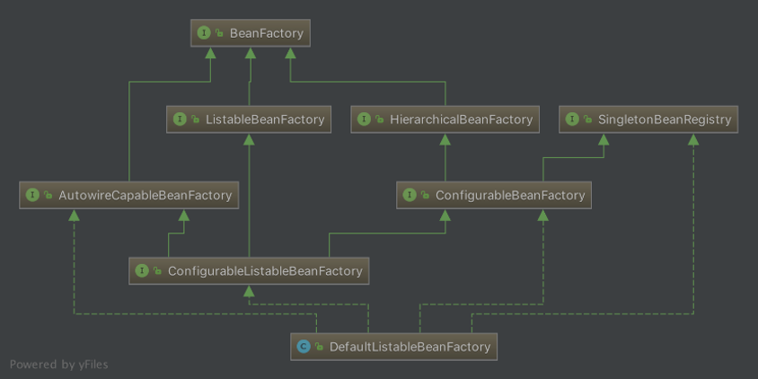
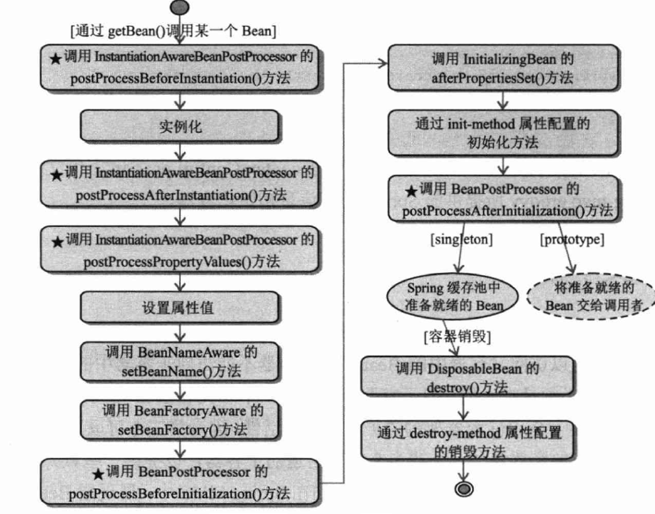
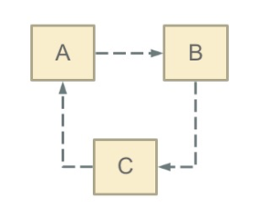
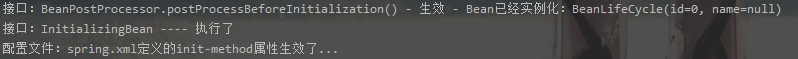

# 1.Bean生命周期

Bean是spring最基础、最根本的点，一个Bean其实就是一个组件，Bean的生命周期，其实就是学习spring是咋样实例化组件并且将其注册到容器中。spring 只会管理单例模式 Bean 的完整生命周期，对于 prototype类型的 bean，spring 在创建好交给使用者之后则不会再管理后续的生命周期。下图是spring的Bean工厂的整体类图：



## 1.1.Bean生命周期流程

博客推荐：https://segmentfault.com/a/1190000015830477。spring创建Bean分为两个阶段：**实例化**和**初始化**

1. 实例化：是一个创建Bean的过程，即反射调用构造函数，并为其属性赋值

2. 初始化：是一个修饰Bean的过程，即按照用户的意图，修改Bean的属性



### 1.1.1.preInstantiateSingletons()

在IOC容器启动起点中，我们知道spring开始初始化Bean是在refresh()方法中finishBeanFactoryInitialization()方法，此方法的最后一行会调用DefaultListableBeanFactory类的preInstantiateSingletons()方法。这里就是Bean开始被加载到IOC容器的起点，源码：

```java
//源码：DefaultListableBeanFactory--728行
public void preInstantiateSingletons() throws BeansException {
  // this.beanDefinitionNames是spring类扫描阶段获取到的注册顺序中的bean定义名称列表
  List<String> beanNames = new ArrayList<String>(this.beanDefinitionNames);
  
  // 触发所有非懒加载的单例Bean的初始化  返回合并的RootBeanDefinition
  for (String beanName : beanNames) {
    
    //将bean定义名称合并返回一个RootBeanDefinition（只有存在子Bean，才会有合并）
    RootBeanDefinition bd = getMergedLocalBeanDefinition(beanName);
    
    if (!bd.isAbstract() && bd.isSingleton() && !bd.isLazyInit()) {
      
      // 当一个类实现了FactoryBean接口，表明它是一个工厂，用来创建普通组件Bean的
      // 例如：mybatis与spring结合时，就会创建MapperFactoryBean，
      // 然后由它来创建Mapper接口代理类，所以mybatis的mapper接口就会走这个方法...
      if (isFactoryBean(beanName)) {
        
        // 创建FactoryBean对象，注意这边会加一个前缀FACTORY_BEAN_PREFIX,它的值为&
        final FactoryBean<?> factory = (FactoryBean<?>) getBean(
          FACTORY_BEAN_PREFIX + beanName);
        
        // 这个变量是为了区分普通的FactoryBean和SmartFactoryBean.
        // 一般的FactoryBean，都是在真正需要(即调用getBean())时，才会调用接口的
        // getObject()方法，获取工厂创建出来的Bean；而SmartFactoryBean与其相反
        // 它很饥渴，饥渴到在创建它自身的同时，就要获取它能创建出来的Bean组件
        // (这里源码做过简化处理，spring在这边加了SecurityManager安全判断)
        boolean isEagerInit = (factory instanceof SmartFactoryBean &&
                               ((SmartFactoryBean<?>) factory).isEagerInit());
        
        if (isEagerInit) {
          getBean(beanName);
        }
      }else {
        // 如果当前要创建的Bean对象不是一个工厂对象，则会调用AbstractBeanFactory
        // 的getBean()方法，一般自定义的组件都会到这里，通过此方法创建
        getBean(beanName);
      }
    }
  }
  // 对实现了SmartInitializingSingleton接口的Bean进行后初始化回调.
  for (String beanName : beanNames) {
    Object singletonInstance = getSingleton(beanName);
    if (singletonInstance instanceof SmartInitializingSingleton) {
      final SmartInitializingSingleton smartSingleton = 
        	(SmartInitializingSingleton) singletonInstance;
      // (这里的源码做了简化处理, spring加了SecurityManager安全判断)
      smartSingleton.afterSingletonsInstantiated();
    }
  }
}
```

### 1.1.2.doGetBean()

IOC容器中的所有getBean()方法，最终都是调用AbstractBeanFactory的doGetBean()方法。在这里会包含了整个Bean生命周期

```java
/**
  * @param name要获取的Bean名称
  * @param requiredType要获取的Bean类型
  * @param args使用显式参数创建Bean实例时要使用的参数(仅在创建新实例而不是获取现有实例时适用)
  * @param typeCheckOnly 是否获取实例以进行类型检查,一般为false
  */
  //源码：AbstractBeanFactory--235行
  protected <T> T doGetBean(final String name, final Class<T> requiredType, 
          final Object[] args, boolean typeCheckOnly) throws BeansException {
    
  // 去除FactoryBean的前缀符号“&”，并且如果有设置别名，从aliasMap中获取其别名
  final String beanName = transformedBeanName(name);
    
  //方法待返回的Bean
  Object bean; 
    
  // 先从缓存singletonObjects中看一看能不能获取到此Bean
  Object sharedInstance = getSingleton(beanName);
    
  if (sharedInstance != null && args == null) {
    
    //如果缓存中已经存在当前所需的Bean并且args参数为空时，就会返回Bean实例
    bean = getObjectForBeanInstance(sharedInstance, name, beanName, null);
    
  }else { // 如果缓存没有当前Bean，则开始创建它
    
    if (isPrototypeCurrentlyInCreation(beanName)) {
      // spring会用两个对象来保存正在创建的Bean,它们位于AbstractBeanFactory-170行:
      // 单例Bean, 用set集合保存; 多实例Bean, 用ThreadLocal保存. 上面这个方法就是
      // 来判断当前Bean是不是多实例并且处于正在创建的状态, 是的话就会抛错...
      throw new BeanCurrentlyInCreationException(beanName);
    }
    
    // 如果此Bean工厂存在父级工厂, 同时自身不包含此Bean的BeanDefinition对象, 就委托父级工厂创建Bean
    BeanFactory parentBeanFactory = getParentBeanFactory();
    if (parentBeanFactory != null && !containsBeanDefinition(beanName)) {
      String nameToLookup = originalBeanName(name);
      if (args != null) return (T) parentBeanFactory.getBean(nameToLookup, args);
      else return parentBeanFactory.getBean(nameToLookup, requiredType);
    }
    
    // 当用户不仅仅是做类型检查(言外之意就是创建Bean)将此BeanName保存到alreadyCreated
    // 集合中，表示它已经被创建过了
    if (!typeCheckOnly) {
      markBeanAsCreated(beanName);
    }
    
    try {
      // 通过beanName获取BeanDefinition对象，并且确定它不是抽象类
      final RootBeanDefinition mbd = getMergedLocalBeanDefinition(beanName);
      checkMergedBeanDefinition(mbd, beanName, args);
      
      // 保证当前bean依赖的其它bean先被初始化
      String[] dependsOn = mbd.getDependsOn();
      
      if (dependsOn != null) {
        for (String dep : dependsOn) {
          // 这里会来判断是否发生了循环依赖，如果是，方法抛出异常
          if (isDependent(beanName, dep)) {
            throw new BeanCreationException(mbd.getResourceDescription(), 
                beanName,"Circular depends-on relationship between '" + 
                 beanName + "' and '" + dep + "'");
          }
          
          // 如果没有发生循环依赖, 这里会注册Bean之间的依赖关系, 具体看
          // DefaultSingletonBeanRegistry--413行-registerDependentBean()方法
          registerDependentBean(dep, beanName);
          
          // 然后优先注册当前Bean依赖的其它Bean
          getBean(dep);
        }
      }
      
      /** 开始Bean生命周期流程，创建当前Bean对象 */
      
      // 根据Bean定义mbd，判断它是属于哪种作用域，这里是分为3种：单例、多例和其它
      // 如果是单例，调用DefaultSingletonBeanRegistry的getSingleton()方法，此方法
      // 需要一个ObjectFactory参数，这里是创建ObjectFactory接口的匿名实现类来创建Bean
      // 对象，它实际调用的是createBean()方法
      if (mbd.isSingleton()) {
        sharedInstance = getSingleton(beanName, new ObjectFactory<Object>() {
          @Override
          public Object getObject() throws BeansException {
            try {
              return createBean(beanName, mbd, args);
            }catch (BeansException ex) {
              // 创建异常则销毁当前Bean
              destroySingleton(beanName);
              throw ex; }
          }
        });
        bean = getObjectForBeanInstance(sharedInstance, name, beanName, mbd);
      }
      // Bean是多例情况
      else if (mbd.isPrototype()) {
        Object prototypeInstance = null;
        try {
          //如果是多实例创建，spring会多出一步，把当前要创建的beanName保存到
          //prototypesCurrentlyInCreation中(它是一个ThreadLocal)，表示此Bean正在被创建
          beforePrototypeCreation(beanName);
          
          //调用createBean()方法去创建Bean
          prototypeInstance = createBean(beanName, mbd, args);
          
        }finally {
          // 当创建完以后，这里会清空ThreadLocal内部的数据
          afterPrototypeCreation(beanName); 
        }
        //处理创建好的Bean，返回Bean实例（因为可能创建的是FactoryBean,由它生成对象）
        bean = getObjectForBeanInstance(prototypeInstance, name, beanName, mbd);
      }
   		// Bean是其它作用域 (需要提前实现Scope接口)
      else {
        // 获取用户自定义的作用域类型Scope
        String scopeName = mbd.getScope();
        final Scope scope = this.scopes.get(scopeName);
        if (scope == null) { throw new IllegalStateException();}
        try {
          // 调用org.springframework.beans.factory.config.Scope的get()方法获取实例
          // 这里的步骤跟多实例是一样的，包括：保存Bean创建状态 + 真正创建Bean
          Object scopedInstance = scope.get(beanName, new ObjectFactory<Object>() {
            @Override
            public Object getObject() throws BeansException {
              beforePrototypeCreation(beanName);
              try {
                return createBean(beanName, mbd, args);
              }finally {
                afterPrototypeCreation(beanName);
              }
            }
          });
          bean = getObjectForBeanInstance(scopedInstance, name, beanName, mbd);
        } catch (IllegalStateException ex) {
          throw new BeanCreationException();
        }
      }
    } catch (BeansException ex) {
      // 上面三种作用域，创建Bean异常时，调用此方法
      cleanupAfterBeanCreationFailure(beanName);
      throw ex;
    }
  }
  // 如果用户指定了需要某种类型的Bean, spring会在这里进行类型转换, 例如保存在spring容器
  // 的Bean类型为string, 但实际上需要的是Integer, 这里的代码就可以做类型转换.
  if (requiredType != null && bean != null && 
      !requiredType.isAssignableFrom(bean.getClass())) {
    try {
      return getTypeConverter().convertIfNecessary(bean, requiredType);
    }catch (TypeMismatchException ex) {
      throw new BeanNotOfRequiredTypeException(name, requiredType, bean.getClass());
    }
  }
  return (T) bean;
}
```

#### 1.1.2.1.返回Bean实例(FactoryBean处理)

如果缓存中已经存在Bean，spring会调用getObjectForBeanInstance()方法获取指定bean实例的对象，该实例可以是bean 实例本身，也可以是FactoryBean创建的对象。源码：

```java
/**
 * @param beanInstance 共享的Bean实例
 * @param name 可能包含工厂取消引用前缀的名称
 * @param beanName Bean实例名称
 * @param mbd 合并的BbeanDefinition
 */
//源码：AbstractBeanFactory--1607行
protected Object getObjectForBeanInstance( Object beanInstance, String name, 
                                          String beanName, RootBeanDefinition mbd) {
  // 如果name前缀是“&”,但是beanInstance却不是工厂类,则抛出异常
  if (BeanFactoryUtils.isFactoryDereference(name) && 
      !(beanInstance instanceof FactoryBean)) {
    throw new BeanIsNotAFactoryException(transformedBeanName(name),beanInstance.getClass());
  }
  
  // 如果beanInstance不是一个工厂类(即普通Bean组件)
  // 或者name前缀是“&”(即调用者就想获取工厂类对象，从这可以看出当我们想获取工厂类自身时
  // 在beanName之前加个&即可)
  if (!(beanInstance instanceof FactoryBean) || 
      BeanFactoryUtils.isFactoryDereference(name)) {
    return beanInstance;
  }
  
  Object object = null;
  if (mbd == null) {
    //先从FactoryBean创建的Bean缓存factoryBeanObjectCache中获取beanName指定的对象
    object = getCachedObjectForFactoryBean(beanName);
  }
  
  if (object == null) {
    FactoryBean<?> factory = (FactoryBean<?>) beanInstance;
    
    //获取合并的RootBeanDefinition(存在父子级关系才有合并的操作)
    if (mbd == null && containsBeanDefinition(beanName)) {
      mbd = getMergedLocalBeanDefinition(beanName);
    }
    
    // mbd.isSynthetic()表示此Bean定义不是由应用程序本身定义的
    boolean synthetic = (mbd != null && mbd.isSynthetic());
    
    // 调用FactoryBeanRegistrySupport的getObjectFromFactoryBean()方法，它会
    // 回调FactoryBean.getObejct()方法获取Bean实例(这里会区分FactoryBean创建
    // 的Bean实例是单例的还是多实例的)...省略此方法代码...
    object = getObjectFromFactoryBean(factory, beanName, !synthetic);
    
  }
  // 如果缓存中存在此Bean，那么就直接返回了
  return object;
}
```

#### 1.1.2.2循环依赖判断(@DependsOn)

spring会在这里解决@DependsOn注解引起的循环依赖（提醒：[实例化Bean的循环依赖](#3.1.7.Bean实例循环依赖)）它会调用DefaultSingletonBeanRegistry的isDependent()来判断是否发生循环依赖，但是在那之前需要先弄懂DefaultSingletonBeanRegistry的两个成员变量dependentBeanMap和dependenciesForBeanMap

(友情提示：它们两个相当于索引与倒排索引的关系)

```java
// 保存被其它Bean依赖的Bean集合, 比如Bean2,Bean3的创建依赖于Bean1, 那么Bean1就会作为
// key保存在此Map中, 它的value值为Bean2和Bean3 (此Map可以理解为倒排索引)
private final Map<String, Set<String>> dependentBeanMap = 
	new ConcurrentHashMap<String, Set<String>>(64);

// 保存Bean所依赖的其它Bean集合, 比如 Bean2,Bean3的创建依赖于Bean1,那么Bean2,Bean3就
// 会作为key保存在此Map中, 它们的value值都是Bean1 (此Map可以理解成正向索引)
private final Map<String, Set<String>> dependenciesForBeanMap = 
	new ConcurrentHashMap<String, Set<String>>(64);
```

isDependent()方法源码如下：

```java
/**
 * 此方法是一个递归方法,它会一层一层判断，Bean之间的依赖是否存在回路
 * 
 * @param beanName 当前要校验的Bean名称
 * @param dependentBeanName 当前Bean所依赖的Bean名称
 * @param alreadySeen 当已经校验好的Bean名称
 * @return true 发生循环依赖了
 */
//源码：DefaultSingletonBeanRegistry--451行
private boolean isDependent(String beanName, String dependentBeanName, 
                            Set<String> alreadySeen) {
  // 递归中止条件一：当前BeanName已经被校验过，未发生循环依赖，方法返回false
  if (alreadySeen != null && alreadySeen.contains(beanName)) {
    return false;
  }
  
  // 获取当前要校验Bean的别名
  String canonicalName = canonicalName(beanName);
  
  // 这里有点绕, 需要注意：获取依赖于当前待校验Bean的其它Bean集合(BeanName集合)
  // 即：Bean1和Bean2的创建依赖于当前Bean, 则Bean1和Bean2就会放在dependentBeans上
  Set<String> dependentBeans = this.dependentBeanMap.get(canonicalName);
  
  // 递归中止条件二：当前Bean没有被其它Bean依赖, 方法返回false
  if (dependentBeans == null) 
    return false;
  
  // 递归中止条件三：依赖于当前Bean的其它Bean集合中包含当前Bean所依赖的Bean, 即发生
  //                 循环依赖了, 方法返回true
  if (dependentBeans.contains(dependentBeanName)) 
    return true;
  
  for (String transitiveDependency : dependentBeans) {
    if (alreadySeen == null) 
      alreadySeen = new HashSet<String>();
    // 代码走到这边, 说明当前beanName与dependentBeanName不存在依赖关系, 可以把
    // 当前beanName放入到集合alreadySeen中.
    alreadySeen.add(beanName);
    
    // 这边递归的意思类似这样：
    // 假设当前beanName为B, 被它依赖的Bean为A, 即A依赖于B, 关系为 A → B
    // 而当前beanName又依赖于C, 关系为 B → C, 那么是不是要判断 AC之间是不是也存在依赖?
    // 所以这里就是拿着依赖于B的集合transitiveDependency(上例中A的集合)来与
    // dependentBeanName(上例中的C)判断循环依赖问题, 只要其中一个元素存在循环依赖.
    // 方法立马返回true
    if (isDependent(transitiveDependency, dependentBeanName, alreadySeen)) {
      return true;
    }
  }
  // 能到这里, 表示肯定没有循环依赖啦！！！
  return false;
}
```

### 1.1.3.getSingleton

当创建的Bean属于单例（即ConfigurableBeanFactory.SCOPE_SINGLETON），spring就会调用DefaultSingletonBeanRegistry的getSingleton()方法尝试先从缓存中获取，取不到在自己创建Bean。DefaultSingletonBeanRegistry有3个成员变量与方法getSingleton()有关，它们表示的意思如下：

```java
//spring创建Bean之前会检查是否满足创建条件，当不需要检查时，会把BeanName放到下面这个集合
private final Set<String> inCreationCheckExclusions =
  Collections.newSetFromMap(new ConcurrentHashMap<String, Boolean>(16));

//当spring正在创建Bean时，就会把BeanName放到这个集合
private final Set<String> singletonsCurrentlyInCreation =
  Collections.newSetFromMap(new ConcurrentHashMap<String, Boolean>(16));

//单例Bean的缓存Map : bean name --> bean instance
private final Map<String, Object> singletonObjects = 
  new ConcurrentHashMap<String, Object>(256);
```

getSingleton()用来获取指定beanName的单例Bean实例，如果实例还未注册到IOC容器中，则创建它(Bean生命周期)并将其加入到单例缓存集合中，即上面的成员变量singletonObjects。源码为：

```java
//源码：DefaultSingletonBeanRegistry--210行
public Object getSingleton(String beanName, ObjectFactory<?> singletonFactory) {
  Assert.notNull(beanName, "'beanName' must not be null");
  synchronized (this.singletonObjects) {
    // 双检锁检查，确保缓存中确实没有当前Bean的实例对象
    Object singletonObject = this.singletonObjects.get(beanName);
    
    // 缓存中不存在就调用方法参数singletonFactory来创建一个Bean
    if (singletonObject == null) {
      
      //创建Bean之前的检查，与下面的创建Bean之后检查相对应
      //根据成员变量inCreationCheckExclusions和singletonsCurrentlyInCreation来判断
      //Bean是否正在被创建，因为它是往singletonsCurrentlyInCreation(set集合)添加
      //BeanName,如果添加不进去，说明此时正在创建此Bean,就会抛出异常   
      //BeanCurrentlyInCreationException
      beforeSingletonCreation(beanName);
      
      boolean newSingleton = false;
      
      // 用来处理异常用的
      boolean recordSuppressedExceptions = (this.suppressedExceptions == null);
      if (recordSuppressedExceptions) {
        this.suppressedExceptions = new LinkedHashSet<Exception>();
      }
      
      try {
        // 调用参数singletonFactory来创建Bean，根据doGetBean()方法的源码，这个
        // singletonFactory是接口ObjectFactory的一个匿名实现类，实际调用的是
        // AbstractAutowireCapableBeanFactory的createBean()方法
        singletonObject = singletonFactory.getObject();
        newSingleton = true;
      }catch (IllegalStateException ex) {
        // Has the singleton object implicitly appeared in the meantime ->
        // if yes, proceed with it since the exception indicates that state.
        singletonObject = this.singletonObjects.get(beanName);
        if (singletonObject == null)  throw ex;
      }catch (BeanCreationException ex) {
        // 设置创建Bean异常的关联原因
        if (recordSuppressedExceptions) {
          for (Exception suppressedException : this.suppressedExceptions) {
            ex.addRelatedCause(suppressedException);
          }
        }
        throw ex;
      }finally {
        if (recordSuppressedExceptions) this.suppressedExceptions = null;
        //创建Bean之后的检查，与上面的创建Bean之前检查相对应
        //这里会把BeanName从singletonsCurrentlyInCreation(set集合)移除掉，如果移除
        //失败，说明singletonsCurrentlyInCreation根本不存在此BeanName，就会抛出
        //IllegalStateException
        afterSingletonCreation(beanName);
      }
      //在没有异常情况下，创建完Bean之后，newSingleton会变为true，此时spring就会将其
      //保存到缓存ingletonObjects中
      if (newSingleton) {
        addSingleton(beanName, singletonObject);
      }
    }
    // 如果缓存singletonObjects已经存在当前Bean，就直接返回
    return (singletonObject != NULL_OBJECT ? singletonObject : null);
  }
}
```

### 1.1.4.createBean()

当spring缓存中没有当前需要的Bean实例，又或者Bean实例的作用域是非单例的(即多例和用户自定义的作用域)，spring就会调用createBean()方法来创建一个Bean实例，其实这里才是Bean生命周期的开始。源码为：

```java
//源码：AbstractAutowireCapableBeanFactory--447行
/**
 * 方法参数
 * 
 * @param beanName 当前要创建的Bean名称
 * @param mbd已经合并了父类属性的（如果有的话）BeanDefinition 对象
 * @param args用于构造函数或者工厂方法创建 Bean 实例对象的参数
 */
protected Object createBean(String beanName, RootBeanDefinition mbd, 
                            Object[] args) throws BeanCreationException {
  // 类型检查, 确保当前要创建的Bean被实际解析
  // 如果是动态解析的类, 无法存储在共享的合并bean定义中，则复制bean定义
  RootBeanDefinition mbdToUse = mbd;
  Class<?> resolvedClass = resolveBeanClass(mbd, beanName);
  if (resolvedClass != null && !mbd.hasBeanClass() && mbd.getBeanClassName() != null) {
    mbdToUse = new RootBeanDefinition(mbd);
    mbdToUse.setBeanClass(resolvedClass);
  }
  
  try {
    // 验证当前Bean的重载方法(override)
    mbdToUse.prepareMethodOverrides();
  }catch (BeanDefinitionValidationException ex) {
    throw new BeanDefinitionStoreException(mbdToUse.getResourceDescription(),
                beanName, "Validation of method overrides failed", ex);
  }
  
  try {
    // 这边开始Bean生命周期的经典流程，转到Bean实例化前置处理
    Object bean = resolveBeforeInstantiation(beanName, mbdToUse);
    if (bean != null)  
      return bean;
  }catch (Throwable ex) {
    throw new BeanCreationException(mbdToUse.getResourceDescription(), beanName,
              "BeanPostProcessor before instantiation of bean failed", ex);
  }
  
  //开始真正创建Bean实例，调用doCreateBean()方法
  Object beanInstance = doCreateBean(beanName, mbdToUse, args);
  return beanInstance;
}
```

#### 1.1.4.1.Bean实例化前置处理

在[createBean()](#3.1.4.createBean())方法中会调用所有InstantiationAwareBeanPostProcessor接口的postProcessBeforeInstantiation()方法。若有接口自己初始化Bean，spring就会回调BeanPostProcessor.postProcessAfterInitialization()，然后直接将此Bean返回，就不会再经spring之手初始化了...（在createBean()方法可以看到bean只要不为空，方法就返回了）

```java
//源码：AbstractAutowireCapableBeanFactory -1004行
protected Object resolveBeforeInstantiation(String beanName,RootBeanDefinition mbd) {
  Object bean = null;
  if (!Boolean.FALSE.equals(mbd.beforeInstantiationResolved)) {
    if (!mbd.isSynthetic() && hasInstantiationAwareBeanPostProcessors()) {
      Class<?> targetType = determineTargetType(beanName, mbd);
      if (targetType != null) {
        //回调InstantiationAwareBeanPostProcessor接口进行实例化-接口详情
        bean = applyBeanPostProcessorsBeforeInstantiation(targetType, beanName);
        if (bean != null) {
          //若接口有返回Bean实例, 则直接调用BeanPostProcessor后置处理该Bean
          bean = applyBeanPostProcessorsAfterInitialization(bean, beanName);
        }
      }
    }
    mbd.beforeInstantiationResolved = (bean != null);
  }
  return bean;
}
```

### 1.1.5.doCreateBean()

若没有任何一个InstantiationAwareBeanPostProcessor能为当前Bean实例化一个实例，则spring就会尝试自己来实例化，调用doCreateBean()方法，从0到1创建出一个Bean出来，源码为：

```java
//源码：AbstractAutowireCapableBeanFactory -- 504行
protected Object doCreateBean(final String beanName, final RootBeanDefinition mbd, 
                              final Object[] args) throws BeanCreationException {
  // BeanWrapper, 顾名思义：Bean包装类, 它定义的功能很简单包括设置获取被包装的对象,
  // 获取被包装 bean 的属性描述器
  BeanWrapper instanceWrapper = null;

  if (mbd.isSingleton()) {
    // this.factoryBeanInstanceCache, 是未完成的FactoryBean实例的缓存, 即清理缓存
    instanceWrapper = this.factoryBeanInstanceCache.remove(beanName);
  }
  
  if (instanceWrapper == null) {
    // 调用AbstractAutowireCapableBeanFactory的createBeanInstance()实例化Bean，转实例化Bean
    instanceWrapper = createBeanInstance(beanName, mbd, args);
  }
  
  //尝试从Bean包装类对象instanceWrapper中取出Bean实例和Class类型
  final Object bean = (instanceWrapper != null ? 
                       instanceWrapper.getWrappedInstance() : null);
  Class<?> beanType = (instanceWrapper != null ? 
                       instanceWrapper.getWrappedClass() : null);
  
  //设置当前Bean定义对象BeanDefinition的包可见字段
  mbd.resolvedTargetType = beanType;
  
  //如果有后置处理，则回调MergedBeanDefinitionPostProcessor修改BeanDefinition
  synchronized (mbd.postProcessingLock) {
    if (!mbd.postProcessed) {
      try {
        applyMergedBeanDefinitionPostProcessors(mbd, beanType, beanName);
      }catch (Throwable ex) {
        throw new BeanCreationException(...);
      }
      mbd.postProcessed = true;
    }
  }
  
  /** spring循环依赖解决, 转看spring循环依赖 */
  
  // 当前Bean刚被实例化出来, 但是未被初始化(初始化代码还在后面), 但是spring会提前曝光此Bean(只需要拿到对
  // 象内存引用, 就可以拥有此对象, 即使它数据还未初始化), 将beanName和创建它的工厂ObjectFactory缓存起
  // 来...是否需要这样做, 由下面变量earlySingletonExposure来决定, 它由3个部分来共同判定！
  boolean earlySingletonExposure = (mbd.isSingleton() && //是否单例
               this.allowCircularReferences && //Bean工厂是否自动尝试解析循环引用
               isSingletonCurrentlyInCreation(beanName));//当前Bean是否正被创建
  
  if (earlySingletonExposure) {
    // 提前将创建的 bean 实例加入到 singletonFactories 缓存中
    // addSingletonFactory()方法 -- DefaultSingletonBeanRegistry,160行
    addSingletonFactory(beanName, new ObjectFactory<Object>() {
      @Override
      public Object getObject() throws BeansException {
        // AbstractAutowireCapableBeanFactory -- 876行
        // 它实际上是调用SmartInstantiationAwareBeanPostProcessor后置处理器
        // 来创建Bean实例
        return getEarlyBeanReference(beanName, mbd, bean);
      }
    });
  }
  
  /** 从这里开始, 就属于：初始化Bean实例阶段 */
  
  Object exposedObject = bean;
  try {
    // 实例化Bean后处理, 为实例好的Bean做属性赋值，转看Bean实例化后置处理
    populateBean(beanName, mbd, instanceWrapper);
    
    if (exposedObject != null) {
      // 回调该Bean实现的所有Aware接口，转看回调Aware接口
      // 回调所有BeanPostProcessor，转看回调后置处理器-初始化前
      // 初始化Bean，回调InitializingBean和init-method，转看回调初始化配置
      // 回调所有BeanPostProcessor，转看回调后置处理器-初始化后
      exposedObject = initializeBean(beanName, exposedObject, mbd);
    }
    
  }catch (Throwable ex) {
    //...异常处理
  }
  // 循环依赖处理
  if (earlySingletonExposure) {
    // 调用上面为了解决潜在循环依赖而缓存的beanName和ObjectFactory
    // 先从缓存中取，取不到再调用ObjectFactory.getObject()方法获取Bean实例
    Object earlySingletonReference = getSingleton(beanName, false);
    
    // 当创建的Bean不为空时，才有下面的故事
    if (earlySingletonReference != null) {
      if (exposedObject == bean) {
        exposedObject = earlySingletonReference;
      }else if (!this.allowRawInjectionDespiteWrapping && hasDependentBean(beanName)) {
        // 获取其它Bean对象(这些对象依赖于当前要创建的bean)
        String[] dependentBeans = getDependentBeans(beanName);
        Set<String> actualDependentBeans = new LinkedHashSet<String>(dependentBeans.length);
        for (String dependentBean : dependentBeans) {
          if (!removeSingletonIfCreatedForTypeCheckOnly(dependentBean)) {
            actualDependentBeans.add(dependentBean);
          }
        }
        if (!actualDependentBeans.isEmpty()) {
          throw new BeanCurrentlyInCreationException();
        }
      }
    }
  }
  // 如果当前Bean实现了DisposableBean或者指定destroy-method，spring会将这些都封装成 
  // DisposableBeanAdapter，然后在容器关闭时，通过映射关系找到并调用其 destroy 方法
  // 转看注册Bean销毁适配器
  try {
    registerDisposableBeanIfNecessary(beanName, bean, mbd);
  } catch (BeanDefinitionValidationException ex) {
    throw new BeanCreationException();
  }
  return exposedObject;
}
```

#### 1.1.5.1.实例化Bean

当没有任何InstantiationAwareBeanPostProcessor接口返回Bean实例，spring会选取合适的实例化策略(即：接口InstantiationStrategy)它会有三个策略：工厂方法、构造函数自动注入和简单初始化来实例化Bean：

```java
//源码：AbstractAutowireCapableBeanFactory-1057行
protected BeanWrapper createBeanInstance(String beanName, RootBeanDefinition mbd,
                                         Object[] args) {
  // 省略一些校验代码
  // ...

  // 如果待实例化的Bean指定了工厂方法来实例化，就调用指定工厂方法来创建(这个方法实在大)
  if (mbd.getFactoryMethodName() != null)  {
    return instantiateUsingFactoryMethod(beanName, mbd, args);
  }
  
  // Shortcut when re-creating the same bean...
  boolean resolved = false;
  boolean autowireNecessary = false;
  if (args == null) {
    // 构造函数的对象锁
    synchronized (mbd.constructorArgumentLock) {
      // 由于要根据参数来决定使用当前Bean的哪个构造方法比较耗性能, 所以spring做了
      // 缓存处理, 这些信息保存在  resolvedConstructorOrFactoryMethod 里面, 如果
      // 这个值不为空, 则可以直接使用构造函数或者工厂方法生成实例...
      if (mbd.resolvedConstructorOrFactoryMethod != null) {
        resolved = true;
        autowireNecessary = mbd.constructorArgumentsResolved;
      }
    }
  }
  
  if (resolved) {
    if (autowireNecessary) {
      // 调用带参构造函数
      return autowireConstructor(beanName, mbd, null, null);
    } else {
      // 使用默认的构造函数
      return instantiateBean(beanName, mbd);
    }
  }
  
  // 调用需要参数的构造函数, 如果一个Bean的构造方法需要其它Bean实例, 就会调用autowireConstructor(), 
  // 它会先去找依赖的Bean是否加载进来了, 即调用getSingleton()方法, 如果依赖的Bean未加载, spring就先加载
  // 它, 然后再来完成当前Bean的实例化操作. 当然如果它们相互引用, 那就变成循环依赖问题.
  Constructor<?>[] ctors = 
    determineConstructorsFromBeanPostProcessors(beanClass, beanName);
  if (ctors != null ||
      mbd.getResolvedAutowireMode() == RootBeanDefinition.AUTOWIRE_CONSTRUCTOR ||
      mbd.hasConstructorArgumentValues() || !ObjectUtils.isEmpty(args))  {
    return autowireConstructor(beanName, mbd, ctors, args);
  }
  // 调用简单无参的构造函数
  return instantiateBean(beanName, mbd);
}
```

InstantiationStrategy 接口定义了 Spring Bean 实例化的策略，根据创建对象情况的不同，提供了三种策略：无参构造方法、有参构造方法、工厂方法

#### 1.5.2.Bean实例化后置处理

当spring实例化Bean后，就该准备为其赋值，所以，它先回调InstantiationAwareBeanPostProcessor.postProcessAfterInstantiation()方法判断是否需要为该Bean赋值，如果有一个方法返回false，spring便不会为其赋值。

```java
//源码：AbstractAutowireCapableBeanFactory-1220行
boolean continueWithPropertyPopulation = true;
if (!mbd.isSynthetic() && hasInstantiationAwareBeanPostProcessors()) {
  for (BeanPostProcessor bp : getBeanPostProcessors()) {
    if (bp instanceof InstantiationAwareBeanPostProcessor) {
      InstantiationAwareBeanPostProcessor ibp = 
        (InstantiationAwareBeanPostProcessor) bp;
      if (!ibp.postProcessAfterInstantiation(bw.getWrappedInstance(), beanName)) {
        continueWithPropertyPopulation = false;
        break;
      }
    }
  }
}
//如果不需要spring为其赋值，那方法就直接返回了
if (!continueWithPropertyPopulation) {
  return;
}
```

若需要spring为bean赋值，它会回调InstantiationAwareBeanPostProcessor接口的postProcessPropertyValues()方法获取用户想封装的Bean属性。若方法返回null，则spring同样不会再为Bean属性赋值。

```java
//源码：AbstractAutowireCapableBeanFactory-1258行
boolean hasInstAwareBpps = hasInstantiationAwareBeanPostProcessors();
boolean needsDepCheck = (mbd.getDependencyCheck() !=		
                         RootBeanDefinition.DEPENDENCY_CHECK_NONE);
if (hasInstAwareBpps || needsDepCheck) {
  PropertyDescriptor[] filteredPds = filterPropertyDescriptorsForDependencyCheck(bw,
                                                                    mbd.allowCaching);
  if (hasInstAwareBpps) {
    //回调所有的InstantiationAwareBeanPostProcessor的postProcessPropertyValues()
    for (BeanPostProcessor bp : getBeanPostProcessors()) {
      if (bp instanceof InstantiationAwareBeanPostProcessor) {
        InstantiationAwareBeanPostProcessor ibp = (InstantiationAwareBeanPostProcessor) bp;
        pvs = ibp.postProcessPropertyValues(pvs, filteredPds, 
                                            bw.getWrappedInstance(), beanName);
        if (pvs == null) 
          return;
      }
    }
  }
  if (needsDepCheck) {
    checkDependencies(beanName, mbd, filteredPds, pvs);
  }
}
//spring为Bean进行属性赋值
applyPropertyValues(beanName, mbd, bw, pvs);
```

#### 1.1.5.3.回调Aware接口

到这步，spring已经将Bean实例好并且赋值好，然后它准备开始初始化实例Bean，它会开始执行AbstractAutowireCapableBeanFactory类的initializeBean()方法-1604行。首先判断Bean有无实现了各个***Aware接口，如果有便回调接口方法：

```java
//源码：AbstractAutowireCapableBeanFactory-1638行
private void invokeAwareMethods(final String beanName, final Object bean) {
  if (bean instanceof Aware) {
    if (bean instanceof BeanNameAware) {
      ((BeanNameAware) bean).setBeanName(beanName);
    }
    if (bean instanceof BeanClassLoaderAware) {
      ((BeanClassLoaderAware) bean).setBeanClassLoader(getBeanClassLoader());
    }
    if (bean instanceof BeanFactoryAware) {
      ((BeanFactoryAware) bean).setBeanFactory
        (AbstractAutowireCapableBeanFactory.this);
    }
  }
}
```

#### 1.1.5.4.回调后置处理器（初始化前）

再回调完Aware接口后，spring开始回调后置处理器BeanPostProcessor接口的postProcessBeforeInitialization()方法

```java
//源码：AbstractAutowireCapableBeanFactory-404行
@Override
public Object applyBeanPostProcessorsBeforeInitialization(Object existingBean, 
                       String beanName)throws BeansException {
  Object result = existingBean;
  
  // 遍历IOC容器中所有的BeanPostProcessor，调用postProcessBeforeInitialization方法
  // 去处理Bean
  for (BeanPostProcessor beanProcessor : getBeanPostProcessors()) {
    result = beanProcessor.postProcessBeforeInitialization(result, beanName);
    // 这边需要注意下，一旦某个后置处理器BeanPostProcessor在此方法返回了null
    // spring就会退出循环，意味着后面的后置处理器就不会再渲染这个Bean
    // 当我们自己实现的后置处理器，处理到不是我们要处理的Bean，需要直接将其返回，
    // 而不是返回null，否则可能会使优先级低于我们的后置处理器但是真正要处理此Bean
    // 的后置处理器生效不了！！！
    if (result == null) {
      return result;
    }
  }
  return result;
}
```

#### 1.1.5.5.回调InitializingBean和init-method

回调完所有的后置处理器后，spring会执行AbstractAutowireCapableBeanFactory的1624行，调用invokeInitMethods()方法。此方法会回调InitializingBean接口(如果此Bean有实现它)的afterPropertiesSet()方法，然后再调用\<bean>标签的init-method属性指定的方法（如果有指定init-method属性）

```java
//源码：AbstractAutowireCapableBeanFactory-1664行
protected void invokeInitMethods(String beanName, final Object bean, 
                                 RootBeanDefinition mbd)throws Throwable {
  //判断此Bean是否有实现InitializingBean接口
  boolean isInitializingBean = (bean instanceof InitializingBean);
  if (isInitializingBean && (mbd == null || 
                             !mbd.isExternallyManagedInitMethod("afterPropertiesSet"))) {
    //这里spring是有作Java安全管理器的处理, 这边就将其省略了
    //回调InitializingBean接口
    ((InitializingBean) bean).afterPropertiesSet();
  }
  if (mbd != null) {
    // 判断此Bean有么有配置init-method属性
    String initMethodName = mbd.getInitMethodName();
    
    // 当Bean既实现了InitializingBean接口，又指定了init-method属性，为了防止重复
    // 执行，spring在这边加了一层判断：如果一个Bean两种都有指定，只有init-method指定的
    // 方法名不是InitializingBean接口的afterPropertiesSet()方法名时，它才会反射调用
    // init-method方法
    if ( initMethodName != null && 
        !(isInitializingBean && "afterPropertiesSet".equals(initMethodName)) &&
        !mbd.isExternallyManagedInitMethod(initMethodName)) {
      //反射调用init-method指定的方法
      invokeCustomInitMethod(beanName, bean, mbd);
    }
  }
}
```

#### 1.1.5.6.回调后置处理器（初始化后）

[初始化Bean](#3.1.5.5.回调InitializingBean和init-method)后，spring就会回调所有后置处理器BeanPostProcessor的postProcessAfterInitialization()方法，完成所有属性赋值。代码会走到AbstractAutowireCapableBeanFactory的1632行，调用applyBeanPostProcessorsAfterInitialization()方法。这步走完，该Bean就可以给用户使用了。

```java
//源码：AbstractAutowireCapableBeanFactory-418行
@Override
public Object applyBeanPostProcessorsAfterInitialization(Object existingBean, 
                 String beanName) throws  BeansException {
  Object result = existingBean;
  // 遍历IOC容器中所有的BeanPostProcessor，调用postProcessAfterInitialization方法
  // 去处理Bean
  for (BeanPostProcessor beanProcessor : getBeanPostProcessors()) {
    result = beanProcessor.postProcessAfterInitialization(result, beanName);
    // 这边需要注意下，一旦某个后置处理器BeanPostProcessor在此方法返回了null
    // spring就会退出循环，意味着后面的后置处理器就不会再渲染这个Bean
    // 当我们自己实现的后置处理器，处理到不是我们要处理的Bean，需要直接将其返回，
    // 而不是返回null，否则可能会使优先级低于我们的后置处理器但是真正要处理此Bean
    // 的后置处理器生效不了！！！
    if (result == null) {
      return result;
    }
  }
  return result;
}
```

#### 1.1.5.7.注册Bean销毁适配器

走完上面几步，此Bean其实就已经实例和初始化好了，意味着可以用了。spring在最后一步，会判断它是否有实现DisposableBean接口或destroy-method属性，有的话将其注册到DefaultSingletonBeanRegistry的disposableBeans集合中，等到容器关闭时销毁Bean

```java
protected void registerDisposableBeanIfNecessary(String beanName, Object bean, 
                                                 RootBeanDefinition mbd) {
  AccessControlContext acc = (System.getSecurityManager() != null ? 
                              getAccessControlContext() : null);
  // 如果Bean不是多例的，并且它实现了DisposableBean接口或指定destroy-method属性
  if (!mbd.isPrototype() && requiresDestruction(bean, mbd)) {
    if (mbd.isSingleton()) {
      // 注册一个DisposableBean实现，它执行给定bean的所有销毁工作：
      registerDisposableBean(beanName,
             new DisposableBeanAdapter(bean, beanName, mbd, getBeanPostProcessors(), acc));
    }else {
      // 如果是用户自定义的Scope类型，就调用Scope接口的registerDestructionCallback
      // 方法，在容器关闭时，回调销毁逻辑
      Scope scope = this.scopes.get(mbd.getScope());
      if (scope == null) {
        throw new IllegalStateException("No Scope registered for scope name '" +
                                        mbd.getScope() + "'");
      }
      scope.registerDestructionCallback(beanName,
             new DisposableBeanAdapter(bean, beanName, mbd, getBeanPostProcessors(), acc));
    }
  }
}
```

如果此Bean是单例的，spring会将其保存起来：

```java
//源码：DefaultSingletonBeanRegistry-143行
protected void addSingleton(String beanName, Object singletonObject) {
  synchronized (this.singletonObjects) {
    this.singletonObjects.put(beanName, 
                  (singletonObject != null ? singletonObject : NULL_OBJECT));
    this.singletonFactories.remove(beanName);
    this.earlySingletonObjects.remove(beanName);
    this.registeredSingletons.add(beanName);
  }
}
```

### 1.1.6.销毁Bean

spring容器关闭，它会先回调DisposableBean接口，调用其destroy()方法

```java
//源码：DisposableBeanAdapter-261行
//当然spring在这边加了Java安全管理器判断, 我们这里就将其省略了..., 效果是一样的
((DisposableBean) bean).destroy();
```

紧接着，回调\<bean>标签的destroy-method属性指定的方法

```java
//源码：DisposableBeanAdapter-330行
private void invokeCustomDestroyMethod(final Method destroyMethod) {
  Class<?>[] paramTypes = destroyMethod.getParameterTypes();
  final Object[] args = new Object[paramTypes.length];
  if (paramTypes.length == 1) {
    args[0] = Boolean.TRUE;
  }
  // spring同样在这里做了Java安全管理器机制的判断, 这边也省略掉...
  // 先将Method对象设置为可访问级别, 然后反射回调方法
  ReflectionUtils.makeAccessible(destroyMethod);
  destroyMethod.invoke(bean, args);
```

到此，整个spring的Bean生命周期就完了！！！

### 1.1.7.循环依赖解决

这边的循环依赖不同于[@DependsOn注解的循环依赖](#_循环依赖判断)(未实例化对象)，这里的循环依赖是已经实例化好Bean，它实际就是初始化A需要依赖于B，初始化B又要依赖于C，而初始化C又要依赖于A，这就会导致循环依赖问题。如下：



**须知：**spring对循环依赖的处理有三种情况：

①构造方法的循环依赖：这种依赖spring是处理不了的，直接抛出异常；

②非单例循环依赖：无法处理，同上抛出BeanCurrentlyInCreationException；

③单例模式下的属性循环依赖：通过“三级缓存”处理循环依赖。

#### 1.1.7.1.三级缓存

为了解决属性之间的循环依赖问题，spring定义了3个Map，用来表示三级缓存，它们位于DefaultSingletonBeanRegistry下，源码：

```java
源码：DefaultSingletonBeanRegistry--86行
//一级缓存, 用来保存所有已经创建好的单例Bean(实例化完+初始化完)
private final Map<String, Object> singletonObjects = 
                	new ConcurrentHashMap<String, Object>(256);

//二级缓存, 用来保存那些正在创建中(实例化完+未初始化), 官方说法是提前曝光Bean
private final Map<String, Object> earlySingletonObjects = 
	    	new HashMap<String, Object>(16);

//三级缓存, 用来保存单例Bean的创建工厂ObjectFactory
private final Map<String, ObjectFactory<?>> singletonFactories = 
		new HashMap<String, ObjectFactory<?>>(16);
```

#### 1.1.7.2.执行流程

以源码的角度来看spring是如何利用这些三个缓存实现循环依赖的处理的：

1. [doGetBean()方法](#3.1.5.doGetBean())中会先调用getSingleton()方法获取Bean实例：

```java
//源码：DefaultSingletonBeanRegistry – 184行
  protected Object getSingleton(String beanName, boolean allowEarlyReference) {
  // 先从一级缓存中获取beanName对应的Bean实例
  Object singletonObject = this.singletonObjects.get(beanName);
    
  // 如果缓存中取不到Bean, 并且此Bean正在创建, 就会进入到if语句块中
  if (singletonObject == null && isSingletonCurrentlyInCreation(beanName)) {
    // 对一级缓存加锁处理
    synchronized (this.singletonObjects) {
      // 从二级缓存中获取Bean, 如果Bean不为空, 则直接返回
      singletonObject = this.earlySingletonObjects.get(beanName);
      
      // 如果Bean为空, 并且参数allowEarlyReference为true(默认此值都为true)
      if (singletonObject == null && allowEarlyReference) {
        
        // 从三级缓存中获取Bean的创建工厂ObjectFactory
        ObjectFactory<?> singletonFactory = this.singletonFactories.get(beanName);
        if (singletonFactory != null) {
          // 如果此ObjectFactory不为空, 就调用它获取Bean实例；
          // 同时将它保存到二级缓存中, 清空三级缓存, 即由三级缓存升级到二级缓存
          singletonObject = singletonFactory.getObject();
          this.earlySingletonObjects.put(beanName, singletonObject);
          this.singletonFactories.remove(beanName);
        }
      }
    }
  }
  // 如果缓存中取到Bean, 或者此Bean没有正被创建, 就会直接返回
  return (singletonObject != NULL_OBJECT ? singletonObject : null);
}
```

2. [doCreateBean()方法](#3.1.5.doCreateBean())再实例好Bean之后，就会将其保存到三级缓存中；这样做可以提前曝光此Bean，假设此时如果另一个Bean初始化需要用到当前Bean，它就可以从缓存中拿到此Bean的实例对象(可能它还没被初始化，但是保证是实例好的，这样子就可以拿到内存引用，而不需要管它是否初始化好)

```java
//源码：AbstractAutowireCapableBeanFactory – 535行
boolean earlySingletonExposure = (mbd.isSingleton() && 
                                    this.allowCircularReferences &&
                                    isSingletonCurrentlyInCreation(beanName));
if (earlySingletonExposure) {
  // 将此Bean的创建工厂保存到三级缓存中, 注意下面参数的这个bean如果不为空的话, 就是已经
  // 被spring实例化好的, 它会调用addSingletonFactory()方法将ObjectFactory保存缓存
  addSingletonFactory(beanName, () -> getEarlyBeanReference(beanName, mbd, bean));
}

//源码：DefaultSingletonBeanRegistry – 160行
  protected void addSingletonFactory(String beanName, ObjectFactory<?> singletonFactory) {
  Assert.notNull(singletonFactory, "Singleton factory must not be null");
  synchronized (this.singletonObjects) {
    // 如果一级缓存不包含beanName
    if (!this.singletonObjects.containsKey(beanName)) {
      // 将ObjectFactory 保存到三级缓存中, 同时清空二级缓存
      this.singletonFactories.put(beanName, singletonFactory);
      this.earlySingletonObjects.remove(beanName);
      this.registeredSingletons.add(beanName);
    }
  }
}
```

3. 当三级缓存添加好后，另一个Bean如果在初始化时需要用到当前Bean，就会通过二、三级缓存获取到当前Bean的实例对象(不管这个对象有么有初始化完整)，当前Bean如果初始化完成后，它就会保存到一级缓存中，然后清空二、三级缓存，源码为：

```java
//源码：DefaultSingletonBeanRegistry – 143行
protected void addSingleton(String beanName, Object singletonObject) {
   synchronized (this.singletonObjects) {
      this.singletonObjects.put(beanName, (singletonObject != null ?
		 singletonObject : NULL_OBJECT));
      this.singletonFactories.remove(beanName);
      this.earlySingletonObjects.remove(beanName);
      this.registeredSingletons.add(beanName);
   }
}
```

#### 1.1.7.3.流程例子

网上博客的一个例子，诠释循环依赖的流程：

1. 首先 A 完成初始化第一步并将自己提前曝光出来（通过 ObjectFactory 将自己提前曝光），在初始化的时候，发现自己依赖对象 B，此时就会去尝试 get(B)，这个时候发现 B 还没有被创建出来；

2. 然后B就走创建流程，在B初始化的时候，同样发现自己依赖 C，C也没有被创建出来；

3. 这个时候 C 又开始初始化进程，但是在初始化的过程中发现自己依赖 A，于是尝试 get(A)，这个时候由于 A 已经添加至缓存中（一般都是添加至三级缓存 singletonFactories ），通过 ObjectFactory 提前曝光，所以可以通过 ObjectFactory#getObject() 方法来拿到 A 对象，C 拿到 A 对象后顺利完成初始化，然后将自己添加到一级缓存中；

4. 回到B，B也可以拿到C对象，完成初始化，A可以顺利拿到B完成初始化。到这里整个链路就已经完成了初始化过程了。

# 2.Bean生命周期接口

spring有4种bean生命周期接口和方法

## 2.1.Bean自身方法

Bean自身方法，就是对某个Bean自己有作用而已，不会影响其他Bean的创建。即在spring配置文件中，<bean>的init-method和destroy属性

## 2.2.Bean级生命周期接口

Bean级生命周期接口，对实现接口的Bean起作用，主要有：各类***Aware接口、InitializingBean和DisposableBean，这些接口由bean直接实现。

### 2.2.1.*Aware接口

spring提供了一组名为 ***Aware的接口，这些接口都继承于org.springframework.beans.factory.Aware标记接口。这些接口都有一个setter()方法，spring会回调这些方法把spring自身对象传递进来。

**常见的\*Aware接口：**

1)、ApplicationContextAware：获取ApplicationContext对象

2)、BeanFactoryAware：获取 BeanFactory对象

3)、BeanNameAware：获取Bean在配置文件中定义的名字

4)、ResourceLoaderAware：获取ResourceLoader对象，以获取类路径下的文件

5)、ServletContextAware：获取ServletContext对象，可读取context中的参数

6)、ServletConfigAware：获取ServletConfig对象，可以读取config中的参数

7)、LoadTimeWeaverAware：加载Spring Bean时织入第三方模块，如AspectJ

8)、BeanClassLoaderAware：加载Spring Bean的类加载器

9)、BootstrapContextAware：资源适配器BootstrapContext，如JCA,CCI

10)、PortletConfigAware：PortletConfig

11)、PortletContextAware：PortletContext

12)、ServletConfigAware：ServletConfig

13)、ServletContextAware：ServletContext

14)、MessageSourceAware：国际化

15)、ApplicationEventPublisherAware：获取事件发布器

16)、NotificationPublisherAware：JMX通知

### 2.2.2.InitializingBean

InitializingBean接口，相当于使用配置文件时<bean>的init-method属性，它只有一个afterPropertiesSet()方法，用于对实例好的Bean进行属性赋值(spring Bean初始化阶段)

```java
public interface InitializingBean {
void afterPropertiesSet() throws Exception;
}
```

执行时机：在BeanPostProcessor之后，init-method之前，执行



### 2.2.3.DisposableBean

DisposableBean接口，相当于使用配置文件时<bean>的destroy属性，它只有destroy()方法，用于在spring容器关闭时，对Bean进行资源回收操作。

```java
public interface DisposableBean {
    void destroy() throws Exception;
}
```

执行时机：先于destroy属性执行


## 2.3.容器级生命周期接口

容器级接口，影响spring容器的启动过程，会对每个Bean的创建都起作用。有两个接口：InstantiationAwareBeanPostProcessor和BeanPostProcessor这两个接口

### 2.3.1.BeanPostProcessor

Spring中提供了很多***PostProcessor接口用来实现自定义的扩展，这些统称**后置处理器。常见的有： BeanPostProcessor、BeanFactoryPostProcessor、BeanValidationPostProcessor等。其中BeanPostProcessor接口用于spring初始化Bean进行额外的自定义处理，它作用于全局的Bean初始化(即每个Bean初始化时它都会生效！)该接口只有两个方法：

```java
public interface BeanPostProcessor {
    /**
     * 在spring初始化Bean之前调用(注意和实例化的区别)
     */
    Object postProcessBeforeInitialization(Object bean, String beanName) throws
        BeansException;

    /**
     * 在spring初始化Bean之后调用(注意和实例化的区别)
     */
    Object postProcessAfterInitialization(Object bean, String beanName) throws 
        BeansException;
}
```

spring会把所有实现BeanPostProcessor接口的类放到**AbstractBeanFacory**抽象类的beanPostProcessors属性中：

```java
/** BeanPostProcessors to apply in createBean */
final List<BeanPostProcessor>beanPostProcessors = new ArrayList<BeanPostProcessor>();
```

并且它会按照PriorityOrdered和Ordered按顺序将BeanPostProcessor实现类按顺序添加进去，源码在**PostProcessorRegistrationDelegate-183行**。所以，如果有优先级要求，不仅要实现BeanPostProcessor接口还要实现Ordered或PriorityOrdered接口。

**注册BeanPostProcessor**：

①BeanFactory的addBeanPostProcessor()方法手动注册；

②ApplicationContext自动注册已加载好的后置处理器BeanDefinition

 (即：直接使用@Component注解标注)

### 2.3.2.InstantiationAwareBeanPostProcessor

InstantiationAwareBeanPostProcessor接口是BeanPostProcessor的子接口，因此它包含了BeanPostProcessor在spring初始化Bean时的作用。但是，它自己提供了3个方法，用在spring实例化Bean时

```java
public interface InstantiationAwareBeanPostProcessor extends BeanPostProcessor {
 /**
  * 在spring准备反射实例化Bean之前会调用。可以在这个方法自己实例化Bean
  * spring发现返回值不为null时，会直接返回，不再自己实例化Bean
  */
  Object postProcessBeforeInstantiation(Class<?> beanClass, String beanName) 
    throws BeansException;
  
 /**
  * 在spring实例化Bean之后调用，此方法会决定spring要不要接下去为实例好的Bean进行
  * 属性赋值，当为false时，spring就直接将方法返回，不会为该Bean属性赋值
  */
  boolean postProcessAfterInstantiation(Object bean, String beanName) 
    throws BeansException;
  
 /**
  *在spring为实例好的Bean属性赋值之前被调用，如果此方法返回null，spring就不会为
  * Bean进行属性赋值。参数pvs就是待赋值的属性
  */
  PropertyValues postProcessPropertyValues(PropertyValues pvs, 
     PropertyDescriptor[] pds, Object bean, String beanName) throws BeansException;
}
```

### 2.3.3.SmartInstantiationAwareBeanPostProcessor

SmartInstantiationAwareBeanPostProcessor继承自[InstantiationAwareBeanPostProcessor](#2.3.2.InstantiationAwareBeanPostProcessor)，所以它包含了原先5个方法用来实例化Bean + 初始化Bean的功能，然后自己额外增加了3个方法：

```java
public interface SmartInstantiationAwareBeanPostProcessor extends 
	InstantiationAwareBeanPostProcessor {

   Class<?> predictBeanType(Class<?> beanClass, String beanName);

   Constructor<?>[] determineCandidateConstructors(Class<?> beanClass, String beanName) 

   Object getEarlyBeanReference(Object bean, String beanName);
}

```

### 2.3.4.MergedBeanDefinitionPostProcessor

。。。

### 2.3.5.DestructionAwareBeanPostProcessor

。。。

## 2.4.工厂级生命周期接口

### 2.4.1.BeanFactoryPostProcessor

BeanFactoryPostProcessor是BeanFactory后置处理器，作用于所有BeanDefinition加载后，Bean实例化前，主要是修改BeanDefinition或对BeanFactory作定制化操作（不建议在这边初始化Bean），在spring容器启动时它会自动被注册调用。源码为：

```java
public interface BeanFactoryPostProcessor {
   void postProcessBeanFactory(ConfigurableListableBeanFactory beanFactory) 
}
```

spring提供了几个常用的 BeanFactoryPostProcessor 实现类： 

1. PropertyPlaceholderConfigurer

2. PropertyOverrideConfigurer

其中 PropertyPlaceholderConfigurer 允许在 XML 配置文件中使用占位符并将这些占位符所代表的资源单独配置到简单的 properties 文件中来加载；PropertyOverrideConfigurer 则允许我们使用占位符来明确表明bean 定义中的 property 与 properties 文件中的各配置项之间的对应关系。

### 2.4.2.BeanDefinitionRegistryPostProcessor

BeanDefinitionRegistryPostProcessor继承于BeanFactoryPostProcessor接口，所以它也可以作为Bean工厂的后置处理器。额外的，此接口还提供了一个方法postProcessBeanDefinitionRegistry()，它可以在BeanDefinitionRegistry被初始化后，修改其内部的BeanDefinition，注意此时spring尚未实例化任何Bean，这个接口比BeanFactoryPostProcessor还快执行

```java
public interface BeanDefinitionRegistryPostProcessor extends BeanFactoryPostProcessor{
   void postProcessBeanDefinitionRegistry(BeanDefinitionRegistry registry) 
}
```

## 2.5.spring底层运用例子

spring除了将Bean生命周期接口提供给开发者使用，它内部也大量运用了这些Bean生命周期接口！

### 2.5.1.ApplicationContextAwareProcessor

```java
private void invokeAwareInterfaces(Object bean) {
  if (bean instanceof Aware) {
    if (bean instanceof EnvironmentAware) {
      ((EnvironmentAware) bean).setEnvironment(this.applicationContext.getEnvironment());
    }
    if (bean instanceof EmbeddedValueResolverAware) {
      ((EmbeddedValueResolverAware)bean).
        	setEmbeddedValueResolver(this.embeddedValueResolver);
    }
    if (bean instanceof ResourceLoaderAware) {
      ((ResourceLoaderAware) bean).setResourceLoader(this.applicationContext);
    }
    if (bean instanceof ApplicationEventPublisherAware) {
      ((ApplicationEventPublisherAware)bean).
        	setApplicationEventPublisher(this.applicationContext);
    }
    if (bean instanceof MessageSourceAware) {
      ((MessageSourceAware) bean).setMessageSource(this.applicationContext);
    }
    if (bean instanceof ApplicationContextAware) {
      ((ApplicationContextAware) bean).setApplicationContext(this.applicationContext);
    }
  }
}
```

### 2.5.2.InitDestroyAnnotationBeanPostProcessor

回调那些初始化Bean和销毁Bean的注解方法

### 2.5.3.AutowiredAnnotationBeanPostProcessor

@Autowire和@Value注解的后置处理器


