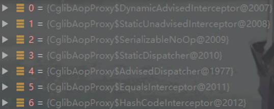

AOP全称是Aspect Oriented Programming，即面向切面的编程。它是一种设计理念，将一些通用、特殊的代码从业务逻辑中脱离出来，独立存在，以非侵入的方式与原方法进行协同。AOP采取横向抽取机制，取代了传统的纵向继承体系重复代码。

小常识：AOP并非是spring 独创，AOP有自己的标准，也有机构在维护这个标准。spring AOP 也遵循相关标准，所以别认为AOP是Spring 独创的

# 1.AOP基础

## 1.1.AOP术语

<table>
  <tr>
  	<th>术语</th>
    <th>描述</th>
  </tr>
  <tr>
  	<td width="20%">连接点，joinPoint</td>
    <td>表示可以被选择用来增强的位置。例如：类里面的哪些方法可以被增强，这些方法就叫做连接点</td>
  </tr>
  <tr>
  	<td>切入点，pointcut</td>
    <td>定义切面需要作用在什么地方，切点和通知组成切面。例如：被实际增强的连接点称为切入点，即类中有多个可以增强的方法(连接点)，但只有一两个需要增强，这一两个方法就叫切入点
</td>
  </tr>
  <tr>
  	<td>通知，advice</td>
    <td>定义切面在什么时候需要完成什么样的功能，通知和切点组成切面。如在原先方法中新增日志功能，这个日志功能就称为通知。在spring中advise分为5种：<br/>
①前置通知：Before，在方法之前执行；<br/>
②后置通知：AfterReturning，在方法运行成功后执行；<br/>
③异常通知：AfterThrowing，方法异常时执行；<br/>
④最终通知：After，无论方法运行成功还是抛异常都会执行；<br/>
⑤环绕通知：Around，在方法之前和之后都执行。
</td>
  </tr>
  <tr>
  	<td>切面，Aspect</td>
    <td>通知和切入点的组合，表示在指定时间点对指定地点进行一些额外操作</td>
  </tr>
  <tr>
  	<td>织入，Weaving</td>
    <td>在不改变原类代码的前提下，对功能进行增强。即把通知应用到切入点的过程</td>
  </tr>
</table>

## 1.2.切入点表达式

切入点表达式是用来告诉spring某些类中的哪些连接点可以被当做切入点，说白点就是spring aop对哪些类、哪些方法起作用...标准的Aspectj Aop的pointcut的表达式类型是很丰富的，但是Spring Aop只支持其中的9种，外加Spring Aop自己扩充的一种一共是10种类型的表达式，分别如下：

| **表达式**  | **作用**                                                     | **例子**                                                     |
| ----------- | ------------------------------------------------------------ | ------------------------------------------------------------ |
| execution   | 使用最多的表达式.一般用来匹配某些类或者某些方法              | execution(*  com.spring.tx.*.*(..))  表示com.spring.tx包下的所有类的所有方法(第一个*表示任意返回值；第二个*表示任意class；第三个*表示任意方法) |
| @target     | 当代理的目标类上拥有指定的注解时生效                         | @target(TargetDataSource)  当某个类带有注解@TargetDataSource时，这个类中的所有方法都会被AOP代理到 |
| @annotation | 当执行的方法上拥有指定的注解时生效                           | @annotation(targetDataSource)  当某个方法带有注解@TargetDataSource时，改方法就会被AOP代理到 |
| bean        | 当调用的方法是指定的bean的方法时生效                         | bean(BuildBaseEntity)  当某个方法是类BuildBaseEntity的方法时，它就会带AOP代理到 |
| this        | spring Aop是基于代理的，生成的bean也是一个代理对象，this就是指这个代理对象。当这个对象可以转换为指定的类型时，对应的切入点将生效 | this(BuildBaseEntity)  当AOP生成出来的代理对象能转成  BuildBaseEntity对象时，此切入点生效 |
| target      | 当被代理的对象可以转换为指定的类型时，此切入点将生效         | target(BaseEntity)  当被代理的对象能转成BaseEntity时，此切入点将生效 |
| args        | 当执行的方法的参数是指定类型时生效                           | args() -匹配任何不带参数的方法  args(java.lang.String)   -匹配任何只带一个参数，而且这个参数的   -类型是String的方法  args(..) – 匹配带任意参数的方法  args(java.lang.String,..)   -匹配带任意个参数，但是第一个参数的   -类型是String的方法  args(..,java.lang.String)   -匹配带任意个参数，但是最后一个参数的   -类型是String的方法 |
| @args       | 当执行的方法参数类型上拥有指定的注解时生效                   | @args(aopAnnotation)  当执行的方法的参数类型class，带有注解  @AopAnnotation时生效 |
| within      | 指定某些类型的全部方法执行，也可用来指定一个包               |                                                              |
| @within     | 与@target类似，官方文档说法都是@within需要目标对象的类或者父类上有指定的注解才生效；而@target则是必须是目标对象的类上有指定的注解才会生效 |                                                              |

# 2.AOP用法

在spring中进行AOP操作，主要是靠aspectj实现的，aspectj不是spring的一部分，是和spring一起使用进行aop操作的。spring使用aspectj实现AOP有两种方式:

①基于aspectj的xml配置

②基于aspectj的注解方式

pom依赖如下：

```xml
<dependency>
   <groupId>org.springframework</groupId>
   <artifactId>spring-aop</artifactId>
   <version>4.3.20.RELEASE</version>
</dependency>
<dependency>
   <groupId>org.springframework</groupId>
   <artifactId>spring-aspects</artifactId>
   <version>4.3.20.RELEASE</version>
</dependency>
```

## 2.1.非注解方式

①切入点表达式

例如：execution(* com.spring.tx.*.*(..))，各个符号意思如下：

第一个 *  —— 通配任意返回值类型，注意后面要一个空格

第二个 *  —— 通配包com.spring.tx下的任意class

第三个 *  —— 通配包com.spring.tx下的任意class的任意方法

第四个 .. —— 通配方法可以有0个或多个参数

②基类，即要被增强的类(即被代理类)

```java
/**
 * 基本类
 */
public class BasicClass {
    public void normalMethod() {
      System.out.println("君不见黄河之水天上来");
    }
    public void hasErrorMethod() {
      System.out.println("出错方法：i=0/1");
      int i = 1 / 0;
    }
}
```

③增强类，即切面，里面存放着增强方法([即通知](#1.1.AOP术语))

```java
/**
 * 增强类
 */
public class BuildClass {
  // 前置增强
  public void before(){
    System.out.println("方法前置增强...");
  }

  // 后置增强
  public void after(){
    System.out.println("方法后置增强...");
  }

  // 环绕增强, 必须有ProceedingJoinPoint参数, 用于调用基类的方法
  public void around(ProceedingJoinPoint point) throws Throwable {
    System.out.println("方法环绕增强...前");
    point.proceed();
    System.out.println("方法环绕增强...后");
  }

  // 最终增强
  public void finalBuild(){
    System.out.println("方法最终增强...");
  }

  // 异常通知
  public void error(){
    System.out.println("方法异常通知...");
  }
}
```

④在spring的配置文件中（spring.xml）注入基类和增强类，以及AOP配置

```xml
<?xml version="1.0" encoding="UTF-8"?>
<beans xmlns:xsi="http://www.w3.org/2001/XMLSchema-instance"
   xmlns="http://www.springframework.org/schema/beans"
   xmlns:aop="http://www.springframework.org/schema/aop"
   xmlns:context="http://www.springframework.org/schema/context"
   xmlns:tx="http://www.springframework.org/schema/tx"
   xmlns:cache="http://www.springframework.org/schema/cache"
   xmlns:p="http://www.springframework.org/schema/p"
   xsi:schemaLocation="http://www.springframework.org/schema/beans
      http://www.springframework.org/schema/beans/spring-beans-4.0.xsd
      http://www.springframework.org/schema/aop
      http://www.springframework.org/schema/aop/spring-aop-4.0.xsd
      http://www.springframework.org/schema/context
      http://www.springframework.org/schema/context/spring-context-4.0.xsd
      http://www.springframework.org/schema/tx
      http://www.springframework.org/schema/tx/spring-tx-4.0.xsd">

  <!-- 注入基类和增强类-->
  <bean id="basic" class="com.sym.aop.nonAnon.BasicClass" />
  <bean id="build" class="com.sym.aop.nonAnon.BuildClass" />

  <!-- AOP的xml配置 -->
  <aop:config>
     <!--声明切入点：id指定此切入点的唯一标识；execution 指定切入点表达式-->
     <aop:pointcut id="normalMethod" expression="execution(* 
               com.sym.aop.nonAnon.BasicClass.normalMethod(..))"/>
     <aop:pointcut id="hasErrorMethod" expression="execution(* 
               com.sym.aop.nonAnon.BasicClass.hasErrorMethod(..))"/>
     <!--声明切面：ref指定增强类（即切面类）使用这个类的方法来增强基类 -->
     <aop:aspect ref="build">
         <!-- method：用增强类(即切面类)的哪个方法做增强逻辑
               pointcut-ref：将这个增强方法运用到哪个切入点 -->
         <aop:before method="before" pointcut-ref="normalMethod"/>
         <aop:after-returning method="after" pointcut-ref="normalMethod"/>
         <aop:around method="around" pointcut-ref="normalMethod"/>
         <aop:after method="finalBuild" pointcut-ref="normalMethod"/>
         <aop:after-throwing method="error" pointcut-ref="hasErrorMethod"/>
     </aop:aspect>
  </aop:config>
</beans>
```

## 2.2.注解方式

①开启AOP注解：

```java
<!-- 开启AOP的注解方式，在配置类上加上如下注解-->
@EnableAspectJAutoProxy
```

②使用@Component()注解把基类和增强类注册到IOC容器。并在增强类上面添加@Aspect注解表示它为一个切面：

```java
@Component
@Aspect
// 增强类
public class EnhancedClass { 
}
```

③在增强类方法上添加：前置、后置、环绕、最终、异常通知注解

1. @Before(value="execution(* com.annotation.aop.Base.*(..))")

2. @AfterReturning("execution(* com.annotation.aop.Base.*(..))")

3. @Around("execution(* com.annotation.aop.Base.*(..))")

4. @After("execution(* com.annotation.aop.Base.*(..))")

5. @AfterThrowing("execution(* com.annotation.aop.Base.*(..))")

**补充：处理基类中带参数的方法**

需要在execution表达式后面跟上“&& args()”多个参数用逗号隔开，每个参数名要和基类、增强类的方法中的参数名一样。

```java
@Before(value = "execution(* com.LabelCache.setLabelBean(..)) && args(labelBean))")
public void before(LabelBean labelBean) {
    if( labelBean != null ){
        labelBean.setFrom("8001");
    }
}
```

**补充：处理基类中有返回值的方法**

例如在后置增强注解@AfterReturning需要指定returning属性，这个值就表示基类方法执行后的返回值，所以在增强类的方法参数配置名称一样的参数，对该参数进行处理后返回。

```java
@AfterReturning(returning = "rvt",   
 value="execution(*com.LabelController.getOne(..))")
 public Object AfterExec(Object rvt) {
if( rvt != null ){
      LabelBean label = (LabelBean) rvt;
      label.setFrom("8001");
      return label;
}
return rvt;
}
```

# 3.aop源码

理解spring源码一个很常用的方式就是从它的@Enable**这种注解开始；AOP对应的注解为：@EnableAspectJAutoProxy，很明显它为IOC容器中导入了组件AspectJAutoProxyRegistrar。该组件默认会给IOC容器注入一个名为org.springframework.aop.config.internalAutoProxyCreator的组件AnnotationAwareAspectJAutoProxyCreator，就是它给AOP创建代理对象，它的完整类继承图如下：


都知道，spring aop是基于动态代理来实现的，意味着注入到IOC容器并不是我们定义的类，而是它的代理类，这样子才能在调用方法时转到代理类去执行；如果有对**Bean生命周期**源码研究过，其实很容易猜到代理类的创建时机，就是一些后置处理器，从上图看到，还继承于InstantiationAwareBeanPostProcesso接口，所以可以猜到其实aop代理对象就是在这个方法创建的！(注：spring为了不与cglib冲突，将部分类重放到了org.springframework.cglib下面，但是这部分jar是没有源码的)

## 3.1.创建aop代理

AnnotationAwareAspectJAutoProxyCreator继承自AbstractAutoProxyCreator，而它实现后置处理器SmartInstantiationAwareBeanPostProcessor，所以可以在Bean生命周期创建和初始化Bean实例...

### 3.1.1.postProcessBeforeInstantiation()

AbstractAutoProxyCreator会在spring实例化Bean之前，先调用方法postProcessBeforeInstantiation()判断能否生成一个代理类：

```java
//源码：AbstractAutoProxyCreator--241行
public Object postProcessBeforeInstantiation(Class<?> beanClass, String beanName) {
  // 一般的beanName都是返回原值, 但如果该Bean是FactoryBean类型, 会加个前缀“&”后返回
  Object cacheKey = getCacheKey(beanClass, beanName);
  
  // targetSourcedBeans 是指有自定义目标源的Bean, 一般这个集合为空集合
  if (beanName == null || !this.targetSourcedBeans.contains(beanName)) {
    // advisedBeans是一个Map, key为beanName的值, value为布尔值; 它保存了所有已被
    // 增强过的Bean; 当一个Bean被增强完后, 它的value值为true, 反之为false
    if (this.advisedBeans.containsKey(cacheKey)) 
      return null;
    
    // 先判断当前Bean是否属于AOP基本类型, 源码在isInfrastructureClass()
    // 再判断当前Bean是否可以被跳过, 源码在shouldSkip()
    // 如果当前Bean为切面就会被放置到此Map中, value值为false, 意味它没被增强
    // (实际上切面本身就不需要被增强)
    if (isInfrastructureClass(beanClass) || shouldSkip(beanClass, beanName)) {
      this.advisedBeans.put(cacheKey, Boolean.FALSE);
      return null;
    }
    
  }
  // 如果当前Bean有自定义的目标源, 就会在这里创建它的代理对象, 一般AOP是没有的.可以省略
  if (beanName != null) {
    TargetSource targetSource = getCustomTargetSource(beanClass, beanName);
    if (targetSource != null) {
      this.targetSourcedBeans.add(beanName);
      Object[] specificInterceptors = getAdvicesAndAdvisorsForBean
        (beanClass, beanName, targetSource);
      Object proxy = createProxy(beanClass, beanName, 
                                 specificInterceptors, targetSource);
      this.proxyTypes.put(cacheKey, proxy.getClass());
      return proxy;
    }
  }
  // 最终方法返回null
  return null;
}
```

#### 3.1.1.1.isInfrastructureClass()

isInfrastructureClass()判断当前Bean是否为AOP基本类型，逻辑是：

```java
//源码：AbstractAutoProxyCreator--95行
@Override
protected boolean isInfrastructureClass(Class<?> beanClass) {
   // 先调用父类AbstractAutoProxyCreator的方法判断
   // 再判断它是否携带有@Aspect注解(即是否是一个切面)
   return (super.isInfrastructureClass(beanClass) || 
	this.aspectJAdvisorFactory.isAspect(beanClass));
}
```

```java
//源码：AbstractAutoProxyCreator --371行
protected boolean isInfrastructureClass(Class<?> beanClass) {
  // 判断当前Bean是不是属于AOP基本类型, 即是否有实现：Advice、Pointcut、Advisor
  // 和AopInfrastructureBean
  boolean retVal = Advice.class.isAssignableFrom(beanClass) ||
    Pointcut.class.isAssignableFrom(beanClass) ||
      Advisor.class.isAssignableFrom(beanClass) ||
        AopInfrastructureBean.class.isAssignableFrom(beanClass);
  return retVal;
}
```

#### 3.1.1.2.shouldSkip()

shouldSkip()方法被子类AspectJAwareAdvisorAutoProxyCreator重写了，

```java
//源码：AspectJAwareAdvisorAutoProxyCreator --101行
protected boolean shouldSkip(Class<?> beanClass, String beanName) {
  // 查找当前bean工厂中所有可用的Advisor bean（也叫做“增强器”）, 这个Advisor接口表示
  // 切面类的增强方法, 默认实现类是InstantiationModelAwarePointcutAdvisorImpl
  List<Advisor> candidateAdvisors = findCandidateAdvisors();
  for (Advisor advisor : candidateAdvisors) {
    if (advisor instanceof AspectJPointcutAdvisor) {
      // 判断增强器所在切面, 是不是就是当前Bean, 如果是则返回true
      if (( (AbstractAspectJAdvice) advisor.
           getAdvice()).getAspectName().equals(beanName)) {
        return true;
      }
    }
  }
  // 如果增强器不是AspectJPointcutAdvisor类型, 就调用父类方法去判断, 父类默认返回false
  return super.shouldSkip(beanClass, beanName);
}
```

### 3.1.2.postProcessAfterInitialization()

经过[上面的分析](#3.1.1.postProcessBeforeInstantiation())，AbstractAutoProxyCreator大多数情况下不会创建Bean实例，相反它会在这个方法中对spring创建好的Bean实例做初始化工作，源码如下：

```java
//源码：AbstractAutoProxyCreator -- 294行
public Object postProcessAfterInitialization(Object bean, String beanName) {
  if (bean != null) {
    Object cacheKey = getCacheKey(bean.getClass(), beanName);
    // 集合earlyProxyReferences是指提前曝光的Bean实例, 一般用来解决循环依赖的.
    // 如果Bean被提前曝光了, 它就一定在这个集合里并且已经执行完wrapIfNecessary()方法
    // (源码在：AbstractAutoProxyCreator – 232行)如果Bean未提前曝光, 则调用
    // 调用wrapIfNecessary()
    if (!this.earlyProxyReferences.contains(cacheKey)) {
      return wrapIfNecessary(bean, beanName, cacheKey);
    }
  }
  return bean;
}
```

#### 3.1.2.1.wrapIfNecessary()

```java
//源码：AbstractAutoProxyCreator -- 333行
protected Object wrapIfNecessary(Object bean, String beanName, Object cacheKey) {
  // 如果当前Bean有自定义目标源, 直接返回Bean
  if (beanName != null && this.targetSourcedBeans.contains(beanName)) 
    return bean;
  // 如果当前Bean已经处理过(即被添加到advisedBeans中), 直接返回Bean
  if (Boolean.FALSE.equals(this.advisedBeans.get(cacheKey))) 
    return bean;
  // 与postProcessBeforeInstantiation()判断一样, 若当前Bean是切面, 将它添加到集合中
  // 然后直接返回Bean
  if (isInfrastructureClass(bean.getClass()) || 
      shouldSkip(bean.getClass(), beanName)) {
    this.advisedBeans.put(cacheKey, Boolean.FALSE);
    return bean;
  }
  /* 
 * 普通类就可以执行到这里, 因为普通类才需要做代理, 切面类不需要, 它仅仅是定义通知方法
 * 下面的代码就是为增强通知的普通类构造代理对象..
 */
  // 获取当前Bean需要的所有增强器(即切入点表达式能作用到当前Bean的所有增强方法)
  // 它首先会找到BeanFactory内的所有增强器, 然后根据切入点Pointcut的表达式, 
  // 来匹配增强器是否可以作用于当前Bean, 若匹配将此增强器保存到集合, 最后将集合排序
  // 转换成数组后返回(数组内的元素一般是InstantiationModelAwarePointcutAdvisorImpl)
  // 这个方法源码在: AbstractAdvisorAutoProxyCreator -- 69行
  Object[] specificInterceptors = getAdvicesAndAdvisorsForBean(bean.getClass(), 
                                                               beanName, null);
  // 如果当前Bean有增强器, 那么就给它创建代理对象
  if (specificInterceptors != DO_NOT_PROXY) {
    // 将当前Bean保存到advisedBeans中, 表示它已经被增强过了(区别前面看到的值为False)
    this.advisedBeans.put(cacheKey, Boolean.TRUE);
    // 重要步骤：为当前Bean创建代理对象
    Object proxy = createProxy( bean.getClass(), beanName, specificInterceptors, 
                               new SingletonTargetSource(bean));
    this.proxyTypes.put(cacheKey, proxy.getClass());
    // 方法返回的是代理对象, 区别于下面返回的原Bean, 意味着在当前Bean在
    // IOC容器中保存的是代理对象, 而不再是我们在代码里定义的类
    return proxy;
  }
  // 如果当前Bean没有任何增强器与其匹配, 则它就不需要被增强, 加入到缓存中, 其值为False.
  // 本方法直接返回原Bean
  this.advisedBeans.put(cacheKey, Boolean.FALSE);
  return bean;
}
```

#### 3.1.2.2.createProxy()

```java
//源码：AbstractAutoProxyCreator -- 437行
protected Object createProxy( Class<?> beanClass, String beanName, 
                             Object[] specificInterceptors, TargetSource targetSource) {
  if (this.beanFactory instanceof ConfigurableListableBeanFactory) {
    AutoProxyUtils.exposeTargetClass(
      (ConfigurableListableBeanFactory) this.beanFactory, beanName, beanClass);
  }
  // 创建代理工厂, 并从当前对象拷贝部分变量的值, this指
  // AnnotationAwareAspectJAutoProxyCreator
  ProxyFactory proxyFactory = new ProxyFactory();
  proxyFactory.copyFrom(this);
  
  // 暂时不知道这操作为了啥???
  if (!proxyFactory.isProxyTargetClass()) {
    if (shouldProxyTargetClass(beanClass, beanName)) {
      proxyFactory.setProxyTargetClass(true);
    }else {
      evaluateProxyInterfaces(beanClass, proxyFactory);
    }
  }
  
  // 将拦截器(当前类型为Object)适配成增强器Advisor类型, 通过使用AdvisorAdapterRegistry
  // 来包装, 如果拦截器已经是Advisor类型直接返回, 其它情况必须保证是
  // org.aopalliance.aop.Advice类型, spring会用DefaultPointcutAdvisor包裹后返回.
  // 此方法源码：AbstractAutoProxyCreator -- 508行
  Advisor[] advisors = buildAdvisors(beanName, specificInterceptors);
  
  // 将上面的增强器保存在代理工厂proxyFactory
  for (Advisor advisor : advisors) {
    proxyFactory.addAdvisor(advisor);
  }
  
  // targetSource 实际类型为SingletonTargetSource, 它里面保存着被增强类的对象实例,
  // 准备为它创建代理对象
  proxyFactory.setTargetSource(targetSource);
  
  // AOP扩展, 留给子类实现, 用来自定义渲染proxyFactory, 默认什么都不做
  customizeProxyFactory(proxyFactory);
  
  proxyFactory.setFrozen(this.freezeProxy);
  if (advisorsPreFiltered()) {
    proxyFactory.setPreFiltered(true);
  }
  // 调用ProxyFactory的getProxy()方法, 源码在下面
  return proxyFactory.getProxy(getProxyClassLoader());
}
```

调用ProxyFactory的getProxy()生成一个代理对象

```java
//源码：ProxyFactory -- 108行
public Object getProxy(ClassLoader classLoader) {
  // 调用getProxy(), 该方法会先调用createAopProxy()方法获取AopProxy, 
  // 再调用AopProxy的getProxy()获取到真正的代理对象
  return createAopProxy().getProxy(classLoader);
}
```

#### 3.1.2.3.createAopProxy()

```java
//源码：ProxyCreatorSupport -- 101行
protected final synchronized AopProxy createAopProxy() {
  if (!this.active) {
    activate();
  }
  // 调用getAopProxyFactory()返回一个AopProxyFactory, 默认为DefaultAopProxyFactory
  return getAopProxyFactory().createAopProxy(this);
}
```

spring通过DefaultAopProxyFactory来创建出AopProxy；方法参数config就是[上一步](#3.1.2.2.createProxy())创建的局部方法变量ProxyFactory

```java
//源码：DefaultAopProxyFactory -- 50行
public AopProxy createAopProxy(AdvisedSupport config) {
  if ( config.isOptimize() || config.isProxyTargetClass() || 
      hasNoUserSuppliedProxyInterfaces(config)) {
    // 获取被代理的基类的Class对象
    Class<?> targetClass = config.getTargetClass();
    if (targetClass == null) 
      throw new AopConfigException();
    // 如果被代理类含有接口, 就用JDK动态代理 ===>> JdkDynamicAopProxy
    // 注意：每一个代理类, spring都会创建一个新的AopProxy对象
    if (targetClass.isInterface() || Proxy.isProxyClass(targetClass)) {
      return new JdkDynamicAopProxy(config);
    }
    // 不然就用Cglib动态代理 ===>> CglibAopProxy
    // 注意：每一个代理类, spring都会创建一个新的AopProxy对象
    return new ObjenesisCglibAopProxy(config);
  } else {
    // 其它情况都是用 JDK 动态代理
    return new JdkDynamicAopProxy(config);
  }
}
```

#### 3.1.2.4.getProxy()

从createAopProxy()方法可得，如果被代理类是接口则使用JDK动态代理，如果是普通类则使用cglib代理，涉及到两个类：JdkDynamicAopProxy和CglibAopProxy，而且每一个代理类都会new一个新的AopProxy实例对象，以区分不同的代理配置(即[createProxy()](#3.1.2.2.createProxy())创建的局部变量ProxyFactory)。JdkDynamicAopProxy和CglibAopProxy内部都会保存下面这个变量：

```java
/** The configuration used to configure this proxy */
protected final AdvisedSupport advised;
```

最后通过它们的getProxy()方法就可以获取到代理类实例对象。然后方法返回到[wrapIfNecessary()](#3.1.2.1.wrapIfNecessary())里面将代理对象返回给IOC容器保存，整个AOP代理对象的创建就执行完了~~~

##### 3.1.2.4.1.jdk

jdk动态代理使用的是JdkDynamicAopProxy类，注意它自己实现了InvocationHandler，说明它自身可以作为代理逻辑，源码为：

```java
final class JdkDynamicAopProxy implements AopProxy, InvocationHandler, Serializable {
  @Override
  public Object getProxy(ClassLoader classLoader) {
    // 找出被代理类的所有接口, 这里可能还会加上spring自带的3个接口, 分别是：
    // SpringProxy、Advised、DecoratingProxy(根据被代理类条件判断是否要添加)
    // 源码：AopProxyUtils -- 104
    Class<?>[] proxiedInterfaces = 
      AopProxyUtils.completeProxiedInterfaces(this.advised, true);
    // 判断被代理类的所有接口, 是不是有重写了equal()和hashcode()方法, 如果设置了
    // 会把JdkDynamicAopProxy的equalsDefined和hashCodeDefined变量置为true..
    findDefinedEqualsAndHashCodeMethods(proxiedInterfaces);
    // 标准的JDK创建代理对象的代码
    return Proxy.newProxyInstance(classLoader, proxiedInterfaces, this);
  }
}
```

##### 3.1.2.4.2.cglib

cglib动态代理使用的是ObjenesisCglibAopProxy，它继承于CglibAopProxy，创建代理类的方法写在父类CglibAopProxy上，建议先了解cglib动态代理方式。源码：

```java
//源码：CglibAopProxy-- 157行
public Object getProxy(ClassLoader classLoader) {
  try {
    // rootClass和proxySupperClass都表示被代理类(基类)
    // 下面的 this.advised 是AdvisedSupport类型, 默认为上面创建的局部变量ProxyFactory
    Class<?> rootClass = this.advised.getTargetClass();
    Class<?> proxySuperClass = rootClass;
    // 判断被代理类是否是cglib动态生成的类, 如果一个类是cglib动态生成的, 它的类名会包含
    // 符号“$$”例如：com.sym.cglib.BaseClass$$EnhancerByCGLIB$$ef68d10b.
    // 因为cglib的原理是为被代理类(基类)动态生成子类, 所以spring在这里通过
    // getSuperclass()获取基类的Class对象, 然后获取它的所有接口, 添加进来
    if (ClassUtils.isCglibProxyClass(rootClass)) {
      proxySuperClass = rootClass.getSuperclass();
      Class<?>[] additionalInterfaces = rootClass.getInterfaces();
      for (Class<?> additionalInterface : additionalInterfaces) {
        this.advised.addInterface(additionalInterface);
      }
    }
    //校验下被代理, 看它有么有final方法或者包可见(package-visible)方法, 有的话打印日志
    validateClassIfNecessary(proxySuperClass, classLoader);
    // 开始配置cglib的增强器Enhancer
    Enhancer enhancer = createEnhancer();
    if (classLoader != null) {
      enhancer.setClassLoader(classLoader);
      // 如果当前类加载器是SmartClassLoader并且允许重加载类, 将Enhancer缓存关掉
      if (classLoader instanceof SmartClassLoader &&
          ((SmartClassLoader) classLoader).isClassReloadable(proxySuperClass)) {
        enhancer.setUseCache(false);
      }
    }
    enhancer.setSuperclass(proxySuperClass);
    // 通过JDK代理一样, 找出被代理类的所有接口, 判断是否需要加上spring自带的3个接口, 
    // 分别是：SpringProxy、Advised、DecoratingProxy ( 源码：AopProxyUtils -- 104 )
    enhancer.setInterfaces(AopProxyUtils.completeProxiedInterfaces(this.advised));
    // 设置 NamingPolicy, 通过它来为动态生成的类取名, 默认就是“***$$***”这样子的类名
    enhancer.setNamingPolicy(SpringNamingPolicy.INSTANCE);
    // 设置 GeneratorStrategy, 通过它来生成字节码
    enhancer.setStrategy(new ClassLoaderAwareUndeclaredThrowableStrategy
                         (classLoader));
    // 获取拦截器链, 这个方法比较重要
    Callback[] callbacks = getCallbacks(rootClass);
    Class<?>[] types = new Class<?>[callbacks.length];
    for (int x = 0; x < types.length; x++) {
      types[x] = callbacks[x].getClass();
    }
    // 设置 Enhancer的回调过滤器, 为CglibAopProxy的内部类ProxyCallbackFilter
    enhancer.setCallbackFilter(new ProxyCallbackFilter(
      this.advised.getConfigurationOnlyCopy(), this.fixedInterceptorMap, 
      this.fixedInterceptorOffset));
    enhancer.setCallbackTypes(types);
    // 使用cglib动态生成Class对象流(底层用ASM字节码增强技术), 并且返回代理对象
    return createProxyClassAndInstance(enhancer, callbacks);
  }catch (Exception ex) {
    // 省略异常处理信息...
  }
}
```

使用过cglib的都知道，它支持回调过滤器，可以根据 CallbackFilter的accept()方法返回值来决定使用拦截器数组Callback[]的哪个元素。上面源码的getCallbacks()就是来获取这个拦截器数组的，源码为：

```java
//源码：CglibAopProxy -- 280行
private Callback[] getCallbacks(Class<?> rootClass) throws Exception {
  // 默认为false...
  boolean exposeProxy = this.advised.isExposeProxy();
  // 默认为false...
  boolean isFrozen = this.advised.isFrozen();
  // 如果被代理是不可变, 此值为true, 默认为true
  boolean isStatic = this.advised.getTargetSource().isStatic();
  // 通用的AOP回调拦截器
  Callback aopInterceptor = new DynamicAdvisedInterceptor(this.advised);
  // 创建一个直接调用被代理类原方法的拦截器, 可能需要暴露代理对象实例...有待分析
  // Choose a "straight to target" interceptor. (used for calls that are
  // unadvised but can return this). May be required to expose the proxy.
  Callback targetInterceptor;
  if (exposeProxy) {
    targetInterceptor = isStatic ? new StaticUnadvisedExposedInterceptor
      (this.advised.getTargetSource().getTarget()) :
    new DynamicUnadvisedExposedInterceptor(this.advised.getTargetSource());
  }else {
    targetInterceptor = isStatic ? new StaticUnadvisedInterceptor
      (this.advised.getTargetSource().getTarget()) :
    new DynamicUnadvisedInterceptor(this.advised.getTargetSource());
  }
  // 创建一个直接调用被代理类原方法的拦截器, 用于对无法返回此值的静态目标的不增强调用
  // 有待分析...
  // Choose a "direct to target" dispatcher (used for
  // unadvised calls to static targets that cannot return this).
  Callback targetDispatcher = isStatic ?
    new StaticDispatcher(this.advised.getTargetSource().getTarget()) : 
  new SerializableNoOp();
  // 创建所有的拦截器数组, 后面cglib就会根据 CallbackFilter来选择对应的拦截器拦截
  // 被代理类原方法的调用. 一共有7个
  Callback[] mainCallbacks = new Callback[] {
    aopInterceptor,  // for normal advice
    targetInterceptor,  // invoke target without considering advice, if optimized
    new SerializableNoOp(),  // no override for methods mapped to this
    targetDispatcher, 
    this.advisedDispatcher,
    new EqualsInterceptor(this.advised),
    new HashCodeInterceptor(this.advised)
  };

  Callback[] callbacks;
  // If the target is a static one and the advice chain is frozen,
  // then we can make some optimisations by sending the AOP calls
  // direct to the target using the fixed chain for that method.
  if (isStatic && isFrozen) {
    Method[] methods = rootClass.getMethods();
    Callback[] fixedCallbacks = new Callback[methods.length];
    this.fixedInterceptorMap = new HashMap<String, Integer>(methods.length);
    for (int x = 0; x < methods.length; x++) {
      List<Object> chain = this.advised.getInterceptorsAndDynamicInterceptionAdvice
        (methods[x], rootClass);
      fixedCallbacks[x] = new FixedChainStaticTargetInterceptor(
        chain, this.advised.getTargetSource().getTarget(), 
        this.advised.getTargetClass());
      this.fixedInterceptorMap.put(methods[x].toString(), x);
    }
    // Now copy both the callbacks from mainCallbacks
    // and fixedCallbacks into the callbacks array.
    callbacks = new Callback[mainCallbacks.length + fixedCallbacks.length];
    System.arraycopy(mainCallbacks, 0, callbacks, 0, mainCallbacks.length);
    System.arraycopy(fixedCallbacks, 0, callbacks, mainCallbacks.length, 
                     fixedCallbacks.length);
    this.fixedInterceptorOffset = mainCallbacks.length;
  }else {
    // 一般就直接上面定义7个拦截器返回...
    callbacks = mainCallbacks;
  }
  return callbacks;
}
```

## 3.2.获取拦截器链

通过对[创建AOP代理](#3.1.创建AOP代理)的分析，可得实际上spring是通过[JdkDynamicAopProxy](#3.1.2.4.1.jdk)或[CglibAopProxy](#3.1.2.4.2.cglib)，将需要增强的类的代理类注册到IOC容器中；结合动态代理的知识，执行被代理类的方法：JDK动态代理会将方法转发到InvocationHandler上，其实就是JdkDynamicAopProxy自身；而Cglib动态代理会将方法转发到回调过滤器ProxyCallbackFilter，通过它选择合适的回调接口Callback来拦截方法调用，通常会用到DynamicAdvisedInterceptor。在这一流程中，aop会创建出对方法的拦截器链，进行递归调用，这样才会有区分为前置通知、后置通知...这样的执行顺序！！！

### 3.2.1.jdk代理

如果是JDK动态代理，则对基类的调用都会转到对JdkDynamicAopProxy的invoke()方法的调用。提醒一下：

1. 每一个被代理类都有对应的一个JdkDynamicAopProxy实例对象

2. JdkDynamicAopProxy内保存AdvisedSupport的引用，即createProxy()创建的ProxyFactory变量

#### 3.2.1.1.invoke()

```java
//源码：JdkDynamicAopProxy -- 154行
public Object invoke(Object proxy, Method method, Object[] args) {
  // MethodInvocation是实现了org.aopalliance.intercept.Joinpoint的接口
  MethodInvocation invocation;
  Object oldProxy = null;
  boolean setProxyContext = false;
  // TargetSource保存着被代理类的实例对象(可以用它来回调反射方法)
  TargetSource targetSource = this.advised.targetSource;
  Class<?> targetClass = null;
  Object target = null;
  try {
    // this.equalsDefined表示被代理类是否有重写了equals()方法
    // 如果被代理类重写了equals(), 且当前调用的方法就是equals(), 直接比较比较结果
    if (!this.equalsDefined && AopUtils.isEqualsMethod(method)) {
      return equals(args[0]);
      // this.hashCodeDefined表示被代理类是否有重写了hashCode()
      // 如果被代理类重写了hashCode(), 且当前调用的就是hashCode(), 直接返回hash值
    } else if (!this.hashCodeDefined && AopUtils.isHashCodeMethod(method)) {
      return hashCode();
      // 如果当前Method的Class是 DecoratingProxy 类型, 直接反射调用 method
    } else if (method.getDeclaringClass() == DecoratingProxy.class) {
      return AopProxyUtils.ultimateTargetClass(this.advised);
      // 如果当前Method的Class是接口, 并且还是Advised的父接口, 直接反射调用method
    } else if (!this.advised.opaque && method.getDeclaringClass().isInterface() 
               && method.getDeclaringClass().isAssignableFrom(Advised.class)) {
      return AopUtils.invokeJoinpointUsingReflection(this.advised, method, args);
    }
    Object retVal;
    // 将当前代理对象proxy存放到threadLocal中, 相当于暴露它. 此值一般为false
    if (this.advised.exposeProxy) {
      oldProxy = AopContext.setCurrentProxy(proxy);
      setProxyContext = true;
    }
    // 获取被代理类的实例对象(提醒：proxy就是target的代理对象...)
    target = targetSource.getTarget();
    if (target != null) {
      targetClass = target.getClass();
    }
    // 重点方法：根据通知Advise获取拦截器链, 转到构造拦截器链
    List<Object> chain = this.advised.getInterceptorsAndDynamicInterceptionAdvice
      (method, targetClass);
    if (chain.isEmpty()) {
      // 如果拦截器链为空集合, 直接反射调用原方法即可.
      Object[] argsToUse = AopProxyUtils.adaptArgumentsIfNecessary(method, args);
      retVal = AopUtils.invokeJoinpointUsingReflection(target, method, argsToUse);
    } else {
      // 否则创建ReflectiveMethodInvocation实例
      invocation = new ReflectiveMethodInvocation(proxy, target, method, args,
                                                  targetClass, chain);
      // 这边开始递归调用(正式开始调用每个拦截器以及原方法), 转到链式调用通知
      retVal = invocation.proceed();
    }
    Class<?> returnType = method.getReturnType();
    // 这是一种特殊的情况, 即方法返回值与被代理类是同一个对象...具体场景不明
    if (retVal != null && retVal == target && returnType != Object.class 
        && returnType.isInstance(proxy) && !RawTargetAccess.class.isAssignableFrom
        (method.getDeclaringClass())) {
      retVal = proxy;
      // 如果原方法有返回值, 但是链式调用后的返回值为空, 则抛出异常
    }else if(retVal == null && returnType != Void.TYPE && returnType.isPrimitive()){
      throw new AopInvocationException();
    }
    // 返回链式调用后的结果
    return retVal;
  } finally {
    // targetSource默认实现类为SingletonTargetSource, 它对这个方法没有任何实现
    if (target != null && !targetSource.isStatic()) {
      targetSource.releaseTarget(target);
    }
    // 如果 setProxyContext为true, 将ThreadLocal置为原先的值
    if (setProxyContext) {
      AopContext.setCurrentProxy(oldProxy);
    }
  }
```

### 3.2.2.cglib代理

如果是cglib动态代理，则对基类方法的调用，都会先到Enhancer的回调拦截器ProxyCallbackFilter的accept()方法获取回调数组的下标，根据带着这个下标去回调数组Callback[]选择对应的回调器。拦截器数组信息如下：

```java
// Constants for CGLIB callback array indices
private static final int AOP_PROXY = 0;
private static final int INVOKE_TARGET = 1;
private static final int NO_OVERRIDE = 2;
private static final int DISPATCH_TARGET = 3;
private static final int DISPATCH_ADVISED = 4;
private static final int INVOKE_EQUALS = 5;
private static final int INVOKE_HASHCODE = 6;
```

这些拦截器都是CglibAopProxy的静态内部类：



#### 3.2.2.1.accept()

```java
//源码：CglibAopProxy -- 784行
public int accept(Method method) {
  // 如果方法是finalize(), 返回2, 调用SerializableNoOp(CglibAopProxy -- 385)
  // 它是cglib的NoOp实现, 会直接调用原来方法
  if (AopUtils.isFinalizeMethod(method)) {
    return NO_OVERRIDE;
  }
  // 如果被代理类是接口且是Advised的父接口, 返回4, 调用AdvisedDispatcher
  // (CglibAopProxy -- 516)这个是cglib的Dispatcher实现
  if (!this.advised.isOpaque() && method.getDeclaringClass().isInterface() &&
      method.getDeclaringClass().isAssignableFrom(Advised.class)) {
    return DISPATCH_ADVISED;
  }
  // 如果方法是equal()方法, 返回5, 调用EqualsInterceptor(CglibAopProxy -- 535)
  if (AopUtils.isEqualsMethod(method)) {
    return INVOKE_EQUALS;
  }
  // 如果方法是hashCode()方法, 返回6, 调用HashCodeInterceptor(CglibAopProxy -- 568)
  if (AopUtils.isHashCodeMethod(method)) {
    return INVOKE_HASHCODE;
  }
  // 获取被代理类的Class对象
  Class<?> targetClass = this.advised.getTargetClass();
  // 重点方法：根据通知Advise获取拦截器链, 转到构造拦截器链(这边会做缓存处理)
  List<?> chain = this.advised.getInterceptorsAndDynamicInterceptionAdvice(method,
                                                                           targetClass);
  // 拦截器链不为空, 说明当前方法需要增强, haveAdvice值为true
  boolean haveAdvice = !chain.isEmpty();
  // 待解析...
  boolean exposeProxy = this.advised.isExposeProxy();
  // 若为true表示被代理类是不可变, 默认实现为SingletonTargetSource, 其方法返回true
  boolean isStatic = this.advised.getTargetSource().isStatic();
  // 若为true表示this.advised(即ProxyFactory)被冻结, 所有通知advise不能被更改
  boolean isFrozen = this.advised.isFrozen();
  // 被代理类需要增强或者没被冻结通知, 执行下面代码块. 大多数情况下都是执行这边
  if (haveAdvice || !isFrozen) {
    if (exposeProxy) {
      // 如果 exposeProxy 为true, 直接返回0, 调用DynamicAdvisedInterceptor
      return AOP_PROXY;
    }
    String key = method.toString();
    // 检查是否有固定的拦截器可以增强此方法, 这个map能被判断到, 前提是isFrozen先为true
    if (isStatic && isFrozen && this.fixedInterceptorMap.containsKey(key)) {
      int index = this.fixedInterceptorMap.get(key);
      return (index + this.fixedInterceptorOffset);
    }else {
      // 否则直接返回0, 调用DynamicAdvisedInterceptor(CglibAopProxy -- 616)
      return AOP_PROXY;
    }
    // 被代理类不需要增强(没有任何通知)或者它的通知被冻结了(通知不能被更改)执行下面代码块
  }else {
    if (exposeProxy || !isStatic) {
      return INVOKE_TARGET;
    }
    Class<?> returnType = method.getReturnType();
    if (targetClass == returnType) {
      return INVOKE_TARGET;
    }else if (returnType.isPrimitive()||!returnType.isAssignableFrom(targetClass)) {
      return DISPATCH_TARGET;
    }else {
      return INVOKE_TARGET;
    }
  }
}
```

#### 3.2.2.2.intercept()

通过对[accept()](#33.2.2.1.accept())的分析，除了一些特殊情况，大多数使用AOP的方法调用，都会使用CglibAopProxy的内部类DynamicAdvisedInterceptor拦截器：

```java
//源码：CglibAopProxy -- 625行
public Object intercept(Object proxy, Method method, Object[] args, 
                        MethodProxy methodProxy) throws Throwable {
  Object oldProxy = null;
  boolean setProxyContext = false;
  Class<?> targetClass = null;
  Object target = null;
  try {
    // 如果需要, 暴露出代理对象proxy, 会放到ThreadLocal中
    if (this.advised.exposeProxy) {
      oldProxy = AopContext.setCurrentProxy(proxy);
      setProxyContext = true;
    }
    // 获取目标方法, 再获取它的Class对象
    target = getTarget();
    if (target != null) { 
      targetClass = target.getClass(); 
    }
    // 重点方法：根据通知Advise获取拦截器链, 转到构造拦截器链
    List<Object> chain = 
      this.advised.getInterceptorsAndDynamicInterceptionAdvice
      (method, targetClass);
    // 返回值
    Object retVal;
    // 如果目标方法没有拦截器链, 并且它被定义为public, 则直接反射回调目标方法即可
    // 注意：在cglib中, 以methodProxy.invoke()调用类似于jdk反射调用, 需要用原始类
    // 即invoke方法调用的对象没有增强过
    if (chain.isEmpty() && Modifier.isPublic(method.getModifiers())) {
      Object[] argsToUse = AopProxyUtils.adaptArgumentsIfNecessary(method, args);
      retVal = methodProxy.invoke(target, argsToUse);
    }else {
      // 如果目标方法有拦截器链, 创建一个CglibMethodInvocation对象, 调用它的proceed()
      // 这边开始正式的链式调用, 转到链式调用通知
      retVal = new CglibMethodInvocation(proxy, target, method, args, targetClass,
                                         chain, methodProxy).proceed();
    }
    // 如果原方法返回的本身(即this), spring会把代理对象返回回去; 同时如果返回值不是Void
    // 还会做判空处理
    retVal = processReturnType(proxy, target, method, retVal);
    return retVal;
  }finally {
    // 可能的话, 释放下资源
    if (target != null) { releaseTarget(target); }
    if (setProxyContext) AopContext.setCurrentProxy(oldProxy); }
}
}
```

### 3.2.3.通用：获取拦截器链

#### 3.2.3.1.缓存获取

不管是jdk还是cglib，获取拦截器链时都会来调用到这个方法，默认会先调用AdvisedSupport的getInterceptorsAndDynamicInterceptionAdvice()方法，该方法先从缓存中获取拦截器链：

```java
//源码：AdvisedSupport -- 485行
public List<Object> getInterceptorsAndDynamicInterceptionAdvice(Method method, 
                                                                Class<?> targetClass) {
  // MethodCacheKey其实就是封装了Method对象和它的hashCode值
  MethodCacheKey cacheKey = new MethodCacheKey(method);
  // 这里需要注意一点：methodCache是一个ConcurrentHashMap, 它是存放在AdvisedSupport里
  // 且作为一个成员变量. 因此每个AdvisedSupport 实例都有自己的缓存, 之前分析过在
  // createProxy()方法中, 符合AOP条件的每个Bean实例都会创建一个ProxyFactory, 它就是
  // AdvisedSupport的实现类
  List<Object> cached = this.methodCache.get(cacheKey);
  if (cached == null) {
    // 如果缓存为空, 则调用AdvisorChainFactory来生成拦截器链
    cached = this.advisorChainFactory.getInterceptorsAndDynamicInterceptionAdvice(
      this, method, targetClass);
    this.methodCache.put(cacheKey, cached);
  }
  return cached;
}
```

#### 3.2.3.2.动态生成

若缓存中取不到待执行方法的拦截器链，则调用AdvisorChainFactory的getInterceptorsAndDynamicInterceptionAdvice()方法生成拦截器链，源码如下：

```java
//源码：DefaultAdvisorChainFactory -- 50行
public List<Object> getInterceptorsAndDynamicInterceptionAdvice(Advised config, 
                                                                Method method, Class<?> targetClass) {
  // 参数config就是ProxyFactory, 从它身上先获取目标类(被代理类)所有的增强器
  // 然后创建列表 interceptorList, 它就是方法要返回的对象 
  List<Object> interceptorList = new ArrayList<Object>(config.getAdvisors().length);
  // 获取被代理类的Class对象
  Class<?> actualClass = (targetClass != null ? targetClass : 
                          method.getDeclaringClass());
  boolean hasIntroductions = hasMatchingIntroductions(config, actualClass);
  // 获取Advisor适配器的注册接口, 默认实现类：DefaultAdvisorAdapterRegistry
  AdvisorAdapterRegistry registry = GlobalAdvisorAdapterRegistry.getInstance();
  // 遍历所有的增强器, 通过AdvisorAdapterRegistry接口, 将增强器适配成
  // org.aopalliance.intercept.MethodInterceptor类
  for (Advisor advisor : config.getAdvisors()) {
    // 若增强器属于切入点增强器. 我们常用的通知都是属于这种类型的增强器
    if (advisor instanceof PointcutAdvisor) {
      PointcutAdvisor pointcutAdvisor = (PointcutAdvisor) advisor;
      // 若aop配置类AdvisedSupport(即变量config)有预先过滤; 或者切入点能匹配上当前
      // 的Class类型
      if (config.isPreFiltered() || pointcutAdvisor.getPointcut().
          getClassFilter().matches(actualClass)) {
        // 调用增强器适配器AdvisorAdapterRegistry, 将增强器适配成MethodInterceptor.
        // 这里会选取合适的AdvisorAdapter接口, 去适配增强器advisor. 如果有多个
        // AdvisorAdapter能适配上此增强器, 就会返回多个MethodInterceptor(源码在下面)
        MethodInterceptor[] interceptors = registry.getInterceptors(advisor);
        // 获取方法匹配器, 判断能否匹配上当前执行的方法Method 
        MethodMatcher mm = pointcutAdvisor.getPointcut().getMethodMatcher();
        if (MethodMatchers.matches(mm, method, actualClass, hasIntroductions)) {
          // 切入点的方法匹配器实现是：AspectJExpressionPointcut, 在设置切点的时候可
          // 以用切点语言来更加精确的表示拦截哪个方法.如果切入点表达式携带了方法参数,
          // 例如：execution(* com.sym.saveStudent(..)) && args(id,name)
          // 它的isRuntime()方法就会返回true, spring就会把拦截器interceptor和方法
          // 匹配器MethodMatcher重新包装成InterceptorAndDynamicMethodMatcher对象
          if (mm.isRuntime()) {
            for (MethodInterceptor interceptor : interceptors) {
              interceptorList.add(
                new InterceptorAndDynamicMethodMatcher(interceptor, mm));
            }
          }else {
            // 如果切入点表达式没加方法参数, 就直接添加到返回集合中
            interceptorList.addAll(Arrays.asList(interceptors));
          }
        }
      }
      // 如果增强器是 IntroductionAdvisor 类型
    }else if (advisor instanceof IntroductionAdvisor) {
      IntroductionAdvisor ia = (IntroductionAdvisor) advisor;
      if (config.isPreFiltered() || ia.getClassFilter().matches(actualClass)) {
        Interceptor[] interceptors = registry.getInterceptors(advisor);
        interceptorList.addAll(Arrays.asList(interceptors));
      }
      // 增强器是其它类型的
    }else {
      Interceptor[] interceptors = registry.getInterceptors(advisor);
      interceptorList.addAll(Arrays.asList(interceptors));
    }
  }
  return interceptorList;
}
```

这里会使用AdvisorAdapterRegistry接口，默认实现DefaultAdvisorAdapterRegistry，来将Advisor转换成MethodInterceptor。对于同一个增强器Advisor，如果有多个AdvisorAdapter都能适配它，那么都会将它进行MethodInterceptor转换，然后一起返回。源码：

```java
//源码：DefaultAdvisorAdapterRegistry -- 79行
public MethodInterceptor[] getInterceptors(Advisor advisor) {
  List<MethodInterceptor> interceptors = new ArrayList<MethodInterceptor>(3);
  // 获取增强器内部的通知Advice
  Advice advice = advisor.getAdvice();
  // 若直接是 MethodInterceptor, 强转后添加到返回值
  if (advice instanceof MethodInterceptor) {
    interceptors.add((MethodInterceptor) advice);
  }
  // 通过适配器AdvisorAdapter转换增强器Advisor, 默认有3个适配器：
  // MethodBeforeAdviceAdapter、AfterReturningAdviceAdapter、ThrowsAdviceAdapter
  for (AdvisorAdapter adapter : this.adapters) {
    if (adapter.supportsAdvice(advice)) {
      interceptors.add(adapter.getInterceptor(advisor));
    }
  }
  // 结果判断, 然后将集合转为数组返回
  if (interceptors.isEmpty()) {
    throw new UnknownAdviceTypeException(advisor.getAdvice());
  }
  return interceptors.toArray(new MethodInterceptor[interceptors.size()]);
}
```

## 3.3.链式调用通知

通过[获取拦截器链](#3.2.获取拦截器链)分析，可得jdk代理是实例化ReflectiveMethodInvocation来链式调用；而cglib代理实例化CglibMethodInvocation进行链式调用。其实CglibMethodInvocation 继承于 ReflectiveMethodInvocation，所以实际上的链式调用，不论是jdk还是cglib，都是到ReflectiveMethodInvocation下完成执行它的proceed()方法

### 3.3.1.proceed()

这个方法的执行，就是整个拦截器链的触发过程，它其实是一个递归函数

```java
//源码：ReflectiveMethodInvocation -- 154行
public Object proceed() throws Throwable {
  // currentInterceptorIndex是ReflectiveMethodInvocation的成员变量, 默认为-1.
  // interceptorsAndDynamicMethodMatchers就是上一步获取到的拦截器链. 它在这里就相当于
  // Servlet的过滤器链一样, 通过下标一个一个地调用链上的过滤器. 同理, 这边也是将
  // currentInterceptorIndex当成方法拦截器链的下标, 一个一个调用. 当执行到最后一个拦截器
  // 时, 调用invokeJoinPoint(), 执行目标方法. 达到先执行后返回的效果, 所以最晚执行的是原
  // 方法, 但它是整个递归调用的最快返回.
  if (this.currentInterceptorIndex == 
      this.interceptorsAndDynamicMethodMatchers.size() - 1) {
    // 当下标值等于集合size-1, 表示执行完所有拦截器, 就会回调原方法; jdk代理使用
    // 使用ReflectiveMethodInvocation.invokeJoinpoint(); cglib代理使用
    // CglibAopProxy.invokeJoinpoint();  -- 标准的多态
    return invokeJoinpoint();
  }
  // 每次先将下标+1, 然后取出链上的拦截器
  Object interceptorOrInterceptionAdvice =
    this.interceptorsAndDynamicMethodMatchers.get(++this.currentInterceptorIndex);
  //通过拦截器链生成的分析, 若一个通知Advice的切入点表达式携带了参数, 它就会被包装成
  // InterceptorAndDynamicMethodMatcher类型, 走这个if语句块. 取出它的方法匹配器
  // MethodMatcher, 若能匹配则取出它的拦截器Interceptor回调
  if (interceptorOrInterceptionAdvice instanceof InterceptorAndDynamicMethodMatcher) {
    InterceptorAndDynamicMethodMatcher dm =
      (InterceptorAndDynamicMethodMatcher) interceptorOrInterceptionAdvice;
    if (dm.methodMatcher.matches(this.method, this.targetClass, this.arguments)) {
      return dm.interceptor.invoke(this);
    }else {
      // 若方法匹配失败, 则当前拦截器就会被跳过,  并调用链中的下一个拦截器
      return proceed();
    }
  }else { 
    // 如果切入点表达式不带参数, 就走这个语句块.
    // 之前分析获取拦截器链时, 知道spring是将通知Advice适配成MethodInterceprot, 所以
    // 强转成MethodInterceptor并直接调用它的invoke()方法. 由于srping在构造一个类的
    // 增强器时, 都会先加入DefaultPointcutAdvisor对象, 所以在构造拦截器链时, 都会在链
    // 上的首个元素, 适配成ExposeInvocationInterceptor, 它的作用就是将当前对象, 也就是
    // ReflectiveMethodInvocation或CglibMethodInvocation, 保存到ThreadLocal中去, 
    // 效果就是在当前线程中共享此对象. 参数this指的是：ReflectiveMethodInvocation
    return ((MethodInterceptor) interceptorOrInterceptionAdvice).invoke(this);
  }
}
```

#### 3.3.1.1.ExposeInvocationInterceptor

每个方法拦截器链，spring默认都会为其加上ExposeInvocationInterceptor对象，所以每次调用拦截器链时，第一个调用的都是它的invoke()方法，源码：

```java
//源码：ExposeInvocationInterceptor -- 88行
public Object invoke(MethodInvocation mi) throws Throwable {
  // 它就是将当前的 ReflectiveMethodInvocation保存到ThreadLocal中, 相当于共享出来
  MethodInvocation oldInvocation = invocation.get();
  invocation.set(mi);
  try {
    //再调用proceed()方法
    return mi.proceed();
  }finally {
    // 按照递归的思想, 方法第一个调用的, 结果最后一个返回, 所以spring在这边将
    // ThreadLocal还原回去....
    invocation.set(oldInvocation);
  }
}
```

#### 3.3.1.2.AspectJAfterThrowingAdvice

AspectJAfterThrowingAdvice处于拦截器链的第二个位置，它就是**异常通知**，会被第二个调用，然后倒数第二个返回，看它的invoke()方法：

```java
//源码：AspectJAfterThrowingAdvice -- 60行
public Object invoke(MethodInvocation mi) throws Throwable {
  try {
    // 继续调用proceed()方法
    return mi.proceed();
  }catch (Throwable ex) {
    // 但是多了异常处理, 当方法执行发生异常了, 处理并抛出此异常
    if (shouldInvokeOnThrowing(ex)) {
      invokeAdviceMethod(getJoinPointMatch(), null, ex);
    }
    throw ex;
  }
}
```

#### 3.3.1.3.AfterReturningAdviceInterceptor

AfterReturningAdviceInterceptor处于拦截器链的第三个位置，它就是**后置通知**，会被第三个调用，然后倒数第三个返回。源码为：

```java
//源码：AfterReturningAdviceInterceptor -- 51行
public Object invoke(MethodInvocation mi) throws Throwable {
  // 回调proceed()方法
  Object retVal = mi.proceed();
  // 如果被代理类原方法执行没错, 而且后面的通知方法也执行没异常, 它才可以执行
  // 否则抛出异常, 下面这行代码就不会被执行了...
  this.advice.afterReturning(retVal, mi.getMethod(), mi.getArguments(), 
                             mi.getThis());
  return retVal;
}
```

#### 3.3.1.4.AspectJAfterAdvice

AspectJAfterAdvice处于拦截器链的第四个位置，它就是**最终通知**（不管被代理类原方法执行成功或失败，都会执行），会被第四个调用，源码为：

```java
//源码：AspectJAfterAdvice -- 45行
public Object invoke(MethodInvocation mi) throws Throwable {
  try {
    // 回调proceed()方法
    return mi.proceed();
  }finally {
    // 在finally块中, 执行最终通知, 保证了它即使在异常时也会执行
    invokeAdviceMethod(getJoinPointMatch(), null, null);
  }
}
```

**注意：**

在方法拦截器链上，[后置通知](#_AfterReturningAdviceInterceptor.inv)比[最终通知](#_AspectJAfterAdvice.invoke())先调用，那反过来最终通知就会比后置通知先返回，即先执行，所以一般都会看到：当一个方法既有后置通知也有最终通知，都是最终通知先打印结果，后置通知再打印！！

#### 3.3.1.5.AspectJAroundAdvice

AspectJAroundAdvice处于拦截器链的第五个位置，它就是环绕通知，在方法拦截器链上倒数第二个被调用，相反地，它就会第二个返回。源码：

```java
//源码：AspectJAroundAdvice -- 63行
public Object invoke(MethodInvocation mi) throws Throwable {
  // 封装方法签名
  ProxyMethodInvocation pmi = (ProxyMethodInvocation) mi;
  ProceedingJoinPoint pjp = lazyGetProceedingJoinPoint(pmi);
  JoinPointMatch jpm = getJoinPointMatch(pmi);
  // 直接调用环绕通知的方法
  return invokeAdviceMethod(pjp, jpm, null, null);
}
```

环绕通知区别其它四种，之前流程都类似递归调用，一级一级往下调用，然后再一级一级往上返回，而环绕通知它的invoke()方法会先执行通知方法，然后再通知方法里面调用ProceedingJoinPoint.proceed()方法，这个方法会再去调用链上的拦截器，源码为：

```java
//源码：MethodInvocationProceedingJoinPoint-- 89行
public Object proceed(Object[] arguments) throws Throwable {
  this.methodInvocation.setArguments(arguments);
  // 继续调用MethodInvocation的proceed()回到拦截器链上...
  return this.methodInvocation.invocableClone(arguments).proceed();
}
```

#### 3.3.1.6.MethodBeforeAdviceInterceptor

MethodBeforeAdviceInterceptor就是前置通知，在方法拦截器链上最后一个被调用，反过来它就会比前面5个拦截器先执行先返回。源码：

```java
//源码：MethodBeforeAdviceInterceptor -- 50行
public Object invoke(MethodInvocation mi) throws Throwable {
  // 先执行前置通知方法
  this.advice.before(mi.getMethod(), mi.getArguments(), mi.getThis() );
  // 再回调proceed()方法, 这边回调就是去执行被代理类原方法了... 
  // 原方法执行后, 这边就可以获取到原方法返回值, 它就变成第一个返回的, 返回到拦截器链的
  // 上一个拦截器：如果有环绕通知, 就会返回到环绕通知; 如果没有环绕通知, 就会返回到最终
  // 通知AspectJAfterAdvice 
  // ...
  // 以此类推, 直至返回到拦截器链上的首个元素ExposeInvocationInterceptor
  return mi.proceed();
}
```

