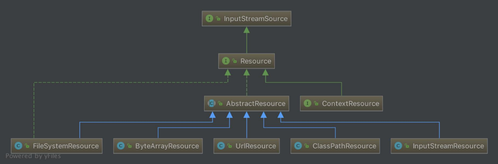
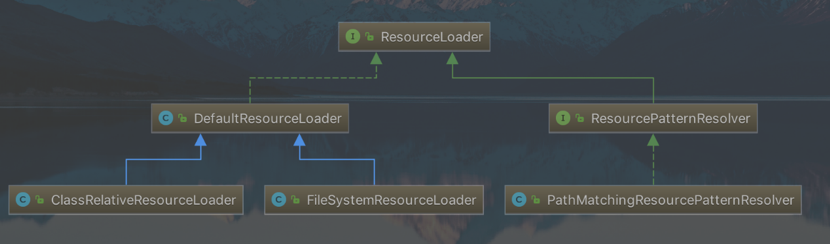

# 1.事务管理

spring的事务管理分为两种：

- 编程式

- 声明式

编程式事务是把事务管理全部用代码来实现（很明显这属于硬编码），声明式事务把事务管理写在XML里或者用注解来实现。spring事务管理的两个核心：

- PlatformTransactionManager(平台事务管理)

- TransactionStatus(事务状态)

PlatformTransactionManager有3个实现类：

1. DataSourceTransactionManager，针对JDBC

2. JpaTranasctionManager，针对JPA框架

3. HibernateTransactionManager，针对Hibernate框架

## 1.1.事务隔离级别

### 1.1.1.read_commit

read_commit，即读_已提交，它表示：事务A、事务B都在读取数据a，读到的都是10。事务A修改a=20，未提交时，事务A读到a=20，但是事务B读到a=10，仅当事务A提交，事务B才会读到a=20

### 1.1.2.read_uncommit

read_uncommit，即读_未提交，它表示：事务A、事务B都在读取数据a，读到的都是10。事务A修改a=20，未提交。此时，事务A读到a=20，事务B也读到a=20。A未提交事务，B也可以读到它修改后的数据

### 1.1.3.repeatable_read

repeatable_read，即可重复度，它表示：读取数据的事务将会禁止写事务（但允许读事务），写事务则禁止任何其他事务

### 1.1.4.serializable

serializable，即序列化，它表示：最严格事务，A操作数据，B禁止操作事务只能一个接着一个地执行，不能并发执行

## 1.2.事务传播属性

事务的传播：方法A定义一个事务，方法A调用到方法B，调用的时候，把A定义好的事务传播给方法B，传播的属性设置如下：

- PROPAGATION_REQUIRED--支持当前事务，如果当前没有事务，就新建一个事务，这是最常见的选择

- PROPAGATION_SUPPORTS--支持当前事务，若当前没有事务，就以非事务方式执行

- PROPAGATION_MANDATORY--支持当前事务，如果当前没有事务，就抛出异常

- PROPAGATION_REQUIRES_NEW--新建事务，如果当前存在事务，把当前事务挂起

- PROPAGATION_NOT_SUPPORTED--以非事务方式执行操作，如果当前存在事务，就把当前事务挂起

- PROPAGATION_NEVER--以非事务方式执行，如果当前存在事务，则抛出异常

- PROPAGATION_NESTED--如果当前存在事务，则在嵌套事务内执行。如果当前没有事务，则进行与PROPAGATION_REQUIRED类似的操作

## 1.3.编程式事务

编程式事务，需要先在代码里配置事务，需要三个组件：

①事务管理对象-PlatformTransactionManager

②事务定义对象-TransactionDefinition

③事务状态对象-TransactionStatus

```java
/* 1.创建事务管理对象 */
PlatformTransactionManager manager = new DataSourceTransactionManager(this.getDataSource());

/* 2.创建事务的定义对象 */
DefaultTransactionDefinition definition = new DefaultTransactionDefinition();
//设置超时时间
definition.setTimeout(5);
//设置事务是否只读，如果要执行增删改，则不能设为true
definition.setReadOnly(false);
//设置事务的隔离级别
definition.setIsolationLevel(TransactionDefinition.ISOLATION_READ_COMMITTED); 
//设置事务的传播属性
definition.setPropagationBehavior(TransactionDefinition.PROPAGATION_REQUIRED); 

/* 3.创建事务的状态 */
TransactionStatus status = manager.getTransaction(definition);
```

配置好事务组件后，就可以使用事务了：

```java
try {
  JdbcTemplate template = this.getJdbcTemplate();
  String sql_1 = "insert into t_student values(1,'name_1','备注_1') ";
  String sql_2 = "insert into t_student values(10,'name_10','备注_1')";
  template.update(sql_1);
  template.update(sql_2);
  manager.commit(status);//事务提交
} catch (Exception e) {
  e.printStackTrace();
  manager.rollback(status);//事务回滚
}
```

注意：

只要在类中定义了事务管理对象，如果没有commit()，即使没有报错，所有的SQL操作都不会写到数据库中，必须显示地将事务提交！

## 1.4.声明式事务

### 1.4.1.xml方式

xml方式需要在spring配置文件中，配置事务需要的组件以及用AOP进行织入：

```xml
<!--配置事务管理器-->
<bean name="transactionManager" 
      class="org.springframework.jdbc.datasource.DataSourceTransactionManager">
  <!-- 需要提前把数据源配置好, 然后直接注入到这里 -->
  <property name="dataSource" ref="dataSource"/>
</bean>

<!-- 对事务做一个声明，需要注入PlatformTransactionManager的实例对象 -->
<tx:advice id="txAdvice" transaction-manager="transactionManager">
  <tx:attributes>
    <!-- 指明对哪个方法进行事务管理，可以声明多个，隔离级别在propagation设置; 
save*意思是对所有开头以save的方法生效,如save1、save222等 -->
    <tx:method name="save*" propagation="REQUIRED"/>
    <!-- 当想让spring也对Exception进行事务回滚, 需要显式用rollback-for指定 -->
    <tx:method name="update*" propagation="REQUIRED" 
               rollback-for="java.lang.Exception"/>
    <tx:method name="delete*" propagation="REQUIRED"/>
    <tx:method name="list*" read-only="true"/>
  </tx:attributes>
</tx:advice>

<!-- 通过AOP来实现非注解的事务管理 -->
<aop:config>
  <!-- 设置AOP切入点, 表示对哪些类做事务管理 -->
  <aop:pointcut id="point_1" expression="execution(* com.sym.transaction.*.*(..))"/>
  <!-- 将声明和切入点匹配，使事务生效 -->
  <aop:advisor advice-ref="txAdvice" pointcut-ref="point_1"/>
</aop:config>
```

通过在xml配置中开启事务管理，并且指定事务管理的界限（即AOP的作用范围）这样在代码中就可以直接使用代码，不需要再做任何事务相关操作：

```java
public void update() throws Exception {
  String sqlOne = "insert into t_student values(9527,'华安啊','唐伯虎点秋香')";
  String sqlTwo = "insert into t_student values(9528,'亚索','面对疾风吧')";
  jdbcTemplate.update(sqlOne);
  int i = 10 / 0;
  jdbcTemplate.update(sqlTwo);
}
```

### 1.4.2.annotation方式

注解方式，是把在xml的配置全部挪到注解上，所以需要创建一个配置类，由它来开启事务管理，并且配置事务管理需要的组件

```java
@Configuration
@EnableTransactionManagement //记住，如果要使用事务注解，一定要使用此注解开启事务管理
public class TransactionAnonConfig {
  /**
   * 创建数据源
   */
  @Bean
  public DataSource dataSource() {
    DriverManagerDataSource dataSource = new DriverManagerDataSource();
    // 数据源的配置...
    return dataSource;
  }


  /**
   * 必须要创建事务管理器
   */
  @Bean
  public DataSourceTransactionManager dataSourceTransactionManager
    (DataSource dataSource) {
    return new DataSourceTransactionManager(dataSource);
  }
}
```

然后就可以直接在类或方法上加上注解@Transactional，事务就起作用了

```java
@Transactional(rollbackFor = Exception.class)
public void runWithTransaction() {
  userDAO.insert();
  int i = 1 / 0;
  roleDAO.insert();
}
```

当然我们也可以在注解上使用事务隔离级别和事务传播属性，如下：

```java
@Transactional( rollbackForClassName = {"RuntimeException","Exception"},
               propagation = Propagation.REQUIRED)
```

## 1.5.源码分析

理解spring源码一个很常用的方式就是从它的@Enable..这种注解开始，毫不例外，事务源码分析也可以从@EnableTransactionManagement入手，很明显它为IOC容器中导入了TransactionManagementConfigurationSelector类

# 2.事件机制

spring有一套完善的事件机制，会在容器启动运行期间监听到指定的事件。但是懂的人自然懂，所谓监听，其实就是观察者模式，在合适的时间回调合适的方法。所以，与spring事件机制有关的类有四个

## 2.1.核心接口

### 2.1.1.ApplicationEvent

```java
public abstract class ApplicationEvent extends EventObject {
  private static final long serialVersionUID = 7099057708183571937L;
  private final long timestamp; //记录事件发生的系统时间

  public ApplicationEvent(Object source) {
    super(source);
    this.timestamp = System.currentTimeMillis();
  }
  public final long getTimestamp() {
    return this.timestamp;
  }
}
```

基本事件对象，spring其它事件都要继承于它，它会把真正的事件内容保存到EventObject中

```java
public class EventObject implements java.io.Serializable {
  private static final long serialVersionUID = 5516075349620653480L;
  protected transient Object  source;
  public EventObject(Object source) {
    if (source == null)
      throw new IllegalArgumentException("null source");
    this.source = source;
  }
  public Object getSource() {
    return source;
  }
  public String toString() {
    return getClass().getName() + "[source=" + source + "]";
  }
}
```

### 2.1.2.ApplicationListener

ApplicationListener，事件的监听器，用来处理相应的事件，源码为：

```java
public interface ApplicationListener<E extends ApplicationEvent> extends EventListener
{
  /**
* Handle an application event.
* @param event the event to respond to
    */
  void onApplicationEvent(E event);
}
```

### 2.1.3.ApplicationEventMulticaster

事件监听多播器，它会持有多个ApplicationListener对象，在事件发生时，调用所有的ApplicationListener处理当前事件，源码：

```java
public interface ApplicationEventMulticaster {
  void addApplicationListener(ApplicationListener<?> listener);
  void addApplicationListenerBean(String listenerBeanName);
  void removeApplicationListener(ApplicationListener<?> listener);
  void removeApplicationListenerBean(String listenerBeanName);
  void removeAllListeners();
  //广播一个事件
  void multicastEvent(ApplicationEvent event);
  void multicastEvent(ApplicationEvent event, ResolvableType eventType);
}
```

### 2.1.4.ApplicationEventPublisher

事件发布器，可以调用[事件多播器](#2.1.3.ApplicationEventMulticaster)的multicastEvent()方法广播事件，源码：

```java
public interface ApplicationEventPublisher {
   void publishEvent(ApplicationEvent event);
   void publishEvent(Object event);
}
```

## 2.2.回调场景

# 3.资源加载

## 3.1.资源Resource

spring的资源体系即Resource体系，它的每一个实现类表示一种资源，整体的继承关系如下：



核心的Resource接口源码如下：

```java
public interface Resource extends InputStreamSource {
  /**
   * 目标资源是否存在
   */
  boolean exists();

  /**
   * 目标资源是否可读
   */
  boolean isReadable();

  /**
   * 目标资源代表的句柄是否被一个流Stream打开了
   */
  boolean isOpen();

  /**
   * 获取目标资源的URL句柄
   */
  URL getURL() throws IOException;

  /**
   * 获取目标资源的URI句柄
   */
  URI getURI() throws IOException;

  /**
   * 获取目标资源的File句柄
   */
  File getFile() throws IOException;

  /**
   * 目标资源的内容字节长度
   */
  long contentLength() throws IOException;

  /**
   * 目标资源的最后修改时间
   */
  long lastModified() throws IOException;

  /**
   * 根据目标资源的相对路径创建新资源
   */
  Resource createRelative(String relativePath) throws IOException;

  /**
   * 目标资源的文件名
   */
  String getFilename();

  /**
   * 目标资源的描述
   */
  String getDescription();
}
```

默认的Resource的抽象实现是AbstractResource，它对接口做了简单实现，因此如果我们想重新定义新的Resource，最好是继承抽象实现AbstractResource，spring自带的其它资源实现类为：

- FileSystemResource：对 java.io.File 类型资源的封装

- ByteArrayResource：对字节数组提供的数据的封装

- UrlResource：对java.net.URL类型资源的封装

- ClassPathResource：类路径资源的实现，使用ClassLoader或Class来加载资源

- InputStreamResource：将InputStream 作为一种资源的 Resource 实现类

## 3.2.资源加载ResourceLoader

spring是将资源与加载区分开了，使用Resource统一表示资源，使用ResourceLoader统一表示资源加载器



