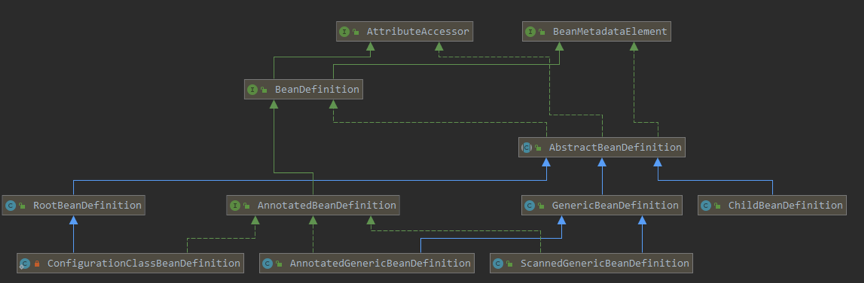

# 1.类扫描机制

spring提供类扫描机制，可以将指定类路径下的.class文件加载到IOC容器总，只需要配置&lt;context:component-scan/>或用注解@ComponentScan。通过追源码，其实spring底层是使用JDK的java.net.URL，获取指定目录下所有的File集合，将其封装成org.springframework.core.io.Resource对象，进一步封装成BeanDefinition对象，然后进行筛选过滤，最终注册到IOC容器内。这其中涉及的几个重要类：

1.org.springframework.context.annotation.**ClassPathBeanDefinitionScanner**

2.org.springframework.context.annotation.**ClassPathScanningCandidateComponentProvider**

3.org.springframework.core.io.support.**PathMatchingResourcePatternResolver**

4.org.springframework.core.type.filter.**AnnotationTypeFilter**

## 1.1.类扫描映射接口

spring提供了许多的接口，用来映射.class文件携带的各种信息，最终都会封装成一个org.springframework.beans.factory.config.BeanDefinition对象。

### 1.1.1.BeanDefinition

BeanDefinition是用于封装Bean描述信息的接口，一个BeanDefinition描述了一个bean的实例，包括属性值，构造方法和继承自它的类的更多信息等。它的部分源码如下：

```java
public interface BeanDefinition extends AttributeAccessor, BeanMetadataElement {
    //分别是单例和多例的作用符
    String SCOPE_SINGLETON = ConfigurableBeanFactory.SCOPE_SINGLETON;
    String SCOPE_PROTOTYPE = ConfigurableBeanFactory.SCOPE_PROTOTYPE;

    //标志BeanDefinition是应用程序主要部分的角色提示，通常对应于用户定义的bean
    int ROLE_APPLICATION = 0;

    //标志BeanDefinition是用户的，是从配置文件中过来的
    int ROLE_SUPPORT = 1;

    //表示BeanDefinition是spring自己的，与用户无关，注册完全属于内部工作的bean时使用
    int ROLE_INFRASTRUCTURE = 2;
}
```

剩下的源码就是BeanDefinitiopn定义的方法用来获取定义Bean时的各种属性配置。它的继承关系为：



### 1.1.2.classMetadata

ClassMetadata是spring用来封装某个类的元数据信息，包括该类是否是抽象的？是否是不可继承的？是否是接口？等信息，源码为：

```java
public interface ClassMetadata {

    //返回底层类的名称
    String getClassName();

    //返回底层类是否表示接口
    boolean isInterface();

    //返回底层类是否表示注解
    boolean isAnnotation();

    //返回底层类是否是抽象的
    boolean isAbstract();

    //返回底层类是否是一个具体类，换句话说，就是既不是接口也不是抽象类
    boolean isConcrete();

    //返回底层类是否是不可继承的最终类
    boolean isFinal();

    //返回底层类是否独立，即它是一个顶层类还是嵌套类（静态内部类）
    boolean isIndependent();

    //返回底层类是否具有封闭类，即底层类是内部/嵌套类或方法中的本地类），如果此方法返回false，
    //则底层类是顶级类
    boolean hasEnclosingClass();

    //如果底层类是顶级类，则返回底层类的封闭类名称
    String getEnclosingClassName();

    //返回底层类是否有超类
    boolean hasSuperClass();

    //如果底层类有超类，返回它的超类名称
    String getSuperClassName();

    //返回底层类实现的所有接口的名称，如果没有则返回空数组
    String[] getInterfaceNames();

    //返回底层类的所有类名称，包括公共，受保护，默认（包）访问，以及类声明的私有类和接口，但不包括
    //继承的类和接口。如果不存在成员类或接口，则返回空数组
    String[] getMemberClassNames();
}
```

### 1.1.3.ScopeMetadata

ScopeMetadata，用来描述Spring管理的bean的范围特征，包括范围名称（即spring作用域）和范围代理行为(即动态代理实现方式)。默认范围是singleton。源码：

```java
public class ScopeMetadata {
    private String scopeName = BeanDefinition.SCOPE_SINGLETON;
    private ScopedProxyMode scopedProxyMode = ScopedProxyMode.NO;
    //省略方法
}
```

其中ScopedProxyMode是一个枚举类，分别表示：

```java
public enum ScopedProxyMode {

    //除非在组件扫描设置了不同的默认值，否则此选项等同于下面的No模式
    DEFAULT,

    //不会创建任何代理
    NO,

    //创建JDK动态代理，基于接口
    INTERFACES,

    //创建CGLIB动态代理，基于类
    TARGET_CLASS;
}
```

### 1.1.4.AnnotatedTypeMetadata

AnnotatedTypeMetadata是对java.lang.reflect.AnnotatedElement接口的封装，AnnotatedElement的对象代表了在当前JVM中的一个“被注解元素”可以是Class，Method，Field，Constructor，Package等。AnnotatedTypeMetadata是MethodMetadata和AnnotationMetadata的父接口。用来获取注定元素上的注解信息。源码如下：

```java
public interface AnnotatedTypeMetadata {

   /**
    * 判断底层元素是否具有给定类型的的注解或元注解，若此方法返回true，则
    * getAnnotationAttributes()方法会返回一个非空Map
    */
    boolean isAnnotated(String annotationName);

   /**
    * 获取底层元素指定类型的注解的属性（如果有的话），如果在基础元素上定义，作为直接注解或元注解，
    * 还会考虑组合注解的属性覆盖
    * @return 返回一个Map，注解属性作为key，注解值作为value
    */
    Map<String, Object> getAnnotationAttributes(String annotationName);

   /**
    * 获取指定类型的注解的属性（如果有的话），参数classValuesAsString表示是否要将Class对象
    * 转换为String类名称，如果在基础元素上定义，作为直接注解或元注解，还会考虑组合注解的属性覆盖
    */
    Map<String, Object> getAnnotationAttributes(String annotationName, 
                                                boolean classValuesAsString);

   /** 
 	* 获取底层元素给定类型的所有注解的所有属性，如果有（即，如果在基础元素上定义，则为直接注解或
 	* 元注解）注意，此方法不会考虑属性覆盖
  	*/
    MultiValueMap<String, Object> getAllAnnotationAttributes(String annotationName);


   /**
    * 获取底层元素给定类型的所有注解的所有属性，如果有（即，如果在基础元素上定义，则为直接注解或
    * 元注解）注意，此方法不会考虑属性覆盖。参数classValuesAsString表示是否要将Class对象
    * 转换为String类名称
    */
    MultiValueMap<String, Object> getAllAnnotationAttributes(String annotationName, 
           boolean classValuesAsString);
}
```

### 1.1.5.MethodMetadata

MethodMetadata是spring用于方法元数据的封装，它的源码为：

```java
public interface MethodMetadata extends AnnotatedTypeMetadata {

   /**
    * 返回方法名称
    */
    String getMethodName();

   /**
    * 返回声明此方法的类的完全限定名称。
    */
    String getDeclaringClassName();

   /**
    * 返回此方法声明的返回类型的完全限定名称
    */
    String getReturnTypeName();

   /**
    * 返回底层方法是否是抽象方法，即在类上标记为抽象或在接口中声明为常规非默认方法
    */
    boolean isAbstract();

   /**
    * 判断方法是否为静态方法
    */
    boolean isStatic();

   /**
    * 判断方法是否为最终方法
    */
    boolean isFinal();

   /**
    * 返回底层方法是否可覆盖，即不标记为静态，最终或私有。
    */
    boolean isOverridable();
}
```

### 1.1.6.AnnotationMetadata

前面说过ClassMetadata对类Class的封装，而AnnotationMetadata就是封装了Class上的注解，对其进行获取和判断。源码为：

```java
public interface AnnotationMetadata extends ClassMetadata, AnnotatedTypeMetadata {

   /**
    * 获取底层类所有注解的类名称(类的全路径)
    */
    Set<String> getAnnotationTypes();

   /**
    *获取底层类指定类型的所有元注解的类名称（注意要使用类全路径）
    */
    Set<String> getMetaAnnotationTypes(String annotationName);

   /**
    * 判断底层类是否有指定类型的注解（方法参数要使用类全路径）
    */
    boolean hasAnnotation(String annotationName);

   /**
    * 判断底层类是否有指定类型的元注解
    */
    boolean hasMetaAnnotation(String metaAnnotationName);

   /**
    * 判断底层类是否有指定注解标注的方法
    */
    boolean hasAnnotatedMethods(String annotationName);

   /**
    * 获取底层类被指定注解标注的所有方法的元数据对象MethodMetadata
    */
    Set<MethodMetadata> getAnnotatedMethods(String annotationName);
  
}
```

## 1.2.类扫描流程

类扫描过程，是将指定包路径下的所有文件加载出来，spring底层用的是java.net.URL来实现的，然后将其封装成Resour对象。这一个流程都是交给**PathMatchingResourcePatternResolver**来实现的。spring类扫描大体上分为2个流程：

①解析扫描路径，获取实际指定包路径的实际磁盘地址，即父目录；

②获取父目录下的所有class文件，封装成Resource对象。

### 1.2.1.获取父目录物理地址

①ClassPathScanningCandidateComponentProvider对用户设置的包扫描路径进行拼凑，加上前缀后缀，类似“classpath*:com/sym/classScan/**/*.class”，然后就交给**PathMatchingResourcePatternResolver**进行扫描：

```java
String CLASSPATH_ALL_URL_PREFIX= "classpath*:";
this.resourcePattern = "**/*.class";
String packageSearchPath = ResourcePatternResolver.CLASSPATH_ALL_URL_PREFIX +
    resolveBasePackage(basePackage) + '/' + this.resourcePattern;
Resource[] resources = this.resourcePatternResolver.getResources(packageSearchPath);
```

②首先执行PathMatchingResourcePatternResolver的getResources()方法，它根据路径来决定使用何种扫描

```java
// PathMatchingResourcePatternResolver – 273行
public Resource[] getResources(String locationPattern) throws IOException {
    Assert.notNull(locationPattern, "Location pattern must not be null");
    // 判断路径是不是以classpath*:开头的，当然这里肯定返回true
    if (locationPattern.startsWith(CLASSPATH_ALL_URL_PREFIX)) {
        // 截取路径除classpath*:后面的字符串，即：com/sym/classScan/**/*.class
        // 使用AntPathMatcher进行路径匹配(怎么匹配要去查看Ant方式的路径匹配)，
        // 这里也会返回true
        if (getPathMatcher().isPattern(
            locationPattern.substring(CLASSPATH_ALL_URL_PREFIX.length()))) {
            // 进入单个类路径资源的扫描，跳转到第③步
            return findPathMatchingResources(locationPattern);
        }else {
            // all class path resources with the given name
            return findAllClassPathResources(locationPattern.substring
                                             (CLASSPATH_ALL_URL_PREFIX.length()));
        }
    }else {
        // Only look for a pattern after a prefix here
        // (to not get fooled by a pattern symbol in a strange prefix).
        int prefixEnd = locationPattern.indexOf(":") + 1;
        if (getPathMatcher().isPattern(locationPattern.substring(prefixEnd))) {
            // a file pattern
            return findPathMatchingResources(locationPattern);
        }else {
            // a single resource with the given name
            return new Resource[] {getResourceLoader().getResource(locationPattern)};
        }
    }
}
```

③进入findPathMatchingResources()方法，此时方法参数，即路径为：classpath*:com/sym/classScan/**/*.class

```java
// PathMatchingResourcePatternResolver – 456行
protected Resource[] findPathMatchingResources(String locationPattern) {
    //截取参数指定的路径, 求出根目录地, 类似：classpath*:com/sym/classScan/
    String rootDirPath = determineRootDir(locationPattern);
    //获取子目录地址：**/*.class
    String subPattern = locationPattern.substring(rootDirPath.length());
    //跳转到第④⑤⑥步进行扫描，返回该相对路径下的所有绝对路径地址（即磁盘上的地址）
    Resource[] rootDirResources = getResources(rootDirPath);
    //然后就是遍历该绝对路径地址，依次找出该目录下的所有资源
    Set<Resource> result = new LinkedHashSet<Resource>(16);
    for (Resource rootDirResource : rootDirResources) {
        // 处理 Resource 对象, 默认直接返回
        rootDirResource = resolveRootDirResource(rootDirResource);
        URL rootDirURL = rootDirResource.getURL();
        //反射的Method，此时为Null
        if (equinoxResolveMethod != null) {
            if (rootDirURL.getProtocol().startsWith("bundle")) {
                rootDirURL = (URL) ReflectionUtils.invokeMethod(equinoxResolveMethod, 
                                                                null, rootDirURL);
                rootDirResource = new UrlResource(rootDirURL);
            }
        }
        // 如果 URL 是vfs类型( virtual file system, 虚拟文件系统)
        if (rootDirURL.getProtocol().startsWith(ResourceUtils.URL_PROTOCOL_VFS)) {
            result.addAll(VfsResourceMatchingDelegate.findMatchingResources(
                rootDirURL, subPattern, getPathMatcher()));
        }else if (ResourceUtils.isJarURL(rootDirURL) || 	
                  isJarResource(rootDirResource)) {
            //如果是jar类型 
            result.addAll(doFindPathMatchingJarResources(rootDirResource, rootDirURL, 
                                                         subPattern));
        }else {
            // 既不属于vfs又不属于jar的其它类型URL(一般是file协议)则会加载旗下所有文件file
            // 接着调用doFindPathMatchingFileResources()执行1.2.2阶段, 封装Resource对象
            result.addAll(doFindPathMatchingFileResources(rootDirResource, 
                                                          subPattern));
        }
     }
  }
  return result.toArray(new Resource[result.size()]);
}
```

④方法会返回到第②步的getResources()扫描根目录下的文件，此时参数路径变为：classpath*:com/sym/classScan/

```java
// PathMatchingResourcePatternResolver – 273行
public Resource[] getResources(String locationPattern) throws IOException {
    Assert.notNull(locationPattern, "Location pattern must not be null");
    //判断路径是不是以“classpath*:”开头的，这里会返回true
    if (locationPattern.startsWith(CLASSPATH_ALL_URL_PREFIX)) {
        // 使用AntPathMatcher判断路径：com/sym/classScan/，这里就匹配不到了
        if (getPathMatcher().isPattern(
            locationPattern.substring(CLASSPATH_ALL_URL_PREFIX.length()))) {
            return findPathMatchingResources(locationPattern);
        }else {
            // 截取出路径：com/sym/classScan/，查询旗下所有的资源
            return findAllClassPathResources(locationPattern.substring(
                CLASSPATH_ALL_URL_PREFIX.length()));
        }
    }
}
```

⑤查询指定路径下的所有资源，此时的路径变为：com/sym/classScan/

```java
// PathMatchingResourcePatternResolver – 310行
protected Resource[] findAllClassPathResources(String location) throws IOException {
    String path = location;
    if (path.startsWith("/")) {
        path = path.substring(1);
    }
    //调用doFindAllClassPathResources()执行搜索，然后将相对路径下的所有绝对路径地址加载出来
    Set<Resource> result = doFindAllClassPathResources(path);
    return result.toArray(new Resource[result.size()]);
}
```

⑥真正执行搜索doFindAllClassPathResources()，此时路径为：com/sym/classScan/

```java
// PathMatchingResourcePatternResolver – 329行
protected Set<Resource>doFindAllClassPathResources(String path) throws IOException {
    Set<Resource> result = new LinkedHashSet<Resource>(16);
    ClassLoader cl = getClassLoader();
    // 使用一个类加载器查询指定路径下的资源, 解释下：类加载器可以解析类路径下形如：com/sym/util
    // 格式的包路径, 将其封装成 URL 格式的对象返回.
    Enumeration<URL> resourceUrls = (cl != null ? cl.getResources(path) : 
                                     ClassLoader.getSystemResources(path));
    // 这边就会把相对路径：com/sym/classScan/下的所有绝对路径加载，注意是绝对路径(磁盘地址)
    while (resourceUrls.hasMoreElements()) {
        URL url = resourceUrls.nextElement();
        // 将java.net.URL 封装成 UrlResource, 添加到result返回
        result.add(convertClassLoaderURL(url));
    }
    //路径是不为空的，所以就直接返回了
    if ("".equals(path)) {
        addAllClassLoaderJarRoots(cl, result);
    }
    return result;
}
```

### 1.2.2.封装class文件成Resource对象

通过类加载器获取到用户指定目录的实际物理磁盘地址后，spring类扫描的第一阶段就完成，方法会返回到[第一阶段](#1.2.1.获取父目录物理地址)的第③步。接着执行第二阶段，将实际地址下的所有class文件加载封装成FileSystemResource对象。①doFindPathMatchingFileResources()会加载绝对路径下的所有文件，参数rootDirResource是一个UrlResource，是第一阶段获取到的实际磁盘路径；参数subPattern值为：\*\*/*.class

```java
// PathMatchingResourcePatternResolver – 680行
protected Set<Resource>doFindPathMatchingFileResources(Resource rootDirResource, 
   		String subPattern)throws IOException {
    File rootDir;
    try {
        //通过 java.net.URL 解析出根目录文件, File 类型表示
        rootDir = rootDirResource.getFile().getAbsoluteFile();
    }catch (IOException ex) {
        return Collections.emptySet();
    }
    // 调用第②步继续解析.
    return doFindMatchingFileSystemResources(rootDir, subPattern);
}
```

②调用doFindMatchingFileSystemResources()进行扫描，参数rootDir是一个File对象，它代表一个文件夹(父目录)；参数subPattern还是\*\*/*.class

```java
// PathMatchingResourcePatternResolver – 707行
protected Set<Resource> doFindMatchingFileSystemResources(File rootDir, 
             String subPattern)throws IOException {
    //跳转第③步，调用retrieveMatchingFiles()查找旗下的子文件
    Set<File> matchingFiles = retrieveMatchingFiles(rootDir, subPattern);
    //一个一个封装成FileSystemResource对象
    Set<Resource> result = new LinkedHashSet<Resource>(matchingFiles.size());
    for (File file : matchingFiles) {
        result.add(new FileSystemResource(file));
    }
    return result;
}
```

③调用retrieveMatchingFiles()获取指定文件夹下的，匹配子路径的所有文件File

```java
// PathMatchingResourcePatternResolver – 728行
protected Set<File> retrieveMatchingFiles(File rootDir, String pattern){
    //父目录不存在就直接返回空集合了
    if (!rootDir.exists()) {
        return Collections.emptySet();
    }
    //父目录不是一个目录(文件夹)，也直接返回空集合
    if (!rootDir.isDirectory()) {
        return Collections.emptySet();
    }
    //父目录没有读取权限，也直接返回空集合
    if (!rootDir.canRead()) {
        return Collections.emptySet();
    }
    // 将文件分隔符由“\”替换为“/”, 形如：E:/workspace/target/classes/com/sym/classScan
    String fullPattern = StringUtils.replace(rootDir.getAbsolutePath(), 
                                             File.separator, "/");
    //在fullPattern屁股后面加个 /
    if (!pattern.startsWith("/")) {
        fullPattern += "/";
    }
    //拼接上子路径模式，进行查找
    //此时路径变为E:/workspace/target/classes/com/sym/classScan/**/*.class
    fullPattern = fullPattern + StringUtils.replace(pattern, File.separator, "/");
    Set<File> result = new LinkedHashSet<File>(8);
    //调用第④步执行查找
    doRetrieveMatchingFiles(fullPattern, rootDir, result);
    return result;
}
```

④真正执行查找了，参数fullPattern此时为：E:/workspace/Idea_study/spring知识点/target/classes/com/sym/classScan/**/*.class；参数dir表示实际的父目录File对象。

```java
// PathMatchingResourcePatternResolver – 769行
protected void doRetrieveMatchingFiles(String fullPattern, File dir, 
                                       Set<File> result) {
    // 获取父文件夹下的所有子文件，不存在任何文件就直接返回
    File[] dirContents = dir.listFiles();
    if (dirContents == null)  return; 
    Arrays.sort(dirContents);
    for (File content : dirContents) {
        // 遍历所有子文件，首先判断它是否为文件夹，并且能匹配上fullPattern
        String currPath = StringUtils.replace(content.getAbsolutePath(), 
                                              File.separator, "/");
        if (content.isDirectory() && getPathMatcher().matchStart(fullPattern, 
                                           currPath + "/")){
            if (!content.canRead()) {
                // 子文件夹读不了，就溜了，搞下一个子文件了
            }else {
                // 如果子文件夹有访问权限，就递归执行此方法
                doRetrieveMatchingFiles(fullPattern, content, result);
            }
        }
        // 若子文件不是一个文件夹, 且能匹配上路径, 就直接添加到返回结果上 
        if (getPathMatcher().match(fullPattern, currPath)) {
            result.add(content);
        }
    }
}
```

到此，spring类扫描流程就已经完成，接着会执行类过滤流程，将扫描的所有FileSystemResource对象进行过滤，筛选出需要添加到IOC容器中的类。

## 1.3.类过滤流程

类过滤流程，就是将[类扫描流程](#_类扫描流程)的FileSystemResource进一步封装成BeanDefinition对象。起到关键作用的是：TypeFilter接口，默认spring是使用实现类AnnotationTypeFilter来进行过滤操作；整个类过滤流程是在ClassPathScanningCandidateComponentProvider类的findCandidateComponents()方法执行

### 1.3.1.过滤器TypeFilter进行筛选

①遍历[类扫描流程](#1.2.类扫描流程)得到的Resource数组，依次过滤每个类

```java
// ClassPathScanningCandidateComponentProvider – 273行
public Set<BeanDefinition> findCandidateComponents(String basePackage) {
    Set<BeanDefinition> candidates = new LinkedHashSet<BeanDefinition>();
    try {
        String packageSearchPath = ResourcePatternResolver.CLASSPATH_ALL_URL_PREFIX +
            resolveBasePackage(basePackage) + '/' + this.resourcePattern;
        // 执行类扫描流程把指定目录下的类文件以FileSystemResource[]的形式返回
        Resource[] resources = 
            this.resourcePatternResolver.getResources(packageSearchPath);
        // 从这边开始，就执行类过滤流程, 遍历每个Resource
        for (Resource resource : resources) {
            if (resource.isReadable()) {
                try {
                    // MetadataReader是对部分类扫描映射接口的封装，用来获取
                    // Resource、ClassMetadata和 AnnotationMetadata接口
                    MetadataReader metadataReader = 
                        this.metadataReaderFactory.getMetadataReader(resource);
                    // 重点方法: 执行过滤，判断此class文件是否可以被加载，跳转到第②步执行
                    if (isCandidateComponent(metadataReader)) {
                        // 如果代码可以执行到这边，说明这个类可以被加载IOC容器，
                        // 初始化BeanDefinition
                        ScannedGenericBeanDefinition sbd = new 
                            ScannedGenericBeanDefinition(metadataReader);
                        sbd.setResource(resource);
                        sbd.setSource(resource);
                    }
                    //判断此类是否是一个顶级父类，详见第③步
                    if (isCandidateComponent(sbd)) {
                        candidates.add(sbd);
                    }
                    // 这边省略部分不重要代码...
                    return candidates;
                }
            }
        }
    }
}
```

②isCandidateComponent()用来确定给定的类是否与任何排除过滤器不匹配并且匹配至少一个包含过滤器

```java
// ClassPathScanningCandidateComponentProvider – 347行
protected boolean isCandidateComponent(MetadataReader metadataReader) {
    // 如果类被排除过滤器匹配上了，说明它不需要被加载，方法直接返回true
    for (TypeFilter tf : this.excludeFilters) {
        if (tf.match(metadataReader, this.metadataReaderFactory)) {
            return false;
        }
    }
    // 如果类不在排除过滤器的过滤范围内，接着判断它是否在包含过滤器的过滤范围
    // 仅当包含时方法才会返回true，否则也是返回false
    for (TypeFilter tf : this.includeFilters) {
        if (tf.match(metadataReader, this.metadataReaderFactory)) {
            return isConditionMatch(metadataReader);
        }
    }
    return false;
}
```

③判断类是否允许被加载IOC容器中，依据：给定的BeanDefinition对象是否符合候选条件，默认检查此类是否不是一个接口并且不依赖于封闭类，而且可以在子类中重写

```java
// ClassPathScanningCandidateComponentProvider – 382行
protected boolean isCandidateComponent(AnnotatedBeanDefinition beanDefinition) {
    AnnotationMetadata metadata = beanDefinition.getMetadata();
    return (metadata.isIndependent() && (metadata.isConcrete() ||
           (metadata.isAbstract() && 	    metadata.hasAnnotatedMethods(Lookup.class.getName()))));
}
```

### 1.3.2.默认过滤器AnnotationTypeFilter

默认过滤器AnnotationTypeFilter的匹配原理:

```java
// 默认这个成员变量，就是我们在spring中常用的@Component注解
private final Class<? extends Annotation>annotationType;
// 默认值为true，表示在判断注解时，要将元注解考虑进去
private final boolean considerMetaAnnotations;

//判断类上面是否带有@Component注解，或者@Component的衍生注解
@Override
protected boolean matchSelf(MetadataReader metadataReader) {
    AnnotationMetadata metadata = metadataReader.getAnnotationMetadata();
    return metadata.hasAnnotation(this.annotationType.getName()) ||
        (this.considerMetaAnnotations && metadata.hasMetaAnnotation
         (this.annotationType.getName()));
}
```

## 1.4.自定义类扫描对象

理解了上述两个：[类扫描流程](#1.2.类扫描流程)和[类过滤流程](#1.3.类过滤流程)，如果我们要自定义注解，并且让spring将其扫描加载到IOC容器，就可以有各式各样的解决方案。

### 1.4.1.最简单方式

在我们自定义的注解中加入@Component，AnnotationTypeFilter默认会把元注解考虑进去，所以当我们注解中加入了@Component，就会被其匹配成功

```java
@Documented
@Target(value = ElementType.TYPE)
@Retention(value = RetentionPolicy.RUNTIME)
@Inherited
@Component//将@Component作为一个元注解，放在我们的自定义注解中
public @interface SymRpc {
}
```

### 1.4.2.自定义TypeFilter

spring提供了ClassPathBeanDefinitionScanner类来完成类扫描、过滤和注册，我们可以自己new一个ClassPathBeanDefinitionScanner，调用它的scan()方法扫描一遍：

```java
// 初始化ClassPathBeanDefinitionScanner需要一个Bean注册器，其实就是BeanFactory实现类。
// 这个实现类我们可以通过ApplicationContext获取到
ClassPathBeanDefinitionScanner scanner = new 
    ClassPathBeanDefinitionScanner(context.getDefaultListableBeanFactory());
// 重新new一个AnnotationTypeFilter过滤器，并且指定它的匹配注解为我们自定义的注解
// 将其注册到扫描类scanner中
scanner.addIncludeFilter(new AnnotationTypeFilter(SymRpc.class));
// 指定扫描路径，调用scan()方法开始扫描
scanner.scan("com.sym.classScan");
```

# 2.容器创建流程


