# 1.springCloud介绍

## 1.1.简介

springCloud，基于SpringBoot提供了分布式微服务架构下的一站式解决方案，是各个微服务架构实现技术的集合体，包括服务注册与发现，配置中心，全链路监控，服务网关，负载均衡，熔断器等组件，除了基于NetFlix的开源组件做高度抽象封装之外，还有一些选型中立的开源组件。

## 1.2.对比dubbo

**技术上的区别：**

| **技术栈**   | **Dubbo**     | **SpringCloud**              |
| ------------ | ------------- | ---------------------------- |
| 服务注册中心 | Zookeeper     | SpringCloud  Netflix Eureka  |
| 服务调用方式 | RPC           | REST API                     |
| 服务监控     | Dubbo-monitor | SpringBoot  Admin            |
| 断路器       | 不完善        | SpringColoud Netflix Hystrix |
| 服务网关     | 无            | SpringCloud  Netflix Zuul    |
| 分布式配置   | 无            | SpringCloud config           |
| 服务跟踪     | 无            | SpringCloud  Sleuth          |
| 消息总线     | 无            | SprinigCloud Bus             |
| 数据流       | 无            | SpringCloud  Stream          |
| 批量任务     | 无            | SpringCloud Task             |

**最大的区别：**

①dubbo基于RPC协议进行远程通讯；cloud基于HTTP的RESTful API通讯。

②dubbp定位是RPC框架，springCloud定位是微服务一站式解决方案。

**比喻：**

dubbo相当于组装机，要把它装成一台电脑，需要这边买配置，那边买配置；而springCloud相当于品牌机，买来就可以用，什么配置都搞好了！

## 1.3.对比springBoot

springBoot专注于快速、方便得开发单个微服务个体，springCloud关注全局的服务协调治理；springBoot可以离开springCloud独立开发项目，但是springCloud离不开springBoot。

# 2.注册中心Eureka

Eureka是Netflix的一个子模块，也是核心模块之一。其本身是一个基于REST的服务，Spring Cloud将它集成在其子项目spring-cloud-netflix中，以实现Spring Cloud的服务注册和服务发现功能。Eureka采取了CAP定理的AP原则，保持分区容错性和高可用性！

  Eureka在springCloud扮演的角色相当于Zookeeper在dubbo扮演的角色。Eureka采用了C-S的设计架构，它包含两个组件：服务端Eureka-Server和客户端Eureka-Client。**Eureka-Server**是服务注册中心**，提供服务注册功能；而系统中的微服务，使用客户端Eureka-Client连接到Eureka-Server注册服务或者消费服务，并与Eureka-Server维持心跳连接。运维人员可以通过服务端Eureka-Server来判断系统中的服务是否运行正常。

## 2.1.EurekaServer服务端

对应的配置类：org.springframework.cloud.netflix.eureka.server.EurekaServerConfigBean

### 2.1.1.单机环境

1. 引入pom依赖，springCloud基于springBoot开发，因此我们在搭建系统时，需要先搭建springBoot环境，然后再搭建springCloud环境：使用\<dependencyManagement>指定springCloud父依赖

```xml
<parent>
    <groupId>org.springframework.boot</groupId>
    <artifactId>spring-boot-starter-parent</artifactId>
    <version>1.5.9.RELEASE</version>
</parent>
<properties>
    <!--指定springCloud的版本-->
    <spring-cloud.version>Edgware.SR5</spring-cloud.version>
</properties>
<!--springCloud的父依赖-->
<dependencyManagement>
    <dependencies>
        <dependency>
            <groupId>org.springframework.cloud</groupId>
            <artifactId>spring-cloud-dependencies</artifactId>
            <version>${spring-cloud.version}</version>
            <type>pom</type>
            <scope>import</scope>
        </dependency>
    </dependencies>
</dependencyManagement>
```

然后引入Eureka-Server的依赖：

```xml
<!--Eureka的依赖 -->
<dependency>
    <groupId>org.springframework.cloud</groupId>
    <artifactId>spring-cloud-starter-netflix-eureka-server</artifactId>
</dependency>
<!--springBoot的web模块-->
<dependency>
    <groupId>org.springframework.boot</groupId>
    <artifactId>spring-boot-starter-web</artifactId>
</dependency>
```

2. 在application.yml配置eureka-server：

```yaml
## springCloud注册中心eureka的配置
server:
  port: 9527
eureka:
  instance:
    hostname: eureka-server #代表实例的主机名
  client:
    #表示此实例是否应将其信息注册到eureka服务器以供其它实例发现
    #为false不把自己(当前实例)注册到eureka服务器上
    register-with-eureka: false
    #表示此实例是否应从eureka服务器获取eureka注册表信息
    #为false表示不从eureka上去获取服务的注册信息
    fetch-registry: false
    #service-url #在搭建Eureka注册中心集群时使用，将本注册中心实例注册到集群
                  #中的其它注册中心节点上
```

3. 在启动类上使用@EnableEurekaServe，该注解是用来启动Eureka Server的自动配置类即EurekaServerAutoConfiguration。

```java
@SpringBootApplication
@EnableEurekaServer
public class EurekaApplication {
    public static void main(String[] args) {
        SpringApplication.run(EurekaApplication.class, args);
    }
}
```

4. 启动此springBoot工程即可！访问`http://127.0.0.1:9527`即可，该端口为yml配置文件指定的server.port配置

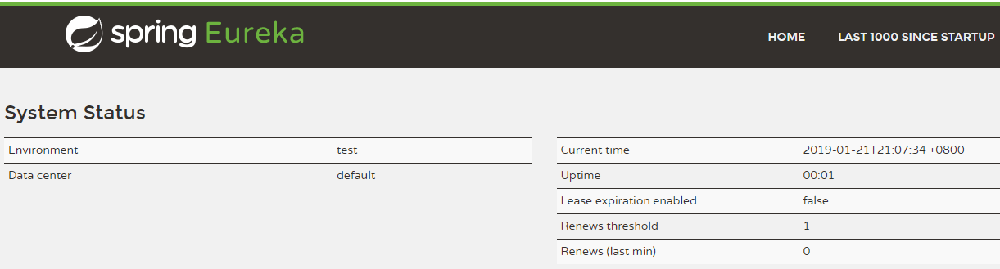

### 2.1.2.搭建集群

一般不会只启动一个注册中心，而是搭建注册中心集群，Eureka客户端只要向集群中的任意一个注册中心节点注册服务即可，集群内的其它注册中心节点都可以收到该客户端的注册信息！而集群内的每个注册中心节点的搭建都跟[搭建单机](#2.1.1.单机)的配置一样，唯一要区别的就是service-url的配置，要将本注册中心实例注册到其它注册中心实例上。

**例如：**

有3个Eureka Server节点组成一个注册中心集群，它们的启动端口分别为：9527，9528，9529。例如9527注册中心的配置关于service-url的配置为：

```yaml
eureka:
  ... #其它配置与单机环境一样
  service-url: #搭建Eureka Server集群时使用service-url注册自己到其它注册中心节点上
      defaultZone: http://127.0.0.1:9528/eureka,http://127.0.0.1:9529/eureka
```

同理，9528就要注册自己到9527和9529上，9529注册自己到9527和9528上。这样，即使Eureka客户端只注册服务到9527上，9528和9529都可以收到该客户端的注册信息，形成一个高可用的架构！

**注意：**

Eureka客户端的注册信息是单向传递的，什么意思？例如：EurekaServer-A注册自己到EurekaServer-B上，则所有注册到A上的微服务都会被B接收到；但是B没有将自己注册到A上，则所有注册到B上的微服务，A都收不到。

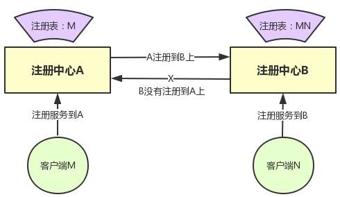

## 2.2.EurekaClient客户端

EurekaClient客户端分为两种：一种是服务提供方，需要将自己注册到EurekaServer上，供其它实例使用；另一种是服务消费方，仅是调用服务，不需要将自己注册到EurekaServer上。两种的配置略有不同！

### 2.2.1.服务提供方

1. 与[搭建EurekaServer](#2.1.EurekaServer服务端)一样，先搭建springBoot环境，再搭建springCloud环境，然后引入EurekaClient的pom依赖

   ```xml
   <!-- Eureka客户端，注意与Eureka Server引入的pom依赖区别开-->
   <dependency>
      <groupId>org.springframework.cloud</groupId>
      <artifactId>spring-cloud-starter-eureka</artifactId>
   </dependency>
   ```

2. 配置application.yml文件，配置eureka客户端的相关配置：

   ```yaml
   ## 配置服务端口
   server:
     port: 8001
   ## 配置此应用的应用名
   spring:
     application:
       name: springCloud-provider
   ## 配置连接Eureka服务端的若干信息
   eureka:
     client:
       service-url:
         #Eureka服务端的访问地址(该地址为注册中心集群的任一节点的服务地址)
         defaultZone: http://127.0.0.1:9527/eureka
     instance:
       instance-id: provider-8001 #配置此实例注册到Eureka服务端的实例名称
       prefer-ip-address: true #允许使用本机IP地址作为服务注册的标识
   # 使用info结合springBoot的监管模块，可以向外部简单介绍本应用的情况
   info:
     name: springCloud-provider-8001
     desc: 在8001端口暴露出服务
     company: com.sym
   ```

3. 在springBoot启动类上使用@EnableEurekaClient注解启动服务发现功能

   ```java
   @SpringBootApplication
   @EnableEurekaClient
   public class ProviderApp8001 {
       public static void main(String[] args) {
           // 启动springBoot应用后，就可以将本服务注册到Eureka Server上
           SpringApplication.run(ProviderApp8001.class, args);
       }
   }
   ```

### 2.2.2.服务消费方

1. 这一步与[搭建EurekaServer](#2.1.EurekaServer服务端)一样，先搭建springBoot环境再搭建，springCloud环境，然后引入EurekaClient的pom依赖

   ```xml
   <!-- Eureka客户端，注意与Eureka Server引入的pom依赖区别开-->
   <dependency>
      <groupId>org.springframework.cloud</groupId>
      <artifactId>spring-cloud-starter-eureka</artifactId>
   </dependency>
   ```

2. 配置application.yml文件，配置eureka客户端的相关配置：

   ```yaml
   server:
     port: 80
   eureka:
     client:
       service-url:
         #Eureka服务端的访问地址(该地址为注册中心集群的任一节点的服务地址)
         defaultZone: http://127.0.0.1:7777/eureka
       #此实例作为服务消费，不需要把自己注册到Eureka Server上
       register-with-eureka: false 
   ```

3. 直接启动springBoot应用即可，不需要再额外添加其它注解

   ```java
   @SpringBootApplication
   public class ConsumerApp80 {
       public static void main(String[] args) {
           SpringApplication.run(ConsumerApp80.class, args);
       }
   }
   ```

4. 由于springCloud是基于REST进行远程服务调用的，所以消费方想要调用提供方的服务，就需要注入一个RestTemplate模板，使用它进行远程服务调用

   ```java
   @Configuration
   public class ConsumerConfig {
       @Bean
       @LoadBalanced //负载均衡注解，使用它来获取服务注册地址
       public RestTemplate restTemplate(){
           return new RestTemplate();
       }
   }
   ```

5. 通过服务提供方暴露出来的应用名+REST接口，消费方就可以远程调用提供方的服务：

   ```java
   String url = "http://springCloud-provider/provider/user/list";
   return restTemplate.getForObject(url,List.class);
   ```

## 2.3.自我保护机制

### 2.3.1.什么是自我保护机制?

​	Eureka自我保护机制是针对Eureka Server（服务端）而言，它是一种应对网络异常的安全保护措施。实际上，Eureka Client每隔30s会向Eureka Server发送心跳信息，更新实例信息以及通知Eureka Server该实例存活。如果一个Eureka Client超过90s未发送心跳更新，Eureka Server会从注册中心表中剔除该实例。

  但是，如果是因为网络分区不稳定，Eureka Client发送的心跳更新信息无法被Eureka Server接收到，这时候就不应该剔除该Eureka Client。自我保护机制就是解决这一问题的：当一个Eureka Server节点满足[指定条件](#2.3.2.触发条件)，它会自动开启自我保护机制。在自我保护机制下，Eureka Server会提示一个警告，尝试保护其服务注册表中的信息，不再删除服务注册表中的任何客户端实例，即不会注销任何微服务。若网络恢复正常(见下面)，会自动关闭自我保护机制！

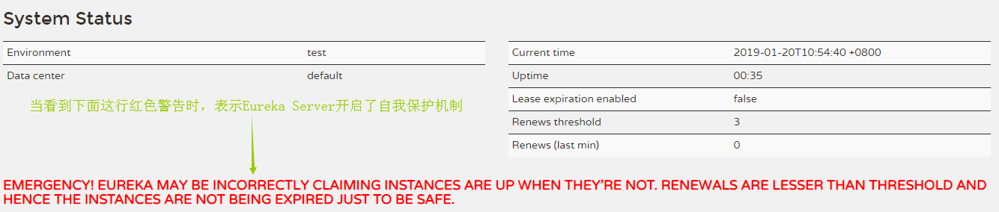

### 2.3.2.触发条件

Eureka Server是否要开启自我保护机制，有两个很重要的变量：

- Renews threshold：**理论上每分钟收到心跳更新的Eureka Client数量**

- Renews (last min)：**实际上每分钟收到心跳更新的Eureka Client数量**

这两个变量可以在Eureka Server首页中看到。自我保护机制开启的条件：**Eureka服务端启动1分钟后，Renews (last min) < Renews threshold**。

```java
// Renews threshold计算方式：
this.expectedNumberOfRenewsPerMin = count * 2;
this.numberOfRenewsPerMinThreshold = (int) (this.expectedNumberOfRenewsPerMin * serverConfig.getRenewalPercentThreshold());
```

1. **count**：表示微服务实例（Eureka Client）的数量，如果Eureka Server开启了自注册，也需要算入count中；

2. **expectedNumberOfRenewsPerMin**：它是表示Eureka Server每分钟应该收到心跳更新的客户端数量，由于客户端(Eureka Client)是每隔30s发送一次心跳更新。所以理论上一分钟内有 count*2 个心跳更新数量。
3. **numberOfRenewsPerMinThreshold**：它就是最终**Renews threshold** 的值，serverConfig.getRenewalPercentThreshold()方法默认返回值为0.85。所以Renews threshold的值就等于expectedNumberOfRenewsPerMin * 0.85取整数部分的值！

**例如：**

开启一个Eureka Server实例，并且向其注册了3个微服务(Eureka Client)实例。这时，count=3，expectedNumberOfRenewsPerMin就等6，numberOfRenewsPerMinThreshold的值就等于6*0.85=5.1，取整数部分后，则**Renews threshold**=5。意味着如果每分钟Eureka Server收到心跳更新的Client数量小于5，它就会开启自我保护机制！当网络恢复正常，一分钟内收到心跳更新的Client数量大于等于5，Eureka会自动关闭自我保护机制。

### 2.3.3.属性配置

```yaml
eureka:
  server:
    #是否开启自我保护机制,true表示开启，默认开启
    enable-self-preservation: false 
    #eureka server清理无效节点的时间间隔，默认60000毫秒，即60秒
    eviction-interval-timer-in-ms: 6000
    #eureka server同步失败的等待时间，单位为毫秒，默认5分钟，
    #在这期间，它不向客户端提供服务注册信息
    wait-time-in-ms-when-sync-empty: 5*60*1000
    #eureka server同步失败的重试次数 默认为 5 次
    number-of-replication-retries: 5
    #eureka server自我保护系数（默认0.85）
    renewal-percent-threshold: 0.49 
  instance:
    #表示eureka client间隔多久发送心跳更新给eureka server，默认30秒
    lease-renewal-interval-in-seconds: 30
    #eureka server至上一次收到client的心跳之后，等待下一次心跳的超时时间
    #在这个时间内若没收到下一次心跳，则将移除该instance，默认90秒
    lease-expiration-duration-in-seconds: 90
```

## 2.4.服务发现注解

springCloud提供了两种**服务发现**注解：

- @EnableEurekaClient

- @EnableDiscoveryClient

**两者的区别：**

@EnableDiscoveryClient基于spring-cloud-commons，而@EnableEurekaClient基于spring-cloud-netflix。更简单的来说，如果选用的注册中心是eureka，那么就使用@EnableEurekaClient，如果是其他的注册中心，那么推荐使用@EnableDiscoveryClient！

## 2.5.Eureka配置

一般Eureka server，即注册中心的配置采用默认即可，如果有需要查找它的配置类：org.springframework.cloud.netflix.eureka.server.EurekaServerConfigBean；更多情况，都是对Eureka client做配置，分为两个部分：服务注册相关的配置和服务实例相关的配置！

### 2.5.1.服务注册相关配置

配置类：org.springframework.cloud.netflix.eureka.EurekaClientConfigBean，以下参数均是以eureka.client作前缀：

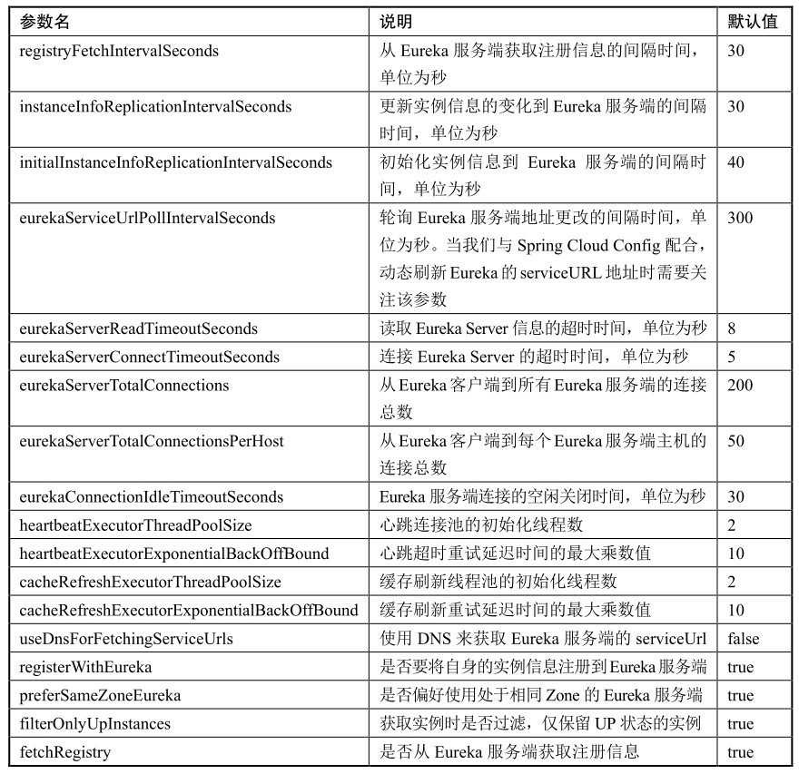

### 2.5.2.服务实例相关配置

对应配置类：org.springframework.cloud.netflix.eureka.EurekaInstanceConfigBean。springCloud会把上面配置类的信息封装成com.netflix.appinfo.InstanceInfo，然后发给Eureka Server注册服务，其中会携带当前服务的元数据。元数据是指用来描述自身服务信息的对象，其中包含了一些标准化的元数据，比如服务名称、实例名称、实例IP、实例端口等用于服务治理的重要信息；以及一些用于负载均衡策略或是其他特殊用途的自定义元数据信息

#### 2.5.2.1.元数据配置

所有以eureka.instance.\<properties>=\<value>都是对标准的元数据进行配置，其中\<properties>就是EurekaInstanceConfigBean对象中的成员变量名，当然除了eureka指定的元数据，我们也可以自定义元数据，使用eureka.instance.metadata-map来指定：

```yaml
eureka:
  instance:
    ## 自定义服务元数据
    metadata-map:
      info: just do it man!!!
      myself: you are the best
      zone: beijing
```

- **端点配置**

eureka实例有3个URL可以配置，他们分别是：

```yaml
eureka:
  client:
    # 这边可以配置相对路径, 也可以配置绝对路径, 在客户端使用https协议时, 这边就需要手动
    # 配置成类似：https://${server.context-path}/info.默认springCloud会带上工程根
    # 路径的就是${server.context-path}
	#主页的URL
    home-page-url:  https://${server.context-path}/ 

	#状态页的URL, 默认使用spring-boot-actuator模块的/info端点, 也可以配置相对路径
    status-page-url: https://${ server.context-path }/info 

	#健康检查的URL, 默认使用spring-boot-actuator模块的/health端点
    health-check-url: https://${server.context-path}/health 
```

其中，status-page-url是用来在eureka管理界面上点击服务实例时能看到实例的一些信息；而health-check-url，如果再配置使用springBoot的actuator来管理服务实例的健康状态时，它就很重要了，它需要能配置成能被eureka server访问，否则服务实例就不会被进行健康检查

- 健康监测

默认情况下，Eureka中各个服务实例的健康检测并不是通过spring-boot-actuator模块的/health 端点来实现的，它会根据客户端维持的心跳机制来判断当前服务实例是否可用，但是如果客户端（服务实例）已经无法工作，例如数据库连接、缓存、代理等失效，但是心跳机制可用，此时Eureka Server会认为当前实例仍然可用，实际上服务实例已经GG了。所以把服务实例的健康状态交由spring boot的actuator模块的/health端点，配置步骤：

1. 引入actuator模块的pom依赖：

   ```xml
   <dependency>
      <groupId>org.springframework.boot</groupId>
      <artifactId>spring-boot-starter-actuator</artifactId>
   </dependency>
   ```

2. 配置：eureka.client.healthcheck.enabled=true

   ```yaml
   eureka:
     client:
       healthcheck:
         enabled: true
   ```

#### 2.5.2.2.其它配置

下面均已eureka.instance为前缀

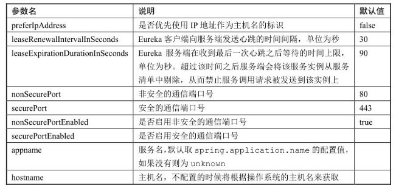

# 3.负载均衡Ribbon

负载均衡，即Load Balance，简称LB。是微服务和分布式集群中常用的一种技术，简单理解为将用户的请求平摊分配到多个服务上。负载均衡分为两大类：

- 集中式LB：在服务的消费方和提供方之间使用独立的LB设施，此设施可以是硬件（如F5），也可以是软件（nginx），由该设施负责将请求通过某种策略转发到提供方

- 进程内LB：将LB逻辑集成到消费方，消费方从服务注册中心获知有哪些地址可用，然后从这些地址中选择一个合适的服务器，将请求发到该服务器上。

springCloud Ribbon是基于Netflix Ribbon实现的一套客户端负载均衡工具。它属于进程内LB，作为一个类库集成到服务消费方上，而消费方通过它来获取服务提供方的地址。

## 3.1.使用方式

如果要在springCloud中使用ribbon，需要先引入依赖：

```xml
<dependency>
   <groupId>org.springframework.cloud</groupId>
   <artifactId>spring-cloud-starter-ribbon</artifactId>
</dependency>
```

但是如果注册中心是Eureka的话，那么就不需要引入上面的依赖了。因为在引入Eureka依赖的时候就已经自带引入ribbon依赖。使用ribbon负载均衡很简单，只需在创建`RestTemplate`的时候，加上`@LoadBalanced`注解即可：

```java
@Bean
@LoadBalanced //负载均衡注解
public RestTemplate restTemplate(){
    return new RestTemplate();
}
```

**工作流程：**

1. 先选择EurekaServer：优先选择同一区域内负载较少的Server；

2. 获取Server内的服务列表，根据用户设置的负载均衡策略从服务列表中选择一个地址，ribbon提供了多种策略：轮询、随机和响应时间加权。默认是以轮询的方式，依次请求某个服务的提供方，在单位调用次数下，每个服务提供方都会被请求一次。

## 3.2.核心组件

- **IclientConfig**，ribbon客户端配置。默认使用 com.netflix.client.config.DefaultClientConfigImpl实现

- **Irule**，ribbon的负载均衡策略。默认采用com.netflix.loadbalancer.ZoneAvoidanceRule实现，该策略能够在多区域环境下选出最佳区域的实例进行访问

- **Iping**，Ribbon的实例检查策略。默认采用com.netflix.loadbalancer.NoOpPing实现，该检查策略是一个特殊的实现，实际上它并不会检查实例是否可用，而是始终返回true，默认认为所有服务实例都是可用的

- **ServerList**，服务实例清单的维护机制。默认采用 com.netflix.loadbalancer.ConfigurationBasedServerList实现。

- **ServerListFilter**，服务实例清单过滤机制。默认采用 org.springframework.cloud.netflix.ribbon.ZonePreferenceServerListFilter实现，该策略能够优先过滤出与请求调用方处于同区域的服务实例。

- **IloadBalancer**，负载均衡器。默认采用com.netflix.loadbalancer.ZoneAwareLoadBalancer实现，具备区域感知的能力

如果想替换掉ribbon默认的配置，在springBoot中只要往IOC容器注入相应的Bean组件即可，例如：想更换ribbon的默认负载均衡配置：

```java
@Bean
public IRule myRule(){
    // 更换为随机策略
    return new RetryRule();
}
```

## 3.3.结构解析

### 3.3.1.负载均衡器

ribbon的负载均衡器，顶级接口：IloadBalancer，抽象类：AbstractLoadBalancer。

### 3.3.2.负载均衡策略

ribbon负载均衡的顶级接口为IRule，它的继承逻辑图如下：

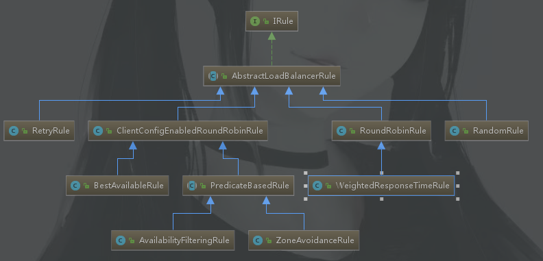

若想自定义负载均衡策略，就可以继承AbstractLoadBalancerRule抽象类，实现choose()方法，完成自己的负载均衡逻辑。可以参考springCloud自带的负载均衡策略源码。其中，ILoadBalancer接口可以获取到所请求服务的提供方集合（一个服务提供方用一个**com.netflix.loadbalancer.Server**表示）其中getReachableServers()获取所有可用的服务列表，getAllServers()获取所有的服务列表(包括可用和不可用的)

1. **RoundRobinRule**--轮询算法

2. **RandomRule**--随机算法

3. **AvailabilityFilteringRule**
   - 先过滤掉由于多次访问故障而处于断路器跳闸状态的服务，以及并发连接数量超过阈值的服务，然后对剩余服务列表按照轮询策略选取

4. **WeightedResponseTimeRule**
   - 根据平均响应时间计算所有服务的权重，响应时间越快服务权重越大被选中的概率越高。刚启动时如果统计信息不足，则使用轮询策略，等统计信息足够，会自动切换到WeightedResponseTimeRule策略

5. **RetryRule**
   - 先按照RoundRobinRule（轮询）策略获取服务，如果获取服务失败会在指定时间内进行重试，若时间到服务还是无法使用，会跳过该服务

6. **BestAvailableRule**
   - 会先过滤掉由于多次访问故障而处于断路器跳闸状态的服务，然后选择一个并发量最小的服务

7. **ZoneAvoidanceRule**
   - 复合判断server所在区域的性能和server可用性选择服务器

# 4.面向接口Feign

​	Spring cloud有两种服务调用方式，一种是ribbon+restTemplate，另一种就是Feign。Feign是Netflix开发的一个声明式的Web Service客户端，springCloud对Feign进行了再封装，整合了Ribbon和Eureka，使其支持Spring MVC注解。认识Feign之前，先回顾使用[ribbon](#2.2.2.服务消费方)时消费者如何请求远程服务？是结合RestTemplate进行Http请求，如下所示：

```java
ResponseEntity<LabelBean> responseEntity = 	
    restTemplate.getForEntity("http://label-service/label/get/1", 
                              LabelBean.class);
LabelBean labelBean = responseEntity.getBody();
```

而Feign是面向接口开发，使用它访问远程服务只需要一个注解`@FeignClient`直接在接口里面使用spring mvc的注解，如下所示：

```java
@FeignClient("label-service")
@RequestMapping("label")
public interface LabelServiceI {
    @GetMapping("get/{id}")
    LabelBean getOneById(@PathVariable("id") String id);
}
```

**消费者**（注意Feign和ribbon一样，都是用在消费者上）只需要在自己的Controller中注入该接口LabelServiceI，调用相应的方法就能请求远程的服务，所以使用Feign就像使用本地接口一般！由于Feign结合了ribbon，所以它的负载均衡策略是跟ribbon一样，默认是轮询的方式。

## 4.1.使用方式

1. 引入依赖

   ```xml
   <dependency>
       <groupId>org.springframework.cloud</groupId>
       <artifactId>spring-cloud-starter-feign</artifactId>
   </dependency>
   ```

2. 在springBoot启动类上添加启动Feign的注解

   ```java
   @SpringBootApplication
   @EnableEurekaClient
   // 此注解让springBoot扫描带有@FeignClient的接口，开启Feign功能
   @EnableFeignClients 
   public class ConsumerApp82 {
       
   }
   ```

3. 创建接口，该接口必须使用@FeignClient注解标注，并且指定远程服务的名称。接口内的方法使用spring mvc注解定义HTTP映射路径，此路径要与服务提供方开放的HTTP接口路径一样

   ```java
   @FeignClient("label-service")
   @RequestMapping("label")
   public interface LabelServiceI {
       
       @GetMapping("get/{id}")
       LabelBean getOneById(@PathVariable("id") String id);
       
       @GetMapping("list")
       List<LabelBean> getList();
   }
   ```

4. 在消费者的Controller中注入上面定义好的接口，直接调用接口内的方法就可以进行远程服务调用了，快捷且方便，这点倒是像dubbo的RPC调用！

   ```java
   @RestController
   public class EventController {
       
       @Autowired
       private LabelServiceI labelServiceI;
   
       @RequestMapping("get/{id}")
       public LabelBean getOne(@PathVariable("id") String id){
           return labelServiceI.getOneById(id);
       }
   ```

## 4.2.Feign工作原理

参考博客：[https://blog.csdn.net/forezp/article/details/73480304](https://blog.csdn.net/forezp/article/details/73480304)

1. 通过@EnableFeignCleints注解开启接口扫描工作，在程序启动后，会进行包扫描，扫描所有的@FeignCleint的注解的类，并将这些信息注入到ioc中；

2. 当接口的方法被调用，通过jdk的代理，来生成具体的RequesTemplate，然后再由RequesTemplate生成Request；

3. Request交给Client去处理，其中Client可以是HttpUrlConnection、HttpClient也可以是Okhttp；

4. Client被封装到LoadBalanceClient类，该类结合Ribbon实现负载均衡；

## 4.3.@FeignClient注解

@FeignClient注解是定义接口远程访问的关键所在，它的几个参数如下：

1. **name**
   - 指定远程服务的名称，用于服务发现

2. **url**
   - 手动指定远程服务的调用地址，一般是用来调试用的

3. **decode404**
   - 当发生404错误时，若该属性值为true，会调用decoder进行解码，返回解析后的错误信息，否则抛出FeignException异常

4. **path**
   - 定义此接口远程HTTP请求时的同一前缀

5. **fallback**
   - 定义容错的处理类，当远程调用超时或失败后，会调用容错类的逻辑fallback指定的容错类必须实现使用@FeignClient标注的接口并且需要注入到IOC容器中，比如使用@Component注解

6. **fallbackFactory**
   - 生成fallback容错类的工厂类，使用它可以实现每个接口通用的容错逻辑，减少重复的代码

7. **configuration**
   - springCloud对Feign的配置类为： FeignClientsConfiguration，使用该属性可以自定义我们的Feign配置

# 5.断路器Hystrix

hystrix博客：[http://kriszhang.com/hystrix_defend_your_webapp/](http://kriszhang.com/hystrix_defend_your_webapp/)

Hystrix是一个用于处理分布式系统延迟和容错的开源库，在分布式系统里，许多服务不可避免地会调用失败，比如超时、网络异常等。断路器Hystrix本身是一种开关装置（类似电路的保险丝），通过Hystrix的故障监控，当某个服务调用失败的次数达到一定阈值，默认是5秒内20次调用失败就会启动熔断机制，**向服务消费方返回一个符合预期的、可处理的备选响应（fallBack）**。而不会让服务消费方长时间的等待或者抛出消费方无法处理的异常，从而使消费方的线程不会被长时间、没必要地占用。Hystrix能够保证单体微服务故障不会导致整体服务失败，避免级联故障，乃至造成服务雪崩。Hystrix用于服务消费方！

## 5.1.概念解析

### 5.1.1.服务雪崩

先了解什么是“**服务雪崩**”？多个微服务之间调用的时候，假设微服务A调用微服务B和微服务C，微服务B和微服务C又调用其它微服务，这就是所谓的“**扇出**”。如果扇出链路上的某个微服务的调用响应时间过长或者不可用，对微服务A的调用就会占用越来越多的系统资源，从而引发系统崩溃，这就是所谓的“**服务雪崩**”。

### 5.1.2.服务降级

### 5.1.3.服务熔断

熔断机制是应对“服务雪崩”的链路保护机制，当“扇出”链路的某个微服务不可用或者响应时间过长，会对其进行服务降级，停止对该服务的调用，快速返回错误的响应信息，一旦该服务调用响应正常后恢复调用链路。在springCloud中服务熔断使用Hystrix来实现

## 5.2.使用方式

### 5.2.1.ribbon

1. 引入hystrix的pom依赖

   ```xml
   <dependency>
      <groupId>org.springframework.cloud</groupId>
      <artifactId>spring-cloud-starter-hystrix</artifactId>
   </dependency>
   ```

2. 启动类中使用注解@EnableHystrix开启hystrix

   ```java
   @SpringBootApplication
   @EnableHystrix//开启hystrix
   public class ConsumerApp80 {
       
   }
   ```

3. 使用注解@HystrixCommand定义处理逻辑，并且需要在**同类**下创建与fallback属性值一样的方法，fallback方法参数要与原方法参数一样，可以再额外添加一个Throwable参数，如下所示：

   ```java
   @HystrixCommand(fallbackMethod = "fallbackForError")
   public UserBean error(String id) throws Exception{
       
   }
   
   private UserBean fallbackForError(String id,Throwable t){
       return new UserBean(1,"default","default","出错了");
   }
   ```

### 5.2.2.feign

1. 引入hystrix的pom依赖

   ```xml
   <dependency>
      <groupId>org.springframework.cloud</groupId>
      <artifactId>spring-cloud-starter-hystrix</artifactId>
   </dependency>
   ```

2. 在application.yml中配置开启feign-hystrix功能，此配置默认是关闭

   ```yaml
   feign:
     hystrix:
       enabled: true
   ```

3. 创建一个实现FallbackFactory接口的类，实现create()方法，返回一个接口匿名实现类，该接口即为@FeignClient标注的接口

   ```java
   @Component
   public class DefaultFallbackFactory  implements FallbackFactory<UserServiceI> {
       @Override
       public UserServiceI create(Throwable cause) {
           return new UserServiceI() {
               @Override
               public UserBean getUserById(int UserId) {
                   return new UserBean(1,"error","error","出错了~");
               }
               @Override
               public List<UserBean> getUserList() {
                   return null;
               }
           };
       }
   }
   ```

4. 在`@FeignClient`注解使用fallbackFactory属性指定第③步定义的处理类

   ```java
   @FeignClient(fallbackFactory = DefaultFallbackFactory.class)
   public interface UserServiceI {
       
   }
   ```

5. 当Feign调用远程接口失败几次后，它会调用fallbackFactory来返回我们自定义的信息，达到一定次数，它会对远程服务降级，不再调用它，直至远程服务重新恢复正常。**补充：**除了使用FallbackFactory定义错误逻辑，还可以使用fallback定义错误逻辑，它只要实现@FeignClient标注的接口，不过这样无法处理异常信息

   ```java
   @Component
   public class LabelServiceFallback implements LabelServiceI{
       
       @Override
       public LabelBean getOneById(String id) {
           return new UserBean(1,"error","error","出错了~");
       }
       
       @Override
       public List<LabelBean> getList() {
           return Collections.emptyList();
       }
   }    
   ```

   在@FeignClient注解使用fallback属性指定上面的错误逻辑处理类

   ```java
   @FeignClient(name = "label-service",path = "label",fallback = LabelServiceFallback.class)
   ```

## 5.3.监控器

hystrix除了提供熔断机制，还提供了一个监控器hystrix-dashboard。Hystrix 会持续地记录所有通过 Hystrix 发起的请求的执行信息，并以统计报表和图形的形式展示给用户，包括每秒执行多少请求多少成功，多少失败等！、**hystrix-dashboard官方文档：**[http://projects.spring.io/spring-cloud/spring-cloud.html#_circuit_breaker_hystrix_dashboard](http://projects.spring.io/spring-cloud/spring-cloud.html%23_circuit_breaker_hystrix_dashboard)

### 5.3.1.搭建步骤

1. 引入pom依赖，需要同时引入hystrix-dashboard的pom依赖和springBoot的监控模块pom依赖

   ```xml
   <!-- hystrix仪盘表 -->
   <dependency>
       <groupId>org.springframework.cloud</groupId>
       <artifactId>spring-cloud-starter-hystrix-dashboard</artifactId>
   </dependency>
   <!-- springBoot监控模块 -->
   <dependency>
       <groupId>org.springframework.boot</groupId>
       <artifactId>spring-boot-starter-actuator</artifactId>
   </dependency>
   ```

2. 开启Hystrix和Hystrix-dashboard的相关功能（如果没有开启hystrix，hystrix-dashboard会获取不到监控流量）

   ```java
   @EnableHystrix //开启hystrix功能
   @EnableHystrixDashboard //开启hystrix-dashboard功能
   public class ConsumerApp {
       
   }
   ```

3. 访问`http://127.0.0.1:81/hystrix`(主机和端口自己指定)，就可以看到如下画面：

   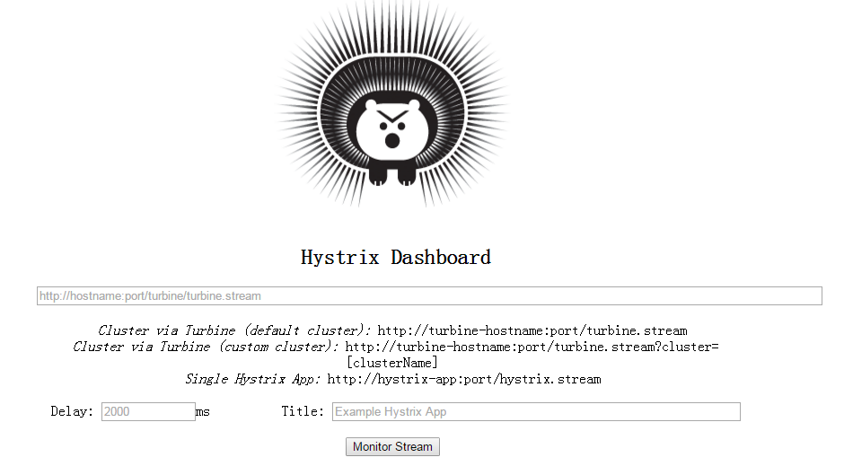

### 5.3.2.读取方式

比如现在服务消费方(ribbon或者feign)开在81端口，并且已经按照搭建步骤完成hystrix-dashboard的启动，就可以读取单个服务的监控信息：

1. 首先指定监控流，url为工程路径+“/hystrix.stream”，例如： `http://127.0.0.1:81/hystrix.stream`，然后Delay选项表示刷新频率，Title随便取个名字，用来代表监控的名称而已：

   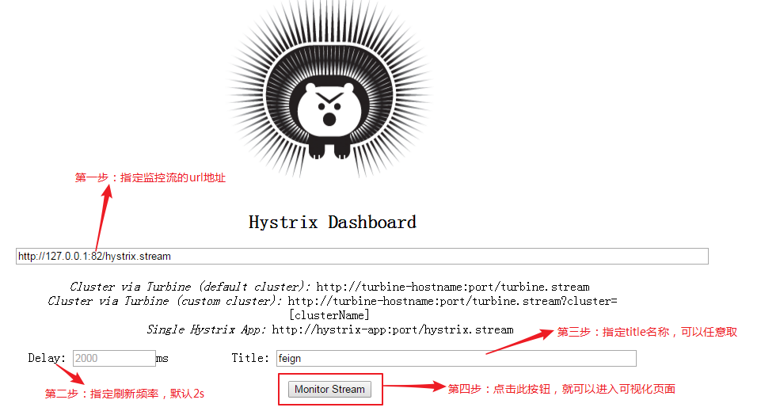

2. 进入可视化页面后，有如下信息可以查看：

   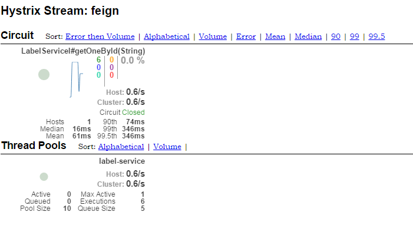

# 6.路由网关Zuul

zuul 是netflix开源的一个API Gateway 服务器, 本质上是一个web servlet应用。Zuul 在云平台上提供动态路由，监控，弹性，安全等边缘服务的框架。Zuul的主要功能是**路由转发**和**过滤器**。路由功能是微服务的一部分，比如/zuul/user转发到user服务，/zuul/role转发到role服务。zuul默认和Ribbon结合实现了负载均衡的功能。

## 6.1.路由转发

zuul可以实现路由转发，将匹配的url转发到指定的微服务上。使用步骤：

1. 引入依赖，由于zuul需要注册到eureka中，所以还需要引入eureka

   ```xml
   <!-- Eureka客户端 -->
   <dependency>
       <groupId>org.springframework.cloud</groupId>
       <artifactId>spring-cloud-starter-eureka</artifactId>
   </dependency>
   
   <!-- zuul路由网关 -->
   <dependency>
       <groupId>org.springframework.cloud</groupId>
       <artifactId>spring-cloud-starter-zuul</artifactId>
   </dependency>
   ```

2. 在springBoot启动类上添加启动zuul注解@EnableZuulProxy

   ```java
   @SpringBootApplication
   @EnableZuulProxy
   public class ZuulApplication12580 {
       
   }
   ```

3. 配置application.yml，将zuul注册到eureka上去

   ```yaml
   ## zuul需要作为一个微服务注册到Eureka中
   spring:
     application:
       name: gateway-zuul
   eureka:
     instance:
       prefer-ip-address: true
       instance-id: springcloud-zuul-12580
     client:
       service-url:
         defaultZone: http://127.0.0.1:9527/eureka
   ```

4. 自定义路由规则

   ```yaml
   ## 自定义路由映射规则
   zuul:
     # routes是配置路由规则,它是一个Map类型,配置规则：
     # <自定义>.serviceId => 服务名称
     # <自定义>.path => url访问映射
     routes:
       sym.serviceId: springCloud-provider
       sym.path: /sym/**
       sxq.serviceId: springCloud-provider
       sxq.path: /sxq/**
     # 配置不映射的服务ID（服务ID即注册在Eureka上面的服务名称）
     ignored-services: "*"
     # 映射前缀
     prefix: /springcloud
   ```

   假设zuul启动在本地，端口为12580，则此时访问路径就变为：  `http://127.0.0.1:12580/springcloud/sym/dept/get/1` （类似这样子）

## 6.2.路由过滤

zuul的另一个功能就是过滤器的作用，比如可以做一些安全验证。其实Zuul大部分功能都是通过过滤器来实现的，过滤器是由Groovy写成，这些过滤器文件被放在Zuul Server上的特定目录下面，Zuul会定期轮询这些目录，修改过的过滤器会动态的加载到Zuul Server中以便过滤请求使用。

### 6.2.1.过滤器类型

Zuul中定义了四种标过滤器类型：

- **PRE**：此过滤器在请求被路由之前调用。我们可利用这种过滤器实现身份验证、在集群中选择请求的微服务、记录调试信息等；

- **route**：此过滤器将请求路由到微服务。用于构建发送给微服务的请求，并使用HttpClient或Ribbon请求微服务；

- **POST**：此过滤器在路由到微服务以后执行。可用来为响应添加标准的HTTPHeader、收集统计信息和指标、将响应从微服务发送给客户端等；

- **ERROR**：以上3个过滤器发生错误时执行该过滤器。

### 6.2.2.请求流程

​	外部http请求到达api网关服务的时候，首先它会进入第一个阶段pre，在这里它会被pre类型的过滤器进行处理。该类型过滤器的主要目的是在进行请求路由之前做一些前置加工，比如请求的校验等。

​	在完成了pre类型的过滤器处理之后，请求进入第二个阶段routing，也就是之前说的路由请求转发阶段，请求将会被routing类型的处理器处理。这里的具体处理内容就是将外部请求转发到具体服务实例上去的过程，当服务实例请求结果都返回之后，routing阶段完成。

​	此时请求进入第三个阶段post，请求将会被post类型的过滤器处理，这些过滤器在处理的时候不仅可以获取到请求信息，还能获取到服务实例的返回信息，所以在post类型的过滤器中，我们可以对处理结果进行一些加工或转换等内容。  另外，还有一个特殊的阶段error，该阶段只有在上述三个阶段中发生异常的时候才会触发，但是它的最后流向还是post类型的过滤器，因为它需要通过post过滤器将最终结果返回给请求客户端。

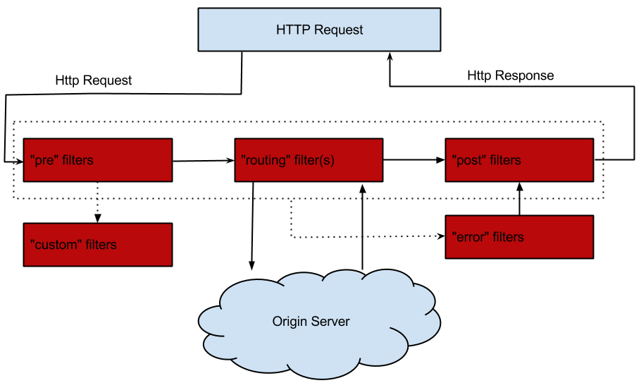

在一次zuul请求，有一个完整的上下文横贯整个请求链，该上下文就是com.netflix.zuul.context.RequestContext，可以通过以下代码获取它：

```java
RequestContext ctx = RequestContext.getCurrentContext();
```

通过该上下文，我们可以从中获取或者设置很多信息，保证整个过滤器链的执行！

### 6.2.3.使用方式

1. 先将zuul的[路由转发](#6.1.路由转发)功能搭建起来！定义自己的zuul filter，实现ZuulFilter抽象类，它有5个抽象方法。 以pre类型过滤器为例，代码为：

   ```java
   @Component 
   public class PreFilter extends ZuulFilter {
       
       /**
        * filterType()返回的值表示此过滤器是什么类型的过滤器
        * zuul在将请求转发到微服务之前会调用pre类型的过滤器。
        */
       @Override
       public String filterType() {
           return "pre";
       }
       
       /**
        * 定义过滤器的执行顺序，数值越小优先级越高，越快执行
        */
       @Override
       public int filterOrder() {
           return 0;
       }
       
       /**
        * 判断此过滤器是否要执行，若返回true则过滤器会执行(意味着执行run()方法)
        * 否则过滤器不执行，就不会执行run()方法
        */
       @Override
       public boolean shouldFilter() {
           // 这边可以实现自己的判断，例子这边都是返回true，都执行
           return true;
       }
       
       /**
        * 过滤器执行的逻辑
        */
       @Override
       public Object run() throws ZuulException {
           // RequestContext是一次完整的zuul请求的上下文
           RequestContext ctx = RequestContext.getCurrentContext();
           // RequestUtils获取当前request几个状态的工具类
           RequestUtils.isDispatcherServletRequest();
           System.err.println("pre过滤器在此执行了....");
           return null;
       }
       
   }
   ```

2. 这样，zuul就会在它的执行链中依次按顺序调用这4种类型的过滤器，具体的细节可以参考这篇博客：[https://www.jianshu.com/p/ff863d532767](https://www.jianshu.com/p/ff863d532767)。com.netflix.zuul.FilterProcessor这个类定义了Zuul的执行流程！！！

# 7.分布式配置Config

​	当系统的微服务越来越多时，每个微服务至少携带一个application.yml配置文件，这样整个系统的配置就会变得更加臃肿！为了解决这一问题，springCloud提供了分布式配置中心config来提供集中化的外部配置支持。springCloud config分为服务端和客户端两部分，服务端与github、gitlab等托管配置文件的服务器打交道，负责从这些服务器上读取配置文件；config客户端与服务端交互，从服务端获取配置文件。这样我们只需要在github或gitlab上统一配置即可，系统内的微服务都是动态地从服务器获取配置文件信息，完成自身的配置!

## 7.1.单机环境

单机环境只有一个config server，如果此配置中心挂了，则所有依靠此配置中心的微服务都将失效

### 7.1.1.Config服务端

1. 先去github上创建一个仓库，然后克隆到本地仓库，接着在本地仓库创建一个application.yml配置文件，该文件模拟整个系统的集中化配置文件，文件内容可以为：（然后把配置文件从本地push到github上）

   ```yaml
   spring:
     profiles:
       active: dev
     application:
       name: 默认配置
   ---
   spring:
     profiles: dev
     application:
       name: application.yml-开发环境-dev
   server:
     port: 9494
     contextPath: /sym
   ---
   spring:
     profiles: test
     application:
       name: application.yml-测试环境-test
   server:
     port: 1314
   ---
   spring:
     profiles: GA
     application:
       name: application.yml-正式环境-GA
   server:
     port: 8080
   ```

2. 引入config服务端的依赖

   ```xml
   <dependency>
      <groupId>org.springframework.cloud</groupId>
      <artifactId>spring-cloud-config-server</artifactId>
   </dependency>
   ```

3. 在config工程的application.yml中配置连接github的信息，如果使用的是ssh连接，需要先在本地配置私钥和公钥，配置如下：

   ```yaml
   ## 分布式配置中心Config服务端的配置
   server:
     port: 10086
   spring:
     application:
       name: config-server-10086
     cloud:
       config:
         server:
           git:
             ## github上存放配置文件的仓库SSH地址
             uri: git@github.com:sYmJoinGitHub/springcloud-config.git
   ```

   注意：如果使用http连接，需要在config的配置文件上配置username和password属性，用来连接github

   ```yaml
   spring:
     application:
       name: config-server-10086
     cloud:
       config:
         server:
           git:
             ## github上存放配置文件的仓库http地址
             uri: https://github.com/sYmJoinGitHub/springcloud-config.git
             username: ##登录github的用户名
             password: ##登录github的密码
   ```

4. 启动config项目，访问127.0.0.1:10086/application-dev.yml即可看到响应信息。所以，这边需要弄清楚config对配置文件的url匹配规则

   ```tex
   /{application}/{profile}/[{label}]  
   /{application}-{profile}.yml 
   /{label}/{application}-{profile}.yml 	
   /{application}-{profile}.properties 	
   /{label}/{application}-{profile}.properties
   ```

   **匹配规则解析：**

   ```tex
   {application}→指的是github上配置文件的名称
   {profile}→指的是当前环境profile
   {label}→指的是github上的分支，一般是master
   ```

   **例子：**(以下3个的效果一样)

   ```tex
   127.0.0.1:10086/application-dev.yml
   127.0.0.1:10086/application/dev/master
   127.0.0.1:10086/master/application-dev.yml
   ```

   **注意：**

   - yml配置文件名称可以随便取，内部指定profile即可；而properties文件，名称也可以随便取但是必须要同时指定profile名称，例如：可以叫做：spring-dev.properties，但不能叫做spring.properties

   - 如果yml文件和properties文件的文件名一样，yml文件的配置会被properties文件的配置覆盖掉，例如：application.yml(里面的profile为dev)，它的配置会被application-dev.properties覆盖。

### 7.1.2.Config客户端

spring cloud config-client只需要跟config-server打交道，从它那边获取远程仓库的配置文件信息，然后根据配置信息启动本服务即可！在搭建一个config-client之前，需要先了解一下`bootstrap.yml`的作用。

1. 引入config-client的pom依赖

   ```xml
   <!-- config分布式配置中心-客户端 -->
   <dependency>
      <groupId>org.springframework.cloud</groupId>
      <artifactId>spring-cloud-starter-config</artifactId>
   </dependency>
   ```

2. 创建一个bootstrap.yml文件，配置如下信息：

   ```yaml
   spring:
     cloud:
       config:
         name: application-client #指定要从github上读取的配置文件名称，注意不加后缀
         profile: test #指定读取配置文件内的哪个配置项(即profile)
         label: master #指定要读取github上的哪个分支
         uri: http://127.0.0.1:10086 # ！！！服务端config-server的访问地址 ！！！
         ## 以上4个属性确定加载的是哪个配置文件上的哪个配置项...
   ```

   以上两步配置完成后，config-client就可以跟config-server交互，它本身启动时，就会去远程加载配置文件.

## 7.2.高可用环境

将配置中心config-server做成一个微服务注册到eureka上去，将其集群化，达到高可用环境。其它config-client从eureka中获取配置服务

### 7.2.1.Config服务端

1. 引入config-server的依赖和eureka-client的依赖，因为需要把配置中心注册成一个微服务。

   ```xml
   <!--分布式配置中心-服务端-->
   <dependency>
       <groupId>org.springframework.cloud</groupId>
       <artifactId>spring-cloud-config-server</artifactId>
   </dependency>
   
   <!-- eureka客户端 -->
   <dependency>
       <groupId>org.springframework.cloud</groupId>
       <artifactId>spring-cloud-starter-eureka</artifactId>
   </dependency>
   ```

2. 在config工程的application.yml配置连接github的信息和注册到 Eureka-server的信息

   ```yaml
   ## 分布式配置中心Config服务端的配置
   server:
     port: 10086
   spring:
     application:
       name: config-server-10086
     cloud:
       config:
         server:
           git:
             ## github上存放配置文件的仓库SSH地址
             uri: git@github.com:sYmJoinGitHub/springcloud-config.git
   ## 将config-server作为 服务提供方 注册到eureka中，做成集群结构
   eureka:
     client:
       service-url:
         defaultZone: http://127.0.0.1:9527/eureka
     instance:
       instance-id: config-server-12580
       prefer-ip-address: true
   ```

   config-server的配置比较简单，只需要在[单机环境](#7.1.1.config服务端)的基础上，增加注册到eureka-server的配置即可。

### 7.2.2.Config客户端

之前在[单机环境](#7.1.2.config客户端)中，config客户端是通过配置spring.cloud.config.uri属性去连接config服务端。现在把config服务端做成了一个微服务，就需要config客户端连接到Eureka注册中心去消费config-server的服务。

1. 引入config-client和eureka-client的pom依赖

   ```xml
   <!-- config分布式配置中心-客户端 -->
   <dependency>
      <groupId>org.springframework.cloud</groupId>
      <artifactId>spring-cloud-starter-config</artifactId>
   </dependency>
   
   <!-- eureka客户端 -->
   <dependency>
       <groupId>org.springframework.cloud</groupId>
       <artifactId>spring-cloud-starter-eureka</artifactId>
   </dependency>
   ```

2. 创建一个bootstrap.yml配置文件，配置信息如下

   ```yaml
   spring:
     cloud:
       config:
         name: application-client #指定要从github上读取的配置文件名称，注意不加后缀
         profile: test #指定读取配置文件内的哪个配置项(即profile)
         label: master #指定要读取github上的哪个分支
          #单机环境是使用uri来指定config-server的服务地址
         discovery:
             # 配置为true，表示可以通过服务发现获取config-server的url地址
             enabled: true 
             # config-server注册到Eureka的服务名
             service-id: config-server 
   ## 配置连接eureka注册中心的信息
   eureka:
     client:
       service-url:
         defaultZone: http://127.0.0.1:9527/eureka
   ```

## 7.3.中文乱码

​	springCloud config server如果读取的配置文件格式是.yml，一般是不会出现中文乱码问题（如果你看到乱码，只需要把浏览器的编码设置为utf-8）；但是如果读取的配置文件是.properties，就会发生中文乱码，具体原因：spring使用PropertySourceLoader接口去读取配置：.yml文件使用YamlPropertySourceLoader来读取，.properties文件使用PropertiesPropertySourceLoader来读取，去读它的源码，可以发现它默认是使用java.util. Properties去解析而且使用的是IOS-8859-1编码。所以，我们需要重新写一个实现PropertySourceLoader接口的实现类来解析properties文件，具体步骤为：

1. 照着PropertiesPropertySourceLoader的实现逻辑，只需要在使用properties.load()方法时，指定编码为utf-8即可

   ```java
   public class MyPropertySourceLoader implements PropertySourceLoader {
   
       @Override
       public String[] getFileExtensions() {
           return new String[]{"properties", "xml"};
       }
   
       @Override
       public PropertySource<?> load(String name, Resource resource, 
                                     String profile) throws IOException {
           if (profile == null) {
               InputStream inputStream = resource.getInputStream();
               InputStreamReader reader = null;
               Properties properties = new Properties();
               String filename = resource.getFilename();
               try {
                   if (filename != null && filename.endsWith("xml")) {
                       properties.loadFromXML(inputStream);
                   } else {
                       // 指定编码为utf-8
                       reader = new InputStreamReader(inputStream, "utf-8");
                       properties.load(reader);
                   }
                   return new PropertiesPropertySource(name, properties);
               } finally {
                   if (reader != null) {
                       // 关闭字符流，会连带着把字节流也关掉
                       reader.close();
                   }else{
                       inputStream.close();
                   }
               }
           }
           return null;
       }
   }
   ```

2. 在类路径下创建一个/META-INF/spring.factories文件，将自定义的PropertySourceLoader配置在spring.factories即可：

   ```tex
   org.springframework.boot.env.PropertySourceLoader=com.sym.config.MyPropertySourceLoader
   ```

## 7.4.刷新配置

​	config服务端(server)每次都会去请求github/gitlab，所以可以保证配置都是最新的。但是config客户端(client)并不会主动更新配置，因此当我们将配置更新后，config客户端拿到的还是旧的配置。

​	为了解决这一问题，实际上我们可以使用[消息总线](#8.消息总线Bus)。还有一个可以利用springBoot的监控starter来手动刷新，但是这种方案不太现实，做个了解吧

1. 先引入springBoot的监控starter

   ```xml
   <dependency>
     <groupId>org.springframework.boot</groupId>
     <artifactId>spring-boot-starter-actuator</artifactId>
   </dependency>
   ```

2. 在需要刷新配置的类上面加上@RefreshScope注解

   ```java
   @RestController
   @RefreshScope
   public class ConfigClientController {
       
   }
   ```

3. 需要在配置文件application关闭权限认证（不让执行访问时会报401错）

   ```yaml
   management:
     security:
       enabled: false
   ```

4. 每次github/gitlab更新配置后，手动执行/refresh请求(post方式)，如果能看到类似下面的json返回信息，表示配置已经更新成功

   ```json
   [
     "config.client.version",
     "server.port"
   ]
   ```

# 8.消息总线Bus

springCloud的消息总线bus，它应用了AMQP消息代理作为通道，通过MQ的广播机制实现消息的发送和接收，目前只支持RabbitMQ和kafka。常与配置中心[config](#7.分布式配置Config)一起使用，以实现动态实时刷新微服务的配置。

## 8.1.工作流程

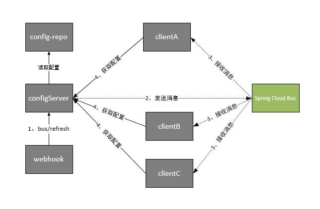

1. 微服务架构内的各个节点（包括config-server和各个config-client）引入消息总线bus，接收消息的传播

2. 当github/gitlab上的配置被更新后，会触发webhook事件，发起一个请求 /bus/refresh到配置中心服务端(config-server)，收到该请求后，config-server就会向消息总线bus发送消息

3. 消息总线bus接收到消息，广播出去到各个config-client节点上

4. config-client节点收到更新配置的消息后，请求config-server，更新自己的配置

## 8.2.使用方式

使用消息总线bus，需要先提前按照RabbitMQ或Kafka，这里用rabbitMQ！

### 8.2.1.Config客户端

1. 引入消息总线bus的pom依赖

   ```xml
   <dependency>
       <groupId>org.springframework.cloud</groupId>
       <artifactId>spring-cloud-starter-bus-amqp</artifactId>
   </dependency>
   ```

2. 在bootstrap.yml中配置对rabbitMQ的连接

   ```yaml
   ## 配置rabbitMQ,以便可以在消息总线接收消息，实时更新配置
   rabbitmq:
     host: 127.0.0.1
     port: 5672
     username: guest
     password: guest
   ```

   到这里，config-client的配置就完成了。

### 8.2.2.Config服务端

1. 引入消息总线bus的pom依赖

   ```xml
   <dependency>
       <groupId>org.springframework.cloud</groupId>
       <artifactId>spring-cloud-starter-bus-amqp</artifactId>
   </dependency>
   ```

2. 在application.yml中配置对bus和rabbitMQ的支持

   ````yaml
   ## 开启记录消息总线bus的消息传播过程
   spring
   bus:
         trace:
           enabled: true
     ## 消息总线bus依赖于外部的消息队列rabbitMQ
     rabbitmq:
       host: 127.0.0.1
       port: 5672
       username: guest
       password: guest
   ## 关闭权限验证,不然执行/bus/refresh请求时会报没有权限的错误
   management:
     security:
       enabled: false
   ````

3. 当更改github/gitlab的配置后，可以手动向config-server发起一个**/bus/refresh**请求，让它向消息总线bus发送消息；也可以在github上配置webhook，它可以在我们提交更新配置后，自动发送。

   

   执行这个请求后，消息总线收到更新配置的请求后，就会将消息广播出去！