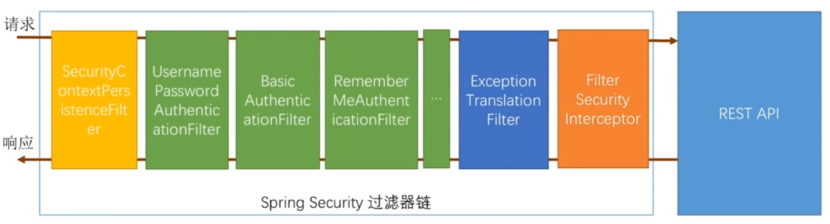
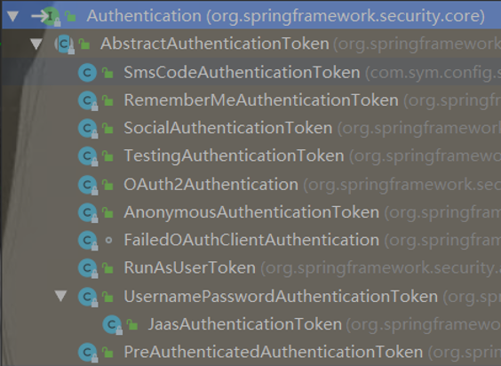
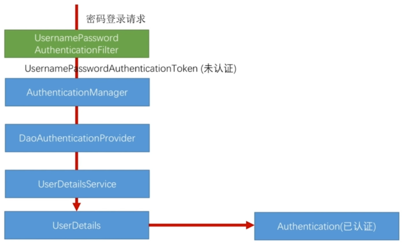
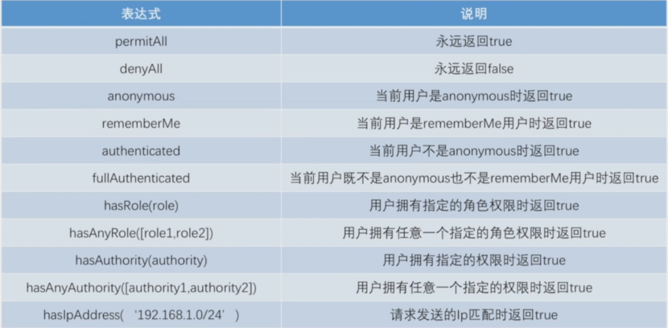
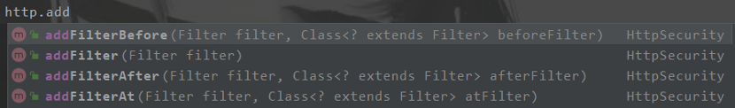
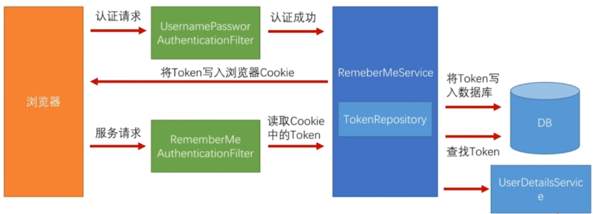
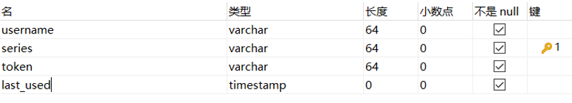
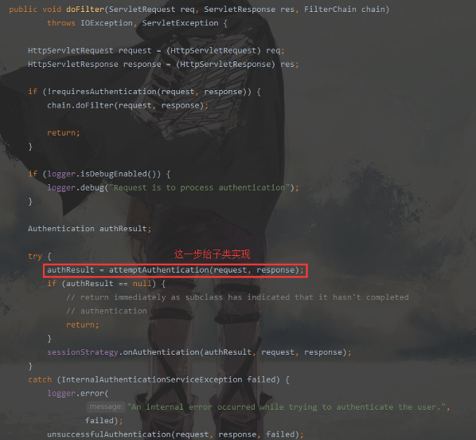
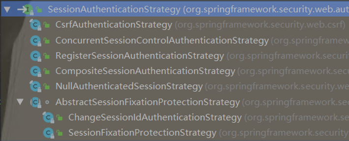
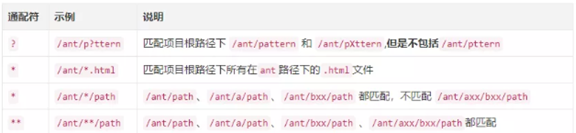

# 1.springSecurity介绍

## 1.1.简介

​	springSecurity是基于spring实现声明式的安全访问控制的企业级安全框架。一般来说，Web 应用的安全性包括用户认证（Authentication）和用户授权（Authorization）两个部分。对于这两部分，Spring Security 框架都有很好的支持。在用户认证方面，Spring Security 框架支持主流的认证方式，包括 HTTP 基本认证、HTTP 表单验证、HTTP 摘要认证、OpenID 和 LDAP 等。在用户授权方面，Spring Security 提供了基于角色的访问控制和访问控制列表（Access Control List，ACL），可以对应用中的领域对象进行细粒度控制。本次笔记是结合springBoot与springSecurity！

## 1.2.基本原理

springSecurity其实就是在请求request和服务Controller之间，做了一条过滤器链处理，它通过各种各样的过滤器来进行用户认证以及授予权限。一个过滤器能够在一个request到达Servlet之前预处理request，也可以在离开Servlet时处理response，流程如下：



### 1.2.1.过滤器链

- DelegatingFilterProxy

- FilterChainProxy

### 1.2.2.过滤器

springSecurity使用servlet过滤器链，实现了自己的抽象，提供了VirtualFilterChain。过滤器在链中定义的顺序非常重要，在自定义过滤器时也需要慎重考虑它在链中的位置。springSecurity默认提供了如下的过滤器，标红的表示核心过滤器，其优先级按从上到下的顺序：

| **Filter**                                                   | **作用**                                                     |
| ------------------------------------------------------------ | ------------------------------------------------------------ |
| ChannelProcessingFilter                                      | 可以重定向到不同的协议                                       |
| SecurityContextPersistenceFilter                             | 在web请求开始时，在  SecurityContextHolder中设置  SecurityContext；在web请求结束时，把对SecurityContext的任何更改复制到HttpSession（以便为下一个Web请求做准备） |
| ConcurrentSessionFilter                                      | 使用SecurityContextHolder功能并需要更新SessionRegistry以反映来自主体的持续请求 |
| UsernamePasswordAuthenticationFilter  CasAuthenticationFilter  BasicAuthenticationFilter  (认证处理机制) | 修改SecurityContextHolder使其包含有效的身份验证请求令牌  (Authentication  request token) |
| SecurityContextHolderAwareRequestFilter                      | 安装HttpServletRequestWrapper到servlet容器中                 |
| JaasApiIntegrationFilter                                     | 如果JaasAuthenticationToken位于SecurityContextHolder中，则会将  FilterChain作为  JaasAuthenticationToken  中的Subject进行处理 |
| RememberMeAuthenticationFilter                               | 若之前的身份认证处理机制没有更新SecurityContextHolder，并且请求提供了一个启用记住我服务的cookie，那么将在那里放置一个合适的记忆身份验证对象(remembered  Authentication token) |
| AnonymousAuthenticationFilter                                | 若之前的身份认证处理机制没有更新SecurityContextHolder，则会将匿名身份验证对象放在那里(anonymous Authentication token) |
| ExceptionTranslationFilter                                   | 捕获任何Spring Security异常，以便可以返回HTTP错误响应或启动相应的AuthenticationEntryPoint |
| FilterSecurityInterceptor                                    | 保护Web URI并且在访问被拒绝时引发异常                        |

### 1.2.3.认证主体

认证主体，也称为token，是springSecurity识别用户身份权限信息的对象，它们都实现了org.springframework.security.core.Authentication接口，默认实现类有：



例如：

当使用表单登录时，就会生成UsernamePasswordAuthenticationToken；当使用记住我功能是，会生成RememberMeAuthenticationToken；当要自定义登录方式时，就可以实现此接口（也提供了接口的抽象实现类），定义自己的token对象，后面[短信登录](#7.短信登录)，就自定义SmsCodeAuthenticationToken。

### 1.2.4.核心组件

springSecurity的核心组件：

| 类/接口                | **作用**                                                     |
| ---------------------- | ------------------------------------------------------------ |
| SecurityContextHolder  | 提供对SecurityContext的访问                                  |
| SecurityContext        | 持有Authentication对象和其他可能需要的信息                   |
| AuthenticationManager  | 管理多个AuthenticationProvider                               |
| AuthenticationProvider | 实际进行认证操作的类                                         |
| Authentication         | 认证主体，包含用户认证与权限信息。是spring  security中的token |
| GrantedAuthority       | 对认证主题的应用层面的授权，含当前用户的权限信息，通常使用角色表示 |
| UserDetails            | 算是Authentication的一种表现，用于封装用户的身份、权限以及状态信息 |
| UserDetailsService     | 用来构建UserDetails对象                                      |

### 1.2.5.认证流程

以表单登录为例，介绍springSecurity的认证流程：



默认的表单登录，springSecurity是使用UsernamePasswordAuthenticationFilter来处理。它首先会生成一个未经过认证的UsernamePasswordAuthenticationToken对象（里面会封装一些认证使用的信息，表单的话就是username和password），然后交给AuthenticationManager对象去选择合适的AuthenticationProvider（默认是DaoAuthenticationProvider）去执行认证。DaoAuthenticationProvider使用UserDetailService去获取用户在数据库的信息生成UserDetails，从而进行身份认证。一旦认证成功就生成新的UsernamePasswordAuthenticationToken对象（已认证），然后就执行successHandler，将请求重定向到用户指定url上，而不会再调用filterChain.doFilter()继续调用拦截器进行拦截...

## 1.3.基本配置

springSecurity实现配置的总体流程是这样子的：

适配器  → 配置 → 配置类 → 构建 → 具体组件

### 1.3.1.SecurityConfigurer&springSecurity

springSecurity和SecurityConfigurer是springSecurity配置相关类中的最顶级接口。

1. SecurityBuilder接口，它是用来构建一个对象，泛型O就是表示将构建出的对象类型（一般是配置类）

   ```java
   public interface SecurityBuilder<O> {
      O build() throws Exception;
   }
   ```

   最重要的两个实现类：[WebSecurity](#1.3.2.WebSecurityConfigurer&WebSecurity)和[HttpSecurity](#1.3.3.SecurityConfigurerAdapter&_HttpSecu)

2. SecurityConfigurer接口，有2个泛型：O和B，它们的意思是用泛型B来构建出泛型O，而SecurityConfigurer的作用就是来配置泛型B。

   ```java
   public interface SecurityConfigurer<O, B extends SecurityBuilder<O>> {
     void init(B builder) throws Exception;
     void configure(B builder) throws Exception;
   }
   ```

   最重要的实现类[WebSecurityConfigurer](#1.3.2.WebSecurityConfigurer&WebSecurity)和[SecurityConfigurerAdapter](#1.3.3.SecurityConfigurerAdapter&_HttpSecu)

3. 总而言之，SecurityConfigurer就是为了配置出一个SecurityBuilder对象，而SecurityBuilder对象是为了构建出一个实际组件，这个组件会被运用到springSecurity的各个过滤器上。

### 1.3.2.WebSecurityConfigurer&WebSecurity

WebSecurityConfigurer用来自定义配置WebSecurity，而WebSecurity用来构建出[FilterChainProxy](#1.2.1.过滤器链)（也称为springSecurityFilterChain）。通常我们要自定义配置WebSecurity，不需要实现WebSecurityConfigurer接口，框架为我们提供了一个抽象父类WebSecurityConfigurerAdapter，继承它覆盖其configure()方法即可

### 1.3.3.SecurityConfigurerAdapter&HttpSecurity

SecurityConfigurerAdapter是顶级接口SecurityConfigurer的抽象实现类：

```java
public abstract class SecurityConfigurerAdapter<O, B extends SecurityBuilder<O>>
  implements SecurityConfigurer<O, B> 
```

当我们需要一个springSecurity相关的对象，就可以实现此抽象类，指定要配置的对象B类型，以及B要构建的对象C类型。一般我们是用它来配置出HttpSecurity对象，而HttpSecurity可以构建出DefaultSecurityFilterChain组件。HttpSecurity主要用来对Http Request进行安全配置，默认它会作用于所有请求。

### 1.3.4.配置例子

### 1.3.4.1.HttpSecurity配置例子

配置springSecurity需要继承WebSecurityConfigurerAdapter抽象类（该类需要使用配置类注解@Configuration标注），重写configure()方法，方法参数HttpSecurity就定义了springSecurity的全部配置。

```java
protected void configure(HttpSecurity http) throws Exception {
  /*
 * HttpSecurity里面的方法可以获取各个组件,如formLogin()获取表单登录组件,
 * 后面的代码就是基于表单验证组件做配置；当配置完表单登录组件后，想配置其它
 * 组件，就可以通过and()继续获取HttpSecurity对象，调用它其它方法获取其它组件
 */
  http.formLogin()//获取表单登录组件
    //.loginPage("/signIn.html")//你可以直接在这里配置一个登录页面
    .loginPage("/loginHandler")//也可以将登录页面改为请求一个Controller的映射，
    //其实建议这样做，这样可以区分不同请求，返回不同的内容
    .usernameParameter("customerName")//指定登录请求的用户名，默认为username
    .passwordParameter("customerPwd")//指定登录请求的密码，默认为password
    //.successForwardUrl("/succeedAfterLogin")//登录成功后的跳转地址 
    //.failureForwardUrl("/failedAfterLogin")//登录失败后的跳转地址
    .successHandler(symSignInSuccessHandler)//自定义登录成功后的处理方式
    .failureHandler(symSignInFailedHandler)//自定义登录失败后的处理方式
    .loginProcessingUrl("/signIn")//指定校验的url，前端登录把请求提交到此url即可
    .and()//切换到HttpSecurity组件
    .csrf().disable()//停止CSRF校验
    .authorizeRequests()//获取授权组件
    //登录页不用校验
    .antMatchers("/signIn","/loginHandler","/signIn.html").permitAll()
    .anyRequest().authenticated();//其它页面需要校验
}
```

#### 1.3.4.2.关闭springSecurity

默认当我们引入springSecurity时，它就开启并且对所有资源做了认证处理。如果想关闭，可以配置

```yaml
security:
	basic:
		enabled: false
```

# 2.自定义认证逻辑

一般安全框架都会内部验证用户登陆密码，springSecurity是这样，shiro也是如此。所以，我们要做的，就是将客户端输入的账号密码，还有保存在数据库的用户信息，一并交给安全框架，由它去校验这两份密码是否匹配。

## 2.1.获取用户登录信息

springSecurity提供UserDetailsService接口用于获取用户的登录信息，即用户在客户端输入的账号和密码。接口中只有一个方法，而且只给我们提供了用户输入的账号，密码是由springSecurity自己去校验的，所以它不会提供给我们：

```java
public interface UserDetailsService {
  UserDetails loadUserByUsername(String username) throws UsernameNotFoundException;
}
```

在用户执行登录时，springSecurity会回调loadUserByUsername()方法，把用户的登录页输入的用户名传递到方法的参数username，便可以根据这个username去搜索数据库，找出用户的实体信息，封装成[UserDetails对象](#2.2.处理用户校验逻辑)，springSecurity会拿这个UserDetails自己做校验

## 2.2.处理用户校验逻辑

springSecurity提供UserDetails接口来处理用户的校验逻辑，我们只要返回UserDetails接口实现类，然后springSecurity会自己去校验用户密码。该接口共有7个方法，每个方法的用途如下：

```java
public interface UserDetails extends Serializable {
  Collection<? extends GrantedAuthority>getAuthorities();//返回用户的所有权限
  String getPassword();//返回用户的密码(是从数据库读取的密码)
  String getUsername();//返回用户的用户名
  boolean isAccountNonExpired();//判断用户是否过期，返回true-有效期，false过期
  boolean isAccountNonLocked();//判断用户是否被锁定，返回true-未锁定，false已被锁定
  boolean isCredentialsNonExpired();//返回用户密码是否过期，返回true-有效期，false-已过期
  boolean isEnabled();//判断用户是否被禁用，返回true-可用，false-禁用
}
```

我们可以自己实现UserDetails接口，将上面的7个方法，根据我们从数据库中查询到的用户信息，一个一个实现。比如说，我们从数据库读取的信息发现用户的逻辑删除字段为1(一般值为1表示已删除)，那么我们就可以在isEnabled()方法返回false，这样springSecurity在校验时抛出相应异常，告诉前端用户不能登录的原因。

当然，springSecurity也提供一个实现UserDetails的具体实现类，即org.springframework.security.core.userdetails.User，我们可以根据从数据库查询到的信息，封装这个User对象，将其返回即可。User类提供了一个带有7个参数的构造函数：

```java
public User(String username, String password, boolean enabled,
      boolean accountNonExpired, boolean credentialsNonExpired,
      boolean accountNonLocked, Collection<? extends GrantedAuthority> authorities) {
  
}
```

## 2.3.密码加密解密

springSecurity提供PasswordEncoder接口用于用户密码的加密和解密。该接口有2个方法：

```java
public interface PasswordEncoder {
  //将用户的原密码进行加密后返回
  String encode(CharSequence rawPassword);
  //将用户原密码rawPassword和加密后的密码encodedPassword进行比对
  boolean matches(CharSequence rawPassword, String encodedPassword);
}
```

如果要自己实现加密解密逻辑，就需要实现此接口，在encode()方法中定义加密逻辑（例如使用MD5），然后在matches()方法中定义比对逻辑（如果使用MD5，由于MD5不可逆，所以需要将原密码rawPassword先MD5在比对加密后的密码）springSecurity预先提供多个实现类，常用的有BCryptPasswordEncoder，只要将其注入到IOC容器即可：

```java
@Bean
public PasswordEncoder passwordEncoder(){
  return new BCryptPasswordEncoder();
}
```

注意：当我们往IOC容器中注入了PasswordEncoder对象，springSecurity就会把用户在登录页输入的原始密码进行加密，然后再和UserDetails中获取的密码进行比对，所以我们在往数据库插入用户信息的时候，就需要预先使用PasswordEncoder.encode()将其原始密码加密后再保存

## 2.4.例子

```java
@Component
public class MyDetailsService implements UserDetailsService {
  private final static Logger logger = LoggerFactory.getLogger(MyDetailsService.class);
  @Autowired
  private PasswordEncoder passwordEncoder;
  /**
* 我们在 loadUserByUsername() 方法中，可以通过读取数据库获取用户的信息
* 将其封装成UserDetails对象，springSecurity会自动验证密码
    */
  @Override
  public UserDetails loadUserByUsername(String username) 
    throws UsernameNotFoundException {
    logger.info("用户输入的username={}",username);
    // 这里我们就可以通过username去查询数据库获取用户的信息
    // ...省略读取数据库的步骤

    // org.springframework.security.core.userdetails.User是UserDetails默认实现类
    // 因为我们不会将用户密码明文保存到数据库，所以一般会加密存储，springSecurity提供了
    //PasswordEncoder来实现密码加密
    String encodePassword = passwordEncoder.encode("123456");
    logger.info("加密后的密码={}",encodePassword);
    return new User(username,encodePassword,true,true,true,true, 
                    AuthorityUtils.NO_AUTHORITIES);
  }
}
```

# 3.自定义认证流程

之前说过，HttpSecurity对象是springSecurity的整体配置，所以当我们要自定义认证流程时，就需要使用它来配置。

## 3.1.未登陆的处理方式

配置**httpSecurity.formLogin().loginPage(String loginPage)**，springSecurity发现未认证的请求时，都会跳转到loginPage指定的请求。所以loginPage可以是一个HTML页面路径，如：loginPage("/signIn.html")；实际开发中，更多的是把loginPage配置为Controller的一个映射，根据不同请求，返回HTML页面，或是JSON字符串，如loginPage("/loginHandler")

```java
/*
 * springSecurity会把请求Request缓存起来,他提供了 RequestCache 接口供保存/获取Request
 * 默认实现类是 HttpSessionRequestCache，它是把Request保存到session中,
 */
private RequestCache requestCache = new HttpSessionRequestCache();

@RequestMapping("loginHandler")
@ResponseStatus(value = HttpStatus.UNAUTHORIZED)
public ResultInfo signIn(HttpServletRequest request, HttpServletResponse response) 
  throws Exception {
  // 首先取出封装了用户请求的 HttpServletRequest 对象
  SavedRequest savedRequest = requestCache.getRequest(request, response);
  if (null != savedRequest) {
    logger.info("请求的待认证的URL地址为={}", savedRequest.getRedirectUrl());
    // 获取请求头部信息
    List<String> accept = savedRequest.getHeaderValues("accept");
    logger.info("HTTP-header,accept={}", accept);
    for (String s : accept) {
      // 带有html字样的说明是浏览器发起的请求
      if (s.contains("html")) {
        //response.sendRedirect("/signIn.html");
        redirectStrategy.sendRedirect(request,response,"/signIn.html");
        return null;
      }
    }
  }
  // 其它情况返回JSON字符串
  return Result
```

## 3.2.登录成功的处理方式

springSecurity发现用户未登录时，它会缓存用户的请求request(可以理解为就是用户在浏览器输入的那个url地址)，然后会转去[未登录处理方式](#3.1.未登陆的处理方式)。当用户登陆成功后，它就会从缓存中（HttpSessionRequestCache）取出用户输入的url地址，将请求request转发到该url地址上。

以上是springSecurity处理成功登陆的默认方式，当我们需要自定义处理登陆成功后要做的事时，有两种方案：

- 指定登陆成功后的请求地址

- 自定义成功登陆处理器

### 3.2.1.成功登陆请求地址

这种方式比较简单，分为两步：

1. 定义Controller处理方法

   ```java
   @RestController
   public class UserController {
     @RequestMapping("/succeedAfterLogin")
     public String loginSucceed() {
       return "恭喜你已经成功登录了";
     }
   }
   ```

2. 配置登陆成功后的请求地址

   ```java
   httpSecurity.formLogin().successForwardUrl("/succeedAfterLogin")
   ```

### 3.2.2.成功登陆处理器

如果用户登陆成功后，需要处理的逻辑比较复杂，我们还可以自定义成功登陆处理器，分为两步操作：

1. 自定义成功登陆处理器

springSecurity提供了AuthenticationSuccessHandler接口和默认实现类SavedRequestAwareAuthenticationSuccessHandler，因此可以实现接口，也可以继承默认实现类来定义我们自己的成功登陆处理器。需要用@Component注解将自定义的处理器注册到IOC容器中

```java
@Component(value="symSignInSuccessHandler")
public class SymSignInSuccessHandler implements AuthenticationSuccessHandler {
  /*
     * springMVC在启动时就会将ObjectMapper注入到IOC容器中
     */
  @Autowired
  private ObjectMapper om;

  /**
 * 此方法的Authentication参数里面封装用户请求的IP地址，和登录请求参数
* （用户名，密码被springSecurity清空了）以及用户的一些权限信息
*/
  @Override
  public void onAuthenticationSuccess(HttpServletRequest request, 
                                      HttpServletResponse response, Authentication authentication) 
    throws IOException, ServletException {
    // 处理登录成功的请求
    response.setStatus(HttpStatus.OK.value());
    response.setContentType("application/json;charset=utf-8");
    //这边直接把springSecurity封装权限信息对象返回回去
    response.getWriter().println(om.writeValueAsString(authentication));
  }
}
```

2. 配置成功登陆处理器

通过**httpSecurity.formLogin().successHandler()**方法将自定义的成功登陆处理器注册进去

## 3.3.登陆失败的处理方式

### 3.3.1.失败登陆请求地址

这种方式比较简单，分为两步来操作：

1. 定义Controller处理方法

   ```java
   @RestController
   public class UserController {
     @RequestMapping("/failedAfterLogin")
     public String loginFailed () {
       return "账户或密码错误";
     }
   }
   ```

2. 配置登陆失败后的请求地址

   ```java
   httpSecurity.formLogin().failureForwardUrl("/failedAfterLogin")
   ```

   由于此时用户是登陆失败的，所以我们转发的这个地址需要不进行认证

   ```java
   httpSecurity.authorizeRequests().antMatchers("/failedAfterLogin").permitAll()
   ```


### 3.3.2.失败登陆处理器

如果用户登陆失败后，需要处理的逻辑比较复杂，我们还可以自定义失败登陆处理器，分为两步操作：

1. 自定义失败登陆处理器

springSecurity提供了AuthenticationFailureHandler接口和默认实现类SimpleUrlAuthenticationFailureHandler，因此可以实现接口，也可以继承默认实现类来定义我们自己的失败登陆处理器。需要用@Component注解将自定义的处理器注册到IOC容器中

```java
@Component(value = "symSignInFailedHandler")
public class SymSignInFailedHandler implements AuthenticationFailureHandler {
  /*
     * springMVC在启动时就会将ObjectMapper注入到IOC容器中
     */
  @Autowired
  private ObjectMapper om;

  /**
  * 由于这是登录失败的处理逻辑，所以springSecurity不再提供封装的权限信息，
* 而是提供了一个异常，它里面定义为什么登录失败的原因
*/
  @Override
  public void onAuthenticationFailure(HttpServletRequest request, 
                                      HttpServletResponse response, AuthenticationException exception) 
    throws IOException, ServletException {
    // 处理登录失败的请求
    response.setStatus(HttpStatus.INTERNAL_SERVER_ERROR.value());
    response.setContentType("application/json;charset=utf-8");
    //这边直接把springSecurity封装异常信息对象返回回去
    response.getWriter().println(om.writeValueAsString(exception));
  }
}
```

2. 配置失败登陆处理器

通过**httpSecurity.formLogin().successHandler()**方法将自定义的成功登陆处理器注册进去。

## 3.4.退出登陆处理

## 3.5.表单登录源码分析

表单登录最重要的就是过滤器：UsernamePasswordAuthenticationFilter它继承自AbstractAuthenticationProcessingFilter。并且父类实现了doFilter()方法，意味着过滤器链上会执行抽象父类的方法：

### 3.5.1.AbstractAuthenticationProcessingFilter

```java
public void doFilter(ServletRequest req, ServletResponse res, FilterChain chain)
  throws IOException, ServletException {

  HttpServletRequest request = (HttpServletRequest) req;
  HttpServletResponse response = (HttpServletResponse) res;
  //根据子类Filter设置的拦截url来判断是否需要处理这个请求
  if (!requiresAuthentication(request, response)) {
    chain.doFilter(request, response);
    return;
  }

  Authentication authResult;
  try {
    //调用子类的attemptAuthentication()方法尝试获取一个认证主体Authentication
    authResult = attemptAuthentication(request, response);
    if (authResult == null) {
      // 当子类认证不通过时，直接返回，让下一个过滤器处理当前请求
      return;
    }
    //子类认证通过，调用SessionAuthenticationStrategy策略处理session
    //默认这个session处理策略是CompositeSessionAuthenticationStrategy实现类
    sessionStrategy.onAuthentication(authResult, request, response);
  }catch (InternalAuthenticationServiceException failed) {
    //An internal error occurred while trying to authenticate the user，内部错误
    //调用登录失败处理器告知用户登录错误信息
    unsuccessfulAuthentication(request, response, failed);
    return;
  }catch (AuthenticationException failed) {
    // Authentication failed，认证失败
    //调用登录失败处理器告知用户登录错误信息
    unsuccessfulAuthentication(request, response, failed);
    return;
  }
  //在登录成功时，返回Response告知用户之前，仍然调用过滤器链执行其他过滤器
  //默认这里为false
  if (continueChainBeforeSuccessfulAuthentication) {
    chain.doFilter(request, response);
  }
  //调用登录成功处理器，告知用户登录成功
  successfulAuthentication(request, response, chain, authResult);
}
```

### 3.5.2.UsernamePasswordAuthenticationFilter

UsernamePasswordAuthenticationFilter过滤器最重要的就是[抽象父类](#3.5.1.AbstractAuthenticationProcessingFil)留给子类实现的获取认证主体的方法attemptAuthentication():

```java
public Authentication attemptAuthentication(HttpServletRequest request,
                                            HttpServletResponse response) throws AuthenticationException {
  //请求方法校验
  if (postOnly && !request.getMethod().equals("POST")) {
    throw new AuthenticationServiceException(
      "Authentication method not supported: " + request.getMethod());
  }
  //调用request.getParameter()方法获取，前端传过来的用户信息，准备认证
  String username = obtainUsername(request);
  String password = obtainPassword(request);
  if (username == null) {
    username = "";
  }
  if (password == null) {
    password = "";
  }
  username = username.trim();
  //这边初始化一个未认证的UsernamePasswordAuthenticationToken实体（注意是未认证的）
  UsernamePasswordAuthenticationToken authRequest = new 
    UsernamePasswordAuthenticationToken(username, password);
  // 保存当前Request的信息到上面new的认证实体上，一般保存IP和请求头信息
  setDetails(request, authRequest);
  //选择合适的AuthenticationProvider验证未处理未认证的实体对象
  //表单登录用的是DaoAuthenticationProvider，它会从数据库找出用户
  return this.getAuthenticationManager().authenticate(authRequest);
}
```

# 4.权限控制

​	所谓权限控制，在web应用中，意味着是否有权限(一般是字符串)去访问一个url，这就需要确定两个部分：①当前用户拥有的权限、②当前请求url需要的权限在spring security中，配置用户拥有的权限在UserDetailsService接口中确定；配置请求url需要的权限，在WebSecurityConfigurerAdapter抽象类中通过HttpSecurity.authorizeRequests()来配置。

​	在spring security 3.0之前，它是通过很多个AccessDecisionVoter（投票器）来对一个用户是否有权限访问一个url作出投票，然后根据结果策略，例如它默认是只要有一个投票器通过，则用户就有权限访问；但是在spring 3.0以后，增加了spel表达式功能，web环境下的投票器只保留WebExpressionVoter，通过匹配权限表达式来对权限作出判断！

## 4.1.权限配置

### 4.1.1.用户权限配置

一般是读取数据库做动态配置...

### 4.1.2.url权限配置

配置访问系统内url所需的权限，例子为：

```java
httpSecurity.authorizeRequests()
    .antMatchers("/loginHandler").permitAll()//不需要认证的地址的地址
.antMatchers("/list").hasRole("userList")//需要“userList”角色
.antMatchers("/list").hasAuthority("good")//需要“good”权限
.anyRequest().authenticated()//其它页面需要校验

```

每一个antMatchers()可以匹配一个或一组url，它后面跟一个权限表达式方法，每一个方法表示一种[权限表达式](#4.1.3.权限表达式)，这里我们看一下hasRole()和hasAuthority()方法是如何拼接成权限表达式的

```java
private static String hasRole(String role) {
  Assert.notNull(role, "role cannot be null");
  //省略校验代码...
  //spring security默认会加上ROLE_前缀，所以我们在配置用户权限的时候，也要加上前缀：ROLE_
  return "hasRole('ROLE_" + role + "')";
}
private static String hasAuthority(String authority) {
  //这里就是标准的权限表达式了，我们配置什么权限，就以什么权限来校验
  return "hasAuthority('" + authority + "')";
}
```

### 4.1.3.权限表达式

spring security提供下面的权限表达式，这些表达式都是字符串：



这些权限表达式在配置类中都用相应的方法与其对应，例如：antMatchers("/loginHandler").permitAll() -- 对应permitAll权限，其中要介绍的是access()方法，它允许我们手写权限表达式，如下例：

```java
antMatchers("putOne").access("hasRole('ADMIN') and hasAnyAuthority('good','bad')");
```

## 4.2.原理分析

spring security本身就是一连串的过滤器链，在链末尾有两个重要的过滤器：ExceptionTranslationFilter和FilterSecurityInterceptor。其中FilterSecurityInterceptor就是鉴权的入口，在前面所有过滤器都执行完以后，最终到达它，由它决定用户是否可以访问后面的Rest服务，若用户没有权限，它会抛出AuthenticationException(未认证)或AccessDeniedException(无权限)异常，这两个异常会被ExceptionTranslationFilter捕获处理，从而响应前端！当然核心在FilterSecurityInterceptor里面，它里面封装着鉴权的逻辑。

### 4.2.1.API

#### 4.2.1.1.AccessDecisionVoter

AccessDecisionVoter，即投票器，它可以对“用户是否有权访问rest服务”作出投票

```java
public interface AccessDecisionVoter<S> {
   int ACCESS_GRANTED = 1; //表示投通过
   int ACCESS_ABSTAIN = 0; //表示弃权
   int ACCESS_DENIED = -1; //表示投不通过
   
    /**
     * vote()方法就是执行投票的逻辑。它的3个参数，分别表示：
     * authentication：当前用户所拥有的权限信息
     * object：表示被调用的安全对象，在web环境一般为FilterInvocation,包含request等..
     * attributes：访问rest服务所需要的权限
     */
   int vote(Authentication authentication, S object,
       Collection<ConfigAttribute> attributes);
}
```

#### 4.2.1.2.AccessDecisionManager

投票器[AccessDecisionVoter](#4.2.1.1.AccessDecisionVoter)的管理器接口，它相当于一种策略，对多个投票器的投票结果进行汇总处理:

```java
public interface AccessDecisionManager {
  /**
   * decide()方法跟投票器的vote()方法参数是一样的，这其实是一种设计思想
   * 管理者把执行者所需要的参数备好，将其执行后的结果做处理，所以这个方法的
   * 3个参数都会给投票器执行
   * 
   * 当不具有访问权限时抛出：AccessDeniedException
   * 当未认证时抛出：InsufficientAuthenticationException
   */
  void decide(Authentication authentication, Object object,
              Collection<ConfigAttribute> configAttributes) 
    throws AccessDeniedException,InsufficientAuthenticationException;
}
```

spring security默认有3种实现类：

1. AffirmativeBased：只要有一个投票器投通过，就可以访问rest服务；

2. ConsensusBased：多数服从少数，投通过的数量大于投拒绝的数量时才允许；

3. UnanimousBased：只要有一个投票器投拒绝，则无法访问rest服务；

### 4.2.2.鉴权流程

#### 4.2.2.1.invoke()

进入FilterSecurityInterceptor过滤器的doFilter()方法，它先将request、response和chain封装成FilterInvocation对象，然后调用invoke()方法

```java
public void doFilter(ServletRequest request, ServletResponse response,
      FilterChain chain) throws IOException, ServletException {
   FilterInvocation fi = new FilterInvocation(request, response, chain);
   invoke(fi);
}
```

```java
public void invoke(FilterInvocation fi) throws IOException, ServletException {
   if ((fi.getRequest() != null)
         && (fi.getRequest().getAttribute(FILTER_APPLIED) != null)
         && observeOncePerRequest) {
      // 如果当前Request被此过滤器处理过了，则直接放行
      fi.getChain().doFilter(fi.getRequest(), fi.getResponse());
   }else {
      // 标注此Request被当前过滤器处理过
      if (fi.getRequest() != null) {
         fi.getRequest().setAttribute(FILTER_APPLIED, Boolean.TRUE);
      }
      // 这里调用抽象父类AbstractSecurityInterceptor来进行鉴权，如果没有权限
      // 这个方法会抛出异常
      InterceptorStatusToken token = super.beforeInvocation(fi);
      try {
         //由于FilterSecurityInterceptor是过滤器链的最后一个过滤器，所以这边就相当于
         //请求后台rest接口了
         fi.getChain().doFilter(fi.getRequest(), fi.getResponse());
      }finally {
         super.finallyInvocation(token);
      }
      super.afterInvocation(token, null);
   }
}
```

#### 4.2.2.2.beforeInvocation()

AbstractSecurityInterceptor抽象类的beforeInvocation()方法才是负责真正鉴权的。此时方法参数object为FilterInvocation对象

```java
protected InterceptorStatusToken beforeInvocation(Object object) {
   Assert.notNull(object, "Object was null");

   // 省略参数校验的代码

   //实际调用的是DefaultFilterInvocationSecurityMetadataSource的getAttributes()方法
   //它是将我们配置的url权限信息依次拿去跟当前的请求url比对，如果匹配成功，就把访问当前
   //url的权限所需要的权限以ConfigAttribute集合返回
   Collection<ConfigAttribute> attributes = this.obtainSecurityMetadataSource()
         .getAttributes(object);

   //因为spring security在没有任何认证过滤器对用户做认证处理，它最后默认会使用
   //AnonymousAuthenticationFilter为用户设置一个匿名未登录的认证主体，即
   //AnonymousAuthenticationToken，当在鉴权的时候都没有任何认证主体，说明程序有问题
   //这里会抛出异常
   if (SecurityContextHolder.getContext().getAuthentication() == null) {
      credentialsNotFound(messages.getMessage(
            "AbstractSecurityInterceptor.authenticationNotFound",
            "An Authentication object was not found in the SecurityContext"),
            object, attributes);
   }
   //若当前用户的认证主体没被认证，尝试将其认证后返回
   Authentication authenticated = authenticateIfRequired(;
   // Attempt authorization（开始鉴权）
   try {
      //交于投票管理器的decide()方法去鉴权，默认这边实现是AffirmativeBased
      this.accessDecisionManager.decide(authenticated, object, attributes);
   }catch (AccessDeniedException accessDeniedException) {
      // 一旦鉴权失败，就会抛出异常到这里
      // 这里会发布一个事件，然后将异常抛出方法到此就已经方法，意味用户无法继续访问服务
      publishEvent(new AuthorizationFailureEvent(object, attributes, 
             authenticated,accessDeniedException));
      throw accessDeniedException;
   }
  }
   /*
*代码执行到这里，说明用户已经被授权成功了
*/
   // 判断是否要发布一个授权成功的事件
   if (publishAuthorizationSuccess) {
      publishEvent(new AuthorizedEvent(object, attributes, authenticated));
   }
   //尝试以其他用户身份运行，这里会调用RunAsManagerImpl来处理相应的权限，判断如果有权限
   //是以RUN_AS_开头的，如果存在会将这些权限封装成RunAsUserToken对象，表示以另一个用户
   //的身份来作为认证主体
   Authentication runAs = this.runAsManager.buildRunAs(authenticated, object,
         attributes);
  if (runAs == null) {
      //如果没有任何以其他用户身份来执行，则直接将token返回
      return new InterceptorStatusToken(SecurityContextHolder.getContext(), false,
            attributes, object);
   }else {
      //如果以其他用户身份来执行，则重新设置它的认证上下文和认证信息
      SecurityContext origCtx = SecurityContextHolder.getContext();
      SecurityContextHolder.setContext(SecurityContextHolder.createEmptyContext());
      SecurityContextHolder.getContext().setAuthentication(runAs);
      return new InterceptorStatusToken(origCtx, true, attributes, object);
   }
}
```

#### 4.2.2.3.decide()

spring security默认的投票器管理器实现是AffirmativeBased，它是只要有一个投票器投通过了，则允许用户访问rest服务

```java
public void decide(Authentication authentication, Object object,
      Collection<ConfigAttribute> configAttributes) throws AccessDeniedException {
   int deny = 0; //表示拒绝的次数
   //获取所有的投票器AccessDecisionVoter，web环境只剩WebExpressionVoter
   for (AccessDecisionVoter voter : getDecisionVoters()) {
      //执行投票
      int result = voter.vote(authentication, object, configAttributes);
      //根据投票结果做策略处理
      switch (result) {
      case AccessDecisionVoter.ACCESS_GRANTED:
         //当有一个投票器投通过的票时，方法立即返回
         return;
      case AccessDecisionVoter.ACCESS_DENIED:
         //当投不通过的票，则把deny值累加1
         deny++;
         break;
      default:
         break;
      }
   }
   //到这里，说没有任何投票器投通过的票，并且至少有一个投票器投拒绝票，则抛出异常
   if (deny > 0) {
      throw new AccessDeniedException(messages.getMessage(
            "AbstractAccessDecisionManager.accessDenied", "Access is denied"));
   }
   // 当每个投票器都弃权了，则会执行下面的方法
   checkAllowIfAllAbstainDecisions();
}
```

```java
//这里会调用父级抽象类AbstractAccessDecisionManager的checkAllowIfAllAbstainDecisions
//方法，它根据一个属性来判断当所有投票器都弃权的情况，是否允许用户访问rest服务。当不允许时
//此方法就会抛出AccessDeniedException权限不足异常
private boolean allowIfAllAbstainDecisions = false;
protected final void checkAllowIfAllAbstainDecisions() {
   if (!this.isAllowIfAllAbstainDecisions()) {
      throw new AccessDeniedException(messages.getMessage(
            "AbstractAccessDecisionManager.accessDenied", "Access is denied"));
   }
}

```

#### 4.2.2.4.异常处理

当上面鉴权成功后，就直接访问rest服务，一旦鉴权失败，FilterSecurityInterceptor就会抛出异常，会被ExceptionTranslationFilter的catch块捕获处理，代码在121行：

```java
// 尝试从stacktrace中提取AuthenticationException
Throwable[] causeChain = throwableAnalyzer.determineCauseChain(ex);
RuntimeException ase = (AuthenticationException) throwableAnalyzer
      .getFirstThrowableOfType(AuthenticationException.class, causeChain);
//如果没有AuthenticationException，则尝试提取AccessDeniedException
if (ase == null) {
   ase = (AccessDeniedException) throwableAnalyzer.getFirstThrowableOfType(
         AccessDeniedException.class, causeChain);
}
if (ase != null) {
   //如果异常为AuthenticationException或AccessDeniedException，调用下面方法处理
   handleSpringSecurityException(request, response, chain, ase);
}else {
   // 其它异常直接抛出
   if (ex instanceof ServletException) {
      throw (ServletException) ex;
   }else if (ex instanceof RuntimeException) {
      throw (RuntimeException) ex;
   }
   // Wrap other Exceptions. This shouldn't actually happen
   // as we've already covered all the possibilities for doFilter
   throw new RuntimeException(ex);
}
```

#### 4.2.2.5.handleSpringSecurityException()

```java
private void handleSpringSecurityException(HttpServletRequest request,
      HttpServletResponse response, FilterChain chain, RuntimeException exception)
      throws IOException, ServletException {
   if (exception instanceof AuthenticationException) {
      //如果是AuthenticationException，认证异常，则重定向到登录页面
      sendStartAuthentication(request, response, chain,
            (AuthenticationException) exception);
   }else if (exception instanceof AccessDeniedException) {//权限不足异常
      Authentication authentication =   
                 SecurityContextHolder.getContext().getAuthentication();
      //若当前认证主体是AnonymousAuthenticationToken或者RememberMeAuthenticationToken
      if (authenticationTrustResolver.isAnonymous(authentication) || 
           authenticationTrustResolver.isRememberMe(authentication)) {
         //同样重定向到登录页面
         sendStartAuthentication(request,response,chain,
               new InsufficientAuthenticationException(
                     "Full authentication is required to access this resource"));
      }else {
         //默认使用AccessDeniedHandlerImpl来处理，它来判断系统有没有定义403错误页面。
         //如果有则重定向到错误页面；没有则直接返回403错误信息
         accessDeniedHandler.handle(request, response,
               (AccessDeniedException) exception);
      }
   }
}
```

## 4.3.RBAC模型

RBAC模型，即基于角色的权限访问控制（Role-Based Access Control），它是对权限定义的一种数据模型

# 5.图形验证码

springSecurity没有提供图形验证的接口，因此我们如果要实现图形验证，就需要自定义过滤器，并将它放在UsernamePasswordAuthenticationFilter过滤器之前，先校对验证码是否正确，然后再去判断账号。

## 5.1.先画图

搜索引擎上找一段能生成验证码图片的代码，然后将验证码保存到session中，这里可以使用springSecurity提供的SessionStrategy来操作session。然后使用ImageIO将图片写回到前端。伪代码如下：

```java
ImageCodeBean imageCodeBean = ImageCodeUtil.getImageCode(width,height,length,expireTime);
sessionStrategy.setAttribute(new ServletWebRequest(request), BrowserConstant.SESSION_IMAGE_CODE,imageCodeBean);
ImageIO.write(imageCodeBean.getImage(),"jpeg",response.getOutputStream());
```

## 5.2.图片验证码逻辑

为了实现自定义的过滤器，需要继承OncePerRequestFilter抽象类。首先要认识OncePerRequestFilter。顾名思义，它能够确保在**一次请求中只通过一次filter**，而需要重复的执行。大家常识上都认为，一次请求本来就只filter一次，为什么还要由此特别限定呢？其实此方法是为了兼容不同的web container，也就是说并不是所有的container都像我们期望的只过滤一次，servlet版本不同，执行过程也不同，例如：

在servlet2.3中，Filter会经过一切请求，包括服务器内部使用的forward转发请求和<%@ include file=”/login.jsp”%>的情况；而在servlet2.4中的Filter默认情况下只过滤外部提交的请求，forward和include这些内部转发都不会被过滤。因此，为了兼容各种不同运行环境和版本，默认filter继承OncePerRequestFilter是一个比较稳妥的选择。伪代码如：

```java
public class ImageCodeFilter extends OncePerRequestFilter {
  @Override
  protected void doFilterInternal(HttpServletRequest request, HttpServletResponse 
                                  response,FilterChain filterChain) throws ServletException, IOException {
    // 如果需要拦截
    if( whetherToIntercept( request.getRequestURI() ) ){
      try{
        checkImageCode(request.getParameter(BrowserConstant.REQUEST_IMAGE_CODE),request);
      }catch(BrowserBaseException e){
        LOGGER.warn("验证码验证失败，原因："+e.getMessage());
        symSignInFailedHandler.onAuthenticationFailure(request,response,e);
        return;
      }
    }
    filterChain.doFilter(request,response);
  }
```

## 5.3.注册过滤器

将自定义好的过滤器注册到springSecurity中，它提供了这4个API注册Filter：



这里将验证码过滤器放到UsernamePasswordAuthenticationFilter之前

```java
http.addFilterBefore(new ImageCodeFilter(symSecurityProperties,symSignInFailedHandler), 
UsernamePasswordAuthenticationFilter.class)//将自定义的过滤器放在指定过滤器前面
```

# 6.【记住我】功能

## 6.1.基本原理&流程



springSecurity的“记住我”功能，有几个重要的组件：

- RememberMeAuthenticationFilter

- AbstractRememberMeServices（RememberMeServices）

- JdbcTokenRepositoryImpl（PersistentTokenRepository）

**流程如下：**

​	前端勾起记住我单选框，请求进到springSecurity进行账户认证，一旦账号匹配，就会调用RememberMeService接口，该接口里面有个token操作类TokenRepository接口，会根据用户账户信息生成一个token，将其保存到数据库内，并且将此token写入到cookie中；下次用户再发起请求，会携带这个token，被RememberMeAuthenticationFilter发现拦截，filter会去调用RememberMeService查询token，从而找出用户的账号名(username)，再通过[userDetailsService接口](#2.1.获取用户登录信息)，封装用户的认证权限信息，完成登录。

 RememberMeAuthenticationFilter所处在的过滤器链的位置：


注意：类似***AuthenticationFilter这样子的过滤器，都是为了生成[token](#1.2.3.认证主体)的过滤器，包括后面实现短信登录时，也需要自定义一个这样的过滤器。

## 6.2.源码分析

### 6.2.1.RememberMeAuthenticationFilter

《记住我》最重要的类就是过滤器-RememberMeAuthenticationFilter，其中最要的就是它的doFilter()方法：

```java
public void doFilter(ServletRequest req, ServletResponse res, FilterChain chain)
  throws IOException, ServletException {
  HttpServletRequest request = (HttpServletRequest) req;
  HttpServletResponse response = (HttpServletResponse) res;
  //当前用户未认证时，此过滤器才会起作用，如果用户已经登录了，则直接放行了
  if (SecurityContextHolder.getContext().getAuthentication() == null) {
    //调用AbstractRememberMeServices从cookie中找出token，然后再调用
    //PersistentTokenBasedRememberMeServices从数据库中找出token对应的用户信息
    //源码在后面
    Authentication rememberMeAuth = rememberMeServices.autoLogin(request,
                                                                 response);
    //从cookie可以封装一个《记住我》认证主体Authentication，则进入过滤器处理session
    if (rememberMeAuth != null) {
      try {
        //调用RememberMeAuthenticationProvider处理上面的认证主体，
        //主要是判断《记住我》秘钥是否一样，如果一样，就直接将认证主体返回，不会
        //做其它处理
        rememberMeAuth = authenticationManager.authenticate(rememberMeAuth);

        // 保存认证主体到当前安全上下文中，默认是放到线程ThreadLocal中
        //在springSecurity中，这就代表认证通过了，用户已经登录成功
        SecurityContextHolder.getContext().setAuthentication(rememberMeAuth);

        //留给子类实现，当登录成功后，自定义要处理的逻辑
        onSuccessfulAuthentication(request, response, rememberMeAuth);

        // 发布一个表示交互式身份验证成功的事件
        if (this.eventPublisher != null) {
          eventPublisher.publishEvent(new InteractiveAuthenticationSuccessEvent
                                      (SecurityContextHolder.getContext().getAuthentication(),
                                       this.getClass()));
        }
        //调用登录成功处理器，返回response告知用户
        if (successHandler != null) {
          successHandler.onAuthenticationSuccess(request, response,
                                                 rememberMeAuth);
          return;
        }
      }catch (AuthenticationException authenticationException) {
        //《记住我》认证失败，删除cookie并按照子类意愿处理失败逻辑
        rememberMeServices.loginFail(request, response);
        onUnsuccessfulAuthentication(request, response,authenticationException);
      }
    }
    //若从cookie没办法封装出用户认证实体，则调用下一个过滤器执行
    chain.doFilter(request, response);
  }else {
    //用户已经登录了，此过滤器就不执行了，调用下一个过滤器执行
    chain.doFilter(request, response);
  }
}
```

### 6.2.2.AbstractRememberMeServices

AbstractRememberMeServices是spring security提供用来从前端cookie中尝试获取到一个认证主体AuthenticationToken的抽象父类，默认是使用JDBC来实现的，实现类：PersistentTokenBasedRememberMeServices

```java
public final Authentication autoLogin(HttpServletRequest request,
HttpServletResponse response) {
//从cookie中找出关于《记住我》的数据
String rememberMeCookie = extractRememberMeCookie(request);
//下面的2个if都是判断token是否存在
if (rememberMeCookie == null) {return null;}
if (rememberMeCookie.length() == 0) {
logger.debug("Cookie was empty");
cancelCookie(request, response);
return null;
}
UserDetails user = null;
 try {
//将cookie转成token数组
String[] cookieTokens = decodeCookie(rememberMeCookie);
//调用子类，即PersistentTokenBasedRememberMeServices的processAutoLoginCookie()
//方法去获取用户信息UserDetails，默认它会通过cookie内容从spring security维护的中
//间表来搜索是否有对应的用户信息
user = processAutoLoginCookie(cookieTokens, request, response);
userDetailsChecker.check(user);
//创建出一个已经认证成功的RememberMeAuthenticationToken对象
return createSuccessfulAuthentication(request, user);
}catch (CookieTheftException cte) {
// ...省略掉一堆catch逻辑
}
//不能从cookie中封装出一个认证主体，就删掉cookie关于《记住我》的数据
   cancelCookie(request, response);
   return null;
}
```

## 6.3.配置步骤

1. 前端提交请求需要携带一个“remember-me”参数，如果是web页面就是一个单选框，如：

   ```html
   <input type="radio" name="remember-me"/>记住我
   ```

2. 配置TokenRepository接口，它的作用是将token写入到数据库中。默认此接口有两个实现类，操作数据就用JdbcTokenRepositoryImpl。该实现类里面封装了多个SQL，还有一个建表SQL，可以手动拿去数据库执行，也可以配置成在工程启动时执行：

   ```java
   @Bean
   public PersistentTokenRepository PersistentTokenRepository(){
   JdbcTokenRepositoryImpl repository = new JdbcTokenRepositoryImpl();
   repository.setDataSource(dataSource);
   repository.setCreateTableOnStartup(true);//项目启动时执行建表SQL语句
   return repository;
   }
   ```

3. 将组件配置到springSecurity配置链httpSecurity中：

   ```java
   httpSecurity.rememberMe()
   .userDetailsService(symDetailsService) //设置获取用户登录信息的接口
   .tokenValiditySeconds(1*60*60)//设置cookie的有效期，单位是秒
   .tokenRepository(PersistentTokenRepository());//设置操作数据库的工具库
   
   ```

4. 到这里，springSecurity的记住我功能就已经可以使用了。顺便看下它自己创建的数据表：

   

# 7.短信登录

springSecurity是没有短信登录功能，所以要根据它提供的API自己实现。当然，首先要先弄懂springSecurity默认的用户名+密码[表单登录方式](#1.2.5.认证流程)，照着它的源码（UsernamePasswordAuthenticationFilter），实现短信登录的功能。

## 7.1.自定义token

前面说过，要让springSecurity确定用户是否已认证，就是将一个[认证主体](#1.2.3.认证主体)Authentication放入到SecurityContext中：

```java
SecurityContextHolder.getContext().setAuthentication(authResult);
```

像表单登陆有UsernamePasswordAuthenticationToken，“记住我”登陆有RememberMeAuthenticationToken。所以短信登陆也需要一个token，可以仿造RememberMeAuthenticationToken的源码实现AbstractAuthenticationToken。注意点：

```java
//创建一个token对象，表示未被认证状态
public SmsCodeAuthenticationToken(Object principal) {
  super(null);
  this.principal = principal;
  //调用父类的setAuthenticated(false)表示未被认证
  setAuthenticated(false);
}
//创建一个token对象，表示认证状态
public SmsCodeAuthenticationToken(Object principal, Collection
                                  <? extends GrantedAuthority> authorities) {
  super(authorities);
  this.principal = principal;
  super.setAuthenticated(true); // must use super, as we override
}
```

## 7.2.自定义认证器

在介绍[表单认证](#1.2.5.认证流程)流程时，可以知道springSecurity实际认证用的是AuthenticationProvider接口，它有2个方法supports()和authenticate()。其中仅当supports()返回true时，authenticate()才会被执行，所以我们必须要判断，当要校验的Authentication是短信token时才做校验

```java
public class SmsAuthenticationProvider implements AuthenticationProvider {
  @Setter
  private UserDetailsService userDetailsService;

  @Override
  public Authentication authenticate(Authentication authentication)
    throws AuthenticationException {
    SmsCodeAuthenticationToken token = 
      (SmsCodeAuthenticationToken)authentication;
    String mobile = String.valueOf( token.getPrincipal() );//获取手机号
    // 通过手机号去寻找用户的信息
    UserDetails userDetails = userDetailsService.loadUserByUsername(mobile);
    return userDetails == null?null:new SmsCodeAuthenticationToken
      (userDetails,userDetails.getAuthorities());
  }
  @Override
  public boolean supports(Class<?> authentication) {
    return authentication.isAssignableFrom(SmsCodeAuthenticationToken.class);
  }
}
```

## 7.3.自定义过滤器

过滤器的作用就是先生成一个未经过认证的Authentication实体交给[认证器](#7.2.自定义认证器)去校验，校验通过时将其放入SecurityContext中，校验不通过则执行下一个过滤器。可以参考表单登陆，实现AbstractAuthenticationProcessingFilter抽象类，父类已经写好整个过滤逻辑：



所以我们的过滤器只需要实现获取认证主体的逻辑就可以了：

```java
public Authentication attemptAuthentication(HttpServletRequest request,
                                            HttpServletResponse response) throws AuthenticationException {
  if (postOnly && !request.getMethod().equals("POST")) {
    throw new AuthenticationServiceException(
      "Authentication method not supported: " + request.getMethod());
  }
  String mobile = obtainMobile(request);
  if (mobile == null) {
    mobile = "";
  }
  mobile = mobile.trim();
  SmsCodeAuthenticationToken token = new SmsCodeAuthenticationToken(mobile);
  // Allow subclasses to set the "details" property
  setDetails(request, token);
  return this.getAuthenticationManager().authenticate(token);
}
```

## 7.4.添加到全局配置

创建一个配置类，继承SecurityConfigurerAdapter抽象类，实现configure()方法，将上面的2个组件注册到springSecurity中：

```java
@Configuration("smsCodeSecurityConfig")
public class SmsCodeSecurityConfig extends 
  SecurityConfigurerAdapter<DefaultSecurityFilterChain, HttpSecurity> {
  @Override
  public void configure(HttpSecurity httpSecurity) throws Exception {
    // 获取 AuthenticationManager 对象
    AuthenticationManager authenticationManager = 
      httpSecurity.getSharedObject(AuthenticationManager.class);

    // 初始化自定义的短信token过滤器
    SmsAuthenticationProcessingFilter smsAuthenticationProcessingFilter = new 
      SmsAuthenticationProcessingFilter();
    smsAuthenticationProcessingFilter.setAuthenticationManager(authenticationManager);

    // 初始化自定义的短信校验Provider
    SmsAuthenticationProvider smsAuthenticationProvider = new SmsAuthenticationProvider();

    // 将自定义的过滤器和Provider添加到springSecurity全局配置中
    httpSecurity.addFilterAfter(smsAuthenticationProcessingFilter, 
                                UsernamePasswordAuthenticationFilter.class);
    httpSecurity.authenticationProvider(smsAuthenticationProvider);
  }
}
```

## 7.5.注意点

springSecurity有个坑爹的地方，就是我们在创建认证器AuthenticationProvider的时候，千万不要将其注入到IOC容器中，一旦我们注入了，springSecurity就不会将默认的DaoAuthenticationProvider初始化保存，这将导致表单登陆不能用。

# 8.session管理

在操作spring security的session管理之前，要注意两个点（本人猜的），即：超时和过期？

- 超时：用户长时间不操作导致session超时失效了，此时session会被移除

- 过期：同一账号同时在两处地方登录，第一次登录的session就会被判定过期

## 8.1.核心组件

### 8.1.1.SessionAuthenticationStrategy

SessionAuthenticationStrategy接口，会话认证策略，是spring security提供的用于当发生身份验证时支持与HttpSession相关的行为，典型的用途是确保会话存在或更改会话ID以防止会话固定攻击。其实现类有：



## 8.2.源码分析

spring security对于session的控制有两个核心的过滤器，分别是：

- 校验session合法性（SessionManagementFilter）

- 判断session是否过期（ConcurrentSessionFilter）

### 8.2.1.ConcurrentSessionFilter

首先起作用的是ConcurrentSessionFilter过滤器，它会判断当前会话是否过期？spring security内部维护了一个SessionInformation集合，它里面保存了用户的账户信息、会话（HttpSession）ID、最后操作时间和是否过期标识。

```java
public void doFilter(ServletRequest req, ServletResponse res, FilterChain chain)
  throws IOException, ServletException {
  HttpServletRequest request = (HttpServletRequest) req;
  HttpServletResponse response = (HttpServletResponse) res;
  HttpSession session = request.getSession(false);
  if (session != null) {
    //当session不为空时，调用SessionRegistryImpl尝试从spring security维护的
    //SessionInformation集中寻找对应sessionId的HttpSession包装类
    SessionInformation info = sessionRegistry.getSessionInformation(session
                                                                    .getId());
    if (info != null) {
      if (info.isExpired()) {
        // 如果过期了，执行登出
        doLogout(request, response);
        //并且回调SessionInformationExpiredStrategy策略类，处理过期session
        this.sessionInformationExpiredStrategy.onExpiredSessionDetected(
          new SessionInformationExpiredEvent(info, request, response));
        return;
      }else {
        // 如果未过期，则更新最后登录时间
        sessionRegistry.refreshLastRequest(info.getSessionId());
      }
    }
  }
  chain.doFilter(request, response);
}
```

spring security维护的SessionInformation源码：

```java
public class SessionInformation implements Serializable {
private Date lastRequest;
   private final Object principal;
   private final String sessionId;
   private boolean expired = false;
}
```

### 8.2.2.SessionManagementFilter

接着才进入到SessionManagementFilter过滤器，它会判断当前会话是否合法？

```java
static final String FILTER_APPLIED = "__spring_security_session_mgmt_filter_applied";

//最重要的doFilter()方法
public void doFilter(ServletRequest req, ServletResponse res, FilterChain chain)
  throws IOException, ServletException {
  HttpServletRequest request = (HttpServletRequest) req;
  HttpServletResponse response = (HttpServletResponse) res;
  //若当前请求已经被SessionManagementFilter处理过了，则放行给下一个过滤器执行
  if (request.getAttribute(FILTER_APPLIED) != null) {
    chain.doFilter(request, response);
    return;
  }
  //标注此Request被SessionManagementFilter处理过了
  request.setAttribute(FILTER_APPLIED, Boolean.TRUE);
  //这边会调用HttpSessionSecurityContextRepository来判断spring security安全上下文
  //是否已经保存在当前HttpSession中，也就是用户是否已经认证过了。当用户认证过了返回true
  //过滤器会直接放行；未认证返回false，进入下面的判断：
  if (!securityContextRepository.containsContext(request)) {
    //获取用户的认证信息
    Authentication authentication = SecurityContextHolder.getContext()
      .getAuthentication();
    if (authentication != null && !trustResolver.isAnonymous(authentication)) {
      // 用户在当前请求期间已经过身份验证，因此调用会话策略（这里为啥要这样处理？没理解）
      try {
        sessionAuthenticationStrategy.onAuthentication(authentication,
                                                       request, response);
      }catch (SessionAuthenticationException e) {
        // 会话策略拒绝此认证信息，意味着登录失败
        SecurityContextHolder.clearContext();
        failureHandler.onAuthenticationFailure(request, response, e);
        return;
      }
      // 会话策略处理成功，保存spring security安全上下文到此HttpSession中
      // 即在session中存放一个Key为“SPRING_SECURITY_CONTEXT”的属性值
      // 详见HttpSessionSecurityContextRepository.saveContext()方法
      securityContextRepository.saveContext(SecurityContextHolder.getContext(),
                                            request, response);
    }else {
      // No security context or authentication present. Check for a sessiontimeout
      // 上面是源码注释，翻译：不存在安全上下文或身份验证。检查会话是否超时
      //当前请求的请求会话ID（唯一性）不为空，并且当前请求包含的HttpSession不是合法会话
      //怎么判断会话是否合法，源码在下面
      if (request.getRequestedSessionId() != null
          && !request.isRequestedSessionIdValid()) {
        if (invalidSessionStrategy != null) {
          invalidSessionStrategy.onInvalidSessionDetected(request, response);
          return;
        }
      }
    }
  }
  chain.doFilter(request, response);
}
```

HttpSessionSecurityContextRepository.containsContext()方法来判断用户是否登录过了。源码很简单，就是判断当前Session是否存在key为“SPRING_SECURITY_CONTEXT”的属性值：

```java
//springSecurityContextKey的值为：SPRING_SECURITY_CONTEXT
public boolean containsContext(HttpServletRequest request) {
  HttpSession session = request.getSession(false);
  if (session == null) {
    return false;
  }
  return session.getAttribute(springSecurityContextKey) != null;
}
```

org.apache.catalina.connector.Request的isRequestedSessionIdValid()方法可以判断一个Request所表示的HttpSession是否合法，源码：

```java
public boolean isRequestedSessionIdValid() {
  //requestedSessionId是Request的唯一标识符，当它为空时，此会话不合法，返回false
  if (requestedSessionId == null) {return false;}
  //这个context就是springBoot提供的内嵌Tomcat容器：TomcatEmbeddedContext
  //它就是ServletContext，贯穿整个web应用的生命周期。当然连ServletContext都为空了
  //说明这个会话肯定是不合法的
  Context context = getContext();
  if (context == null) {return false;}
  //从Context里获取Session管理器，即：StandardManager。当它不存在的时候，会话也不合法
  Manager manager = context.getManager();
  if (manager == null) {return false;}

  Session session = null;
  try {
    //尝试从Session管理器找到当前会话
    session = manager.findSession(requestedSessionId);
  } catch (IOException e) {
    // Can't find the session
  }
  //若从容器中取出的session为空或者不合法，尝试从MappingData来判断
  if ((session == null) || !session.isValid()) {
    //这个MappingData貌似是检：并行部署上下文（不知道什么鬼）
    //尝试从MappingData中获取session
    if (getMappingData().contexts == null) {
      return false;
    } else {
      for (int i = (getMappingData().contexts.length); i >0; i--) {
        Context ctxt = getMappingData().contexts[i - 1];
        try {
          if (ctxt.getManager().findSession(requestedSessionId) !=null) {
            return true;
          }
        } catch (IOException e) {
          // Ignore
        }
      }
      return false;
    }
  }
  return true;
}
```

## 8.3.单机session

单机session，都是放在本地tomcat容器中，单机的配置在通过获取session配置组件SessionManagementConfigurer来设置：

```java
public class SymSpringSecurityConfig extends WebSecurityConfigurerAdapter {
  @Override
  protected void configure(HttpSecurity httpSecurity) throws Exception {
    httpSecurity.sessionManagement()//获取session管理组件
      //session非法的跳转地址，所谓session非法就是：Servlet容器没有这个session
      .invalidSessionUrl("/invalid/session")
      .maximumSessions(1) //表示最大只允许同一个用户在同一时间内登录
      //表示当同一个用户同时登录的个数达到最大值时，拒绝此用户后面的登录
      .maxSessionsPreventsLogin(true) 
      //配置当session过期时的处理策略
      .expiredSessionStrategy(new SymSessionExpiredStrategy())
      .and()//切换到SessionManagementConfigurer组件
      .and()//切换到HttpSecurity组件
  }
}
```

## 8.4.集群session

集群session，是把HttpSession从Tomcat中抽取出来，同一放到外部存储介质中，例如redis里。这样不管用户的请求被负载均衡到哪一台服务器上，服务器都会从外部存储介质上去拿相应的session，达到集群共享目的。而在spring中，要实现集群session很简单，它都做好了，就是spring session组件，pom依赖为：

```xml
<dependency>
  <groupId>org.springframework.session</groupId>
  <artifactId>spring-session</artifactId>
</dependency>
```

spring session支持的外部存储类型有：

```java
public enum StoreType {
  /**
   * Redis backed sessions.放在redis里
   */
  REDIS,

  /**
   * Mongo backed sessions.放在MongoDB里
   */
  MONGO, 

  /**
   * JDBC backed sessions.放在数据库
   */
  JDBC,

  /**
   * Hazelcast backed sessions.
   */
  HAZELCAST,

  /**
   * Simple in-memory map of sessions.放在本机内存上
   */
  HASH_MAP,

  /**
   * No session data-store.不使用spring session,仍然使用Servlet容器储存
   */
  NONE;
}
```

使用spring session超级简单，只要指定它的外部存储介质是啥就可以。这里我们使用redis来储存，在项目配置：

```yaml
spring:
  redis:
	host: 127.0.0.1
	port: 6379
session:
    ## 指定spring session的存储介质，就可以使用spring session
	store-type: redis
```

这样子处理以后，以后储存到HttpSession中的数据，都会被放到redis中。所以如果是Bean类型数据，则需要实现Serializable接口，保证它可以被序列化，这样才能保存到redis中！！！

## 8.5.spring session

spring session帮我们实现了session共享，它的源码待分析！！！

# 9.Ant路径匹配

Ant风格就是一种路径匹配表达式，主要用来对uri的匹配。它其实就是一种正则表达式，只不过正则作用范围更广，而Ant做路径匹配而已。spring Security里面的url权限配置，就支持Ant表达式

## 9.1.Ant通配符

有3种通配符：

- ?  - 匹配任何单字符
- \*  \- 匹配0或者任意数量的字符
- \** - 0或者更多的目录

PS：单个\* 是在一个目录内进行匹配；双个\** 是可以匹配多个目录



## 9.2.最长匹配原则

\* 和 \** 是有冲突的情况存在的。为了解决这种冲突就规定了最长匹配原则(has more characters)。一旦一个uri 同时符合两个Ant匹配那么走匹配规则字符最多的。比如 /ant/a/path 同时满足 /\*\*/path 和 /ant/\*/path ，那么走/ant/*/path