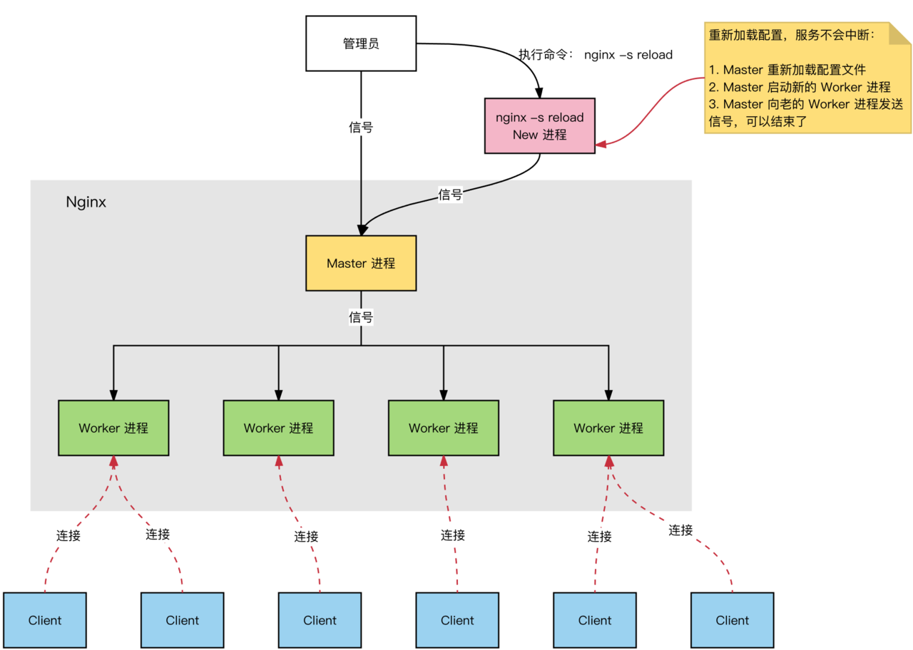

# 1.Nginx组成

Nginx由4部分组成：

- 二进制可执行文件：由各个模块源码编译出来的文件
- nginx.conf配置文件：控制nginx的运行行为
- access.log访问日志：记录每一条http请求
- error.log错误日志：便于定位问题

# 1.Nginx高效原因

Nginx高效的原因：

- epoll多路复用
- master worker进程模型
- 协程机制

## 1.1.epoll多路复用

nginx采用的是epoll这种多路复用的I/O模型，NGINX的每个Worker进程通过状态机处理多个连接请求，这个状态机被实现为非阻塞的工作方式： 

## 1.2.master-worker进程模型

主进程：负责执行特权操作，如阅读配置文件、绑定套接字、创建/通知协调（Signalling）子进程。

子进程：也就是Worker进程，是fork主进程的，它们可以共享资源。并且Worker进程才是真正处理客户端连接的进程，当一个Socket连接到来，各个Worker竞争一把`内存互斥锁`，谁抢到谁处理这个Socket。

其次，Nginx的这种进程模型，可以达到平滑重启，平滑加载配置，不会断开用户连接。当管理员执行`nginx -s reload`的时候，master进程会重新加加载配置文件，启动一个新的Worker进程，让旧的Worker进程的Socket句柄移交给新的Worker，然后关掉旧的Worker进程，保证不会断开客户端的Sokcet连接。

## 1.3.协程机制

每个Worker进程都只有一个线程，一个线程内有n个协程

1. 依附于线程的内存模型，切换开销小
2. 遇阻塞及归还执行权，代码同步
3. 无需加锁

协程的思想可以这样理解？使用多线程的原因，就是因为当遇到阻塞操作如系统调用时，单线程会阻塞住导致进程阻塞，所以使用多线程在发现阻塞操作时，用其它线程处理别的事情；而协程依赖于线程，在CPU眼里只有线程，所以多个协程在线程运行，其实就是一个线程在运行。所以，当一个协程遇到阻塞操作时，线程自己会调度其它协程来替换掉这个阻塞操作的协程，保证线程在外面看来是一直在运行的