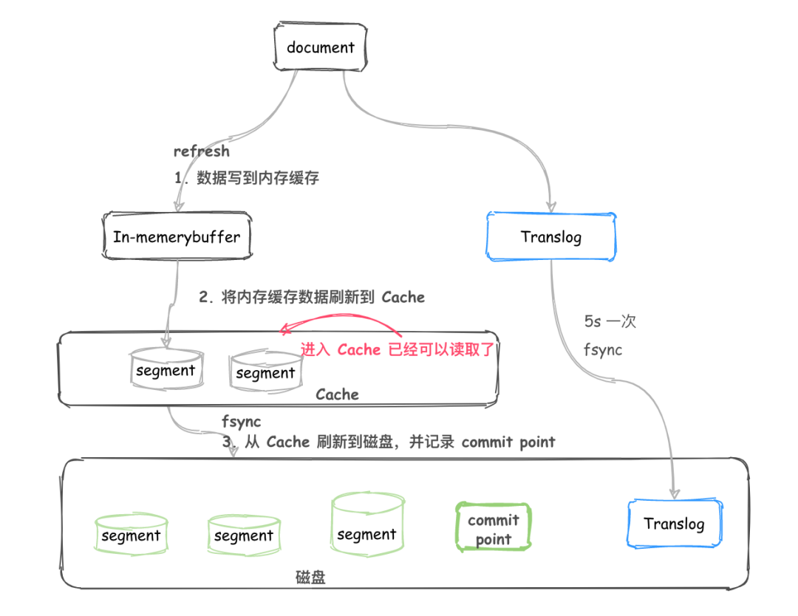

笔记基于ES v5.6.9版本

# 1.ES简介

Elasticsearch，简称ES，是一个基于Lucence的开源搜索引擎，通过简单的RESTful API隐藏了Lucence的复杂性；同时还是一个分布式文档数据库，文档中每个字段均可被索引，而且每个字段的数据均可被搜索，可以将ES部署成集群，它会自动寻找属于同一集群的节点；ES是使用Java构建的，使用ES需要先安装Java环境；ES2.0以上版本要求Java7环境，ES5.0以上版本要求Java8环境。

## 1.1.基本概念

### 1.1.1.cluster

cluster，即集群。是一组具有相同 cluster.name 的[ES节点](#1.1.2.node)集合。一个集群由一个唯一集群ID确定，并指定一个集群名（默认为“elasticsearch”）。该集群名非常重要，因为节点可以通过这个集群名加入群集，一个节点只能是群集的一部分。**修改cluster.name的步骤：**到elasticsearch安装的目录下的../config/elasticsearch.yml，将cluster.name注释解开，修改它的值

### 1.1.2.node

node，即节点。是一个正在运行着的Elasticsearch实例，属于集群的一部分，可以存储数据，并参与群集的索引和搜索功能。默认情况下，节点名称为一个随机的通用唯一标识符（UUID），并默认被分配到名为“elasticSearch”的集群。节点名称对管理很重要，目的是要确定网络服务器对应的ES群集节点，可以通过群集名配置节点以连接特定的群集。一个节点node里面有多个[索引index](#1.1.3.index).

### 1.1.3.index

index，即索引。ES将数据存储于一个或多个索引中，索引是具有类似特性的文档的集合。类比传统的关系型数据库，索引相当于SQL中的一个数据库，或者一个数据存储方案(schema)。索引由其名称(必须为全小写字符)进行标识，并通过引用此名称完成文档的创建、搜索、更新及删除操作。一个ES集群中可以按需创建任意数目的索引.一个索引index可以被多个[分片shard](#1.1.6.shard)路由存储

### 1.1.4.type

type，即类型。是索引内部的逻辑分区(category/partition)，其意义完全取决于用户需求。因此，一个索引内部可定义一个或多个类型(type)。一般来说，类型就是为那些拥有相同的域的文档做的预定义。实际上，Lucene没有type的概念，一个index内的多个type其实是一起存储的，所以为什么建议将类型结构相同的type放到同一个index下？如果两个type结构完全不同但一起放在同一个index下，那每条数据至少有一半的字段在lucene底层都是空值，严重浪费空间和影响性能。而且，由于同一个index的type在lucene底层是一起存储的，导致不同type内的字段不能同名，即使字段同名，它们的类型也要保持一致，如果一个type的id是text类型，另一个type若设置id为integer类型，则会报错.

在ES6.0以上版本中创建的索引只允许存在一个type;

在ES7.0中类型type概念将被彻底删除。

(在ES5.x中创建的多映射类型的索引在ES6.x中将如以前一样可用，为了过渡)

### 1.1.5.document

document，即文档。是Lucene索引和搜索的原子单位，它是包含了一个或多个域的容器，基于JSON格式进行表示。文档由一个或多个域组成，每个域拥有一个名字及一个或多个值，有多个值的域通常称为“多值域”。每个文档可以存储不同的域集，但同一类型下的文档至应该有某种程度上的相似之处。相当于数据库的“记录”，文档以唯一ID标识并存储于ES中。一个文档不仅仅包含数据，它还包含3个元数据：

### 1.1.6.shard

shard，即分片。是ES底层的工作单元，一个分片就是一个Lucence实例，它自身就是一个完整的搜索引擎。单台机器无法储存大量的数据，ES将一个索引( 即[index](#1.1.3.index) )的数据切分为多个shard，分布在多台服务器上存储。分片分为主分片(primary shard)和副分片(replica shard)，一般主分片简称为primary，副分片简称为replica。

**主分片：**

- 在索引建立时就已确定主分片数，**不能修改**，默认为5个。索引任意一个文档都归属于一个主分片，所以主分片的数目决定着索引能够保存的最大数据量。

**副分片：**

- 一个副本分片只是一个主分片的拷贝，默认1个主分片对应1个副分片，**随****时可以修改**。副分片作为硬件故障时保护数据不丢失的冗余备份，并为搜索和返回文档等读操作提供服务。

**默认情况：**一个Index，有10个shard，其中5个主分片，5个副分片；

**注意：**主分片和它的副分片不能同时存在于一台服务器上（防止宕机都失效）。

### 1.1.7.mapping

mapping，即映射，是定义文档的字段的存储类型和索引方式的过程，ES带有dynamic mapping(自动映射)功能，能自动映射我们put或post进去的文档，但对于一些复杂数据类型如地理位置就需要我们手动定义。

**可以使用mapping来定义：**

①应将哪些字符串字段视为全文字段

②哪些字段包含数字，日期或地理位置

③用于控制动态添加字段的映射的自定义规则

...等等

### 1.1.8.analyzer

analyzer，即分词。数据在存储时，ES会对文档各字段的值进行[倒排索引](#1.2.倒排索引)，这就要涉及到将一段句子分为各个短语，这个过程就是分词，能够执行分词的程序成为分词器。**例如**：原句子："The QUICK brown foxes jumped over the lazy dog!"，分词器会将该句子分成不同的短语，对短语进行小写转换，删除频繁的停用词（“the”）并将术语缩减为它们的词干（foxes→fox，jumped→jump，lazy→lazi）最后，原句子被分为如下短语并将这些短语添加至倒排索引中:[ quick, brown, fox, jump, over, lazi, dog ]；

由此可见，不同分词器对同一个句子分词得到的结果并不一样，这就要求了ES在对文档建立倒排索引使用到的分词器要和对客户端发起的查询子句分词的分词器要一样，这样才能搜索得到。这就解释了为啥同一个查询条件在对不同字段查询时，得到的结果不一样，原因就是同一个查询条件在不同字段查询时，ES会选取不同的分词器去分词，得到的结果不一样，导致搜索的结果也不一样

## 1.2.倒排索引

倒排索引，也称为反向索引，是搜索引擎的基础数据结构。相反于一篇文章包含了哪些词，它从词出发，记载了这个词在哪些文档中出现过，用来存储在全文搜索下某个单词在一个文档或者一组文档中的存储位置的映射。由两部分组成：词典和倒排表。

1. 假设有5个文档，文档编号和文档内容如下图所示，如果按照关系型数据库，则为文档编号建立索引，通过文档编号可以快速查找文档内容，即正向索引

2. 倒排索引则相反，它是由文档内容来映射文档编号从而找到文档，而中文与英文不同，英文一个单词就是一个单词，单词与单词之间有空格隔开，中文则不同，没有规则的符号隔开，所以需要分词：例如：“谷歌”一词，在5个文档都存在，所以它对应的文档编号为:1,2,3,4,5

倒排索引的底层实现是基于：FST（Finite State Transducer）数据结构。lucene从4+版本后开始大量使用的数据结构是FST。FST有两个优点：

1. 空间占用小。通过对词典中单词前缀和后缀的重复利用，压缩了存储空间；

2. 查询速度快。O(len(str))的查询时间复杂度。

## 1.3.协调节点

ES是一个集群，当发起一个文档搜索or 文档增删请求时，接收客户端请求的ES节点很有可能不是存放该文档的节点，这种情况下接收请求的节点就是协调节点（coordinating node）。它通过[路由算法](#_路由算法)计算存放文档的节点，将请求转发到真正可以处理的节点上，当节点处理完以后，将结果返回给协调节点，然后节点再返回给客户端。特别地，当文档请求时增删改时，协调节点只会转发给存放主分片的节点，在主分片节点处理完以后，同步数据到对应的复制分片节点，在这两步都完成后协调节点才会返回结果给客户端

## 1.4.ES分布式架构原理

**es** **是如何实现分布式的：**

1. es集群有多个节点，会自动选举一个节点为 master 节点，这个 master 节点就是干一些管理的工作，比如：维护索引元数据、负责切换 primary shard和 replica shard 身份等。要是 master 节点宕机了，那么会重新选举一个节点为 master 节点；

2. 若非master节点宕机了，则该节点上的primary shard就会丢失，所以master会让primary shard对应的 replica shard（在其他节点上）切换为 primary shard；后面宕机的节点修复重启后，修改其分片为replica shard，并将同步在它宕机之后修改的数据。

# 2.ES内部原理

## 2.1.路由算法

ES的路由算法就是为了计算出文档在哪个分片上，通过对路由routing计算hash值，然后将此值对主分片数量求余，求余的结果就是放置的分片。计算公式为：**shard = hash(routing) % number_of_primary_shards**

- routing，即文档id，也可以手动指定，ES大部分API都支持routing参数；

- number_of_primary_shard，即ES的主分片总数量。

**例子：**

假如集群在初始化的时候有5个primary shard，在里边加入一个document { id=5 } ，假如hash(5)=23,这时该document 将被加入 (shard=23%5=3)P3这个分片上。如果随后我们给es集群添加一个primary shard ，此时就有6个primary shard，当我们GET id=5 ，这条数据的时候，es会计算该请求的路由信息找到存储他的 primary shard（shard=23%6=5） ，根据计算结果定位到P5分片上。而我们的数据在P3上。所以es集群无法添加primary shard，但是可以扩展replicas shard 

## 2.2.运行机制

### 2.2.1.选举过程

ES的选举是ZenDiscovery模块负责，核心入口为findMaster。主要包含Ping（节点之间通过这个RPC来发现彼此）和Unicast（单播模块包含一个主机列表以控制哪些节点需要ping通）这两部分。选举过程为：

1. 确认候选主节点数达标，由配置discovery.zen.minimum_master_nodes指定；

2. 判定是否具备master资格(即配置node.master: true)，每个节点把自己；知道的可以成为master的其它节点根据nodeId字典排序，然后选出第一个节点（第0位），暂且认为它是master节点；

3. 某个节点的投票数达到一定的值（可以成为master节点数n/2+1）并且该节点自己也选举自己，那这个节点就是master，否则重新选举一直到满足上述条件。

当候选数量为两个时，只能手动修改为唯一的一个master候选，其他作为data节点，这就是选举过程中的脑裂问题；因此集群的节点数量最好是奇数个，即最少3个节点，这样通过配置discovery.zen.minimum_master_nodes最少投票通过数量，超过所有候选节点一半以上来解决脑裂问题。

### 2.2.2.索引过程(写入过程)

#### 2.2.2.1.整体流程

1. 客户端选择一个 node 发送请求过去，这个 node 就是协调节点；

2. 协调节点对文档进行路由，将请求转发给对应的node（有 primary shard）；

3. 实际的 node 上的 primary shard 处理请求，然后将数据同步到 replica node(在不同的节点上)；

4. 如果发现 primary node 和所有 replica node 都成功之后，就返回响应结果给客户端

#### 2.2.2.2.底层细节

1. 节点接收到来自协调节点的请求后，会将请求写入到Memory Buffer，然后定时（默认是每隔1秒）写入到Filesystem Cache，这个从Momery Buffer到Filesystem Cache的过程就叫做refresh；

2. 为防止Momery Buffer和Filesystem Cache的数据丢失，ES通过translog的机制来保证数据的可靠性。其实现机制是接收到请求后，同时也会写入到translog中，当Filesystem cache中的数据写入到磁盘中时，才会清除掉，这个过程叫做flush；

3. 在flush过程中，内存中的缓冲将被清除，内容被写入一个新段，段的fsync将创建一个新的提交点，并将内容刷新到磁盘，旧的translog将被删除并开始一个新的translog。flush触发的时机是定时触发（默认30分钟）或者translog变得太大（默认为512M）时；

总结：数据先写入内存 buffer，然后每隔 1s，将数据 refresh 到 os cache，到了 os cache 数据就能被搜索到（所以我们才说 es 从写入到能被搜索到，中间有 1s 的延迟）；每隔 5s，将数据写入 translog 文件（这样如果机器宕机，内存数据全没，最多会有 5s 的数据丢失），translog 大到一定程度，或者默认每隔 30mins，会触发 commit 操作，将缓冲区的数据都 flush 到 segment file 磁盘文件中。(数据写入 segment file 之后，同时就建立好了倒排索引)

### 2.2.3.更新过程

更新过程包括文档更新和文档删除

#### 2.2.3.1.文档删除

磁盘上的每个段都有一个相应的.del文件，当删除请求发送后，文档并没有真的被删除，而是在.del文件中被标记为删除。该文档依然能匹配查询，但是会在结果中被过滤掉(此时文件未被真正删除)。ES会定期执行segment file的merge操作，会将多个 segment file 合并成一个，同时这里会将标识为 deleted 的 doc 给物理删除掉，然后将新的 segment file 写入磁盘(此时文件已被真正删除)

#### 2.2.3.2.文档更新

如果是更新操作，就是将原先的 doc 标识为 deleted 状态，然后新写入一条数据。

### 2.2.4.搜索过程

ES的文档搜索过程分为两部分：query和fetch，被称为“Query Then Fetch”

#### 2.2.4.1.query查询阶段

1. 查询会广播到索引中每一个分片拷贝（主分片或者副本分片）。 每个分片在本地执行搜索并构建一个匹配文档的大小为 from + size 的优先队列。PS：在搜索的时候是会查询Filesystem Cache的，但是有部分数据还在Memory Buffer，所以搜索是近实时的

2. 每个分片返回各自优先队列中 所有文档的 ID 和排序值给协调节点，它合并这些值到自己的优先队列中来产生一个全局排序后的结果列表

#### 2.2.4.2.fetch取回阶段

协调节点辨别出哪些文档需要被取回并向相关的分片提交多个 GET 请求。每个分片加载并丰富文档，如果有需要的话，接着返回文档给协调节点。一旦所有的文档都被取回了，协调节点返回结果给客户端。

## 2.3.轮询调度

Round Robin（中文翻译为轮询调度）。ES采取round-robin随机轮询算法，将对同一个文档的多次请求，负载均衡地分发到primary shard和replica shard上。例如：可能对一个文档有4次请求，2次给primary shard处理，2次给replica shard处理..

## 2.4.读写一致

### 2.4.1.quorum/consistency

在ES5.x版本之前，发送任何一个增删改操作(注意不包含查)的时候，例如： put /index/type/id，都可以带上一个consistency参数，指明想要的写一致性是什么。consistency的取值为：

1. one：只要有一个primary shard是active活跃可用的，就可以执行;

2. all：所有的primary shard和replica shard都是活跃的，才可执行;

3. quorum：默认值，要求所有的shard中，必须是大部分的shard都是活跃可用的，才可以执行这个写操作

那么问题来了，对于quorum取值，"大部分shard活跃"是什么意思？

**quorum机制：**

以 consistency=quorum 方式执行增删改时，保证shard数量大于int( (primary + number_of_replicas) / 2 ) + 1 才生效，此机制的前提是number_of_replicas必须大于1....(primary是主分片数量，number_of_replicas是每个主分片对应副分片数量)。

例如：某个index的有3个primary shard，number_of_replicas为1，则该Index共有3个primary shard和3个replica shard，总共有6个shard。当执行增删改操作时，quorum=（3+1）/2+1=3，即至少需要3个shard为活跃状态才可以完成增删改操作。如果shard数少于quorum数量，可能导致quorum不齐全，进而导致无法执行任何写操作。quorum不齐全时，会wait，默认1分钟， wait等待期间，期望活跃的shard数量可以增加，最后实在不行，就会timeout..（当然可以在请求时自己指定timeout 时间）

可能出现的问题：如果是单机环境，只有一个节点node，设置了primary shard就没法在该node中设置replica shard，按quorum机制计算，quorum=(1+1)/2+1=2，至少需要2的shard，但实际只有1个shard，这就会导致在单机环境中ES不能执行增删改操作..为了解决这一问题，ES设置quorum生效前提：number_of_replicas必须大于1等特殊处理操作...

### 2.4.2.wait_for_active_shards

wait_for_active_shards是ES5.x版本取代consistency 的新参数，它可以指定：如果必需数量的活动分片副本（注意是replica shard）不可用，则写入操作必须等待并重试，直到必需的分片副本已启动或发生超时。默认写入操作仅等待主分片在继续之前处于活动状态，即wait_for_active_shards = 1，通过设置index.write.wait_for_active_shards，可以在索引设置中动态覆盖此默认值：

当分片副本不足时Elasticsearch会等待更多的分片出现。默认等待一分钟。如果需要，你可以设置timeout参数让它终止的更早：100表示100毫秒，30s表示30秒。

## 2.5.冲突处理

当使用 /_index/_type/_id处理文档时，若此时也有一个请求处理相同的文档时，先提交修改的文档数据会丢失—ES中只存储最后被索引的任何文档

举个实例：若ES存放电商系统的商品库存，此时a请求购买商品，库存-1，恰巧b也请求购买商品，库存也-1，由于a请求还没提交( 即ES的库存还没更新 )

b也请求了，此时ES的库存只会更新b请求的-1，而忽略了a请求的-1，理论上卖出去了2个商品，但实际上库存只少了1个，出现数据脏读！！！

其实不止ES，关系数据库也会出现数据更新冲突的问题，在数据库中，有两种通用的方法确保在并发更新时修改不丢失：

1. 悲观并发控制（Pessimistic  concurrency control）：当线程想更新数据时，将当行数据加锁，仅有该线程能操作；

2. 乐观并发控制（Optimistic concurrency control）：线程更新数据，系统不会将当行数据加锁，在该线程提交数据时系统检查是否有另一个线程也更新提交了数据，若数据确实被更新了，系统返回一个错误，由请求发起者决定处理方式

ES采用第二种：乐观并发控制，这种方式利用ES文档的元数据_version：当修改或删除一个文档时，ES会将_version加1并将新版本号同步到集合中的剩余节点，利用这一特性，可以指定文档version来做想要的更改。若此时版本号不是现在的，则请求失败。这个_version可以由ES内部控制，也可以由外部版本号控制

# 3.ES调优

## 3.1.索引层面

### 3.1.1.设计阶段

①建议采取基于日期模板创建索引，通过roll over API滚动索引；

②使用别名进行索引管理；

③服务器空闲时间对索引做force_merge操作，以释放空间；

④采取冷热分离机制，热点数据存储到SSD；冷数据定期进行shrink操作；

⑤采取curator进行索引的生命周期管理；

⑥仅针对需要分词的字段，合理设置分词器；

### 3.1.2.写入调优

①写入前副本数设置为0；

②写入前关闭refresh_interval，将其设置为-1，禁用刷新机制；

③写入过程尽量使用bulk批量写入；

④写入恢复副本数和刷新间隔；

⑤尽量使用自动生成的id

### 3.1.3.查询调优

①禁用wildcard；

②禁用批量terms；

③充分利用倒排索引机制，能用keyword就用；

④设置合理的路由机制

## 3.2.filesystem cache层面

es 的搜索引擎严重依赖于底层的 filesystem cache，你如果给 filesystem cache 更多的内存，尽量让内存可以容纳所有的 idx segment file 索引数据文件，那么你搜索的时候就基本都是走内存的，性能会非常高：

### 3.2.1.数据预热

比较热点的、经常会有人访问的数据，最好做一个专门的缓存预热子系统，就是对热数据每隔一段时间，就提前访问一下，让数据进入 filesystem cache 里面去

### 3.2.2.冷热分离

将大量的访问很少、频率很低的数据，单独写一个索引，然后将访问很频繁的热数据单独写一个索引。最好是将冷数据写入一个索引中，然后热数据写入另外一个索引中，这样可以确保热数据在被预热之后，尽量都让他们留在 filesystem os cache 里，别让冷数据给冲刷掉

## 3.3.分页层面

es 的分页是较坑的，假如每页是 10 条数据，现在要查询第 100 页，实际上是会把每个 shard 上存储的前 1000 条数据都查到一个协调节点上，如果你有个 5 个 shard，那么就有 5000 条数据，接着协调节点对这 5000 条数据进行一些合并、处理，再获取到最终第 100 页的 10 条数据。

### 3.3.1.不允许深度分页

不允许一下子深度分页，默认翻的越深，性能就越差，改为类似类似于 app 里的推荐商品不断下拉出来一页一页的，可以使用 scroll api实现。scroll 会一次性给你生成所有数据的一个快照，然后每次滑动向后翻页就是通过游标 scroll_id 移动，获取下一页下一页这样子，性能会比上面说的那种分页性能要高很多很多，基本上都是毫秒级的