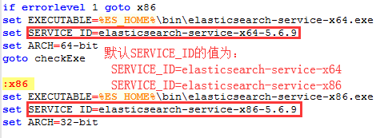

# 1.ES安装

## 1.1.window

### 1.1.1.单机单服务

在window环境下，直接将下载好的ES压缩包解压，找到解压目录下的..\elasticsearch-5.6.9\bin下面的elasticsearch.bat，双击即可运行，打开浏览器，输入：[http://localhost:9200](http://localhost:9200)，能返回JSON信息说明启动成功，把ES安装成一个服务：到ES安装目录的bin目录，执行命令：

```bash
elasticsearch-service.bat install
```

启动ES也可以执行命令：

```bash
elasticsearch-service.bat start
```

### 1.1.2.单机多服务

ES在安装成服务之前，可以通过设置window环境变量，配置服务的属性：( 注意：可能不同版本之间这些环境变量的变量名会不一样 )，正常情况，仅仅使用到SERVICE_DISPLAY_NAME改变ES服务名称而已：

- **SERVICE_ID** - 服务的唯一标识符。如果在同一台机器上安装多个实例，这很有用。 默认为elasticsearch-service-x64.

- **SERVICE_USERNAME** - 运行服务的用户，默认为本地系统帐户

- **SERVICE_PASSWORD** - 在%SERVICE_USERNAME%中指定的用户的密码

- **SERVICE_DISPLAY_NAME** - 服务的名称。

- **SERVICE_DESCRIPTION** - 服务的描述。

- **JAVA_HOME** - 运行服务所需的JVM的安装目录。

- **SERVICE_LOG_DIR** - 服务日志目录，默认为%ES_HOME%\logs。注意，这并不控制Elasticsearch日志的路径;这些路径是通过在elasticsearch.yml配置文件中的path.logs设置或命令行上设置的。

- **ES_PATH_CONF** - 配置文件目录（）
   Configuration file directory (需要包含 elasticsearch.yml, jvm.options, and log4j2.properties文件), 默认是 %ES_HOME%\config。

- **ES_JAVA_OPTS** - 您可能想要应用的任何其他JVM系统属性。

- **ES_START_TYPE** - 服务的启动模式。可以是自动的，也可以是手动的(默认)。

- **ES_STOP_TIMEOUT** - 等待服务优雅退出的超时时间(秒)。默认值为0。

1. 先设置ES服务名称，在window环境变量创建一个`SERVICE_DISPLAY_NAME`，值就是ES服务名称；

2. 修改ES安装服务的脚本文件elasticsearch-service.bat的SERVICE_ID，在默认SERVICE_ID值后面加上ES的版本号即可( 当然也可以加上其他，只要保证唯一性就行，避免本机服务名冲突 )

   

3. 全部设置好，执行elasticsearch-service.bat install就可以安装了。一个版本的ES安装好后，重新执行①②步，安装另一个版本的ES，结果：

   

## 1.2.Linux

### 1.2.1.安装步骤

1. 准备好ES的安装包，使用rz上传到Linux服务器上，或者直接联网下载，网址为：[ES-6.4.3.tar.gz](curl -L -O https:/artifacts.elastic.co/downloads/elasticsearch/elasticsearch-6.4.3.tar.gz)。
2. 解压刚才上传或下载的ES压缩包，切换到解压后的目录下的bin目录，执行命令：./elasticsearch（前台启动），./ elasticsearch -d（后台启动）

### 1.2.2安装报错

#### 1.2.2.1.拒绝root用户启动

es不允许以root用户启动，在2.x版本还可以在启动时加上参数，如：./elasticsearch -Des.insecure.allow.root=true来以root用户启动；但是在5.x以后，除非修改源代码，否则不能以root用户启动，因此需要创建一个单独的用户用来运行ES。

**步骤：**

1. 创建用户组，执行命令：groupadd esUsers（esUsers为自定义组名）

2. 创建用户，执行命令：useradd es -g esUsers -p elasticsearch ( es为用户名，esUsers为用户组名，-p后面是密码 )

3. 更改elasticsearch文件夹及内部文件的所属用户及组，执行命令：chown -R es:esUsers /usr/local/... (最后一个参数是ES安装目录)

#### 1.2.2.2.启动报错

①**报错原因**：“max file descriptors [4096] for elasticsearch process is too low, increase to at least [65536]”。

**解决方法：**切换到root用户，在vim /etc/security/limits.conf中添加：

 ```tex
* soft nofile 65536
* hard nofile 131072
* soft nproc 2048
* hard nproc 4096
 ```

②**报错原因**：“max virtual memory areas vm.max_map_count [65530] is too low, increase to at least [262144]”

**解决方法：**切换到root用户，修改配置vim /etc/sysctl.conf，添加如下的配置：vm.max_map_count=655360，并执行命令：sysctl -p

### 1.2.3.启动关闭ES

**启动ES（先切换到ES安装目录下的bin下**）**

①前台启动ES，执行：./elasticsearch

②后台启动ES，执行：./elasticsearch -d

**关闭ES**

①查找ES的进程号，执行命令：ps -ef | grep elastic

②杀掉ES进程，执行命令：kill -9 2971 （2971是上条命令查的ES进程号）

## 1.3.导入数据

### 1.3.1.JSON导入

准备好JSON文件，注意格式要符合_bulk的要求，然后执行下面的语句：

```bash
curl -H "Content-Type: application/x-ndjson" -XPOST "127.0.0.1:9200/bank/account/_bulk?pretty" --data-binary @accounts.json
```

