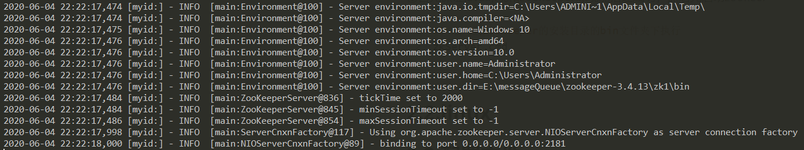
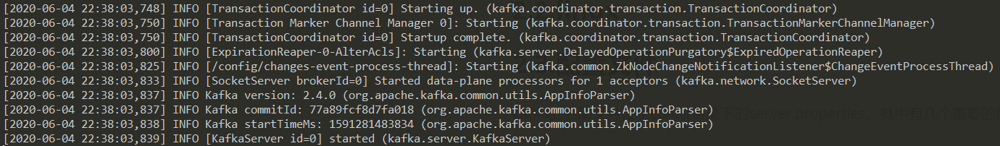
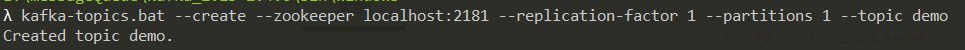

# 1.kafka介绍


## 1.1.基本概念

- **Producer**：生产者即数据的发布者，该角色将消息发布到kafka的topic中。broker将该消息追加到前档用于追加数据的segment中。生产者发送的消息，储存到一个partition中，生产者也可以指定数据储存的partition
- **Consumer**：消费者可以从broker中读取数据。消费者可以消费多个topic中的数据
- **Topic**：在kafka中使用一个类别属性来划分数据的所属类，划分数据的这个类称为topic。如果把kafka看做一个数据库，topic可以理解为数据库中的一张表，topic面子即为表名
- **Partition**：topic中的数据分割为一个或多个partition（分区）。每个topic至少有一个partition，每个partition中的数据使用多个segment文件存储。partition中的数据是有序的，partition间的数据丢失了数据的顺序。如果topic有多个partition，消费数据时候就不能保证数据的顺序。在需要严格保证消息的消费顺序的场景下，需要将partition数据设置为1；
- **Partition offset**：每条消息都有一个当前Partition下唯一的64字节的offset，它指明了这条消息的起始位置
- **Replicas of partition**：副本是一个分区的备份。副本不会被消费者消费，副本只用于防止数据丢失，即消费者不从为follower的partition中消费数据，而是从leader的partition中读取数据。副本之间是一主多从的关系
- **Broker**：kafka集群包含一个或多个服务器，服务器节点成为broker。broker存储topic的数据，如果某topic有N个partition，集群有N个broker，那么每个broker储存该topic的一个partition。如果某topic有N个partition，集群有（N+M）个broker，那么其中有N个broker储存该topic的一个partition，剩下的M歌broker不存储该topic的partition数据。如果某topic有N个partition，集群中broker数目少于N个，那么一个broker存储该topic的一个或多个partition。在实际生产环境中，尽量避免这种情况的发生，这种情况容易导致kafka集群数据不均衡
- **Leader**：每个partition有多个副本，其中有且仅有一个作为Leader，Leader是当前负责数据的读写的partition
- **Follower**：Follower跟随Leader，所有写请求都通过Leader路由，数据变更会黄渤给所有Follower，Follower与Leader保持数据同步。如果Leader失效，则从Follower中选举出一个新的Leader。当前Follower与Leader挂掉、卡主或者同步太慢，leader会把这个Follower从“in sync replicas”（ISR）列表中删除，重新创建一个Follower
- **Zookeeper**：Zookeeper负责维护和协调broker。当kafka系统中新增了broker或者某个Broker发生故障失效时，由zookeeper通知生产者和消费者。生产者和消费者依据zookeeper的broker状态信息与broker协调数据的发布和订阅任务
- **AR**（Assigned Replicas）：分区partition中所有的副本统称为AR
- **ISR**（In Sync Replicas）：所有于Leader部分保持一定程度的副本组成ISR
- **OSR**（Out of Sync Replicas）：与Leader副本同步滞后过多的副本
- **HW**（High Watermark）：高水位，标识了一个特定的offset，消费者只能拉取到这个offset之前的消息
- **LEO**（Log End Offset）：即日志末端位移(log end offset)，记录了该副本底层日志(log)中下一条消息的位移值。注意是下一条消息！也就是说，如果LEO=10，那么标识该副本保存了10条消息，位移值范围是[0,9]

## 1.2.使用场景

1. **日志收集**：kafka可以收集企业级微服务的日志信息，通过统一接口服务的方式开放给各种消费者，诸如Hadoop、Hbase、Solr和Elasticsearch等
2. **消息系统**：解耦和生产者和消费者、缓存消息等
3. **用户活动跟踪**：kafka长用于记录web用户或者app用户的各种活动，例如浏览网页、搜索、点击等活动，这些活动信息发布到kafka的topic中，然后消费者通过订阅这些topic做实时的监控分析，或者装载到Hadoop、数据仓库中做离线分析和挖掘
4. **运营指标**：kafka常用于记录运营监控数据，包括手机各种分布式应用的数据，生产各种操作的几种反馈，比如报警和报告
5. **流式处理**：比如spark streaming和storm

## 1.3.技术优势

- **可伸缩性**：kafka的两个重要特性造就了它的可伸缩性
  1. kafka集群可以在运行期间轻松地扩展或收缩，而不会宕机
  2. 可以扩展一个kafka主题来包含更多的分区，由于一个分区无法扩展到多个代理所以它的容量受到代理磁盘空间的限制。能够增加分区和代理的数量意味着单个主题可以储存的数据量是没有限制的

- **容错性和可靠性**：kafka的设计方式使某个代理的故障能够被集群中的其它代理检测到，由于每个主题都可以在多个代理上复制，所以集群可以在不中断服务的情况下从此类故障中恢复并继续运行
- **吞吐量**：代理能够以超快的速度有效地储存和检索数据

# 2.安装&配置

kafka官网下载地址：[https://kafka.apache.org/downloads](https://kafka.apache.org/downloads)

zookeeper下载地址：[https://archive.apache.org/dist/zookeeper/](https://archive.apache.org/dist/zookeeper/)

## 2.1.window

**①**首先保证java环境和zookeeper环境能搭建成功，然后先启动zookeer

```bash
## 进入到zookeeper的安装目录的bin文件夹下执行
zkServer.cmd
```



**②**下载解压kafka的压缩包，修改config目录下的server.properties，详细配置信息在[配置文件](#2.3.配置文件)一栏，这边只需要修改下log.dirs的信息为指定的文件夹地址即可。然后进入kafka的安装目录（kafka专门有提供一个window的bat执行命令目录），执行命令：

```bash
## 启动kafka的broker
.\bin\windows\kafka-server-start.bat .\config\server.properties 
```



**③**创建kafka主题topic，进入kafka安装目录/bin/window/，执行命令：

```bash
## 参数的含义
## --create, 表示创建主题
## --zookeeper, 表示zk连接地址
## --replication-factor, 表示副本个数, 单机启动最大只能为1
## --partitions, 表示分片个数
## --topic, 指定主题名称
kafka-topics.bat --create --zookeeper localhost:2181 --replication-factor 1 --partitions 1 --topic demo 
```



**④**创建kafka生产者producer，进入kafka安装目录/bin/window，执行命令：

```bash
## 绑定上面的topic
kafka-console-producer.bat --broker-list localhost:9092 --topic demo 
```

**⑤**创建kafka消费者consumer，进入kafka安装目录/bin/window，执行命令：

```bash
## 订阅上面的topic
kafka-console-consumer.bat --bootstrap-server localhost:9092 --topic demo
```

## 2.2.linux

.....

## 2.3.配置文件

kafka的启动文件位于config目录下的server.properties，其中有几个重要的配置：

```properties
# 表示broker的编号, 集群中每个broker的编号必须不一样
broker.id=0

# broker对外提供的服务入口地址
listeners=PLAINTEXT://:9092

# 日志存放地址
log.dirs=/tmp/kafka/log

# zookeeper集群连接地址
zookeeper.connect=localhost:2181
```

# 3.生产者

kafka消息的发送方

## 3.1.基本组件

### 3.1.1.序列化器

消息要在网络上传输，必须以字节流的形式，即需要被序列化。kafka的序列化器接口：`org.apache.kafka.common.serialization.Serializer`，默认提供了字符串序列化器、整型序列化器和字节数组序列化器等等..

### 3.1.2.分区器

分区器是用来决定消息要发送到broker的哪个分区上，kafka的分区器接口：`org.apache.kafka.clients.producer.Partitioner`，若用户没指定分区器实现，kafka会使用`org.apache.kafka.clients.producer.internals.DefaultPartitioner`，它是根据传递消息的key来进行分区的分配，即hash(key)%numPartitions，如果key相同的话就会分配到统一分区

### 3.1.3.拦截器

拦截器是用来对生产者做定制化的逻辑控制，可以在消息发送之前进行额外的处理。kafka的拦截器接口：`org.apache.kafka.clients.producer.ProducerInterceptor`。一般用于以下场景：

- 按照某个规则过滤掉不符合要求的消息
- 修改消息的内容
- 统计类需求

## 3.2.消息发送流程


## 3.3.其它属性配置

producer的其它属性设置，官方文档内容：[https://kafka.apache.org/documentation/#producerconfigs](https://kafka.apache.org/documentation/#producerconfigs)

### 3.3.1acks

**acks：**用来指定分区中必须有多少个副本收到这条消息，之后生产者才会认为这条消息写入成功

| 取值    | 作用                                                         |
| ------- | ------------------------------------------------------------ |
| acks=0  | 生产者在写入消息之前不会等待任何来自服务器的响应，如果消息发送过程中出现问题了，生产者是无法感知到，意味着消息可能丢失，但换来的是高吞吐量 |
| acks=1  | 默认值，只要集群的首领节点收到消息，生产者就会收到一个来自服务器的成果响应，如果消息无法达到首领节点（比如首领节点崩溃，新首领还未被选举出来），生字者就会收到一个错误响应，为了避免消息丢失，生产者会重发消息。但是如果写成功通知了，但此时首领节点还没来得及将数据同步到follower节点就宕机了，还是会造成消息丢失 |
| acks=-1 | 只有当说是有参与复制的节点都收到消息后，生产者才会收到一个来自服务器的成功响应，这种模式是最安全的但吞吐量最低，它保证不止一个服务器收到消息 |

注意：acks的设置是字符串而不是整数。

### 3.3.2.retries

设置生产者在消息发送失败的情况下的重试次数。默认情况下，生产者会在每次重试之间等待100ms，也可以通过`retries.backoff.ms`参数来修改这个时间间隔！

### 3.3.3.batch.size

当有 消息要被发送同一个分区时，生产者会把它们放在同一个批次里。该参数指定了一个批次可以使用的内存大小，**按照字节数计算，而不是消息的个数**。当批次被填满，批次里的所有消息就会被发送出去。不过生产者并不一定都会等到批次被填满才发哦是哪个，半满的批次，甚至只包含一个消息的批次都有可能被发送。所以就算把`batch.size`设置得很大，也不会造成延迟，只会占用更多的内存而已，如果设置的太小，生产者就会以为频繁发送消息而增加一些额外的开销

### 3.3.4.max.request.size

该参数用于控制生产者发送的请求大小，它可以指定能发送的单个消息的最大值，也可以指定单个请求所有消息的总大小。`broker`对可接受的消息最大值也有自己的限制（`message.max.size`），所以两边配置最好匹配，防止生产者发送的消息被broker拒绝

# 4.消费者

## 4.1.消费者和消费组

