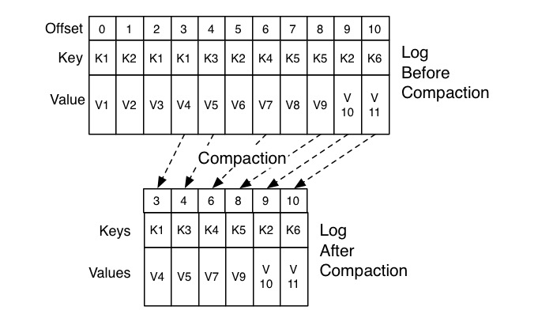

# 1.kafka介绍

Kafka 是消息引擎系统，也是分布式流处理平台。


## 1.1.基本概念

- **Producer**：生产者即数据的发布者，该角色将消息发布到kafka的topic中。broker将该消息追加到前档用于追加数据的segment中。生产者发送的消息，储存到一个partition中，生产者也可以指定数据储存的partition
- **Consumer**：消费者可以从broker中读取数据。消费者可以消费多个topic中的数据
- **Topic**：在kafka中使用一个类别属性来划分数据的所属类，划分数据的这个类称为topic。如果把kafka看做一个数据库，topic可以理解为数据库中的一张表，topic面子即为表名
- **Partition**：topic中的数据分割为一个或多个partition（分区）。每个topic至少有一个partition，每个partition中的数据使用多个segment文件存储。partition中的数据是有序的，partition间的数据丢失了数据的顺序。如果topic有多个partition，消费数据时候就不能保证数据的顺序。在需要严格保证消息的消费顺序的场景下，需要将partition数据设置为1；
- **Partition offset**：每条消息都有一个当前Partition下唯一的64字节的offset，它指明了这条消息的起始位置
- **Replicas of partition**：分区副本，每个分区partition下可以配置若干个副本，其中只能有 1 个领导者副本和 N-1 个追随者副本。追随者副本不会被消费者消费，它只用于防止数据丢失，即消费者不从为follower的partition中消费数据，而是从leader的partition中读取数据。副本之间是一主多从的关系
- **Broker**：kafka集群包含一个或多个服务器，服务器节点称为broker。broker存储topic的数据，如果某topic有N个partition，集群有N个broker，那么每个broker储存该topic的一个partition。如果某topic有N个partition，集群有（N+M）个broker，那么其中有N个broker储存该topic的一个partition，剩下的M歌broker不存储该topic的partition数据。如果某topic有N个partition，集群中broker数目少于N个，那么一个broker存储该topic的一个或多个partition。在实际生产环境中，尽量避免这种情况的发生，这种情况容易导致kafka集群数据不均衡
- **Leader**：每个partition有多个副本，其中有且仅有一个作为Leader，Leader是当前负责数据的读写的partition
- **Follower**：Follower跟随Leader，所有写请求都通过Leader路由，数据变更会黄渤给所有Follower，Follower与Leader保持数据同步。如果Leader失效，则从Follower中选举出一个新的Leader。当前Follower与Leader挂掉、卡主或者同步太慢，leader会把这个Follower从“in sync replicas”（ISR）列表中删除，重新创建一个Follower
- **Zookeeper**：Zookeeper负责维护和协调broker。当kafka系统中新增了broker或者某个Broker发生故障失效时，由zookeeper通知生产者和消费者。生产者和消费者依据zookeeper的broker状态信息与broker协调数据的发布和订阅任务
- **AR**（Assigned Replicas）：分区partition中所有的副本统称为AR
- **ISR**（In Sync Replicas）：所有于Leader部分保持一定程度的副本组成ISR
- **OSR**（Out of Sync Replicas）：与Leader副本同步滞后过多的副本
- **HW**（High Watermark）：高水位，标识了一个特定的offset，消费者只能拉取到这个offset之前的消息
- **LEO**（Log End Offset）：即日志末端位移(log end offset)，记录了该副本底层日志(log)中下一条消息的位移值。注意是下一条消息！也就是说，如果LEO=10，那么标识该副本保存了10条消息，位移值范围是[0,9]

## 1.2.使用场景

1. **日志收集**：kafka可以收集企业级微服务的日志信息，通过统一接口服务的方式开放给各种消费者，诸如Hadoop、Hbase、Solr和Elasticsearch等
2. **消息系统**：解耦和生产者和消费者、缓存消息等
3. **用户活动跟踪**：kafka长用于记录web用户或者app用户的各种活动，例如浏览网页、搜索、点击等活动，这些活动信息发布到kafka的topic中，然后消费者通过订阅这些topic做实时的监控分析，或者装载到Hadoop、数据仓库中做离线分析和挖掘
4. **运营指标**：kafka常用于记录运营监控数据，包括手机各种分布式应用的数据，生产各种操作的几种反馈，比如报警和报告
5. **流式处理**：比如spark streaming和storm

## 1.3.技术优势

- **可伸缩性**：kafka的两个重要特性造就了它的可伸缩性
  1. kafka集群可以在运行期间轻松地扩展或收缩，而不会宕机
  2. 可以扩展一个kafka主题来包含更多的分区，由于一个分区无法扩展到多个代理所以它的容量受到代理磁盘空间的限制。能够增加分区和代理的数量意味着单个主题可以储存的数据量是没有限制的

- **容错性和可靠性**：kafka的设计方式使某个代理的故障能够被集群中的其它代理检测到，由于每个主题都可以在多个代理上复制，所以集群可以在不中断服务的情况下从此类故障中恢复并继续运行
- **吞吐量**：代理能够以超快的速度有效地储存和检索数据

# 2.生产者Producer

Kafka客户端，消息发送方

## 2.1.消息发送流程

从我们创建出一个KafkaProducer开始，到调用它的send()方法，一条消息时如何发送到Broker上的呢？


### 2.1.1.序列化器

消息要在网络上传输，必须以字节流的形式，即需要被序列化。kafka的序列化器接口：`org.apache.kafka.common.serialization.Serializer`，默认提供了字符串序列化器、整型序列化器和字节数组序列化器等等..

### 2.1.2.分区器

分区器是用来决定消息要发送到broker的哪个分区上，kafka的分区器接口：`org.apache.kafka.clients.producer.Partitioner`，若用户没指定分区器实现，kafka会使用`org.apache.kafka.clients.producer.internals.DefaultPartitioner`，它是根据传递消息的key来进行分区的分配，即hash(key)%numPartitions，如果key相同的话就会分配到统一分区

### 2.1.3.拦截器

拦截器是用来对生产者做定制化的逻辑控制，可以在消息发送之前进行额外的处理。kafka的拦截器接口：`org.apache.kafka.clients.producer.ProducerInterceptor`。一般用于以下场景：

​	①按照某个规则过滤掉不符合要求的消息

​	②修改消息的内容

​	③统计类需求

## 2.2.分区发送机制

分区partition的作用就是提供负载均衡的能力，实现系统的高伸缩性（Scalability）。这个概念在分布式系统中很常见，只不过叫法可能不同。在 Kafka 中叫分区，在 MongoDB 和 Elasticsearch 中就叫分片 Shard，而在 HBase 中则叫 Region，在 Cassandra 中又被称作 vnode，底层的分区思想是一样。

实际开发中，生产者分区机制，除了支持负载均衡以外，还会有一些业务上的需求，比如规定带有指定值的消息只能发送到规定的partition上。这就需要使用到kafka生产者的分区策略， **所谓分区策略是决定生产者将消息发送到哪个分区的算法。**Kafka 提供了默认的分区策略，同时也支持自定义分区策略，就是实现[基本组件](# 2.1.基本组件)中的分区器接口

### 2.2.1.轮询

Round-robin 策略，即顺序分配。比如一个主题下有 3 个分区，那么第一条消息被发送到分区 0，第二条被发送到分区 1，第三条被发送到分区 2，以此类推。当生产第 4 条消息时又会重新开始，即将其分配到分区 0。这是kafka默认的生产者分区策略


### 2.2.2.随机

Randomness 策略。所谓随机就是随意地将消息放置到任意一个分区上。**如果追求数据的均匀分布，还是使用轮询策略比较好**。事实上，随机策略是老版本生产者使用的分区策略，在新版本中已经改为轮询了。


### 2.2.3.消息键保序

 Key-ordering 策略。Kafka 允许为每条消息定义消息键，简称为Key，开发中可以为Key附上实际业务属性，这样可以保证同一个 Key 的所有消息都进入到相同的分区里面，由于每个分区下的消息处理都是有顺序的，故这个策略被称为按消息键保序策略


## 2.5.TCP连接管理

在kafka中，不管是Producer、Consumer还是Broker之间，它们的通信都是基于TCP。Kafka开发人员选择TCP的一个原因是：**多路复用请求，即 multiplexing request，是指将两个或多个数据流合并到底层单一物理连接中的过程**。

### 2.5.1.建立连接

Producer与Broker之间的TCP连接，在创建KafkaProducer实例时就建立了。Producer应用会在后台创建并启动一个名为 Sender 的线程，该 Sender 线程开始运行时，会根据`bootstrap.servers `参数，与配置的所有Broker建立TCP连接（因此不要配置所有Broker到bootstrap.servers 中），而一旦Producer与任意一台Broker建立连接后，它就可以从元数据中拉取到集群中的其它Broker。不过，除了在创建实例时建立连接，Producer还有两种场景下会跟Broker建立TCP连接：

- Producer更新元数据，若发现还有Broker未连接，会主动与其建立TCP连接；
- Producer发送消息时，若发现目标Broker未连接，会主动与其建立TCP连接；

**kafka对于TCP连接的设计不合理地方？**

- Producer没必要与所有Broker建立连接，只要跟常交互的Broker建立连接即可。
- 在创建Producer实例时，不应该启动Sender线程。《Java 并发编程实践》的作者—布赖恩·格茨（Brian Goetz），明确指出了这样做的风险：在对象构造器中启动线程会造成 this 指针的逃逸。Sender 线程完全能够观测到一个尚未构造完成的 KafkaProducer 实例。

### 2.5.2.管理流程

1. 在创建KafkaProducer实例就会启动Sender线程，与bootstrap.servers配置的Broker建立TCP连接；
2. KafkaProducer首次更新元数据后，会再次与集群所有的Broker建立TCP连接；
3. Producer发送消息到Broker，若发现与该Broker未建立连接，会与其建立TCP连接；
4. 若Producer配置` connections.max.idle.ms `大于0，那么Producer建立的TCP连接在达到一定空闲时间时会被自动关闭；但是如果设置为-1，则不会主动关闭这条TCP连接

# 3.消费者Consumer

## 3.1.消费组

消费组即Consumer Group，消费组**是 Kafka 提供的可扩展且具有容错性的消费者机制**。消费者可以加入一个消费组，它们共享一个Group ID，一个消费组可以监听多个Topic。kafka会保证一个消费组内的消费者会各自承担一个Topic的Partition消费！！

**理想情况下，Consumer 实例的数量应该等于该 Group 订阅主题的分区总数。**如果Consumer数量小于Partition，则必定有一部分Consumer需要承担多个Partition的消费；如果Consumer数量大于Partition，则必定有一部分Consumer永远处于空闲状态，没有Partition给它监听！！

## 3.2.位移主题

在原先的kafka版本，Consumer的消费位移offset，是放在zookeeper上，但是zookeeper适合读多写少场景，offset又是频繁写入的。所以，新版本的 Consumer Group 将消费位移offset，保存在 Broker 端的内部主题即__consumer_offsets中。__consumer_offsets 在 Kafka 源码中有个更为正式的名字，叫**位移主题**，当 Kafka 集群中的第一个 Consumer 程序启动时，Kafka 会自动创建位移主题！！位移主题的分区数取决于 Broker 端参数 `offsets.topic.num.partitions`，默认为50。而分区的副本数取决于Broker参数`offsets.topic.replication.factor`，默认值为3。

### 3.2.1.位移管理机制

kafka内部会维护一个Topic，名称为`__consumer_offsets`，它跟我们自己创建的Topic是一样的，甚至可以创建它、修改它、删除它。当我们提交消费者位移时，Consumer会将位移offset，作为普通的kafka消息，提交到\__consumer_offsets中，由它保存各个 Kafka 消费者的位移信息，会写入到磁盘中，所以经常可以看到Kafka 日志路径下冒出很多__consumer_offsets-xxx 这样的目录

### 3.2.2.消息格式

虽然我们可以操作位移主题，但是却不能随意向其发送消息，因为这个主题的消息格式，是由Kafka定义的，一旦发送的消息不满足规范，Broker解析不了就会造成崩溃！实际场景中，我们只要控制什么时候提交位移即可，让kafka自己管理这个位移主题。

位移主题的消息格式大体分为3种，分别是：

- 用于保存 Consumer Group 信息的消息；
- 用于删除 Group 过期位移甚至是删除 Group 的消息；
- 用于存储consumer offset的消息，分为两部分：消息键和消息体，其中消息键包括：Group ID + 主题名称 + 分区号；消息体除了保存基本的位移offset外，还保存一些额外的元数据，诸如时间戳和用户自定义的数据等

第一种消息，比较隐秘，其实就是用来注册Consumer Group的；

第二种消息，即tombstone消息，被称为“墓碑消息”，也称为“delete mark”。它的主要特点是它的消息体是 null，一旦某个 Consumer Group 下的所有 Consumer 实例都停止了，而且它们的位移数据都已被删除时，Kafka 会向位移主题的对应分区写入 tombstone 消息，表明要彻底删除这个 Group 的信息

第三种消息，就是大部分使用的提交offset的消息！

### 3.2.3.Compact策略

kafka提供了针对位移主题消息特点的消息删除策略，防止磁盘写满。它使用**Compact 策略**来删除位移主题中的过期消息，定义过期的标准：<u>同一个 Key 的两条消息 M1 和 M2，如果 M1 的发送时间早于 M2，那么 M1 就是过期消息</u>。kafka会开启一个后台线程—`Log Cleaner`，定期扫描日志的所有消息，剔除那些过期的消息，然后把剩下的消息整理在一起（其实就是和redis整理AOF日志一样）



## 3.3.重平衡

kafka的重平衡，是一个经常出现问题的技术点，它其实就是：规划一个 Consumer Group 下的所有 Consumer ，如何合理分配订阅 Topic 的所有Partition。比如某个 Group 下有 20 个 Consumer 实例，它订阅了一个具有 100 个分区的 Topic。正常情况下，Kafka 平均会为每个 Consumer 分配 5 个分区。这个分配的过程就叫 Rebalance。

### 3.3.1.出现场景

在 Rebalance 过程中，所有 Consumer 实例都会停止消费，等待 Rebalance 完成，好比JVM发送GC时的STW现象。一般有三种情况会导致重平衡的发生：

- **组成员数发生变更**。比如有新的 Consumer 实例加入组或者离开组，或是有 Consumer 实例崩溃被“踢出”组，都会导致其所消费的分区需要分配到组内其他的consumer上；

- **订阅主题数发生变更**。比如Group订阅Topic，采用的是正则表达式的形式如`test-*`。此时如果新建了一个Topic— `test-user`，那么这个topic的所有分区也是会自动分配给当前的consumer的，此时就会发生重平衡

- **主题分区数发生变更**。Kafka 当前只能允许增加一个主题的分区数。当分区数增加时，就会触发订阅该主题的所有 Group 开启 Rebalance。

### 3.2.2.重平衡策略

重平衡策略，也称为分区分配策略，在kafka消费者刚启动和运行时发生重平衡，都会触发消费者重新分配分区。kafka提供了消费者客户端参数`partition.assignment.strategy`用来设置消费者与订阅主题之间的分配策略，主要有三种：`Round Robin`，`Range`、`Sticky`，默认使用的是`Range`。这三种分配策略的主要区别在于：

- `Round Robin`：会采用轮询的方式将当前所有的分区依次分配给所有的consumer；

RoundRobinAssignor：将消费组内所有消费者以及消费者所订阅的所有topic按照partition按照字典序排序，然后通过轮询方式组个将分区依次分配给每个消费者。

假设消费组中有2个消费者C0和C1，都订阅了主题t0和t1，并且每个主题都有3个分区，那么所订阅的所有分区可以标识为：t0p0，t0p1，t0p2，t1p0，t1p1，t1p2。最终的分配结果

```tex
消费者C0：t0p0，t0p2，t1p1
消费者C1：t0p1，t1p0，t1p2
```

但是同一个消费组内的消费者所订阅的信息是不同的，就会出现分配不均匀的现象，如果某个消费者没有订阅消费组内的某个topic，那么在分配分区的时候此消费者将分配不到这个topic的任何分区。例如：某个消费组内的有3个消费者C0、C1和C2，消费组订阅了t0、t1和t2，这3个主题分别有1、2、3个分区，即整个消费组订阅了t0p0、t1p0、t1p1、t2p0、t2p1、t2p3共6个分区。而且，消费者C0订阅的是t0主题，C1订阅t0和t1主题，C2订阅t0、t1和t2，那么最终结果为：

```tex
消费者C0：t0p0
消费者C1：t1p0
消费者C2：t1p1、t2p0、t2p1、t2p2
```

其实可以把分区t1p1分配给C1消费，减轻C2的压力

- `Range`：首先会计算每个consumer可以消费的分区个数，然后按照顺序将指定个数范围的分区分配给各个consumer；

RangeAssignor：按照消费者总数和分区总数进行整除运算来获得一个跨度，然后将分区按照跨度进行平均分配。对于每一个topic，RangeAssignor策略会将消费组内所有订阅这个topic的消费者按照名字的字典序排序，然后为每个消费者划分固定的分区范围，如果不够平均分配，那么字典序靠前的消费者会多分配一个分区。

假设n=分区数/消费者数，m=分区数%消费者数，那么前m个消费者每个分配n+1个分区，后面的（消费者数量-m）个消费者每个分配n个分区

- `Sticky`：这种分区策略是从kafka 0.11x版本开始引入，其主要实现了两个目的：
  - 将现有的分区尽可能均衡的分配给各个consumer，存在此目的的原因在于`Round Robin`和`Range`分配策略实际上都会导致某几个consumer承载过多的分区，从而导致消费压力不均衡；
  - 如果发生再平衡，那么重新分配之后在前一点的基础上会尽力保证当前未宕机的consumer所消费的分区不会被分配给其他的consumer上；

如果上面两者发生冲突，第一个目标优先于第二个目标

### 3.2.3.避免重平衡

鉴于kafka重平衡带来的坏影响，最好的方式是尽量避免kafka执行重平衡，有时候并不是主观原因导致的Rebalance，大部分还是客观原因导致的

**协调者Coordinator**

Coordinator，即协调者，专门为 Consumer Group 服务，负责为 Group 执行 Rebalance 以及提供位移管理和组成员管理等。每个Broker都有自己的Coordinator组件，在启动Broker时就会创建并开启它。而Consumer Group，通过位移主题`__consumer_offsets`确定自己要关联的Coordinator：

- 确定位移主题分区。通过`Math.abs(groupId.hashCode() % offsetsTopicPartitionCount)`公式，即 Group id取hashcode，对位移主题的分区数(默认50)取模求绝对值计算，得到的值就是保存该消费组offset信息的位移主题分区号；
- 确定Broker。第一步求得位移主题分区号，找到它的Leader副本位于哪个Broker上，这个Broker上的Coordinator就是消费组要关联的协调者；

不过，Java Consumer API能够自动发现并连接正确的Coordinator，知道这个算法的目的是当 Consumer Group 出现问题时，需要快速排查 Broker 端日志，能够根据这个算法准确定位 Coordinator 对应的 Broker，不必一台 Broker 一台 Broker 地盲查。

**尽量避免客观因素导致的重平衡**

根据之前记录的Rebalance出现场景，后两个都是运维同学主动操作造成，但是大部分还是因为kafka认为消费者实例宕机了（实际可能并没有），然后自己主动触发的重平衡。听说99% 的 Rebalance，都是这个原因导致的

- Consumer实例会定期向Coordinator发送心跳包。若Consumer没有及时发送心跳请求，就会被认为宕机了，会从Consumer Group移除，最终触发Rebalance。这个心跳的间隔时间，由Consumer端的参数`session.timeout.ms`决定，默认10s。

- Consumer 还提供了一个允许你控制发送心跳请求频率的参数，就是 `heartbeat.interval.ms`，这个值越小，发送心跳请求的频率就越高。
- Consumer 端还有一个参数，用于控制 Consumer 实际消费能力对 Rebalance 的影响，即 `max.poll.interval.ms` 参数。它限定了 Consumer 应用程序两次调用 poll ()的最大时间间隔，默认为5分钟。如果Consumer在 5 分钟之内无法消费完 poll 方法返回的消息，那么 Consumer 会主动发起“离开组”的请求（LeaveGroup请求），Coordinator 也会开启新一轮 Rebalance。
- 除了kafka提供的配置外，如果Comsumer应用出现了频繁的 Full GC 导致的长时间停顿，也会引发Rebalance。在实际场景中，因为 GC 设置不合理导致程序频发 Full GC 而引发的非预期 Rebalance 的情况也不少。

大佬建议的配置：

```properties
## 保证 Consumer 实例在被判定为“dead”之前，能够发送至少 3 轮的心跳请求，即 session.timeout.ms 
## >= 3 * heartbeat.interval.ms。会话超时session.timeout.ms也不能无脑设置太大，不然真有
## Consumer挂掉...
session.timeout.ms = 6s
heartbeat.interval.ms = 2s
```

```properties
## 这个配置就需要根据下沉服务来定义，如果下沉处理消费的时间太久，这个值就需要配置得大一点
max.poll.interval.ms=***
```

## 3.4.TCP连接管理

### 3.4.1.建立连接

Kafka Consumer，并不会像Kafka Producer一样，在实例化的时候就发起TCP连接，而是在调用KafkaConsumer.poll()方法时创建的。但是，poll()方法实际干的事情很多，有3个情况会创建TCP连接：

- 发起`FindCoordinator`请求。Consumer程序刚启动，必须知道它所在的Group对应的Coordinator是哪个。默认Consumer会向kafka集群中负载最小的Broker发送请求，此时就会创建一个TCP连接；
- Consumer收到上一步`FindCoordinator`请求的Reponse，就会创建真正与其关联的Coordinator所在的Broker的Socket连接，此时会创建第二个TCP连接；
- Consumer在poll()数据的时候，需要为它消费的Leader Partition所在的Broker连接的TCP，此时会创建n个TCP连接；

### 3.4.2.关闭连接

Consumer关闭TCP连接的方式，就是手动调用KafkaConsumer.close()方法，或者执行Kill -9，当第三类TCP连接成功创建后，Consumer就会废弃第一类TCP。对一个运行了一段时间的消费者程序来说，只会有后面两类 TCP 连接存在。

# 4.服务端Broker

## 4.1.I/O模型

不管是Broker与Producer、Consumer之间，还是Broker与Broker之间，都是使用TCP协议进行网络通讯的。kafka使用的还是常见的Reactor模型（说明了什么？技术是互通的，学精可以举一反三！！）

kafka在处理网络通讯，使用了2种线程池：

- **网络线程池**：负责将请求放入到共享请求队列，并维护自己的响应队列，将Response发给对端。线程池数量由Broker端参数`num.network.threads`指定，默认为3；
- **I/O线程池**：负责从共享请求队列中取出请求，是真正执行请求逻辑的线程，请求处理成功后将Response写入到指定网络线程的响应队列中。线程池数量由Broker端参数`num.io.threads`指定，默认为8；

注意：<u>请求队列是所有网络线程共享的，而响应队列则是每个网络线程专属的</u>


Broker 端有个 SocketServer 组件，包含一个Acceptor和一个网络线程池，一个请求处理流程如下：

1. Acceptor会与对端建立Socket连接，然后采用轮询的方式将入站请求公平地发到所有网络线程中；
2. 网络线程收到请求后，会放入到一个共享请求队列中；
3. I/O线程会从共享请求队列中取出请求，若是RODUCE 生产请求，则将消息写入到底层的磁盘日志中；如果是 FETCH 请求，则从磁盘或页缓存中读取消息；
4. I/O线程若发现当前请求属于延时请求（即未满足条件不能立刻处理的请求。比如设置了 acks=all 的 PRODUCE 请求），它就会将请求暂存在 Purgatory 中；
5.  IO 线程处理完请求后，会将生成的响应发送到网络线程池的响应队列中，然后由对应的网络线程负责将 Response 返还给客户端；

Kafka客户端发送的 PRODUCE 请求和 FETCH 请求，这类请求称为`数据类请求`。但其实，kafka内部还有很多执行其他操作的请求类型，比如负责更新 Leader 副本、Follower 副本以及 ISR 集合的 LeaderAndIsr 请求，负责勒令副本下线的 StopReplica 请求，这类请求称为`控制类请求`。控制类请求可以让数据类请求失效，所以kafka在2.3 版本正式实现了数据类请求和控制类请求的分离，实现原理就是：基于网络线程池和 IO 线程池，它们分别处理数据类请求和控制类请求。它们需要使用不同的Socket 端口，我们需要提供不同的**listeners 配置**，显式地指定哪套端口用于处理哪类请求。

## 4.2.副本机制

Kafka 0.8 以后，提供了 HA 机制，就是 replica（复制品） 副本机制，将一个Topic中的消息分到若干个Partition存储，以实现负载均衡和水平扩展。例如：红色部分：topic1-part0、topic1-part1、topic1-part2，表示主题topic1分为了3个分区；同时每个分区都有2个副本（绿色部分），这些副本保存在不同的broker上（分区和它的副本最好不要保存在同一个节点上），在一个broker出错时，leader在这台broker上的分区会变得不可用，kafka会自动移除leader，再从其它副本中选一个作为新的leader。


### 4.2.1.设计意图

kafka的分区副本机制，目的比较简单，就是为了做数据冗余。而在分布式系统，如何保证副本的数据一致性？其中一个优秀的解决方案就是：**基于领导者（Leader-based）的副本机制**。当然Kafka也是采取了这一方案，一个Partition的副本分为两种角色：领导者副本（Leader Replica）和追随者副本（Follower Replica），Follower是不对外提供服务的，所有的读写请求，都只能由Leader执行，Follower只负责从Leader中**异步拉取**消息，写入自己的提交日志中，实现与Leader的数据同步。

这一设计的用意主要有俩：

- 其一，便于实现`Read-your-writes`，就好比写完博客，需要立刻看到，这就是典型的 Read-your-writes 场景。如果kafka的Follower对外提供服务，由于是异步拉取，会有时延，有时候就会看不到内容；
- 其二，便于实现`单调读（Monotonic Reads）`，对于一个消费者而言，在多次消费消息时，它不会看到某条消息一会儿存在一会儿不存在（因为不同副本之间的数据同步具有差异性）

### 4.2.2.崩溃选举

当Leader Replica崩溃时，kafka会从多个Follower Replica选出新的Leader，那么它是如何选择哪一个Follower作为新的Leader呢？首先有一个概念：In-sync Replicas（ISR），如果Follwoer与Leader之间的数据是同步的，这些Follower组成的集合就称为ISR集合，它是一个动态调整集合，Follower符合条件就会加入ISR，相反地，不符合条件就会被踢出。

kafka是通过Broker参数`replica.lag.time.max.ms`，来判断一个Follower是否可以被加入到ISR集合。该参数表示Follower 副本能够落后 Leader 副本的最长时间间隔，默认值为10s。只要一个 Follower 副本落后 Leader 副本的时间不连续超过 10 秒，那么 Kafka 就认为该 Follower 副本与 Leader 是同步的，即使此时 Follower 副本中保存的消息明显少于 Leader 副本中的消息。

但是，有一种情况，那就是一个Partition内的ISR副本为空（注意Leader本身就属于ISR副本，如果Leader挂了，那ISR就为空），那么此时kafka就没办法选择Follower出来选举，因此就会拒绝服务，失去高可用性。此时，只要选举不在ISR中的Follower，选举这种副本的过程称为 Unclean 领导者选举。Broker 端参数 `unclean.leader.election.enable `控制是否允许 Unclean 领导者选举。当然这种方式，会牺牲数据一致性，来保证高可用性

## 4.2.重平衡过程

Consumer需要定期向Coordinator发送心跳请求，以证明它还存活。当Coordinator决定开启新一轮重平衡后，它就会向心跳请求的Response中加入**REBALANCE_IN_PROGRESS**，消费者收到这个响应后，就可以知道新一轮重平衡开始了，这就是重平衡的通知机制！重平衡一旦开启，Broker 端的协调者组件Coordinator就要开始忙了，主要涉及到控制消费者组的状态流转，主要有这5个状态：

| 状态                | 含义                                                         |
| ------------------- | ------------------------------------------------------------ |
| Empty               | 组内没有任何成员，但消费者可能存在已提交的位移数据，而且这些位移尚未过期 |
| Dead                | 组内没有任何成员，但组的元数据信息已经在Coordinator端被移除  |
| PreparingRebalance  | 消费者组准备开启重平衡，此时所有成员都要重新请求加入消费组   |
| CompletingRebalance | 消费组下的所有成员已经加入，各个成员正在等待分配方案         |
| Stable              | 稳定状态，表明重平衡已经完成，组内各个成员可以正常消费数据   |

**消费组状态流转：**


### 4.2.1.Consumer

kafka的重平衡需要消费者和协调者共同完成，消费者在重平衡过程需要做的事有两个：

- **发起JoinGroup请求，加入组；**

  Consumer向Coordinator发送JoinGroup请求，附带上自己订阅的Topic信息。Coordinator收集了所有组成员的请求后，一般会选择第一个发送JoinGroup请求的Consumer作为领导者Leader。Coordinator会将成员订阅的Topic信息封装到JoinGroup响应发给Leader，由它来分配分区消费

- **发起SyncGroup请求，等待Leader消费者的分配方案**

  所有consumer都会向coordinator发送SyncGroup请求，除了Leader以外，其它消费者的请求体为空。这样coordinator收到分配方案之后，就可以统一以SyncGroup响应的方式分发给组内的成员，此时，组内的所有成员就知道自己该消费哪些分区，与其建立TCP连接。

### 4.2.2.Coordinator

Coordinator重平衡场景有4个：新成员加入、组成员离开、组成员崩溃、组成员提交位移。

**①新成员入组**

原先消费组处于Stable状态，如果有新成员加入，Coordinator会收到 JoinGroup 请求，它就会通过心跳请求响应的方式通过当前组的所有成员


**②组成员离开**

消费者实例所在线程或进程调用 close() 方法主动通知协调者它要退出，会向Coordinator发出LeaveGroup请求，Coordinator收到LeaveGroup请求就会以在心跳响应通知其它成员开启重平衡


**③组成员崩溃**

如果消费者所在服务器宕机，在一段时间`session.timeout.ms`后，coordinator会因为收不到消费者的心跳请求，而判断它已经宕机，还是会在心跳响应中通知其它成员开启新一轮重平衡


**④组成员提交位移**

每个组内成员都会定期汇报位移给协调者。当重平衡开启时，协调者会给予成员一段缓冲时间，要求每个成员必须在这段时间内快速地上报自己的位移信息，然后再开启正常的 JoinGroup/SyncGroup 请求发送


## 4.3.控制器

kafka控制器，是在Broker集群选出唯一 一个Broker，让它成为Controller，借助于Zookeper管理和协调kafka集群。集群中的Broker在启动时，会向zookeeper创建`/controller` 节点，根据zookeeper的特性，有且只有一个Broker能创建成功，它就会成为Controller。

zookeeper还有一个与控制器相关的`/controller_epoch`节点，这个节点是持久节点，节点中存放的是一个整型的controller_epoch值。controller_epoch用于记录控制器发生变更的次数，即记录当前的控制器是第几代控制器，也可以称为“控制器的纪元”

### 4.3.1.作用

控制器主要有5个职责：

- 主题管理：创建、删除、增加分区
- 分区重分配
- Preferred 领导者选举
- 集群成员管理：新增Broker、Broker主动关闭、Broker宕机
- 数据服务


kafka的控制器具有**Failover**特性，当Broker集群中的一个控制器宕机了，zookeeper会通知watch机制告诉kafka其他Broker，它们就可以重新发起创建/Controller的请求，创建成功的Broker就会成为新的控制器

### 4.3.2.设计原理

kafka社区于 0.11 版本重构了控制器的底层设计，最主要的实现：**把多线程的方案改成了单线程加事件队列的方案**。

①只开启一个事件处理线程，负责消费Event Queue的事件；

②对Zookeeper的同步操作，改为异步操作（原先是有大量主题分区发生变更时，zookeeper不适合写多的场景，会造成kafka集群的性能瓶颈）

③控制器会赋予控制类请求更高的优先级。


# 5.存储结构

每一个partition相当于一个巨型文件，被平均分配到多个大小相等的segment（段）数据文件里。但每一个segment file消息数量不一定相等，这样的特性方便old segment file高速被删除，默认情况下每一个segment file文件大小为1G。partition仅仅只要支持顺序读写即可，segment文件生命周期由服务器配置参数决定。

segment file由两大部分组成：index file和data file，后缀`.index`和`.log`分别表示sgement索引文件、数据文件

## 5.1.日志索引

### 5.1.1.数据文件分段

比如说有100条message，它们的offset是从0~99，假设将数据分为5段，依次为0-19,20-39,40-59...以此类推，每段放在一个单独的数据文件里面，数据文件以该段中最小的offset命名。这样再查找指定offset的Message时，用二分查找就可以定位到该Message在哪个段中

### 5.1.2.偏移量索引

在数据文件分段的基础上，kafka为每个分段后的数据文件建立了索引文件，文件名与数据文件的名字是一样的，只是文件扩展名为`.index`。


比如要查找offset为7的Message，

- 首先是用二分查找确定他是在哪个LogSegment中，自然是第一个Segment中；
- 打开这个Segment的index文件，用二分查找找到offset小于或等于指定offset的索引条目中最大的那个offset；
- 自然offset为6的索引就是要找的项，通过索引文件可得offset为6的Message在数据文件中的位置为9807

这套机制是建立在offset是有序的，索引文件被映射到内存中，所以查找的速度还是很快的。总而言之，kafka的消息存储采用了分区（partition）、分段（LogSegment）和稀疏索引等方式以实现高效性！

## 5.2.日志清理

### 5.2.1.日志删除

kafka日志管理器允许订制删除策略，默认策略是删除修改时间N天之前的日志（也就是按时间删除），也可以使用另外一个策略，保留最后的N GB数据的策略（按大小删除）。同时，为了避免在删除的时候阻塞读操作，采用了copy-on-write形式的实现，删除操作进行时，读取操作的二分查找功能实际是在一个静态的快照副本上进行，这类似于java的CopyOnWriteArrayList

```properties
#启用删除策略
log.cleanup.policy=delete
# 超过指定时间清理
log.retention.hours=16
# 超过指定大小后，删除旧的信息
log.retention.bytes=1073741824
```

### 5.2.2.日志压缩

将数据压缩，只保留每个key最后一个版本的数据。首先在broker的配置中设置`log.cleaner.enbale=true`启用cleaner，这个默认是关闭的。在Topic的配置中设置`log.cleanup.policy=compact`启用压缩策略

## 5.3.磁盘存储

kafka实现高吞吐量的存储原因：

- 消息顺序追加
- 页缓存
- 零拷贝

### 5.3.1消息顺序追加

kafka在设计的时候，采用文件追加的方式来写入消息，即只能在日志文件的尾部追加新的消息，并且不允许修改已经写入的消息，这种方式属于典型的顺序写入操作。

### 5.3.2.页缓存

kafka中大量使用页缓存，也是kafka实现高吞吐量的重要因素之一

### 5.3.3.零拷贝

kafka零拷贝技术只用将磁盘文件的数据复制到页面缓存一次，就可以将数据从页面缓存直接发送到网络中（发送给不同的订阅者时，都可以使用同一个页面缓存），避免重复操作。例如：假设有10个消费者，传统方式下，数据复制次数为4*10=40次，而使用零拷贝技术，只要1+10=11次，一次为从磁盘复制到页面缓存，10次表示10个消费者各自读取一次页面缓存。

# 7.稳定性

## 6.1.消息交付可靠性保证

消息交付可靠性保障，是指 Kafka 对 Producer 和 Consumer 要处理的消息提供什么样的承诺，默认的承诺有以下三种：

- 最多一次（at most once），消息可能会丢失，但绝不会重复发送；
- 至少一次（at least once），消息不会丢失，但可能重复发送；（默认配置）
- 精确一次（exactly once），消息既不会丢失，也不会重复发送

kafka是通过幂等性（Idempotence）和事务（Transaction）来实现上面的三种承诺。

### 6.1.1.幂等性

幂等性是与Producer相关的，例如：Producer给Broker发送一条消息，由于发生网络异常，导致Producer未收到Broker的`ack`响应，它会重试发送。在Producer进行重试的时候，Broker就有可能会重复写入消息。

所以kafka的幂等性配置是针对Producer实现（kafka至少要0.11.0.0 版本），在创建KafkaProducer实例时，配置`enable.idempotence=true`，就可以创建出一个具有幂等性的Producer。但是这种幂等性具有一定的限制性：

- 幂等性属于会话级别，kafka只能保证producer在单个会话内不丢不重，如果producer出现宕机再重启是无法保证幂等的（无法获取之前的幂等状态信息）
- 幂等性不能跨Partition，保证某个Topic的一个Partition上不出现重复消息

<span style="color:red">如果想实现多分区或者多会话上的消息无重复，就只能使用事务！！！</span>

### 6.1.2.事务

Kafka 自 0.11 版本开始也提供了对事务的支持，kafka的事务类似数据库的事务，目前的隔离级别为读-已提交（read-committed）。事务可以保证对多个分区写入操作的原子性，即多个操作要么全部成功，要么全部失败；而且，进程的重启不会影响kafka的事务，依然能保证消息发送的原子性。kafka的事务和幂等性一样，都是针对Producer配置的，只要设置

```properties
## 开启事务
enable.idempotence = true

## 指定全局唯一的事务id, 最好跟业务结合, 便于区分
transctional.id = "aabbcc"
```

除了上面的配置外，还需要在代码中显式地操作事务，模板代码为：

```java
// 初始化事务
producer.initTransactions();
// 开启事务
producer.beginTransaction();
try {
    // doSomething
    producer.send(null);
    // 提交事务
    producer.commitTransaction();
} catch (Exception e) {
    // 回滚事务
    producer.abortTransaction();
}
```

这样可以保证消息发送要么全部成功，要么全部失败。即使失败，Kafka 也会把它们写入到底层的日志中，Consumer还是可以看到这些消息。所以，事务不仅需要在Producer配置，还需要在Consumer配置` isolation.level`，它有两个取值：

- read_uncommitted，默认值，表示Consumer可以读取到kafka的任何消息，论事务型 Producer 提交事务还是终止事务，其写入的消息都可以读取。如果Producer开启事务，Consumer就不能配置这个值
- read_committed，表示Consumer 只会读取事务型 Producer 成功提交事务写入的消息。当然了，它也能看到非事务型 Producer 写入的所有消息。

事务，其实就是在幂等性的基础上，实现了跨分区 + 跨会话。但是，事务的性能比较差，最好只在高一致性的业务场景中使用kafka的事务！！！例如：在Kafka Streams中。如果要实现流处理中的精确一次语义，事务是不可少的。kafka的事务，主要的机制是两阶段提交（2PC），引入了事务协调器的组件帮助完成分布式事务，这个有空去研究一下下～～

## 6.3.副本数据一致性保证

### 6.3.1.何为高水位？

水位一词多用于流式处理领域，什么是水位？下图标注`Completed`的蓝色部分代表已完成的工作，标注`In-Flight`的红色部分代表正在进行中的工作，两者的边界就是水位线：


在kafka中，水位就是指高水位（因为kafka源码就定义的变量名就是高水位），全称是High Watermark，简称HW。kafka也有低水位，与删除消息相关的，而kafka的高水位是跟消息在partition的offset有关。kafka中的高水位指的是：Broker对Producer发过来的消息落地到日志文件后，会认为这些消息就是已提交的消息，而高水位就是指处于还未落地到日志文件中的消息与已提交消息之间的分界线。换句话说，高水位下的消息才能被消费者消费。不过，对于kafka事务就不一定了，kafka事务需要依靠一个名为 LSO（Log Stable Offset）的位移值来判断事务型消费者的可见性，并不仅仅依靠高水位~！


上图有两个点需要注意：

- **位移值等于高水位的消息属于未提交消息。即高水位上的消息是不能被消费者消费的**；
- **日志末端位移，即Log End Offset，简写是 LEO，表示副本写入下一条消息的位移值；**

partition的**所有副本**都有HW和LEO，只不过Leader副本的HW被定义为该partition的高水位。实际上，Leader副本所在的Broker，还会保存其它Follower副本的LEO值，这些Follower副本也称为远程副本。Kafka副本机制会更新Follower副本的HW和LEO的值，同时也会更新Leader副本的HW和LEO以及它保存的所有远程副本的LEO，但是不会更新远程副本的HW值。远程副本的作用就是帮助Leader副本确定该分区的高水位。

### 6.3.2.副本同步机制

kafka通过HW和LEO的更新机制来完成partition的leader副本和follower副本的数据同步：

**Leader副本**

- 处理生产者请求
  - 将producer发来的消息下入到本地磁盘
  - 更新分区高水位HW
    1. 获取Leader副本所在Broker保存的所有远程副本的LEO值，假设为array
    2. 获取Leader副本当前高水位值，假设为h
    3. 更新Leader副本当前高水位值 = min(h, array)

- 处理Follower副本同步数据请求：
  - 读取磁盘/页缓存中的消息数据
  - 使用Follower副本发送请求中的位移值（follower会告诉leader要从哪个offset开始拉取），更新远程副本的LEO值
  - 更新Leader副本当前高水位值，跟处理producer消息一样，取远程副本的LEO值，假设array，取当前高水位h，取min(h, array)

**Follower副本**

Follower只有从Leader拉取消息才会更新HW和LEO值

- 封装请求加入要拉取的消息的offset，发送给Leader
- Leader响应，写入消息到本地磁盘
- 更新LEO值
- 更新高水位值
  - 获取第二步Leader响应中的高水位值，假设为h
  - 获取第三步更新过的LEO值，假设为e
  - 更新Followe副本的高水位为min(h, e)

一个完整的副本数据同步过程如下：

①假设一个分区分为了2个副本，一个Leader和一个Follower，初始状态下，所有HW和LEO的值都为0


②生产者给分区发送了一条消息，Leader副本成功将消息写入本地磁盘中，故LEO值就被更新为1。Follower再次尝试向Leader同步数据，由于Leader的LEO值已经更新，即有数据可以同步。所以Follower也会更新LEO为1。此时，Leader和Follower副本的LEO都为1，但是HW仍为0，需要在下一轮的拉取中更新：


③新一轮请求中，Follower会向Leader拉取offset=1的消息（offset为0的消息在上面拉取完了），Leader收到请求后，更新它所在Broker的远程副本的LEO为1，再更新Leader的HW为1，最后它会把已更新过的HW放到拉取请求的响应返回为Follower。Follower收到响应后，也会更新自己的HW为1


一次完整的消息同步周期就结束了，Kakfa就是利用HW和LEO的更新机制，实现Leader副本和Follower副本之间的数据同步！！！

### 6.3.3.HW截断机制

HW截断机制，用在Leader副本所在的Broker宕机以后，[控制器](#4.3.控制器)从ISR列表中选取新的Leader副本，但是新的Leader副本并不能保证已经完全同步了之前Leader的所有数据，只能保证HW之前的数据是同步过的。此时所有的Follower都要将数据截断到HW的位置，再和新的Leader副本同步数据，来保证数据一致。当宕机的旧Leader恢复，发现新的Leader副本中的数据和自己持有的数据不一样，此时宕机恢复的旧Leader会将自己的数据截断到宕机之前的HW位置，然后同步新Leader的数据，这就是kafak的HW截断机制。但是，这个机制会导致消息存在一些问题，具体场景有两个：

**场景一：消息丢失**

下图中有两个副本：A和B，其中A是leader。假设producer端`min.insync.replicas=1`，当producer发送两条消息给A后，A会更新它的LEO为2，由于副本机制的缘故，B同步A的数据后，也会更新它的LEO为2。由于消息已落地磁盘，所以A的HW为更新为2。

通过前面的副本同步机制的分析，B的HW会等到下次拉取的时候才会更新，即目前B的HW仍然为1。倘若此时副本B所在的broker宕机，那么重启回来后B会自动把LEO调整到之前的HW值，故副本B会做日志截断，将offset = 1的那条消息从log中删除，并调整LEO = 1，此时follower副本底层log中就只有一条消息，即offset = 0的消息

B重启之后需要给A发FETCH请求，不巧的是，A所在broker机器在此时宕机，那么Kafka会令B成为新的leader，而当A重启回来后也会执行日志截断，更Leader副本也就是B同步数据，最终A将HW调整回1。这样，offset=1的消息就从两个副本的log中被删除，即永远地丢失了


**场景二：数据不一致**

A依然是leader，A的log写入了2条消息，但B的log只写入了1条消息。分区HW更新到2，但B的HW还是1，同时producer端的`min.insync.replicas = 1`。

如果A和B所在机器同时挂掉，然后假设B先重启回来，因此成为leader，分区HW = 1。假设此时producer发送了第3条消息(绿色框表示)给B，于是B的log中offset = 1的消息变成了绿色框表示的消息，同时分区HW更新到2。之后A重启回来，需要执行日志截断，但发现此时分区HW=1，而A之前的HW值也是1，故不做任何调整。此后A和B将以这种状态继续正常工作，这就导致了A和B在offset=1的消息不一样，出现数据不一致问题！！


### 6.3.3.leader epoch

上面两种场景的根本原因在于HW值被用于衡量副本备份的成功与否，以及出现failure时作为日志截断的依据。但是HW值的更新是异步的，尤其是需要FETCH请求处理流程才能更新，故期间如果发生崩溃都可能导致HW值过期。所以，kafka 0.11引入了leader epoch来取代HW值，所谓leader epoch就是基上一对— `(epoch,offset)`，`epoch`表示leader的版本号，从0开始，当leader变更过1次后`epoch`就会+1，而`offset`对应于该`epoch`版本的leader写入第一条消息的位移。例如：(0, 0)、(1, 120)，表示第一个leader从位移0开始写入消息，共写了120条[0,119]；而第二个leader版本号是1，从位移120处开始写入消息。broker会保存这样一个缓存，并定期写入一个checkpoint文件中，避免文件丢失

**针对场景1：消息丢失**


**针对场景2：消息不一致**


# *.补充

## *.1.kafka保证消息不丢失

一个完整的链路，从Producer → Broker → Consumer，如果要保证Kafka消息不丢失，就得保证：

- Producer消息能发送到Broker
- Broker自身不丢失消息
- Consumer能够正确处理消息

### *.1.1.消息丢失场景

1. 生产者使用`producer.send(msg) `发送消息，生产者并没有收到broker的ack响应就认为消息发送了。其实有可能由于网络原因丢失了；

2. 消费者开启多个线程消费消息，开启了自动提交，然后由部分线程出错了，但是消息已经被提交了，所以这个报错的消息就丢失了；

3. 增加主题分区。当增加topic分区后，如果Producer 先于 Consumer 感知到新增加的分区，而 Consumer 设置的是**从最新位移处**（配置了auto.offset.reset=latest）开始读取消息。因此在 Consumer 感知到新分区前，Producer 发送的这些消息就全部丢失了，Consumer 无法读取到这些消息

### *.1.1.消息不丢失配置(建议)

- Producer配置

  - 使用 `producer.send(msg, callback)`发送，使用带有回调通知的方法；

  - 创建Producer时设置`acks=all`，表示要所有副本 Broker 都接收到消息，消息才算是“已提交”；

  - 创建Producer时设置retries（重试）为一个合理值，保证在网络波动时候，retries > 0 的 Producer 能够自动重试消息发送，避免消息丢失；

- Broker配置

  - 设置 `unclean.leader.election.enable = false`，控制哪些 Broker 有资格竞选分区的 Leader。如果一个 Broker 落后原先的 Leader 太多，那么它一旦成为新的 Leader，必然会造成消息的丢失；

  - 设置 `replication.factor >= 3`。将消息多保存几份，毕竟目前防止消息丢失的主要机制就是冗余;

  - 设置` min.insync.replicas > 1`。控制的是消息至少要被写入到多少个副本才算是“已提交”。设置成大于 1 可以提升消息持久性。实际环境中千万不要使用默认值 1；

  - 确保` replication.factor > min.insync.replicas`。如果两者相等，那么只要有一个副本挂机，整个分区就无法正常工作了。为了不降低可用性，推荐设置成` replication.factor = min.insync.replicas + 1`；

- Consumer配置

  - 创建Consumer时，配置` enable.auto.commit=false`，采用手动提交位移的方式，确保消息消费完成再提交
