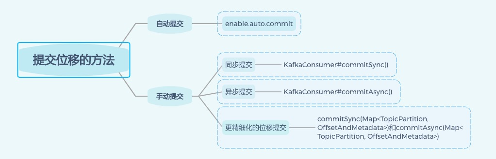

# 1.单机测试环境

kafka官网下载地址：[https://kafka.apache.org/downloads](https://kafka.apache.org/downloads)

zookeeper下载地址：[https://archive.apache.org/dist/zookeeper/](https://archive.apache.org/dist/zookeeper/)

## 1.1.window

**①**首先保证java环境和zookeeper环境能搭建成功，然后先启动zookeer

```bash
## 进入到zookeeper的安装目录的bin文件夹下执行
zkServer.cmd
```


**②**下载解压kafka的压缩包，修改config目录下的server.properties，详细配置信息在[配置文件](#2.3.配置文件)一栏，这边只需要修改下log.dirs的信息为指定的文件夹地址即可。然后进入kafka的安装目录（kafka专门有提供一个window的bat执行命令目录），执行命令：

```bash
## 启动kafka的broker
.\bin\windows\kafka-server-start.bat .\config\server.properties 
```


**③**创建kafka主题topic，进入kafka安装目录/bin/window/，执行命令：

```bash
## 参数的含义
## --create, 表示创建主题
## --zookeeper, 表示zk连接地址
## --replication-factor, 表示副本个数, 单机启动最大只能为1
## --partitions, 表示分片个数
## --topic, 指定主题名称
kafka-topics.bat --create --zookeeper localhost:2181 --replication-factor 1 --partitions 1 --topic demo 
```


**④**创建kafka生产者producer，进入kafka安装目录/bin/window，执行命令：

```bash
## 绑定上面的topic
kafka-console-producer.bat --broker-list localhost:9092 --topic demo 
```

**⑤**创建kafka消费者consumer，进入kafka安装目录/bin/window，执行命令：

```bash
## 订阅上面的topic
kafka-console-consumer.bat --bootstrap-server localhost:9092 --topic demo
```

## 1.2.linux

.....

# 2.集群线上环境

kafka安装不到不同操作系统上的区别是相当大的，kafka源代码是由`Scala`和`Java`语言编写，编译之后就是类文件`.class`。虽然`Java`是跨平台的，但是考虑操作系统与kafka的适配性，主要是从3个方面考虑：

- I/O模型的使用
- 数据网络的传输效率
- 社区支持度

主流的 I/O 模型通常有 5 种类型：阻塞式 I/O、非阻塞式 I/O、I/O 多路复用、信号驱动 I/O 和异步 I/O。kafka客户端底层使用了`Java`的`Selector`，它在Linux上的实现机制是epoll，但是在window平台上的实现机制是select。如果从这一点考虑，**kafka部署在linux上能获取更高效的I/O性能**。

kafka生产和消费的消息都是通过网络传输，最终将消息落地磁盘，因此kafka需要在磁盘和网络之间进行大量的数据传输。而在Linux中，使用的是零拷贝技术，避免内核态和用户态数据的拷贝。但是window平台必须等到java 8的60更新版本才有零拷贝。如果从这一点考虑，**在 Linux 部署 Kafka 能够享受到零拷贝技术所带来的快速数据传输特性。**

最后是社区的支持度，目前社区对window平台发现的kafka bug不做任何承诺，kafka环境的活跃性高。**因此，Windows 平台上部署 Kafka 只适合于个人测试或用于功能验证，千万不要应用于生产环境。**

## 2.1.集群参数配置

### 2.1.1.Broker级别

①Broker 是需要配置存储信息的，需要配置 Broker 使用哪些磁盘

- `log.dirs`： 指定了Broker需要使用的若干个文件目录路径（没有默认值，必须指定），更重要的是在线上生产环境一定要配置多个路径，用逗号隔开，诸如：/home/kafka1,/home/kafka2。建议是将这些目录挂载到不同的物理磁盘上，这样做有两个好处：提升读写性能、实现故障转移，即Failover。

②Zookeeper在kafka中负责协调管理并保存 Kafka 集群的所有元数据信息，比如集群都有哪些 Broker 在运行、创建了哪些 Topic，每个 Topic 都有多少分区以及这些分区的 Leader 副本都在哪些机器上等信息

- `zookeeper.connect`：指定zookeeper连接地址，用逗号隔开，诸如：zk1:2181,zk2:2181...，如果多个kafka集群使用同一套Zookeeper集群，可以使用zookeeper中的chroot，它的作用类似别名，例如目前有两套kafka集群，kafka1和kafka2，那么两套集群的zookeeper配置可以这样指定:

  - zk1:2181,zk2:2181,zk3:2181/kafka1
  - zk1:2181,zk2:2181,zk3:2181/kafka2

  chroot 只需要写一次，而且是加到最后的。像这种方式的配置都是错的：zk1:2181/kafka1,zk2:2181/kafka2,zk3:2181/kafka3

③与 Broker 连接相关的，即客户端程序或其他 Broker 如何与该 Broker 进行通信的设置

- `listeners`，监听器，指定外部连接者要通过什么协议访问指定主机名和端口开放的kafka服务。

- `advertised.listeners`：和` listeners `相比多了个 advertised，表示监听器是 Broker 用于对外发布的（主要是为外网访问用的。如果clients在内网环境访问Kafka不需要配置这个参数）

  监听器的配置是若干个逗号分隔的三元组，每个三元组的格式为：`<协议名称，主机名，端口号>`，协议名称可以是标准的名字，也可以是自定义的协议名称，例如：CONN: //localhost:9092。但是，如果自己定义了协议名称，必须指定`listener.security.protocol.map`参数告诉这个协议底层使用了哪种安全协议，比如`listener.security.protocol.map=CONN:PLAINTEXT表示CONN`这个自定义协议底层使用明文不加密传输数据。

  三元组中的主机名配置，可以用IP地址也可以用主机名，但是**最好全部使用主机名，即 Broker 端和 Client 端应用配置中全部填写主机名。** Broker 源代码中也使用的是主机名，如果在某些地方使用了 IP 地址进行连接，可能会发生无法连接的问题

④关于 Topic 管理

- `auto.create.topics.enable`：是否允许自动创建 Topic。建议false

- `unclean.leader.election.enable`：是否允许 Unclean Leader 选举。建议false

- `auto.leader.rebalance.enable`：是否允许定期进行 Leader 选举。建议false

  `auto.create.topics.enable`参数建议最好设置成 false，即不允许自动创建 Topic。线上环境里面有很多名字稀奇古怪的 Topic，大概都是因为该参数被设置成了 true 的缘故

  `unclean.leader.election.enable`是关闭 Unclean Leader 选举的，Unclean的意思是：一个partition多有个副本，其中一个leader副本和若干个follower副本，当leader副本宕机后，根据和这个配置来决定是否要重新选举leader副本。为false，就是不允许，这样的后果就是该partition不可用；为true，允许follower副本出来选举，这样的后果是数据有可能丢失（follower副本数据本来就不全）

  `auto.leader.rebalance.enable`，设为 true 表示允许 Kafka 定期地对一些 partition进行 Leader 重选举，并不是选leader，而是换leader，比如 Leader A 一直表现得很好，但若`auto.leader.rebalance.enable=true`，那么有可能一段时间后 Leader A 就要被强行卸任换成 Leader B。

④数据留存方面

- `log.retention.{hour|minutes|ms}`：这是个“三兄弟”，都是控制一条消息数据被保存多长时间。从优先级上来说 ms 设置最高、minutes 次之、hour 最低。

- `log.retention.bytes`：指定 Broker 为消息保存的总磁盘容量大小。

- `message.max.bytes`：控制 Broker 能够接收的最大消息大小。

  通常情况下设置 hour 级别的多一些，比如`log.retention.hour=168`表示默认保存 7 天的数据，自动删除 7 天前的数据

  `log.retention.bytes`，这个值默认是 -1，表明这台 Broker 上保存多少数据都可以。

  `message.max.bytes`，默认的 1000012 太少了，还不到 1MB，线上环境可以配置一个比较大的值，允许Broker能够处理的最大消息大小

### 2.1.2.Topic级别

同时设置了 Topic 级别参数和全局 Broker 参数，Topic 级别参数会覆盖全局 Broker 参数的值，每个 Topic 都能设置自己的参数值。

①保存消息方面

- `retention.ms`：规定了该 Topic 消息被保存的时长。默认是 7 天，即该 Topic 只保存最近 7 天的消息。一旦设置了这个值，它会覆盖掉 Broker 端的全局参数值。

- `retention.bytes`：规定了要为该 Topic 预留多大的磁盘空间。和全局参数作用相似，这个值通常在多租户的 Kafka 集群中会有用武之地。当前默认值是 -1，表示可以无限使用磁盘空间。

  通过kafka自带的命令`kafka-configs`来修改 Topic 级别参数

  ```shell
  bin/kafka-configs.sh--zookeeperlocalhost:2181--entity-typetopics--entity-nametransaction--alter--add-configmax.message.bytes=10485760
  ```

### 2.1.3.JVM参数

- `KAFKA_HEAP_OPTS`：指定堆大小。

- `KAFKA_JVM_PERFORMANCE_OPTS`：指定 GC 参数。

  比如可以这样启动 Kafka Broker，即在启动 Kafka Broker 之前，先设置上这两个环境变量：

  ```bash
  $> export KAFKA_HEAP_OPTS=--Xms6g  --Xmx6g
  $> export  KAFKA_JVM_PERFORMANCE_OPTS= -server -XX:+UseG1GC -XX:MaxGCPauseMillis=20 -XX:InitiatingHeapOccupancyPercent=35 -XX:+ExplicitGCInvokesConcurrent -Djava.awt.headless=true
  $> bin/kafka-server-start.sh config/server.properties
  ```

### 2.1.4.操作系统参数

通常情况下，Kafka 并不需要设置太多的 OS 参数，但有些因素最好还是关注一下，比如：

- 文件描述符限制
- 文件系统类型
- Swappiness
- 提交时间

`ulimit -n`，配置文件描述符，通常情况下将它设置成一个超大的值是合理的做法，比如`ulimit -n 1000000`，如果不设置的话可能会经常遇到“Too many open files”的错误。

文件系统类型的选择。这里所说的文件系统指的是如 ext3、ext4 或 XFS 这样的日志型文件系统，XFS 的性能要强于 ext4，所以生产环境最好还是使用 XFS。

将 swap 设置为0完全禁掉，以防止 Kafka 进程使用 swap 空间。一旦设置成 0，当物理内存耗尽时，操作系统会触发 OOM killer 这个组件，它会随机挑选一个进程然后 kill 掉，即根本不给用户任何的预警；但是，如果设置成一个比较小的值，当kafka开始使用 swap 空间时，至少能够观测到 Broker 性能开始出现急剧下降，从而给出进一步调优和诊断问题的时间。建议将 swappniess 配置成一个接近 0 但不为 0 的值，比如 1。

向 Kafka 发送数据并不是真要等数据被写入磁盘才会认为成功，而是只要数据被写入到操作系统的页缓存（Page Cache）上就可以了，随后操作系统根据 LRU 算法会定期将页缓存上的数据落盘到物理磁盘上。这个定期就是由提交时间来确定的，默认是 5 秒。

# 3.Producer

producer的其它属性设置，官方文档内容：[https://kafka.apache.org/documentation/#producerconfigs](https://kafka.apache.org/documentation/#producerconfigs)

## 3.1.消息压缩

在 Kafka 中，消息压缩可能发生在两个地方：生产者端和 Broker 端，然后消费者端自己解压消息，总体就是：**Producer 端压缩、Broker 端保持、Consumer 端解压缩**。生产者程序中配置 compression.type 参数即表示启用指定类型的压缩算法：

```java
Properties props = new Properties();
props.put("bootstrap.servers", "localhost:9092");
props.put("acks", "all");
props.put("key.serializer", "org.apache.kafka.common.serialization.StringSerializer");
props.put("value.serializer", "org.apache.kafka.common.serialization.StringSerializer");
// 开启 GZIP 压缩
props.put("compression.type", "gzip");

Producer<String, String> producer = new KafkaProducer<>(props);
```

这样 Producer 启动后生产的每个消息集合都是经 GZIP 压缩过的，能很好地节省网络传输带宽以及 Kafka Broker 端的磁盘占用，因为大部分情况下，broker端都是原封不动的把消息保存起来。但是有两种情况，broker端会重新压缩消息：

- Broker 端指定了和 Producer 端不同的压缩算法。broker收到消息后先用producer的压缩算法解压，再按照它自己的压缩算法配置再压缩，最后保存
- Broker 端发生了消息格式转换，所谓的消息格式转换主要是为了兼容老版本的消费者程序。为了兼容老版本的格式，Broker 端会对新版本消息执行向老版本格式的转换。这个过程中会涉及消息的解压缩和重新压缩。这种情况对broker性能影响很大，因为丧失了zero-copy功能

**压缩算法的选择：**

评价一个压缩算法的优劣，有两个重要的指标：

- 压缩比，原先占 100 份空间的东西经压缩之后变成了占 20 份空间，那么压缩比就是 5，压缩比越高越好；
- 压缩 / 解压缩吞吐量，比如每秒能压缩或解压缩多少 MB 的数据，吞吐量越高越好

各个压缩算法比较，仅供参考。zstd 算法有着最高的压缩比，LZ4 算法有着最大的吞吐量。


**什么时候启用压缩：**

根据自身的实际情况有针对性地启用合适的压缩算法

- Producer 程序运行机器上的 CPU 资源要很充足，只有CPU资源很充足，才能资源去进行压缩。如果原本CPU已经消耗殆尽，此时再启动消息压缩，会加重CPU资源的消耗，影响正常的功能。
- 如果网络环境中带宽资源有限，最好还是开启压缩，可以减少带宽

## *.其它配置

- acks

用来指定分区中必须有多少个副本收到这条消息，之后生产者才会认为这条消息写入成功。注意：acks的设置是字符串而不是整数。

| 取值    | 作用                                                         |
| ------- | ------------------------------------------------------------ |
| acks=0  | 生产者在写入消息之前不会等待任何来自服务器的响应，如果消息发送过程中出现问题了，生产者是无法感知到，意味着消息可能丢失，但换来的是高吞吐量 |
| acks=1  | 默认值，只要集群的首领节点收到消息，生产者就会收到一个来自服务器的成果响应，如果消息无法达到首领节点（比如首领节点崩溃，新首领还未被选举出来），生字者就会收到一个错误响应，为了避免消息丢失，生产者会重发消息。但是如果写成功通知了，但此时首领节点还没来得及将数据同步到follower节点就宕机了，还是会造成消息丢失 |
| acks=-1 | 只有当说是有参与复制的节点都收到消息后，生产者才会收到一个来自服务器的成功响应，这种模式是最安全的但吞吐量最低，它保证不止一个服务器收到消息 |

- retries

设置生产者在消息发送失败的情况下的重试次数。默认情况下，生产者会在每次重试之间等待100ms，也可以通过`retries.backoff.ms`参数来修改这个时间间隔！

- batch.size

当有 消息要被发送同一个分区时，生产者会把它们放在同一个批次里。该参数指定了一个批次可以使用的内存大小，**按照字节数计算，而不是消息的个数**。当批次被填满，批次里的所有消息就会被发送出去。不过生产者并不一定都会等到批次被填满才发哦是哪个，半满的批次，甚至只包含一个消息的批次都有可能被发送。所以就算把`batch.size`设置得很大，也不会造成延迟，只会占用更多的内存而已，如果设置的太小，生产者就会以为频繁发送消息而增加一些额外的开销

- max.request.size

该参数用于控制生产者发送的请求大小，它可以指定能发送的单个消息的最大值，也可以指定单个请求所有消息的总大小。`broker`对可接受的消息最大值也有自己的限制（`message.max.size`），所以两边配置最好匹配，防止生产者发送的消息被broker拒绝

- metadata.max.age.ms

配置Producer定时去更新Broker的元数据，默认值是 300000，即 5 分钟，Producer 每 5 分钟都会强制刷新一次元数据以保证它是最及时的数据

- connections.max.idle.ms

配置Producer与Broker的TCP连接的最大空闲时间，默认为9分钟。如果在 9 分钟内，Producer和Broker之间的TCP没有数据流经过，那么Kafka会主动关闭该连接。设置成 -1，TCP 连接将成为永久长连接（但是TCP协议自己有keepalive，还是会受到keepalive的作用）


# 4.Consumer

consumer的其它属性配置，官方文档内容：[https://kafka.apache.org/documentation/#consumerconfigs](https://kafka.apache.org/documentation/#consumerconfigs)

## 4.1.消费组

- 消费组管理

  ```shell
  ./kafka-consumer-groups.sh --bootstrap-server localhost:9092 --list
  ```

- 查看消费组详情

  ```shell
  ./kafka-consumer-groups.sh --bootstrap-server localhost:9092 --describe --group <group_id>
  ```

- 查看消费组当前的状态

  ```shell
  ./kafka-consumer-groups.sh --bootstrap-server localhost:9092 --describe --group <group_id> --state
  ```

- 消费组内成员信息

  ```shell
  ./kafka-consumer-groups.sh --bootstrap-server localhost:9092 --describe --group <group_id> --members
  ```

- 删除消费组，如果有消费者在使用则会失败

  ```shell
  ./kafka-consumer-groups.sh --bootstrap-server localhost:9092 --delete --group <group_id>
  ```

- 重置消费组的消费位移，前提是没有消费者在消费

  ```shell
  ./kafka-consumer-groups.sh --bootstrap-server localhost:9092 --group <group_id> --all-topics --reset-offsets --to-earliest --execute
  ```

  参数：--all-topics指定了所有主题，可以修改为--topics，指定单个主题

## 4.2.消息接收

### 4.2.1.位移提交



对于kafka而言，它的每条消息都有唯一的offset，表示消息在分区中的位置。当消息从broker返回消费者时，broker并不会跟踪消息是否被消费者消费到，而是让消费者自身来管理消费的位移，并向消费者提供更新位移的接口，这种更新位移的方式成为提交(commit)，注意kafka只保证消息在一个分区的顺序性

- 自动提交
- 同步提交
- 异步提交

大佬有一个模板，是结合同步和异步提交的优点。对于常规性、阶段性的手动提交，调用 commitAsync() 避免程序阻塞，而在 Consumer 要关闭前，调用 commitSync() 方法执行同步阻塞式的位移提交，以确保 Consumer 关闭前能够保存正确的位移数据。将两者结合后，既实现了异步无阻塞式的位移管理，也确保了 Consumer 位移的正确性

```java
try {
    while (true) {
        ConsumerRecords<String, String> records = 
            consumer.poll(Duration.ofSeconds(1));
        process(records); // 处理消息
        commitAysnc(); // 使用异步提交规避阻塞
    }
} catch (Exception e) {
    handle(e); // 处理异常
} finally {
    try {
        consumer.commitSync(); // 最后一次提交使用同步阻塞式提交
    } finally {
        consumer.close();
    }
}
```

### 4.2.2.指定位移

。。。待定

### 4.2.3.CommitFailedException

CommitFailedException，是kafka consumer端发生的异常，就是 Consumer 客户端在提交位移时出现了错误或异常，而且还是那种不可恢复的严重异常。从源代码方面来说，CommitFailedException 异常通常发生在**手动提交位移**时，即用户显式调用 KafkaConsumer.commitSync() 方法时。从使用场景来说，有两种典型的场景可能遭遇该异常

**场景一：**

当消息处理的总时间超过预设的 `max.poll.interval.ms` 参数值时，Kafka Consumer 端会抛出 CommitFailedException 异常。重现此异常很简单，设置Consumer 端参数`max.poll.interval.ms=5 `，然后循环调用 KafkaConsumer.poll ()，每次睡眠6s

```java
Properties props = new Properties();
props.put("max.poll.interval.ms", 5000);
consumer.subscribe(Arrays.asList("test-topic"));

while (true) {
    ConsumerRecords<String, String> records = 
        consumer.poll(Duration.ofSeconds(1));
    Thread.sleep(6000L);
    consumer.commitSync();
}
```

解决方式：

①缩短单条消息的处理时间；

②增加``max.poll.interval.ms``最大时长，在最新版的 Kafka 中，该参数的默认值是 5 分钟；

③减少一次性消费的消息总数，即Consumer 端参数`max.poll.records`，该参数的默认值是 500 条，表明调用一次 KafkaConsumer.poll 方法，最多返回 500 条消息；

④开启多线程加速消费；

**场景二：**

Kafka Java Consumer 端还提供了一个名为 Standalone Consumer 的独立消费者。它没有消费者组的概念，但是独立消费者也要指定 group.id 参数才能提交位移。如果应用中同时出现了设置相同 group.id 值的Consumer Group和 Standalone Consumer，那么当 Standalone Consumer程序手动提交位移时，Kafka 就会立即抛出 CommitFailedException 异常。因为 Kafka 无法识别这个具有相同 group.id 的消费者实例，于是就向它返回一个错误，表明它不是消费者组内合法的成员

## \*.*.其它配置

- fetch.min.bytes

允许消费者指定从broker读取消息时最小的数据量。当消费者从broker读取消息时，若数据量小于这个阈值，broker会等待直到有足够的数据，然后才返回给消费者。对于写入量不高的主题来说，这个参数可以减少broker和消费者的压力，因为减少了网络传输的消耗。而对于有大量消费者的topic来说，则可以明显减轻broker压力

- fetch.max.wait.ms

指定了消费者读取时最长等待时间，从而避免长时间阻塞，该参数默认为500ms

- max.partition.fetch.bytes

指定每个分区返回的最多字节数，默认为1M。也就是说，kafkaConsumer.poll()返回记录列表时，每个分区的记录字节数最多为1M。如果一个主题有20个分区，同时有5个消费者，那么每个消费者需要4M的空间来处理消息

- max.poll.records

控制 poll()调用返回的记录数，这个可以用来控制应用在拉取循环中的处理数据量。

# 5.Topic

topic配置，官方文档内容：[https://kafka.apache.org/documentation/#topicconfigs](https://kafka.apache.org/documentation/#topicconfigs)

## 5.1.创建主题

```powershell
bin/kafka-topic.sh --zookeeper localhost:2181 --create --topic sym_demo --partition 2 --replication-factor 1
```

- --zookeeper，设置zookeeper所在的地址，为必传参数，多个zookeeper用“,"分开
- --partition，由于设置主题分区数
- replication-factor，设置主题副本数，每个副本分布在不同节点，不

## 5.2.查看主题

```powershell
## 查看所有主题
bin/kafka-topics.sh --list --zookeeper localhost:2181
```

```powershell
## 查看特定主题
bin/kafka-topics.sh --describe --zookeeper localhost:2181 --topic sym_demo
```

## 5.3.修改主题

```powershell
## 修改配置
bin/kafka-topics.sh --alter --zookeeper localhost:2181 --topic sym_demo --config flush.message=1
```

- --alter表示修改命令
- --topic指定主题
- --config，后面跟着要修改的配置项，以key:value的形式

```powershell
## 删除配置
bin/kafka-topics.sh --alter --zookeeper localhost:2181 --topic sym_demo --delete-config flush.message
```

- --delete-config，表示删除配置

## 5.4.删除主题

删除主题受到kafka配置影响：

- 若delete.topic.enable=true，直接彻底删除该topic
- 若delete.topic.enable=false，分为两种情况
  - 如果当前topic没有使用过即没有传输过消息，可以彻底删除；
  - 如果当前topic使用过即传输过消息，并没有真正删除topic，只是将它标记为删除(marked for deletion)，重启kafka server后删除

```powershell
bin/kafka-topics.sh --delete --zookeeper localhost:2181 --topic sym_demo
```

## 5.5.增加分区

kafka只能增加分区，不能减少分区

```powershell
bin/kafka-topics.sh --alter --zookeeper localhost:2181 --topic sym_demo --partition 3
```

