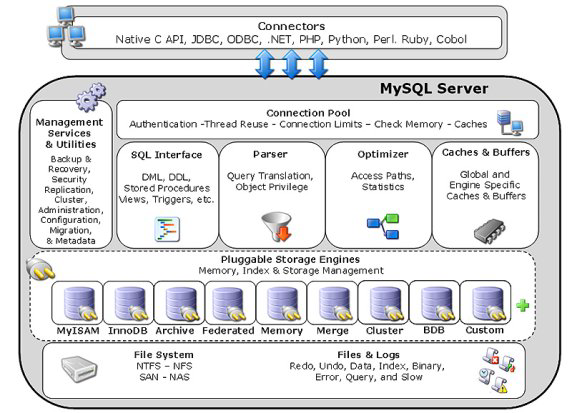
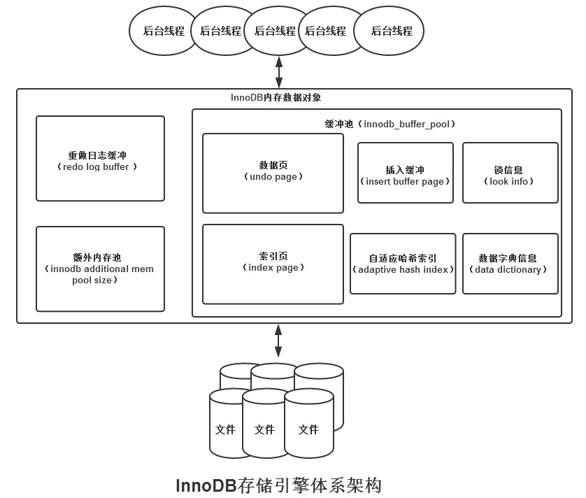
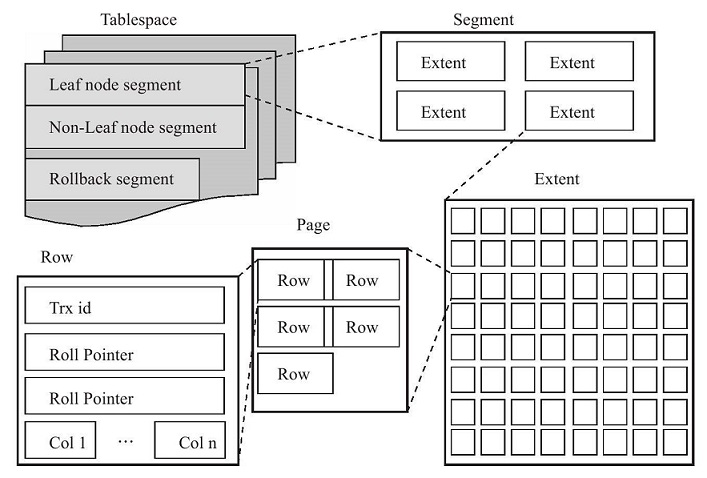
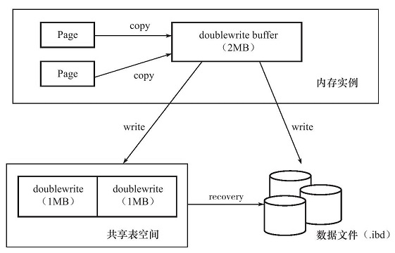
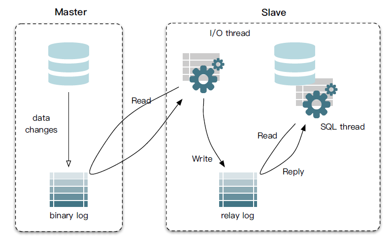

# 1.MySQL概述

## 1.1.体系结构

如下图，按照从上到下，从左到右的顺序，MySQL的结构大体上分为：

- 连接池组件
- 管理服务和工具组件
- SQL接口组件
- 查询分析器组件
- 优化器组件
- 缓冲组件
- 插件式存储引擎
- 物理文件



其中，比较突出的就是MySQL的可拔插存储引擎，是底层物理存储的实现。需要注意的是，**MySQL的存储引擎是基于表的，而不是基于数据库的**。除了常用的`InnoDB`外，还有这些常见的MySQL存储引擎：

- MyISAM：不支持事务，采用表锁设计，支持全文索引
- NDB：集群存储引擎，数据放置于内存中，可提供更高的可用性
- Memory：表中数据存放在内存中，采用哈希索引，适用于临时数据的临时表
- Archive：只支持insert和select操作，使用存储归档数据，提供高速的插入和压缩功能
- Federated：不存放数据，指向一台远程MySQL数据库服务器上的表
- Maria：支持缓存数据和索引文件，行锁设计，提供MVCC更，支持事务

## 1.2.执行SQL流程

1. 执行器先找引擎取ID=2这一行。ID是主键，引擎直接用B+树搜索找到这一行。如果ID=2这一行所在的数据页本来就在内存中，就直接返回给执行器；否则，需要先从磁盘读入内存，然后再返回。
2. 执行器拿到引擎给的行数据，把这个值加上1，比如原来是N，现在就是N+1，得到新的一行数据，再调用引擎接口写入这行新数据。
3. 引擎将这行新数据更新到内存中，同时将这个更新操作记录到redo log里面，此时redo log处于prepare状态。然后告知执行器执行完成了，随时可以提交事务。
4. 执行器生成这个操作的binlog，并把binlog写入磁盘。
5. 执行器调用引擎的提交事务接口，引擎把刚刚写入的redo log改成提交（commit）状态，更新完成。

# 2.InnoDB存储引擎

## 2.1.体系结构

InnoDB存储引擎是MySQL在5.5.8版本之后默认使用的，特点是：支持事务，行锁设计，支持外键。InnoDB通过使用多版本并发控制（MVCC）获得高并发性，并且实现了SQL标准的4种隔离级别，默认为REPEATABLE级别。



### 2.1.1.后台线程

InnoDB有多个后台线程，负责处理不同的任务，大致上分为：

- **Master Thread**：将缓冲池的数据异步刷新到磁盘，包括脏页的刷新、合并插入缓冲、UNDO页的回收；
- **IO Thread**：InnoDB存储引擎使用AIO处理IO请求，IO Thread负责这些IO请求的回调处理
- **Purge Thread**：事务提交后，其undolog便失去作用，Purge Thread负责回收这些undo页；减轻Master Thread的工作
- **Page Cleaner Thread**：负责将脏页的刷新操作放入到单独的线程中，减轻Master Thread的工作

### 2.1.2.缓冲池

InnoDB会将数据存储到磁盘，并且按照页的方式管理这些数据。但是，由于磁盘速度的影响，通常系统设计会用内存作为CPU和磁盘之间的纽带，也就是缓冲区。从1.0x版本开始，InnoDB允许存在多个缓冲池实例，每个页根据哈希值平均分配到不同缓冲池实例中。

- 写操作，首先修改缓冲池的页，再通过Checkpoint机制刷回磁盘
- 读操作，优先读取缓冲池中的页，若页不存在再去读取磁盘，然后将页`FIX`到缓冲池中

**缓冲池中的LRU List、Free List、Flush List**

- LRU List

InnoDB缓冲池中页的大小默认为`16KB`，随着程序的运行，缓冲池中的页会越来越多，因此InnoDB基于传统LRU算法，加入midpoint位置来管理缓冲池的页，这个算法称为`midpoint insertion strategy`，作用是：在原有LRU基础上，最新访问的页并不是直接放入到列表首部，而是放到midpoint位置。例如：

```sql
SHOW VARIABLES like 'innodb_old_blocks_pct'
```

其默认值为37，表示新读取的页插入到**LRU列表尾端**的37%位置，midpoint之后的列表称为old列表，同理之前的列表称为new列表。new列表中的页都是最为活跃的热点数据页。InnoDB这样设计的一个原因是，有些SQL查询的时候使用其它非活跃数据的辅助（比如索引和数据的扫描），如果直接将这些非活跃数据放到LRU列表首部，那么很有可能把真正活跃的热点数据挤出去！！

- Free List

LRU List用来管理已读取的页，若数据刚启动，LRU List是为空的，页都存放在Free List中。当需要从缓冲池中分页时，先到Free List查找是否有可用的空闲页，若有则从Free List中删除，放入到LRU List中；否则从LRU List末尾删除页，将该内存空间分配给新读取的页，这一操作称为`page made young`

```sql
-- 通过此命令观察LRU List和Free List的状况
SHOW ENGINE INNODB STATUS
```

- Flush List

LRU List中的页被修改后，该页就会变为脏页，意味着缓冲池和磁盘的页数据产生了不一致。InnoDB的方案是通过Checkpoint机制将脏页刷回到磁盘，这些脏页是存放在Flush List中，不过要注意的是，脏页既存在于Flush List，它还仍存放在LRU List中

### 2.1.3.重做日志缓冲

重做日志缓冲，redo log buffer，InnoDB首先将重做日志信息先放入到这个缓冲，然后按照一定频率将其刷新到重做日志文件。一般情况下，每一秒钟会将重做日志缓冲刷新到磁盘中，用户只需要保证每秒产生的事务量在这个缓冲大小之内即可

```sql
-- 默认是8MB
SHOW VARIABLES LIKE 'innodb_log_buffer_size'
```

在下列三种情况下，会将重做日志缓冲中的内容刷新到磁盘中：

- Master Thread每秒将重做日志缓冲刷新到磁盘中的重做日志文件
- 每个事务提交时会将重做日志缓冲刷新重做日志文件
- 当重做日志缓冲池剩余空间小于1/2时，重做日志缓冲刷新到重做日志文件

### 2.1.4.Checkpoint技术

Checkpoint技术是用来解决缓冲池跟磁盘之间的数据一致性问题。InnoDB对数据页的操作，都是先操作缓冲池，这就会引发一个问题，也是在平常开发中遇到的缓存&数据库一致性问题。如果每次数据页发生变化，InnoDB就将新的数据页刷入到磁盘中，那开销很大；但是，数据页不及时刷入到磁盘中，如果数据库实例宕机，那么内存中的数据页就丢失了。

为了避免这一问题，大部分事务数据库系统普遍使用`Write Ahead Log`策略（即WAL）：当事务提交时，先写重做日志(redo log)，再修改缓冲池的数据页，这样即使数据库实例宕机，也可以通过重做日志来恢复数据，当然如果连写入日志都失败了，那么这个事务肯定就是属于执行失败的情况了。

不过InnoDB的Checkpoing发生的时间、条件还有脏页的选择，实际上肯定是更复杂的。需要明确一点，它只是负责将缓冲池中的脏页刷回到磁盘，包括每次刷新多少页到磁盘，每次从哪里取脏页，什么时间触发等等。大体上分为两种：

- Sharp Checkpoint：数据库关闭时将所有脏页刷新回磁盘，一般不会设置这个；
- Fuzzy Checkpoint：只刷新一部分脏页，它又分为多种情况，详细得要去翻书！～～

## 2.2.存储结构

所有数据都被逻辑存放到表空间（Tablespace）中，而一个表空间又可以分为段（Segment）、区（extent）、页（page），如下图所示：



### 2.2.1.表空间

默认配置，InnoDB存储引擎会使用一个共享表空间ibdata1，所有的表数据都会存放在这里。但如果用户启用了参数innodb_file_per_table，则每张表的数据都可以存放各自的表空间中。不过，每张表自己的表空间只存放数据、索引、插入缓冲Bitmap页。

### 2.2.2.段

表空间tablespace是由各个段segment组成，常见的段有：数据段、索引段、回滚段等。数据段为B+树的叶子节点，索引段位B+树的非叶子节点

### 2.2.3.区

每个段segment存在多个区extent，区是由连续的页组成的，每个区的大小固定为1MB，因为页的大小为16KB，所以一个区中一共会有64个连续的页。

### 2.2.4.页

页Page是InnoDB磁盘管理的最小单位，默认每个页的大小为16KB，常见的页类型有：

- 数据页，B-tree Node
- undo页，undo log page
- 系统页，system page
- 事务数据页，Transaction system page
- 插入缓冲位图页，Insert Buffer Bitmap
- 插入缓冲空闲列表页，Insert Buffer Free List
- 未压缩的二进制大对象页，Uncompressed BLOB Page
- 压缩的二进制大对象页，compressed BLOB Page

## 2.3.关键特性

### 2.3.1.插入缓冲

在MySQL5.5之前的版本中，由于只支持缓存insert操作，所以最初叫做`插入缓冲`，即`insert buffer`，只是后来的版本中支持了更多的操作类型缓存，才改叫`change buffer`。

在InnoDB中，主键是行唯一的标识符，行记录的插入顺序是按照主键递增的顺序进行插入的，即说明聚集索引（Primary Key）大部分是有序的，不需要磁盘随机读取其它页中的记录，InnoDB就可以完成新数据的insert操作，其速度比较快。

不过，如果主键是UUID这种随机数，或者表中还设计有非聚集的辅助索引（secondary index）比如用户表中，可能会对`name`这个字段进行模糊搜索，就会对`name`创建一个索引，这种索引就是非聚集的索引。这种情况新数据的插入，必须离散地访问非聚集索引页，由于随机读取而会导致插入性能下降。

基于这一考虑，InnoDB设计了insert buffer，即插入缓冲。对于非聚集索引的插入或更新操作，不是每一次直接插入到索引页中，而是先判断插入的非聚集索引页是否在缓冲池中，若在，则直接插入；若不在，则先放入到一个Insert Buffer对象中；然后再以一定的频率和情况进行Insert Buffer和辅助索引页子节点的merge（合并）操作，这时通常能将多个插入合并到一个操作中（因为在一个索引页中），这就大大提高了对于非聚集索引插入的性能！！Insert Buffer的使用需要同时满足以下两个条件：

- 索引是辅助索引（secondary index）
- 索引不是唯一（unique）的，唯一索引需要获取该页所有数据来加载判断是否存在

这个设计思路和HBase中的LSM树有相似之处，都是通过先在内存中修改，到达一定量后，再和磁盘中的数据合并，目的都是为了提高写性能，具体可参考《[HBase LSM树](https://zhuanlan.zhihu.com/p/135371171)》

### 2.3.2.两次写

doublewrite，两次写，是InnoDB保证数据页落地到磁盘中的解决方案。假设，InnoDB存储引擎正在将数据页从缓冲池中写入到磁盘，刚写入4KB的时候就发生宕机，这种情况被称为部分写失效（partial page write）这是没办法通过重做日志（redo）进行恢复的，因为redo log要先对磁盘上的页进行读取，而现在是这个页已经损坏了。

为了解决这个问题，InnoDB存储引擎开发了doublewrite功能，它的结构为：

- 处在内存中的doublewrite buffer，大小2MB
- 处于物理磁盘上共享表空间中连续的128个页，即2个extent，大小2MB



解决方案是这样：

- 再对缓冲池的数据页进行刷新的时候，并不会直接写到磁盘上，而是先将数据页复制到doublewrite buffer，再通过doublewrite buffer分两次，每次1MB顺序地写入共享表空间的物理磁盘上。最后同步磁盘，避免缓冲写带来的问题
- 如果将数据页刷新到磁盘的过程中发生了崩溃，InnoDB先从共享表空间中的doublewrite找到改页的一个副本，将其复制到表空间文件，再应用重做日志

### 2.3.3.自适应哈希索引

InnoDB会监控表上各索引页的查询，根据访问的频率和模式来自动地为某些热点页建立哈希索引，这个就称为自适应哈希索引，Adaptive Hash Index，AHI。哈希索引只能用来搜索等值的查询，且要求查询的条件是一样的。

### 2.3.4.异步I/O

InnoDB采用异步IO（Asynchronous IO，AIO）的方式来处理磁盘操作，现版本InnoDB采用了内核级别的AIO，称为Native AIO，它需要底层操作系统提供支持。AIO除了可以快速处理多个IO请求外（Sync IO，同步IO必须在一个页扫描完以后再进行下一次扫描），还可以进行IO Merge，将多个IO合并为1个IO。

### 2.3.5.刷新邻接页

Flush Neighbor Page，刷新邻接页。当刷新一个脏页时，InnoDB存储引擎会检测该页所在区（extent）的所有页，如果是脏页，那么一起进行刷新

# 3.MySQL执行计划

回首MySQL架构，在第二层有一个Mysql Query Optimizer，是MySQL官方提供的查询优化器，它负责优化select语句，为客户端请求的SQL提供MySQL自己认为最优的执行计划；通过`explain`关键字，可以模拟优化器执行SQL查询语句，分析查询语句或表结构的性能瓶颈。它的语法很简单，直接在SQL前面加`explain`关键字即可

```sql
explain select * from  t_dept
```

**explain关键字字段描述：**

| 列名          | 描述                                                 |
| ------------- | ---------------------------------------------------- |
| id            | 与SELECT关键字对应                                   |
| select_type   | SELECT关键字对应的查询的类型                         |
| table         | 表名                                                 |
| partitions    | 匹配的分区信息                                       |
| type          | 单表的访问方式                                       |
| possible_keys | 可能会用到的索引                                     |
| key           | 实际使用的索引                                       |
| key_len       | 实际使用到的索引长度                                 |
| ref           | 使用索引列等值查询时，与索引列进行等值匹配的对象信息 |
| rows          | 预估计的需要读取的记录条数                           |
| filtered      | 单表经过搜索条件过滤后剩余记录条数的百分比           |
| Extra         | 一些额外的信息                                       |

# 6.主从复制

mysql集群的负载均衡，读写分离和高可用都是基于复制实现。它的复制机制分为：异步复制、半同步复制和并行复制。

- **异步复制**

  异步复制是mysql自带的最原始的复制方式，主库和备库成功建立起复制关系后，在备库上会有一个IO线程去主库拉取binlog，并将binlog写到本地，就是下图中的Relay log，然后备库会开启另外一个SQL线程去读取回放Relay log，通过这种方式达到Master-Slave数据同步的目的。

- **半同步复制**

  异步复制会产生主从延迟问题，半同步复制就是为了解决数据一致性而产生的。理解啥是半同步复制，可以先了解下同步复制：一个事务在Master和Slave都执行后，才返回给用户执行成功（其实就是2PC协议）；MySQL只实现了本地redo-log和binlog的2PC，Slave在接收到日志后就响应Master（数据还未执行），这种就称为半同步复制。目前实现半同步复制主要有两种模式，AFTER_SYNC模式和AFTER_COMMIT模式。两种方式的主要区别在于是否在存储引擎提交后等待Slave的ACK。

- **并行复制**

  半同步复制可以解决数据一致性的问题，但是性能变低了，Master产生binlog的速度远远大于Slave SQL线程消费的速度，照样产生主从延迟。所以需要让Slave并行复制，可以IO线程并行，也可以SQL线程并行。并行IO线程，可以将从Master拉取和写Relay log分为两个线程；并行SQL线程则可以根据需要做到库级并行，表级并行，事务级并行。库级并行在mysql官方版本5.6已经实现

  SQL并发复制需要保证事务有序进行。Slave必需保证回放的顺序与Master上事务执行顺序一致，因此只要做到顺序读取binlog，将不冲突的事务并发执行即可。对于库级并发而言，协调线程要保证执行同一个库的事务放在一个工作线程串行执行；对于表级并发而言，协调线程要保证同一个表的事务串行执行；对于事务级而言，则是保证操作同一行的事务串行执行。

## 6.1.基本原理

slave（从机）会从master（主机）读取biglog进行数据同步，mysql复制过程分为3步：

1. master将改变记录到二进制日志（binary log），这些记录称为二进制日志事件

2. slave将master的binary log拷贝到它的中继日志relay log

3. slave重做中继日志中的事件，将改变应用到自己的数据库中



## 6.2.基本配置

一主一从常见配置，以window下的MySQL为主机，配置文件为my.ini；以Linux下的MySQL为从机，配置文件为my.cnf ，准备工作为：

- 主机和从机的Mysql版本要一致

- 主机和从机都配置在相应配置文件的`[mysqld]`结点下，都是小写

- 主机和从机相互ping通

### 6.2.1.配置

- master

  ```ini
  # 指定服务器唯一id, 范围[1,32], 必须配置
  server_id=1 
  
  # 开启bin-log功能
  log_bin=mysql-log-bin
  
  # 选择 ROW 模式
  binlog_format=ROW 
  
  # 指定要同步的数据库, 建议加上(如果省略，默认操作整个mysql)
  binlog_do_db=sym_test
  
  #指定不要同步的数据库，如果指定了binlog-do-db就不用再指定该项
  #binlog_ignore_db=mysql
  
  #是否只读，主机读写都可以
  read-only=0
  ```

- slave

  ```ini
  从机是放在linux系统下，所以配置文件是my.cnf
  
  # 指定服务器唯一id, 范围[1,32], 必须配置
  server_id=2
  
  # 开启中继日志
  relay_log=relay-log  
  
  # 指定要同步的数据库
  replicate_do_db=sym_test
  
  #指定不要同步的数据库
  #replicate_ignore_db=mysql  
  
  #是否只读，从机一般只读
  read-only=1
  ```

### 6.2.2.启动

- master

  ```sql
  -- 为从库生成账户: salve/slave123
  grant replication slave on *.* to 'slave'@'127.0.0.1' identified by 'slave123' ;
  
  -- 刷新权限
  flush privileges;
  
  -- 查看权限
  select * from mysql.user;
  
  -- 查看binlog记录，后面从库需要根据这个配置开启复制
  show master status;
  ```

  1. 主从配置文件改过以后，都重启后台mysql服务;

  2. 主从都关闭防火墙；（window手动关闭，linux用命令：service iptables stop）

  3. 主机上建立账户并授权slave

     grant replication slave on *.* to【账户名】@【从机IP】 identified by '密码';

     (从机如果很多，可以直接用”%”替代，表示任意ip)，如：

     ```sql
     grant replication slave on *.* to 'zhangsan'@ '192.168.1.1' identified by '123';
     ```

  4. 查询master状态，记录File和position的值

     ```sql
     show master status;
     ```


- slave

  1. 从机重新启动后需要连接到主机上，通过执行sql：

  ```sql
  change master to master_host='主机ip',master_port='主机端口',
  master_user='主机授权的用户名',master_password='密码',
  master_log_file='mysqlbin.具体数字',
  master_log_pos=具体值;
  ```

    (需要参照上面的第3、第4步) 如：

  ```sql
  change master to master_host='127.0.0.1',master_port=3308,
  master_user='slave',master_password='slave123', 
  master_log_file='mysql-log-bin.000035',
  master_log_pos=341;
  ```

  2、启动从机Mysql上的复制功能

   ```sql
   start slave;
   ```

  3、查询从机状态，

  ```sql
  show slave status;
  ```

    如果下面2个参数值都为yes，则说明配置正确：

  ```tex
  slave_io_running:yes
  slave_sql_running:yes
  ```

### 6.2.3.停止

在从机mysql上执行sql：

```sql
stop slave;
```