# 1.【索引基础】

索引，index，是一种排好序的，能够实现快速查找的数据结构。索引的出现，可以提高数据的查询效率。mysql支持常见的索引有：B+树索引、全文索引和哈希索引。其中InnoDB存储引擎会根据表的使用情况自动为表生成哈希索引，不能人为干预。而常说的索引就是指B+树索引。

注意：B+树索引并不能找到给定一个键值的具体行，而是查找数据行所在的数据页。然后数据库通过把页读入到内存，再在内存中进行查找，最后得到要查找的数据。


mysql中的B+树索引分为聚集索引（clustered index）和辅助索引（secondary index），两种索引的实现，都是叶子节点存放着数据，只不过聚集索引存放整张表的行记录数据，而辅助索引保存索引字段值和主键id值


## 1.1.实现

实现索引的方式有很多种，统称为`索引模型`。常见的有：哈希索引、有序数组和搜索树，后续也有加入了跳表、LSM树等数据结构。

- 哈希索引：只适用于等值查询的场景
- 有序数组：适用于等值查询和范围查询，但是涉及增删改时，需要移动大量元素，所以仅仅适合静态存储
- 搜索树：比较常用的索引模型，大部分都是多叉树，例如 B 树和 B+树

B 树，索引和数据同存储在各个节点上，MongoDB便使用 B 树作为索引


B+树，相较于 B 树，B+树的数据只存储在叶子节点上，并且它的叶子节点之间存在一个引用。mysql 底层就是使用 B+树索引


## 1.2.分类

索引可以按照不同的角度来分类：

- 以结构来划分：
  - 单值索引：一个索引只包含一个列，一个表可以有多个单值索引
  - 复合索引：一个索引包含多个列
  - 唯一索引：索引列的值必须唯一，允许有空值

# 2.【索引类型】

在InnoDB中，表都是根据主键顺序以索引的形式存放的，这种存储方式的表称为索引组织表，每一个索引在InnoDB里面对应一棵B+树，所以数据都是存储在B+树中的。索引类型分为主键索引和非主键索引。

- 主键索引的叶子节点存的是整行数据。在InnoDB里，主键索引也被称为聚簇索引（clustered index）
- 非主键索引的叶子节点内容是主键的值。在InnoDB里，非主键索引也被称为二级索引（secondary index）

所以，如果按照主键来查询，直接扫描主键索引所在的B+树即可，但是如果按照非主键来查询，就需要先查询二级索引所在的B+树，得到主键值后，再来查询主键索引所在的B+数，这一过程称为**回表**。即基于非主键索引的查询需要多扫描一棵索引树。所以为什么说select后面的字段如果是索引，即覆盖索引操作，速度会很快？原因就是InnoDB直接在索引上分析读取，少了回表操作。

## 2.1.覆盖索引

如果 select 查询的字段就是索引，那么称这种操作为覆盖索引。覆盖索引可以减少树的搜索次数（减少回表次数），显著提高查询效率

## 2.2.索引下推

假设创建了一个索引，包含两个字段（name, age），执行下面的 SQL：

```sql
select * from user where name like '张%' and age=10 and ismale=1;
```

由于我们创建了一个联合索引（name,age）而且where 的查询条件第一个就是 name，可以匹配到我们创建的索引；在MySQL 5.6之前，通过索引（name,age）匹配到`张`后找出行的主键 ID，然后开始一个个回表，到主键索引上找出数据行，再对比字段值`age`，过滤出等于 10 的行记录。而MySQL 5.6 引入的索引下推优化（index condition pushdown)， 可以在索引遍历过程中，对索引中包含的字段先做判断，直接过滤掉不满足条件的记录，减少回表次数。

# 3.【执行计划】

MySQL架构在第二层有一个Mysql Query Optimizer，是MySQL官方提供的查询优化器，它负责优化select语句，为客户端请求的SQL提供MySQL自己认为最优的执行计划；**通过explain关键字，可以模拟优化器执行SQL查询语句，分析查询语句或表结构的性能瓶颈**。它的语法很简单，直接在SQL前面加`explain`关键字即可

```sql
explain select * from  t_dept
```

**explain关键字字段描述：**

| 列名          | 描述                                                 |
| ------------- | ---------------------------------------------------- |
| id            | 与SELECT关键字对应                                   |
| select_type   | SELECT关键字对应的查询的类型                         |
| table         | 表名                                                 |
| partitions    | 匹配的分区信息                                       |
| type          | 单表的访问方式                                       |
| possible_keys | 可能会用到的索引                                     |
| key           | 实际使用的索引                                       |
| key_len       | 实际使用到的索引长度                                 |
| ref           | 使用索引列等值查询时，与索引列进行等值匹配的对象信息 |
| rows          | 预估计的需要读取的记录条数                           |
| filtered      | 单表经过搜索条件过滤后剩余记录条数的百分比           |
| Extra         | 一些额外的信息                                       |

## 3.1.id

id是select识别符，也是select查询的序列号，包含一组数字用来表示查询中执行select子句或操作表的**顺序**！规则如下：

- **id相同，执行顺序从上到下**

  

  上例的执行顺序便是：t1，t3，t2。虽然例子中sql语句的`from`后面的表顺序是：t1，t2，t3，但是mysql并不会按照这种顺序去执行，它通过查询优化器分析以后，认为t1，t3，t2的执行顺序更优良，从sql语句的角度分析，where条件最后的and是跟表t1有关，因此mysql会优先查询表t1的数据

- **id 值不同，id 值越大优先级越高，如果是子查询，id 值会递增然后优先执行**

  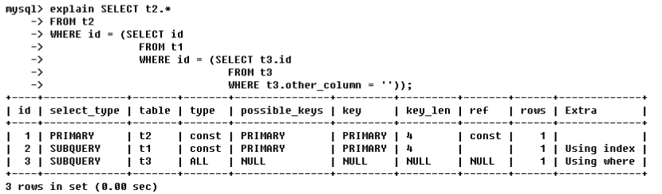

  若explain分析得到的结果，id的值各不相同，那么值越大的，越先执行。因此上例的执行顺序是：t3，t1，t2。从sql语句来看，查询表t2需要先查询表t1，而查询表t1又需要先查询表t3，或者这样子看，有括号的先查询，t2是在最外面，因此它最晚查，t1在里面，t3在最里面，所以t3最早查

- **id值既有相同的又有不同的**

  

  sql语句`select t2.* from (...) s1`，from后面不是跟着表名而是跟着一个子查询，意思是把这个子查询的结果当做一个虚表，为这个虚表命名为s1，然后再从s1中查找数据，虚表有一个官方称呼—**衍生表**（derived是衍生的意思，即sql语句中的s1，表示衍生表。derived2中的2，表示这个衍生表是由id=2执行的那个表(即t3)衍生出来的）若分析后的结果，id的取值有相同的也有不同，像上例的1，1，2。这时候，相同id的为一组，按照从上往下的顺序执行；不同组间，id值大的优先级高，先执行。例如1，1为一组，2单独为一组；然后看id的值，id=2的值大，因此它先被执行，然后执行1，1这组，由于这一组id的值相同，因此是按从上往下的顺序执行，总的顺序是： t3，\<derived2>，t2。从sql语句来看，先执行括号里面的即先执行t3，t3执行完以后衍生出一个虚表s1，然后再执行这个虚表和t2，所以才会得到：t3，\<derived2>，t2的执行顺序


## 3.2.select_type,table

- table：指明这一行的数据是关于哪张表；

- select_type：指明数据查询时的操作类型，主要是用于区别普通查询、联合查询、子查询等复杂查询，有6种取值：

  - simple：简单的select查询，查询中不包含子查询或者Union；

  - primary：查询中若包含任何复杂的子查询，最外层查询则被标记为primary；

  - subquery：在select或where列表中包含了子查询；

  - derived：在from列表中包含的子查询被标记为derived（衍生）mysql会递归执行这些子查询，把结果放在临时表里；

  - union：若第二个select在Union之后，则被标记为union；若union包含在from子句的子查询中，外层select被标记为derived；

  - union result：从union表获取结果的select。

## 3.3.type

type指访问类型排列，表示SQL语句的查询效率，常用的取值有：`ALL、index、range、ref、eq_ref、const、system、null`。性能从最好到最坏依次是：`null > system > const > eq_ref > ref > range > index > all`。一般来说，得保证查询至少达到range级别，最好能达到ref级别~~

- system：表明表里面仅有一条记录(相当于系统表)，是const的特例，平常几乎遇不到，因此可以忽略

- const：表明表最多只有一条匹配行，表示通过索引一次就找到数据，常用于主键或unique索引，因为只匹配一行数据，所以很快

  

  当在查询`select * from t1 where id=1`时，由于是用主键来查询的，主键值是唯一的，所以表中有且仅有一条数据与之匹配，这时候mysql就能将该查询转为一个常量，则type=const，将查询后的结果当成衍生表d1，由于查询结果只有一个，所以d1只有一条记录相当于系统表，此时查询，type便为system类型

- eq_ref：多表联接唯一性索引扫描，对于前表的每个索引键，后表只有一条记录与之匹配，常见于主键或唯一索引扫描，eq_ref可用于使用`=`比较带索引的列

  

  比如，t1是员工表，t2是部门表，t2的主键id是t1的外键。 id值若相同，按从上往下的顺序查询，因此先查询部门表t2，对t2的查询方式是全表扫描，找到t2所有的部门id，然后对员工表t1查询，找出与前表(t2表)找到的id匹配的员工，当此时t1只有一条记录时，type的值便是eq_ref。换句话说，当找的部门是研发部，会有多条记录，因为研发的员工有多个，当找的是总裁部时，仅有一条记录.

- ref：区别于eq_ref，因为ref是非唯一性索引扫描，它返回匹配某个索引值的所有行，它可以找到多个符合条件的行

  

  当没有建索引去查询col1='ac'的表数据，type的类型为all，只能是全表扫描。当建立了索引：create index idx_col1_col2 on t1(col1,col2)，再去查询col1='ac'的数据，mysql用索引去查找，且col1字段并不是表t1的主键，没有唯一性，查出来的数据会有多条，此时的type的类型就是ref

- range：只检索给定范围的行，使用一个索引来选择行，一般就是where语句出现了`between、<、>、in`等查询。这种范围扫描索引比全表扫描好，因为它只需要开始于索引的某一点，结束于另一点，不用扫描全表

  

- index： index与all区别在于index类型只遍历索引树。这通常比all快，因为索引文件通常比数据文件小，虽然all和index都是读全表，但是Index是从索引中读取的，而all是从硬盘读取的。id是表t1的主键，所以select id就是直接从索引里面遍历：

  

- all：会遍历全表找到匹配行，不使用索引，就只能全表扫描

## 3.4.possible_keys,key

- possible_keys：表明执行SQL时理论上需要用到的索引列表，若查询涉及到的字段上存在索引，则该索引被列出，但不一定实际使用
- key：表明实际使用的索引，如果为null则没有使用索引。但是，如果 select 的是覆盖索引列，那么该索引仅会出现在key列表中，possaible_key会显示null

## 3.5.key_len

key_len：表示索引中使用到的字节数，通过该列计算出查询时使用的索引长度，查询条件越多，用的key_len就会越大，得出的结果就会越精确。不过在查询结果一样的前提下，key_len越小越好。

## 3.6.ref

ref，表示哪些列或常量被用于查找索引列上的值，如果使用的是常数等值查询，ref会显示const；如果是连接查询，ref会显示驱动表的关联字段；如果使用表达式或者函数，或条件列发生了内部隐式转换，ref可能显示为func


id值相同，执行顺序由上至下，此条SQL的表查询顺序是t1，t3，t2。

- 查询t1时，ref=const即常量，结合sql语句t1.othe_column=''是匹配一个空字符串来查询数据，空字符串就是一个常量

- 查询t3时，ref=test.t1.ID，用的列是test数据库的t1表的ID列，结合sql语句...and t1.id = t3.id，以t1表为驱动表，来查找t3表中符合条件的数据

- 查询t2时，ref=test.t1.ID，意思也是用test数据库的t1表的ID列，因为查询t2的sql语句为 where t1.id = t2.id，跟查询t3表的语句时一样的

## 3.7.rows

rows，根据表统计信息及索引选用情况，大致估算出找到所需记录要读取的行数

## 3.8.extra

extra，包含不适合在列中显示但十分重要的额外信息。最重要的3个取值： using filesort、using temporary 、using index

- **using filesort**

  说明这条sql不是按照表内的索引顺序排序，而是用了一个外部的索引排序，Mysql中无法利用索引完成的排序操作称为"文件排序"，即filesoft。一般表现在带有order by等排序关键字的sql语句上，出现using filesort表示性能不好 

- **using temporary**

  出现using temporary，则Mysql要赶紧优化，性能极其不好。它表明MySQL在对查询结果排序时使用了临时表，常见于排序order by和分组查询group by

- **using index**

  using index的出现，表示效率不错，是良好的表现。它表示相应的select操作中使用了覆盖索引，避免访问了表的数据行，若同时出现using where，表明索引被用来执行索引键值的查找；若没有同时出现using where，表明索引用来读取数据而非查找动作

# 4.【排序原理】

当SQL出现`order by`关键词，就会执行mysql的排序操作。但是，并不是只要出现`order by`就会让mysql执行排序，如果数据原本就是有序的，那么mysql只要按照`where`条件筛选出来，其返回值必定就是有序。

若原本数据就是无序的，mysql必须执行排序操作，它会给客户端线程分配一块内存用于排序，这块内存称为`sort_buffer`。如果排序要用到的数据量（即`order by`后面跟着的字段）小于`sort_buffer`的大小（由参数`sort_buffer_size`决定），那么mysql就可以仅在内存中完成排序（默认使用快速排序）；但如果排序要用到的数据量过大，已经超过`sort_buffer`的大小，那么mysql就会使用磁盘临时文件辅助排序（这一操作就涉及写磁盘，性能差，反馈在`explain`就是出现`using filesort`字样），它会将需要排序的数据分成12份，每一份单独排序后存在这些临时文件中。然后把这12个有序文件再合并成一个有序的大文件 — 归并排序

现在假设有一张表t：

```sql
CREATE TABLE `t` (
  `id` int(11) NOT NULL,
  `city` varchar(16) NOT NULL,
  `name` varchar(16) NOT NULL,
  `age` int(11) NOT NULL,
  `addr` varchar(128) DEFAULT NULL,
  PRIMARY KEY (`id`),
  KEY `city` (`city`)
) ENGINE=InnoDB;
```

执行如下的SQL，在设置不同的`sort_buffer_size`下，会让mysql选择不同排序算法：全字段排序和rowid排序

```sql
select city,name,age from t where city='杭州' order by name limit 1000;
```

## 4.1.全字段排序

全字段排序，是mysql优先选择的排序算法。它对原表的数据只读了一遍，就可以将内存`sort_buffer`中的数据返回。它的执行步骤为：

1. 初始化`sort_buffer`，确定放入name、city、age这三个字段；
2. 从`city索引`找到第一个满足`city='杭州'`条件的主键ID；
3. 到`主键索引`取出整行数据，取出name、city、age三个字段的值，存入sort_buffer；
4. 从`city索引`取下一个记录的主键ID；
5. 重复步骤`3、4`直到city的值不满足查询条件为止；
6. 对`sort_buffer`中的数据按照字段name做快速排序；
7. 根据排序结果取前1000行返回。

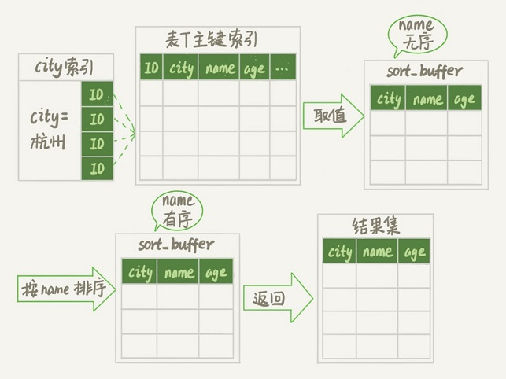

## 4.2.rowid排序

如果mysql认为排序的单行长度太大（即超过`max_length_for_sort_data`大小）它就会选择使用rowid排序算法，但是这个算法相较于全字段排序会多读原表的数据一遍（也就是两遍）正是因为如此，在内存足够的情况下，mysql一般不会选择此算法。

```sql
-- max_length_for_sort_data是MySQL中专门控制用于排序的行数据的长度的一个参数; 如果单行的长度超过这个值，MySQL就认为单行太
-- 大，而不会选择全字段排序
SET max_length_for_sort_data = 16;
```

它的执行步骤为：

1. 初始化`sort_buffer`，确定放入两个字段，即排序字段`name`和主键字段`id`；
2. 从`city索引`找到第一个满足`city='杭州'`条件的主键ID；
3. 到主键ID索引取出整行，取`name、id`两个字段，存入`sort_buffer`中；
4. 从`city索引`取下一个记录的主键ID；
5. 重复步骤3和4直到不满足`city='杭州'`条件为止；
6. 对`sort_buffer`中的数据按照字段`name`进行排序；
7. 遍历排序结果取前1000行，回表查询，取出`city、name、age`三个字段返回。

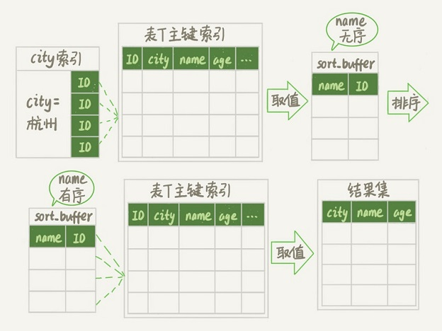

## 4.3.内存临时表排序

假设执行如下SQL：

```sql
-- 创建表t
CREATE TABLE `words` (
  `id` int(11) NOT NULL AUTO_INCREMENT,
  `word` varchar(64) DEFAULT NULL,
  PRIMARY KEY (`id`)
) ENGINE=InnoDB;

-- 插入10000条数据...
-- 省略..

-- 随机排序取word字段的前3个值
select word from t order by rand() limit 3;
```

对于内存表，回表过程只是简单地根据数据行的位置，直接访问内存得到数据，根本不会导致多访问磁盘，所以mysql优先选择rowid排序，其排序过程如：

1. 创建一个临时表。这个临时表使用的是memory引擎，表里有两个字段，第一个字段是double类型，记为字段R，用来存储生成的随机数；第二个字段是varchar(64)类型，记为字段W，用来存储word字段。并且这个表没有建索引；
2. 从表t中，按主键顺序取出所有的word值。对于每一个word值，调用rand()函数生成一个大于0小于1的随机小数，并把这个随机小数和word分别存入临时表的R和W字段中。到此扫描行数是10000，且临时表也有10000行数据，接着就对内存表按照字段R排序；
3. 初始化 sort_buffer，创建两个字段：一个是double类型，另一个是整型；从内存临时表中一行一行地取出R值和位置信息pos（可以理解为主键标识），分别存入sort_buffer中的两个字段里。这个过程要对内存临时表做全表扫描，此时扫描行数增加10000，变成了20000；
4. 在sort_buffer中根据R的值进行排序，这个过程没有涉及到表操作，所以不会增加扫描行数。排序完成后，取出前三个结果的位置信息，依次到内存临时表中取出word值，返回给客户端。这个过程中，访问了表的三行数据，总扫描行数变成了20003

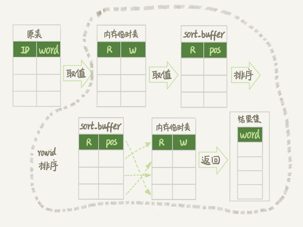

## 4.4.排序优化

- 通过对两种排序算法的分析，如果原先待排序的字段就是有序的，那么mysql只负责做数据匹配即可，没无需再次排序。

  ```sql
  -- 所以，如果针对这种排序
  select city,name,age from t where city='杭州' order by name limit 1000;
  
  -- 创建对city和name复合索引, 那么mysql就可以直接在索引列上筛选数据而不需要再做排序（因为索引数据本身就是有序的）
  alter table t add index city_user(city, name);
  ```

- 上面的优化，只是减少了排序，但是mysql还是会回表查询原表的数据，所以如果使用覆盖索引，那么mysql直接在索引列上做数据筛选，就可以将索引的数据直接返回，大大减少排序和回表时间

  ```sql
  alter table t add index city_user_age(city, name, age);
  ```

- 上面的这两种情况，要把语句中涉及的字段都建上联合索引，毕竟索引还是有维护代价的，所以这是一个需要权衡的决定！！！

# 11.【性能优化】

## *.1.何时需要索引？

- 需要索引的情况

  - 主键自动建立唯一索引

  - 频繁作为查询条件的字段

  - 查询与其他表关联的字段，外键关系建立索引

  - 查询中排序的字段，排序字段若通过索引去访问将大大提高效率

  - 查询中统计或者分组字段

- 不需要索引的情况
  - 经常增删改的表、频繁更新的字段（不仅要更新数据，还要维护索引树）
  - where条件里用不到的字段不创建索引
  - 表记录太小，Mysql据说可以撑到300W条
  - 某个数据列包含许多重复的内容，例如性别，都是男或者女，没必要建索引

## *.2.索引优化

### *.2.1.最佳左前缀法则

最佳左前缀法则：**如果索引了多列，查询条件要从索引的最左前列开始并且不跳过中间的列**。现在有一个学生表，该表的索引如下：

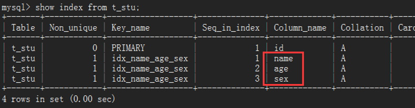

红框标注的索引列，从上往下的顺序是name->age->sex，where语句后的查询条件，name一定要存在，就像：


从explain解析出来的信息，可以看到type是ref而且key不为null，说明建立的索引有用到，但如果where后name没用到，不论后面怎么搞，索引也用不到，所以说，索引的最左前列在where后一定要体现，否则如下：

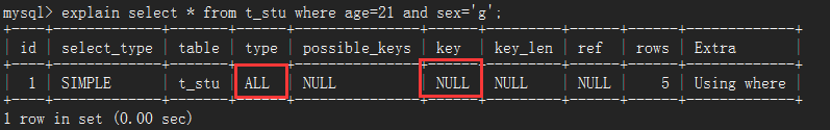

第二点，where语句后的查询条件，不要name='' and sex = ''，而把中间索引列age省略掉。当索引列都拿来做查询条件时，由type=ref知道肯定用了索引，从ref=const,const,const知道3个常量都拿去查询了

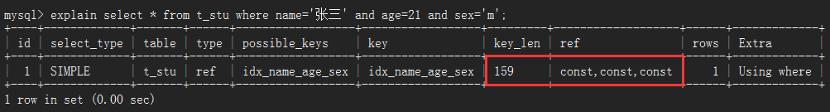

但是，如果中间去掉age的查询条件，由于带头大哥name在，所以肯定是会用到索引，但是从ref=const可得只用到了一个常量，后面那个常量根本用不到：


### *.2.2.索引列不加操作

不要在索引列上做任何操作（计算、函数、类型转换等），会导致索引失效。left(v,n)函数是Mysql自带的函数，意思是在指定的列v上，从左往右数起到n得到的值与给定的值相匹配的数据，可以看到查询的结果与...where name='张三'的结果是一样的


但是，由于在索引列上加了其他操作，导致索引失效，用explain分析后发现，mysql居然是用了全表扫描来查询数据，所以，索引列就直接拿去查询，不要做过多的修饰和包装


### *.2.3.范围条件后索引列失效

在where条件后，如果某列用了范围条件（如in，between，>，<等）则此列以后的索引列都会失效，mysql并不会再用索引去查询：

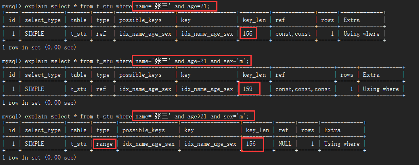

当等值查询name='张三' and age=21时，因为用了2个常量，key_len=156；全值查询name='张三' and age=21 and sex='m'，用了3个常量，key_len-=159；一旦在查询条件中，加了范围条件的查询，像name='张三' and age>21 and sex='m'，观察key_len=156，很明显可以知道跟2个条件等值查询一样，也就是说虽然sql语句用了3个条件来查询，但由于用了范围条件age>21导致sex='m'这个条件失效，所以在建立索引时候，要将可能用到范围查询的列放到最后

索引idx_name_age_sex的最后一列是sex，我们在sex列上用范围查询，可以看到key_len=159，跟3个条件等值查询用到的索引字节数一样：


### *.2.4.尽量避免select\*查询

尽量使用覆盖索引（查询列和索引列一样），减少select * 操作。我们把select *改成select name age后，对比一下，发现Extra列多了一个Using index，当出现using index表示系统性能更好，所以，当我们在查询的时候尽可能地保证查询的列能和索引列一样，这样Mysql直接从索引上取值，极大地加大性能：


### *.2.5.!=，<>会使索引失效

mysql在使用不等于（!=或者<>）的时候，无法使用索引导致全表扫描。备注：在mysql中，<>相当于!=，即不等于的意思；<=>相当于=，即等于的意思


由上图知道，使用了!=时，性能直接由ref级别下降到all级别。但是如果是唯一性索引，例如主键，就算用了!=，索引也可以使用，变为range类型：

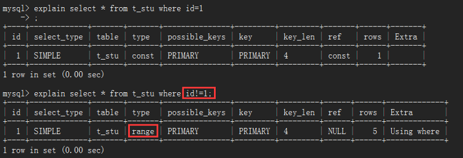

### *.2.6.is null或is not null索引失效

当查询条件是..is null或者.. is not null的时候，由下图可以看出出现两种情况：一种是极端type=null，一种是全表扫描type=all，尽量避免使用！


### *.2.7.模糊查询like

like以通配符开头（'%xxx...'）mysql索引失效会变成全表扫描的操作。即：'%java'、'%java%'都会失效，但是'java%'就不会失效：

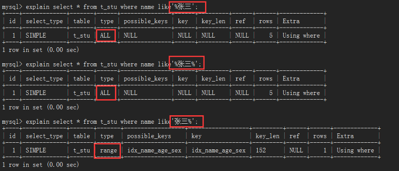

可是这样有个问题，条件'java%'和'%java%'查到的数据肯定是不一样的，而且在一般情况下，用'%java%'是最多的，咋保证既要双向模糊查询又不能让索引失效？答案是：覆盖索引，当查询的列与索引列一致，即使用like索引也不会失效：

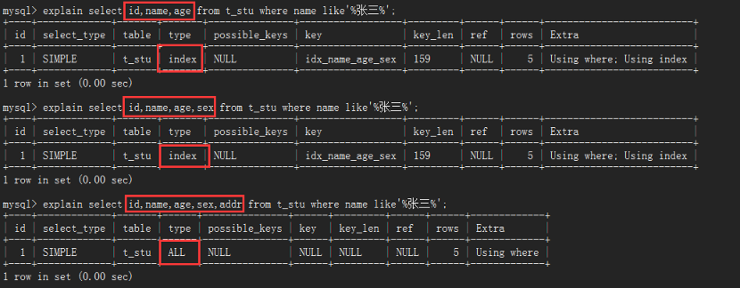

表中建立索引用的列是name、age、sex，还有主键列：id。可以发现，在select查询的列是这四列的任意组合时，type=index，虽不说很高效，但至少比全表扫描ALL好很多，一旦select查询的列是非索引列(如多了addr)可以看到，查询结果type=ALL，继续变成全表扫描。结论：**使用模糊查询like，尽量保证查询列与索引列一致，即覆盖索引**

### *.2.8.字符串不加引号使索引失效

当一个varchar类型的数据，查询时不使用引号，会发生隐式类型转换，导致索引失效，进而变成全表扫描，其实就是避免在索引列上加操作

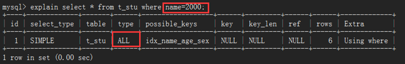

### *.2.9.尽量避免or条件查询

加了or条件的查询，会让索引失效，变成全表扫描


## *.3.小表驱动大表

优化原则：**永远保持小的数据集驱动大的数据集！**比如`in`和`exist`：

- `in`作用于子查询，它是将子查询的结果用于主查询的条件匹配，若子表数据集小于主表数据集，用`in`；
- `exist`作用于主查询，它是将主查询的数据放到子查询中做条件验证，根据验证结果(true或false)来决定主查询的数据结果是否得以保留，若子表数据集大于主表数据集，用`exist`

```sql
select * from A where id in(select id from B)
-- 等价于
select * from A where exists(select 1 from B where B.id=A.id)
```

## *.4.order by

MySQL支持2种方式的排序：文件排序`using filesort`和索引排序`using index`，出现`filesort`表示系统性能出现问题，所以要让MySQL使用index索引排序，需要满足下面情况的任意一种：

- 排序的列必须也是是索引列

- 索引最左列（上例中的a列）一定要体现

- 排序列要么同升序要么同降序

## *.5.group by

group by与order by大致一样，以下三种情况是group by独有的：

- group by实质是先排序后进行分组，遵循创建索引时的最佳左前缀法则

- 当无法使用索引列，在Mysql配置文件中增大max_length_for_sort_data参数和sort_buffer_size参数的值

- where高于having，能写在where限定的条件就不要去having限定了