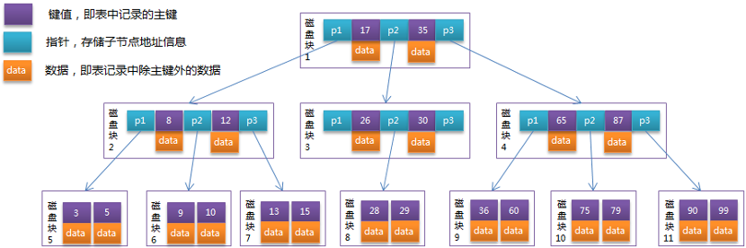
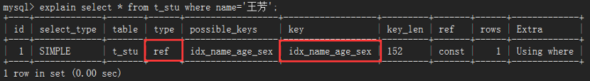
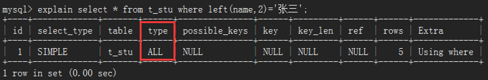
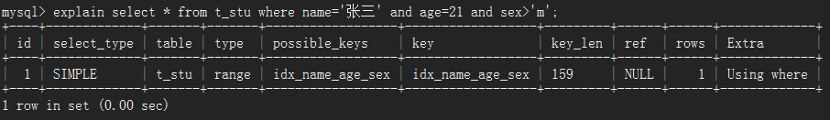
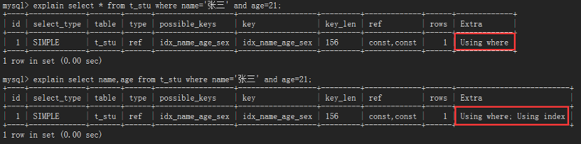
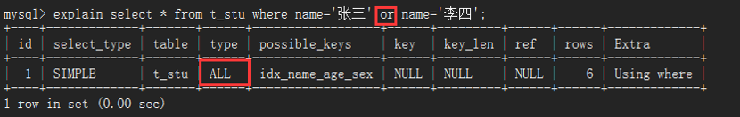

# 1.索引基础

## 1.1.概念

MySQL官方对索引的定义：索引（Index）是帮助Mysql高效获取数据的数据结构。请记住，索引是一种数据结构。是什么样的数据结构？排好序的快速查找数据结构即b+树，它的作用是排序和快速查找。

数据库常用的索引实现有：哈希索引、有序数组索引、树索引。最常用的树索引有`B树`和`B+树`：

B树：mongodb使用B树来做索引：

B+树：mysql用B+树来做索引

## 1.2.分类

索引可以按照不同的角度来分类：

- 以结构来划分：
  - 单值索引：一个索引只包含一个列，一个表可以有多个单值索引
  - 复合索引：一个索引包含多个列
  - 唯一索引：索引列的值必须唯一，允许有空值

# 2.InnoDB索引类型

在InnoDB中，表都是根据主键顺序以索引的形式存放的，这种存储方式的表称为索引组织表，每一个索引在InnoDB里面对应一棵B+树，索引类型分为主键索引和非主键索引。

- **主键索引的叶子节点存的是整行数据。在InnoDB里，主键索引也被称为聚簇索引**（clustered index）
- 非主键索引的叶子节点内容是主键的值。在InnoDB里，非主键索引也被称为二级索引（secondary index）

所以，如果按照主键来查询，直接扫描主键索引所在的B+树即可，但是如果按照非主键来查询，就需要先查询二级索引所在的B+树，得到主键值后，再来查询主键索引所在的B+数，这一过程称为**回表**。即基于非主键索引的查询需要多扫描一棵索引树。所以为什么说select后面的字段如果是索引，即覆盖索引操作，速度会很快？原因就是InnoDB直接在索引上分析读取，少了回表操作。

# *.索引实战

## *.1.何时需要索引？

- 需要索引的情况

  - 主键自动建立唯一索引

  - 频繁作为查询条件的字段

  - 查询与其他表关联的字段，外键关系建立索引

  - 查询中排序的字段，排序字段若通过索引去访问将大大提高效率

  - 查询中统计或者分组字段

- 不需要索引的情况
  - 经常增删改的表、频繁更新的字段（不仅要更新数据，还要维护索引树）
  - where条件里用不到的字段不创建索引
  - 表记录太小，Mysql据说可以撑到300W条
  - 某个数据列包含许多重复的内容，例如性别，都是男或者女，没必要建索引

## *.2.优化

### *.2.1.最佳左前缀法则

最佳左前缀法则：**如果索引了多列，查询条件要从索引的最左前列开始并且不跳过中间的列**。现在有一个学生表，该表的索引如下：

红框标注的索引列，从上往下的顺序是name->age->sex，where语句后的查询条件，name一定要存在，就像：

从explain解析出来的信息，可以看到type是ref而且key不为null，说明建立的索引有用到，但如果where后name没用到，不论后面怎么搞，索引也用不到，所以说，索引的最左前列在where后一定要体现，否则如下：

第二点，where语句后的查询条件，不要name='' and sex = ''，而把中间索引列age省略掉。当索引列都拿来做查询条件时，由type=ref知道肯定用了索引，从ref=const,const,const知道3个常量都拿去查询了

但是，如果中间去掉age的查询条件，由于带头大哥name在，所以肯定是会用到索引，但是从ref=const可得只用到了一个常量，后面那个常量根本用不到：

### *.2.2.索引列不加操作

不要在索引列上做任何操作（计算、函数、类型转换等），会导致索引失效。left(v,n)函数是Mysql自带的函数，意思是在指定的列v上，从左往右数起到n得到的值与给定的值相匹配的数据，可以看到查询的结果与...where name='张三'的结果是一样的

但是，由于在索引列上加了其他操作，导致索引失效，用explain分析后发现，mysql居然是用了全表扫描来查询数据，所以，索引列就直接拿去查询，不要做过多的修饰和包装

### *.2.3.范围条件后索引列失效

在where条件后，如果某列用了范围条件（如in，between，>，<等）则此列以后的索引列都会失效，mysql并不会再用索引去查询：

当等值查询name='张三' and age=21时，因为用了2个常量，key_len=156；全值查询name='张三' and age=21 and sex='m'，用了3个常量，key_len-=159；一旦在查询条件中，加了范围条件的查询，像name='张三' and age>21 and sex='m'，观察key_len=156，很明显可以知道跟2个条件等值查询一样，也就是说虽然sql语句用了3个条件来查询，但由于用了范围条件age>21导致sex='m'这个条件失效，所以在建立索引时候，要将可能用到范围查询的列放到最后

索引idx_name_age_sex的最后一列是sex，我们在sex列上用范围查询，可以看到key_len=159，跟3个条件等值查询用到的索引字节数一样：

### *.2.4.尽量避免select\*查询

尽量使用覆盖索引（查询列和索引列一样），减少select * 操作。我们把select *改成select name age后，对比一下，发现Extra列多了一个Using index，当出现using index表示系统性能更好，所以，当我们在查询的时候尽可能地保证查询的列能和索引列一样，这样Mysql直接从索引上取值，极大地加大性能：

### *.2.5.!=，<>会使索引失效

mysql在使用不等于（!=或者<>）的时候，无法使用索引导致全表扫描。备注：在mysql中，<>相当于!=，即不等于的意思；<=>相当于=，即等于的意思

由上图知道，使用了!=时，性能直接由ref级别下降到all级别。但是如果是唯一性索引，例如主键，就算用了!=，索引也可以使用，变为range类型：

### *.2.6.is null或is not null索引失效

当查询条件是..is null或者.. is not null的时候，由下图可以看出出现两种情况：一种是极端type=null，一种是全表扫描type=all，尽量避免使用！

### *.2.7.模糊查询like

like以通配符开头（'%xxx...'）mysql索引失效会变成全表扫描的操作。即：'%java'、'%java%'都会失效，但是'java%'就不会失效：

可是这样有个问题，条件'java%'和'%java%'查到的数据肯定是不一样的，而且在一般情况下，用'%java%'是最多的，咋保证既要双向模糊查询又不能让索引失效？答案是：覆盖索引，当查询的列与索引列一致，即使用like索引也不会失效：

表中建立索引用的列是name、age、sex，还有主键列：id。可以发现，在select查询的列是这四列的任意组合时，type=index，虽不说很高效，但至少比全表扫描ALL好很多，一旦select查询的列是非索引列(如多了addr)可以看到，查询结果type=ALL，继续变成全表扫描。结论：**使用模糊查询like，尽量保证查询列与索引列一致，即覆盖索引**

### *.2.8.字符串不加引号使索引失效

当一个varchar类型的数据，查询时不使用引号，会发生隐式类型转换，导致索引失效，进而变成全表扫描，其实就是避免在索引列上加操作

### *.2.9.尽量避免or条件查询

加了or条件的查询，会让索引失效，变成全表扫描

