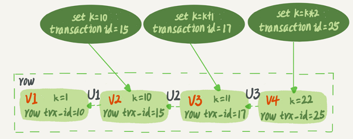
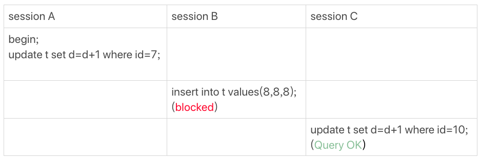
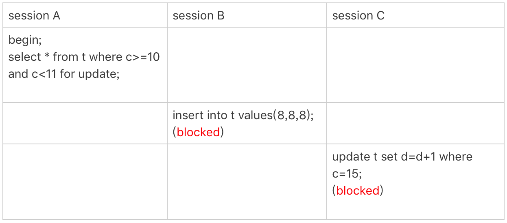

# 1.【MySQL事务基础】

## 1.1.事务概念

- **事务**：一组逻辑操作单元，使数据从一种状态变换到另一种状态；
- **事务处理(事务操作)**：当在一个事务执行多个操作时，要么所有的操作都被提交(commit)，则这些操作就永久地保存起来；要么数据库管理系统放弃所做的所有操作，整个事务回滚(rollback)到最初状态

在 mysql 中，可以使用命令`begin/start transaction`启动一个事务，但它并不是事务的起点，在执行到它们之后的第一个操作InnoDB表的语句，事务才真正启动；想要马上启动一个事务，可以使用`start transaction with consistent snapshot` 这个命令；或者设置了`autocommit=1`执行更新语句的时候会自动提交事务

## 1.2.ACID属性

事务具有以下4个属性，通常简称为事务的ACID属性：

- **原子性(**Atomicity)：事务是一个原子操作单元，其对数据的修改，要么全部  执行，要么全都不执行；
- **一致性**(Consistent)：在事务开始和完成时，数据都必须保持一致状态，所有数据规则都要应用于事务的修改，保持数据完整 ；
- **隔离性**(Isolation)：保证事务在不受外部并发操作影响的“独立”环境执行，  这意味事务处理过程中的中间状态对外部是不可见的，即  并发执行的各个事务之间是不能相互干扰的；
- **持久性**(Durable)：事务完成之后，它对于数据的修改是永久性的，即使出现  系统故障也能够保持。

## 1.3.事务并发处理 

### 1.3.1.并发问题

<table>
  <tr>
  	<th>问题</th>
    <th>描述</th>
  </tr>
  <tr>
  	<td width='20%'>更新丢失</td>
    <td>当两个或多个事务选择同一张表的同一行更新数据，由于每个事务不知道其他事务的存在，就会发生丢失更新问题—最后的更新覆盖其他事务所做的更新</td>
  </tr>
  <tr>
  	<td>脏读</td>
    <td>一个事务正在对一条记录做修改，在这个事务未commit之前，另一个事务也来读取同一条记录，这时第二个事务就有可能读取到这些"脏"数据，因为未提交之前，所做的数据修改可能是测试，也可能是错误的数据，这种现象叫做“脏读”</td>
  </tr>
  <tr>
  	<td>不可重复读</td>
    <td>一个事务范围内两个相同的查询却返回了不同数据，也就是说一个事务在读取某些数据后的某个时间（事务未完成），再次读取以前读过的数据，由于其它事务更新了该字段导致读出的数据已经发生了改变，或某些记录已经被删除了，这种现象就叫做"不可重复读"</td>
  </tr>
  <tr>
  	<td>幻读</td>
    <td>一个事务按相同的查询条件重新读取以前读取的数据，却发现其他事务插入了满足其查询条件的新数据，这种现象就称为“幻读”</td>
  </tr>
</table>
幻读和脏读有点类似：

- 脏读是事务B读取事务A修改中的数据
- 幻读是事务B读取事务A新增的数据
- 在可重复读隔离级别下，普通的查询是快照读，是不会看到别的事务插入的数据的。因此，幻读在“当前读”下才会出现

### 1.3.2.隔离级别

一个事务去其它事务隔离的程度就称为：隔离级别。数据库规定了多种事务隔离级别，不同隔离级别对应不同的干扰程度，隔离级别越高，数据一致性越好，但是并发性越弱。数据库提供4种事务隔离级别:

<table>
  <tr>
  	<th>隔离级别</th>
    <th>描述</th>
  </tr>
  <tr>
  	<td width='33%'>未提交读<br/>(Read cuncommited)</td>
    <td>一个事务还没提交时，它做的变更就能被其它事务看到。脏读、不可重复度和幻读都会发生</td>
  </tr>
  <tr>
  	<td>已提交读<br/>(Read commited)</td>
    <td>一个事务提交之后，它做的变更才会被其他事务看到，可以避免脏读，但无法解决不可重复读和幻读</td>
  </tr>
  <tr>
  	<td>可重复读<br/>(Repeatable read)</td>
    <td>确保事务可以多次从一个字段中读取相同的值，在这个事务持续期间，禁止其它事务对这个字段进行更新。可以避免脏读和不可重复读，但幻读仍然存在</td>
  </tr>
  <tr>
  	<td>串行化<br/>(Serializable)</td>
    <td>确保事务可以从一个表中读取相同的行，在这个事务持续期间，禁止其它事务对该表执行插入符。更新和删除操作，所有并发问题都可以避免，但性能十分低</td>
  </tr>
</table>
数据库的事务隔离越严格，并发副作用越小，但付出的代价也就越大，因为事务隔离实质上就是使事务在一定程度上“串行化”进行，显然与“并发”是矛盾的。mysql默认是可重复读级别，即解决了脏读和不可重复读。查看当前数据库的事务隔离级别：

```sql
show variables like 'tx_isolation';
```

# 2.【MySQL事务实现】

begin/start transaction 命令并不是一个事务的起点，在执行到它们之后的第一个操作InnoDB表的语句，事务才真正启动。如果你想要马上启动一个事务，可以使用start transaction with consistent snapshot 这个命令

## 2.1.一致性实现

MySQL实现事务一致性是通过 undo 日志和 redo 日志来实现的，当执行一条更新的 DML 语句时，MySQL的执行逻辑如下：

```sql
update user set c=c+1 where ID=2;
```


1. 执行器先请求存储引擎取ID=2这一行。ID是主键，存储引擎直接用索引树搜索找到这一行。如果ID=2这一行所在的数据页本来就在内存中，就直接返回给执行器；否则，需要先从磁盘读入内存，然后再返回；
2. 执行器拿到存储引擎返回的行数据，把这个值加上1，得到新的一行数据，再调用引擎接口写入这行新数据；
3. 引擎将这行新数据更新到内存中，同时将这个更新操作记录到redo log里面，此时redo log处于prepare状态。然后告知执行器执行完成了，随时可以提交事务；
4. 执行器生成这个操作的binlog，并把binlog写入磁盘；
5. 执行器调用引擎的提交事务接口，引擎把刚刚写入的redo log改成提交（commit）状态，更新完成

在 MySQL 没发生异常的情况下，更新 SQL 的流程就跟上面一样，mysql 只要保证 redo log 和 binlog 生成记录后，就可以安心地把数据保存到内存缓冲池的数据页中，而不需要每次执行 SQL 都落地到磁盘，可以保证 SQL 的执行效率。但是，一旦 mysql 在上面 5 个流程中如果宕机了，那么数据就可能丢失。为了防止这种异常，MySQL通过undo和redo日志来保证自己崩溃下数据一致性，这个功能称为**crash-safe**！崩溃恢复时的判断规则：

①如果redo log里面的事务是完整的，也就是已经有了commit标识，则直接提交；

②如果redo log里面的事务只有完整的prepare，则判断对应的事务binlog是否存在并完整，如果是，则提交事务；否则回滚事务。

- **时刻A**（刚在内存中更改完数据页，还没有开始写redo log的时候奔溃）

  因为内存中的脏页还没刷盘，也没有写redo log和binlog，即这个事务还没有开始提交，所以奔溃恢复跟该事务没有关系；

- **时刻B**（正在写redo log或者已经写完redo log并且落盘后，处于prepare状态，还没有开始写binlog的时候奔溃）

  恢复后会判断redo log的事务是不是完整的，如果不是则根据undo log回滚；如果是完整的并且是prepare状态，则进一步判断对应的事务binlog是不是完整的，如果不完整则一样根据undo log进行回滚；

- **时刻C**（正在写binlog或者已经写完binlog并且落盘了，还没有开始commit redo log的时候奔溃）

  恢复后会跟时刻B一样，先检查redo log中是完整并且处于prepare状态的事务，然后判断对应的事务binlog是不是完整的，如果不完整则一样根据undo log回滚，完整则重新commit redo log；

- **时刻D**（正在commit redo log或者事务已经提交完的时候，还没有反馈成功给客户端的时候奔溃）

  恢复后跟时刻C基本一样，都会对照redo log和binlog的事务完整性，来确认是回滚还是重新提交。

## 2.2.隔离性实现

InnoDB里面每个事务有一个唯一的事务ID，叫作`transaction id`，是在事务开始的时候向InnoDB的事务系统申请的，是按申请顺序严格递增的。不仅如此，InnoDB每行数据也都是有多个版本的，每次事务更新数据的时候，都会生成一个新的数据版本，并且把transaction id赋值给这个数据版本的事务ID，记为`row trx_id`。首先要记住这两个概念！！！！

其次呢，mysql 会在每条记录被更新的时候再保存一条回滚日志。一条记录上的当前值永远是最新的，不过可以通过回滚操作可以恢复到上一个` rox trx_id`操作的值。假设一个字段原先值为 1，被多个事务更新为 2、3、4，那么在回滚日志中就会有类似下图所示的记录。这种**同一条记录在系统中可以存在多个版本，就是数据库的多版本并发控制（MVCC）**同一行数据的4个版本，当前最新版本是V4，k的值是22，它是被`transaction id=25`的事务更新的，因此它的row trx_id也是25。下图的三个虚线箭头（U1、U2、U3）就是undo log；而旧版本V1、V2、V3并不是物理上真实存在的，而是每次需要的时候根据当前版本和undo log计算出来的。比如，需要V2的时候，通过V4依次执行U3、U2算出来。正是由于数据具有多版本的特性，使得 InnodDB可以实现”秒级创建快照“



在默认的可重复读隔离级别下，事务在启动的时候会对整个库拍个”快照“（实际就是MVCC要用到的一致性读视图即consistent read view）并规定：

- 一条记录的数据版本是在本事务启动之前生成的，那么它当前的值对本事务可见；
- 一条记录的数据版本是在本事务启动之后生成的，就必须要找上一个版本，假设上一个版本也不可见，就继续向前找...；
- 一条记录的数据版本是在本事务执行期间更新的，那么它当前的值对本事务可见；

那么问题就来了，事务是怎么知道某行记录的数据版本是本事务启动之前还是之后生成的呢？答案就是：事务的一致性视图（read-view） 。实际上，InnoDB为每个事务构造了一个数组，用来保存这个事务启动瞬间，当前启动了但还没提交的事务 ID。数组里面事务ID的最小值记为低水位，当前系统里面已经创建过的事务ID的最大值加1记为高水位。这个视图数组和高水位，就组成了当前事务的一致性视图（read-view）


这样，对于当前事务的启动瞬间来说，一个数据版本的row trx_id，有以下几种可能：

- 如果落在绿色部分，表示这个版本是已提交的事务或者是当前事务自己生成的，这个数据是可见的；
- 如果落在红色部分，表示这个版本是由将来启动的事务生成的，是肯定不可见的；
- 如果落在黄色部分，那就包括两种情况：
  - 若 row trx_id在数组中，表示这个版本是由还没提交的事务生成的，不可见；
  - 若 row trx_id不在数组中，表示这个版本是已经提交了的事务生成的，可见。

**举个例子**

| 事务A                                      | 事务 B                                     | 事务 C                         |
| ------------------------------------------ | ------------------------------------------ | ------------------------------ |
| start transaction with consistent snapshot |                                            |                                |
|                                            | start transaction with consistent snapshot |                                |
|                                            |                                            | update t set k=k+1 where id=1; |
|                                            | update t set k=k+1 where id=1;             |                                |
| select k from t where id=1;<br />commit;   |                                            |                                |
|                                            | commit;                                    |                                |

注意：`begin/start transaction `命令并不是一个事务的起点，在执行到它们之后的第一个操作InnoDB表的语句，事务才真正启动。如果想要马上启动一个事务，可以使用`start transaction with consistent snapshot `命令。表格的每一行表示一个时间点，按照从上到下的顺序时间流逝。假设有3个事务，事务 A 会比事务B 和事务 C 都更早的启动事务，然后 C 最早发起SQL更新。假设刚开始的时候 k 的值为 1。然后假设：

1. 事务A开始前，系统里面只有一个活跃事务ID是99；
2. 事务A、B、C的版本号分别是100、101、102，且当前系统里只有这四个事务；
3. 三个事务开始前(id=1, k=1）这一行数据的row trx_id是90。

这样，事务A的视图数组就是[99,100]，事务B的视图数组是[99,100,101]，事务C的视图数组是[99,100,101,102]。上图可得第一个有效更新是事务C，把数据从k=1改成了k=2，此时这行数据的最新版本的row trx_id是102，而90这个版本已经成为了历史版本。

第二个有效更新是事务B，把数据从k=2改成了k=3，此时这个数据的最新版本（即row trx_id）是101，而102又成为了历史版本。虽然事务B还没有提交，但是它生成的(id=1,k=3)这个版本已经变成当前版本了。

这时候，事务A开始读数据，它的视图数组是[99,100]。当然了，读数据都是从当前版本读起的。所以，事务A查询语句的读数据流程是这样的：

- 找到（id=1, k=3）的时候，判断出row trx_id=101，比高水位大，处于红色区域，不可见；
- 接着找到上一个历史版本，一看row trx_id=102，比高水位大，处于红色区域，不可见；
- 再往前找，终于找到了（id=1,k=1）它的row trx_id=90，比低水位小，处于绿色区域，可见。

这样执行下来，虽然期间这一行数据被修改过，但是事务A不论在什么时候查询，看到这行数据的结果都是一致的，所以称之为一致性读。但其实，还有一个问题：如果事务一旦涉及更新数据（select...for update也是当前读），**都是先读后写的，而这个读，只能读当前的值，称为“当前读”（current read）。**一旦两个事务对同一行数据执行当前读时，必定会加锁（就是行锁啦），只能等待另一个事务释放这个锁，才能继续它的当前读。下面这两个select语句，就是分别加了读锁（S锁，共享锁）和写锁（X锁，排他锁）。

```sql
select k from t where id=1 lock in share mode;
select k from t where id=1 for update;
```

# 3.【MySQL锁基础】

根据加锁的范围，MySQL里面的锁大致可以分成全局锁、表级锁、页面锁和行锁四类。全局锁是所有存储引擎都适用的，MyISAM存储引擎采用的是表级锁；BDB存储引擎采用的是页面锁，也支持表级锁；InnoDB存储引擎既支持行级锁，也支持表级锁，默认行锁。

- **全局锁**：对整个数据库实例加锁，命令是`Flush tables with read lock `(FTWRL)，当加了这个全局锁以后，其它线程的如下语句会被阻塞：数据更新语句（数据的增删改）、数据定义语句（包括建表、修改表结构等）和更新类事务的提交语句；一般用于全库备份；
- **表级锁**：开销小，加锁快；不会出现死锁；锁定粒度大，发生锁冲突的概率最高,并发度最低；
- **页面锁**：开销和加锁时间界于表锁和行锁之间；会出现死锁；锁定粒度界于表锁和行锁之间，并发度一般；
- **行级锁**：开销大，加锁慢；会出现死锁；锁定粒度最小，发生锁冲突的概率最低,并发度最高；

## 3.1.锁类别

### 3.1.1.表级锁

MySQL中的表级锁分为两种：表锁和元数据锁（meta data lock，简称 MDL）

- **表锁**

  表锁会将整张表锁起来，分为读锁和写锁，语法为：

  ```sql
  -- 为表t_applyobjects加读锁, 为表t_devices加写锁
  LOCK TABLES t_applyobjects READ, t_devices WRITE;
  
  -- 解锁
  UNLOCK TABLES;
  ```

  可以用`unlock tables`主动释放锁，也可以在客户端断开的时候自动释放。`lock tables`除了会限制别的线程的读写外，也限定了本线程接下来的操作对象。例如：

  - 如果 session1，对表 user 加了读锁，那么 session1 可以读表user，但不可以写表，还不可以读其它表；其它session可以读表 user，可以读写其它表，但是不可以写表 user；
  - 如果 session1，对表 user 加了写锁，那么 session1可以读写表t_user，但不可以读/写其它未加锁的表；其它 session 可以读写其它表，但不能读写表t_user；

  对支持行锁的 InnoDB 存储引擎来说，大部分情况下都不会使用表锁，因为锁住范围太大。通过SQL 查询MySQL 的表加锁情况：

  ```sql
  show open tables;
  ```

- **MDL**

  另一类表级锁就是元数据锁MDL，它不需要显式使用，在访问一个表的时候会被自动加上。在MySQL 5.5及以后版本，当对一个表做增删改查操作的时候，加MDL读锁；当要对表做结构变更操作的时候，加MDL写锁。注意：MDL会直到事务提交才释放，在做表结构变更的时候，一定要小心不要导致锁住线上查询和更新。

  - MDL读锁之间不互斥，可以有多个线程同时对一张表增删改查；
  - MDL读写锁之间、MDL写锁之间互斥，如果有两个线程要同时给一个表加字段，其中一个要等另一个执行完才能开始执行；

### 3.1.2.行锁

InnoDB有3种行锁的算法：

- Record Lock：单个行记录上的锁（即通常意义上讲的行锁）

- Gap Lock：间隙锁，锁定一个范围，但不包含记录本身

- Next-Key Lock∶Gap Lock+Record Lock，锁定一个范围，并且锁定记录本身（左开右闭）

mysql的行锁是由各个存储引擎实现，MyISAM不支持行锁，而InnoDB支持行锁。行锁，即数据表中行记录的锁，它的锁定粒度最小，发生锁冲突的概率最低，并发度最高；不过行锁开销大，容易出现死锁现象！行锁默认就是开启的，只要涉及数据行的修改，mysql自动就会对影响的行记录加行锁。也可以手动指定：

- 排它锁，语法：`for update`，例子：select * from t where id=1 for update;
- 共享锁，语法：`lock in share mode`，例子：select * from t where id=200 lock in share mode;

注意：**在InnoDB事务中，行锁是在需要的时候才加上的，但并不是不需要了就立刻释放，而是要等到事务commit时才释放**，啥意思？比如这样一个事务：

```sql
BEGIN;

-- sql 执行到这边, 就会对 id=1 这条记录加行锁, 但是不会对 id=2 这条记录加行锁.
UPDATE t set k=k+1 WHERE id=1;

-- 其它sql语句执行...仍然不会对 id=2 这条记录加行锁, 且 id=1 这个行锁还不会释放.
-- ...

-- 直至执行到这条 sql, 才会对 id=2 这条记录加行锁, 此时 id=1 这个行锁还没有释放.
UPDATE t set k=k+1 WHERE id=2;

-- 事务提交后, id=1 和 id=2 这两个行锁才会释放掉..
COMMIT;
```

所以在一个事务中，需要执行多条更新语句即锁多个行，要把最可能造成锁冲突、最可能影响并发度的锁尽量往后放，也就是把影响最大的更新语句放到事务的末尾去执行。这样可以保证这条行锁被过早地持有，导致其它事务都阻塞等待它。实际上，由于这个性质，行锁也容易导致死锁的出现！！！

### 3.1.3.间隙锁

仅当mysql的事务隔离级别为可重复读时，间隙锁才会生效。mysql行锁只能锁住已存在的行记录，这就导致了无法解决幻读问题，因为出现幻读的数据都是新插入的（事务已经开启，如果插入新数据，mysql是不会加锁的）即使给所有的行都加上行锁，也无法解决幻读问题。所以为了解决幻读的问题，InnoDB引入了新的锁，即间隙锁（Gap Lock） 锁的就是两个索引值之间的空隙！！！

```sql
-- 建表t
CREATE TABLE `t` (
  `id` int(11) NOT NULL,
  `c` int(11) DEFAULT NULL,
  `d` int(11) DEFAULT NULL,
  PRIMARY KEY (`id`),
  KEY `c` (`c`)
) ENGINE=InnoDB;
-- 初始化6条记录
insert into t values(0,0,0),(5,5,5),(10,10,10),(15,15,15),(20,20,20),(25,25,25);
```

间隙锁和行锁合称`next-key lock`，每个`next-key lock`是前开后闭区间（间隙锁是开区间）。如果表t初始化以后，用`select * from t for update`把整个表所有记录锁起来，就会形成7个`next-key lock`，分别是 (-∞,0]、(0,5]、(5,10]、(10,15]、(15,20]、(20, 25]、(25, +supremum]（InnoDB会给每个索引加一个不存在的最大值supremum）


不过要注意：**间隙锁之间互不排斥，但是往间隙锁中插入一条记录这个操作是互斥的**。举个例子，基于上表当开启两个Session执行如下SQL语句时就会发生锁冲突而造成行锁：


Session A先执行，但是表里没有`id=9`这条记录，所以加的不是行锁而是间隙锁；往后走一个时刻，session B开始执行，当前表还是没有`id=9`这条记录，所以session B还是加的间隙锁。也就是说session B是不会被堵住的，A、B加的间隙锁互不排斥，这两个间隙锁的目的就是防止其它线程插入值。

1. session A先执行，表t没有`id=9`这一行，所以会加上间隙锁(5,10]；
2. session B再执行，同样会加上间隙锁(5,10]，由于间隙锁之间不会冲突，这个语句可以执行成功；
3. session B尝试插入一条新数据(9,9,9)，被session A的间隙锁挡住了，进入阻塞等待状态；
4. session A尝试插入一条新数据(9,9,9)，同样会被session B的间隙锁挡住了，也进入阻塞等待状态，此时发生死锁！！

## 3.2.死锁检测

死锁：是指不同线程出现循环资源依赖，涉及的线程都在等待别的线程释放资源，就会导致这几个线程都进入无限等待的状态。由于行锁是仅在使用时才加锁，且事务结束才释放的性质，如果多个事务执行 SQL 的顺序不一样，就容易导致死锁的发生。MySQL出现死锁以后，有两种策略：

- 策略 1：直接进入等待，直到超时。该超时时间可以通过参数`innodb_lock_wait_timeout`来设置，默认值是50s；
- 策略 2：发起死锁检测，发现死锁后，主动回滚死锁链条中的某一个事务，让其它事务可以继续执行。将参数`innodb_deadlock_detect`设置为on，表示开启这个逻辑，默认这个参数就是开启的。

## 3.3.加锁规则&例子

mysql的加锁规则会随着版本更新而变化，这个加锁规则限于：5.x系列<=5.7.24，8.0系列 <=8.0.13，并且这个加锁规则只满足可重复读的隔离级别。首先要明确两个点：

1. <u>mysql行锁，要锁住的对象的索引，即索引树内数据库字段的值。因此没有索引的行锁, 就会退化成表锁；</u>

2. <u>当匹配到索引值b时，要让b的前驱索引值a和b的后继索引值c形成范围锁，即(a,b]、(b,c]</u>

分析InnoDB加锁时，就可以按照从上往下的顺序依次分析，得出最后加锁结果：

- **规则①**：加锁基本单位是next-key lock，按照where子句的查询值a扫描索引树。确定区间左侧为第一个不等于a的索引值；确定区间右侧根据索引类型区分 - 若是辅助索引，扫描到第一个不等于a的值；若是唯一索引，扫描到第一个等于或者不等于a的索引值（也就是可以到它自身）；
- **规则②**：等值查询时，若对唯一索引加锁，next-key lock退化成行锁；
- **规则③**：索引上的等值查询，向右遍历时且最后一个值不满足等值条件的时候，next-key lock退化成间隙锁；
- **规则④**：唯一索引上的范围查询会访问到，不满足条件的第一个值为止（有大牛说这是InnoDB的bug）

**实际案例**

```sql
-- 创建新表t, 对字段c加普通索引
CREATE TABLE `t` (
  `id` int(11) NOT NULL,
  `c` int(11) DEFAULT NULL,
  `d` int(11) DEFAULT NULL,
  PRIMARY KEY (`id`),
  KEY `c` (`c`)
) ENGINE=InnoDB;

-- 预先插入6条数据
insert into t values(0,0,0),(5,5,5),(10,10,10),(15,15,15),(20,20,20),(25,25,25);
```

### 3.3.1.等值查询间隙锁



按照[加锁规则](# 3.3.加锁规则)分析：

1. session A先执行，默认使用next-key lock加锁，参考表内当前存在的值，确定next-key lock加锁区间的左侧为(5,5,5)一行；又因为id是主键，属于唯一索引，所以向右扫描到第一个大于等于7的索引值，即(10,10,10)，所以得出加锁区间为：(5, 10] — 规则①
2. 由于id=7一行不存在，所以规则②不适配，但是它满足规则③，即最后一个值id=10不满足查询条件，所以next-key lock就会退化成间隙锁，变成(5,10) — 规则③
3. 最终加锁的区间：主键索引(5,10)。所以 session B插入id=8会被阻塞，而session C插入id=10不会被阻塞

### 3.3.2.非唯一索引等值锁


按照[加锁规则](# 3.3.加锁规则)分析：

1. session A先执行，由于字段c建立了普通索引，所以可以用next-key lock加锁（无索引变表锁）在索引树找到第一个不符合5的索引值，很明显就是`-∞`；由于是普通索引，所以会扫描到第一个不等于5的索引值，即(10,10,10)。因此确定加锁为(-∞,10] — 规则①
2. 索引树c不是唯一索引，因此规则②不适配它，但是规则③满足它，next-key lock的加锁区间为(-∞10]，最后一个扫描值为10不等于查询值5，所以退化成间隙锁：(-∞,10) — 规则③
3. 最终加锁的区间：索引c(-∞,10) 。这里注意：lock in share mode和for update的加锁程度不一样，遇到覆盖索引时，前一个只会对辅助索引加锁，而后一个会对主键索引加锁。因此这个间隙锁只是在索引c上加锁，对主键索引没加锁！

### 3.3.3.主键索引范围锁


按照[加锁规则](# 3.3.加锁规则)分析：

1. session A先执行，它是主键范围查询，默认使用next-key lock加锁。确定加锁区间的左侧为第一个不等于10的索引值即(5,5,5)，确定区间右侧为第一个等于或不等于10的的索引值，即它本身。初始加锁区间为(5,10]，但是id是唯一索引，所以符合规则③，退化成行锁，实际只加了id=10这一行的行锁
2. 然后开始范围查找，根据规则④，唯一索引上的范围查找会一直扫描到不符合sql匹配的索引值，很明显就是(15,15,15)这一行，因此需要加next-key lock(10,15]
3. 最终加锁区间，主键索引`id`-行锁id=10和next-key lock(10,15]。因此session B插入(8,8,8)就不会阻塞，但插入(13,13,13)就会被阻塞；同理session C由于更新的是主键id=15，所以必定被阻塞；

### 3.3.4.非唯一索引范围锁



按照[加锁规则](# 3.3.加锁规则)分析：

1. session A先执行，它是非唯一索引分为查询（区别于[主键索引范围锁](# 3.3.3.主键索引范围锁)），默认使用next-key lock加锁，因为第一个匹配条件是`c>=10`，所以确定加锁区间的左侧为第一个不等于10的索引值即(5,5,5)。然后开始范围查询，确定加锁区间的右侧为第一个不等于11的索引值，很明显就是(15,15,15)，所以实际加锁区间为：(5,15]

2. 这边扫描到c=15才停止扫描，是合理的，因为InnoDB要扫到c=15，才知道不需要继续往后找了

### 3.3.5.唯一索引范围锁bug


按照[加锁规则](# 3.3.加锁规则)分析：

1. session A是一个主键索引的范围查询，默认还是以next-lock key加锁，因为第一个范围查询条件是`id>10`，所以就不会给`id=10`这一行加行锁；接着第二个范围查询时`id<=15`，所以可以得到加锁区间为(10,15]。
2. 但实现上，InnoDB会往前扫描到第一个不满足条件的行为止，也就是id=20。而且由于这是个范围扫描，因此索引id上的(15,20]这个next-key lock也会被锁上
3. 最终加锁区间，主键索引(10,20]

### 3.3.6.非唯一索引上存在"等值"的例子

插入一条SQL，它的字段c也为10，就是说明现在表中存在两条c=10的行记录（但是它们的主键记录不一样）

```sql
insert into t values(30,10,30);
```

由于非唯一索引上包含主键的值，所以索引c上是不可能存在“相同”的两行的，此时索引树c就变为如下的样子。虽然有两个c=10，但是它们的主键值id是不同的（分别是10和30），因此这两个c=10的记录之间，也是有间隙的。


此时执行如下的SQL：


按照[加锁规则](# 3.3.加锁规则)分析：

1. session A开始执行，查询条件用的是索引树c，默认使用next-lock key加锁。根据规则①，确定next-key lock加锁区间的左侧为第一个不符合`c=10`的行，很明显就是(5,5,5)这一行；
2. 接着要确定加锁区间的右侧，由于目前有两个`c=10`，innoDB就会一直扫描直到遇到(15,15,15)这一行，发现不匹配。再根据规则③，next-key lock退化成间隙锁，所以实际加锁区间为：(5,15)

### 3.3.7.limit 语句加锁


按照[加锁规则](# 3.3.加锁规则)分析：

1. session A的delete语句加了 limit 2，由于[3.3.6](# 3.3.6.非唯一索引上存在"等值"的例子)的存在，当前表中存在两条c=10的记录，但是可以发现3.3.6的session B执行被阻塞了，但是这边的session B却可以执行。
2. 这是因为delete语句明确加了limit 2的限制，因此在遍历到(c=10, id=30)这一行之后，满足条件的语句已经有两条，扫描就结束了；
3. 所以索引c上的加锁范围就变成了(5,5,5)到(10,10,30)的前开后闭区间。所以**在删除数据的时候尽量加limit**。这样不仅可以控制删除数据的条数，可以减小加锁的范围

### 3.3.8.next-key-lock死锁


按照[加锁规则](# 3.3.加锁规则)分析：

1. session A先执行，where子句条件可以匹配索引c，默认使用next-key lock加锁。确定加锁区间左侧为第一个不等于10的索引值，即(5,5,5)，所以实际加锁效果：在索引c上加了next-key lock(5,10] 和间隙锁(10,15)；

2. session B 的update语句也要在索引c上加next-key lock(5,10] ，进入锁等待；
3. 然后session A要再插入(8,8,8)这一行，被session B的间隙锁锁住。由于出现了死锁。这是因为session B的“加next-key lock(5,10] ”操作，实际上分成了两步，先是加(5,10)的间隙锁，加锁成功；然后加c=10的行锁，这时候才被锁住的