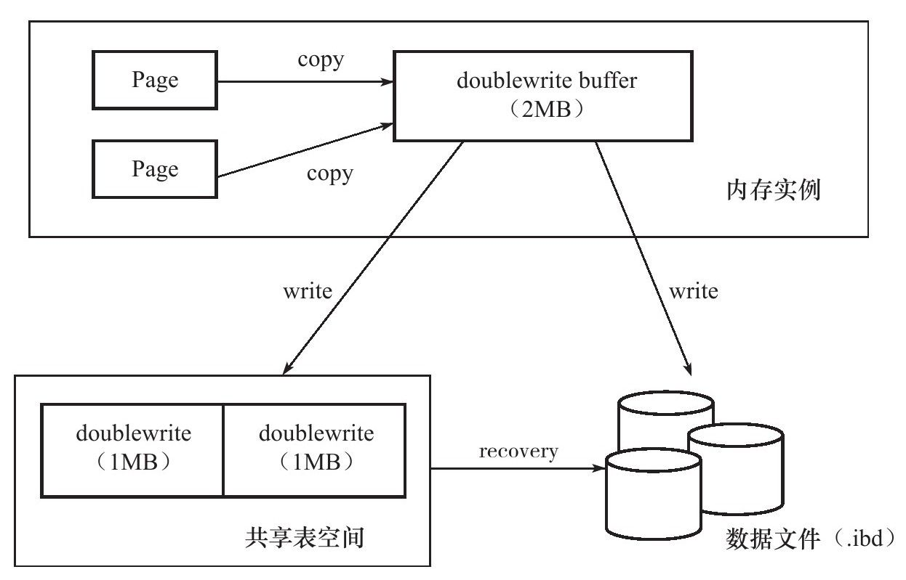

# 1.MySQL体系结构

如下图，按照从上到下，从左到右的顺序，MySQL的结构大体上分为：

- 连接池组件
- 管理服务和工具组件
- SQL接口组件
- 查询分析器组件
- 优化器组件
- 缓冲组件
- 插件式存储引擎
- 物理文件


其中，比较突出的就是MySQL的可拔插存储引擎，是底层物理存储的实现。需要注意的是，**MySQL的存储引擎是基于表的，而不是基于数据库的**。除了这次笔记学习的InnoDB外，还有这些常见的MySQL存储引擎：

- MyISAM：不支持事务，采用表锁设计，支持全文索引
- NDB：集群存储引擎，数据放置于内存中，可提供更高的可用性
- Memory：表中数据存放在内存中，采用哈希索引，适用于临时数据的临时表
- Archive：只支持insert和select操作，使用存储归档数据，提供高速的插入和压缩功能
- Federated：不存放数据，指向一台远程MySQL数据库服务器上的表
- Maria：支持缓存数据和索引文件，行锁设计，提供MVCC更，支持事务

# 2.InnoDB体系结构

InnoDB存储引擎是MySQL在5.5.8版本之后默认使用的，其特点是：支持事务，行锁设计，支持外键。InnoDB通过使用多版本并发控制（MVCC）来获得高并发性，并且实现了SQL标准的4种隔离级别，默认为REPEATABLE级别。


## 1.1.后台线程

InnoDB有多个后台线程，负责处理不同的任务，大致上分为：

- Master Thread：将缓冲池的数据异步刷新到磁盘，包括脏页的刷新、合并插入缓冲、UNDO页的回收；
- IO Thread：InnoDB存储引擎使用AIO处理IO请求，IO Thread负责这些IO请求的回调处理
- Purge Thread：事务提交后，其undolog便失去作用，Purge Thread负责回收这些undo页；减轻Master Thread的工作
- Page Cleaner Thread：负责将脏页的刷新操作放入到单独的线程中，减轻Master Thread的工作

## 1.2.内存

InnoDB存储引擎的内存分配结构

### 1.2.1.缓冲池

InnoDB会将数据存储到磁盘，并且按照页的方式管理这些数据。但是，由于磁盘速度的影响，通常系统设计会用内存作为CPU和磁盘之间的纽带，也就是缓冲区。从1.0x版本开始，InnoDB允许存在多个缓冲池实例，每个页根据哈希值平均分配到不同缓冲池实例中。

- 写操作，首先修改缓冲池的页，再通过Checkpoint机制刷回磁盘
- 读操作，优先读取缓冲池中的页，若页不存在再去读取磁盘，然后将页`FIX`到缓冲池中

**缓冲池中的LRU List、Free List、Flush List**

- LRU List

InnoDB缓冲池中页的大小默认为`16KB`，随着程序的运行，缓冲池中的页会越来越多，因此InnoDB基于传统LRU算法，加入midpoint位置来管理缓冲池的页，这个算法称为`midpoint insertion strategy`，作用是：在原有LRU基础上，最新访问的页并不是直接放入到列表首部，而是放到midpoint位置。例如：

```sql
SHOW VARIABLES like 'innodb_old_blocks_pct'
```

其默认值为37，表示新读取的页插入到**LRU列表尾端**的37%位置，midpoint之后的列表称为old列表，同理之前的列表称为new列表。new列表中的页都是最为活跃的热点数据页。InnoDB这样设计的一个原因是，有些SQL查询的时候使用其它非活跃数据的辅助（比如索引和数据的扫描），如果直接将这些非活跃数据放到LRU列表首部，那么很有可能把真正活跃的热点数据挤出去！！

- Free List

LRU List用来管理已读取的页，若数据刚启动，LRU List是为空的，页都存放在Free List中。当需要从缓冲池中分页时，先到Free List查找是否有可用的空闲页，若有则从Free List中删除，放入到LRU List中；否则从LRU List末尾删除页，将该内存空间分配给新读取的页，这一操作称为`page made young`

```sql
-- 通过此命令观察LRU List和Free List的状况
SHOW ENGINE INNODB STATUS
```

- Flush List

LRU List中的页被修改后，该页就会变为脏页，意味着缓冲池和磁盘的页数据产生了不一致。InnoDB的方案是通过Checkpoint机制将脏页刷回到磁盘，这些脏页是存放在Flush List中，不过要注意的是，脏页既存在于Flush List，它还仍存放在LRU List中

### 1.2.2.重做日志缓冲

重做日志缓冲，redo log buffer，InnoDB首先将重做日志信息先放入到这个缓冲，然后按照一定频率将其刷新到重做日志文件。一般情况下，每一秒钟会将重做日志缓冲刷新到磁盘中，用户只需要保证每秒产生的事务量在这个缓冲大小之内即可

```sql
-- 默认是8MB
SHOW VARIABLES LIKE 'innodb_log_buffer_size'
```

在下列三种情况下，会将重做日志缓冲中的内容刷新到磁盘中：

- Master Thread每秒将重做日志缓冲刷新到磁盘中的重做日志文件
- 每个事务提交时会将重做日志缓冲刷新重做日志文件
- 当重做日志缓冲池剩余空间小于1/2时，重做日志缓冲刷新到重做日志文件

## 1.3.Checkpoint

Checkpoint技术是用来解决缓冲池跟磁盘之间的数据一致性问题。InnoDB对数据页的操作，都是先操作缓冲池，这就会引发一个问题，也是在平常开发中遇到的缓存&数据库一致性问题。如果每次数据页发生变化，InnoDB就将新的数据页刷入到磁盘中，那开销很大；但是，数据页不及时刷入到磁盘中，如果数据库实例宕机，那么内存中的数据页就丢失了。

为了避免这一问题，大部分事务数据库系统普遍使用`Write Ahead Log`策略：当事务提交时，先写重做日志(redo log)，再修改缓冲池的数据页，这样即使数据库实例宕机，也可以通过重做日志来恢复数据，当然如果连写入日志都失败了，那么这个事务肯定就是属于执行失败的情况了。

不过InnoDB的Checkpoing发生的时间、条件还有脏页的选择，实际上肯定是更复杂的。需要明确一点，它只是负责将缓冲池中的脏页刷回到磁盘，包括每次刷新多少页到磁盘，每次从哪里取脏页，什么时间触发等等。大体上分为两种：

- Sharp Checkpoint：数据库关闭时将所有脏页刷新回磁盘，一般不会设置这个；
- Fuzzy Checkpoint：只刷新一部分脏页，它又分为多种情况，详细得要去翻书！～～

## 1.4.关键特性

### 1.4.1.插入缓冲

insert buffer，插入缓冲。在InnoDB中，主键是行唯一的标识符，行记录的插入顺序是按照主键递增的顺序进行插入的，即说明聚集索引（Primary Key）大部分是有序的，不需要磁盘随机读取其它页中的记录，InnoDB就可以完成新数据的insert操作，其速度比较快。

不过，如果主键是UUID这种随机数，或者表中还设计有非聚集的辅助索引（secondary index）,就比如用户表中，可能会对`name`这个字段进行模糊搜索，就会对`name`创建一个索引，这种索引就是非聚集的索引。这种情况新数据的插入，必须离散地访问非聚集索引页，由于随机读取而会导致插入性能下降。

基于这一考虑，InnoDB设计了insert buffer，即插入缓冲。对于非聚集索引的插入或更新操作，不是每一次直接插入到索引页中，而是先判断插入的非聚集索引页是否在缓冲池中，若在，则直接插入；若不在，则先放入到一个Insert Buffer对象中；然后再以一定的频率和情况进行Insert Buffer和辅助索引页子节点的merge（合并）操作，这时通常能将多个插入合并到一个操作中（因为在一个索引页中），这就大大提高了对于非聚集索引插入的性能！！Insert Buffer的使用需要同时满足以下两个条件：

- 索引是辅助索引（secondary index）
- 索引不是唯一（unique）的

这个设计思路和HBase中的LSM树有相似之处，都是通过先在内存中修改，到达一定量后，再和磁盘中的数据合并，目的都是为了提高写性能，具体可参考《[HBase LSM树](https://zhuanlan.zhihu.com/p/135371171)》

### 1.4.2.两次写

doublewrite，两次写，是InnoDB保证数据页落地到磁盘中的解决方案。假设，InnoDB存储引擎正在将数据页从缓冲池中写入到磁盘，刚写入4KB的时候就发生宕机，这种情况被称为部分写失效（partial page write）这是没办法通过重做日志（redo）进行恢复的，因为redo log要先对磁盘上的页进行读取，而现在是这个页已经损坏了。

为了解决这个问题，InnoDB存储引擎开发了doublewrite功能，它的结构为：

- 处在内存中的doublewrite buffer，大小2MB
- 处于物理磁盘上共享表空间中连续的128个页，即2个extent，大小2MB



解决方案是这样：

- 再对缓冲池的数据页进行刷新的时候，并不会直接写到磁盘上，而是先将数据页复制到doublewrite buffer，再通过doublewrite buffer分两次，每次1MB顺序地写入共享表空间的物理磁盘上。最后同步磁盘，避免缓冲写带来的问题
- 如果将数据页刷新到磁盘的过程中发生了崩溃，InnoDB先从共享表空间中的doublewrite找到改页的一个副本，将其复制到表空间文件，再应用重做日志

### 1.4.3.自适应哈希索引

InnoDB会监控表上各索引页的查询，根据访问的频率和模式来自动地为某些热点页建立哈希索引，这个就称为自适应哈希索引，Adaptive Hash Index，AHI。哈希索引只能用来搜索等值的查询，而且要求查询的条件是一样的。

### 1.4.4.异步I/O

InnoDB采用异步IO（Asynchronous IO，AIO）的方式来处理磁盘操作，现版本InnoDB采用了内核级别的AIO，称为Native AIO，它需要底层操作系统提供支持。AIO除了可以快速处理多个IO请求外（Sync IO，同步IO必须在一个页扫描完以后再进行下一次扫描），还可以进行IO Merge，将多个IO合并为1个IO。

### 1.4.4.刷新邻接页

Flush Neighbor Page，刷新邻接页。当刷新一个脏页时，InnoDB存储引擎会检测该页所在区（extent）的所有页，如果是脏页，那么一起进行刷新

