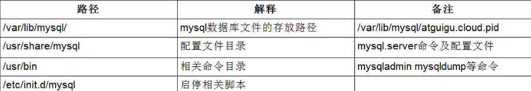

# 1.MySQL环境搭建

## 1.1.安装

### 1.1.1.Linux

### 1.1.2.Window

推荐使用解压版，下载地址：[https://dev.mysql.com/downloads/mysql/](https://dev.mysql.com/downloads/mysql/)。将其解压到一个目录，在window环境mysql的配置文件为my.ini，刚解压完是没有my.ini的，需要我们手动加上一个，配置文件例子为（**切记要用ANSI编码保存**）：

```ini
[mysql]
# 设置mysql客户端默认字符集
default-character-set=utf8
 
[mysqld]

#设置3306端口
port = 3306
 
# 设置mysql的安装目录(根据实际安装目录配置)
basedir=E:\database\mysql-5.7.19
 
# 设置mysql数据库的数据的存放目录(根据实际安装目录配置)
datadir=E:\database\mysql-5.7.19\data
 
# 允许最大连接数
max_connections=200
 
# 服务端使用的字符集默认为8比特编码的latin1字符集
character-set-server=utf8
 
# 创建新表时将使用的默认存储引擎
default-storage-engine=INNODB
 
# 取消权限设置，即开启免密登陆
skip-grant-tables
```

接着进入到bin目录下，打开DOS窗口，执行命令：

```bash
mysqld --install mysql   ##将mysql安装成服务，服务名为mysql
mysqld --initialize      ##初始化mysql
net start mysql        ##启动mysql
```

服务启动后，我们第一次登陆可以免密（my.ini配置了取消权限），登陆到mysql后使用命令修改root用户的命令：

```bash
mysql –u root -p       ##免密登陆mysql
## 修改root用户的密码为root
update MySQL.user set authentication_string=password('root') where user='root';
flush privileges; ##刷新权限
```

一切设置好后，修改my.ini配置文件，将skip-grant-tables配置删掉并重启。

## 1.2.配置

### 1.2.1.安装路径

在Linux系统中输入ps -ef| grep mysql命令查看mysql的安装路径，安装路径总结为以下的表格：



`/var/lib/mysql `，建数据库，建表（实际的硬盘数据）都是保存在这个目录下

`/usr/share/mysql`，从这里拷贝出Mysql配置文件的副本，然后进行修改

`/usr/bin` ，关于mysql的一些命令

### 1.2.2.修改默认字符集

Mysql原设置的字符集不支持中文的数据，插入的时候，会变成乱码，所以我们需要自己修改字符集，首先，查看Mysql此时的字符集为：用命令：

```sql
 show variables like 'character%'; 
 -- 或者
 show variables like '%char%';
```

在mysql配置文件中增加字符集相关的配置：

```ini
[client]
   default-character-set=utf8
[mysqld]        
   character_set_server=utf8
   character_set_client=utf8
   collation-server=utf8_general_ci
[mysql]
   default-character-set=utf8
```

修改完成后，保存配置并重启数据库，如果在此之前建立的数据库，因为字符集已经设置好了，所以就算修改配置文件的字符集，仍然是中文乱码。只有在修改配置文件之后建立的数据库，字符集修改才会起作用！

## 1.3.配置文件

在window系统下，配置文件是my.ini；在Linux系统下，配置文件是/etc/my.cnf，mysql的配置文件大体上分为：

- 二进制日志log-bin--------默认关闭，记录主机的信息，用于主从复制

- 错误日志log-error---------默认关闭，记录错误日志和启动、关闭的详细信息
- 查询日志log-----------------默认关闭，记录查询的sql语句
- 数据文件，根据引擎不同

# 2.MySQL驱动包

mysql驱动包版本5.x和6.x之间做了很大的改变:

- mysql-connector-java 5的驱动类时：com.mysql.jdbc.Driver

- mysql-connector-java 6的驱动类时：com.mysql.cj.jdbc.Driver

## 2.1.5.x配置

```properties
jdbc.driver=com.mysql.jdbc.Driver
jdbc.url=jdbc:mysql://localhost:3306/mybatis?characterEncoding=utf-8
jdbc.username=root
jdbc.password=
```

## 2.2.6.x配置

```properties
## 6.x引入时区的概念，所以配置中要指定时区。
jdbc.driver=com.mysql.cj.jdbc.Driver
jdbc.url=jdbc:mysql://localhost:3306/mybatis?useUnicode=true&characterEncoding=UTF-8&useJDBCCompliantTimezoneShift=true&useLegacyDatetimeCode=false&serverTimezone=UTC
jdbc.username=root
jdbc.password=
```

在设定时区的时候，如果设定serverTimezone=UTC，会比中国时间早8个小时，如果在中国，可以选择时区为Asia/Shanghai或者Asia/Hongkong，例如：

```properties
jdbc.driver=com.mysql.cj.jdbc.Driver
jdbc.url=jdbc:mysql://localhost:3306/mybatis?useUnicode=true&characterEncoding=UTF-8&useJDBCCompliantTimezoneShift=true&useLegacyDatetimeCode=false&serverTimezone=Asia/Shanghai
jdbc.username=root
jdbc.password=
```

