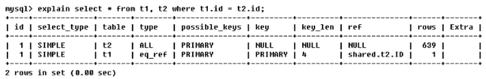
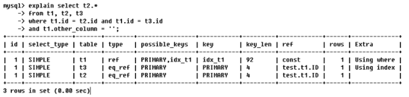
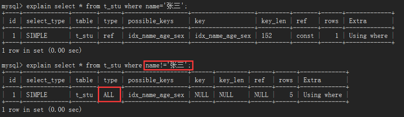

# 1.数据库事务

## 1.1.何为事务

- **事务**：一组逻辑操作单元，使数据从一种状态变换到另一种状态；

- **事务处理(事务操作)**：当在一个事务执行多个操作时，要么所有的操作都被提交(commit)，则这些操作就永久地保存起来；要么数据库管理系统放弃所做的所有操作，整个事务回滚(rollback)到最初状态

## 1.2.ACID属性

事务具有以下4个属性，通常简称为事务的ACID属性：

- **原子性(**Atomicity)：事务是一个原子操作单元，其对数据的修改，要么全部  执行，要么全都不执行；
- **一致性**(Consistent)：在事务开始和完成时，数据都必须保持一致状态，所有数据规则都要应用于事务的修改，保持数据完整 ；
- **隔离性**(Isolation)：保证事务在不受外部并发操作影响的“独立”环境执行，  这意味事务处理过程中的中间状态对外部是不可见的，即  并发执行的各个事务之间是不能相互干扰的；
- **持久性**(Durable)：事务完成之后，它对于数据的修改是永久性的，即使出现  系统故障也能够保持。

## 1.3.事务并发处理 

### 1.3.1.并发问题

<table>
  <tr>
  	<th>问题</th>
    <th>描述</th>
  </tr>
  <tr>
  	<td width='20%'>更新丢失</td>
    <td>当两个或多个事务选择同一张表的同一行更新数据，由于每个事务不知道其他事务的存在，就会发生丢失更新问题—最后的更新覆盖其他事务所做的更新</td>
  </tr>
  <tr>
  	<td>脏读</td>
    <td>一个事务正在对一条记录做修改，在这个事务未commit之前，另一个事务也来读取同一条记录，这时第二个事务就有可能读取到这些"脏"数据，因为未提交之前，所做的数据修改可能是测试，也可能是错误的数据，这种现象叫做“脏读”</td>
  </tr>
  <tr>
  	<td>不可重复读</td>
    <td>一个事务范围内两个相同的查询却返回了不同数据，也就是说一个事务在读取某些数据后的某个时间（事务未完成），再次读取以前读过的数据，由于其它事务更新了该字段导致读出的数据已经发生了改变，或某些记录已经被删除了，这种现象就叫做"不可重复读"</td>
  </tr>
  <tr>
  	<td>幻读</td>
    <td>一个事务按相同的查询条件重新读取以前读取的数据，却发现其他事务插入了满足其查询条件的新数据，这种现象就称为“幻读”</td>
  </tr>
</table>

幻读和脏读有点类似：

- 脏读是事务B读取事务A修改中的数据

- 幻读是事务B读取事务A新增的数据

### 1.3.2.事务隔离级别

一个事务去其它事务隔离的程度就称为：隔离级别。数据库规定了多种事务隔离级别，不同隔离级别对应不同的干扰程度，隔离级别越高，数据一致性越好，但是并发性越弱。数据库提供4种事务隔离级别:

<table>
  <tr>
  	<th>隔离级别</th>
    <th>描述</th>
  </tr>
  <tr>
  	<td width='33%'>未提交读<br/>(Read cuncommited)</td>
    <td>允许事务读取未被其它事务提交的操作数据。脏读、不可重复度和幻读又会发生</td>
  </tr>
  <tr>
  	<td>已提交读<br/>(Read commited)</td>
    <td>只允许事务读取已被其它事务提交的操作，可以避免脏读，但无法解决不可重复读和幻读</td>
  </tr>
  <tr>
  	<td>可重复读<br/>(Repeatable read)</td>
    <td>确保事务可以多次从一个字段中读取相同的值，在这个事务持续期间，禁止其它事务对这个字段进行更新。可以避免脏读和不可重复读，但幻读仍然存在</td>
  </tr>
  <tr>
  	<td>串行化<br/>(Serializable)</td>
    <td>确保事务可以从一个表中读取相同的行，在这个事务持续期间，禁止其它事务对该表执行插入符。更新和删除操作，所有并发问题都可以避免，但性能十分低</td>
  </tr>
</table>
数据库的事务隔离越严格，并发副作用越小，但付出的代价也就越大，因为事务隔离实质上就是使事务在一定程度上“串行化”进行，显然与“并发”是矛盾的。mysql默认是可重复读级别，即解决了脏读和不可重复读。查看当前数据库的事务隔离级别：

```sql
show variables like 'tx_isolation';
```

# 2.MySQL执行计划

回首MySQL架构，在第二层有一个Mysql Query Optimizer，是MySQL官方提供的查询优化器，它负责优化select语句，为客户端请求的SQL提供MySQL自己认为最优的执行计划；通过`explain`关键字，可以模拟优化器执行SQL查询语句，分析查询语句或表结构的性能瓶颈。它的语法很简单，直接在SQL前面加`explain`关键字即可

```sql
explain select * from  t_dept
```

**explain关键字字段描述：**

| 列名          | 描述                                                 |
| ------------- | ---------------------------------------------------- |
| id            | 与SELECT关键字一一对应                               |
| select_type   | SELECT关键字对应的查询的类型                         |
| table         | 表名                                                 |
| partitions    | 匹配的分区信息                                       |
| type          | 单表的访问方式                                       |
| possible_keys | 可能会用到的索引                                     |
| key           | 实际使用的索引                                       |
| key_len       | 实际使用到的索引长度                                 |
| ref           | 使用索引列等值查询时，与索引列进行等值匹配的对象信息 |
| rows          | 预估计的需要读取的记录条数                           |
| filtered      | 单表经过搜索条件过滤后剩余记录条数的百分比           |
| Extra         | 一些额外的信息                                       |

## 2.1.id

id是select识别符，也是select查询的序列号，包含一组数字用来表示查询中执行select子句或操作表的**顺序**！

1. **id相同，执行顺序由上到下**


请记住，id的值一样，执行顺序是从上到下，上例的执行顺序便是：t1，t3，t2,虽然例子中sql语句的from后面的表顺序是：t1，t2，t3，但是mysql并不会按照这种顺序去执行，它通过查询优化器分析以后，认为t1，t3，t2的执行顺序更优良，从sql语句的角度分析，where条件最后的and是跟表t1有关，因此mysql会优先查询表t1的数据

2. **id不同，值越大优先级越高；若是子查询，id序号会递增，因此会被先执行**


若explain分析得到的结果，id的值各不相同，那么值越大的，越先执行，因此上例中，表的执行顺序是：t3，t1，t2。从sql语句来看，查询表t2需要先查询表t1，而查询表t1又需要先查询表t3，或者这样子看，有括号的先查询，t2是在最外面，因此它最晚查，t1在里面，t3在最里面，所以t3最早查。

3. **id既有相同的又有不同的**


这里先解释一下，为什么sql语句select t2.* from (...) s1。from后面不是跟着表名而是跟着一个子查询？意思是把这个子查询的结果当做一个虚表，为这个虚表命名为s1，然后再从s1中查找数据，虚表有一个官方称呼—**衍生表**

若分析后的结果，id的取值有相同的也有不同，像上例的1，1，2。这时候，相同id的为一组，按照从上往下的顺序执行；不同组间，id值大的优先级高，先执行。例如1，1为一组，2单独为一组；然后看id的值，id=2的值大，因此它先被执行，然后执行1，1这组，由于这一组id的值相同，因此是按从上往下的顺序执行，总的顺序是： t3，\<derived2>，t2。从sql语句来看，先执行括号里面的即先执行t3，t3执行完以后衍生出一个虚表s1，然后再执行这个虚表和t2，所以才会得到：t3，\<derived2>，t2的执行顺序。

derived是衍生的意思，即sql语句中的s1，表示衍生表。derived2中的2，表示这个衍生表是由id=2执行的那个表(即t3)衍生出来的。

## 2.2.select_type, table

- table：指明这一行的数据是关于哪张表的

- select_type：指明数据查询时的操作类型，主要是用于区别普通查询、联合查询、子查询等复杂查询，有6种取值：

  - simple，简单的select查询，查询中不包含子查询或者Union；

  - primary，查询中若包含任何复杂的子查询，最外层查询则被标记为primary；

  - subquery，在select或where列表中包含了子查询；

  - derived，在from列表中包含的子查询被标记为derived（衍生）mysql会递归执行这些子查询，把结果放在临时表里；

  - union，若第二个select出现在Union之后，则被标记为union;若union包含在from子句的子查询中，外层select则被标记为derived；

  - union result，从union表获取结果的select。

## 2.3.type

type，字面意思是访问类型排列，表示SQL语句的查询效率，常用的取值有：

`ALL、index、range、ref、eq_ref、const、system、null`

性能从最好到最坏依次是：null > system > const > eq_ref > ref > range > index > all。 一般来说，得保证查询至少达到range级别，最好能达到ref！

1. **system**

 system类型表示：表里面仅有一条记录(相当于系统表)，是const的特例，平常几乎遇不到，因此可以忽略。

2. **const**

const类型表示：表最多只有一条匹配行，表示通过索引一次就找到数据，常用于主键或unique索引，因为只匹配一行数据，所以很快


当在查询select * from t1 where id=1时，由于是用主键来查询的，主键值是唯一的，所以表中有且仅有一条数据与之匹配，这时候Mysql就能将该查询转为一个常量，则type=const，将查询后的结果当成衍生表d1，由于查询结果只有一个，所以d1只有一条记录相当于系统表，此时查询，type便为system类型

3. **eq_ref**

eq_ref是多表联接唯一性索引扫描，对于前表的每个索引键，后表只有一条记录与之匹配，常见于主键或唯一索引扫描，eq_ref可用于使用=比较带索引的列



比如，t1是员工表，t2是部门表，t2的主键id是t1的外键。 id值若相同，按从上往下的顺序查询，因此先查询部门表t2，对t2的查询方式是全表扫描，找到t2所有的部门id，然后对员工表t1查询，找出与前表(t2表)找到的id匹配的员工，当此时t1只有一条记录时，type的值便是eq_ref。换句话说，当找的部门是研发部时，会有多条记录，因为研发的员工有多个，当找的是总裁部时，仅有一条记录，因为总裁只有一个。

4. **ref**

ref区别于eq_ref，因为ref是非唯一性索引扫描，它返回匹配某个索引值的所有行，它可以找到多个符合条件的行


当没有建索引去查询col1='ac'的表数据，type的类型为all，只能是全表扫描。当建立了索引：create index idx_col1_col2 on t1(col1,col2)，再去查询col1='ac'的数据，mysql用索引去查找，且col1字段并不是表t1的主键，没有唯一性，查出来的数据会有多条，此时的type的类型就是ref。能达到ref级别，sql优化就已经很不错了

5. **range**

 只检索给定范围的行，使用一个索引来选择行，一般就是where语句出现了between、<、>、in等查询。这种范围扫描索引比全表扫描好，因为它只需要开始于索引的某一点，结束于另一点，不用扫描全表


6. **index**

 index与all区别在于index类型只遍历索引树。这通常比all快，因为索引文件通常比数据文件小，虽然all和index都是读全表，但是Index是从索引中读取的，而all是从硬盘读取的


id是表t1的主键，所以select id就是直接从索引里面遍历

7. **all**

all类型会遍历全表找到匹配行，不使用索引，就只能全表扫描


## 2.4.possible_keys, key

- possible_keys，指明执行SQL语句时，理论上需要用到的索引列表，若查询涉及到的字段上存在索引，则该索引被列出，但不一定实际使用；
- key，表示实际使用的索引，如果为Null，则没有使用索引，若查询使用覆盖索引，则该索引仅会出现在key列表中(覆盖索引：select查询的字段正好和创建索引时用的列一致)


理论上可能会用到主键索引和idx_t1索引(观察possible_keys)，但实际上只用到idx_t1索引(观察key)


理论上没有用到索引(possible_keys为null)，但实际上用到idx_col1_col2索引，这就是覆盖索引。查询的字段是col1、col2，正好与创建的复合索引idx_col1_col2的列和列顺序一样，所以只显示在key列表中，possaible_key显示null

## 2.5.key_len

key_len指明索引中使用到的字节数，通过该列计算出查询时使用的索引长度


当查询条件col1='ab'，用到的索引字节数为13，当加了一个查询条件，col1='ab' and col2='ac'，用到的索引字节数为26。当查询结果一样的前提，key_len越小越好，但是这是不可能的。想让马跑的远又不给马吃草，这是不符合逻辑规律的。当查询条件越多，用的key_len就会越大，得出的结果就会越精确

## 2.6.ref

ref，表示哪些列或常量被用于查找索引列上的值，如果使用的是常数等值查询，ref会显示const；如果是连接查询，ref会显示驱动表的关联字段；如果使用表达式或者函数，或条件列发生了内部隐式转换，ref可能显示为func



id值相同，执行顺序由上至下，此条SQL的表查询顺序是t1，t3，t2。

- 查询t1时，ref=const，const就是常量的意思，结合sql语句t1.othe_column=''是匹配一个空字符串来查询数据，空字符串就是一个常量

- 查询t3时，ref=test.t1.ID，意思是用的列是test数据库的t1表的ID列，结合sql语句...and t1.id = t3.id，以t1表为驱动表，来查找t3表中符合条件的数据

- 查询t2时，ref=test.t1.ID，意思也是用test数据库的t1表的ID列，因为查询t2的sql语句为 where t1.id = t2.id，跟查询t3表的语句时一样的

## 2.7.rows

rows，根据表统计信息及索引选用情况，大致估算出找到所需记录要读取的行数


当没有创建索引，查询t2表的type类型是all，说明是全表扫描，Mysql估算出需要读取640行才能得到sql语句想要的结果。用了索引后，mysql估算出可能要读取的行数是142行

## 2.8.extra

extra，包含不适合在列中显示但十分重要的额外信息。最重要的3个取值： using filesort、using temporary 、using index

- using filesort

说明这条sql不是按照表内的索引顺序排序，而是用了一个外部的索引排序，Mysql中无法利用索引完成的排序操作称为"文件排序"，即filesoft。一般表现在带有order by等排序关键字的sql语句上，出现using filesort表示性能不好 


前面的笔记说道，索引的作用有2个：排序和查询。从key的值不为null，知道查询的时候用到索引，但是由于出现了using filesort。同样也知道排序没用到索引，为什么会这样？仔细区分下第1条和第2条sql语句：前者是order by col3，后者是order by col2,col3，后者排序的字段正好与创建的索引列一致(col1用在搜索)mysql会用索引来排序，也就不会在内存花费时间和性能重新排序，就不会出现using filesort

- using temporary

出现using temporary，则Mysql要赶紧优化，性能极其不好。它表明MySQL在对查询结果排序时使用了临时表，常见于排序order by和分组查询group by


临时表的创建很伤性能的，更不要拿它来排序，所以在排序的时候，排序的字段最好与创建索引用的字段极可能地保持一致(顺序和类型都一样)

- using index

using index的出现，表示效率不错，是良好的表现。它表示相应的select操作中使用了覆盖索引，避免访问了表的数据行，若同时出现using where，表明索引被用来执行索引键值的查找；若没有同时出现using where，表明索引用来读取数据而非查找动作


# 3.MySQL索引

## 3.1.索引概念

MySQL官方对索引的定义：索引（Index）是帮助Mysql高效获取数据的数据结构请记住，索引是一种数据结构。是什么样的数据结构？排好序的快速查找数据结构即b+树，它的作用是排序和快速查找


比如，现在要找Col2=91的那一行数据，如果存在索引，拿91跟34比，比34大，就放到89这边，91又比89大，所以放到91这边，91配对成功，找到91指向的物理地址，返回数据，这样子有索引就不用去遍历整个表，再配对91，当然，如果遍历了整个b+树还找不到就返回Null。一般来说，索引本身也很大，不可能全部存储在内存中，因此索引往往以索引文件的形式存储在磁盘上。我们平常说的索引，如果没有特别指明，都是指B树（多路搜索树，并不一定是二叉树）结构组织的索引。下面是B树和B+树的区别

- B树：mongodb使用B树来做索引

  

- B+树：mysql用B+树来做索引

  

## 3.2.索引分类

1、单值索引：一个索引只包含一个列，一个表可以有多个单值索引

2、复合索引：一个索引包含多个列

3、唯一索引：索引列的值必须唯一，允许有空值

## 3.3.索引原理

【**初始化介绍**】

一颗b+树，青色的块我们称之为一个磁盘块，可以看到每个磁盘块包含几个数据项（深蓝色所示）和指针（黄色所示），如磁盘块1包含数据项17和35，包含指针P1，P2，P3，P1表示小于17的磁盘块，P2表示在17和35之间的磁盘块，P3表示大于35的磁盘块，真实的数据存在叶子结点，即：3，5，9，10，13，15，28，29，36，60，75，79，90，99，非叶子结点不存储真实的数据只储存搜索方向的数据项，如17，35并不真实存在于数据表中


【**查找过程**】

如果要查找数据项29，那么首先会把磁盘块1由磁盘加载到内存，此时发生一次IO，在内存中用二分查找确定29在17和35之间，锁定磁盘块1的P2指针，内存时间因为非常短（相比磁盘的IO）可以忽略不计，通过磁盘块1的P2指针的磁盘地址把磁盘块3由磁盘加载到内存，发生第二次IO，29在26和30之间，锁定磁盘块3的P2指针，通过指针加载磁盘块8到内存，发生第三次IO，同时内存中做二分查找，找到29结束查询，总计三次IO

## 3.4.索引优化

- **需要索引的情况**

1. 主键自动建立唯一索引

2. 频繁作为查询条件的字段

3. 查询与其他表关联的字段，外键关系建立索引

4. 查询中排序的字段，排序字段若通过索引去访问将大大提高效率

5. 查询中统计或者分组字段

- **不需要所有的情况**

1. 经常增删改的表、频繁更新的字段（不仅要更新数据，还要维护索引树）

2. where条件里用不到的字段不创建索引

3. 表记录太小，Mysql据说可以撑到300W条

4. 某个数据列包含许多重复的内容，例如性别，都是男或者女，没必要建索引

### 3.4.1.最佳左前缀法则

最佳左前缀法则：**如果索引了多列，查询条件要从索引的最左前列开始并且不跳过中间的列**。现在有一个学生表，该表的索引如下：


注意红框标注的索引列，从上往下的顺序是name->age->sex，where语句后的查询条件，name一定要存在，就像：


从explain解析出来的信息，可以看到type是ref而且key不为null，说明建立的索引有用到，但如果where后name没用到，不论后面怎么搞，索引也用不到，所以说，索引的最左前列在where后一定要体现，否则如下：


第二点，where语句后的查询条件，不要name='' and sex = ''，而把中间索引列age省略掉。当索引列都拿来做查询条件时，由type=ref知道肯定用了索引，从ref=const,const,const知道3个常量都拿去查询了


但是，如果中间去掉age的查询条件，由于带头大哥name在，所以肯定是会用到索引，但是从ref=const可得只用到了一个常量，后面那个常量根本用不到：


### 3.4.2.索引列不加操作

**不要在索引列上做任何操作（计算、函数、类型转换等），会导致索引失效**

 left(v,n)函数是Mysql自带的函数，意思是在指定的列v上，从左往右数起到n得到的值与给定的值相匹配的数据，可以看到查询的结果与...where name='张三'的结果是一样的


但是，由于在索引列上加了其他操作，导致索引失效，用explain分析后发现，mysql居然是用了全表扫描来查询数据，所以，索引列就直接拿去查询，不要做过多的修饰和包装


### 3.4.3.范围条件后索引列失效

在where条件后，如果某列用了范围条件（如in，between，>，<等）则此列以后的索引列都会失效，mysql并不会再用索引去查询：


当等值查询name='张三' and age=21时，因为用了2个常量，key_len=156；全值查询name='张三' and age=21 and sex='m'，用了3个常量，key_len-=159；一旦在查询条件中，加了范围条件的查询，像name='张三' and age>21 and sex='m'，观察key_len=156，很明显可以知道跟2个条件等值查询一样，也就是说虽然sql语句用了3个条件来查询，但由于用了范围条件age>21导致sex='m'这个条件失效，所以在建立索引时候，要将可能用到范围查询的列放到最后

索引idx_name_age_sex的最后一列是sex，我们在sex列上用范围查询，可以看到key_len=159，跟3个条件等值查询用到的索引字节数一样：


### 3.4.4.尽量避免select*查询

尽量使用覆盖索引（查询列和索引列一样），减少select * 操作。我们把select *改成select name age后，对比一下，发现Extra列多了一个Using index，当出现using index表示系统性能更好，所以，当我们在查询的时候尽可能地保证查询的列能和索引列一样，这样Mysql直接从索引上取值，极大地加大性能：


### 3.4.5.!=，<>会使索引失效

mysql在使用不等于（!=或者<>）的时候，无法使用索引导致全表扫描。备注：在mysql中，<>相当于!=，即不等于的意思；<=>相当于=，即等于的意思



由上图知道，使用了!=时，性能直接由ref级别下降到all级别。但是如果是唯一性索引，例如主键，就算用了!=，索引也可以使用，变为range类型：


### 3.4.6.is null或is not null索引失效

当查询条件是..is null或者.. is not null的时候，由下图可以看出出现两种情况：一种是极端type=null，一种是全表扫描type=all，尽量避免使用！


### 3.4.7.模糊查询like

like以通配符开头（'%xxx...'）mysql索引失效会变成全表扫描的操作。即：'%java'、'%java%'都会失效，但是'java%'就不会失效：


可是这样有个问题，条件'java%'和'%java%'查到的数据肯定是不一样的，而且在一般情况下，用'%java%'是最多的，咋保证既要双向模糊查询又不能让索引失效？答案是：覆盖索引，当查询的列与索引列一致，即使用like索引也不会失效：


表中建立索引用的列是name、age、sex，还有主键列：id。可以发现，在select查询的列是这四列的任意组合时，type=index，虽不说很高效，但至少比全表扫描ALL好很多，一旦select查询的列是非索引列(如多了addr)可以看到，查询结果type=ALL，继续变成全表扫描。

结论：**使用模糊查询like，尽量保证查询列与索引列一致，即覆盖索引**

### 3.4.8.字符串不加引号使索引失效

当一个varchar类型的数据，查询时不使用引号，会发生隐式类型转换，导致索引失效，进而变成全表扫描，其实就是避免在索引列上加操作


### 3.4.9.尽量避免or条件查询

加了or条件的查询，会让索引失效，变成全表扫描


# 4.MySQL查询截取分析

## 4.1.查询优化

### 4.1.1.小表驱动大表

优化原则：**永远保持小的数据集驱动大的数据集！**比如`in`和`exist`：

- `in`作用于子查询，它是将子查询的结果用于主查询的条件匹配，若子表数据集小于主表数据集，用`in`；
- `exist`作用于主查询，它是将主查询的数据放到子查询中做条件验证，根据验证结果(true或false)来决定主查询的数据结果是否得以保留，若子表数据集大于主表数据集，用`exist`

```sql
select * from A where id in(select id from B)
-- 等价于
select * from A where exists(select 1 from B where B.id=A.id)
```

### 4.1.2.ORDER BY

MySQL支持2种方式的排序：

1. 文件排序using filesort

2. 索引排序using index

根据性能分析explain可得，出现filesort表示系统性能出现问题，所以要让MySQL使用index索引排序，需要满足下面情况的任意一种：

- 排序的列必须也是是索引列

- 索引最左列（上例中的a列）一定要体现

- 排序列要么同升序要么同降序

### 4.1.3.GROUP BY

group by与order by大致一样，以下三种情况是group by独有的：

- group by实质是先排序后进行分组，遵循创建索引时的最佳左前缀法则

- 当无法使用索引列，在Mysql配置文件中增大max_length_for_sort_data参数和sort_buffer_size参数的值

- where高于having，能写在where限定的条件就不要去having限定了

## 4.2.慢查询日志

MySQL的慢查询日志，用来**记录响应时间超过阙值的sql语句**，具体指运行时间超过long_query_time值的sql，就会被记录到慢查询日志中。long_query_time的默认值为10，意思是运行10秒以上的语句（不包括10）默认情况下，慢查询日志是关闭的。如果不是为了调优，不建议启动该参数，会带来性能的影响，查看是否开启：

```sql
show variables like '%slow_query_log%'
```

- 手动开启慢查询：

```sql
set global slow_query_log=1;
-- （重启MySQL后失效）
```

- 查看当前多少秒算慢

 ```sql
 show variables like 'long_query_time';
 ```

- 设置慢的阙值时间

 ```sql
 set global long_query_time=3;
 -- (重新开一个窗口才能看到修改后的值)
 ```

- 当前系统有多少条慢查询记录

  ```sql
show global status like '%Slow_queries%';
  ```

## 4.3.show profile

show profile是MySQL提供用来分析当前会话中sql语句执行的资源消耗情况，用于sql调优的测量，默认关闭，若开启默认保存最近15次的运行结果

1、查看show profile是否开启？show variables like'profiling';

2、开启：set profiling=on;

3、查看最近执行结果：show profiles;

4、诊断命令：show profile [cpu],[block io]...for query [query_ID]


执行后，就可以看到该条sql语句在每一步花费的时间，找出最耗时的步骤，查询原因后进行优化，当然show profile有其他参数，需要时百度

## 4.4.全局日志查询

切记，只允许在测试环境用，永远不要在生产环境中开启这个功能

**①配置启用**


**②命令启用**

   ```sql
set global general_log=1;
set global log_output='TABLE';
   ```

此后所执行的sql语句，都会记录到Mysql库里的general_log表，可以使用下面的命令查看：select * from mysql.general_log

# 5.MySQL锁机制

MySQL有三种锁的级别：页级、表级、行级

MyISAM存储引擎采用的是表级锁（table-level locking）；

BDB存储引擎采用的是页面锁（page-levellocking），也支持表级锁；

InnoDB存储引擎既支持行级锁（row-level locking），也支持表级锁，默认行锁。

MySQL这3种锁的特性可大致归纳如下：

- 表级锁：开销小，加锁快；不会出现死锁；锁定粒度大，发生锁冲突的概率最高,并发度最低

- 行级锁：开销大，加锁慢；会出现死锁；锁定粒度最小，发生锁冲突的概率最低,并发度最高

- 页面锁：开销和加锁时间界于表锁和行锁之间；会出现死锁；锁定粒度界于表锁和行锁之间，并发度一般

## 5.1.表锁

表锁：把整张表锁起来，分为读锁和写锁。表锁偏读，主要存在MyISAM引擎上

### 5.1.1.读锁

当某个会话session为某个表table加了读锁：

当前会话可以读表，不可以写表，还不可以读其他表，直至解锁；其他会话可以读表，不可以写表，还可以读其他表

1. show open tables；查看Mysql表的加锁情况，In_use=0表示该表没有加任何锁


2. lock table 【表名1】 【read/write】,【表名2】 【read/write】...;为表加锁


3. unlock tables;解锁

### 5.1.2.写锁

当会话session_1为表t_stu加了写锁：

session_1可以读表，可以修改表，不可以读/写其他未加锁的表

session_2不可以读表，不可以修改表，可以读/写其他未加锁的表

### 5.1.3.分析表锁

**读锁会阻塞写，但不会阻塞读；写锁会把读和写都阻塞**

如何分析表锁？分析系统的表锁定SQL：

```sql
show status like 'table%';
```


- Table_locks_immediate：产生表级锁定的次数

- Table_locks_waited：出现表锁争用而发生等待的次数(每等待一次，锁值+1)，此值越高，说明存在较严重的竞争

## 5.2.行锁

偏向InnoDB存储引擎，开销大，加锁慢，会出现死锁；锁定粒度最小，发生锁冲突的概率最低，并发度也最高。InnoDB与MyISAM的最大不同有两点：一是支持事务，二是采用行级锁。

行锁默认是就是开启的，只要修改数据表的某行数据，该行就会自动加行锁，不同的行有不同的锁，互不影响。当要测试行锁时，需要把Mysql的自动事务提交关了，否则一回车，事务就提交，无法测试。执行SQL:

```sql
set autocommit=0;
```

当session_1修改数据的时候，session_2再去修改只会被阻塞

在session_1未commit之前，session_2只会读到上一次commit后的数据

### 5.2.1.行锁变表锁

当where子句后面的条件列，不创建索引或者索引失效，会导致行锁变表锁。

**索引生效：**


行锁是对表的一行加锁，如果两个session操作不同行，是互不影响的：

当session_1修改id=1的行，session_2如果也修改id=1是会被阻塞的；

但session_2可以修改id!=1的行，如id=2


**索引失效：**

当索引失效时候，行锁就变成表锁，session_1在修改t_stu数据的时候，session_2即使修改不同的行，也是被阻塞：


让session_1修改第一行数据，即id=1

让session_2修改第五行数据，即id=10

如果正常情况下，这两个会话是互不影响的。根据前面的知识，如果varchar类型数据不加引号，会使索引失效：name字段是varchar，但我们故意在查询条件后不加引号使索引失效。可以看到，**一旦索引失效，行锁直接变成表锁**！！！


### 5.2.2.间隙锁

【什么是间隙锁】

​    当使用范围条件而不是相等条件检索数据时，并请求共享或排他锁，InnoDB会给符合条件的已存在记录的索引项加锁，对于键值在条件范围内但并不存在的记录，叫做“间隙”(GAP)，InnoDB也会对这个“间隙”加锁，这种锁机制就是所谓的间隙锁（Next-Key锁）

【危害】

​    因为Query执行过程中若用范围查找，它会锁定整个范围内所有的索引键值，即使这个键值不存在。因此，间隙锁有一个比较致命的弱点，就是当锁定一个范围键值之后，就算某些不存在的键值也会被无辜锁定，而造成在锁定的时候无法插入锁定键值范围内的任何数据，仅当事务提交后才可添加，影响性能。


### 5.2.3.手动锁定

当我们用select语句查询一行数据时，希望在查询期间，该行能锁定，不让其他事务修改，就需要我们手动锁定一行：


在select语句末尾加上“for update”，就可以为指定的行加锁，这时候，session_2要修改该行的数据就会被阻塞 ，直至session_1提交事务

### 5.2.4.分析行锁

通过命令：show status like'innodb_row_lock%';查看Mysql行锁的情况


对各个状态量的说明如下：（单位是毫秒）

- innodb_row_lock_current_waits：当前正在等待锁定的数量

- innodb_row_lock_time：从系统启动到现在锁定总时间长度

- innodb_row_lock_time_avg：每次等待所花平均时间

- innodb_row_lock_time_max：从系统启动到现在等待最长一次所花的时间

- innodb_row_lock_waits：系统启动后到现在总共等待的次数

对于5个状态量，比较重要的是：

- innodb_row_lock_time_avg：等待平均时长

- innodb_row_lock_waits：等待总次数

- innodb_row_lock_time：等待总时长

尤其当等待次数很高，且每次等待时长也不小的时候，便要分析并制定优化计划

# 6.MySQL主从复制

mysql集群的负载均衡，读写分离和高可用都是基于复制实现。它的复制机制分为：异步复制、半同步复制和并行复制。

1. 异步复制

异步复制是mysql自带的最原始的复制方式，**主库和备库成功建立起复制关系后，在备库上会有一个IO线程去主库拉取binlog，并将binlog写到本地，就是下图中的Relay log，然后备库会开启另外一个SQL线程去读取回放Relay log，通过这种方式达到Master-Slave数据同步的目的。**

2. 半同步复制

异步复制会产生主从延迟问题，半同步复制就是为了解决数据一致性而产生的。理解啥是半同步复制，可以先了解下同步复制：一个事务在Master和Slave都执行后，才返回给用户执行成功（其实就是2PC协议）；**MySQL只实现了本地redo-log和binlog的2PC，Slave在接收到日志后就响应Master（数据还未执行），这种就称为半同步复制**。目前实现半同步复制主要有两种模式，AFTER_SYNC模式和AFTER_COMMIT模式。两种方式的主要区别在于是否在存储引擎提交后等待Slave的ACK。

3. 并行复制

半同步复制可以解决数据一致性的问题，但是性能变低了，Master产生binlog的速度远远大于Slave SQL线程消费的速度，照样产生主从延迟。所以需要让Slave并行复制，可以IO线程并行，也可以SQL线程并行。并行IO线程，可以将从Master拉取和写Relay log分为两个线程；并行SQL线程则可以根据需要做到库级并行，表级并行，事务级并行。库级并行在mysql官方版本5.6已经实现

SQL并发复制需要保证事务有序进行。Slave必需保证回放的顺序与Master上事务执行顺序一致，因此只要做到顺序读取binlog，将不冲突的事务并发执行即可。对于库级并发而言，协调线程要保证执行同一个库的事务放在一个工作线程串行执行；对于表级并发而言，协调线程要保证同一个表的事务串行执行；对于事务级而言，则是保证操作同一行的事务串行执行。

## 6.1.基本原理

slave（从机）会从master（主机）读取biglog进行数据同步


mysql复制过程分为3步：

1. master将改变记录到二进制日志（binary log），这些记录称为二进制日志事件

2. slave将master的binary log拷贝到它的中继日志relay log

3. slave重做中继日志中的事件，将改变应用到自己的数据库中

## 6.2.基本原则

①每个slave只有一个master

②每个slave只能有一个唯一的服务器ID

③每个master可以有多个slave

## 6.3.一主一从常见配置

以window下的MySQL为主机，配置文件为my.ini；以Linux下的MySQL为从机，配置文件为my.cnf 

**准备工作：**

1、主机和从机的Mysql版本要一致

2、主机和从机都配置在相应配置文件的`[mysqld]`结点下，都是小写

3、主机和从机相互ping通

### 6.3.1.更改配置文件

#### 6.3.1.1.master

```ini
# 指定服务器唯一id, 范围[1,32], 必须配置
server_id=1 

# 开启bin-log功能
log_bin=mysql-log-bin

# 选择 ROW 模式
binlog_format=ROW 

# 指定要同步的数据库, 建议加上(如果省略，默认操作整个mysql)
binlog_do_db=sym_test

#指定不要同步的数据库，如果指定了binlog-do-db就不用再指定该项
#binlog_ignore_db=mysql

#是否只读，主机读写都可以
read-only=0
```

#### 6.3.1.2.slave

```ini
从机是放在linux系统下，所以配置文件是my.cnf

# 指定服务器唯一id, 范围[1,32], 必须配置
server_id=2

# 开启中继日志
relay_log=relay-log  

# 指定要同步的数据库
replicate_do_db=sym_test

#指定不要同步的数据库
#replicate_ignore_db=mysql  

#是否只读，从机一般只读
read-only=1
```

### 6.3.2.启动主从配置

#### 6.3.2.1.master

```sql
-- 为从库生成账户: salve/slave123
grant replication slave on *.* to 'slave'@'127.0.0.1' identified by 'slave123' ;

-- 刷新权限
flush privileges;

-- 查看权限
select * from mysql.user;

-- 查看binlog记录，后面从库需要根据这个配置开启复制
show master status;
```

1. 主从配置文件改过以后，都重启后台mysql服务;

2. 主从都关闭防火墙；（window手动关闭，linux用命令：service iptables stop）

3. 主机上建立账户并授权slave

   grant replication slave on *.* to【账户名】@【从机IP】 identified by '密码';

   (从机如果很多，可以直接用”%”替代，表示任意ip)，如：

   ```sql
   grant replication slave on *.* to 'zhangsan'@ '192.168.1.1' identified by '123';
   ```

4. 查询master状态，记录File和position的值

    ```sql
   show master status;
   ```


#### 6.3.2.2.slave

1. 从机重新启动后需要连接到主机上，通过执行sql：

```sql
change master to master_host='主机ip',master_port='主机端口',
master_user='主机授权的用户名',master_password='密码',
master_log_file='mysqlbin.具体数字',
master_log_pos=具体值;
```

  (需要参照上面的第3、第4步) 如：

```sql
change master to master_host='127.0.0.1',master_port=3308,
master_user='slave',master_password='slave123', 
master_log_file='mysql-log-bin.000035',
master_log_pos=341;
```

2、启动从机Mysql上的复制功能

 ```sql
 start slave;
 ```

3、查询从机状态，

```sql
show slave status;
```

  如果下面2个参数值都为yes，则说明配置正确：

 ```tex
slave_io_running:yes
slave_sql_running:yes
 ```

### 6.3.3.停止服务

在从机mysql上输入命令：

```sql
stop slave;
```
