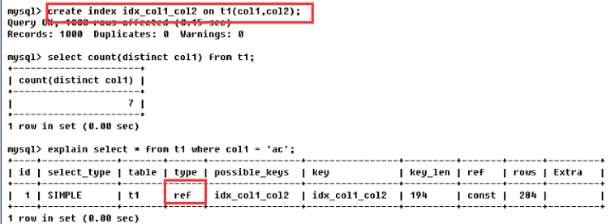

# 2.MySQL执行计划

## 2.1.id

id是select识别符，也是select查询的序列号，包含一组数字用来表示查询中执行select子句或操作表的**顺序**！

1. **id相同，执行顺序由上到下**


请记住，id的值一样，执行顺序是从上到下，上例的执行顺序便是：t1，t3，t2,虽然例子中sql语句的from后面的表顺序是：t1，t2，t3，但是mysql并不会按照这种顺序去执行，它通过查询优化器分析以后，认为t1，t3，t2的执行顺序更优良，从sql语句的角度分析，where条件最后的and是跟表t1有关，因此mysql会优先查询表t1的数据

2. **id不同，值越大优先级越高；若是子查询，id序号会递增，因此会被先执行**


若explain分析得到的结果，id的值各不相同，那么值越大的，越先执行，因此上例中，表的执行顺序是：t3，t1，t2。从sql语句来看，查询表t2需要先查询表t1，而查询表t1又需要先查询表t3，或者这样子看，有括号的先查询，t2是在最外面，因此它最晚查，t1在里面，t3在最里面，所以t3最早查。

3. **id既有相同的又有不同的**


这里先解释一下，为什么sql语句select t2.* from (...) s1。from后面不是跟着表名而是跟着一个子查询？意思是把这个子查询的结果当做一个虚表，为这个虚表命名为s1，然后再从s1中查找数据，虚表有一个官方称呼—**衍生表**

若分析后的结果，id的取值有相同的也有不同，像上例的1，1，2。这时候，相同id的为一组，按照从上往下的顺序执行；不同组间，id值大的优先级高，先执行。例如1，1为一组，2单独为一组；然后看id的值，id=2的值大，因此它先被执行，然后执行1，1这组，由于这一组id的值相同，因此是按从上往下的顺序执行，总的顺序是： t3，\<derived2>，t2。从sql语句来看，先执行括号里面的即先执行t3，t3执行完以后衍生出一个虚表s1，然后再执行这个虚表和t2，所以才会得到：t3，\<derived2>，t2的执行顺序。

derived是衍生的意思，即sql语句中的s1，表示衍生表。derived2中的2，表示这个衍生表是由id=2执行的那个表(即t3)衍生出来的。

## 2.2.select_type, table

- table：指明这一行的数据是关于哪张表的

- select_type：指明数据查询时的操作类型，主要是用于区别普通查询、联合查询、子查询等复杂查询，有6种取值：

  - simple，简单的select查询，查询中不包含子查询或者Union；

  - primary，查询中若包含任何复杂的子查询，最外层查询则被标记为primary；

  - subquery，在select或where列表中包含了子查询；

  - derived，在from列表中包含的子查询被标记为derived（衍生）mysql会递归执行这些子查询，把结果放在临时表里；

  - union，若第二个select出现在Union之后，则被标记为union;若union包含在from子句的子查询中，外层select则被标记为derived；

  - union result，从union表获取结果的select。

## 2.3.type

type，字面意思是访问类型排列，表示SQL语句的查询效率，常用的取值有：

`ALL、index、range、ref、eq_ref、const、system、null`

性能从最好到最坏依次是：null > system > const > eq_ref > ref > range > index > all。 一般来说，得保证查询至少达到range级别，最好能达到ref！

1. **system**

 system类型表示：表里面仅有一条记录(相当于系统表)，是const的特例，平常几乎遇不到，因此可以忽略。

2. **const**

const类型表示：表最多只有一条匹配行，表示通过索引一次就找到数据，常用于主键或unique索引，因为只匹配一行数据，所以很快


当在查询select * from t1 where id=1时，由于是用主键来查询的，主键值是唯一的，所以表中有且仅有一条数据与之匹配，这时候Mysql就能将该查询转为一个常量，则type=const，将查询后的结果当成衍生表d1，由于查询结果只有一个，所以d1只有一条记录相当于系统表，此时查询，type便为system类型

3. **eq_ref**

eq_ref是多表联接唯一性索引扫描，对于前表的每个索引键，后表只有一条记录与之匹配，常见于主键或唯一索引扫描，eq_ref可用于使用=比较带索引的列


比如，t1是员工表，t2是部门表，t2的主键id是t1的外键。 id值若相同，按从上往下的顺序查询，因此先查询部门表t2，对t2的查询方式是全表扫描，找到t2所有的部门id，然后对员工表t1查询，找出与前表(t2表)找到的id匹配的员工，当此时t1只有一条记录时，type的值便是eq_ref。换句话说，当找的部门是研发部时，会有多条记录，因为研发的员工有多个，当找的是总裁部时，仅有一条记录，因为总裁只有一个。

4. **ref**

ref区别于eq_ref，因为ref是非唯一性索引扫描，它返回匹配某个索引值的所有行，它可以找到多个符合条件的行



当没有建索引去查询col1='ac'的表数据，type的类型为all，只能是全表扫描。当建立了索引：create index idx_col1_col2 on t1(col1,col2)，再去查询col1='ac'的数据，mysql用索引去查找，且col1字段并不是表t1的主键，没有唯一性，查出来的数据会有多条，此时的type的类型就是ref。能达到ref级别，sql优化就已经很不错了

5. **range**

 只检索给定范围的行，使用一个索引来选择行，一般就是where语句出现了between、<、>、in等查询。这种范围扫描索引比全表扫描好，因为它只需要开始于索引的某一点，结束于另一点，不用扫描全表


6. **index**

 index与all区别在于index类型只遍历索引树。这通常比all快，因为索引文件通常比数据文件小，虽然all和index都是读全表，但是Index是从索引中读取的，而all是从硬盘读取的


id是表t1的主键，所以select id就是直接从索引里面遍历

7. **all**

all类型会遍历全表找到匹配行，不使用索引，就只能全表扫描


## 2.4.possible_keys, key

- possible_keys，指明执行SQL语句时，理论上需要用到的索引列表，若查询涉及到的字段上存在索引，则该索引被列出，但不一定实际使用；
- key，表示实际使用的索引，如果为Null，则没有使用索引，若查询使用覆盖索引，则该索引仅会出现在key列表中(覆盖索引：select查询的字段正好和创建索引时用的列一致)


理论上可能会用到主键索引和idx_t1索引(观察possible_keys)，但实际上只用到idx_t1索引(观察key)


理论上没有用到索引(possible_keys为null)，但实际上用到idx_col1_col2索引，这就是覆盖索引。查询的字段是col1、col2，正好与创建的复合索引idx_col1_col2的列和列顺序一样，所以只显示在key列表中，possaible_key显示null

## 2.5.key_len

key_len指明索引中使用到的字节数，通过该列计算出查询时使用的索引长度


当查询条件col1='ab'，用到的索引字节数为13，当加了一个查询条件，col1='ab' and col2='ac'，用到的索引字节数为26。当查询结果一样的前提，key_len越小越好，但是这是不可能的。想让马跑的远又不给马吃草，这是不符合逻辑规律的。当查询条件越多，用的key_len就会越大，得出的结果就会越精确

## 2.6.ref

ref，表示哪些列或常量被用于查找索引列上的值，如果使用的是常数等值查询，ref会显示const；如果是连接查询，ref会显示驱动表的关联字段；如果使用表达式或者函数，或条件列发生了内部隐式转换，ref可能显示为func


id值相同，执行顺序由上至下，此条SQL的表查询顺序是t1，t3，t2。

- 查询t1时，ref=const，const就是常量的意思，结合sql语句t1.othe_column=''是匹配一个空字符串来查询数据，空字符串就是一个常量

- 查询t3时，ref=test.t1.ID，意思是用的列是test数据库的t1表的ID列，结合sql语句...and t1.id = t3.id，以t1表为驱动表，来查找t3表中符合条件的数据

- 查询t2时，ref=test.t1.ID，意思也是用test数据库的t1表的ID列，因为查询t2的sql语句为 where t1.id = t2.id，跟查询t3表的语句时一样的

## 2.7.rows

rows，根据表统计信息及索引选用情况，大致估算出找到所需记录要读取的行数


当没有创建索引，查询t2表的type类型是all，说明是全表扫描，Mysql估算出需要读取640行才能得到sql语句想要的结果。用了索引后，mysql估算出可能要读取的行数是142行

## 2.8.extra

extra，包含不适合在列中显示但十分重要的额外信息。最重要的3个取值： using filesort、using temporary 、using index

- using filesort

说明这条sql不是按照表内的索引顺序排序，而是用了一个外部的索引排序，Mysql中无法利用索引完成的排序操作称为"文件排序"，即filesoft。一般表现在带有order by等排序关键字的sql语句上，出现using filesort表示性能不好 


前面的笔记说道，索引的作用有2个：排序和查询。从key的值不为null，知道查询的时候用到索引，但是由于出现了using filesort。同样也知道排序没用到索引，为什么会这样？仔细区分下第1条和第2条sql语句：前者是order by col3，后者是order by col2,col3，后者排序的字段正好与创建的索引列一致(col1用在搜索)mysql会用索引来排序，也就不会在内存花费时间和性能重新排序，就不会出现using filesort

- using temporary

出现using temporary，则Mysql要赶紧优化，性能极其不好。它表明MySQL在对查询结果排序时使用了临时表，常见于排序order by和分组查询group by


临时表的创建很伤性能的，更不要拿它来排序，所以在排序的时候，排序的字段最好与创建索引用的字段极可能地保持一致(顺序和类型都一样)

- using index

using index的出现，表示效率不错，是良好的表现。它表示相应的select操作中使用了覆盖索引，避免访问了表的数据行，若同时出现using where，表明索引被用来执行索引键值的查找；若没有同时出现using where，表明索引用来读取数据而非查找动作


# 4.MySQL查询截取分析

## 4.1.查询优化

### 4.1.1.小表驱动大表

优化原则：**永远保持小的数据集驱动大的数据集！**比如`in`和`exist`：

- `in`作用于子查询，它是将子查询的结果用于主查询的条件匹配，若子表数据集小于主表数据集，用`in`；
- `exist`作用于主查询，它是将主查询的数据放到子查询中做条件验证，根据验证结果(true或false)来决定主查询的数据结果是否得以保留，若子表数据集大于主表数据集，用`exist`

```sql
select * from A where id in(select id from B)
-- 等价于
select * from A where exists(select 1 from B where B.id=A.id)
```

### 4.1.2.ORDER BY

MySQL支持2种方式的排序：

1. 文件排序using filesort

2. 索引排序using index

根据性能分析explain可得，出现filesort表示系统性能出现问题，所以要让MySQL使用index索引排序，需要满足下面情况的任意一种：

- 排序的列必须也是是索引列

- 索引最左列（上例中的a列）一定要体现

- 排序列要么同升序要么同降序

### 4.1.3.GROUP BY

group by与order by大致一样，以下三种情况是group by独有的：

- group by实质是先排序后进行分组，遵循创建索引时的最佳左前缀法则

- 当无法使用索引列，在Mysql配置文件中增大max_length_for_sort_data参数和sort_buffer_size参数的值

- where高于having，能写在where限定的条件就不要去having限定了

## 4.2.慢查询日志

MySQL的慢查询日志，用来**记录响应时间超过阙值的sql语句**，具体指运行时间超过long_query_time值的sql，就会被记录到慢查询日志中。long_query_time的默认值为10，意思是运行10秒以上的语句（不包括10）默认情况下，慢查询日志是关闭的。如果不是为了调优，不建议启动该参数，会带来性能的影响，查看是否开启：

```sql
show variables like '%slow_query_log%'
```

- 手动开启慢查询：

```sql
set global slow_query_log=1;
-- （重启MySQL后失效）
```

- 查看当前多少秒算慢

 ```sql
 show variables like 'long_query_time';
 ```

- 设置慢的阙值时间

 ```sql
 set global long_query_time=3;
 -- (重新开一个窗口才能看到修改后的值)
 ```

- 当前系统有多少条慢查询记录

  ```sql
show global status like '%Slow_queries%';
  ```

## 4.3.show profile

show profile是MySQL提供用来分析当前会话中sql语句执行的资源消耗情况，用于sql调优的测量，默认关闭，若开启默认保存最近15次的运行结果

1、查看show profile是否开启？show variables like'profiling';

2、开启：set profiling=on;

3、查看最近执行结果：show profiles;

4、诊断命令：show profile [cpu],[block io]...for query [query_ID]


执行后，就可以看到该条sql语句在每一步花费的时间，找出最耗时的步骤，查询原因后进行优化，当然show profile有其他参数，需要时百度

## 4.4.全局日志查询

切记，只允许在测试环境用，永远不要在生产环境中开启这个功能

**①配置启用**


**②命令启用**

   ```sql
set global general_log=1;
set global log_output='TABLE';
   ```

此后所执行的sql语句，都会记录到Mysql库里的general_log表，可以使用下面的命令查看：select * from mysql.general_log

