# 1.neo4j简介

官网：[https://neo4j.com/docs/developer-manual/current/](https://neo4j.com/docs/developer-manual/current/)。Neo4j数据库是基于"属性图"模型，官网以下图来介绍neo4j各个概念

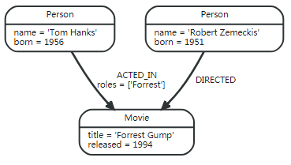

## 1.1.node

node，节点，neo4j中的节点是属性图模型的节点，它具有属性和标签。节点通常用于保存实体，例如在用户图库中，一个节点就代表一个用户。节点上的属性就是用户个人信息，节点上的标签，可以表示用户所属的用户群( 标签不是唯一，它也可以表示其他方面 )，以上面的例子：

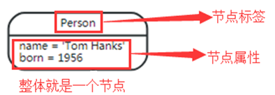

## 1.2.relation

relation，即关系，Neo4j中的关系是属性图模型中描述的关系，具有关系类型( 其实也是标签 )和属性。一条关系连接着两个节点且肯定有方向，它可以表现出两个节点存在关联的地方，以官网给出的例子来看：

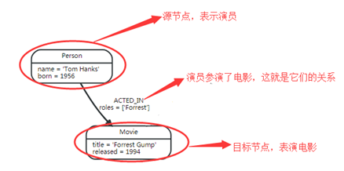

上图中的"ACTED_IN"就是关系的类型；"roles"就是关系的属性，很自然地可以想到，它其实就是表示演员在电影扮演的角色。关系肯定是存在；"->"就是关系的方向，从person→Movie。虽然关系总存在方向，但节点与节点自己也可以存在方向：

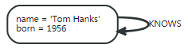

## 1.3.property

property，即属性，用来详细描述节点和关系的内容。Neo4j中的属性是以key-value的形式表示的，Neo4j的属性支持的类型有：( 注意 null 在图库中不是有效的属性值 )

1. Numer
   - Integer
   - Float

2. String
3. Boolean
4. Spatial types
   - Point

5. Temporal types
   - Date
   - Time
   - LocalTime
   - DateTime
   - LocalDateTime
   - Duration

## 1.4.label

label，即标签，用于将节点分组成集，具有相同标签的节点属于同一个集，一个节点可以有多个标签，也可以0个，一个标签也没。在查询时，基于集来查询比整个图来查询效率更高，例如：当为所有用户节点标记":user"标签，执行操作时只要指定:user，neo4j只会对用户操作而不会影响其他节点。还有，因为标签可以在运行时增删，所以它还可以表示节点的当前状态，比如：" :Suspended"暂停标签可用于表示暂停的银行账户

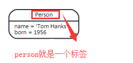

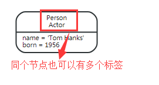

## 1.5.index

index，即索引，Neo4j中也支持索引创建，提高查找数据库中节点的速度。一旦创建了索引，每次新添加数据，Neo4j都会更新索引匹配到当前数据。Neo4j中的索引是"最终可用"的，意思就是创建索引时它会立即返回结果，但是真正索引的创建是在后台执行，无法立即在查询中使用，当索引完全填充后，它会自动联机。

当索引出现问题，他最终会失败。失败时索引就不会加速查询，我们需要删除它重新索引

## 1.6.pattern

pattern，即模式，是官网文档经常强调的一个词。那么，何为模式？单个节点或关系通常对非常少的信息进行编码，但是节点和关系的模式可以编码任意复杂的想法。所以，模式其实就是节点和关系的复杂组合，一个最简单的模式只有一条关系两个节点，例如一个人生活在一座城市，"人"是节点，"城市"是节点，"生活在"是关系。稍微复杂的模式就具有多个节点多重关系，例如人类社会的人际关系→由"张三"找出他22岁以上姓沈的女性朋友的男朋友的爹...

# 2.neo4j安装

neo4j要求JDK 1.8以上，安装前需要先安装JDK

## 2.1.桌面版安装

想快速上手neo4j，就下载安装Neo4j Desktop(桌面版)，下载地址：[https://neo4j.com/download/](https://neo4j.com/download/)，就跟安装普通的.exe文件一样，按照系统的提示操作即可，Neo4j Desktop管理Neo4j数据库的安装，并提供对许多有用的开发工具的访问

## 2.2.服务版安装

### 2.2.1.基本配置

服务端安装分为企业版和社区版，企业版是收费的，社区版是免费的，下载地址：[https://neo4j.com/download-center/](https://neo4j.com/download-center/)。服务版下载下来的是压缩文件，开箱即用，解压后，到bin目录执行"neo4j.bat console"就启动了。neo4j的配置文件放在./conf目录下，一般它默认的配置文件就已经可用，下面的配置按照个人需要修改：

①核心数据文件的位置

```te
# 数据库的名称，默认是graph.db
dbms.active_database=graph.db

# 数据文件存放的文件夹，默认是./data文件夹
dbms.directories.data=data
```

②安全验证，默认是启用的，改为false就不需要输入账户密码了

```tex
dbms.security.auth_enabled=true
```

③JAVA堆内存设置，Neo4j是Java语言开发的，它本身就是一个JVM，默认是按照系统动态分配的

```tex
 # 初始化Java堆大小
 dbms.memory.heap.initial_size=512m
 
# Java堆内存的最大值
dbms.memory.heap.max_size=512m
```

### 2.2.2.网络协议配置

Neo4j支持三种网络协议（Protocol），分别是Bolt，HTTP和HTTPS，默认的连接器配置有三种，为了使用这三个端口，需要在Windows防火墙中创建Inbound Rules，允许通过端口7687，7474和7473访问本机。

①默认三个协议都是支持的，如果不使用某个协议，将相应配置改为false

- dbms.connector.bolt.enabled=true // Bolt协议

- dbms.connector.http.enabled=true // HTTP协议

- dbms.connector.https.enabled=true // HTTPS协议

②默认这三个协议都有监听端口，想更换端口就修改相应的配置

- dbms.connector.bolt.listen_address=:7687 //Bolt--7687

- dbms.connector.http.listen_address=:7474 //HTTP--7474

- dbms.connector.https.listen_address=:7473 //HTTPS--7473

③设置网络监听地址，neo4j默认只允许本地访问，想支持远程访问，需要修改监听地址为0.0.0.0：

- dbms.connectors.default_listen_address=0.0.0.0

### 2.2.3.neo4j服务安装

将neo4j安装成一个服务，可以在后台启动关闭。到./bin目录开启命令行，需要什么操作就执行下面对应的命令即可：

- bin\neo4j install-service ---安装服务

- bin\neo4j uninstall-service ---卸载服务

- bin\neo4j start --- 开启服务

- bin\neo4j stop --- 关闭服务

- bin\neo4j restart --- 重启服务

- bin\neo4j status ---服务状态

若执行上面任意一个命令，都会报错，报错信息就如下图所示：

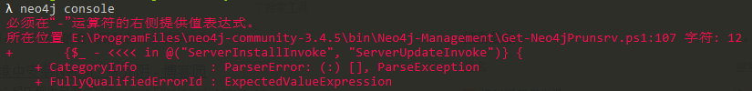

如果是在安装成服务时，还会出现这个错误：

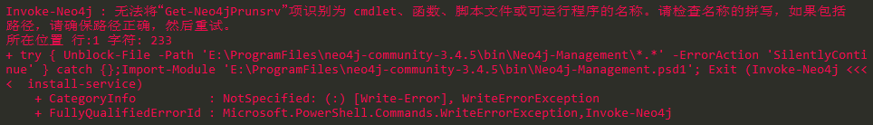

这些错误信息都是官方自带的文件出错了：.\bin\Neo4j-Management\Get-Neo4jPrunsrv.ps1

解决方法是打开Get-Neo4jPrunsrv.ps1 文件，注释掉下面5行代码：

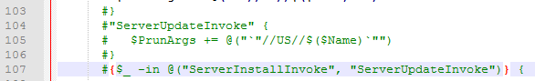

等一切配置完成，打开浏览器输入[http://127.0.0.1:7474](http://127.0.0.1:7474)，就可以看到登录页面，初始账号密码是：neo4j/neo4j，等登录进去后系统会提醒修改密码，再改成你想要的密码即可

# 3.Cypher查询语言

cypher是neo4j的查询语言，强烈基于模式(pattern)，而模式即用于匹配所需的图形结构。它只会告诉neo4j那些模式要匹配并如何处理匹配的项目，而不会告诉neo4j怎么查询节点，遍历关系等等...

## 3.1.基础

### 3.1.1.表示节点

Cypher使用一对括号（通常包含文本字符串）来表示节点，节点可以有变量来表示它例如(m)，节点的标签用冒号例如(m:event)，匹配所有节点只有括号例如()，下图是官网给的例子：

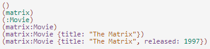

1. 最简单的形式"（）"代表一个匿名的、无特征的节点。如果想在别处引用该节点，我们可以添加一个变量例如：（matrix）。变量仅限于单个语句，它可能在另一个陈述中有不同（或没有）的含义

2. Movie标签（使用冒号前缀）声明节点的类型。这限制了模式，使其不会在此位置匹配（比如说）具有Actor节点的结构。Neo4j的节点索引也使用标签，每个索引都特定于标签和属性的组合

3. 节点的属性（例如标题）表示为键/值对的列表，包含在一对大括号中，例如： {name：“Keanu Reeves”}。属性可用于存储信息和/或限制模式

### 3.1.2.表示关系

Cypher使用"[]"表示关系，使用"--"或"->"或"<-"表示关系方向。“--”表示无向关系，“->,<-”表示定向关系，括号表达式（[...]）可用于添加细节。这可以包括变量，属性和/或类型信息，下面是官网给的例子：

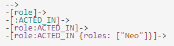

关系也可以定义变量例如"[role]"，以便在语句的其他地方使用。关系的类型例如"[: ACTED_IN]"类似于节点的标签。节点和关系属性使用相同的表示法"{key:value}"

### 3.1.3.表示模式变量

为了提高模块性并减少重复，Cypher允许将模式分配给变量。官网给的例子为：

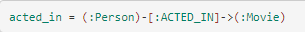

acted_in变量将包含两个节点以及找到或创建的每个路径的连接关系。内置函数可以通过该变量获取模式的相似信息，例如：

①通过nodes(acted_in)可以找出该模式的所有节点

②通过relationships(acted_in)可以找出所有匹配的关系

③通过length(acted_in)可以找出匹配路径的长度 

... ...

这边有个例子，可以通过模式变量找出模式中的最短路径:

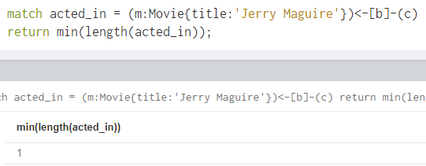

## 3.2.语法

Cypher从SQL借用其结构 - 使用各种子句构建查询，子句链接在一起，它们相互之间提供中间结果集

### 3.2.1.CREATE

```cql
CREATE (
    <node-name>:<label-name>
    { 	
        <Property1-name>:<Property1-Value>
        <Propertyn-name>:<Propertyn-Value>
    }
)
```

| **语法元素**       | **描述**                                       |
| ------------------ | ---------------------------------------------- |
| \<node-name>       | 它是我们将要创建的节点名称。                   |
| \<label-name>      | 它是一个节点标签名称                           |
| \<Property1-name>  | 属性是键值对。定义将分配给创建节点的属性的名称 |
| \<Property1-value> | 属性是键值对。定义将分配给创建节点的属性的值   |

例子：

```CQL
CREATE (dept:Dept { deptno:10,dname:"Accounting",location:
"Hyderabad" })
-- dept表示节点的别名（不可使用引号）
-- Dept表示节点的类型，节点可包含0~n个类型（不可使用引号）
-- 括号表示节点，花括号内表示属性，key value的形式
```

### 3.2.2.MATCH, RETURN

```CQL
MATCH 
(
   <node-name>:<label-name>{<node-name>:<label-name>}
)
RETURN 
   <node-name>.<property1-name>,
   <node-name>.<propertyn-name>
```

例句：

```CQL
-- 中括号表示边，r表示边的别名，Customer表示边的类型（边只能有一个类型）返回值type (r)
-- 表示返回边的类型值
MATCH (cc:CreditCard)-[r:Belong]-(c:Customer) RETURN cc, type (r)

-- 查询wzh参演过的电影名称
match (people:People{name:"wzh"}) - [:ACTED_IN] -> (m) return perple,m

-- 查询谁导演了电影tank
match (movie{title:"tank"})<-[:DIRECTED]-(directors) return directors

-- 查询与wzh同出演过电影的人
match (people{name:"wzh"}) - [:ACTED_IN]->(m)<-[:ACTED_IN]-(others) return other

-- 查询与演员“Kevin Bacon”存在2条及以内关系的任何演员和电影（可实现层级查询）
match (bacon:Person{name:"Kevin Bacon"})-[*1..2]-(hollywood)
return distinct hollywood,bacon

-- 查询演员A与演员B之间最短的关系路径
match p=shortestPath((a:Person{name:"A"})-[*]-(b:Person{name:"B"}))
) return p

```

### 3.2.3.关系, 边

```cql
MATCH (<node1-label-name>:<node1-name>),(<node2-label-name>:<node2-name>)
CREATE  (<node1-label-name>)-[<relationship-label-name>:<relationship-name>]->(<node2-label-name>) RETURN <relationship-label-name>
```

| **语法元素**               | **描述**                                |
| -------------------------- | --------------------------------------- |
| MATCH,CREATE,RETURN        | 他们是Neo4J CQL关键字。                 |
| \<node1-name>              | 它用于创建关系的“From Node”的名称。     |
| \<node1-label-name>        | 它用于创建关系的“From Node”的标签名称。 |
| \<node2-name>              | 它用于创建关系的“To Node”的名称。       |
| \<node2-label-name>        | 它用于创建关系的“To Node”的标签名称。   |
| \<relationship-name>       | 这是一个关系的名称。                    |
| \<relationship-label-name> | 它是一个关系的标签名称。                |

例句，下面两句效果一样

```CQL
MATCH (e:Customer),(cc:CreditCard) CREATE (e)-[r:DO_SHOPPING_WITH ]->(cc)

-- 查询节点并建立关系，关系的类型是SHOPPING_WITH
CREATE (e:Customer)-[r:DO_SHOPPING_WITH]->( cc:CreditCard) 
```

### 3.2.4.WHERE

```cql
WHERE <property-name> <comparison-operator> <value>
 <boolean-operator> <property-name> <comparison-operator> <value>
```

| **语法元素**                                | **描述**                                                     |
| ------------------------------------------- | ------------------------------------------------------------ |
| WHERE                                       | 它是一个Neo4j CQL关键字。                                    |
| \<property-name>   <br /><属性名称>         | 它是节点或关系的属性名称。                                   |
| \<comparison-operator>   <br /><比较运算符> | 它是Neo4j CQL比较运算符之一。请参考下一节查看Neo4j CQL中可用的比较运算符。 |
| \<value>   <值>                             | 它是一个字面值，如数字文字，字符串文字等。                   |

Neo4j支持以下布尔运算符在Neo4j CQL WHERE子句中使用以支持多个条件。

| **布尔运算符** | **描述**                               |
| -------------- | -------------------------------------- |
| AND            | 它是一个支持AND操作的Neo4j CQL关键字。 |
| OR             | 它是一个Neo4j CQL关键字来支持OR操作。  |
| NOT            | 它是一个Neo4j CQL关键字支持NOT操作。   |
| XOR            | 它是一个支持XOR操作的Neo4j CQL关键字。 |

Neo4j 支持以下的比较运算符，在 Neo4j CQL WHERE 子句中使用来支持条件。

| **布尔运算符** | **描述**                              |
| -------------- | ------------------------------------- |
| =              | 它是Neo4j CQL“等于”运算符。           |
| <>             | 它是一个Neo4j CQL“不等于”运算符。     |
| <              | 它是一个Neo4j CQL“小于”运算符。       |
| >              | 它是一个Neo4j CQL“大于”运算符。       |
| <=             | 它是一个Neo4j CQL“小于或等于”运算符。 |
| >=             | 它是一个Neo4j CQL“大于或等于”运算符。 |

```cql
-- 例句1
MATCH (emp:Employee) WHERE emp.name = 'Abc' RETURN emp

-- 例句2
MATCH (cust:Customer),(cc:CreditCard) WHERE cust.id = "1001" AND cc.id= "5001" CREATE (cust)-[r:DO_SHOPPING_WITH{shopdate:"12/12/2014",price:55000}]->(cc) RETURN r
```

### 3.2.5.DELETE

```CQL
DELETE <node-name-list>
DELETE <node1-name>,<node2-name>,<relationship-name>
```

| **语法元素**         | **描述**                                                     |
| -------------------- | ------------------------------------------------------------ |
| DELETE               | 它是一个Neo4j CQL关键字。                                    |
| \<node-name-list>    | 它是一个要从数据库中删除的节点名称列表。                     |
| \<node1-name>        | 它是用于创建关系\<relationship-name>的一个结束节点名称。     |
| \<node2-name>        | 它是用于创建关系\<relationship-name>的另一个节点名称。       |
| \<relationship-name> | 它是一个关系名称，它在\<node1-name>和\<node2-name>之间创建。 |

```CQL
-- 例句1
MATCH (e: Employee) DELETE e

--删除删除节点和关系
MATCH (cc:CreditCard)-[r]-(c:Customer) DELETE cc,r,c
```

### 3.2.6.REMOVE

```SQL
REMOVE <property-name-list>
```

| **语法元素**          | **描述**                                             |
| --------------------- | ---------------------------------------------------- |
| REMOVE                | 它是一个Neo4j CQL关键字。                            |
| \<property-name-list> | 它是一个属性列表，用于永久性地从节点或关系中删除它。 |

```CQL
-- 删除属性price
MATCH (book { id:122 }) REMOVE book.price RETURN book
```

### 3.2.7.SET

```CQL
-- 语法
SET  <property-name-list>
```

| **语法元素**          | **描述**                                                   |
| --------------------- | ---------------------------------------------------------- |
| SET                   | 它是一个Neo4j的CQL关键字。                                 |
| \<property-name-list> | 它是一个属性列表，用于执行添加或更新操作以满足我们的要求。 |

```CQL
-- 类似Mysql的set
MATCH (dc:DebitCard) SET dc.atm_pin = 3456 RETURN dc
```

### 3.2.8.ORDER BY

语法：

```cql
ORDER BY  <node-label-name>.<property1-name>,<node-label-name>.<property2-name>, <node-label-name>.<propertyn-name> [DESC]	
```

| **语法元素**       | **描述**             |
| ------------------ | -------------------- |
| \<node-label-name> | 它是节点的标签名称。 |
| \<property-name>   | 它是节点的属性名称。 |

```cql
-- 类似mysql的order by
MATCH (emp:Employee) RETURN emp.empid,emp.name,emp.salary,emp.deptno
ORDER BY emp.name DESC
```

### 3.2.9.LIMIT

```cql
LIMIT <number>;
```

| **语法元素** | **描述**                  |
| ------------ | ------------------------- |
| LIMIT        | 它是一个Neo4j CQL关键字。 |
| \<number>    | 它是一个跨值。            |

```cql
-- 例子
MATCH (emp:Employee) RETURN emp LIMIT 2
```

### 3.2.10.SKIP

```cql
-- 语法
SKIP <number>
```

| **语法元素** | **描述**                  |
| ------------ | ------------------------- |
| SKIP         | 它是一个Neo4j CQL关键字。 |
| \<number>    | 它是一个间隔值。          |

```cql
-- 例句
MATCH (emp:Employee) RETURN emp SKIP 2
```

### 3.2.11.MERGE

MERGE命令是CREATE命令和MATCH命令的组合。在图中搜索给定模式，如果存在，则返回结果如果它不存在于图中，则它创建新的节点/关系并返回结果。

```CQL
-- 语法
MERGE (<node-name>:<label-name>
{
   <Property1-name>:<Pro<rty1-Value>
   .....
   <Propertyn-name>:<Propertyn-Value>
})
```

| **语法元素**     | **描述**                                            |
| ---------------- | --------------------------------------------------- |
| MERGE            | 它是一个Neo4j CQL关键字。                           |
| \<node-name>     | 它是节点或关系的名称。                              |
| \<label-name>    | 它是节点或关系的标签名称。                          |
| <property_name>  | 它是节点或关系的属性名称。                          |
| <property_value> | 它是节点或关系的属性值。                            |
| ：               | 使用colon（:)运算符来分隔节点或关系的属性名称和值。 |

```CQL
-- 例句:如果当前数据库中已经存在该节点，则查询出该节点，如果没有该节点，则添加该节点（属性、
-- 类型有一个不一致的则都会新增一个新的节点，merge时需要写出所有的属性）
MERGE (gp2:GoogleProfile2{ Id: 201402,Name:"Nokia"})
```

### 3.2.12.IN

```cql
-- 语法
IN[<Collection-of-values>]
```

| **语法元素**            | **描述**                              |
| ----------------------- | ------------------------------------- |
| IN                      | 它是一个Neo4j CQL关键字。             |
| [                       | 它告诉Neo4j CQL，一个值的集合的开始。 |
| ]                       | 它告诉Neo4j CQL，值集合的结束。       |
| \<Collection-of-values> | 它是由逗号运算符分隔的值的集合。      |

```CQL
-- 例句:类型mysql的in
MATCH (e:Employee) WHERE e.id IN [123,124] RETURN e.id,e.name,e.sal,e.deptno
```

### 3.2.13.索引

Neo4j CQL支持节点或关系属性上的索引，以提高应用程序的性能。我们可以为具有相同标签名称的所有节点的属性创建索引。我们可以在MATCH或WHERE或IN运算符上使用这些索引列来改进CQL Command的执行。

```CQL
-- 语法
CREATE INDEX ON :<label_name> (<property_name>);
DROP INDEX ON :<label_name> (<property_name>)
```

**注意：**冒号（:)运算符用于引用节点或关系标签名称。上述语法描述它在节点或关系的<label_name>的<property_name>上创建/删除一个索引

```cql
-- 例句1
CREATE INDEX ON :Customer (name)

-- 例句2
DROP INDEX ON :Customer (name)
```

### 3.2.14.UNIQUE

在Neo4j数据库中，CQL CREATE命令始终创建新的节点或关系，这意味着即使您使用相同的值，它也会插入一个新行。 根据我们对某些节点或关系的应用需求，我们必须避免这种重复。 然后我们不能直接得到这个。 我们应该使用一些数据库约束来创建节点或关系的一个或多个属性的规则。像SQL一样，Neo4j数据库也支持对NODE或Relationship的属性的UNIQUE约束

```CQL
-- 增加约束
CREATE CONSTRAINT ON (<label_name>) ASSERT <property_name> IS UNIQUE;

-- 删除约束
DROP CONSTRAINT ON (<label_name>) ASSERT <property_name> IS UNIQUE;
```

| **语法元素**              | **描述**                                                     |
| ------------------------- | ------------------------------------------------------------ |
| CREATE/DROP CONSTRAINT ON | 它是一个Neo4j CQL关键字。                                    |
| <label_name>              | 它是节点或关系的标签名称。                                   |
| ASSERT                    | 它是一个Neo4j CQL关键字。                                    |
| <property_name>           | 它是节点或关系的属性名称。                                   |
| IS UNIQUE                 | 它是一个Neo4j CQL关键字，通知Neo4j数据库服务器创建一个唯一约束。 |

```CQL
-- 如果数据库当前该字段已经有重复则无法创建unique，如果没有重复，则创建后不能添加该字段重复
-- 的数据
CREATE CONSTRAINT ON (cc:CreditCard) ASSERT cc.number IS UNIQUE  

-- 删除
DROP CONSTRAINT ON (cc:CreditCard) ASSERT cc.number IS UNIQUE
```

### 3.2.15.OR/AND

```CQL
-- 语法, 类似mysql的OR/AND操作
MATCH (p:person)-[]->(n) where n.name='足球' or n.name='篮球' return p
```

### 3.2.16.WITH

```CQL
-- 使参数向下传递，同时执行多个查询语句.类似mysql的OR操作
match(a:event{id:'067ce387be6c909e15751c102aae2382'})-[b]->(c)<-[d]-(e:event) 
WITH type(b) AS b,c,e,
CASE 
WHEN type(b) in ['labelRelation'] THEN 10 
WHEN type(b) in ['typeRelation'] THEN 10 
ELSE 0 END AS weight 
WITH e.id AS id,SUM(weight) AS sum 
RETURN id,sum 
ORDER BY sum DESC limit 10
```

```CQL
-- Case when进行判断
match (e:event)-[r]->(n) where n.label='火车站' or n.phone='13074851474' 
with e,case  
when type(r) in ['labelRelation'] then 1  
when type(r) in ['phoneRelation'] then 0  
else 0 end as score 
return e,sum(score) as sc 
order by sc desc limit 10 
```

### 3.2.17.ID属性

在Neo4j中，“Id”是节点和关系的默认内部属性。 这意味着，当我们创建一个新的节点或关系时，Neo4j数据库服务器将为内部使用分配一个数字。 它会自动递增。

### 3.2.18.NULL值

Neo4j CQL将空值视为对节点或关系的属性的缺失值或未定义值。当我们创建一个具有现有节点标签名称但未指定其属性值的节点时，它将创建一个具有NULL属性值的新节点。当前数据如下

# 4.CQL函数

## 4.1.字符串函数

| **功能**  | **描述**                                                |
| --------- | ------------------------------------------------------- |
| UPPER     | 它用于将所有字母更改为大写字母。                        |
| LOWER     | 它用于将所有字母改为小写字母。                          |
| SUBSTRING | 它用于获取给定String的子字符串。用法类似java的substring |
| REPLACE   | 它用于替换一个字符串的子字符串。                        |

```cql
-- 例句
MATCH (e:Employee) RETURN e.id,UPPER(e.name),e.sal,e.deptno
```

## 4.2.AGGREGATION聚合

和SQL一样，Neo4j CQL提供了一些在RETURN子句中使用的聚合函数。 它类似于SQL中的GROUP BY子句。我们可以使用MATCH命令中的RETURN +聚合函数来处理一组节点并返回一些聚合值。

| **聚集功能** | **描述**                                |
| ------------ | --------------------------------------- |
| COUNT        | 它返回由MATCH命令返回的行数。           |
| MAX          | 它从MATCH命令返回的一组行返回最大值。   |
| MIN          | 它返回由MATCH命令返回的一组行的最小值。 |
| SUM          | 它返回由MATCH命令返回的所有行的求和值。 |
| AVG          | 它返回由MATCH命令返回的所有行的平均值。 |

```cql
-- 例句1
MATCH (e:Employee) RETURN MAX(e.sal),MIN(e.sal)

-- 例句2
MATCH (e:Employee) RETURN COUNT(*)

-- 例句3
MATCH (e:Employee) RETURN SUM(e.sal),AVG(e.sal)
```

## 4.3.关系函数

Neo4j CQL提供了一组关系函数，以在获取开始节点，结束节点等细节时知道关系的细节。

| **功能**  | **描述**                                 |
| --------- | ---------------------------------------- |
| STARTNODE | 它用于知道关系的开始节点。               |
| ENDNODE   | 它用于知道关系的结束节点。               |
| ID        | 它用于知道关系的ID。                     |
| TYPE      | 它用于知道字符串表示中的一个关系的TYPE。 |

```cql
-- 例句1
MATCH (a)-[movie:ACTION_MOVIES]->(b) RETURN STARTNODE(movie) 

-- 例句2
MATCH (a)-[movie:ACTION_MOVIES]->(b) RETURN ENDNODE(movie) 

-- 例句3
MATCH (a)-[movie:ACTION_MOVIES]->(b) RETURN ID(movie),TYPE(movie)  
```

# 5.批量导入

## 5.1.背景

在开发neo4j时，经常需要向图数据库导入大量数据，而这些数据一般是存放在关系型数据库中。目前主要有以下五种数据导入方式：

1、Cypher CREATE 语句，为每一条数据写一个CREATE；

2、Cypher LOAD CSV 语句，将数据转成CSV格式，通过LOAD CSV读取数据；

3、官方提供的Java API —— Batch Inserter；

4、大牛编写的 Batch Import 工具；

5、官方提供的 neo4j-import 工具。

这些工具有什么不同呢？速度如何？适用的场景分别是什么？参考网上的资料，可以得到如下的结果：

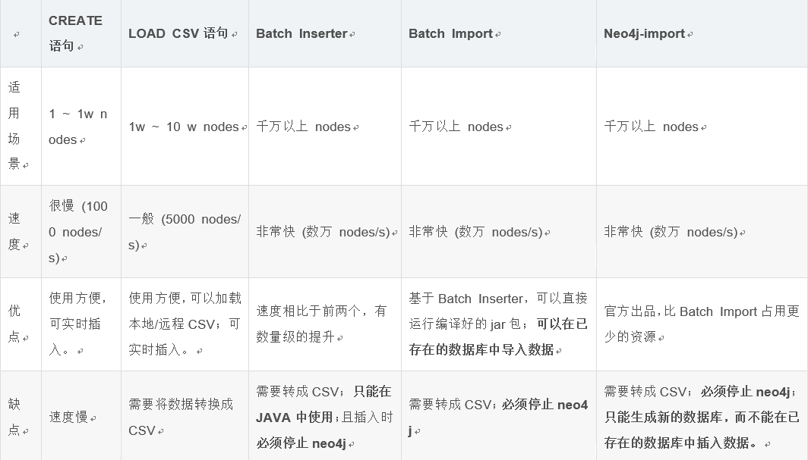

## 5.2.neo4j-import使用条件

这里我们使用neo4j-import（官方提供）来导入数据：

1、需要关闭neo4j服务器

2、无法在已有的数据库导入数据

3、要求以csv文件格式导入数据

## 5.3.参数

- --into：数据库名称

- --bad-tolerance：能容忍的错误数据条数（即超过指定条数程序直接挂掉），默认1000

- --multiline-fields：是否允许多行插入（即有些换行的数据也可读取）

- --nodes：插入节点

- --relationships：插入关系

更多参数可参考命令..\<home>/bin/neo4j-import.bat

## 5.4.CSV格式要求

### 5.4.1.节点id和label

头文件必须具有A:ID，并且可以具有多个属性和A:label值。Id是在节点创建过程中使用的唯一值，但更重要的是在创建关系时使用。Id值后来被用作：用于创建关系的StasyId ID或EndoSid ID值。ID值可以是整数或字符串，只要它们是唯一的。

标签值用于在属性图中创建标签。标签是用于将节点分组为集合的命名图形构造；所有标记为相同标签的节点属于同一集合，一个节点可以允许有多个标签，如果标签列的值相等，则默认只有存在一个标签

### 5.4.2.节点属性

节点属性放在Id和Label后面，每个属性以”,”隔开，属性值之间也需要用”,”隔开。注意，逗号不能使用中文符号的”，”否则将会报错

### 5.4.3.关系属性

表示关系的csv文件，前两个必须是:START_ID和:END_ID，分别表示关系的起始节点和终止节点，这两个字段的属性值必须与节点csv文件的ID字段属性值一样，否则会对应不上去。

## 5.5.开始导入

### 5.5.1.节点csv文件

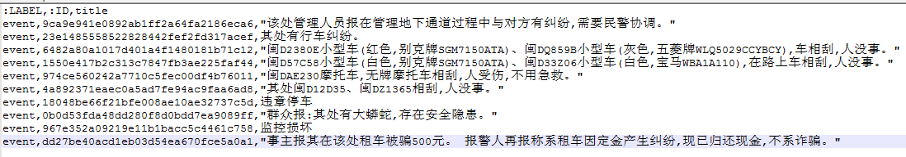

​													event1.csv文件

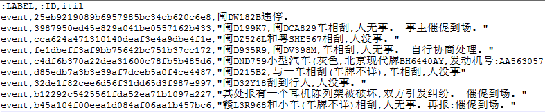

​													event2.csv文件

注意，:ID字段必须是唯一标识，该字段会被作为neo4j数据库节点的内部ID属性，导入工具依据此字段来识别节点

### 5.5.2.关系csv文件

:START_ID和:END_ID都必须存在，其属性值与事件节点的:ID的属性值对应TYPE标识关系的类型

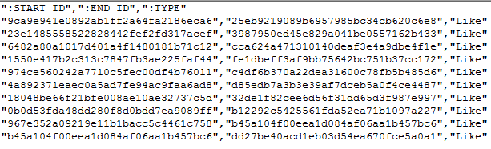

### 5.5.3.导入命令

创建一个txt文件，键入以下命令，并将文件格式改为.bat：

 ```ba
bin\neo4j-import --into data\databases\graph.db --nodes csv\event1.csv --nodes csv\event2.csv --relationships csv\relation --multiline-fields=true || pause
 ```

### 5.5.4.打包执行

将csv文件打包到一个文件夹，结合导入命令一直保存到neo4j安装位置(与bin目录同级)

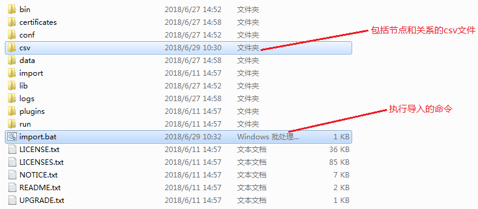

### 5.5.5.执行结果

到一个崭新的数据库中，否则将会报错。双击执行import.bat命令即可。导入完毕后重新开启neo4j数据库，在浏览器中输入[http://127.0.0.1:7474/browser/](http://127.0.0.1:7474/browser/)即可看到导入的数据:

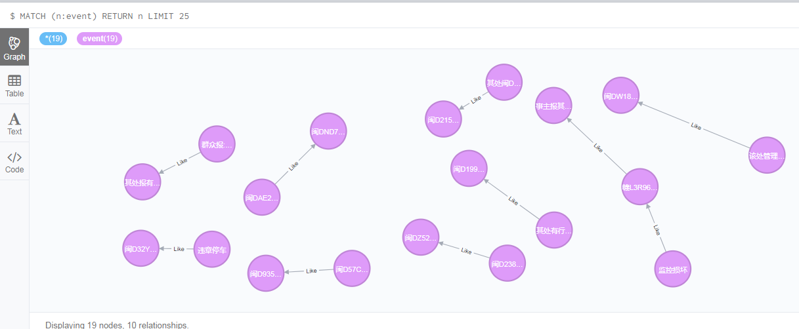

## 5.6.注意事项

### 5.6.1.多标签

- **值相同**

在节点的csv文件中，可以有多个:Label字段，表示多个标签，如果字段的值都相等，则导入工具只会保存成一个标签

- **值不同**

如果值不同，则会保存所有的不同值得标签

### 5.6.2.属性值特殊字符

如果属性值存在特殊字符如：\，/，$，！，^，&… …等，执行导入命令就会报错。处理方式是：需要加上转义字符”/”