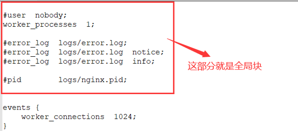
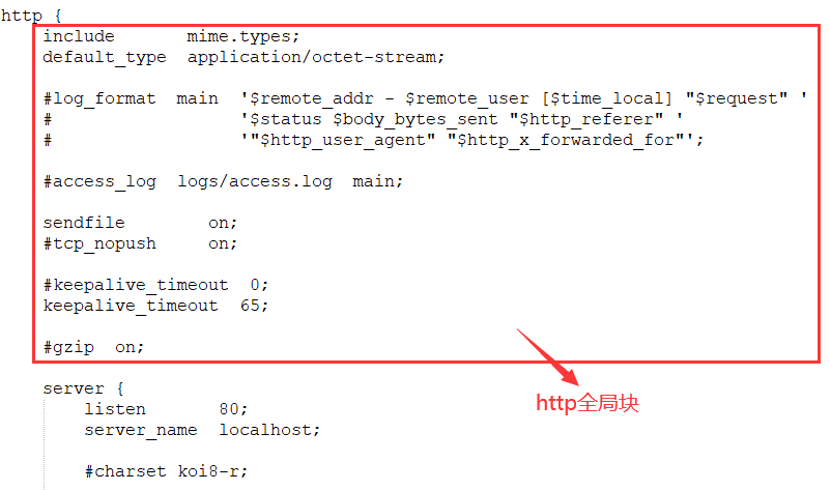

# 1.nginx安装

## 1.1.安装依赖

nginx所需依赖：gcc、PCRE pcre-devel、zlib和openSSL。执行命令：

```shell
yum install -y gcc-c++ pcre pcre-devel zlib zlib-devel openssl openssl-devel
```

## 1.2.安装nginx

①到[nginx官网](http://nginx.org/en/download.html)上下载压缩包，也可以用wget命令直接执行，前提需要先安装wget软件。完整命令：

```shell
yum install -y wget 
wget https://nginx.org/download/nginx-1.16.1.tar.gz
```

②对压缩包解压(tar -zxvf)后进入到文件目录，对文件进行检查后，编译，最后安装。默认会将nginx安装在/usr/local/nginx目录下。完整命令：

```shell
./configure
make && make install
```

③安装完后进入到sbin目录，里面包含了nginx的启动脚本，执行./nginx就可以将nginx启动。完整命令：

```shell
cd /usr/local/nginx/sbin
./nginx
```

④查看进程，nginx是否启动成功。完整命令：

```shell
ps -ef | grep nginx
```

⑤前四步就已经完成nginx的安装，如果是独立机器，访问localhost:80就可以看到nginx首页。如果是虚拟机，外部访问需要开启防火墙。完整命令：

```shell
#命令查看当前防火墙
firewall-cmd --list-all
#开启80端口
firewall-cmd --add-port=80/tcp –permanent
#重启防火墙，刷新配置
firewall-cmd –reload

```

## 1.3.常用命令

nginx的命令脚本放置在sbin目录下，名为：nginx，要执行nginx命令，就要到达sbin目录下：

①启动nginx：./nginx

②重启ngxin：./nginx -s reload

③停止nginx：

-  ./nginx -s stop(快速停止)

- ./nginx -s quit(有序停止)

# 2.nginx配置详解

nginx的配置文件放置在conf目录下，名为：nginx.conf；由三部分组成：全局块、event块、http块。

## 2.1.全局块

从配置文件开始到events块之间的内容，就属于全局块。主要设置影响**nginx**服务器整体运行的配置指令**，包括：配置运行nginx服务的用户组、允许生成的work process数、进程PID存放路径、日志存放路径与类型、以及配置文件引入等，例如：worker_processes配置，它值越大，nginx支持的并发处理量就越多。



## 2.2.events块

events块主要影响**nginx服务器与用户的网络连接**，常用设置有：是否开启在多work processes下的网络连接序列化、是否允许同时接收多个网络连接、选取何种事件驱动模型处理连接请求、每个work process可同时支持的最大连接数。例如：worker_connections 1024表示每个word process最大支持1024个连接数


## 2.3.http块

配置最频繁的部分，代理、缓存和日志定义等大多数功能和第三方模块都会配置在http块，它自身包括：http全局块和server块

### 2.3.1.http全局块

http全局块配置包括：文件引入、MIME-TYPE定义、日志自定义、连接超时时间、单链接请求上限等



### 2.3.2.server块

一个[http块](#2.3.http块)可以包含多个server块，每个server块就相当于一个虚拟主机，即一个对外服务的web服务器。server块自身还可以分为：全局server块和location块

#### 2.3.2.1.全局server块

常用于配置虚拟主机的名称、IP和监听地址

#### 2.3.2.2.location块

一个[server块](#2.3.2.server块)可以配置多个location块，它主要作用：对用户发起的请求url或域名进行匹配，对请求进行地址定向、数据缓存和应答控制等，一般的第三方模块都配置在此。location指令说明：该指定用于匹配url，语法为：

```txt
location [= | ~ | ~* | ^~ ] uri {

}
```

1. =：用于不含正则表达式的uri，要求请求路径与uri严格匹配。如果匹配成功，就停止继续向下搜索并立即处理该请求；

2. ~：表示配置的uri包含正则表达式，而且区分大小写；

3. ~*：表示配置的uri包含正则表达式，而且不区分大小写；

4. ^~：表示配置的uri不包含正则表达式，要求nginx找到uri与请求路径匹配度最高的location后，立即使用此location处理请求，而不再使用location块中的正则uri与请求路径做匹配。

**切记：**如果uri包含正则表达式，必须有“~”或“~*”标识

# 3.反向代理

## 3.1.单个虚拟主机

单个虚拟主机即单个[server块](#2.3.2.server块)的配置，通过指定监听的端口号和代理地址，就能实现反向代理：

```tex
server {
        # 表示监听80端口
        listen       80;
        server_name  localhost;
        location / {
            root   html;
            index  index.html index.htm;
            # 将请求转发到http://127.0.0.1:8080这个地址上
			  proxy_pass http://127.0.0.1:8080;
        }
}
```

## 3.2.多个虚拟主机

多个虚拟主机即多个[server块](#2.3.2.server块)配置，同时location的路径匹配可以用正则表达式来表达：当location后面的url路径增加了“~”，它的含义就是告诉nginx后面的url采用正则匹配的方式

```tex
server {
        listen       12306;
        server_name  127.0.0.1;
        # 如果请求url带有“sym”则转发到8080端口
        location ~ /sym/ {
            proxy_pass http://127.0.0.1:8080;
        }
        # 如果请求url带有“sxq”则转发到9090端口
		 location ~ /sxq/ {
            proxy_pass http://127.0.0.1:9090;
        }
   }
```

# 4.负载均衡

nginx的负载均衡需要用【upstream】来完成，它配置在[http全局块](#2.3.1.http全局块)中

## 4.1.upstream配置

通过定一个upstream块，指定我们后端服务的IP+PORT，就可以创建出后台服务组，将这个upstream配置在porxy_pass就实现负载均衡：

```tex
http{
   # 在upstream中定义后端服务器地址，并自定义名称，供代理配置引用
upstream meserver{
	   server 127.0.0.1:8080;
	   server 127.0.0.1:9090;
	}
   server {
        listen       80;
        server_name  localhost;
        location / {
           # 将upstream配置到proxy_pass里面，默认以轮询方式转发
           proxy_pass http://meserver;
        }
    }
}
```

## 4.2.负载均衡策略

### 4.2.1.轮询

【轮询】是默认配置，保证每个请求按顺序逐一分配到不同服务器，若服务器宕机，能自动剔除；

### 4.2.2.权重轮询

【权重轮询】在【轮询】基础上增加权重weight，服务器配置的weight越大被访问比率越大，分配的请求越多，常用于服务器性能不均的情况；

```tex
upstream server_pool{
	# 在服务器地址后面增加weight，并指定分值
	server 192.168.5.21 weight=10;
	server 192.168.5.22 weight=10;
}
```

### 4.2.3.ip_hash

【ip_hash】让每个请求按其IP的hash求值后分配，这样每个请求固定访问一个后端服务器，可以解决 session 的问题：

```tex
upstream server_pool{
	# 在upstream配置中增加ip_hash即可
	ip_hash;
	server 127.0.0.1:8080;
	server 127.0.0.1:9090;
}
```

### 4.2.4.fair

【fair】属于第三方负载均衡配置，它会按后端服务器的响应时间来分配请求，响应时间短的优先分配：

```tex
upstream server_pool{
	server 192.168.5.21:80;
	server 192.168.5.22:80;
	# 在upstream配置中增加fair即可
	fair;
}
```

# 5.动静分离

nginx动静分离简单来说就是把动态跟静态请求分开，可以理解成使用 Nginx处理静态页面，Tomcat 处理动态页面。主流的两种配置方案：

1. 把静态文件独立成单独的域名，放在独立的服务器上，是目前主流推崇的方案；

2. 动态跟静态文件混合在一起发布，通过 nginx 来分开

## 5.1.location配置

实际上nginx实现动静分离，就是通过location的url匹配将不同请求转发到不同服务器上，所以就把静态资源的请求转发静态资源所在服务器上即可。例如：配置nginx的`location`，如果请求路径是 `*/resources/*`，就用来映射静态资源；如果请求路径为其它，则转发到tomcat等后端服务器

# 6.nginx集群

借助keepalived部署nginx集群，安装keepalived命令， 默认安装在/etc/keepalived/目录下

`yum install keepalived -y`

# 7.openresty

OpenResty® 是一款基于 NGINX 和 LuaJIT 的 Web 平台。使用它可以容易地部署nginx