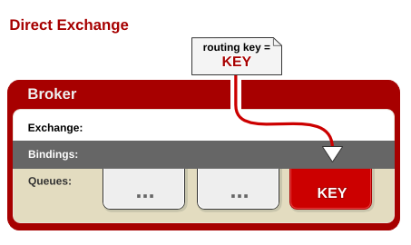
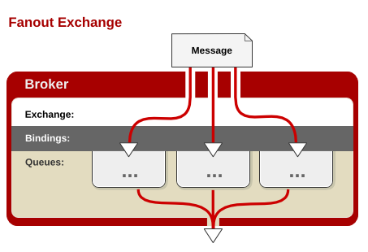
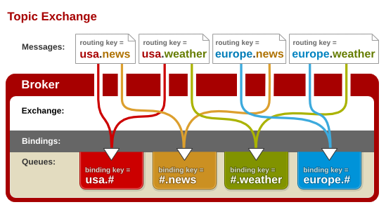
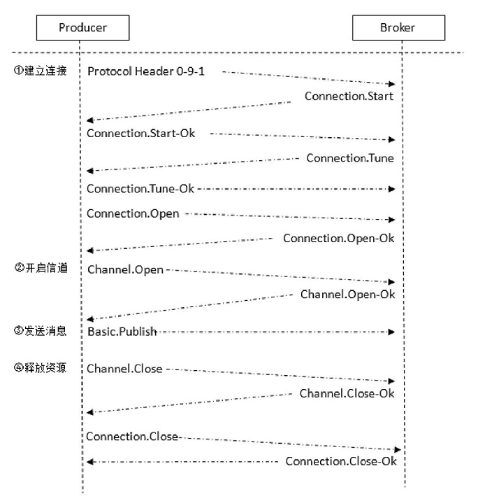
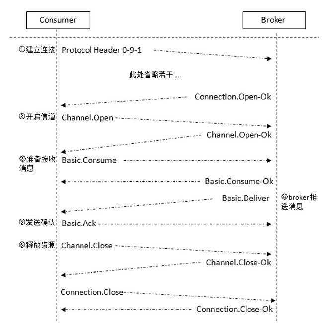
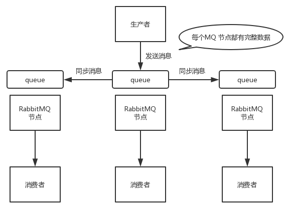
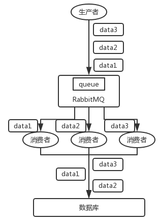
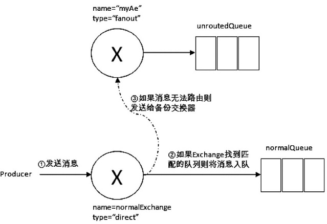
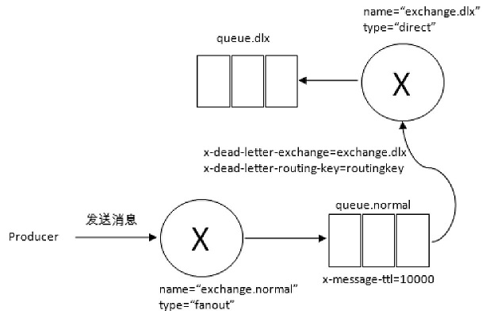

# 1.RabbitMQ简介

RabbitMQ是一个由erlang语言开发的遵循AMQP（Advanved Message Queue Protocol）规范的开源实现

## 1.1.基本概念

- **message**

即消息，它由消息头和消息体组成，其中消息体是不透明的，它存放着我们要传递的信息内容；而消息头由一系列的可选属性组成，这些属性包括routing-key（路由键）、priority（相对于其他消息的优先权）、delivery-mode（指出该消息可能需要持久性存储）等。生产者发布消息到rabbitMQ中，消费者是从rabbitMQ获取消息

****

- **queue**

即队列，**rabbitMQ中的消息只能存储在队列中**，一个消息可投入一个或多个队列，消费者可以从队列中获取消息。多个消费者可以订阅同一个队列，队列中的消息会平均分摊给各个消费者处理（即轮询），而不是每个消费者收到所有的消息（RabbitMQ不支持队列层面的广播）

队列是和交换器绑定的，生产者发送消息给rabbitMQ，其实是发给rabbitMQ中的交换器，然后交换器根据binding分发给相应的队列

****

- **exchange**

即交换器，用来接收生产者publisher发送的消息并将这些消息路由转发给服务器中的队列。它有4种类型：direct(默认)，fanout, topic, 和headers，不同类型的Exchange转发消息的策略有所区别：

**①direct**

消息message中的路由键（routing key）如果和Binding 中的binding key 一致，交换器就将消息路由转发到对应的队列中。注意：路由键与队列名需要完全匹配，如果一个队列绑定到交换机要求路由键为“dog”，则只转发routing key 标记为“dog”的消息，不会转发“dog.puppy”，也不会转发“dog.guard”等等。它是完全匹配、单播的模式



**②fanout**

可以理解为**群发**的意思。每个发到fanout 类型交换器的消息都会发到所有与其绑定的队列上去。fanout 交换器不处理路由键，只是简单的将队列绑定到交换器上，每个发送到交换器的消息都会被转发到与该交换器绑定的所有队列上。很像子网广播，每台子网内的主机都获得了一份复制的消息。fanout 类型转发消息是最快的



**③topic**

通过模式匹配来分配消息的路由键属性，将路由键和某个模式串进行匹配，此时队列需要绑定到一个模式上，规定

- RoutingKey为一个点号`.`分隔的字符串，被`.`分隔开的每一段独立的字段称为一个单词；
- 识别两个通配符：`#`和`*`，其中`#`匹配0个或多个单词，`*`匹配一个单词；



****

- binding

即绑定。用于消息队列queue和交换器exchange之间的关联。一个绑定就是基于route key（路由键）将交换器和消息队列连接起来的路由规则，所以可以将交换器理解成一个由绑定构成的路由表。 Exchange 和Queue的绑定可以是多对多的关系

****

- publisher

publisher，即消息生产者。是一个向交换器发布消息的客户端应用程序。它用于生产消息message。

****

- consumer

consumer，即消息消费者。用于从消息队列中取得消息的客户端应用程序。在消费者消费完数据后，返回给RabbitMQ ACK响应，RabbitMQ会删除队列中的该条消息。

RabbitMQ的消费模式分为两种：Push（推模式）和Pull（拉模式）。推模式采用Basic.Consumer进行消费，而拉模式则是调用Basic.Get进行消费

****

- channel

channel，即信道。多路复用连接中的一条独立的双向数据流通道。信道是建立在真实的TCP连接内的虚拟连接，AMQP 命令都是通过信道发出去的，不管是发布消息、订阅队列还是接收消息，这些动作都是通过信道完成。因为对于操作系统来说建立和销毁 TCP 都是非常昂贵的开销，所以引入了信道的概念，以复用一条 TCP 连接。

补充：为什么不直接使用TCP连接，而是使用信道？

1. TCP的创建和销毁开销特别大，创建需要3次握手，销毁需要4次分手；

2. 如果以TCP连接rabbitMQ，高峰时每秒成千上万条连接会造成资源巨大的浪费，况且操作系统每秒处理TCP连接数有限，易造成性能瓶颈

3. 信道的原理是一条线程一条通道，多条线程多条通道同用一条TCP链接。一条TCP连接可以容纳无限的信道，即使每秒成千上万的请求也不会造成性能瓶颈。

****

- virtual host

virtual host，即虚拟主机。表示一批交换器、消息队列和相关对象。虚拟主机是共享相同的身份认证和加密环境的独立服务器域。每个 vhost 本质上就是一个 mini 版的 RabbitMQ 服务器，拥有自己的队列、交换器、绑定和权限机制。vhost 是 AMQP 概念的基础，必须在连接时指定。RabbitMQ 默认的 vhost 是 /。

****

- broker

broker，即消息队列服务器实体

## 1.2.通信过程

rabbitMQ是AMQP协议的Erlang语言实现（额外还支持STOMP、MQTT协议），AMQP的模型架构和RabbitMQ的模型架构是一样的。AMQP协议分为三层：

- Module Layer，协议最高层，定义供客户端调用的命令
- Session Layer，协议中间层，负责将客户端的命令发送给服务端，再将响应返回客户端
- Transport Layer，协议最底层，负责传输二进制数据流，提供帧处理、信道复用、错误检测等

### 1.2.1.producer-broker



### 1.2.2.consumer-broker



# 2.安装&配置

由于安装使用RabbitMQ需要Erlang环境，所以不仅要下载RabbitMQ的安装包，还要下载Erlang的安装包：

①rabbitMQ下载地址：[https://www.rabbitmq.com/download.html](https://www.rabbitmq.com/download.html)

②Erlang下载地址：[http://www.erlang.org/downloads](http://www.erlang.org/downloads)

(资源包：[http://www.rabbitmq.com/releases/rabbitmq-server](http://www.rabbitmq.com/releases/rabbitmq-server))

## 2.1.window

- 下载

下载完成后，先安装Erlang环境，再安装rabbitMQ。然后配置环境变量，变量名分别为：ERLANG_HOME 、RABBITMQ_SERVER。erlang的命令目录是bin，rabbitMQ的命令目录是sbin，在path变量后面配上：%ERLANG_HOME%\bin;%RABBITMQ_SERVER%\sbin即可。以上变量配置完以后，打开cmd窗口，安装rabbitMQ的可视化插件，**执行命令：**rabbitmq-plugins enable rabbitmq_management

****

- 启动

前台启动：rabbitmq-server（当前窗口停止，rabbitmq就会停止）

后台启动：rabbitmq-server -detached

停止：rabbitmqctl stop

****

- 安装服务

如果在安装rabbitMQ过程中没有勾选RabbitMQ Server选项，则手动安装也行：

**安装服务：**rabbitmq-service install

**开始服务：**rabbitmq-service start

**停止服务：**rabbitmq-service stop

**使服务有效：**Rabbitmq-service enable

**使服务无效：**Rabbitmq-service disable 

**帮助：**rabbitmq-service help

## 2.2.linux

- 配置erlang环境

1. [erlang官网](http://www.erlang.org/downloads)下载linux版本的安装包，将它上传到服务器上。执行解压命令：

   ```shell
   tar –xvf otp_src_21.3.tar.gz
   ```

2. 切入进刚解压好的文件夹otp_src_21.3_tar.gz中，配置安装路径，执行命令：

   ```shell
   ./configure --prefix /home/erlang/erlang
   ```

3. 配置好按照路径后，进行编译和安装，执行命令：

   ```shell
   make
   make install
   ```

4. 安装完成，配置环境变量/etc/profile，执行命令：

   ```shell
   vim /etc/profile
   ```

   **增加下面的配置：**

   ```shell
   ## erlang ##
   export ERLANG_HOME=/home/erlang/erlang ##erlang安装地址
   export PATH=$ERLANG_HOME/bin:$PATH
   ```

5. 刷新配置文件/etc/profile，并测试erlang是否安装成功。执行命令：

   ```shell
   source /etc/profile
   erl
   ```

**注：**

如果是ubuntu安装，可能需要先安装环境才可以make和make install：

```shell
sudo apt-get install build-essential 

sudo apt-get install libncurses5-dev 

sudo apt-get install libssl-dev

sudo apt-get install m4 

sudo apt-get install unixodbc unixodbc-dev

sudo apt-get install freeglut3-dev libwxgtk2.8-dev 

sudo apt-get install xsltproc 

sudo apt-get install fop 

sudo apt-get install tk8.5
```

- 安装

1. centOS系列：

   安装完erlang后，就可以安装rabbitMQ，官方推荐使用rpm的方式安装。下载地址为：http://www.erlang.org/downloads

2. ubuntu系列

   ubuntu推荐使用apt联网安装，执行下面的命令：

   ```shell
   sudo apt-get install erlang-nox
   
   sudo apt-get update
   
   sudo apt-get install rabbitmq-server
   ```

- 配置

1. 启动wen管理插件，执行命令（可能其他linux发行版有区别）：

   ```shell
   sudo rabbitmqctl start_app
   
   sudo rabbitmq-plugins enable rabbitmq_management
   ```

2. 启动、停止、重启、状态

   ```shell
   sudo rabbitmq-server start
   
   sudo rabbitmq-server stop
   
   sudo rabbitmq-server restart
   
   sudo rabbitmqctl status
   ```

3. 新增用户赋予超级管理员权限

   ```shell
     sudo rabbitmqctl add_user admin admin ##新建用户
   
     sudo rabbitmqctl set_user_tags admin administrator##赋予权限
   
     ##赋予virtual host中所有资源的配置、写、读权限以便管理其中的资源，
     ##也是添加远程访问权限
     sudo rabbitmqctl set_permissions -p / admin '.*' '.*' '.*'
   ```

4. 常见操作

   ```shell
   sudo rabbitmqctl ##查看所有命令和帮助文档
   
   sudo rabbitmqctl stop ##停止服务
   
   sudo rabbitmqctl status ##查看服务状态
   
   sudo rabbitmqctl list_users ##查看当前所有用户
   
   sudo rabbitmqctl add_user username password ##添加新用户
   
   ##查看默认guest用户的权限
   sudo rabbitmqctl list_user_permissions guest 
    
   ##删掉默认用户(由于RabbitMQ默认的账号用户名和密码都是guest。为
   ##了安全起见, 可以删掉默认用户）
   sudo rabbitmqctl delete_user guest 
   
   ##设置用户tag
   sudo rabbitmqctl set_user_tags username administrator
   
   
   ##赋予用户默认vhost的全部操作权限
   sudo rabbitmqctl set_permissions -p / username ".*" ".*" ".*" 
   
   ##查看用户的权限
   sudo rabbitmqctl list_user_permissions username 
   
   
   ##User为用户名， Tag为角色名(对应于上面的administrator，
   ##monitoring，policymaker，management，或其他自定义名称)。
   rabbitmqctl set_user_tags User Tag 
   ```

# 3.高可用模式

RabbitMQ 有三种模式：单机模式、普通集群模式、镜像集群模式。其中单机模式就是demo模式，个人学习开发用的，实际生产没有哪家公司会用单机mq。

## 3.1.普通集群

普通集群模式，意思就是在多台机器上启动多个 RabbitMQ 实例，每个机器启动一个。你创建的 queue，只会放在一个 RabbitMQ 实例上，但是每个实例都同步 queue 的元数据（元数据可以认为是 queue 的一些配置信息，通过元数据，可以找到 queue 所在实例）。你消费的时候，实际上如果连接到了另外一个实例，那么那个实例会从 queue 所在实例上拉取数据过来。这个模式也不会在生产环境使用，数据只保存在一个实例上，假如这个实例宕机了，数据就丢失了；还存在数据拉取的开销、单实例性能瓶颈等问题。这种模式并不是高可用的，只为了简单提高吞吐量


## 3.2.集群镜像

这种部署方式才是RabbitMQ的高可用模式。跟普通集群模式不一样的是，在镜像集群模式下，你创建的 queue，无论元数据还是 queue 里的消息都会存在于多个实例上，就是说，每个 RabbitMQ 节点都有这个 queue 的一个完整镜像，包含 queue 的全部数据的意思。然后每次你写消息到 queue 的时候，都会自动把消息同步到多个实例的 queue 上。这个模式也存在若干问题：

- 网络带宽过高，因为每个queue的数据都需要同步到各个实例节点上；

- 没有扩展性，某个 queue 负载很重，即使增加了一个新实例，新增的机器也包含了这个 queue 的所有数据，并没有办法线性扩展。



# 4.消息丢失

一般的消息中间件的消息传输保障分为3个层级：

- At most once：最多一次，消息可能会丢失，但绝不会重复传输
- At least once：最少一次，消息绝不会丢失，但可能会重复传输
- Exactly once：精确一次，消息肯定会被传输一次，且仅传输一次

rabbitMQ只支持“最多一次”和“最少一次”，最多一次就是生产者随便发送，消费者随意消费，但有可能发生消息丢失。而最少一次就是防止消息丢失，需要考虑这四个方面：

- 生产者需要开启消息确认机制
- 生产者搭配使用mandatory和备份交换器来确保消息能从交换器路由到队列
- 消息和队列都需要持久化
- 消费者通过手动确认的方式去消费消息。

rabbitMQ在三种情况下会发生消息丢失


## 4.1.生产者

对于生产者丢失消息的场景，rabbitMQ提供了两种机制来防止：`transaction机制`和`confirm机制`。这两种机制的存储确认原理是一样的，需要等待消息落盘（Linux内核的fsync方法）后才会返回。在同步等待的方式下，comfirm机制发送一条消息需要2个交互命令：Basic.Publish和Basic.Ack；而事务机制需要3个：Basic.Publish，Tx.Commit/.Commit-OK（回滚也一样）。事务机制会多出一个帧报文的交互

- **事务，transaction机制**

  发送消息前，开启事务`channel.txSelect()`，然后发送消息，如果发送过程中出现什么异常，可以手动将事务回滚`channel.txRollback()`，所有消息发送成功后提交事务`channel.txCommit()`

- **ack，confirm机制**

  使用ACK确认机制来解决。具体步骤为：channel开启confirm模式。生产者开启 confirm 模式后，每次写的消息都会分配一个唯一的 id，然后如果写入了 RabbitMQ 中，RabbitMQ 会回传一个 ack 消息，告诉你说这个消息 ok 了；如果 RabbitMQ 没能处理这个消息，会回调你的一个 nack 接口，告诉你这个消息接收失败，就可以重试

其中，事务机制用得比较少，因为它确实大大影响到rabbitMQ的性能。在实际开发中，大部分使用的还是ack机制，它有3种实现方式：

1. **普通ack**：使用`channel.waitForConfirms()`同步等待服务端响应，这个机制跟事务机制一样会影响性能；
2. **批量ack**：每发送一批消息后，调用`channel.waitForConfirms()`，等待服务器确认返回，这种方式跟第1种方式API用的一样，只不过它需要在客户端手动维护消息集合；
3. **异步ack**：通过`channel.addConfirmListener()`来处理rabbitMQ回传的Basic.Ack和Basic.Nack报文。这种方式需要处理参数`deliveryTag`，它是标记消息的唯一有序序号，所以也需要在客户端手动维护消息集合。

需要注意一点，comfirm机制和transaction机制它们保障的是消息能被发送到rabbitMQ的交换器，如果这个交换器没有任何队列与其匹配，那么消息实际也会丢失。

## 4.2.服务端

- 消息持久化

解决第二种消息丢失，即RabbitMQ自己把消息弄丢了，这种情况就要使用消息持久化来解决。具体步骤：开启 RabbitMQ 的持久化，消息写入之后会持久化到磁盘，哪怕是 RabbitMQ 自己挂了，恢复之后会自动读取之前存储的数据，这样基本可以保证消息不丢。但是，如果RabbitMQ 还没持久化，自己就挂了，可能还是会导致少量数据丢失，但是这个概率较小。RabbitMQ设置持久化有两个步骤：

1. 创建 queue 的时候将其设置为持久化。保证 RabbitMQ 持久化 queue 的元数据，但是它是不会持久化 queue 里的数据；

2. 发送消息的时候将消息的 deliveryMode 设置为 2，此时 RabbitMQ 就会将消息持久化到磁盘上去

****

- 搭建镜像模式

解决第二种消息丢失，虽然开启了消息持久化，但还是可能发生消息还未持久化，它就宕机了。所以用RabbitMQ的高可用模式：镜像集群模式，让数据保存到各个实例上，防止一个实例宕机而使消息丢失。

## 4.3.消费者

解决第三种问题，消息已发送给消费者，但是消费者自己宕机了，导致MQ认为消息已消费了，实际上消息却丢失了。这种情况要开启消息补偿机制：关闭 RabbitMQ 的自动 ack，然后每次业务代码确保处理完的时候，再在程序里 ack回应MQ消息已消费。这样的话，如果还没处理完(或宕机)就不会回应RabbitMQ，RabbitMQ 就会认为该消息未被消息，它就会把这个消费分配给别的消费者去处理，消息是不会丢的。

# 5.消息消费

consumer可以通过`推模式`或者`拉模式`的方式来获取rabbitmq中的消息，当consumer处理完需要手动确认消息已被接口，这样rabbitMQ才能把该消息从当前队列中标记清除。如果确实不能消费当前消息，可以通过`channel.basicNack()`或者`channel.basicReject()`拒绝。

## 5.1.消息分发

当一个队列存在多个消费者时，队列中的消息将以轮询的分发方式发送给消费者，每条消息只会发送给订阅列表里的一个消费者。这种方式适合扩展，当消费端服务器负载加重时，创建更多的消息者一起消费即可；但是，轮询的方式并没有考虑消费者消费消息的实际情况，部分消息者已经负载很重，但是部分消息者很空闲，如果还是以轮询的方式分发消息，会造成整体应用吞吐量的下降。

这种情况下，可以使用`channel.basicQos()`来解决，消费端调用这个方法告诉rabbitMQ我这台机器最大消费上限。当mq为这个消费者发送完一条消息时，它就会为其计数加1，一旦达到了指定的上限值，rabbitMQ就不会再向这个消费者发送任何消息，而消费者自身如果ack确认消费了一条消息，rabbitMQ就会将计数减1，然后再为它分发消息直到又达到上限值。通过动态的计数，来确定消息的分发，消费者自己要估量好自身的消费水平。（Basic.Qos对拉模式的消费方式无效）

```java
// basicQos有3个重载方法, 主要是对3个参数的设值：
// prefetchCount：为0表示无上限, 大于0表示最大消费上限, 一旦计数大于等于此值, mq就不会为其推送消息
// prefetchSize：表示消费者所能接收未确认消息的总体大小上限，为0表示没有上限
void basicQos(int prefetchCount) throws IOException;
void basicQos(int prefetchCount, boolean global) throws IOException;
void basicQos(int prefetchSize, int prefetchCount, boolean global) throws IOException;
```

注意`channel.basicQos()`是基于信道来控制的，一个信道可以开启多个消费者，所以通过此信道开启的消费者都会受到参数`prefetchCount`的上限控制。实际上，信道支持多个消费者，其本质就是可以同时消费多个queue，这样子信道channel就需要和各个队列协调，以确保发送的消息**都**没有超过上限值（每个queue都不能超）当队列分散在集群中的多个Broker节点，会影响rabbitMQ的性能。所以在AMQP 0-9-1协议上，rabbitMQ重新定义了global参数：

- true：信道上**所有消费者**都需要遵从 prefetchCount 指定的上限值
- false：信道上**新的消费者**都需要遵从 prefetchCount 指定的上限值，默认值。

## 5.2.消息顺序

消息顺序性好理解，就是要保证消息的消费是有序的，例如：数据从一个 mysql 库原封不动地同步到另一个 mysql 库里面，mysql 里增删改一条数据，对应出来了增删改 3 条 binlog 日志，接着这三条 binlog 发送到 MQ 里面，再消费出来依次执行，如果这时候不能保证消息顺序性，本来是：增加、修改、删除，却换了顺序给执行成删除、修改、增加，则这条记录就错了。

### 5.2.1.出现场景

RabbitMQ消息顺序错乱的场景：

- 生产者开启事务机制或确认机制，当异常发生后消息重发，就可能会出现错序；
- 消费者如果拒绝消费消息，当消息被重新入队后，就会被重新分发，也有可能出现错序；
- 多个消费者，每个消费者处理消息的速度不一样。当生产者向 rabbitMQ 里发送了三条数据，顺序依次是 data1、data2、data3。有三个消费者分别从 MQ 中消费这三条数据中的一条，结果消费者2先执行完操作，把 data2 存入数据库，然后是 data1/data3。



### 5.2.2.解决方案

- `单线程`消费保证消息的顺序性；
- 消息进行`编号`，消费者处理消息是根据编号处理消息；
- 一个队列对应一个 consumer，然后这个 consumer 内部用内存队列做排队，然后分发给底层不同的 worker 来处理，这样子就把消息的有序性转移到业务代码来实现。

# 6.实际运用

## 6.1.消息存储

RabbitMQ的消息，路由器等信息默认都位于内存中，要想让rabbitMQ持久化消息，需要同时满足3个条件：

- 使用持久化模式投递消息
- 目标交换器配置为持久的
- 目标队列配置为持久的

RabbitMQ持久化消息的常见方式是写日志：

1. 当一条持久化消息发送到持久化的Exchange上时，RabbitMQ会在消息提交到日志文件后，才发送ACK响应
2. 一旦消息被消费后，RabbitMQ会将日志中该条消息标记为等待垃圾收集，之后再从日志中清除
3. 若出现故障，自动重建Exchange、Binding和Queue，同时通过重播持久化日志来恢复消息

## 6.2.备份交换器

备份交换器，Alternate Exchange，简称AE。生产者可以在发送消息时设置mandatory参数，当消息未被投递到任何队列，若此参数为true则需要添加ReturnListener监听逻辑，当此参数为false则消息被丢弃。还有一种方式，可以把消息暂存到备份交换器，等需要的时候再去处理这些消息，消息流转过程如下：




通过在声明交换器（调用Channel.exchangeDeclare方法）时添加`alternate-exchange`参数来实现，也可以通过策略（Policy）实现，前者的优先级更高，会覆盖掉Policy的配置

```java
// 额外的参数, 通过alternate-exchange参数指定备份交换器的名称
Map<String, Object> args = new HashMap<>();
args.put("alternate-exchange", "myAe");
// 将参数设置到正常的交换器中
channel.exchangeDeclare("orderExchange", "direct", true, false, args);
// 再定义备份交换器
channel.exchangeDeclare("myAe", "fanout", true, false, null);

// ...上面代码执行完以后, 正常的交换器orderExchange就会存在一个备份交换器myAe.
// ...下面省略队列的创建和绑定
```

- 如果设置的备份交换器不存在，客户端和RabbitMQ服务单都不会有异常情况，消息丢失
- 如果备份交换器没有绑定任何队列，客户端和RabbitMQ服务端都不会有异常出现，消息丢失
- 如果备份交换器没有任何匹配的队列，客户端和RabbitMQ服务端都不会有异常出现，消息丢失
- 如果备份交换器和`mandatory`参数一起使用，那么`mandatory`参数无效

## 6.3.死信队列

死信队列（可用于延迟队列实现）DLX，全称为Dead-Letter-Exchange，称之为死信交换器。当一个消息在一个队列中变成死信（Dead Message）之后，它就可以被重新发送到另一个交换器中，这个交换器就是DLX，绑定DLX的队列就称为死信队列。通过在channel.queueDeclare()方法中设置`x-dead-letter-exchange`参数来为这个队列添加DLX。消息变成死信一般有以下几种情况：

- 消息被拒绝，Basic.Reject或者Basic.Nack，并且requeue参数为false;
- 消息过期
- 队列达到最大长度



## 6.4.优先级队列

具有高优先级的队列具有高的优先权，优先级高的消息具备优先被消费的特权。可以通过`x-max-priority`参数设置队列的优先级

```java
// 创建一个高优先级的队列
Map<String, Object> args = new HashMap<>();
args.put("x-max-priority", 10);
channel.queueDeclare("queue.priority", true, false, false, args)
```

除此之外，需要在发送消息中设置消息当前的优先级，默认最低为0，最高为队列设置的最大优先级，优先级高的消息可以被优先消费，前提是消息存在堆积的情况（消息很快就被消费完了，设置优先级也没用）

```java
AMQP.BasicProperties.Builder builder = new AMQP.BasicProperties.Builder();
builder.prioprity(5);
AMQP.BasicProperties properties = builder.build();
channel.basicPublish("exchange_priority","rk",properties, "data".getBytes());
```
