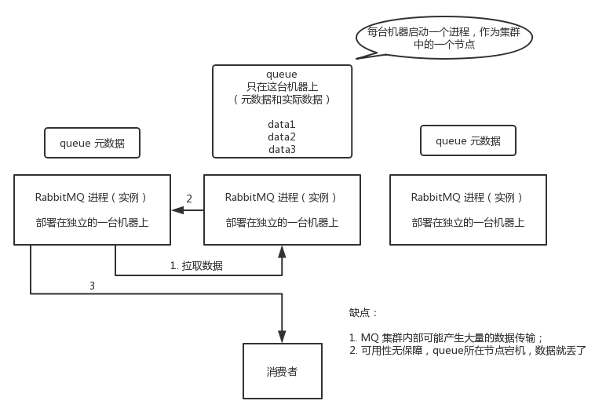
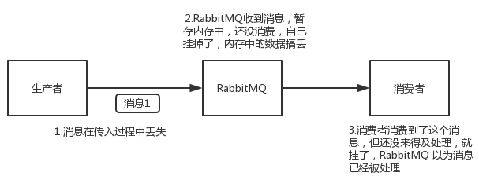

# 1.RabbitMQ简介

RabbitMQ是一个由erlang语言开发的遵循AMQP(Advanved Message Queue Protocol)规范的开源实现。

## 1.1.基本概念

### 1.1.1.message

message，即消息。它由消息头和消息体组成，其中消息体是不透明的，它存放着我们要传递的信息内容；而消息头由一系列的可选属性组成，这些属性包括routing-key（路由键）、priority（相对于其他消息的优先权）、delivery-mode（指出该消息可能需要持久性存储）等。生产者发布消息到rabbitMQ中，消费者是从rabbitMQ获取消息。

### 1.1.2.queue

queue，即消息队列。用来保存消息message直到发送给消费者。它是消息的容器，也是消息的终点。一个消息可投入一个或多个队列。消息一直在队列里面，等待消费者连接到这个队列将其取走。

队列是和交换器绑定的，生产者发送消息给rabbitMQ，其实是发给rabbitMQ中的交换器，然后交换器根据binding分发给相应的队列。队列可以有多个消费者，rabbitMQ默认以均摊的方式给多个消费者处理（若有2个消费者，均摊的意思是：消费者1处理一条消息，消费者2消费一条消息，消费者1处理一条消息...轮流着处理）。

### 1.1.3.exchange

exchange，即交换器。用来接收生产者publisher发送的消息并将这些消息路由转发给服务器中的队列。 Exchange有4种类型：direct(默认)，fanout, topic, 和headers，不同类型的Exchange转发消息的策略有所区别**：**

**①direct**

消息message中的路由键（routing key）如果和Binding 中的binding key 一致，交换器就将消息路由转发到对应的队列中。注意：路由键与队列名需要完全匹配，如果一个队列绑定到交换机要求路由键为“dog”，则只转发routing key 标记为“dog”的消息，不会转发“dog.puppy”，也不会转发“dog.guard”等等。它是完全匹配、单播的模式。


**②fanout**

 fanout，可以理解为**群发**的意思。每个发到fanout 类型交换器的消息都会发到所有与其绑定的队列上去。fanout 交换器不处理路由键，只是简单的将队列绑定到交换器上，每个发送到交换器的消息都会被转发到与该交换器绑定的所有队列上。很像子网广播，每台子网内的主机都获得了一份复制的消息。fanout 类型转发消息是最快的


**③topic**

topic 交换器通过模式匹配分配消息的路由键属性，将路由键和某个模式进行匹配，此时队列需要绑定到一个模式上。路由键为一个句点号“. ”分隔的字符串（被句点号“. ”分隔开的每一段独立的字符串称为一个单词），如“stock.usd.nyse”、“nyse.vmw”、“quick.orange.rabbit”。它同样也会识别两个通配符：#和*。“#”匹配0个或多个单词，“*”匹配一个单词。


### 1.1.4.binding

binding，即绑定。用于[消息队列queue](#1.1.2.queue)和[交换器exchange](#1.1.3.exchange_1)之间的关联。一个绑定就是基于route key（路由键）将交换器和消息队列连接起来的路由规则，所以可以将交换器理解成一个由绑定构成的路由表。 Exchange 和Queue的绑定可以是多对多的关系。

### 1.1.5.publisher

publisher，即消息生产者。是一个向[交换器](#1.1.3.exchange)发布消息的客户端应用程序。它用于生产消息message。

### 1.1.6.consumer

consumer，即消息消费者。用于从消息队列中取得消息的客户端应用程序

### 1.1.7.channel

channel，即信道。多路复用连接中的一条独立的双向数据流通道。信道是建立在真实的TCP连接内的虚拟连接，AMQP 命令都是通过信道发出去的，不管是发布消息、订阅队列还是接收消息，这些动作都是通过信道完成。因为对于操作系统来说建立和销毁 TCP 都是非常昂贵的开销，所以引入了信道的概念，以复用一条 TCP 连接。

补充：为什么不直接使用TCP连接，而是使用信道？

1. TCP的创建和销毁开销特别大，创建需要3次握手，销毁需要4次分手；

2. 如果以TCP连接rabbitMQ，高峰时每秒成千上万条连接会造成资源巨大的浪费，况且操作系统每秒处理TCP连接数有限，易造成性能瓶颈

3. 信道的原理是一条线程一条通道，多条线程多条通道同用一条TCP链接。一条TCP连接可以容纳无限的信道，即使每秒成千上万的请求也不会造成性能瓶颈。

### 1.1.8.virtual host

virtual host，即虚拟主机。表示一批交换器、消息队列和相关对象。虚拟主机是共享相同的身份认证和加密环境的独立服务器域。每个 vhost 本质上就是一个 mini 版的 RabbitMQ 服务器，拥有自己的队列、交换器、绑定和权限机制。vhost 是 AMQP 概念的基础，必须在连接时指定。RabbitMQ 默认的 vhost 是 /。

### 1.1.9.broker

broker，即消息队列服务器实体

# 2.安装&配置

由于安装使用RabbitMQ需要Erlang环境，所以不仅要下载RabbitMQ的安装包，还要下载Erlang的安装包：

①rabbitMQ下载地址：[https://www.rabbitmq.com/download.html](https://www.rabbitmq.com/download.html)

②Erlang下载地址：[http://www.erlang.org/downloads](http://www.erlang.org/downloads)

(资源包：http://www.rabbitmq.com/releases/rabbitmq-server)

## 2.1.window

- 下载

下载完成后，先安装Erlang环境，再安装rabbitMQ。然后配置环境变量，变量名分别为：ERLANG_HOME 、RABBITMQ_SERVER。erlang的命令目录是bin，rabbitMQ的命令目录是sbin，在path变量后面配上：%ERLANG_HOME%\bin;%RABBITMQ_SERVER%\sbin即可。以上变量配置完以后，打开cmd窗口，安装rabbitMQ的可视化插件，**执行命令：**rabbitmq-plugins enable rabbitmq_management

- 启动

前台启动：rabbitmq-server（当前窗口停止，rabbitmq就会停止）

后台启动：rabbitmq-server -detached

停止：rabbitmqctl stop

- 安装服务

如果在安装rabbitMQ过程中没有勾选RabbitMQ Server选项，则手动安装也行：

**安装服务：**rabbitmq-service install

**开始服务：**rabbitmq-service start

**停止服务：**rabbitmq-service stop

**使服务有效：**Rabbitmq-service enable

**使服务无效：**Rabbitmq-service disable 

**帮助：**rabbitmq-service help

## 2.2.linux

- 配置erlang环境

1. [erlang官网](http://www.erlang.org/downloads)下载linux版本的安装包，将它上传到服务器上。执行解压命令：

   ```shell
   tar –xvf otp_src_21.3.tar.gz
   ```

2. 切入进刚解压好的文件夹otp_src_21.3_tar.gz中，配置安装路径，执行命令：

   ```shell
   ./configure --prefix /home/erlang/erlang
   ```

3. 配置好按照路径后，进行编译和安装，执行命令：

   ```shell
   make
   make install
   ```

4. 安装完成，配置环境变量/etc/profile，执行命令：

   ```shell
   vim /etc/profile
   ```

   **增加下面的配置：**

   ```shell
   ## erlang ##
   export ERLANG_HOME=/home/erlang/erlang ##erlang安装地址
   export PATH=$ERLANG_HOME/bin:$PATH
   ```

5. 刷新配置文件/etc/profile，并测试erlang是否安装成功。执行命令：

   ```shell
   source /etc/profile
   erl
   ```

**注：**

如果是ubuntu安装，可能需要先安装环境才可以make和make install：

```shell
sudo apt-get install build-essential 

sudo apt-get install libncurses5-dev 

sudo apt-get install libssl-dev

sudo apt-get install m4 

sudo apt-get install unixodbc unixodbc-dev

sudo apt-get install freeglut3-dev libwxgtk2.8-dev 

sudo apt-get install xsltproc 

sudo apt-get install fop 

sudo apt-get install tk8.5
```

- 安装

1. centOS系列：

   安装完erlang后，就可以安装rabbitMQ，官方推荐使用rpm的方式安装。下载地址为：http://www.erlang.org/downloads

2. ubuntu系列

   ubuntu推荐使用apt联网安装，执行下面的命令：

   ```shell
   sudo apt-get install erlang-nox
   
   sudo apt-get update
   
   sudo apt-get install rabbitmq-server
   ```

- 配置

1. 启动wen管理插件，执行命令（可能其他linux发行版有区别）：

   ```shell
   sudo rabbitmqctl start_app
   
   sudo rabbitmq-plugins enable rabbitmq_management
   ```

2. 启动、停止、重启、状态

   ```shell
   sudo rabbitmq-server start
   
   sudo rabbitmq-server stop
   
   sudo rabbitmq-server restart
   
   sudo rabbitmqctl status
   ```

3. 新增用户赋予超级管理员权限

   ```shell
     sudo rabbitmqctl add_user admin admin ##新建用户
   
     sudo rabbitmqctl set_user_tags admin administrator##赋予权限
   
     ##赋予virtual host中所有资源的配置、写、读权限以便管理其中的资源，
     ##也是添加远程访问权限
     sudo rabbitmqctl set_permissions -p / admin '.*' '.*' '.*'
   ```

4. 常见操作

   ```shell
   sudo rabbitmqctl ##查看所有命令和帮助文档
   
   sudo rabbitmqctl stop ##停止服务
   
   sudo rabbitmqctl status ##查看服务状态
   
   sudo rabbitmqctl list_users ##查看当前所有用户
   
   sudo rabbitmqctl add_user username password ##添加新用户
   
   ##查看默认guest用户的权限
   sudo rabbitmqctl list_user_permissions guest 
   
    
   ##删掉默认用户(由于RabbitMQ默认的账号用户名和密码都是guest。为
   ##了安全起见, 可以删掉默认用户）
   sudo rabbitmqctl delete_user guest 
   
   
   ##设置用户tag
   sudo rabbitmqctl set_user_tags username administrator
   
    
   
   ##赋予用户默认vhost的全部操作权限
   sudo rabbitmqctl set_permissions -p / username ".*" ".*" ".*" 
   
   ##查看用户的权限
   sudo rabbitmqctl list_user_permissions username 
   
   
   ##User为用户名， Tag为角色名(对应于上面的administrator，
   ##monitoring，policymaker，management，或其他自定义名称)。
   rabbitmqctl set_user_tags User Tag 
   ```

# 3.高可用性

RabbitMQ 有三种模式：单机模式、普通集群模式、镜像集群模式

## 3.1.单机模式

就是demo模式，个人学习开发用的，实际生产没有哪家公司会用单机MQ

## 3.2.普通集群模式

普通集群模式，意思就是在多台机器上启动多个 RabbitMQ 实例，每个机器启动一个。你创建的 queue，只会放在一个 RabbitMQ 实例上，但是每个实例都同步 queue 的元数据（元数据可以认为是 queue 的一些配置信息，通过元数据，可以找到 queue 所在实例）。你消费的时候，实际上如果连接到了另外一个实例，那么那个实例会从 queue 所在实例上拉取数据过来



这个模式也不会在生产环境使用，数据只保存在一个实例上，假如这个实例宕机了，数据就丢失了；还存在数据拉取的开销、单实例性能瓶颈等问题。这种模式并不是高可用的，只为了简单提高吞吐量

## 3.3.集群镜像模式

这种部署方式才是RabbitMQ的高可用模式。跟普通集群模式不一样的是，在镜像集群模式下，你创建的 queue，无论元数据还是 queue 里的消息都会存在于多个实例上，就是说，每个 RabbitMQ 节点都有这个 queue 的一个完整镜像，包含 queue 的全部数据的意思。然后每次你写消息到 queue 的时候，都会自动把消息同步到多个实例的 queue 上：


这个模式也有问题：

①网络带宽过高，因为每个queue的数据都需要同步到各个实例节点上；

②没有扩展性，某个 queue 负载很重，即使增加了一个新实例，新增的机器也包含了这个 queue 的所有数据，并没有办法线性扩展。

# 4.消息丢失

rabbitMQ在三种情况下会发生消息丢失：



针对这三种消息丢失的情况采取不同的措施

## 4.1.ack确认机制

解决第一种消息丢失，即消息在传输给MQ的时候就丢失了，这种情况就要使用ACK确认机制来解决。具体步骤为：开启confirm模式。生产者开启 confirm 模式后，每次写的消息都会分配一个唯一的 id，然后如果写入了 RabbitMQ 中，RabbitMQ 会回传一个 ack 消息，告诉你说这个消息 ok 了；如果 RabbitMQ 没能处理这个消息，会回调你的一个 nack 接口，告诉你这个消息接收失败，就可以重试。

(最好不要用RabbitMQ的事务，因为事务机制是同步的，提交一个事务之后会阻塞在那儿，但是 confirm 机制是异步的，发送一个消息之后就可以发送下一个消息，然后那个消息 RabbitMQ 接收了之后会异步回调接口，通知这个消息接收到了)

## 4.2.消息持久化

解决第二种消息丢失，即RabbitMQ自己把消息弄丢了，这种情况就要使用消息持久化来解决。具体步骤：开启 RabbitMQ 的持久化，消息写入之后会持久化到磁盘，哪怕是 RabbitMQ 自己挂了，恢复之后会自动读取之前存储的数据，这样基本可以保证消息不丢。但是，如果RabbitMQ 还没持久化，自己就挂了，可能还是会导致少量数据丢失，但是这个概率较小。RabbitMQ设置持久化有两个步骤：

1. 创建 queue 的时候将其设置为持久化。保证 RabbitMQ 持久化 queue 的元数据，但是它是不会持久化 queue 里的数据；

2. 发送消息的时候将消息的 deliveryMode 设置为 2，此时 RabbitMQ 就会将消息持久化到磁盘上去

## 4.3.设置镜像模式

解决第二种消息丢失，虽然开启了消息持久化，但还是可能发生消息还未持久化，它就宕机了。所以用RabbitMQ的高可用模式：镜像集群模式，让数据保存到各个实例上，防止一个实例宕机而使消息丢失

## 4.4.消息补偿机制

解决第三种问题，消息已发送给消费者，但是消费者自己宕机了，导致MQ认为消息已消费了，实际上消息却丢失了。这种情况要开启消息补偿机制：关闭 RabbitMQ 的自动 ack，然后每次业务代码确保处理完的时候，再在程序里 ack回应MQ消息已消费。这样的话，如果还没处理完(或宕机)就不会回应RabbitMQ，RabbitMQ 就会认为该消息未被消息，它就会把这个消费分配给别的消费者去处理，消息是不会丢的。

# 5.消息顺序性

消息顺序性好理解，就是要保证消息的消费是有序的，例如：数据从一个 mysql 库原封不动地同步到另一个 mysql 库里面，mysql 里增删改一条数据，对应出来了增删改 3 条 binlog 日志，接着这三条 binlog 发送到 MQ 里面，再消费出来依次执行，如果这时候不能保证消息顺序性，本来是：增加、修改、删除，却换了顺序给执行成删除、修改、增加，则这条记录就错了。

## 5.1.出现场景

RabbitMQ消息顺序错乱的场景：

一个 queue有多个 consumer，比如，生产者向 RabbitMQ 里发送了三条数据，顺序依次是 data1/data2/data3，压入的是 RabbitMQ 的一个内存队列。有三个消费者分别从 MQ 中消费这三条数据中的一条，结果消费者2先执行完操作，把 data2 存入数据库，然后是 data1/data3。


## 5.2.解决方案

一个 queue 但是对应一个 consumer，然后这个 consumer 内部用内存队列做排队，然后分发给底层不同的 worker 来处理，这样子就把消息的有序性转移到业务代码来实现。

# *.java客户端

Java操作rabbitMQ，需要引入驱动的pom依赖：

```xml
<dependency>
    <groupId>com.rabbitmq</groupId>
    <artifactId>amqp-client</artifactId>
    <version>5.5.0</version>
</dependency>
```

## *.1.连接rabbitMQ

Java客户端提供下面3个来连接rabbitMQ服务器：

①TCP连接工厂：com.rabbitmq.client.ConnectionFactory

②TCP连接：com.rabbitmq.client.Connection

③信道：com.rabbitmq.client.Channel

Connection是RabbitMQ的socket链接，它封装了socket协议相关部分逻辑；ConnectionFactory是Connection的制造工厂。而Channel是实际操作rabbitMQ的工具类，可以创建交换器、创建队列、发送消息和接收消息等...

```java
ConnectionFactory factory = new ConnectionFactory();
factory.setUsername("guest");//默认用户名
factory.setPassword("guest");//默认密码
factory.setVirtualHost("/");//默认虚拟主机
factory.setHost("127.0.0.1");//设置rabbitMQ服务器地址
factory.setPort(5672);//设置rabbitMQ服务器端口
Connection conn = factory.newConnection();//获取一个连接
Channel channe = conn.createChannel();//获取一个通道
```

**注意：**

1. Connection底层协议是为长时间运行的连接而设计和优化的，意味着它是一个长连接。官网建议，不要操作一次就开启关闭一个连接，这会导致大量的网络往返和开销。一个Connection关闭，由它获取的Channel都会被关闭。

2. Channel也是一个长连接，它是基于Connection连接的，所以Channel的连接寿命可能比Connection的连接寿命短。一般情况下，我们操作流这种IO都会用完关闭它，但是在rabbitMQ客户端中关闭和打开每个操作的Channel通常是不必要的，但可以适当地关闭它。

## *.2.创建交换器

```java
channel.exchangeDeclare("user-exchange", BuiltinExchangeType.DIRECT, true, false, null);
```

**参数含义：**

①交换器名称

②交换器类型，枚举类BuiltinExchangeType中的类型

③配置该交换器是否可以持久化，true表示可持久化

④配置该交换器是否可以自动删除，true表示可以自动删除

⑤创建交换器需要的额外参数，如果有，用Map封装

## *.3.创建队列

```java
channel.queueDeclare("user-one", true, false, false, null);
```

**参数含义：**

①队列名称

②配置该队列是否可以被持久化，true为可以

③配置该队列是否被一个交换器独占，true表示可以

④配置该队列是否可以被自动删除，true表示可以

⑤创建该队列需要的额外参数，如果有，用Map封装

## *.4.绑定交换器和队列

```java
channel.queueBind("user-one", "user-exchange", "one", null);
```

**参数含义：**

①待绑定的队列名称

②待绑定的交换器名称

③绑定规则，用哪个路由键关联交换器和队列

④绑定用到的额外参数

## *.5.发送消息

```java
channel.basicPublish("user-exchange","one",null,msg.getBytes());
```

**参数含义：**

①交换器名称，表示消息要发送给哪个交换器

②消息的路由键信息

③消息头的其他属性，消息头的创建如下面所示：

④具体的消息内容，需要转成字节数组

```java
AMQP.BasicProperties props = new AMQP.BasicProperties.Builder()
        .contentType("text.json")
        .contentEncoding("utf-8")
        .timestamp(new Date()).build();
```

## *.6.接收消息

```java
String s = channel.basicConsume("user-one", true,new DefaultConsumer(channel) {
       @Override
       public void handleDelivery(String consumerTag, Envelope envelope, 
                AMQP.BasicProperties properties, byte[] body) throws IOException {
           System.out.println("consumerTag="+consumerTag);
           System.out.println("envelope="+envelope.toString());
           System.out.println("properties="+properties.toString());
           System.out.println("收到的消息为="+new String(body));
       }
});
```

接收消息需要创建一个Consumer对象，DefaultConsumer是Consumer接口的实现类，通过创建它并且重写handleDelivery()方法就可以接收消息。**basicConsume()的参数含义：**

①" user-one "，表示队列名，表示从哪个队列中获取消息

②获取消息是否要回馈给服务器，如果为true表示要回馈，服务器就会删掉队列里的相应消息

③处理消息的对象