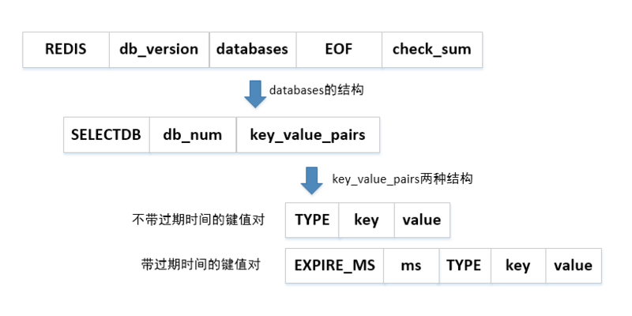

# 1.redis线程模型

## 1.1.redis为啥那么快?

redis的请求响应的是非常快的，主要原因有：

①纯内存操作；

②基于I/O多路复用机制，可以支持高并发量的请求；

③单线程执行命令，避免CPU上下文切换的消耗。

## 1.2.单线程模型

都知道redis是单线程，那这个单线程到底“单”在哪里？首先需要了解一种服务端的设计模式—Reactor模式。操作系统如linux支持select、poll、epoll函数可以管理多个socket连接，并在socket连接有请求时将其以I/O事件的形式响应出来，交由事件分发器去派发，事件执行完毕后响应回socket连接上。redis 内部使用文件事件处理器 file event handler，这个文件事件处理器是单线程的(所以 redis 才叫单线程的模型)。它采用 IO 多路复用机制同时监听多个 socket，将产生事件的 socket 压入内存队列中，事件分派器根据 socket 上的事件类型来选择对应的事件处理器进行处理。文件事件处理器的结构分为4个部分：

①多个socket；

②I/O多路复用程序；

③文件事件派发器；

④事件处理器(连接应答处理器、命令请求处理器、命令回复处理器)


# 2.redis数据结构

## 2.1.数据类型

redis数据类型和redis数据结构是两码事，redis类型是提供给用户选择使用的，而数据结构是底层支撑数据类型的C语言实现的结构体。redis有5种数据类型：

<table>
  <tr>
  	<th>数据类型</th>
    <th>描述</th>
    <th>场景</th>
  </tr>
  <tr>
  	<td width='25%'>string(字符串)</td>
    <td width='50%'>redis中最基础、最常用的数据类型。字符串在redis中是二进制安全的，这便意味着该类型存入和获取的数据相同；最多可以容纳的数据长度是512M</td>
    <td>1.统计网站访问数量和
当前在线人数等；
</td>
  </tr>
  <tr>
  	<td>hash(散列表)</td>
    <td>把多个key-value存储到一个Key上，可以用来储存java对象，每一个Hash可以存储4294967295个键值对</td>
    <td>存储用户信息</td>
  </tr>
  <tr>
  	<td>list(列表)</td>
    <td>list数据类型采用双向链表，可以存储多个有序且重复的字符串，每个字符串称为“元素”，可以通过下标来获取每个元素（下标从0开始计数）。一个列表最多可以存储232-1个元素</td>
    <td>①最新消息排行榜<br/>②任务队列<br/>③做大数据集合的增删
</td>
  </tr>
  <tr>
  	<td>set(集合)</td>
    <td>用来保存多个字符串元素，但是与list不同，set中不允许有重复元素而且集合内的元素是无序的，无法通过下标获取元素。集合最大的优势在于可以进行交集、并集和差集操作如unions、intersections和differences。
集合最多可以存储232-1个元素</td>
    <td>①利用交集求共同好友<br/>②利用唯一性，可以统计访问网站的所有独立IP
</td>
  </tr>
  <tr>
  	<td>sort zet(有序集合)</td>
    <td>它和集合set相似，保留了集合不能有重复元素的特性，但是它的元素是可以排序的。sorted set为每个元素关联一个权，通过权值作为排序的依据，还可以有序的获取集合中的元素。这个权是double类型的分数。redis正是通过分数来为集合中的成员进行从小到大的排序。有序集合的成员是唯一的，但分数(score)却可以重复</td>
    <td>排行榜</td>
  </tr>
</table>

## 2.2.数据结构


### 2.2.1.简单动态字符串

Simple dynamic string，简称SDS，是redis自定义的用来支持string类型的结构体，也是redis对所有字符串数据的处理方式(SDS会被嵌套到别的数据结构里使用)。它的结构源码是：

```c
struct sdshdr{
  //记录buf数组中已使用字节的数量, 相当于SDS保存字符串的长度
  int len;
  //记录 buf 数组中未使用字节的数量
  int free;
  //字节数组，用于保存字符串
  char buf[];
} 
```

SDS遵循了C语言字符串以空格字符结尾的惯例，保存空字符的1字节空间，但是不计算在SDS的len属性里面，并且为空字符串分配额外的1字节的空间，以及添加空字符到字符串末尾等操作


### 2.2.2.链表

list数据类型(链表建)底层就是链表，除此之外，redis的发布与订阅、慢查询、监视器等功能也用到了链表。redis服务器本身还使用链表来保存多个客户端的状态信息，以及使用链表来构建客户端输出缓冲区（output buffer）。

**链表结构源码：**

```c
//链表结构
typedef struce list{
        //头节点
        listNode *head;
        //尾节点
        listNode *tail;
        //链表包含的节点数
        unsigned long len;
        //节点值复制函数
        void *(*dup)(void * ptr);
        //节点值释放函数
        void (*free)(void *ptr);
        //节点值对比函数
        int (*match)(void *ptr,void *key);
}

//链表节点结构
typedef struct listNode{
    //前节点
    struct listNode *prev;
    //下一个节点
    struct listNode *next;
    //值
    void *value;
}
```


redis链表结构的总结：

- **双端**：链表节点带有prev和next指针，获取某个节点的前置节点和后置节点的复杂度都是O（1）；

- **无环**：表头节点的prev指针和表尾节点的next指针都指向NULL，对链表的访问以NULL为终点；

- **带表头指针和表尾指针**：通过list结构的head指针和tail指针，程序获取链表的表头节点和表尾节点的复杂度为O（1）；

- **带链表长度计数器**：程序使用list结构的len属性来对list持有的链表节点进行计数，程序获取链表中节点数量的复杂度为O（1）；

- **多态**：链表节点使用void*指针来保存节点值，并且可以通过list结构的dup、free、match三个属性为节点值设置类型特定函数，所以链表可以用于保存各种不同类型的值。

### 2.2.3.字典

字典，又称为符号表（symbol table）、关联数组（associative array）或映射（map），是一种用于保存键值对（key-value pair）的抽象数据结构。redis的字典使用哈希表作为底层实现，一个哈希表里面可以有多个哈希表节点，而每个哈希表节点就保存了字典中的一个键值对。源码结构如下：

```c
// 字典
struct dict {
  // 类型特定函数
  dictType *type;
  // 私有数据
  void *privdata;
  // 哈希表
  dictht ht[2];
  // rehash 索引, 当 rehash 不在进行时，值为 -1
  int rehashidx; 
  /* rehashing not in progress if rehashidx == -1 */
}

// 哈希表
struct dictht {
  // 哈希表数组 
  dictEntry **table;
  // 哈希表大小 
  unsigned long size;
  // 哈希表大小掩码，用于计算索引值，总是等于 size - 1 
  unsigned long sizemask;
  // 该哈希表已有节点的数量 
  unsigned long used;
} 

// 哈希表节点
struct dictEntry {
  // 键
  void *key;
  // 值
  union {
    void *val;
    uint64_t u64;
    int64_t s64;
  } v;
  // 指向下个哈希表节点，形成链表
  struct dictEntry *next;  // 单链表结构
} 
```

一个普通状态下的字典，没有进行过rehash：


从上图也可以看出redis处理hash冲突的方式就是链地址，但貌似没有使用红黑树进行优化。而随着操作的不断执行，哈希表保存的键值对会逐渐地增多或者减少，这时就需要收缩和扩容哈希表，redis是通过执行rehash（重新散列）操作来完成，为了避免rehash对服务器性能造成影响，服务器不是一次性将ht[0]里面的所有键值对全部rehash到ht[1]，而是分多次、渐进式地将ht[0]里面的键值对慢慢地rehash到ht[1]...(后面再去了解吧)

### 2.2.4.跳跃表

跳跃表（skiplist）是一种有序数据结构，它通过在每个节点中维持多个指向其他节点的指针，从而达到快速访问节点的目的。跳跃表在redis中用在有序集合键、集群节点内部数据结构。

**跳跃表底层源码结构：**

```c
// 跳跃表
typedef struct zskiplist {
  // 表头节点和表尾节点
  struct zskiplistNode *header, *tail;
  // 表中节点的数量
  unsigned long length;
  // 表中层数最大的节点的层数
  int level;
} zskiplist;


// 跳跃表节点
typedef struct zskiplistNode {
  // 后退指针
  struct zskiplistNode *backward;
  // 分值
  double score;
  // 成员对象
  robj *obj;
  // 层
  struct zskiplistLevel {
    // 前进指针
    struct zskiplistNode *forward;
    // 跨度
    unsigned int span;
  } level[];
} zskiplistNode;
```


跳跃表有几个特性：

<table>
  <tr>
  	<th>特性</th>
    <th>说明</th>
  </tr>
  <tr>
  	<td width='20%'>层</td>
    <td>也就是level[]字段，层的数量越多，访问节点速度越快。(因为它相当于是索引，层数越多，它索引就越细，就能很快找到索引值)</td>
  </tr>
  <tr>
  	<td>前进指针</td>
    <td>即forward，层中有一个forward字段，用于从表头向表尾方向访问</td>
  </tr>
  <tr>
    <td>跨度</td>
    <td>即span，用于记录两个节点之间的距离</td>
  </tr>
  <tr>
  	<td>后退指针</td>
    <td>即backward，用于从表尾向表头方向访问</td>
  </tr>
</table>

例如有一个3层的跳跃表：

```tex
level0  1---------->5 
level1  1---->3---->5 
level2  1->2->3->4->5->6->7->8 
```

现在要找键为6的元素，在level0中直接定位到5，然后再往后走一个元素就找到了。

### 2.2.5.整数集合

整数集合(intset)是集合键的底层实现之一，当一个集合只包含整数值元素，并且这个集合的元素不多时，Redis就会使用整数集合做为集合键的底层实现.

```c
// 整数集合
typedef struct intset {
    // 编码方式
    uint32_t encoding;
    // 集合包含的元素数量
    uint32_t length;
    // 保存元素的数组
    int8_t contents[];
} intset;
```


redis对整数集合做了优化，其中就涉及到对encoding的升级，先看encoding在不同属性值对contents的描述：

| enconding属性值  | **描述**                                                     |
| ---------------- | ------------------------------------------------------------ |
| INTSET_ENC_INT16 | 那么 contents 就是一个  int16_t 类型的数组， 数组里的每个项都是一个  int16_t 类型的整数值 （最小值为  -32,768 ，最大值为  32,767 ） |
| INTSET_ENC_INT32 | 那么 contents 就是一个 int32_t 类型的数组， 数组里的每个项都是一个 int32_t 类型的整数值 （最小值为 -2,147,483,648 ，最大值为 2,147,483,647 ） |
| INTSET_ENC_INT64 | 那么 contents 就是一个  int64_t 类型的数组， 数组里的每个项都是一个  int64_t 类型的整数值 （最小值为  -9,223,372,036,854,775,808 ，最大值为 9,223,372,036,854,775,807 ） |

如果现在Int16类型的整数集合，现在要将65535(int32)加进这个集合，int16是存储不下的，所以就要对整数集合进行升级，称为encoding升级(注意：redis只有encoding升级没有降级)。例子：

假如现在有2个int16的元素:1和2，新加入1个int32位的元素65535，就会触发encoding升级，其执行过程大致为：

1. 内存重分配，新加入后应该是3个元素，所以分配3*32-1=95位。

2. 选择最大的数65535, 放到(95-32+1, 95)位这个内存段中，然后2放到(95-32-32+1+1, 95-32)位...依次类推

### 2.2.6.压缩列表

压缩列表，ziplist，是redis为了节约内存而开发的顺序型数据结构。它被用在列表键和哈希键中。压缩列表的结构：


其中的entryX结构不定，大致为：

```c
typedef struct entry {
    /*前一个元素长度需要空间和前一个元素长度*/
    unsigned int previous_entry_length;
    /*元素内容编码*/
    unsigned char encoding;
    /*元素实际内容*/
    unsigned char *content;
}zlentry;  
```

- **previous_entry_length**这个字段记录了ziplist中前一个节点的长度，什么意思？就是说通过该属性可以进行指针运算达到表尾向表头遍历

- **encoding**：记录了数据类型(int16? string?)和长度

- **content**: 记录数据

previous_entry_length这个字段存放上个节点的长度，那默认长度给分配多少呢?redis是这样分的，如果前节点长度小于254,就分配1字节，大于的话分配5字节。但是这样，如果前一个节点的长度刚开始小于254字节，后来大于254,那不就存放不下了吗？ 这就涉及到previous_entry_length的更新，这样就不仅仅只改一个节点，而是后面的节点内存信息都需要改，redis将这种在特殊情况下产生的连续多次空间扩展操作称之为“连锁更新”。除了添加新节点可能会引发连锁更新之外，删除节点也可能会引发连锁更新

### 2.2.7.对象

前面几个说的是redis的底层数据结构，但是它并没有直接使用这些数据结构来实现键值对数据库，而是基于这些数据结构创建一个对象系统，这个系统包含字符串对象、列表对象、哈希对象、集合对象和有序集合对象这五种数据类型。Redis中的每个对象都由一个redisObject结构表示，该结构中和保存数据有关的三个属性分别是type属性、encoding属性和ptr属性：

```c
typedef struct redisObject {
// 类型，记录了对象的类型(前面说的5种数据类型之一)
    unsigned type:4;
    // 编码
    unsigned encoding:4;
// 记录对象最后一次被访问的时间
    unsigned lru;
// 记录当前对象被引用的次数，用于通过引用次数回收内存，当refcount=0时，
// 可以安全回收当前对象空间
    unsigned refcount;
    // 指向底层实现数据结构的指针
    void *ptr;
} robj;
```

redis的对象系统还实现了额外3个功能：

①基于引用计数技术的内存回收机制

​	当程序不再使用某个对象的时候，这个对象所占用的内存就会被自动释放

**②通过引用计数技术实现了对象共享机制**

​	可以在适当的条件下，通过让多个数据库键共享同一个对象来节约内存

**③对象带有访问时间记录信息**

​	该信息可以用于计算数据库键的空转时长，在服务器启用了maxmemory功能的情况下，空转时长较大的那些键可能会优先被服务器删除

# 3.redis内存策略

## 3.1.内存信息

通过info memory命令可以获取redis的内存信息


主要是看mem_fragmentation_ratio属性：

1. **mem_fragmentation_ratio > 1**，说明used_memory_rss-used_memory多出的部分内存并没有用于数据存储，而是被内存碎片所消耗，如果两者相差很大，说明碎片率严重；

2. **mem_fragmentation_ratio < 1**，这种情况一般出现在操作系统把redis内存交换到硬盘导致，出现这种情况时要格外关注，由于硬盘速度远远慢于内存，redis性能会变得很差，甚至僵死。

## 3.2.内存消耗划分


### 3.2.1.对象内存

存储用户的所有数据，是redis内存占用最大的一块；

### 3.2.2.缓冲内存

包括客户端缓冲、复制积压缓冲区、AOF缓冲区

<table>
  <tr>
  	<th>缓冲内存类型</th>
    <th>描述</th>
  </tr>
  <tr>
  	<td width='30%'>客户端缓冲</td>
    <td>指的是所有接入到Redis服务器TCP连接的输入输出缓冲，主节点会为每个从节点单独建立一条连接用于命令复制，当主从节点之间网络延迟较高或主节点挂载大量从节点时这部分内存消耗将占用很大一部分，建议主节点挂载的从节点不要多于2个</td>
  </tr>
  <tr>
  	<td>复制积压缓冲区</td>
    <td>整个主节点只有一个，所有的从节点共享此缓冲区，因此可以设置较大的缓冲区空间，如100MB，这部分内存投入是有价值的，可以有效避免全量复制</td>
  </tr>
  <tr>
  	<td>AOF缓冲区</td>
    <td>这部分空间用于在redis重写期间保存最近的写入命令。AOF缓冲区空间消耗用户无法控制，消耗的内存取决于AOF重写时间和写入命令量，这部分空间占用通常很小</td>
  </tr>
</table>

### 3.2.3.内存碎片

redis默认的内存分配器采用jemalloc，分配内存策略一般采用固定范围的内存块进行分配。例如jemalloc在64位系统中将内存空间划分为：小、大、巨大三个范围，每个范围内又划分为多个小的内存块单位：

<table>
  <tr>
  	<th>内存块单位</th>
    <th>具体指</th>
  </tr>
  <tr>
  	<td width='25%'>小</td>
    <td>[8byte]，[16byte，32byte，48byte，...，128byte]，<br/>
[192byte，256byte，...，512byte]，<br/>
[768byte，1024byte，...，3840byte]
</td>
  </tr>
  <tr>
  	<td>大</td>
    <td>[4KB，8KB，12KB，...，4072KB]</td>
  </tr>
  <tr>
  	<td>巨大</td>
    <td>[4MB，8MB，12MB，...]</td>
  </tr>
</table>

当保存5KB对象时jemalloc可能会采用8KB的块存储，而剩下的3KB空间变为了内存碎片不能再分配给其他对象存储，这就产生了内存碎片。jemalloc一般有针对内存碎片做了处理，但如果再这两种场景下，还是容易出现高内存碎片：

- **频繁做更新操作**。例如频繁对已存在的键执行append、setrange等操作；

- **大量过期键删除**。键对象过期删除后，释放的空间无法得到充分利用，导致碎片率上升

针对上面出现的高内存碎片，常见的解决方式：

- **数据对齐**：尽可能保证数据大小的一致性(业务不同，实际很难)

- **安全重启**：重启节点可以做到内存碎片重新整理，因此可以利用高可用架构，如Sentinel或Cluster，将碎片率过高的主节点转换为从节点，进行安全重启

## 3.3.内存回收策略

### 3.3.1.删除已过期的键对象

redis内所有键都可以设置过期时间，内部保存在过期字典中。redis有两种方式实现过期键的回收：

<table>
  <tr>
  	<th>策略</th>
    <th>描述</th>
  </tr>
  <tr>
  	<td width='25%'>惰性删除</td>
    <td>用于当客户端读取带有超时属性的键时，如果已经超过键设置的过期时间，会执行删除操作并返回空，这种策略是出于节省CPU成本考虑，不需要单独维护TTL链表来处理过期键的删除。但是单独用这种方式存在内存泄露的问题，当过期键一直没有访问将无法得到及时删除，从而导致内存不能及时释放。正因为如此，redis还提供另一种定时任务删除机制作为惰性删除的补充</td>
  </tr>
  <tr>
  	<td>定时任务删除</td>
    <td>redis内部维护一个定时任务，默认每秒运行10次（通过配置hz控制）。定时任务中删除过期键逻辑采用了自适应算法，根据键的过期比例、使用快慢两种速率模式回收键</td>
  </tr>
</table>

### 3.3.2.内存达到上限

当redis所用内存达到maxmemory上限时会触发相应的溢出控制策略，具体策略受maxmemory-policy参数控制，Redis支持6种策略：

<table>
  <tr>
  	<th>策略</th>
    <th>描述</th>
  </tr>
  <tr>
  	<td width='30%'>noeviction</td>
    <td>默认策略，不会删除任何数据，拒绝所有写入操作并返回客户端错误信息，此时Redis只响应读操作</td>
  </tr>
  <tr>
  	<td>volatile-lru</td>
    <td>根据LRU算法删除设置了超时属性（expire）的键，直到腾出足够空间为止。如果没有可删除的键对象，回退到noeviction策略</td>
  </tr>
  <tr>
  	<td>allkeys-lru</td>
    <td>根据LRU算法删除键，不管数据有没有设置超时属性，直到腾出足够空间为止</td>
  </tr>
  <tr>
  	<td>allkeys-random</td>
    <td>随机删除所有键，直到腾出足够空间为止</td>
  </tr>
  <tr>
  	<td>volatile-random</td>
    <td>随机删除设置过期时间的键，直到腾出足够空间为止</td>
  </tr>
  <tr>
  	<td>volatile-ttl</td>
    <td>根据键值对象的ttl属性，删除最近将要过期数据。如果没有，回退到noeviction策略</td>
  </tr>
</table>

(LRU的全称是Least Recently Used，即最近最少使用算法)

## 3.4.内存优化

### 3.4.1.缩减键值对象

降低redis内存使用最直接的方式就是缩减键（key）和值（value）的长度：

1. key长度：如在设计键时，在完整描述业务情况下，键值越短越好。如user：{uid}：friends：notify：{fid}可以简化为u：{uid}：fs：nt：{fid}

2. value长度：在业务上精简业务对象，去掉不必要的属性避免存储无效数据。其次选择更高效的序列化工具来降低字节数组大小，如protostuff、kryo等

### 3.4.2.共享对象池

共享对象池是指redis内部维护[0-9999]的整数对象池。创建大量的整数类redisObject存在内存开销，每个redisObject内部结构至少占16字节，甚至超过了整数自身空间消耗。所以redis内存维护一个[0-9999]的整数对象池，用于节约内存。


除了整数值对象，其他类型如list、hash、set、zset内部元素也可以使用整数对象池。因此开发中在满足需求的前提下，尽量使用整数对象以节省内存

### 3.4.3.使用字符串存储

值对象数据除了整数之外都使用字符串存储。比如执行命令：lpush cache：type "redis""memcache""tair""levelDB"，Redis首先创建"cache：type"键字符串，然后创建链表对象，链表对象内再包含四个字符串对象，排除Redis内部用到的字符串对象之外至少创建5个字符串对象

# 4.常用功能

## 4.1.发布与订阅

Redis发布订阅(pub/sub)是一种消息通信模式：发送者(pub)发送消息，订阅者(sub)接收消息。Redis 客户端可以订阅任意数量的频道。下图展示了频道 channel1，以及订阅这个频道的三个客户端 —— client2 、 client5 和 client1 之间的关系：


当有新消息通过 PUBLISH 命令发送给频道 channel1 时， 这个消息就会被发送给订阅它的三个客户端：


**使用方式：**

- subscribe channel，订阅一个频道，例如：subscribe mychat，订阅mychat这个频道

- psubscribe channel\*，批量订阅频道，例如：psubscribe s*，订阅以s开头的频道
- publish channel content，指定的频道中发布消息，publish mychat hello，向mychat频道发送“hello”信息 

## 4.2.事务

redis中的事务是一组命令的集合，事务内的所有命令都会序列化、按顺序地执行，并且事务执行过程中，不会被其它客户端发送来的命令请求所打断，事务是一个单独的隔离操作。关系型数据库的事务，目的是为了保证数据完整性；**redis事务的目的是为了保证redis语句的批量操作**。如果要保证数据完整性，还是需要使用lua脚本。下面的流程图可以展示redis的事务流程：


### 4.2.1.相关命令

1. **multi**：开启redis的事务，用于标记事务的开始，其后执行的命令都将被存入命令队列中，直到执行exec时，这些命令才会被挨个执行，相当于关系型数据库中的:begin transaction；

2. **exec** ：提交事务，即执行命令队列中的命令，相当于关系型数据库的commit；

3. **discard** ：事务回滚，即不执行命令队列，相当于关系型数据库的rallback；

4. **watch**：可以为redis事务提供CAS（check-and-set）行为，在事务开始前，监听事务命令要操作的某个键，如果在EXEC命令执行之前，该键被其它客户端修改了，那么整个事务都会被取消。

### 4.2.3.常见错误

在使用redis事务时，可能会引发的错误：

**①入队错误**

事务在执行exec之前，如果有命令产生语法错误（如参数数量错误，参数类型错误等），或者其他更严重的错误（如内存不足等），此命令会入队失败。从2.6.5版本开始，一旦有命令入队失败，redis会拒绝执行并取消此事务；在2.6.5版本以前，redis只执行那些入队成功的命令，忽略那些入队失败的命令。

**②执行错误**

事务在执行exec之后，如果有些命令发生了错误，redis会返回错误信息，但是事务内其它正确的命令仍为继续执行。redis事务并不会因为若干命令发生错误，而取消整个事务，这一点和mysql的事务有区别。

**③进程终结错误**

 exec命令负责执行事务中的所有命令，当使用 [AOF](#_AOF策略)方式做持久化的时候， redis会使用单个write命令将事务写入到磁盘中，如果此时redis因为某些原因被管理员杀死，或者遇上某种硬件故障，那么可能只有部分事务命令会被成功写入到磁盘中；然后再重启服务器时，redis会发现 AOF 文件出了问题，那么它会退出，并返回错误信息。

解决方案：redis-check-aof程序可以修复这一问题：它会移除 AOF 文件中不完整事务的信息，确保服务器可以顺利启动。执行"redis-check-aof --fix \<filename>"命令来修复坏损的AOF文件。

## 4.3.慢查询分析

redis提供了慢查询分析，用于记录命令执行的耗时情况。但是要注意，redis是单线程+队列的结构去执行命令，它的慢查询只针对真正执行命令的耗时情况，而不会将入队等待的时间算进去。redis提供两个参数来设置慢查询的阈值：

- **slowlog-log-slower-than**：设置命令执行时间的阈值，超过这个时间就会认为该命令耗时，会被记录到慢查询日志中。此参数的单位是微秒，默认值为10000，设置为0时会记录所有命令，设置为-1时不会记录任何命令；
- **slowlog-max-len**：设置慢查询日志的最大长度。redis是用一个内部的list来存储慢查询日志，此参数就是设值该list的长度，一旦慢查询日志超过这个值，先记录的日志就会被踢出去，即FIFO。

### 4.3.1.相关命令

- 获取慢查询日志：slowlog get [n]，获取n条慢查询日志。每条慢查询日志有4个属性：标识id、发生时间戳、命令耗时、执行命令和参数。
- 获取慢查询日志列表的长度：slowlog len
- 慢查询日志重置：slowlog reset，会清空列表

### 4.3.2.实践

- slowlog-max-len： 线上建议调大慢查询列表， 记录慢查询时Redis会对长命令做截断操作，并不会占用大量内存。 增大慢查询列表可以减缓慢查询被剔除的可能， 例如线上可设置为1000以上。

- slowlog-log-slower-than：默认值超过10毫秒判定为慢查询， 需要根据Redis并发量调整该值。 由于Redis采用单线程响应命令， 对于高流量的场景， 如果命令执行时间在1毫秒以上， 那么Redis最多可支撑OPS不到1000。 因此对于高OPS场景的Redis建议设置为1毫秒

- 定期执行slow get命令将慢查询日志持久化到其他存储中（ 例如MySQL） ， 然后可以制作可视化界面进行查询

# 5.持久化

redis有2种持久化策略 : RDB（Redis DB）、AOF（AppendOnlyFile）

## 5.1.RDB

RDB策略是redis的默认持久化机制，相当于照快照，适用于**内存充裕**的计算机。它可以将服务器包含的所有数据库中的数据以二进制文件的形式保存到硬盘，创建一个`.rdb`的文件；然后再下次启动时载入这个`.rdb`文件，服务器根据文件内容，还原RDB文件中的数据。RDB持久化的优缺点如下：

- **优点**

  - RDB文件是一个紧凑压缩的二进制文件，代表Redis在某个时间点上的数据快照，因此非常适用于容灾备份，全量复制等；

  - redis加载RDB恢复数据远远快于AOF的方式；

- **缺点**

  - 创建RDB文件会将redis所有数据库的数据保存起来，是一个非常耗费资源和时间的操作，属于重量级操作，频繁执行成本过高；

  - RDB方式数据没办法做到**实时**持久化、秒级持久化，要间隔一段时间后，才会自动保存数据，在执行了多条命令，由于隔间时间没到，redis不会执行持久化，如果此时停电了或者系统宕机了，则这些命令就全部丢失

### 5.1.1.触发方式

RDB策略触发方式分为两种：手动触发和自动触发。其中手动触发分为：

- 服务器执行客户端发送的SAVE命令（阻塞当前服务，无法接收客户端请求）

- 服务器执行客户端发送的BGSAVE命令（非阻塞命令，创建子进程去执行）

自动触发依靠配置生效：

- 在redis.conf中当save配置选项设置的自动保存条件满足时，服务器自动执行BGSAVE（最常用的）
- 主从复制场景中，从节点执行全量复制，主节点会自动执行bgsave命令生成RDB文件发送给从节点
- 执行debug reload命令重新加载redis时，自动触发save操作
- 执行shutdown命令，如果没有开启AOF持久化功能就会自动执行bgsave

**BGSAVE手动触发**

啥时候使用SAVE啥时候使用BGSAVE，没有绝对的标准，例如：如果数据库正在上线，那就不该阻塞，得使用BGSAVE；如果数据库正在维护，此时系统阻塞了也没差，使用SAVE会更快一点。下边是对BGSAVE执行流程的分析：


1. 执行bgsave命令，redis父进程判断当前是否存在正在执行的子进程如RDB/AOF子进程，如果存在bgsave命令直接返回；

2. 父进程执行fork操作创建子进程，fork操作过程中父进程会阻塞；

3. 父进程fork完成后，bgsave命令返回“Background saving started”信息，并不再阻塞父进程，可以继续响应其他命令；

4. 子进程创建RDB文件，根据父进程内存生成临时快照文件，完成后对原有文件进行原子替换；

5. 进程发送信号给父进程表示完成。

**配置自动触发**

SAVE和BGSAVE都需要手动执行，还有一种方式是redis自动执行，满足redis.conf指定的条件即可触发，一般在以下两种情况：

1. 服务器正常关闭的时候，会进行一次快照；

2. key满足一定条件时会进行一次快照，那么是满足何种条件？由配置文件redis.conf来决定，当任意一个条件被满足时，就会执行。配置格式为：“save m n” ，表示m秒内数据集存在n次修改时，自动触发bgsave；

   ```tex
   save 900 1 # 表示900 秒内如果至少有 1 个 key 的值变化，则触发RDB，自动执行BGSAVE命令
   save 300 10 # 表示300 秒内如果至少有 10 个 key 的值变化，则触发RDB
   save 60 10000 # 表示60 秒内如果至少有 10000 个 key 的值变化，则触发RDB
   
   ## 每次创建RBD文件之后，服务器为实现自动持久化而设置的时间计数器和次数计数器就会被清零，并重新开始计数。
   ## 所以多个保存条件的效果是不会叠加的
   ```

### 5.1.2.RDB文件

RDB文件的格式如下：



RDB文件是二进制文件，上层`database`代表redis的所有数据库，如：db0、db1...；单个数据库打开后，展示所有的key，如kv0、kv1...；单个Key打开后，展示详细信息，如：超时时间、值的类型、key对应的value


## 5.2.AOF

AOF，append only file，适用于内存比较小的计算机，相当于**使用日志功能来保存数据**的操作。AOF的主要作用是解决了数据持久化的实时性，目前已经是Redis持久化的主流方式。当redis同时存在RDB和AOF时，优先加载AOF！！！

### 5.2.1.执行流程

AOF命令写入的内容直接是文本协议格式（可能文本协议具有很好的兼容性）每当Redis执行了**用于修改的命令**（导致key变化的语句），就会将该命令以文本的格式追加到aof_buf（避免每次执行命令都需要同步到磁盘），具体过程如下：

1. 所有的写入命令会追加到aof_buf（缓冲区）中，AOF写入的内容是文本协议格式

2. AOF缓冲区根据对应的策略向硬盘做同步操作；

3. 随着AOF文件越来越大，需要定期对AOF文件进行重写，达到压缩的目的；

4. 当Redis服务器重启时，可以加载AOF文件进行数据恢复。


AOF缓冲持久化到磁盘中会执行两个系统调用：write和fsync，它们的区别为：

- write：会触发延迟写（ delayed write） 机制。 Linux在内核提供**页缓冲区**用来提高硬盘IO性能。 write操作在写入系统缓冲区后直接返回。 同步硬盘操作依赖于系统调度机制， 例如： 缓冲区页空间写满或达到特定时间周期。 同步文件之前， 如果此时系统故障宕机， 缓冲区内数据将丢失；
- fsync：针对单个文件操作（ 比如AOF文件） ， 做强制硬盘同步， fsync将阻塞直到写入硬盘完成后返回， 保证了数据持久化

### 5.2.2.AOF配置

AOF有3种配置：

- **always**：每写入一个命令，就会追加到aof_buf，接着就会调用系统fsync操作同步到AOF文件（磁盘），fsync将阻塞直到写入硬盘完成后返回；

- **everysec**：命令写入aof_buf后调用系统write操作，write完成后线程返回；而fsync操作由专门线程每秒调用一次，将缓冲区里面的命令写入到硬盘。这种方式速度折中，安全性也折中，默认配置；

- **no**：命令写入aof_buf后调用系统write操作，不对AOF文件做fsync同步；write操作会触发延迟写机制，在写入系统缓冲区后它就会直接返回，然后同步硬盘的操作由OS（linux 默认是30秒将缓冲区的数据回写硬盘）调度执行，无法保证数据安全性；

**如何配置？**

1. 首先AOF默认是被关闭的，需要手动开启，修改redis.conf的配置，找到appendonly，把no修改为yes

2. 配置AOF的保存策略（appendfsync）：可以看到默认是每秒保存的策略

### 5.2.3.重写机制

随着服务器的不断运行，服务器会将越来越多的命令写入到AOF文件中，导致AOF文件的体积不断的增大。为了让AOF文件的大小控制在合理的范围，避免无限制地增大，Redis引入AOF重写机制压缩文件体积。通过这个功能，服务器可以产生一个新的AOF文件，重写实际上就是重新处理命令，将命令合并。


- 手动触发：客户端向服务器发送BGREWRITEAOF命令

- 自动触发：配置让服务器自动执行BGREWRITEAOF命令：

  - **auto-aof-rewirite-min-size 64mb**，当AOF文件的体积≥size时，服务器才会考虑是否需要进行AOF重写，同时也避免了对体积过小的AOF文件进行重写，默认是64mb；

  - **auto-aof-rewrite-percentage 100**，当对一个AOF文件进行重写后，仅当它增长率大于100%，才会继续对它重写。比如，有一个64mb的AOF文件，符合size要求，对它重写，重写后size=60mb，下次要对它进行重写，需要它的体积达到120mb。

**重写机制执行流程：**


- 执行AOF重写请求，若Redis正在执行AOF重写，则请求不执行并直接返回；若Redis正在执行BGSAVE操作，则重写命令延迟到BGSAVE完成后执行；
- 父进程执行fork创建子进程，这一步等同于BGSAVE操作
- 父进程fork完以后，便可以恢复响应客户端的请求。fork之后的所有修改命令会写入AOF缓冲区并根据append fsync策略同步到硬盘，保证原有AOF机制正确执行
  - 子进程只能共享fork操作时的内存数据，由于父进程fork完以后会继续响应命令，所以redis使用`AOF重写缓冲区`保存这期间的命令

- 子进程根据内存快照， 按照命令合并规则写入到新的AOF文件。 每次批量写入硬盘数据量由配置aof-rewrite-incremental-fsync控制， 默认为32MB， 防止单次刷盘数据过多造成硬盘阻塞
- 新AOF文件写入完成后，子进程发送信号给父进程， 父进程更新统计信息，并将AOF重写缓冲区的数据写入到新的AOF文件中，使用新的AOF文件替换老文件。至此，一个AOF重写操作完成

# 6.lua脚本

文档参考：[http://doc.redisfans.com/script/eval.html](http://doc.redisfans.com/script/eval.html)。从redis 2.6.0版本开始，redis内置了Lua解释器，并提供了eval命令来解析Lua脚本求值。

## 6.1.语法格式

**语法:**  eval script numkeys keys args

**参数:**  	

- leval — redis提供解析lua脚本的命令

- script — lua脚本

- numkeys — 指定键名参数集(keys)的个数

- keys — 键名参数集，通过全局变量KEYS数组表示，起始下标为1

- args — 键值参数集，通过全局变量ARGV数组表示，起始下标为1

**描述:** 

EVAL命令的语义要求字面量不要直接写在lua脚本中，推荐使用变量，来定义lua脚本，并将字面量放在键名参数集keys和键值参数集args中，通过全局变量KEYS和ARGV来获取，这样做的好处是可缓存！在lua脚本中，可以使用两个函数来执行redis命令，分别是：redis.call()和redis.pcall()

**例子：**

\## 第一个eval命令，设置一个key=name，value=sym的字符串

```shel
eval "return redis.call('set',KEYS[1],ARGA[1])" 1 name sym
```

\## 第二个eval命令：获取key=name的字符串的值

```shel
eval "return redis.call('get',KEYS[1])" 1 name
```

**错误处理：**

上面说过，在lua脚本中可以使用call()和pcall()来执行redis脚本，这两个函数的效果是一模一样的，唯一区别就是它们对于错误处理的不同：

①redis.call()在执行命令中发生错误，脚本会停止执行，返回一个脚本错误，错误的输出信息会说明错误造成的原因：

②redis.pcall()执行命令出错时将捕获错误并返回表示错误的Lua表类型

## 6.2.类型转换

当 Lua 通过 call() 或 pcall() 函数执行 Redis 命令的时候，命令的返回值会被转换成 Lua 数据结构；同样地，当Lua脚本在 redis内置解释器里运行时，Lua的返回值也会被转换成Redis类型，然后由EVAL将值返回客户端。lua类型与redis类型之间存在一一转换的关系：

**redis→lua：**

| redis类型                    | lua类型           | 描述                                            |
| ---------------------------- | ----------------- | ----------------------------------------------- |
| redis_integer                | lua_number        | redis整数转为lua数字                            |
| redis_bulk                   | lua_string        | redis bulk回复转为lua字符串                     |
| redis_multi bulk             | Lua_table         | redis  多条bulk回复转为Lua 表                   |
| redis_status                 | lua_table         | redis状态回复转为lua表，表内ok域包含状态信息    |
| redis_error                  | lua_table         | redis错误回复转为lua表，表内的err域包含错误信息 |
| redis_nil、  redis_multi nil | lua_boolean_false | redis的nil回复和nil多条回复转为lua的布尔值false |

**lua→redis：**

| lua类型                | redis类型         | 描述                                        |
| ---------------------- | ----------------- | ------------------------------------------- |
| lua_number             | redis_integer     | lua数字转为redis整数                        |
| lua_string             | redis_bluk        | lua字符串转为redis bulk回复                 |
| lua_table、  lua_array | redis_multi  bulk | lua表（数组）转为redis多条bulk回复          |
| lua_table_ok           | redis status      | 一个带单个ok域的lua表，转为redis  状态回复  |
| lua_table_err          | redis_error       | 一个带单个err域的lua表，转为redis  错误回复 |
| lua_boolean_false      | redis nil         | lua布尔值false转为redis的nil回复            |

从lua转换到redis有一条额外的规则，这条规则没有与其相对应的redis转换为lua的规则：lua_boolean_true -> redis_integer_1，lua布尔值true转为redis整数1

## 6.3.lua脚本

### 6.3.1.script命令

redis提供了以下几个script命令，用于对于脚本子系统进行控制：

**script flush**：清除所有的脚本缓存

**script load**：将脚本装入脚本缓存，不立即运行并返回其校验和

**script exists**：根据指定脚本校验和，检查脚本是否存在于缓存

**script kill**：杀死当前正在运行的脚本（防止脚本运行缓存，占用内存）

### 6.3.2.原子性

redis使用单个lua解释器去运行所有脚本，并且保证脚本会以原子性的方式去执行，意味着当某个脚本在运行时，不会有其它脚本或者redis命令被执行！所以，如果当前脚本运行很慢，服务器可能会因为正忙而无法执行命令。

每个脚本都有一个最大执行时间限制，默认值是5s。最大执行时间的长短由配置文件redis.conf的**lua-time-limit选项**来控制，或直接使用config get和config set命令来修改。当一个脚本执行达到最大执行时间时，redis不会主动结束它，它会进行下面几个步骤：

1. redis记录一个脚本正在超时运行

2. redis开始重新接受其它客户端请求，但只接受执行script kill命令和shutdown nosave两个命令，若客户端执行其它命令，redis会返回busy 错误。

3. 如果脚本只执行过读操作，使用script kill命令可以立即停止此脚本；如果脚本执行过写操作，只允许shutdown save/nosave命令，通过停止服务器来阻止当前数据写入磁盘。（此时服务器关闭，数据不会被保存）

### 6.3.3.脚本缓存

redis有一个内部的脚本缓存机制，它不会每次都重新编译脚本，反倒是它会将所有运行过的脚本永久保存在脚本缓存中（因为redis发现脚本体积非常小，即使量很大，甚至经常修改，储存这些脚本的内存也是微不足道的）。清空脚本缓存只有唯一一个方式，就是执行script flush命令。

使用eval命令执行脚本时，每次都要发送脚本主体，如果脚本足够复杂，这会付出无谓的网络带宽。redis基于对lua的缓存，它实现了**evalsha**命令。evalsha命令和eval命令效果一样，都是解释lua脚本执行，但是evalsha命令的第一个参数不是脚本主体，而是脚本的SHAI校验和，这个校验和可以通过script load命令得到。evalsha命令执行过程分两步：

1. 如果redis服务器保存了给定SHA1校验和所指定的脚本，就会执行该脚本

2. 如果redis服务器没保存给定SHA1校验和所指定的脚本，它就会返回一个特殊错误，告知客户端使用eval命令去执行，

### 6.3.4.全局变量保护

redis的lua脚本不允许创建全局变量，如果脚本需要在多次执行之间维持某种状态，可以借助外部redis key来保存状态，每次脚本执行前，获取redis相对应的key赋值给局部变量。在lua脚本中创建或访问一个全局变量，都会引起脚本停止，eval命令会返回一个错误。

redis的全局变量保护并不是百分百成功，有时候会在脚本中混入lua全局状态，可能会引发AOF持久化和主从复制都无法得到保证。redis建议不要在脚本中使用全局变量，可以使用local关键字定义脚本中的变量！

### 6.3.5.日志记录

在redis中使用脚本不会自动记录日志，需要我们在脚本使用redis.log()手动保存日志信息。脚本保存的日志，只有那些与redis实例所设置的日志等级相同或更高级才会被记录。**语法：**redis.log(loglevel,message)。其中，

message表示要记录的日志信息，是一个字符串

loglevel表示redis日志等级，有4个取值：

  redis.LOG_DEBUG

  redis.LOG_VERBOSE

  redis.LOG_NOTICE

  redis.LOG_WARNING

# 7.主从复制

一个Redis服务可以有多个复制品，这个Redis服务称为Master，其它复制品称为Slaves；Master会一直将自己的数据更新同步到Slaves，保持主从一致。 

## 7.1.主从配置

有两种方式可以配置redis的主从复制，一是在启动时，二是在启动后：

1. 在服务启动时，就指定它为一个从服务器（这种配置方式是临时的）命令：

   ```bash
   redis-server --slaveof <master-ip> <master-port>
   ```

   或者，配置redis.conf文件，开启slaveof配置（这种配置方式是永久的）

2. 在服务启动后，将它的状态由master改为slave，命令：

   ```bas
   slaveof 127.0.0.1 6379  -- 将服务器状态转换成slave
   slaveof no one          -- 将服务器状态重新转换成master
   ```

（这种方式也是临时的，在服务器关闭以后，就不在生效）

**其它配置：**

1. 如果master服务器开启了身份认证，即配置了**requirepass**属性（比如requirepass root）表示连接到master服务器需要密码root；则slave服务器需要配置**masterauth**属性（即：masterauth root）否则master会拒绝slave的连接。

2. slave服务器在一般情况下，都要配置成只读模式，即配置**slave-read-only**属性（即：slave-read-only no，从redis2.6开始此项就默认为no）。这样master就负责写，其它从服务器slave就负责读。如果slave也可以写，它并不会把自己的数据同步到master上，导致主从数据不一致。

## 7.2.主从拓扑

redis有3种主从服务器的搭建拓扑：

1. 一主一从，用于master故障转移slave。使用场景：master的“写”命令频繁并且需要持久化，可以只在slave开启AOF（master就不需要开启），既可以保证数据安全性，也避免持久化对master的影响。


2. 一主多从，适用于“读”命令较多的场景，配置多个slave来分担master的读压力，但是，slave越多，master同步数据到slave的次数也会增多，可能会影响带宽


3. 树状主从，用来解决第②种一主多从的问题（master同步数据到slave的压力过大），master同步修改的命令给从节点B，再由从节点B把修改命令同步给C和E。这种拓扑的配置步骤：

   - 配置主服务器master-A；

   - 配置从服务器slave-B，它的主服务器是master-A；

   - 配置从服务器slave-C，它的主服务器是slave-B（说白了，就是从服务器是另一个从服务器的“主服务器”）这样master-A就不用直接把数据同步给slave-C，A只需要把数据同步给B，再由B同步给C，减轻主服务器master-A的数据同步压力！


## 7.3.主从同步策略

当将一个redis服务配置为另一个redis服务的从服务器时，为了保证主从数据同步，从服务器需要复制主服务器的数据。这个过程有两种情况：一种是刚刚配置主从关系时，此时的复制操作称为“**全量同步**”；另一种是主从配置以后，主服务器的修改都会同步到从服务器上，此时的复制操作称为“**增量同步**”

### 7.3.1.全量同步

全量同步发生在主从复制刚配置好的阶段，此时主服务器上的数据需要全部同步到从服务器上，会发生以下步骤：


1. slave连接到master上，并发送SYNC命令；

2. master收到SYNC命令后，执行BGSAVE生成RDB快照，在快照生成后，master向所有slave发送RDB快照，并且master还会缓冲区记录期间的写命令；

3. slave收到RDB快照，清空自己的数据库，载入RDB快照；

4. master发送完快照后，开始发送②步记录在缓冲区的写命令；

5. slave接收并执行master的写命令。至此，主从数据基本同步；

### 7.3.2.增量同步

master 每次接收到写命令之后，先在内部写入数据，然后异步发送给 slave node；但如果slave是断线后重连，master会根据psync命令带过来的slave的[复制偏移量](#8.4.2.1复制偏移量)，从自己的 backlog 中获取部分丢失的数据，发送给 slave，默认 backlog 就是 1MB。这个过程就是增量同步。

## 7.4.主从同步原理

当主从服务器在执行数据同步时，redis2.8版本之前，从服务器是发送SYNC命令给主服务器；而当redis2.8起，从服务器是发送PSYNC命令给主服务器。以下内容参考自：[https://www.cnblogs.com/lukexwang/p/4711977.html](https://www.cnblogs.com/lukexwang/p/4711977.html)

### 7.4.1.SYNC

SYNC命令是非常消耗性能的，redis服务器每次执行SYNC命令，都要先生成RDB文件，再发送给从服务器，然后从服务器再来执行这个RDB文件，整个过程不仅消耗主服务器的CPU和网络资源，且从服务器在载入RDB文件时，也会因为阻塞而不能处理请求。但问题远没有那么简单，SYNC命令被抛弃的原因是：当master和slave在[增量同步](#9.3.2.增量同步)时，由于各种原因slave断开连接，然后slave会一直自动重连master，一段时间后，主从服务器恢复连接，但是此时的主从数据已经不同步了，slave会发送SYNC命令重新请求同步数据。但其实slave缺失的仅仅是master掉线期间更新的数据，但是却要同步master所有的数据，相当于重新执行一遍SYNC，这是十分低效且浪费资源的

### 7.4.2.PSYNC

redis为了解决SYNC效率低的问题，开始在2.8版本以后，使用PSYNC代替SYNC命令。PSNYC命令具有“**完整重同步**”和“**部分重同步**”两种模式，“完整重同步”适用于[全量同步](#8.3.1.全量同步)，这一点与SYNC命令一样；“部分重同步”则专门用于处理主从服务器断开连接后重同步的情况，把断线期间，master执行的命令同步到slave上。那么master在收到PSYNC命令后是怎么判断要对slave使用“完整重同步”还是“部分重同步”？这就涉及到PSYNC命令的原理，PSYNC的部分重同步模式由以下3个部分组成：

  ①主、从服务器各自的**复制偏移量**

  ②主服务器的**复制积压缓冲区**

  ③服务器的**运行ID**

#### 7.4.2.1.复制偏移量

master和slave都各自维护一个复制偏移量，master每次同步给slave服务器N个字节的数据时，就把自己的复制偏移量+N；同理，slave接收到master服务器的N个字节的数据，就把自己的复制偏移量+N；通过这个复制偏移量，就可以知道主从服务器之间是否处于数据一致状态。


#### 7.4.2.2.复制积压缓冲区

复制积压缓冲区是由master维护的一个固定长度的先进先出队列，默认为1MB。当复制积压缓冲区满的时候，仍有新元素进来，则最先入队的元素会被弹出，而新元素被放到队尾。master在进行数据同步时，不仅会把命令发送给从服务器，还会把命令保存到复制积压缓冲区里，且复制积压缓冲区会把命令的每个字节记录相应的复制偏移量：


所以当slave重新连接上master时，会将自己的复制偏移量通过PSYNC发送给master。master判断：若slave发过来的复制偏移量+1后的数据仍在复制积压缓冲区内，就执行“部分重同步”操作，反之执行“完整重同步”。由此可见，复制积压缓冲区是非常重要的，设置太大和太小都不能发挥PSYNC的正常功能。一般是根据公式：

**缓冲区大小 = second \* write_size_per_second**

- second：从服务器断线后重新连接上主服务器所需的平均时间（以秒计算）

- write_size_per_second：是主服务器平均每秒产生的写命令数据量（协议格式的写命令的长度总和）；

**例如：**

如果主服务器平均每秒产生1 MB的写数据，而从服务器断线之后平均要5秒才能重新连接上主服务器，那么复制积压缓冲区的大小就不能低于5MB！

#### 7.4.2.3.服务运行ID

每个redis服务器，不论是master还是slave，都会有自己的运行ID，该ID会在服务启动时自动生成，为40个随机的十六进制字符。除了复制偏移量和复制积压缓冲区，要实现PSYNC命令的“部分重同步”还需要用到这个服务运行ID。

  当主从服务器第一次交互，即[全量同步](#9.3.1.全量同步)时，master会把自己的运行ID发送给slave，slave保存该运行ID；当slave掉线重连，需要重新更新数据，slave会通过PSYNC命令将之前保存的master运行ID一并发送给当前重连的master；若master发现这个运行ID跟自己的运行ID一样，它就会对slave执行“部分重同步”操作（当然还需要判断复制偏移量和复制积压缓冲区的情况）；否则，一旦slave发送的运行ID跟自己的运行ID不一样，说明slave之前连接的主服务器不是自己，那么它就会对slave执行“完整重同步”操作。**个人理解：**服务运行ID的判断优先于复制偏移量和复制积压缓冲区！

# 8.哨兵模式

redis的[主从复制](#8.主从复制)，当主服务器宕机后，群龙无首，需要人为地将从服务器晋升为主服务器。也就是说：单单的主从复制，在发生故障时，没有办法自行故障转移。所以，在实际生产运用中，主从复制往往和哨兵模式结合在一起，使用哨兵模式Sentinel管理多个redis服务实例。Redis Sentinel是一个分布式系统，可以在一个架构中运行多个Sentinel进程，编译后产生redis-sentinel程序文件。

## 8.1.sentinel原理

哨兵Sentinel是分布式架构，是为了防止当单个Sentinel服务器宕机而使整个监控系统崩溃。监控同一个Master的Sentinel会自动连接，组成一个分布式的Sentinel网络，相互通信并且交换彼此对Master的监控信息，如下所示：


**工作过程：**

Sentinel会不断检查Master和它的slave是否正常，当一个Sentinel监控到有个服务器下线(出故障了)，它会向哨兵网络的其他Sentinel进行确认，判断该服务器是否真的下线(出故障了)；如果下线的服务器是master服务器，Sentinel网络会对下线master服务器进行自动故障转移：将该master服务器旗下的某个slave服务器提升为新的master服务器，并且在其他slave服务器中设置新的master服务器。(若下线的服务器重新上线，它将变为slave服务器，请求复制新选举的master)

**注意：**

Sentinel在选举新的slave节点为master节点时，会修改所有相关节点的配置文件redis.conf，包括哨兵自己的配置文件sentinel.conf

## 8.2.配置sentinel.conf

启动一个哨兵Sentinel需要sentibel.conf，该配置文件可以在redis的源码包找到。当启动了多个哨兵sentinel，监听相同master的sentinel就会自动组成一个哨兵网络。一个哨兵网络内的sentinel，它们的配置文件sentibel.conf，除了端口号不一样外，其它属性基本一致。

**常用属性配置：**

```reStructuredText
## Sentinel节点启动时占用的端口(默认是26379)
## dir是sentinel节点的工作目录
## logfile是sentinel节点的日志记录文件名
port 26379  
dir /var/redis/data/
logfile "26379.log"

## 当前Sentinel节点监控 127.0.0.1:6379 这个主节点(即master)
## mymaster是主节点的别名，后面的配置就可以使用这个别名
## 2代表判断主节点故障，至少需要2个Sentinel节点认可
sentinel monitor mymaster 127.0.0.1 6379 2
##注：这边为什么只需要配置master服务器即可？因为slave服务器的信息可以从master服务器拿到

## 每个Sentinel节点都要定期PING命令来判断Redis数据节点和其余//Sentinel节点是否可达，
## 如果超过30000毫秒且没有回复，则判定不可达
sentinel down-after-milliseconds mymaster 30000

## 当Sentinel节点集合对主节点故障判定达成一致时，Sentinel领导者节点//会做故障转移操作，## 选出新的主节点。原来的从节点会向新的主节点发起复制//操作，限制每次向新的主节点发起复制操## 作的从节点个数为1
sentinel parallel-syncs mymaster 1

## 故障转移超时时间为180000毫秒
sentinel failover-timeout mymaster 180000

## 如果redis服务节点配置了认证，则Sentinel需要配置认证密码，不然它//连接不上该服务节点，## 更谈不上监控了。mymaster是配置监控节点时设置的别名，root是redis服务节点的密码
sentinel auth-pass mymaster root
```

## 8.3.启动sentinel

配置好sentinel.conf以后，就可以启动一个哨兵实例，有两种方式启动：

**①使用redis-server启动**

```bash
## 命令
redis-server <sentinel.conf路径> --sentinel

## 例子
redis-server /usr/redis/sentinel.conf –-sentinel
```

**②使用redis-sentinel启动**

 将redis源码包/src/redis-sentinel程序文件拷贝到redis安装包的bin目录下（如果bin目录已经有redis-sentinel，这一步就可以省略了）。

 ```bash
## 语法
redis-sentinel < sentinel.conf路径>

## 例子
redis-sentinel /usr/redis/sentinel.conf
 ```

启动并且监听成功的信息：


# 9.集群模式

为什么使用集群？就算使用“主从复制+哨兵”，redis每个实例也是**全量存储**，每个redis存储的内容都是完整的数据，浪费内存且有木桶效应。为了最大化利用内存，可以采用集群，就是分布式存储。集群内的redis节点**分量存储**，各自承担一部分数据。这是集群与主从+哨兵最显著的区别！部署redis集群可以有两种方式： twemProxy模式和redis-cluster模式

## 9.1.redis-cluster

redis-cluster集群模式需要redis 3.0以上版本支持，由多个Redis服务器组成的分布式网络服务集群。每一个Redis服务器称为节点Node，节点之间会相互通信，两两相连。redis-cluster集群采用无中心结构，无中心节点，每个节点有两种角色可选：主节点master node、从节点slave node，其中主节点用于存储数据，从节点是某个主节点的复制品

当需要处理更多的读请求时，可以添加从节点，例如7000主节点可以添加7006从节点、7007从节点，以扩展系统的读性能。这一点跟[主从复制](#8.主从复制)道理是一样的，从节点会同步主节点的数据


### 9.1.1.故障转移

redis-cluster集群的主节点内置了类似[redis-sentinel](#9.哨兵模式)的节点故障检测和自动故障转移功能，当集群中的某个主节点下线时，集群中的其它在线主节点会监测到，并对已下线的主节点进行故障转移。集群进行故障转移的方法和Redis-Sentinel进行故障转移的方法基本一样，不同的是，在集群里面，故障转移是由集群中其它在线的主节点负责进行的，因此集群不需要额外使用Sentinel。

### 9.1.2.数据分片

redis-cluster集群将整个数据库分为16384个分片solt，所有Key都可以匹配这些slot中的一个，key的分片计算公式：**slot_num=crc16(key)%16384**，其中crc16为16位的循环冗余校验和函数。集群中的每个主节点都可以处理0~16383个分片，但是集群中一般是所有**主节点**平均分担16384个分片，当16384个分片都有节点在负责处理时，集群就可以工作了！

（所以redis-cluster集群一般会搭建**奇数个**主节点）

### 9.1.3.路由转向

redis-cluster集群无中心节点，每个节点都可以接受请求并且具备一定的路由能力。当客户端访问的key不在对应Redis节点的slot中，Redis返回给Client一个moved命令，告知其正确的路由信息，然后客户端根据路由信息包含的地址和端口重新向真正负责的节点发起请求：


### 9.1.4.集群配置参数

在redis.conf中配置集群参数：

1. **cluster-enabled** <yes/no>：取值为yes表示此redis服务启动时支持。 集群模式；若为no，则以单机模式启动redis服务

2. **cluster-config-file** \<filename>：此选项不是用户可编辑的配置文件，而是Redis集群节点每次发生更改时自动保留集群配置（基本上为状态）的文件，以便能够在启动时重新读取它。该文件列出了群集中其它节点，它们的状态，持久变量等等。在节点收到一些消息后此文件就会被重写。

3. **cluster-node-timeout** \<milliseconds>：redis集群的最大超时时间。若集群内某个节点的响应时间超过最大值，则被判定为不可达（已宕机）；若此节点为master节点，则它的slave节点会取代它成为新的master节点。此配置十分重要，集群中的很多配置依赖于超时配置。

4. **cluster-slave-validity-factor **：此参数判断slave节点是否有资格在master宕机后选举新的master节点。主要是为了防止短线后slave节点与master节点太久未通信，导致数据不一致，则该slave节点就不应该取代master成为新的master节点。如果设置为0，则表示不介意这个断线时间的长短，slave节点都会尝试故障转移成为新的master节点；如果设置为一个正数(大于0)，则会和超时时间**cluster-node-timeout**相乘，乘积作为评判标准。例如设置为5，超时时间设置为10s，则与master节点断开连接超过50s的slave节点不会进行故障转移，选举成为新的master节点。注意，此选项有风险：任何非0值的设置，都可能导致master节点出现故障后，它的slave节点又没有资格故障转移选举为新的master节点，整个集群一直处于不可用状态。在这种情况下，只有原始master节点重新加入集群时，集群才可以正常使用。

5. **cluster-migration-barrier** \<count>：配置一个master节点至少要拥有的slave节点数。一个master只有它的slave节点数达到该参数设置的值，在它宕机后，它的slave节点才会进行故障转移选举成为新的master。例如：此参数设为2，那么只有当一个master节点拥有2个可工作的slave节点时，在它宕机后，它的一个slave节点才会尝试故障迁移。

6. **cluster-require-full-coverage** <yes/no>： 当redis集群的16384个分片slot没有被master节点完全分配完，如果此选项设置为yes，则集群不可用，拒绝提供服务；如果此选项设置为no，集群可用，继续提供服务。

## 9.2.集群管理工具

redis-trib.rb是redis官方推出的管理redis集群的工具，集成在redis的源码src目录下，是基于redis提供的集群命令封装成简单、便捷、实用的操作工具。redis-trib.rb是redis作者用ruby完成的，只用了1600行左右的代码，就实现了强大的集群操作。

  参考文章: [http://blog.csdn.net/huwei2003/article/details/50973967](http://blog.csdn.net/huwei2003/article/details/50973967)

在使用redis-trib.rb，使用help命令可以告诉我们使用方式和命令参数，大部分命令的参数都需要用host:port参数，指定集群内的某一节点，redis-trib.rb从该节点来获取集群的信息。使用redis-trib.rb的语法为：redis-trib \<command> \<options> <arguments ...>


## 9.3.集群命令

连接上去redis节点，进入命令行窗口

| **命令**                                      | **作用**                                                     |
| --------------------------------------------- | ------------------------------------------------------------ |
| cluster info                                  | 打印集群的信息                                               |
| cluster nodes                                 | 打印集群内的所有节点信息(包括ip、port和主从关系)             |
| cluster meet \<ip> \<port>                    | 将ip和port指定的节点添加当前集群当中                         |
| cluster forget <node_id>                      | 从集群中移除node_id指定的节点                                |
| cluster replicate <master_id>                 | 将当前从节点设置为master_id指定的主节点的从节点。只能针对从节点操作 |
| cluster saveconfig                            | 将节点的配置文件保存到硬盘里面                               |
| cluster addslots <slot...>                    | 将一个或多个槽(slot)指派给当前节点                           |
| cluster delslots <slot...>                    | 移除已指派给当前节点的一个或多个槽(slot)                     |
| cluster flushslots                            | 移除已指派给当前节点的所有slot，使其成为一个没有指派任何slot的节点 |
| cluster setslot \<slot> node  <node_id>       | 将solt指派给node_id指定的节点，若槽已经指派给另一个节点，会先让另一个节点删除该槽再进行指派 |
| cluster setslot \<slot>   migrating <node_id> | 将本节点的槽slot迁移到node_id指定的节点中                    |
| cluster setslot \<slot>   importing <node_id> | 从node_id指定的节点中导入槽slot到本节点                      |
| cluster setslot \<slot> stable                | 取消对槽slot的导入(import)或迁移(migrate)                    |
| cluster keyslot \<key>                        | 计算键key应该被放置在哪个槽上                                |
| cluster countkeysinslot \<slot>               | 返回槽slot目前包含的键值对数量                               |
| cluster getkeysinslot \<slot>  \<count>       | 返回count个slot槽中的键                                      |

 