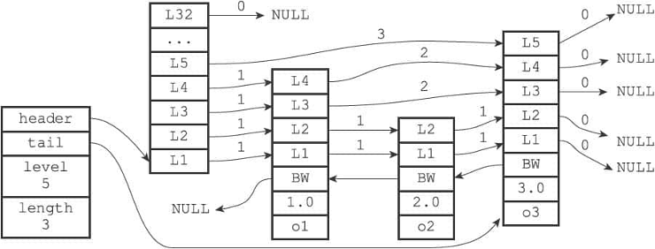
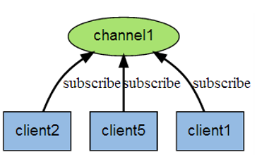
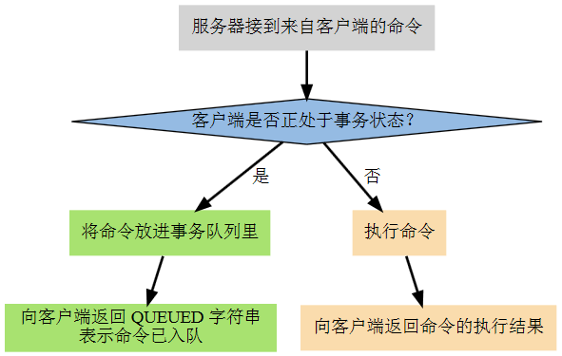
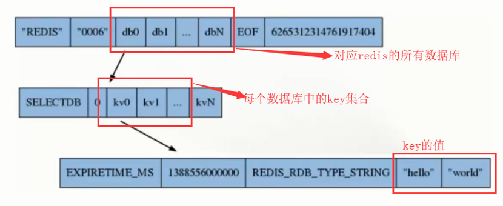

# 1.redis线程模型

## 1.1.redis为啥那么快?

redis的请求响应的是非常快的，主要原因有：

①纯内存操作；

②基于I/O多路复用机制，可以支持高并发量的请求；

③单线程执行命令，避免CPU上下文切换的消耗。

## 1.2.单线程模型

都知道redis是单线程，那这个单线程到底“单”在哪里？首先需要了解一种服务端的设计模式—Reactor模式。操作系统如linux支持select、poll、epoll函数可以管理多个socket连接，并在socket连接有请求时将其以I/O事件的形式响应出来，交由事件分发器去派发，事件执行完毕后响应回socket连接上。redis 内部使用文件事件处理器 file event handler，这个文件事件处理器是单线程的(所以 redis 才叫单线程的模型)。它采用 IO 多路复用机制同时监听多个 socket，将产生事件的 socket 压入内存队列中，事件分派器根据 socket 上的事件类型来选择对应的事件处理器进行处理。文件事件处理器的结构分为4个部分：

①多个socket；

②I/O多路复用程序；

③文件事件派发器；

④事件处理器(连接应答处理器、命令请求处理器、命令回复处理器)


# 2.redis数据结构

## 2.1.数据类型

redis数据类型和redis数据结构是两码事，redis类型是提供给用户选择使用的，而数据结构是底层支撑数据类型的C语言实现的结构体。redis有5种数据类型：

<table>
  <tr>
  	<th>数据类型</th>
    <th>描述</th>
    <th>场景</th>
  </tr>
  <tr>
  	<td width='25%'>string(字符串)</td>
    <td width='50%'>redis中最基础、最常用的数据类型。字符串在redis中是二进制安全的，这便意味着该类型存入和获取的数据相同；最多可以容纳的数据长度是512M</td>
    <td>1.统计网站访问数量和
当前在线人数等；
</td>
  </tr>
  <tr>
  	<td>hash(散列表)</td>
    <td>把多个key-value存储到一个Key上，可以用来储存java对象，每一个Hash可以存储4294967295个键值对</td>
    <td>存储用户信息</td>
  </tr>
  <tr>
  	<td>list(列表)</td>
    <td>list数据类型采用双向链表，可以存储多个有序且重复的字符串，每个字符串称为“元素”，可以通过下标来获取每个元素（下标从0开始计数）。一个列表最多可以存储232-1个元素</td>
    <td>①最新消息排行榜<br/>②任务队列<br/>③做大数据集合的增删
</td>
  </tr>
  <tr>
  	<td>set(集合)</td>
    <td>用来保存多个字符串元素，但是与list不同，set中不允许有重复元素而且集合内的元素是无序的，无法通过下标获取元素。集合最大的优势在于可以进行交集、并集和差集操作如unions、intersections和differences。
集合最多可以存储232-1个元素</td>
    <td>①利用交集求共同好友<br/>②利用唯一性，可以统计访问网站的所有独立IP
</td>
  </tr>
  <tr>
  	<td>sort zet(有序集合)</td>
    <td>它和集合set相似，保留了集合不能有重复元素的特性，但是它的元素是可以排序的。sorted set为每个元素关联一个权，通过权值作为排序的依据，还可以有序的获取集合中的元素。这个权是double类型的分数。redis正是通过分数来为集合中的成员进行从小到大的排序。有序集合的成员是唯一的，但分数(score)却可以重复</td>
    <td>排行榜</td>
  </tr>
</table>

## 2.2.数据结构


### 2.2.1.简单动态字符串

Simple dynamic string，简称SDS，是redis自定义的用来支持string类型的结构体，也是redis对所有字符串数据的处理方式(SDS会被嵌套到别的数据结构里使用)。它的结构源码是：

```c
struct sdshdr{
  //记录buf数组中已使用字节的数量, 相当于SDS保存字符串的长度
  int len;
  //记录 buf 数组中未使用字节的数量
  int free;
  //字节数组，用于保存字符串
  char buf[];
} 
```

SDS遵循了C语言字符串以空格字符结尾的惯例，保存空字符的1字节空间，但是不计算在SDS的len属性里面，并且为空字符串分配额外的1字节的空间，以及添加空字符到字符串末尾等操作


### 2.2.2.链表

list数据类型(链表建)底层就是链表，除此之外，redis的发布与订阅、慢查询、监视器等功能也用到了链表。redis服务器本身还使用链表来保存多个客户端的状态信息，以及使用链表来构建客户端输出缓冲区（output buffer）。

**链表结构源码：**

```c
//链表结构
typedef struce list{
        //头节点
        listNode *head;
        //尾节点
        listNode *tail;
        //链表包含的节点数
        unsigned long len;
        //节点值复制函数
        void *(*dup)(void * ptr);
        //节点值释放函数
        void (*free)(void *ptr);
        //节点值对比函数
        int (*match)(void *ptr,void *key);
}

//链表节点结构
typedef struct listNode{
    //前节点
    struct listNode *prev;
    //下一个节点
    struct listNode *next;
    //值
    void *value;
}
```


redis链表结构的总结：

- **双端**：链表节点带有prev和next指针，获取某个节点的前置节点和后置节点的复杂度都是O（1）；

- **无环**：表头节点的prev指针和表尾节点的next指针都指向NULL，对链表的访问以NULL为终点；

- **带表头指针和表尾指针**：通过list结构的head指针和tail指针，程序获取链表的表头节点和表尾节点的复杂度为O（1）；

- **带链表长度计数器**：程序使用list结构的len属性来对list持有的链表节点进行计数，程序获取链表中节点数量的复杂度为O（1）；

- **多态**：链表节点使用void*指针来保存节点值，并且可以通过list结构的dup、free、match三个属性为节点值设置类型特定函数，所以链表可以用于保存各种不同类型的值。

### 2.2.3.字典

字典，又称为符号表（symbol table）、关联数组（associative array）或映射（map），是一种用于保存键值对（key-value pair）的抽象数据结构。redis的字典使用哈希表作为底层实现，一个哈希表里面可以有多个哈希表节点，而每个哈希表节点就保存了字典中的一个键值对。源码结构如下：

```c
// 字典
struct dict {
  // 类型特定函数
  dictType *type;
  // 私有数据
  void *privdata;
  // 哈希表
  dictht ht[2];
  // rehash 索引, 当 rehash 不在进行时，值为 -1
  int rehashidx; 
  /* rehashing not in progress if rehashidx == -1 */
}

// 哈希表
struct dictht {
  // 哈希表数组 
  dictEntry **table;
  // 哈希表大小 
  unsigned long size;
  // 哈希表大小掩码，用于计算索引值，总是等于 size - 1 
  unsigned long sizemask;
  // 该哈希表已有节点的数量 
  unsigned long used;
} 

// 哈希表节点
struct dictEntry {
  // 键
  void *key;
  // 值
  union {
    void *val;
    uint64_t u64;
    int64_t s64;
  } v;
  // 指向下个哈希表节点，形成链表
  struct dictEntry *next;  // 单链表结构
} 
```

一个普通状态下的字典，没有进行过rehash：


从上图也可以看出redis处理hash冲突的方式就是链地址，但貌似没有使用红黑树进行优化。而随着操作的不断执行，哈希表保存的键值对会逐渐地增多或者减少，这时就需要收缩和扩容哈希表，redis是通过执行rehash（重新散列）操作来完成，为了避免rehash对服务器性能造成影响，服务器不是一次性将ht[0]里面的所有键值对全部rehash到ht[1]，而是分多次、渐进式地将ht[0]里面的键值对慢慢地rehash到ht[1]...(后面再去了解吧)

### 2.2.4.跳跃表

跳跃表（skiplist）是一种有序数据结构，它通过在每个节点中维持多个指向其他节点的指针，从而达到快速访问节点的目的。跳跃表在redis中用在有序集合键、集群节点内部数据结构。

**跳跃表底层源码结构：**

```c
// 跳跃表
typedef struct zskiplist {
  // 表头节点和表尾节点
  struct zskiplistNode *header, *tail;
  // 表中节点的数量
  unsigned long length;
  // 表中层数最大的节点的层数
  int level;
} zskiplist;


// 跳跃表节点
typedef struct zskiplistNode {
  // 后退指针
  struct zskiplistNode *backward;
  // 分值
  double score;
  // 成员对象
  robj *obj;
  // 层
  struct zskiplistLevel {
    // 前进指针
    struct zskiplistNode *forward;
    // 跨度
    unsigned int span;
  } level[];
} zskiplistNode;
```



跳跃表有几个特性：

<table>
  <tr>
  	<th>特性</th>
    <th>说明</th>
  </tr>
  <tr>
  	<td width='20%'>层</td>
    <td>也就是level[]字段，层的数量越多，访问节点速度越快。(因为它相当于是索引，层数越多，它索引就越细，就能很快找到索引值)</td>
  </tr>
  <tr>
  	<td>前进指针</td>
    <td>即forward，层中有一个forward字段，用于从表头向表尾方向访问</td>
  </tr>
  <tr>
    <td>跨度</td>
    <td>即span，用于记录两个节点之间的距离</td>
  </tr>
  <tr>
  	<td>后退指针</td>
    <td>即backward，用于从表尾向表头方向访问</td>
  </tr>
</table>

例如有一个3层的跳跃表：

```tex
level0  1---------->5 
level1  1---->3---->5 
level2  1->2->3->4->5->6->7->8 
```

现在要找键为6的元素，在level0中直接定位到5，然后再往后走一个元素就找到了。

### 2.2.5.整数集合

整数集合(intset)是集合键的底层实现之一，当一个集合只包含整数值元素，并且这个集合的元素不多时，Redis就会使用整数集合做为集合键的底层实现.

```c
// 整数集合
typedef struct intset {
    // 编码方式
    uint32_t encoding;
    // 集合包含的元素数量
    uint32_t length;
    // 保存元素的数组
    int8_t contents[];
} intset;
```


redis对整数集合做了优化，其中就涉及到对encoding的升级，先看encoding在不同属性值对contents的描述：

| enconding属性值  | **描述**                                                     |
| ---------------- | ------------------------------------------------------------ |
| INTSET_ENC_INT16 | 那么 contents 就是一个  int16_t 类型的数组， 数组里的每个项都是一个  int16_t 类型的整数值 （最小值为  -32,768 ，最大值为  32,767 ） |
| INTSET_ENC_INT32 | 那么 contents 就是一个 int32_t 类型的数组， 数组里的每个项都是一个 int32_t 类型的整数值 （最小值为 -2,147,483,648 ，最大值为 2,147,483,647 ） |
| INTSET_ENC_INT64 | 那么 contents 就是一个  int64_t 类型的数组， 数组里的每个项都是一个  int64_t 类型的整数值 （最小值为  -9,223,372,036,854,775,808 ，最大值为 9,223,372,036,854,775,807 ） |

如果现在Int16类型的整数集合，现在要将65535(int32)加进这个集合，int16是存储不下的，所以就要对整数集合进行升级，称为encoding升级(注意：redis只有encoding升级没有降级)。例子：

假如现在有2个int16的元素:1和2，新加入1个int32位的元素65535，就会触发encoding升级，其执行过程大致为：

1. 内存重分配，新加入后应该是3个元素，所以分配3*32-1=95位。

2. 选择最大的数65535, 放到(95-32+1, 95)位这个内存段中，然后2放到(95-32-32+1+1, 95-32)位...依次类推

### 2.2.6.压缩列表

压缩列表，ziplist，是redis为了节约内存而开发的顺序型数据结构。它被用在列表键和哈希键中。压缩列表的结构：


其中的entryX结构不定，大致为：

```c
typedef struct entry {
    /*前一个元素长度需要空间和前一个元素长度*/
    unsigned int previous_entry_length;
    /*元素内容编码*/
    unsigned char encoding;
    /*元素实际内容*/
    unsigned char *content;
}zlentry;  
```

- **previous_entry_length**这个字段记录了ziplist中前一个节点的长度，什么意思？就是说通过该属性可以进行指针运算达到表尾向表头遍历

- **encoding**：记录了数据类型(int16? string?)和长度

- **content**: 记录数据

previous_entry_length这个字段存放上个节点的长度，那默认长度给分配多少呢?redis是这样分的，如果前节点长度小于254,就分配1字节，大于的话分配5字节。但是这样，如果前一个节点的长度刚开始小于254字节，后来大于254,那不就存放不下了吗？ 这就涉及到previous_entry_length的更新，这样就不仅仅只改一个节点，而是后面的节点内存信息都需要改，redis将这种在特殊情况下产生的连续多次空间扩展操作称之为“连锁更新”。除了添加新节点可能会引发连锁更新之外，删除节点也可能会引发连锁更新

### 2.2.7.对象

前面几个说的是redis的底层数据结构，但是它并没有直接使用这些数据结构来实现键值对数据库，而是基于这些数据结构创建一个对象系统，这个系统包含字符串对象、列表对象、哈希对象、集合对象和有序集合对象这五种数据类型。Redis中的每个对象都由一个redisObject结构表示，该结构中和保存数据有关的三个属性分别是type属性、encoding属性和ptr属性：

```c
typedef struct redisObject {
// 类型，记录了对象的类型(前面说的5种数据类型之一)
    unsigned type:4;
    // 编码
    unsigned encoding:4;
// 记录对象最后一次被访问的时间
    unsigned lru;
// 记录当前对象被引用的次数，用于通过引用次数回收内存，当refcount=0时，
// 可以安全回收当前对象空间
    unsigned refcount;
    // 指向底层实现数据结构的指针
    void *ptr;
} robj;
```

redis的对象系统还实现了额外3个功能：

①基于引用计数技术的内存回收机制

​	当程序不再使用某个对象的时候，这个对象所占用的内存就会被自动释放

**②通过引用计数技术实现了对象共享机制**

​	可以在适当的条件下，通过让多个数据库键共享同一个对象来节约内存

**③对象带有访问时间记录信息**

​	该信息可以用于计算数据库键的空转时长，在服务器启用了maxmemory功能的情况下，空转时长较大的那些键可能会优先被服务器删除

# 3.redis内存策略

## 3.1.内存信息

通过info memory命令可以获取redis的内存信息


主要是看mem_fragmentation_ratio属性：

1. **mem_fragmentation_ratio > 1**，说明used_memory_rss-used_memory多出的部分内存并没有用于数据存储，而是被内存碎片所消耗，如果两者相差很大，说明碎片率严重；

2. **mem_fragmentation_ratio < 1**，这种情况一般出现在操作系统把redis内存交换到硬盘导致，出现这种情况时要格外关注，由于硬盘速度远远慢于内存，redis性能会变得很差，甚至僵死。

## 3.2.内存消耗划分


### 3.2.1.对象内存

存储用户的所有数据，是redis内存占用最大的一块；

### 3.2.2.缓冲内存

包括客户端缓冲、复制积压缓冲区、AOF缓冲区

<table>
  <tr>
  	<th>缓冲内存类型</th>
    <th>描述</th>
  </tr>
  <tr>
  	<td width='30%'>客户端缓冲</td>
    <td>指的是所有接入到Redis服务器TCP连接的输入输出缓冲，主节点会为每个从节点单独建立一条连接用于命令复制，当主从节点之间网络延迟较高或主节点挂载大量从节点时这部分内存消耗将占用很大一部分，建议主节点挂载的从节点不要多于2个</td>
  </tr>
  <tr>
  	<td>复制积压缓冲区</td>
    <td>整个主节点只有一个，所有的从节点共享此缓冲区，因此可以设置较大的缓冲区空间，如100MB，这部分内存投入是有价值的，可以有效避免全量复制</td>
  </tr>
  <tr>
  	<td>AOF缓冲区</td>
    <td>这部分空间用于在redis重写期间保存最近的写入命令。AOF缓冲区空间消耗用户无法控制，消耗的内存取决于AOF重写时间和写入命令量，这部分空间占用通常很小</td>
  </tr>
</table>

### 3.2.3.内存碎片

redis默认的内存分配器采用jemalloc，分配内存策略一般采用固定范围的内存块进行分配。例如jemalloc在64位系统中将内存空间划分为：小、大、巨大三个范围，每个范围内又划分为多个小的内存块单位：

<table>
  <tr>
  	<th>内存块单位</th>
    <th>具体指</th>
  </tr>
  <tr>
  	<td width='25%'>小</td>
    <td>[8byte]，[16byte，32byte，48byte，...，128byte]，<br/>
[192byte，256byte，...，512byte]，<br/>
[768byte，1024byte，...，3840byte]
</td>
  </tr>
  <tr>
  	<td>大</td>
    <td>[4KB，8KB，12KB，...，4072KB]</td>
  </tr>
  <tr>
  	<td>巨大</td>
    <td>[4MB，8MB，12MB，...]</td>
  </tr>
</table>

当保存5KB对象时jemalloc可能会采用8KB的块存储，而剩下的3KB空间变为了内存碎片不能再分配给其他对象存储，这就产生了内存碎片。jemalloc一般有针对内存碎片做了处理，但如果再这两种场景下，还是容易出现高内存碎片：

- **频繁做更新操作**。例如频繁对已存在的键执行append、setrange等操作；

- **大量过期键删除**。键对象过期删除后，释放的空间无法得到充分利用，导致碎片率上升

针对上面出现的高内存碎片，常见的解决方式：

- **数据对齐**：尽可能保证数据大小的一致性(业务不同，实际很难)

- **安全重启**：重启节点可以做到内存碎片重新整理，因此可以利用高可用架构，如Sentinel或Cluster，将碎片率过高的主节点转换为从节点，进行安全重启

## 3.3.内存回收策略

### 3.3.1.删除已过期的键对象

redis内所有键都可以设置过期时间，内部保存在过期字典中。redis有两种方式实现过期键的回收：

<table>
  <tr>
  	<th>策略</th>
    <th>描述</th>
  </tr>
  <tr>
  	<td width='25%'>惰性删除</td>
    <td>用于当客户端读取带有超时属性的键时，如果已经超过键设置的过期时间，会执行删除操作并返回空，这种策略是出于节省CPU成本考虑，不需要单独维护TTL链表来处理过期键的删除。但是单独用这种方式存在内存泄露的问题，当过期键一直没有访问将无法得到及时删除，从而导致内存不能及时释放。正因为如此，redis还提供另一种定时任务删除机制作为惰性删除的补充</td>
  </tr>
  <tr>
  	<td>定时任务删除</td>
    <td>redis内部维护一个定时任务，默认每秒运行10次（通过配置hz控制）。定时任务中删除过期键逻辑采用了自适应算法，根据键的过期比例、使用快慢两种速率模式回收键</td>
  </tr>
</table>

### 3.3.2.内存达到上限

当redis所用内存达到maxmemory上限时会触发相应的溢出控制策略，具体策略受maxmemory-policy参数控制，Redis支持6种策略：

<table>
  <tr>
  	<th>策略</th>
    <th>描述</th>
  </tr>
  <tr>
  	<td width='30%'>noeviction</td>
    <td>默认策略，不会删除任何数据，拒绝所有写入操作并返回客户端错误信息，此时Redis只响应读操作</td>
  </tr>
  <tr>
  	<td>volatile-lru</td>
    <td>根据LRU算法删除设置了超时属性（expire）的键，直到腾出足够空间为止。如果没有可删除的键对象，回退到noeviction策略</td>
  </tr>
  <tr>
  	<td>allkeys-lru</td>
    <td>根据LRU算法删除键，不管数据有没有设置超时属性，直到腾出足够空间为止</td>
  </tr>
  <tr>
  	<td>allkeys-random</td>
    <td>随机删除所有键，直到腾出足够空间为止</td>
  </tr>
  <tr>
  	<td>volatile-random</td>
    <td>随机删除设置过期时间的键，直到腾出足够空间为止</td>
  </tr>
  <tr>
  	<td>volatile-ttl</td>
    <td>根据键值对象的ttl属性，删除最近将要过期数据。如果没有，回退到noeviction策略</td>
  </tr>
</table>

(LRU的全称是Least Recently Used，即最近最少使用算法)

## 3.4.内存优化

### 3.4.1.缩减键值对象

降低redis内存使用最直接的方式就是缩减键（key）和值（value）的长度：

1. key长度：如在设计键时，在完整描述业务情况下，键值越短越好。如user：{uid}：friends：notify：{fid}可以简化为u：{uid}：fs：nt：{fid}

2. value长度：在业务上精简业务对象，去掉不必要的属性避免存储无效数据。其次选择更高效的序列化工具来降低字节数组大小，如protostuff、kryo等

### 3.4.2.共享对象池

共享对象池是指redis内部维护[0-9999]的整数对象池。创建大量的整数类redisObject存在内存开销，每个redisObject内部结构至少占16字节，甚至超过了整数自身空间消耗。所以redis内存维护一个[0-9999]的整数对象池，用于节约内存。


除了整数值对象，其他类型如list、hash、set、zset内部元素也可以使用整数对象池。因此开发中在满足需求的前提下，尽量使用整数对象以节省内存

### 3.4.3.使用字符串存储

值对象数据除了整数之外都使用字符串存储。比如执行命令：lpush cache：type "redis""memcache""tair""levelDB"，Redis首先创建"cache：type"键字符串，然后创建链表对象，链表对象内再包含四个字符串对象，排除Redis内部用到的字符串对象之外至少创建5个字符串对象

# 4.发布与订阅

Redis发布订阅(pub/sub)是一种消息通信模式：发送者(pub)发送消息，订阅者(sub)接收消息。Redis 客户端可以订阅任意数量的频道。下图展示了频道 channel1，以及订阅这个频道的三个客户端 —— client2 、 client5 和 client1 之间的关系：



当有新消息通过 PUBLISH 命令发送给频道 channel1 时， 这个消息就会被发送给订阅它的三个客户端：


## 4.1.使用方式

**命令：**subscribe channel

**描述：**订阅一个频道

**例子：**subscribe mychat，订阅mychat这个频道

 

**命令：**psubscribe channel*

**描述：**批量订阅频道

**例子：**psubscribe s*，订阅以s开头的频道

 

**命令：**publish channel content

**描述：**在指定的频道中发布消息

**例子：**publish mychat hello，向mychat频道发送“hello”信息 

# 5.事务

## 5.1.redis事务是啥?

redis中的事务是一组命令的集合，一个事务中的命令要么全都执行，要么全都不执行。事务内的所有命令都会序列化、按顺序地执行，并且事务执行过程中，不会被其它客户端发送来的命令请求所打断，事务是一个单独的隔离操作。

关系型数据库的事务，目的是为了保证数据完整性；redis事务的目的是为了保证redis语句的批量操作。下面的流程图可以展示redis的事务流程：



## 5.2.事务相关命令

1. **multi**：开启redis的事务，用于标记事务的开始，其后执行的命令都将被存入命令队列中，直到执行exec时，这些命令才会被挨个执行，相当于关系型数据库中的:begin transaction；

2. **exec** ：提交事务，即执行命令队列中的命令，相当于关系型数据库的commit；

3. **discard** ：事务回滚，即不执行命令队列，相当于关系型数据库的rallback；

4. **watch**：可以为redis事务提供CAS（check-and-set）行为，在事务开始前，监听事务命令要操作的某个键，如果在EXEC命令执行之前，该键被其它客户端修改了，那么整个事务都会被取消。

## 5.3.事务相关错误

在使用redis事务时，可能会引发的错误：

**①入队错误**

事务在执行exec之前，如果有命令产生语法错误（如参数数量错误，参数类型错误等），或者其他更严重的错误（如内存不足等），此命令会入队失败。从2.6.5版本开始，一旦有命令入队事变，redis会拒绝执行并取消此事务；在2.6.5版本以前，redis只执行那些入队成功的命令，忽略那些入队失败的命令。

**②执行错误**

事务在执行exec之后，如果有些命令发生了错误，redis会返回错误信息，但是事务内其它正确的命令仍为继续执行。redis事务并不会因为若干命令发生错误，而取消整个事务，这一点和mysql的事务有区别。

**③进程终结错误**

 exec命令负责执行事务中的所有命令，当使用 [AOF](#_AOF策略)方式做持久化的时候， redis会使用单个write命令将事务写入到磁盘中，如果此时redis因为某些原因被管理员杀死，或者遇上某种硬件故障，那么可能只有部分事务命令会被成功写入到磁盘中；然后再重启服务器时，redis会发现 AOF 文件出了问题，那么它会退出，并返回错误信息。

解决方案：redis-check-aof程序可以修复这一问题：它会移除 AOF 文件中不完整事务的信息，确保服务器可以顺利启动。执行"redis-check-aof --fix \<filename>"命令来修复坏损的AOF文件。

# 6.持久化

redis有2种持久化策略 : RDB（Redis DB）、AOF（AppendOnlyFile）

## 6.1.RDB策略

RDB策略是redis的默认持久化机制，相当于照快照，适用于**内存充裕**的计算机。它可以将服务器包含的所有数据库中的数据以二进制文件的形式保存到硬盘，创建一个.rdb的文件；然后再下次启动时载入这个.rdb文件，服务器根据文件内容，还原RDB文件中的数据。

### 6.1.1.使用方式

可以使用下面三种方式，让redis执行RDB持久化：

1. 服务器执行客户端发送的SAVE命令（阻塞当前服务，无法接收客户端请求）

2. 服务器执行客户端发送的BGSAVE命令（非阻塞命令，创建子进程去执行）

3. 在redis.conf中当save配置选项设置的自动保存条件满足时，服务器自动执行BGSAVE（最常用的）

#### 6.1.1.1.BGSAVE执行流程

啥时候使用SAVE啥时候使用BGSAVE，没有绝对的标准，例如：如果数据库正在上线，那就不该阻塞，得使用BGSAVE；如果数据库正在维护，此时系统阻塞了也没差，使用SAVE会更快一点。下边是对BGSAVE执行流程的分析：


1. 执行bgsave命令，redis父进程判断当前是否存在正在执行的子进程如RDB/AOF子进程，如果存在bgsave命令直接返回；

2. 父进程执行fork操作创建子进程，fork操作过程中父进程会阻塞；

3. 父进程fork完成后，bgsave命令返回“Background saving started”信息，并不再阻塞父进程，可以继续响应其他命令；

4. 子进程创建RDB文件，根据父进程内存生成临时快照文件，完成后对原有文件进行原子替换；

5. 进程发送信号给父进程表示完成。

#### 6.1.1.2.自动RDB配置

SAVE和BGSAVE都需要手动执行，还有一种方式是redis自动执行，满足redis.conf指定的条件即可触发，一般在以下两种情况：

1. 服务器正常关闭的时候，会进行一次快照；

2. key满足一定条件时会进行一次快照，那么是满足何种条件？由配置文件redis.conf来决定，当任意一个条件被满足时，就会执行


save 900 1 ：若距离上次创建.rdb文件已过去900秒，且服务器所有数据库的key总共已发生≥1次的修改，将会自动执行BGSAVE命令。同理，"save 300 10" 和 "save 60 10000"也是一样的道理，只要满足这三种条件的任意一种，就会自动执行RDB持久化。

PS：每次创建RBD文件之后，服务器为实现自动持久化而设置的时间计数器和次数计数器就会被清零，并重新开始计数。所以多个保存条件的效果是不会叠加的

### 6.1.2.RDB的优缺点

- **优点**

1. RDB是一个紧凑压缩的二进制文件，代表Redis在某个时间点上的数据快照，因此非常适用于容灾备份，全量复制等；

2. redis加载RDB恢复数据远远快于AOF的方式

- **缺点**

1. 创建RDB文件需要将服务器所有数据库的数据保存起来，这是一个非常耗费资源和时间的操作，属于重量级操作，频繁执行成本过高；

2. RDB方式数据没办法做到实时持久化、秒级持久化，要间隔一段时间后，才会自动保存数据，在执行了多条命令，由于隔间时间没到，redis不会执行持久化，如果此时停电了或者系统宕机了，则这些命令就全部丢失。

### 6.1.3.RDB文件



最上面代表redis的所有数据库，如：db0、db1...

中间的代表单个数据库打开后的所有key，如kv0、kv1...

最下面代表单个key的信息，如：超时时间、值的类型、key对应的value

## 6.2.AOF策略

适用于内存比较小的计算机，相当于**使用日志功能来保存数据**的操作。AOF的主要作用是解决了数据持久化的实时性，目前已经是Redis持久化的主流方式。AOF默认不开启，需要设置配置：appendonly yes。

### 6.2.1.执行流程

每当数据库有"用于修改的命令"被执行时，服务器就会把该命令写入到AOF文件的末尾。因为AOF文件里面储存了服务器执行过的所有数据库"用于修改的命令"，所以给定一个AOF文件，服务只要重新执行一遍AOF文件里面包含的所有命令，就可以达到还原数据库的目的。PS：AOF只会保存导致key变化的语句。


①所有的写入命令会追加到aof_buf（缓冲区）中；

②AOF缓冲区根据对应的策略向硬盘做同步操作；

③随着AOF文件越来越大，需要定期对AOF文件进行重写，达到压缩的目的；

④当Redis服务器重启时，可以加载AOF文件进行数据恢复。

### 6.2.2.AOF配置

AOF有3种配置：

1. **always**：服务器每写入一个命令，就调用一次fdatasync，将缓冲区里面的命令写入到硬盘，这种方式速度最慢，但最安全；

2. **everysec**：服务器每一秒调用一次fdatasync，将缓冲区里面的命令写入到硬盘，这种方式速度折中，安全性也折中，默认配置；

3. **no**：服务器不主动调用fdatasync，由操作系统决定什么时候将缓冲区里面的命令写入到硬盘(linux 默认是30秒将缓冲区的数据回写硬盘)这种方式速度最快，安全性最差。

**如何配置？**

1. 首先AOF默认是被关闭的，需要手动开启，修改redis.conf的配置，找到appendonly，把no修改为yes

2. 配置AOF的保存策略（appendfsync）：可以看到默认是每秒保存的策略

### 6.2.3.重写策略

随着服务器的不断运行，服务器会将越来越多的命令写入到AOF文件中，导致AOF文件的体积不断的增大。为了让AOF文件的大小控制在合理的范围，避免无限制地增大，redis提供了AOF重写功能，通过这个功能，服务器可以产生一个新的AOF文件。重写实际上就是重新处理命令，将命令合并。


**有两种方式触发AOF重写：**

1、客户端向服务器发送BGREWRITEAOF命令

2、配置让服务器自动执行BGREWRITEAOF命令：

  **auto-aof-rewirite-min-size 64mb**，这行配置的意思是当AOF文件的体积≥size时，服务器才会考虑是否需要进行AOF重写，同时也避免了对体积过小的AOF文件进行重写，默认是64mb；

  **auto-aof-rewrite-percentage 100**，这行配置的意思是当对一个AOF文件进行重写后，仅当它增长率大于100%，才会继续对它重写。比如，有一个64mb的AOF文件，符合size要求，对它重写，重写后size=60mb，下次要对它进行重写，需要它的体积达到120mb。

# 7.lua脚本

文档参考：[http://doc.redisfans.com/script/eval.html](http://doc.redisfans.com/script/eval.html)。从redis 2.6.0版本开始，redis内置了Lua解释器，并提供了eval命令来解析Lua脚本求值。

## 7.1.语法格式

**语法:**  eval script numkeys keys args

**参数:**  	

- leval — redis提供解析lua脚本的命令

- script — lua脚本

- numkeys — 指定键名参数集(keys)的个数

- keys — 键名参数集，通过全局变量KEYS数组表示，起始下标为1

- args — 键值参数集，通过全局变量ARGV数组表示，起始下标为1

**描述:** 

EVAL命令的语义要求字面量不要直接写在lua脚本中，推荐使用变量，来定义lua脚本，并将字面量放在键名参数集keys和键值参数集args中，通过全局变量KEYS和ARGV来获取，这样做的好处是可缓存！在lua脚本中，可以使用两个函数来执行redis命令，分别是：redis.call()和redis.pcall()

**例子：**

\## 第一个eval命令，设置一个key=name，value=sym的字符串

```shel
eval "return redis.call('set',KEYS[1],ARGA[1])" 1 name sym
```

\## 第二个eval命令：获取key=name的字符串的值

```shel
eval "return redis.call('get',KEYS[1])" 1 name
```

**错误处理：**

上面说过，在lua脚本中可以使用call()和pcall()来执行redis脚本，这两个函数的效果是一模一样的，唯一区别就是它们对于错误处理的不同：

①redis.call()在执行命令中发生错误，脚本会停止执行，返回一个脚本错误，错误的输出信息会说明错误造成的原因：

②redis.pcall()执行命令出错时将捕获错误并返回表示错误的Lua表类型

## 7.2.类型转换

当 Lua 通过 call() 或 pcall() 函数执行 Redis 命令的时候，命令的返回值会被转换成 Lua 数据结构；同样地，当Lua脚本在 redis内置解释器里运行时，Lua的返回值也会被转换成Redis类型，然后由EVAL将值返回客户端。lua类型与redis类型之间存在一一转换的关系：

**redis→lua：**

| redis类型                    | lua类型           | 描述                                            |
| ---------------------------- | ----------------- | ----------------------------------------------- |
| redis_integer                | lua_number        | redis整数转为lua数字                            |
| redis_bulk                   | lua_string        | redis bulk回复转为lua字符串                     |
| redis_multi bulk             | Lua_table         | redis  多条bulk回复转为Lua 表                   |
| redis_status                 | lua_table         | redis状态回复转为lua表，表内ok域包含状态信息    |
| redis_error                  | lua_table         | redis错误回复转为lua表，表内的err域包含错误信息 |
| redis_nil、  redis_multi nil | lua_boolean_false | redis的nil回复和nil多条回复转为lua的布尔值false |

**lua→redis：**

| lua类型                | redis类型         | 描述                                        |
| ---------------------- | ----------------- | ------------------------------------------- |
| lua_number             | redis_integer     | lua数字转为redis整数                        |
| lua_string             | redis_bluk        | lua字符串转为redis bulk回复                 |
| lua_table、  lua_array | redis_multi  bulk | lua表（数组）转为redis多条bulk回复          |
| lua_table_ok           | redis status      | 一个带单个ok域的lua表，转为redis  状态回复  |
| lua_table_err          | redis_error       | 一个带单个err域的lua表，转为redis  错误回复 |
| lua_boolean_false      | redis nil         | lua布尔值false转为redis的nil回复            |

从lua转换到redis有一条额外的规则，这条规则没有与其相对应的redis转换为lua的规则：lua_boolean_true -> redis_integer_1，lua布尔值true转为redis整数1

## 7.3.lua脚本

### 7.3.1.script命令

redis提供了以下几个script命令，用于对于脚本子系统进行控制：

**script flush**：清除所有的脚本缓存

**script load**：将脚本装入脚本缓存，不立即运行并返回其校验和

**script exists**：根据指定脚本校验和，检查脚本是否存在于缓存

**script kill**：杀死当前正在运行的脚本（防止脚本运行缓存，占用内存）

### 7.3.2.脚本原子

redis使用单个lua解释器去运行所有脚本，并且保证脚本会以原子性的方式去执行，意味着当某个脚本在运行时，不会有其它脚本或者redis命令被执行！所以，如果当前脚本运行很慢，服务器可能会因为正忙而无法执行命令。

每个脚本都有一个最大执行时间限制，默认值是5s。最大执行时间的长短由配置文件redis.conf的**lua-time-limit选项**来控制，或直接使用config get和config set命令来修改。当一个脚本执行达到最大执行时间时，redis不会主动结束它，它会进行下面几个步骤：

1. redis记录一个脚本正在超时运行

2. redis开始重新接受其它客户端请求，但只接受执行script kill命令和shutdown nosave两个命令，若客户端执行其它命令，redis会返回busy 错误。

3. 如果脚本只执行过读操作，使用script kill命令可以立即停止此脚本；如果脚本执行过写操作，只允许shutdown save/nosave命令，通过停止服务器来阻止当前数据写入磁盘。（此时服务器关闭，数据不会被保存）

### 7.3.3.脚本缓存和EVALSHA

redis有一个内部的脚本缓存机制，它不会每次都重新编译脚本，反倒是它会将所有运行过的脚本永久保存在脚本缓存中（因为redis发现脚本体积非常小，即使量很大，甚至经常修改，储存这些脚本的内存也是微不足道的）。清空脚本缓存只有唯一一个方式，就是执行script flush命令。

使用eval命令执行脚本时，每次都要发送脚本主体，如果脚本足够复杂，这会付出无谓的网络带宽。redis基于对lua的缓存，它实现了**evalsha**命令。evalsha命令和eval命令效果一样，都是解释lua脚本执行，但是evalsha命令的第一个参数不是脚本主体，而是脚本的SHAI校验和，这个校验和可以通过script load命令得到。evalsha命令执行过程分两步：

1. 如果redis服务器保存了给定SHA1校验和所指定的脚本，就会执行该脚本

2. 如果redis服务器没保存给定SHA1校验和所指定的脚本，它就会返回一个特殊错误，告知客户端使用eval命令去执行，

### 7.3.4.全局变量保护

redis的lua脚本不允许创建全局变量，如果脚本需要在多次执行之间维持某种状态，可以借助外部redis key来保存状态，每次脚本执行前，获取redis相对应的key赋值给局部变量。在lua脚本中创建或访问一个全局变量，都会引起脚本停止，eval命令会返回一个错误。

redis的全局变量保护并不是百分百成功，有时候会在脚本中混入lua全局状态，可能会引发AOF持久化和主从复制都无法得到保证。redis建议不要在脚本中使用全局变量，可以使用local关键字定义脚本中的变量！

### 7.3.5.日志记录

在redis中使用脚本不会自动记录日志，需要我们在脚本使用redis.log()手动保存日志信息。脚本保存的日志，只有那些与redis实例所设置的日志等级相同或更高级才会被记录。**语法：**redis.log(loglevel,message)。其中，

message表示要记录的日志信息，是一个字符串

loglevel表示redis日志等级，有4个取值：

  redis.LOG_DEBUG

  redis.LOG_VERBOSE

  redis.LOG_NOTICE

  redis.LOG_WARNING

# 8.主从复制