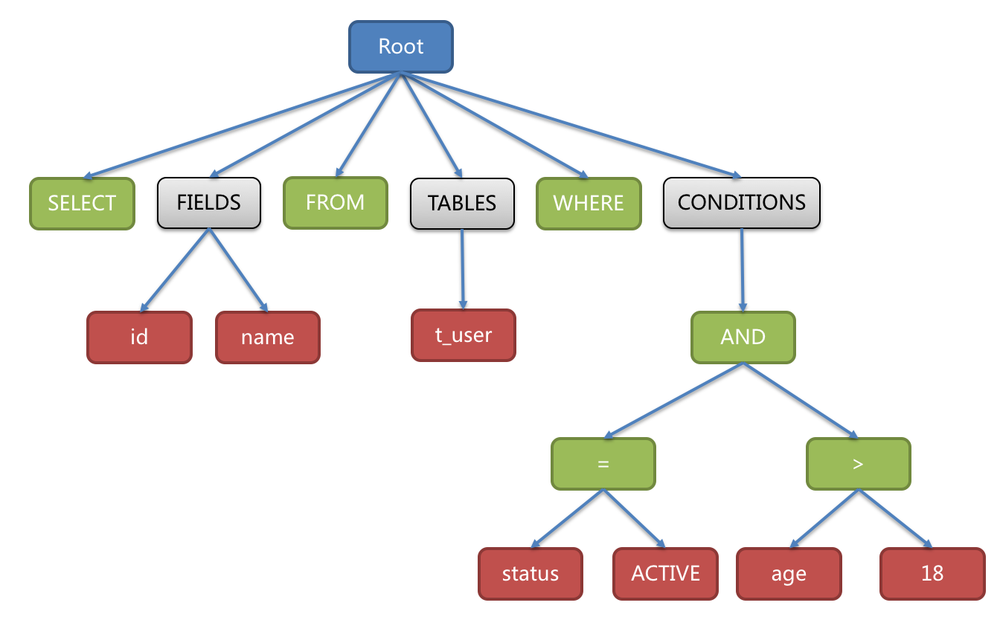

# 1.分库分表概念

分库分表其实是两个概念：分库和分表，又可以细化为：垂直拆分和水平拆分。所以分库分表其实是4个概念：

1. 垂直分库
2. 水平分库
3. 垂直分表
4. 水平分表

分库分表就是为了解决由于数据量过大导致数据库性能降低的问题，将原来独立的数据库拆分成若干数据库组成，将数据大表拆分成若干数据表组成，使得单一数据库、单一数据表的数据量变小，从而达到提升数据库性能的目的

分库分表一定是为了解决**高并发、数据量大**两个问题的，传统关系型数据库，一个数据库最多支撑到并发 2000，一张表数据量几百万的时候，性能就会很差，sql就跑得很慢。但随着公司业务的发展，数据量是绝对会越来越大的，最终数据库所能承载的数据量、数据处理能力都将遭遇瓶颈，所以我们需要【拆】

## 1.1.垂直分表

定义：**将一个大表按照字段分成若干张表，每张表存储原来大表的一部分字段**。

按照以下原则进行垂直分表：

1. 把不常用的字段单独放在一张表
2. 把txt、blob等大字段拆分出来放在附表
3. 经常组合查询的字段放在一张表

## 1.4.垂直分库

[垂直分表](#1.1.垂直分表)虽然能得到一定性能的提升，但是拆分后的表仍然处于同一个库（确切地说是位于同一个服务器上），这其实还是竞争同一个物理机的CPU、内存、网络IO和磁盘。

定义：**按照业务将表进行分类，分布到不同的数据库上，每个库单独放在一个服务器上，它的核心理念是专库专用**

## 1.5.水平分库

用了垂直分表和垂直分库，可以将一张大表也拆分成若干业务表，再将业务表放在不同数据库上。但是，随着业务的发展，数据量剧增，每个业务表自身也会达到一个量级，这时候就需要对业务表做水平分库

定义：**把同一个表的数据按照一定规则拆分到不同的数据库中，每个数据库放在独立的服务器上(每个库中的业务表结构都一样，只不过数据不同)**

## 1.6.水平分表

水平分库可以解决大部分的问题，但是水平分库有个缺点，就是需要增加数据库实例，这对运维压力很大，所以同时会配合使用水平分表。

水平分表：**在同一个数据库内，把同一张表的数据按照一定规则拆分到多个表中，每个表的结构一样，但是数据不同，其实和水平分库类似，只不过一个是划分库，一个只划分表**

## 1.7.总结

总的来说，垂直划分就是根据结构来划分，水平划分就是根据业务数据来划分：

- 垂直分表是拆分表字段将大表划分为各个小表，垂直分库是将一个库内的表拆分到单独数据库上
- 水平分表是将一张表的数据划分到不同表存储，水平分库是将一张表的数据分到不同数据库存储

一般来说，在系统设计阶段就应该根据业务耦合松紧来确定**垂直分库**和**垂直分表**方案（优先完成），在数据量以及访问压力不大的情况，先考虑缓存、读写分离和索引优化等方案。真到了业务数据量剧增，且持续增长，再来考虑水平分库和水平分表。

千万不要为了分库分表而分库分表，技术有利就有弊，分库分表后需要解决的额外挑战：

1. **事务一致性问题**：由于数据分布在不同库甚至不同库，就必须考虑分布式事务问题；
2. **跨节点关联查询**：原先单表或者单库，如果要做多表关联查询，通过join连接查询便可以解决。但如果分库分表后，一次查询是绝对没办法做到的，需要在多库中多次查询后再拼装；
3. **跨节点分页、排序函数**：分库分表后，limit分页、order by 排序等问题，就变得复杂，需要先在不同节点的分片节点将数据进行排序并发回，然后将不同分片发回的结果集进行汇总再排序；
4. **主键避重**：分录分表后单表的自增主键就无法使用，需要引入全局主键，避免跨库主键重复问题；
5. **公共表**：实际开发中，对于参数表、数据字典等公共表，都是每个库都需要使用的，所以分库分表后，对公共表数据的处理，需要同步到各个分库上。

# 2.sharding-jdbc简介

sharding-jdbc是当当网研发的开源分布式数据库中间件，从3.0开始sharding-jdbc被包含在Sharding-Sphere中，并在2020年4月16日从[Apache孵化器](http://incubator.apache.org/projects/shardingsphere.html)毕业，成为Apache顶级项目。

sharding-jdbc是Sharding-Sphere的模块之一，定位为轻量级Java框架，在Java的JDBC层提供的额外服务。 它使用客户端直连数据库，以jar包形式提供服务，无需额外部署和依赖，可理解为增强版的JDBC驱动，完全兼容JDBC和各种ORM框架；sharding-jdbc的核心功能为**数据分片**和**读写分离**。通过sharding-jdbc可以**透明的**使用jdbc访问已经分库分表、读写分离的多个数据源，而不用关系数据库的数量以及数据如何分布。


## 2.1.SQL

### 2.1.1.逻辑表

水平拆分的数据库（或数据表）的相同逻辑和数据结构表的总称，例如：订单数据根据主键拆分成10张表，分别是t_order_0 ~ t_order_9（这是[实际表](#2.1.2.真实表)名），则这些表的逻辑表名就为t_order

### 2.1.2.真实表

在分片的数据库中**真实存在**的物理表，就是上面[逻辑表](#2.1.1.逻辑表)举例的t_order_0 ~ t_order_9

### 2.1.3.数据节点

数据分片的最小单元，即数据源 + 数据表，例如：db1.t_order_o，表示名称为db1的数据源（对应一个数据库）的t_order_0真实表

### 2.1.4.绑定表

指分片规则一致的主表和子表。例如：`t_order`表和`t_order_item`表，均按照`order_id`分片，则此两张表互为绑定表关系。绑定表之间的多表关联查询不会出现笛卡尔积关联，关联查询效率将大大提升

### 2.1.5.广播表

指所有的分片数据源中都存在的表，表结构和表中的数据在每个数据库中均完全一致。适用于数据量不大且需要与海量数据的表进行关联查询的场景，例如：字典表。

## 2.2.分片

### 2.2.1.分片键

用于分片的**数据库字段**，是将数据库（或数据表）水平拆分的关键字段。例如：将t_order表中的主键的尾数对2取模分片，奇数的分到数据源db1，偶数的分到数据源db2，那么t_order表的主键就称为分片键。SQL中如果无分片字段，将执行全路由，性能较差。 除了对单分片字段的支持，ShardingSphere也支持根据多个字段进行分片。

### 2.2.2.分片算法

通过分片算法将数据分片，支持通过`=`、`>=`、`<=`、`>`、`<`、`BETWEEN`和`IN`分片。分片算法需要开发者自行实现，可实现的灵活度非常高。sharding-jdbc并未提供内置的分片算法，只是提供接口由开发者自行实现分片算法，当前版本提供4种：

- **精确分片算法**

对应**PreciseShardingAlgorithm**，用于处理使用单一键作为分片键的=与IN进行分片的场景，需要配合**StandardShardingStrategy**使用

- **范围分片算法**

对应**RangeShardingAlgorithm**，用于处理使用单一键作为分片键的BETWEEN AND、>、<、>=、<=进行分片的场景，需要配合**StandardShardingStrategy**使用。

- **复合分片算法**

对应**ComplexKeysShardingAlgorithm**，用于处理使用多键作为分片键进行分片的场景，包含多个分片键的逻辑较复杂，需要开发者自行处理其中的复杂度，配合**ComplexShardingStrategy**使用

- **Hint分片算法**

对应**HintShardingAlgorithm**，用于处理使用Hint行分片的场景，需要配合**HintShardingStrategy**使用。

### 2.2.3.分片策略

包含[分片键](#2.2.1.分片键)和[分片算法](#2.2.2.分片算法)，由于分片算法的独立性，将其独立抽离，真正可用于分片操作的是分片键 + 分片算法，即分片策略 = 分片算法 + 分片键，它才是真正用于分片的实现。目前提供5种分片策略

- **标准分片策略(standard)**

对应**StandardShardingStrategy**，提供对SQL语句中的=, >, <, >=, <=, IN和BETWEEN AND的分片操作支持。StandardShardingStrategy只支持单分片键，提供**PreciseShardingAlgorithm（精确分片算法）**和**RangeShardingAlgorithm（范围分片算法）**两个分片算法，其中PreciseShardingAlgorithm是必选的，用于处理=和IN的分片。RangeShardingAlgorithm是可选的，用于处理BETWEEN AND, >, <, >=, <=分片。如果不配置RangeShardingAlgorithm，SQL中的BETWEEN AND将按照全库路由处理

- **复合分片策略(complex)**

对应**ComplexShardingStrategy**。提供对SQL语句中的=, >, <, >=, <=, IN和BETWEEN AND的分片操作支持。ComplexShardingStrategy支持多分片键，由于多分片键之间的关系复杂，因此并未进行过多的封装，而是直接将分片键值组合以及分片操作符透传至分片算法，完全由应用开发者实现，提供最大的灵活度

- **行表达式分片策略(inline)**

对应**InlineShardingStrategy**。使用Groovy的表达式，提供对SQL语句中的=和IN的分片操作支持，只支持**单分片键**。对于简单的分片算法，可以通过简单的配置使用，从而避免繁琐的Java代码开发，如: `t_user_$->{u_id % 8}` 表示t_user表根据u_id模8，而分成8张表，表名称为`t_user_0`到`t_user_7`。

- **Hint分片策略(hint)**

对应**HintShardingStrategy**。通过Hint指定分片值而非从SQL中提取分片值的方式进行分片的策略。

- **不分片策略**

对应NoneShardingStrategy。不分片的策略。

### 2.2.4.SQL Hint

对于分片字段非SQL决定，而由其他外置条件决定的场景，可使用SQL Hint灵活的注入分片字段。例：内部系统，按照员工登录主键分库，而数据库中并无此字段。SQL Hint支持通过Java API和SQL注释(待实现)两种方式使用。

## 2.3.配置

### 2.3.1.分片规则

分片规则配置的总入口。包含数据源配置、表配置、绑定表配置以及读写分离配置等

### 2.3.2.数据源配置

真实数据源列表。

### 2.3.3.表配置

逻辑表名称、数据节点与分表规则的配置。

### 2.3.4.数据节点配置

用于配置[逻辑表](#2.1.1.逻辑表)与[真实表](#2.1.2.真实表)的映射关系。可分为均匀分布和自定义分布两种形式。

- **均匀分布**

指数据表在每个数据源内呈现均匀分布的态势，例如：

```text
db0
  ├── t_order0 
  └── t_order1 
db1
  ├── t_order0 
  └── t_order1
```

对应的数据节点配置：

```sql
db0.t_order0, db0.t_order1, db1.t_order0, db1.t_order1
```

- **自定义分布**

指数据表呈现有特定规则的分布，例如：

```text
db0
  ├── t_order0 
  └── t_order1 
db1
  ├── t_order2
  ├── t_order3
  └── t_order4
```

对应的数据节点配置：

```sql
db0.t_order0, db0.t_order1, db1.t_order2, db1.t_order3, db1.t_order4
```

### 2.3.5.分片策略配置

对于分片策略存有数据源分片策略和表分片策略两种维度。

- **数据源分片策略(即库分片)**

对应于**DatabaseShardingStrategy**。用于配置数据被分配的目标数据源。

- **表分片策略**

对应于**TableShardingStrategy**。用于配置数据被分配的目标表，该目标表存在与该数据的目标数据源内。故表分片策略是依赖与数据源分片策略的结果的。

### 2.3.6.自增主键生成策略

通过在客户端生成自增主键替换以数据库原生自增主键的方式，做到分布式主键无重复。

# 3.sharding-jdbc执行流程

sharding-jdbc一个完整的执行流程：`SQL解析 => 执行器优化 => SQL路由 => SQL改写 => SQL执行 => 结果归并`


## 3.1.SQL解析

解析过程分为**词法解析**和**语法解析**。 词法解析器用于将SQL拆解为不可再分的原子符号，称为Token。并根据不同数据库方言所提供的字典，将其归类为关键字，表达式，字面量和操作符。 再使用语法解析器将SQL转换为抽象语法树。例如有如下SQL：

```sql
SELECT id, name FROM t_user WHERE status = 'ACTIVE' AND age > 18
```

解析之后的为抽象语法树见下图。



抽象语法树中的关键字的Token用绿色表示，变量的Token用红色表示，灰色表示需要进一步拆分。其中红色的变量就是需要被改写的，要结合[分片策略](#2.3.5.分片策略)进行SQL改写。

通过对抽象语法树的遍历去提炼分片所需的上下文，并标记有可能需要SQL改写的位置。 供分片使用的解析上下文包含查询选择项（Select Items）、表信息（Table）、分片条件（Sharding Condition）、自增主键信息（Auto increment Primary Key）、排序信息（Order By）、分组信息（Group By）以及分页信息（Limit、Rownum、Top）。 SQL的一次解析过程是不可逆的，一个个Token的按SQL原本的顺序依次进行解析，性能很高。 考虑到各种数据库SQL方言的异同，在解析模块提供了各类数据库的SQL方言字典

## 3.2.SQL路由

SQL路由就是把针对[逻辑表](#2.1.1.逻辑表)的数据操作映射到对[数据节点](#2.1.3.数据节点)操作的过程。

根据解析上下文匹配数据库和表的分片策略，并生成路由路径。 对于携带分片键的SQL，根据分片键的不同可以划分为单片路由(分片键的操作符是等号)、多片路由(分片键的操作符是IN)和范围路由(分片键的操作符是BETWEEN)。 不携带分片键的SQL则采用广播路由。

1. **分片路由**：用于根据分片键进行路由的场景，又细分为直接路由、标准路由和笛卡尔积路由这3种类型

   - **直接路由**：通过HintAPI直接指定路由，其兼容性最好，可以执行包括子查询、自定义函数等复杂情况的任意SQL，还可以用于分片键不在SQL的场景：

     ```java
     hintManager.setDatabaseShardingValue(3);
     ```

     假如路由算法为`value % 2`，当一个逻辑库`t_order`对应2个真实库`t_order_0`和`t_order_1`时，路由后SQL将在`t_order_1`上执行；

   - **标准路由**：当分片运算符是等于号时，路由结果将落入单库（表），当分片运算符是BETWEEN或IN时，则路由结果不一定落入唯一的库（表），因此一条逻辑SQL最终可能被拆分为多条用于执行的真实SQL。举例说明，如果按照`order_id`的奇数和偶数进行数据分片，一个单表查询的SQL如下：

     ```sql
     SELECT * FROM t_order WHERE order_id IN (1, 2);
     ```

     那么路由的结果应为：

     ```sql
     SELECT * FROM t_order_0 WHERE order_id IN (1, 2);
     SELECT * FROM t_order_1 WHERE order_id IN (1, 2);
     ```

   - **笛卡尔积路由**：最复杂的情况，它无法根据绑定表的关系定位分片规则，因此非绑定表之间的关联查询需要拆解为笛卡尔积组合执行。如果上个示例中的SQL并未配置绑定表关系，那么路由的结果应为：

     ```sql
     SELECT * FROM t_order_0 o JOIN t_order_item_0 i ON o.order_id=i.order_id  WHERE order_id IN (1, 2);
     SELECT * FROM t_order_0 o JOIN t_order_item_1 i ON o.order_id=i.order_id  WHERE order_id IN (1, 2);
     SELECT * FROM t_order_1 o JOIN t_order_item_0 i ON o.order_id=i.order_id  WHERE order_id IN (1, 2);
     SELECT * FROM t_order_1 o JOIN t_order_item_1 i ON o.order_id=i.order_id  WHERE order_id IN (1, 2);
     ```

2. **广播路由**：对于不携带分片键的SQL，则采取广播路由的方式。根据SQL类型又可以划分为全库表路由、全库路由、全实例路由、单播路由和阻断路由这5种类型

   - **全库表路由**：用于处理对数据库中与其逻辑表相关的所有真实表的操作，主要包括不带分片键的DQL和DML，以及DDL。例如：

     ```sql
     SELECT * FROM t_order WHERE good_prority IN (1, 10);
     ```

     则会遍历所有数据库中的所有表，逐一匹配逻辑表和真实表名，能够匹配得上则执行。路由后成为

     ```sql
     SELECT * FROM t_order_0 WHERE good_prority IN (1, 10);
     SELECT * FROM t_order_1 WHERE good_prority IN (1, 10);
     SELECT * FROM t_order_2 WHERE good_prority IN (1, 10);
     SELECT * FROM t_order_3 WHERE good_prority IN (1, 10);
     ```

   - **全库路由**：用于处理对数据库的操作，包括用于库设置的SET类型的数据库管理命令，以及TCL这样的事务控制语句。在这种情况下，会根据逻辑库的名字遍历所有符合名字匹配的真实库，并在真实库中执行该命令，例如：

     ```sql
     SET autocommit=0;
     ```

     在`t_order`中执行，`t_order`有2个真实库。则实际会在`t_order_0`和`t_order_1`上都执行这个命令

   - **全实例路由**：用于DCL操作，授权语句针对的是数据库的实例。无论一个实例中包含多少个Schema，每个数据库的实例只执行一次。例如：

     ```sql
     CREATE USER customer@127.0.0.1 identified BY '123';
     ```

     这个命令将在所有的真实数据库实例中执行，以确保customer用户可以访问每一个实例。

   - **单播路由**：用于获取某一真实表信息的场景，它仅需要从任意库中的任意真实表中获取数据即可。例如：

     ```sql
     DESCRIBE t_order;
     ```

     t_order的两个真实表t_order_0，t_order_1的描述结构相同，所以这个命令在任意真实表上选择执行一次

   - **阻断路由**：用于屏蔽SQL对数据库的操作，例如：

     ```sql
     USE order_db;
     ```

     这个命令不会在真实数据库中执行，因为ShardingSphere采用的是逻辑Schema的方式，无需将切换数据库Schema的命令发送至数据库中


## 3.3.SQL改写

开发者面向逻辑库与逻辑表书写的SQL，并不能够直接在真实的数据库中执行，SQL改写用于将逻辑SQL改写为在真实数据库中可以正确执行的SQL。 它包括正确性改写和优化改写两部分。

1. **正确性改写**

在包含分表的场景中，需要将分表配置中的逻辑表名称改写为路由之后所获取的真实表名称。仅分库则不需要表名称的改写。除此之外，还包括补列和分页信息修正等内容。从一个最简单的例子开始，若逻辑SQL为：

```sql
SELECT order_id FROM t_order WHERE order_id=1;
```

假设该SQL配置分片键order_id，并且order_id=1的情况，将路由至分片表1。那么改写之后的SQL应该为：

```sql
SELECT order_id FROM t_order_1 WHERE order_id=1; -- 真实拿到数据库执行的SQL
```

当然这是最简单的例子，只是将逻辑表改写为真实表，实际SQL中肯定需要结合SQL解析出来的语法树进行改写。例如：如果选择项中不包含结果归并时所需的列，则需要进行补列

```sql
SELECT order_id FROM t_order ORDER BY user_id;
```

由于原始SQL中并不包含需要在结果归并中需要获取的user_id，因此需要对SQL进行补列改写。补列之后的SQL是：

```sql
SELECT order_id, user_id AS ORDER_BY_DERIVED_0 FROM t_order ORDER BY user_id;
```

2. **优化改写**

是在不影响查询正确性的情况下，对性能进行提升的有效手段。它分为单节点优化和流式归并优化。

- 单节点优化：路由至单节点的SQL，则无需优化改写
- 流式归并优化：包含`GROUP BY`的SQL增加`ORDER BY`以及和分组项相同的排序项和排序顺序，用于将内存归并转化为流式归并


## 3.4.SQL执行

ShardingSphere采用一套自动化的执行引擎，它不是简单地将SQL通过JDBC直接发送至数据源执行；也并非直接将执行请求放入线程池去并发执行。它更关注平衡数据源连接创建以及内存占用所产生的消耗，以及最大限度地合理利用并发等问题。举个例子：如果一条SQL在经过ShardingSphere的分片后，需要操作某数据库实例下的200张表。 那么，是选择创建200个连接并行执行，还是选择创建一个连接串行执行呢？ShardingSphere就是为了解决维持这个平衡，提出了连接模式（Connection Mode）的概念，将其划分为内存限制模式（MEMORY_STRICTLY）和连接限制模式（CONNECTION_STRICTLY）两种类型

- **内存限制模式**

ShardingSphere对一次操作所耗费的数据库连接数量不做限制。 如果实际执行的SQL需要对某数据库实例中的200张表做操作，则对每张表创建一个新的数据库连接，并通过多线程的方式并发处理，以达成执行效率最大化。 并且在SQL满足条件情况下，优先选择流式归并（<u>以结果集游标下移进行结果归并的方式，称之为流式归并，它无需将结果数据全数加载至内存</u>），以防止出现内存溢出或避免频繁垃圾回收情况

- **连接限制模式**

ShardingSphere严格控制对一次操作所耗费的数据库连接数量。 如果实际执行的SQL需要对某数据库实例中的200张表做操作，那么只会创建唯一的数据库连接，并对其200张表串行处理。 如果一次操作中的分片散落在不同的数据库，仍然采用多线程处理对不同库的操作，但每个库的每次操作仍然只创建一个唯一的数据库连接。该模式始终选择内存归并

那么，ShardingSphere是怎么确定使用哪种连接模式的呢？它是根据maxConnectionSizePerQuery配置项，结合当前路由结果，选择恰当的连接模式。 具体步骤如下：

1. 将SQL的路由结果按照数据源的名称进行分组。

2. 通过下图的公式，可以获得每个数据库实例在`maxConnectionSizePerQuery`的允许范围内，每个连接需要执行的SQL路由结果组，并计算出本次请求的最优连接模式。


内存限制模式适用于OLAP操作（<u>即联机分析处理，Online Analytical Processing，这种模式下语句的执行量不是考核标准，因为一条语句的执行时间可能会非常长，读取的数据也非常多</u>），可以通过放宽对数据库连接的限制提升系统吞吐量；连接限制模式适用于OLTP操作（<u>即联机事务处理，Online Transaction Processing，表示事务性非常高的系统，单个数据库每秒处理的Transaction往往超过几百个，或者是几千个，Select 语句的执行量每秒几千甚至几万个</u>），OLTP通常带有分片键，会路由到单一的分片，因此严格控制数据库连接，以保证在线系统数据库资源能够被更多的应用所使用。


## 3.5.结果归并

将从各个数据节点获取的多数据结果集，组合成为一个结果集并正确的返回至请求客户端，称为结果归并。从结构划分，可分为流式归并、内存归并和装饰者归并。流式归并和内存归并是互斥的，装饰者归并可以在流式归并和内存归并之上做进一步的处理。

- **流失归并**：每一次从结果集中获取到的数据，都能够通过逐条获取的方式返回正确的单条数据，它与数据库原生的返回结果集的方式最为契合；
- **内存归并**：需要将结果集的所有数据都遍历并存储在内存中，再通过统一的分组、排序以及聚合等计算之后，再将其封装成为逐条访问的数据结果集返回；
- **装饰者归并**：对所有的结果集归并进行统一的功能增强。

结果归并从功能上分为**遍历、排序、分组、分页和聚合**5种类型，它们是组合而非互斥的关系，这里只记录两个比较难理解的结果归并：

1. **排序归并**：在SQL中存在`ORDER BY`语句，因此每个数据结果集自身是有序的，因此只需要将数据结果集当前游标指向的数据值进行排序即可。 相当于对多个有序的数组进行排序，归并排序是最适合此场景的排序算法

例如：下图展示了3张表返回的数据结果集，每个数据结果集已经根据分数排序完毕，但是3个数据结果集之间是无序的。 将3个数据结果集的当前游标指向的数据值进行排序，并放入优先级队列，t_score_0的第一个数据值最大，t_score_2的第一个数据值次之，t_score_1的第一个数据值最小，因此优先级队列根据t_score_0，t_score_2和t_score_1的方式排序队列。


下图则展现了进行next调用的时候，排序归并是如何进行的。 通过图中我们可以看到，当进行第一次next调用时，排在队列首位的t_score_0将会被弹出队列，并且将当前游标指向的数据值（也就是100）返回至查询客户端，并且将游标下移一位之后，重新放入优先级队列。 而优先级队列也会根据t_score_0的当前数据结果集指向游标的数据值（这里是90）进行排序，根据当前数值，t_score_0排列在队列的最后一位。 之前队列中排名第二的t_score_2的数据结果集则自动排在了队列首位。在进行第二次next时，只需要将目前排列在队列首位的t_score_2弹出队列，并且将其数据结果集游标指向的值返回至客户端，并下移游标，继续加入队列排队，以此类推。 当一个结果集中已经没有数据了，则无需再次加入队列。


2. **分组排序**：要求SQL的**排序项**与**分组项**的字段以及排序类型（ASC或DESC）必须保持一致，否则只能通过内存归并才能保证其数据的正确性。

例如：假设根据科目分片，表结构中包含考生的姓名（为了简单起见，不考虑重名的情况）和分数。通过SQL获取每位考生的总分，可通过如下SQL：

```sql
SELECT name, SUM(score) FROM t_score GROUP BY name ORDER BY name;
```

在分组项与排序项完全一致的情况下，取得的数据是连续的，分组所需的数据全数存在于各个数据结果集的当前游标所指向的数据值，因此可以采用流式归并。如下图所示。


进行归并时，逻辑与排序归并类似。 当进行第一次next调用时，排在队列首位的t_score_java将会被弹出队列，并且将分组值同为“Jetty”的其他结果集中的数据一同弹出队列。 在获取了所有的姓名为“Jetty”的同学的分数之后，进行累加操作，那么，在第一次next调用结束后，取出的结果集是“Jetty”的分数总和。 与此同时，所有的数据结果集中的游标都将下移至数据值“Jetty”的下一个不同的数据值，并且根据数据结果集当前游标指向的值进行重排序。 因此，包含名字顺着第二位的“John”的相关数据结果集则排在的队列的前列。


流式分组归并与排序归并的区别仅仅在于两点：

1. 它会一次性的将多个数据结果集中的分组项相同的数据全数取出。
2. 它需要根据聚合函数的类型进行聚合计算。

而对于对于分组项与排序项不一致的情况，由于需要获取分组的相关的数据值并非连续的，因此无法使用流式归并，需要将所有的结果集数据加载至内存中进行分组和聚合。 例如，若通过以下SQL获取每位考生的总分并按照分数从高至低排序：

```sql
SELECT name, SUM(score) FROM t_score GROUP BY name ORDER BY score DESC;
```

# 4.sharding-jdbc运用配置

sharding-jdbc的配置核心就是数据源javax.sql.DataSource的代理，所以不管使用哪种功能，都是在构造它提供的数据源实现类

## 4.1.数据分片

数据分片的数据源创建工厂：ShardingDataSourceFactory，通过它的createDataSource()就可以创建出一个具有数据分片功能的数据源代理类，该方法需要三个参数依次为：

| 名称               | 数据类型                  | 说明             |
| :----------------- | :------------------------ | :--------------- |
| dataSourceMap      | Map<String, DataSource>   | 实际数据源配置   |
| shardingRuleConfig | ShardingRuleConfiguration | 数据分片配置规则 |
| props (?)          | Properties                | 属性配置         |

### 4.1.1.dataSourceMap

实际数据源配置，需要指定数据源名称和数据源的实例，例如：

```java
Map<String, DataSource> retMap = new HashMap<>();
retMap.put("db1", new HikariDataSource());
retMap.put("db2", new HikariDataSource());
```

### 4.1.2.ShardingRuleConfiguration

ShardingRuleConfiguration 是分片规则配置对象，它是主要配置类。其中，TableRuleConfiguration是具体的分片规则配置对象。ShardingRuleConfiguration 还可以指定默认配置，当TableRuleConfiguration未配置的项就会用这个默认配置。

| 名称                                  | 数据类型                                  | 说明                                                         |
| :------------------------------------ | :---------------------------------------- | :----------------------------------------------------------- |
| tableRuleConfigs                      | Collection\<TableRuleConfiguration>       | 分片规则列表                                                 |
| bindingTableGroups                    | Collection\<String>                       | 绑定表规则列表                                               |
| broadcastTables                       | Collection\<String>                       | 广播表规则列表                                               |
| defaultDataSourceName                 | String                                    | 未配置分片规则的表将通过默认数据源定位                       |
| defaultDatabaseShardingStrategyConfig | ShardingStrategyConfiguration             | 默认分库策略                                                 |
| defaultTableShardingStrategyConfig    | ShardingStrategyConfiguration             | 默认分表策略                                                 |
| defaultKeyGeneratorConfig             | KeyGeneratorConfiguration                 | 默认自增列值生成器配置，缺省将使用org.apache.shardingsphere.core.keygen.generator.impl.SnowflakeKeyGenerator |
| masterSlaveRuleConfigs                | Collection\<MasterSlaveRuleConfiguration> | 读写分离规则，缺省表示不使用读写分离                         |

#### 4.1.2.1.TableRuleConfiguration

TableRuleConfiguration，表分片规则配置对象：

| 名称                           | 数据类型                      | 说明                                                         |
| :----------------------------- | :---------------------------- | :----------------------------------------------------------- |
| logicTable                     | String                        | 逻辑表名称                                                   |
| actualDataNodes                | String                        | 由数据源名 + 表名组成，以小数点分隔。多个表以逗号分隔，支持inline表达式。缺省表示使用已知数据源与逻辑表名称生成数据节点，用于广播表（即每个库中都需要一个同样的表用于关联查询，多为字典表）或只分库不分表且所有库的表结构完全一致的情况 |
| databaseShardingStrategyConfig | ShardingStrategyConfiguration | **分库策略**，缺省表示使用默认分库策略                       |
| tableShardingStrategyConfig    | ShardingStrategyConfiguration | **分表策略**，缺省表示使用默认分表策略                       |
| keyGeneratorConfig (?)         | KeyGeneratorConfiguration     | 自增列值生成器配置，缺省表示使用默认自增主键生成器           |
| encryptorConfiguration (?)     | EncryptorConfiguration        | 加解密生成器配置                                             |

##### 4.1.2.1.1.ShardingStrategyConfiguration

ShardingStrategyConfiguration是指定分片策略（分库和分表）的配置对象，默认有5个分片策略配置实现：

- **ShardingStrategyConfiguration**，用于**单分片键**的标准分片场景。

| 名称                       | 数据类型                 | 说明                      |
| :------------------------- | :----------------------- | :------------------------ |
| shardingColumn             | String                   | 分片列名称                |
| preciseShardingAlgorithm   | PreciseShardingAlgorithm | 精确分片算法，用于=和IN   |
| rangeShardingAlgorithm (?) | RangeShardingAlgorithm   | 范围分片算法，用于BETWEEN |

- **ComplexShardingStrategyConfiguration**，用于**多分片键**的复合分片场景。

| 名称              | 数据类型                     | 说明*                        |
| :---------------- | :--------------------------- | :--------------------------- |
| shardingColumns   | String                       | 分片列名称，多个列以逗号分隔 |
| shardingAlgorithm | ComplexKeysShardingAlgorithm | 复合分片算法                 |

- **InlineShardingStrategyConfiguration**，用于配置**行表达式**分片策略。

| 名称                | 数据类型 | 说明                               |
| :------------------ | :------- | :--------------------------------- |
| shardingColumn      | String   | 分片列名称                         |
| algorithmExpression | String   | 分片算法行表达式，需符合groovy语法 |

- **HintShardingStrategyConfiguration**，用于配置**Hint方式**分片策略。

| 名称              | 数据类型              | 说明         |
| :---------------- | :-------------------- | :----------- |
| shardingAlgorithm | HintShardingAlgorithm | Hint分片算法 |

- **NoneShardingStrategyConfiguration**，用于配置不分片的策略。

##### 4.1.2.1.2.KeyGeneratorConfiguration

KeyGeneratorConfiguration，自增列值生成器配置类

| 名称   | 数据类型   | 说明                                                       |
| :----- | :--------- | :--------------------------------------------------------- |
| column | String     | 自增列名称                                                 |
| type   | String     | 自增列值生成器类型，可自定义或选择内置类型：SNOWFLAKE/UUID |
| props  | Properties | 自增列值生成器的相关属性配置                               |

它的Properties属性配置项，可以为以下自增列值生成器的属性。

| 名称                                      | 数据类型 | 说明                                                         |
| :---------------------------------------- | :------- | :----------------------------------------------------------- |
| worker.id                                 | long     | 工作机器唯一id，默认为0                                      |
| max.tolerate.time.difference.milliseconds | long     | 最大容忍时钟回退时间，单位：毫秒。默认为10毫秒               |
| max.vibration.offset                      | int      | 最大抖动上限值，范围[0, 4096)，默认为1。注：若使用此算法生成值作分片值，建议配置此属性。此算法在不同毫秒内所生成的key取模2^n (2^n一般为分库或分表数) 之后结果总为0或1。为防止上述分片问题，建议将此属性值配置为(2^n)-1 |

##### 4.1.2.1.3.EncryptorConfiguration

加解密配置

| 名称       | 数据类型                                   | 说明                                              |
| :--------- | :----------------------------------------- | :------------------------------------------------ |
| encryptors | Map<String, EncryptorRuleConfiguration>    | 加解密器配置列表，可自定义或选择内置类型：MD5/AES |
| tables     | Map<String, EncryptTableRuleConfiguration> | 加密表配置列表                                    |

- #### EncryptorRuleConfiguration

| 名称       | 数据类型   | 说明                                                         |
| :--------- | :--------- | :----------------------------------------------------------- |
| type       | String     | 加解密器类型，可自定义或选择内置类型：MD5/AES                |
| properties | Properties | 属性配置, 注意：使用AES加密器，需要配置AES加密器的KEY属性：aes.key.value |

- #### EncryptTableRuleConfiguration

| *名称* | *数据类型*                                  | *说明*         |
| :----- | :------------------------------------------ | :------------- |
| tables | Map<String, EncryptColumnRuleConfiguration> | 加密列配置列表 |

其中的EncryptColumnRuleConfiguration：

| 名称                | 数据类型 | 说明                                                         |
| :------------------ | :------- | :----------------------------------------------------------- |
| plainColumn         | String   | 存储明文的字段                                               |
| cipherColumn        | String   | 存储密文的字段                                               |
| assistedQueryColumn | String   | 辅助查询字段，针对ShardingQueryAssistedEncryptor类型的加解密器进行辅助查询 |
| encryptor           | String   | 加解密器名字                                                 |

#### 4.1.2.2.MasterSlaveRuleConfiguration

在数据分片的基础上，增加读写分离的功能，就可以使用 MasterSlaveRuleConfiguration 配置类，它其实就是单独使用[读写分离](#4.2.2.MasterSlaveRuleConfiguration)时的配置。

### 4.1.3.Properties

数据源相关属性的配置项，可以为以下属性。

| 名称                                   | 数据类型 | 说明                                                    |
| :------------------------------------- | :------- | :------------------------------------------------------ |
| sql.show                               | boolean  | 是否开启SQL显示，默认值: false                          |
| executor.size                          | int      | 工作线程数量，默认值: CPU核数                           |
| max.connections.size.per.query         | int      | 每个物理数据库为每次查询分配的最大连接数量。默认值: 1   |
| check.table.metadata.enabled           | boolean  | 是否在启动时检查分表元数据一致性，默认值: false         |
| query.with.cipher.column               | boolean  | 当存在明文列时，是否使用密文列查询，默认值: true        |
| allow.range.query.with.inline.sharding | boolean  | 当使用inline分表策略时，是否允许范围查询，默认值: false |

## 4.2.读写分离

读写分离的数据源创建工厂类：MasterSlaveDataSourceFactory，通过它的createDataSource()就可以创建出一个具有读写分离功能的数据源代理类，该方法需要三个参数依次为：

| 名称                  | 数据类型                     | 说明                 |
| :-------------------- | :--------------------------- | :------------------- |
| dataSourceMap         | Map<String, DataSource>      | 数据源与其名称的映射 |
| masterSlaveRuleConfig | MasterSlaveRuleConfiguration | 读写分离规则         |
| props                 | Properties                   | 属性配置             |

### 4.2.1.dataSourceMap

同数据分片一样，配置实际的数据源

### 4.2.2.MasterSlaveRuleConfiguration

读写分离规则配置对象。

| 名称                     | 数据类型                        | 说明               |
| :----------------------- | :------------------------------ | :----------------- |
| name                     | String                          | 读写分离数据源名称 |
| masterDataSourceName     | String                          | 主库数据源名称     |
| slaveDataSourceNames     | Collection\<String>             | 从库数据源名称列表 |
| loadBalanceAlgorithm (?) | MasterSlaveLoadBalanceAlgorithm | 从库负载均衡算法   |

### 4.2.2.Properties

属性配置项，可以为以下属性。

| 名称                           | 数据类型 | 说明                                                   |
| :----------------------------- | :------- | :----------------------------------------------------- |
| sql.show (?)                   | boolean  | 是否打印SQL解析和改写日志，默认值: false               |
| executor.size (?)              | int      | 用于SQL执行的工作线程数量，为零则表示无限制。默认值: 0 |
| max.connections.size.per.query | int      | 每个物理数据库为每次查询分配的最大连接数量。默认值: 1  |
| check.table.metadata.enabled   | boolean  | 是否在启动时检查分表元数据一致性，默认值: false        |

# 5.sharding-jdbc源码分析

....待定