# 1.Tomcat简介

Tomcat是由Apache软件基金会属下Jakarta项目开发的Servlet容器，按照Sun Microsystems提供的技术规范，实现了对Servlet和JavaServer Page（JSP）的支持，并提供了作为Web服务器的一些特有功能，如Tomcat管理和控制平台、安全局管理和Tomcat阀等。由于Tomcat本身也内含了HTTP服务器，因此也可以视作单独的Web服务器。但是，不能将Tomcat和Apache HTTP服务器混淆，Apache HTTP服务器是用C语言实现的HTTPWeb服务器；这两个HTTP web server不是捆绑在一起的。Apache Tomcat包含了配置管理工具，也可以通过编辑XML格式的配置文件来进行配置。—— 以上来自[维基百科](https://zh.wikipedia.org/wiki/Apache_Tomcat)

简单地说：Tomcat就是HTTP服务器 + Servlet服务器，属于轻量级web容器！！！

## 1.1.Servlet规范

Java官方的Servlet规范地址：[https://jcp.org/en/jsr/detail?id=369](https://jcp.org/en/jsr/detail?id=369)，目前最新是**Servlet 4.0 Specification**，即4.0规范支持HTTP2.0！`javax.servlet.Servlet`，是一个标准化接口，可以理解为运行在服务端的java小程序。服务器接收到请求后，确定并寻找合适的Servlet响应请求。为了让服务器与业务逻辑解耦，又定义了`Servlet Container`，即Servlet容器，由容器来创建和管理Servlet。Servlet接口和Servlet容器这一整套规范叫做Servlet规范！！！

```java
// Servlet接口源码
public interface Servlet {
  // 第一次创建Servlet, 调用init()初始化, 一般用来构建资源, 例如springmvc通过它创建spring容器.
  public void init(ServletConfig config) throws ServletException;
  
  // 获取Servlet的配置类
  public ServletConfig getServletConfig();
  
  // 执行业务逻辑的方法
  public void service(ServletRequest req, ServletResponse res) throws ServletException, IOException;
  
  // 获取Servlet信息
  public String getServletInfo();
  
  // 销毁Servlet调用, 一般用于释放资源
  public void destroy();
}
```

## 1.2.基本结构

Tomcat有两个类结构，名字是Tomcat开发者自己取的，分别是：

- Catalina(卡特琳娜？？)，是Tomcat的servlet容器；
- Coyote，是Tomcat的连接器组件；

Catalina是Tomcat的核心模块，其他模块都是为 Catalina 提供下沉服务的，⽐如 ： Coyote 模块提供链接通信， Jasper 模块提供 JSP引擎 ， Naming 提供 JNDI服务 ， Juli 提供⽇志服务。整个 Tomcat 就是⼀个 Catalina实例 ， Tomcat 启动的时候会初始化这个实例， Catalina实例 通过加 server.xml 完成其它实例的创建，创建并管理⼀个 Server ， Server 创建并管理多个 服务(Service) ，每个 服务(Service) ⼜可以有多个 Connector 和⼀个 Container 

**tomcat日志**

- catalina.*.log：记录 Tomcat 启动过程的信息，这个文件可以看到启动的 JVM 参数以及操作系统等日志信息
- catalina.out：Tomcat 的标准输出（stdout）和标准错误（stderr），这是在 Tomcat 的启动脚本里指定的，如果没有修改的话 stdout 和 stderr 会重定向到这里，所以在这个文件里可以看到我们程序打印出来的信息
- localhost.*.log：记录 Web 应用在初始化过程中遇到的未处理异常，会被 Tomcat 捕获而输出这个日志文件
- localhost_access_log.*.txt：存放访问 Tomcat 的请求日志，包括 IP 地址以及请求的路径、时间、请求协议以及状态码等信息。
- manager.\*\*.log/host-manager.*.log： Tomcat 自带的 manager 项目的日志信息

## 1.3.工作流程

Tomcat分为两大部分：HTTP服务器 + Servlet容器，HTTP服务器负责接收网络请求，Servlet容器负责管理和调度Servlet实例。HTTP服务器监听网络请求，如果有客户端发起资源请求，它会将请求信息封装成`javax.servlet.ServletRequest`，然后调用Servlet容器的service()方法；Servlet容器根据请求的URL和Servlet映射关系，定位需要处理请求的Servlet；若该Servlet未加载，Servlet容器会创建它并调用init()方法初始化，然后调用Servlet的service()方法处理请求，最后把`javax.servlet.ServletResponse`返回给HTTP服务器；HTTP服务器再把响应返回给客户端。

**Tomcat高并发设计**的总结，下面各个部分就是针对这5点的具体分析：

1. I/O 和线程模型
2. 减少系统调用
3. 池化、零拷贝
4. 高效的并发编程，尽量避免锁，或者减小锁的粒度
5. 并发容器的使用

## 1.4.源码目录

tomcat源码目录，org.apache.*

- catalina：tomcat的Servlet容器实现，负责处理客户端的请求并响应，里面有tomcat的核心组件：Server、Service、Connector、Container、Engine、Host、Context、Wrapper、Executor等，同时tomcat也是通过它启动的；
- coyote：Tomcat连接器框架的名称，是Tomcat服务器提供的供客户端访问的外部接口，客户端通过Coyote 与Catalina容器进行通信。 里面定义tomcat支持的上层协议，还有Request, Response 就是来自于Coyote模块；
- el：Expression Language，即EL表达式，java表达式语言，就是在JSP中用于获取值的语法；
- jasper：jsp引擎，可以在jsp中引入各种标签，在不重启服务器的情况下，检测jsp页面是否有更新...等等
- juli：日志相关
- naming：命名空间，即`JNDI`用于java目录服务的API，JAVA应用可以通过JNDI API 按照命名查找数据和对象，常用的有: 1.将应用连接到一个外部服务，如数据库.；2. Servlet通过JNDI查找 WEB容器提供的配置信息
- tomcat：工具类+附加功能，如websocket等

# 2.Tomcat架构

设计一个复杂的应用系统，先从宏观上开始架构，然后微观上实现细节。就以Tomcat来讲，Tomcat是被当做轻量级Web容器来设计的，所以它主要要实现的功能无非两个：

- 处理连接：监听Socket连接，将TCP底层的字节流数据，转换为Request和Response；
- 处理请求：管理Servlet实例，将Request和Response交由具体Servlet处理；

功能确定了，组件就可以确定。针对处理连接，Tomcat设计了连接器Connector；针对处理请求，Tomcat设计了容器Container。这两个组件是Tomcat架构最重要的部分。学习Tomcat之前，可以先分析下Tomcat最重要的配置文件`server.xml`，它的主标签结构是：

```xml
<!--顶层组件, 一个Server表示一个Tomcat实例，一个Server可以包含多个Service-->
<Server>
    <!--一个Service包含多个Connector和Engine-->
	<Service>
        <!--Connector配置I/O模型和应用层协议, 可以配置多个, 监听不同端口-->
        <Connector>
        </Connector>
        <!--一个Engine,可以包含多个Host，处理Connector收到的请求-->
        <Engine>
            <!--Host表示虚拟主机，可以理解为一个IP地址，默认127.0.0.1-->
            <Host>
                <!--Context表示Web应用，即一个war包，它包含多个Servlet-->
                <Context></Context>
            </Host>
        </Engine>
    </Service>
</Server>
```

上面配置的每一个标签，Tomcat都有一个对应的接口。所以，需要理清楚Tomcat组件基本概念：

- Server：Tomcat实例，下载Tomcat压缩包，执行/bin/startup.sh，就可以启动Tomcat实例；
- Service：一个对外服务的整体，它包括多个Connector和一个Engine。同时，一个Server可以配置多个Service。实际上Service只是将组件组合到一起，本身并没有实现什么功能；
- Connector：连接器，启动ServerSocket，负责监听Socket请求，将数据转换成Tomcat Request，交给Engine处理。一个Service可以有多个Connector，表示它可以监听多个端口；
- Engine：Servlet容器，它是Tomcat容器的最顶层组件，它会管理多个虚拟主机Host。一个Service只能有一个Engine，一个Engine可以配置多个Host；
- Host：虚拟主机，默认为localhost，也就是127.0.0.1。也可以配置不同的IP地址，访问不同的IP地址就可以访问到不同的虚拟主机。一个Host可以部署多个Context；
- Context：应用程序，一般会把我们实现的Servlet应用打包成war，放到Tomcat的webapps目录下，Tomcat会将其解压并部署映射成一个Context组件，表示一个应用上下文。一个Context可以管理多个Wrapper，毕竟一个web应用肯定有多个Servlet；
- Wrapper：这个组件Tomcat配置文件并没有，因为它是在web.xml配置，它就是Servlet。确切地说，是Tomcat用Wrapper包裹了我们自己实现的Servlet。一个请求最终就会到Wrapper来执行

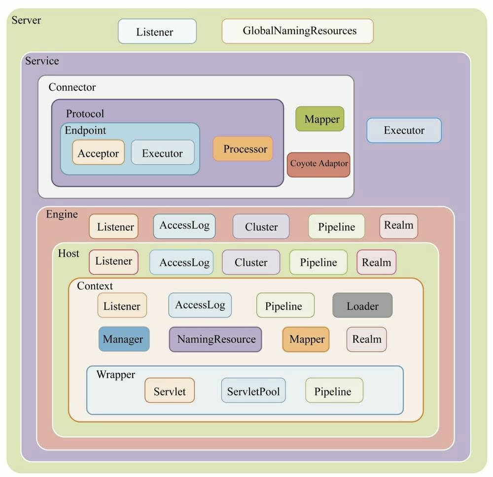

上图就是Tomcat整体架构的各个组件，后面来一个一个拆解分析！！！

## 2.1.连接器-Connector

为了让Servlet容器可以同时服务于不同端口，或者不同的应用层协议，Tomcat用Service组件组合Connector和Container（其实就是Engine组件），一个容器Container可以对接多个连接器Connector，它们之间通过标准的ServletRequest和ServletResponse通信：

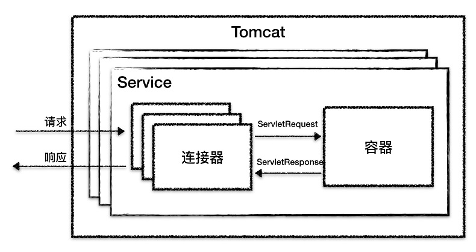

### 2.1.1.模块划分

从宏观角度看，连接器Connector的任务是：接收Sokcet连接，将byte stream转换为ServletRequest，再把执行完业务逻辑的ServletResponse写回到Socket。再细分一点，Connector的任务是：端口监听 → 接收Socket连接 → 读取Socket请求的字节流 → 根据具体应用层协议（HTTP/AJP）解析字节流，生成统一的 Tomcat Request 对象  → 将 Tomcat Request 对象转成标准的 ServletRequest → 调用 Servlet 容器，得到 ServletResponse → 将 ServletResponse 转成 Tomcat Response 对象 →  将 Tomcat Response 转成网络字节流 → 写回Socket对端！！

所以问题就来了，需要怎么设计Connector组件的子模块？这里可以借鉴Tomcat的设计思想，其实优秀的模块化设计应该考虑**高内聚、低耦合**：

- 高内聚：相关度比较高的功能要尽可能集中，不要分散
- 低耦合：两个相关的模块要尽可能减少依赖的部分和降低依赖的程度，不要让两个模块产生强依赖

虽然Connector需要完成的细节很多，但还是可以划分出高内聚的3个方面：

1. 网络通信：监听端口 + 接收连接 + 处理连接 + Socket数据读取等

2. 应用层协议解析：数据在网络都是通过字节传递，解析底层网络字节流等

3. Tomcat Request/Response 与 ServletRequest/ServletResponse 的转化

基于此，Tomcat设计了3个组件来实现连接器的功能，分别是：`EndPoint`、`Processor`、`Adapter`。Endpoint负责提供字节流给Processor，Processor负责提供Tomcat Request对象给Adapter，Adapter负责转换ServletRequest对象给容器

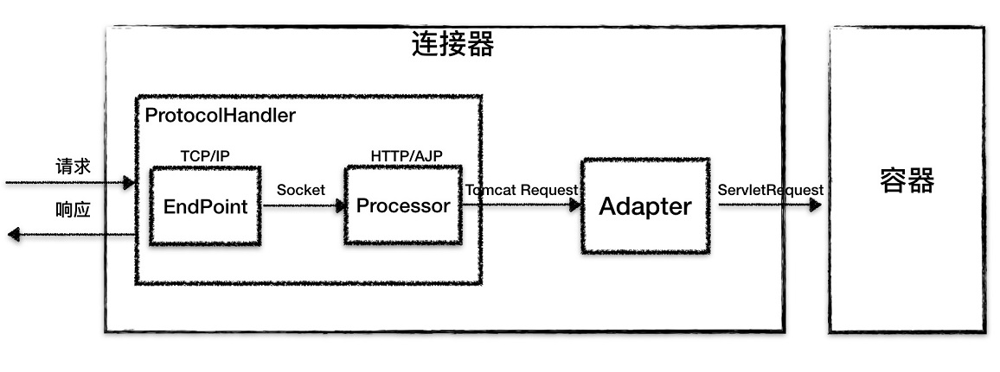

### 2.1.2.I/O模型&应用层协议

**Tomcat支持的I/O模型：**

- NIO：非阻塞 I/O，采用 Java NIO 类库实现
- NIO2：异步 I/O，采用 JDK 7 最新的 NIO2 类库实现
- APR：采用 Apache 可移植运行库实现，是 C/C++ 编写的本地库

**Tomcat支持的应用层协议：**

- HTTP/1.1：这是大部分 Web 应用采用的访问协议
- AJP：用于和 Web 服务器集成（如 Apache）
- HTTP/2：HTTP 2.0 大幅度的提升了 Web 性能

### 2.1.1.ProtocolHandler

Tomcat为了让I/O模型与应用层协议可以自由搭配，设计`ProtocolHandler`组件，将`EndPoint`和`Processor`组合到一起。这个跟前面所讲的将Connector和Container组合成Service的道理一样，Tomcat善用组合模式，可以让组件之间解耦，同时还可以自由搭配，灵活度高，是一种优秀的设计思想，值得学习。

面向对象编程的精髓就是继承和多态，同样Tomcat也会抽出稳定不变的基类AbstractProtocol，然后每一个应用层协议都有自己的抽象基类，例如AbstractAjpProtocol 和 AbstractHttp11Protocol，最后根据`I/O`模型实现抽象基类，继承关系如下：

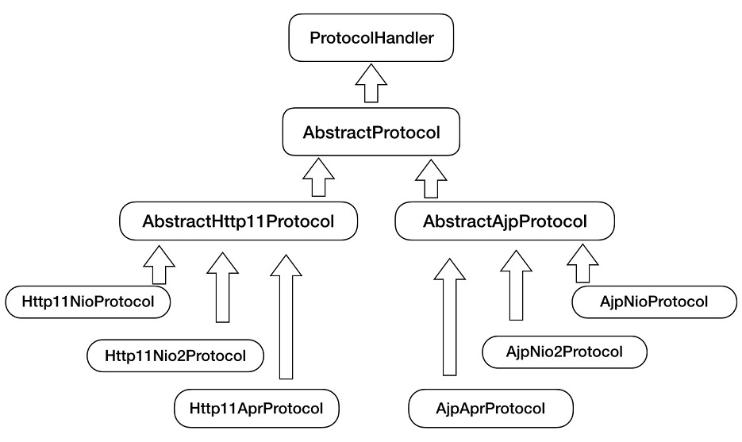

- **EndPoint**

  网络监听的通信接口，用来实现 TCP/IP 协议，对应tomcat源码的`org.apache.tomcat.util.net.AbstractEndpoint`，是具体的Socket接口和发送处理器。AbstractEndpoint 的具体子类，比如在：NioEndpoint 和 Nio2Endpoint ，有两个重要的子组件：Acceptor 和 SocketProcessor。Acceptor 用于监听 Socket 连接请求；SocketProcessor 用于处理接收到的 Socket 请求，它实现 Runnable 接口，在 Run 方法里调用协议处理组件 Processor 进行处理，为了提高处理能力，SocketProcessor 被提交到线程池来执行

- **Processor**

  应用层协议解析接口，用来实现HTTP协议，对应tomcat源码的`org.apache.coyote.Processor`。Processor 接收来自 EndPoint 的 Socket，读取字节流解析成 Tomcat Request 和 Response 对象，并通过 Adapter 将其提交到容器处理

EndPoint的Acceptor接收到Socket连接后，生成一个SocketProcessor任务提交到线程池(Executor)处理，SocketProcessor实现了Runnable接口，它的run()方法会调用Processor组件去解析应用层协议。Processor通过解析生成Request对象，调用Adapter的service()方法

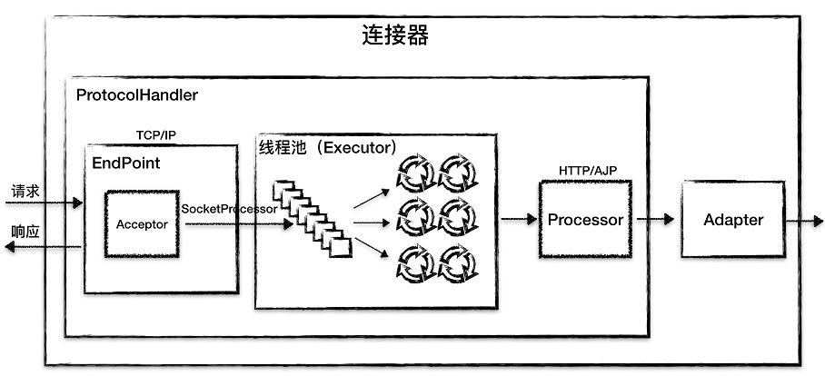

### 2.1.2.Adapter

Tomcat支持多种协议，每种协议的请求信息都不一样，Adapter之前的ProtocolHandler组件，仅仅是将不同协议的请求信息解析封装成Tomcat Request对象。之前讲过，连接器Connector与容器Container之间的交互对象是ServletRequest，所以Adapter就是负责将Tomcat Request转换成ServletRequest。Tomcat采用适配器模式，提供CoyoteAdapter，连接器调用 CoyoteAdapter 的 Sevice 方法，传入的是 Tomcat Request 对象，CoyoteAdapter 负责将 Tomcat Request 转成 ServletRequest，再调用容器的 Service 方法

## 2.2.容器-Container

经过连接器Connector处理后，网络请求已经被Tomcat转换成ServletRequest，这样连接器的任务就算完成了。后面，是Tomcat另一个组件Container来完成接下来的任务

### 2.2.1.层次结构

以HTTP协议来举例，一个标准的HTTP协议格式为：`http://ip:port/...`，也就是说ip:post（确切地说应该是域名）可以定位一台主机，后面的...表示访问路径，可以定位上下文路径和Servlet映射路径。基于这一种情况，**Tomcat 通过一种分层的架构，使得 Servlet 容器具有很好的灵活性**。它设计了 4 种容器： Engine、Host、Context 和 Wrapper，这 4 种容器不是平行关系，而是父子关系：

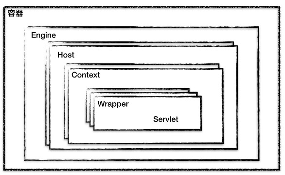

- Wrapper，表示一个Servlet
- Context，表示一个Web应用，即部署在Tomcat/webapps下的一个war就是一个Context，它可以包含多个Servlet；
- Host，表示一个虚拟主机(或者说站点)，一个虚拟主机可以部署多个Web应用，而tomcat可以配置多个虚拟主机；
- Engine，表示引擎，用来管理多个虚拟主机，但是一个容器(或者说Service)只能有一个Engine。

Tomcat设计的容器具有父子关系，形成一个树形结构，它是采用组合模式来管理这些组件。所有容器组件都实现了 Container 接口，因此组合模式可以使得用户对单容器对象和组合容器对象的使用具有一致性。这里单容器对象指的是最底层的 Wrapper，组合容器对象指的是上面的 Context、Host 或者 Engine。具体细节可以到[源码笔记](Tomcat源码.md)

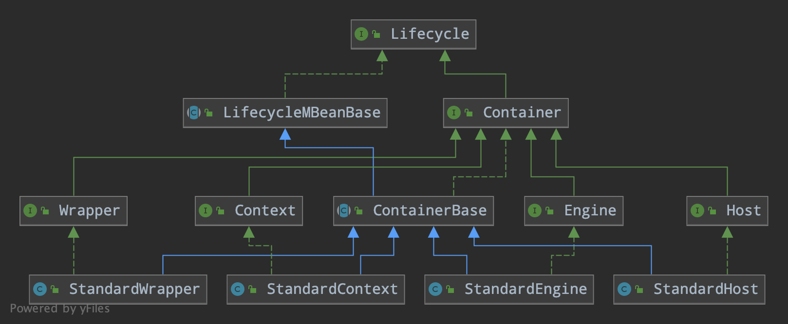

### 2.2.2.定位Servlet

Tomcat设计一个映射组件`org.apache.catalina.mapper.Mapper`，它保存了容器组件与访问路径的映射关系，例如：Host容器配置的域名、Context容器配置的Web应用根路径、Wrapper容器配置的Servlet映射路径。当一个请求到来时，Mapper根据URL的域名选定Host组件，再根据URL路径选定Context组件，最后还是根据URL路径定位具体的Wrapper(也就是Servlet)

这个有一个网上的例子，假设一个系统分为两个子系统：前台用户系统、后台管理系统。这两个系统部署在同一个Tomcat上，为了隔离不同的域名，运维同学部署了两个虚拟域名：`manage.shopping.com`和`user.shopping.com`。网站管理人员通过`manage.shopping.com`域名访问 Tomcat 去管理用户和商品，而用户管理和商品管理是两个单独的 Web 应用。客户通过`user.shopping.com`域名去搜索商品和下订单，搜索功能和订单管理也是两个独立的 Web 应用

这种情况下，Tomcat会创建一个Service组件，Service组件会包含一个HTTP连接器和一个Servlet容器。根据上面的层次架构分析，一个Servlet容器仅包含一个Engine容器组件。在Engine容器组件中会创建两个Host容器组件，每个Host容器组件又会创建两个Context子容器，表示两个Web应用。而每个Web应用下会有多个Servlet，还会在Context容器下创建多个Wrapper子容器，最终每个容器组件都有各自的访问路径，如图：

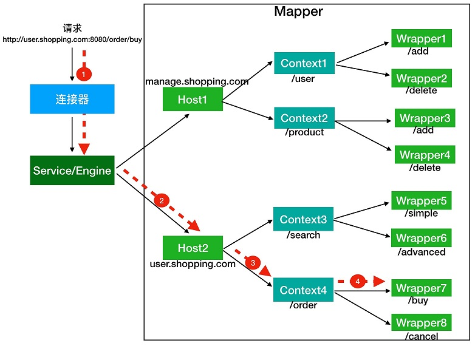

假如有用户访问一个 URL，比如图中的`http://user.shopping.com:8080/order/buy`，

**①根据协议和端口号选定Service和Engine**

Tomcat的每个连接器都会监听不同的端口号，默认HTTP连接器监听8080端口，默认AJP连接器监听8009端口。上面URL访问的是8080端口，因此这个请求会被HTTP连接器处理。连接器是属于一个Service组件的，所以Service组件就会被确定，同时，一个Service组件只包含一个Servlet容器，也就是确定了Engine容器

**②根据域名选定Host**

Service和Engine确定后，Mapper组件通过URL中的域名即`user.shopping.com`查找与之对应的Host容器组件，此时确定为Host2

**③根据URL路径确定Context**

Host组件确定后，Mapper根据URL路径来匹配Web应用的根路径，例子中的根路径为`/order`，所以确定为Context4

**④根据URL路径确定Wrapper**

Context确定后，Mapper就会通过`web.xml`中配置的Servlet映射路径来找到具体Wrapper，也就是具体的Servlet。

### 2.2.3.Pipeline-Value

实际上，在上面tomcat的查找过程中，会依次对请求做一些处理(其实就是责任链模式啦！)，连接器中的 Adapter 会调用容器的 Service 方法来执行 Servlet，最先拿到请求的是 Engine 容器，Engine 容器对请求做一些处理后，会把请求传给自己子容器 Host 继续处理，以此类推，最后这个请求会传给 Wrapper 容器，Wrapper 会调用Servlet 来处理。对客户端请求”加工“这一过程，tomcat是通过管道Pipeline-Value实现的。Valve表示一个处理点，它的getNext()方法会将其它Valve关联起来，形成一个链表。关键方法如下：

```java
public interface Valve {
    // 获取下一个处理点
    Valve getNext();
    // 设置下一个处理点
    void setNext(Valve valve);
    // 实际处理请求的逻辑
    void invoke(Request request, Response response)
}
```

Pipeline维护了 Valve 链表，每一个容器都有一个 Pipeline 对象，只要触发这个 Pipeline 的第一个 Valve，这个容器里 Pipeline 中的 Valve 就都会被调用到（由Valve自行调用getNext()方法转发请求给下一个Valve）

```java
public interface Pipeline extends Contained {
    void addValve(Valve valve);
    Valve getBasic();
    void setBasic(Valve valve);
    Valve getFirst();
}
```

不同容器的 Pipeline 触发，比如 Engine 中 Pipeline 需要调用下层容器 Host 中的 Pipeline，其实是通过getBasic()方法，它返回的Valve，处于 Valve 链表的末端，每个Pipeline 必定会有这一个 Valve，它负责调用下层容器的 Pipeline 里的第一个 Valve。Mapper组件在映射请求的时候，会在Request对象中存储相应的Host、Context等对象，这些存储的容器用来处理这个特定的请求，所以即使Engine容器下有多个Host容器，它也可以在Request对象拿到下一个要处理的Host容器：

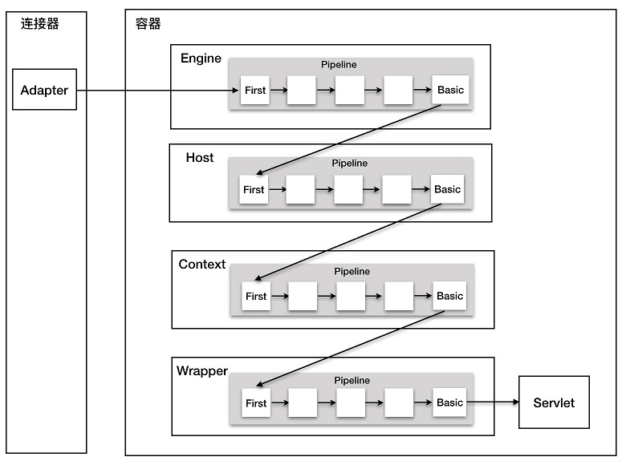

上图的整个调用过程由连接器中的 Adapter 触发的，它会调用 Engine 的第一个 Valve：

```java
// Calling the container
connector.getService().getContainer().getPipeline().getFirst().invoke(
    request, response);
```

Wrapper 容器的最后一个 Valve 会创建一个 Filter 链，并调用 doFilter() 方法，最终会调到 Servlet 的 service 方法。其实，Valve和Filter很相似，但是它们有很大的区别：

- Valve 是 Tomcat 的私有机制，与 Tomcat 的基础架构 /API 是紧耦合的。Servlet API 是公有的标准，所有的 Web 容器包括 Jetty 都支持 Filter 机制。
- 另一个重要的区别是 Valve 工作在 Web 容器级别，拦截所有应用的请求；而 Servlet Filter 工作在应用级别，只能拦截某个 Web 应用的所有请求。如果想做整个 Web 容器的拦截器，必须通过 Valve 来实现。

# 3.生命周期管理

Tomcat设计众多组件来保证高内聚低耦合，保证可扩展性。但是，组件数量多也会带来其它问题，比如组件的管理，在启动、关闭和销毁需要涉及多个组件的操作。Tomcat为了设计了LifeCycle接口，它定义生命周期钩子函数：init()、start()、stop() 和 destroy()，组件都实现这个接口，定义自己的处理逻辑。并且，上层组件在触发自己生命周期钩子函数的同时，会触发它管理的下层组件的钩子函数。其实老外设计框架很喜欢设计这个LifeCycle接口，新版Apache Dubbo也加入了这一特性。下图是Tomcat生命周期管理总体类图：

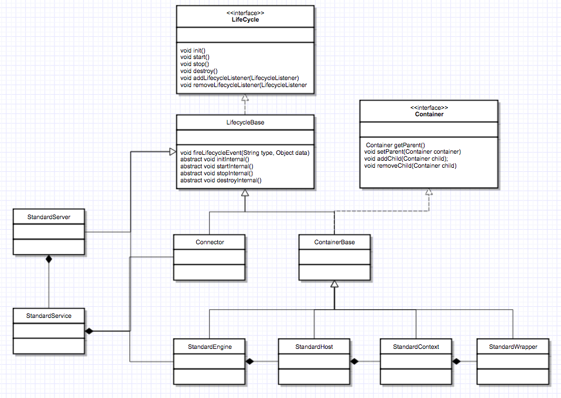

## 3.1.设计模式

Tomcat在实现组件生命周期管理，充分利用了**组合模式**、**观察者模式**和**模板模式**。

### 3.1.1.组合模式

Tomcat通过组合模式，用上层组件来管理它下一级组件，每个组件都是这样的管理方式。这样暴露给用户的是，只需要对一个组件进行访问，则可以达到一个完整系统调用的一致性效果。以Tomcat最顶级的组件Server来看，它的init()方法：

```java
public final class StandardServer extends LifecycleMBeanBase implements Server {
    /**
     * startInternal()实际就是LifeCycle接口的start()方法，Tomcat对其进行了抽象封装
     */
    protected void startInternal() throws LifecycleException {
        // 省略部分diamante
       	...
        // 启动各个Service
        synchronized (servicesLock) {
            for (Service service : services) {
                // 而Service又会去启动Connector和Engine，形成一个一键启停的效果
                service.start();
            }
        }
    }
}
```

### 3.1.2.观察者模式

设计框架，一个很重要的原则就是：开闭原则（对修改关闭，对扩展开放）同样的，Tomcat考虑自身的可扩展性，避免版本升级就得修改生命周期钩子函数，它引入了监听器LifecycleListener和LifecycleState。它设计了一套贯穿组件生命周期全过程的状态集合，例如：当组件刚创建则处于NEW状态，调用了init()方法处于INITIALIZED状态...在调用生命周期方法的前后，会改变组件的状态，而状态的改变会被封装成为一个个事件LifecycleEvent，由监听器来处理这些事件。


**Tomcat如何注册监听器**

- Tomcat 自定义了一些监听器，这些监听器是父组件在创建子组件的过程中注册到子组件的。比如 MemoryLeakTrackingListener 监听器，用来检测 Context 容器中的内存泄漏，这个监听器是 Host 容器在创建 Context 容器时注册到 Context 中的
- 自己还可以在 server.xml 中定义自己的监听器，Tomcat 在启动时会解析 server.xml，创建监听器并注册到容器组件

### 3.1.3.模板模式

模板模式主要体现了代码实现上，实际上状态的转变、事件的创建以及监听器的回调，这些操作其实没有必要在每个组件中自己实现，这会造成重复代码。Tomcat在实现这个功能的时候，把这些通用逻辑抽象了出来，定义为一个LifecycleBase抽象类，它会定义骨架方法，比如init()方法

```java
public final synchronized void init() throws LifecycleException {
    // 只有组件状态为 LifecycleState.NEW 时, 才能初始化
    if (!state.equals(LifecycleState.NEW)) {
        invalidTransition(Lifecycle.BEFORE_INIT_EVENT);
    }
    try {
        // 生命周期监听器 org.apache.catalina.LifecycleEvent, 初始化前事件回调
        setStateInternal(LifecycleState.INITIALIZING, null, false);
        // 子类组件真正执行初始化的逻辑
        initInternal();
        // 生命周期监听器 org.apache.catalina.LifecycleEvent, 初始化后事件回调
        setStateInternal(LifecycleState.INITIALIZED, null, false);
    } catch (Throwable t) {
        handleSubClassException(t, "lifecycleBase.initFail", toString());
    }
}
```

这些定义完以后，状态的改变，事件的创建和监听器的回调，都在抽象父类实现了，子类只需要实现真正的初始化逻辑即可。这是一个很好的设计模式，在JDK的AbstractQueueSynchronizer也很好的诠释了这一模式！！

# 4.连接器

Tomcat连接器的作用就是进行网络通信，读取字节流，将请求转换成ServletRequest交给Servlet容器。其中，在网络通信这一方面，Tomcat支持3种不同的I/O模型：NIOI、AIO、APR，NIO和AIO比较熟悉，主要是APR。

APR全称Apache Portable Runtime/Apache可移植运行时库，Tomcat将以JNI的形式调用Apache HTTP服务器的核心动态链接库来处理文件读取或网络传输操作，从而大大地提高Tomcat对静态文件的处理性能，**从操作系统级别来解决异步的IO问题,大幅度的提高性能。** Tomcat apr也是在Tomcat上运行高并发应用的首选模式。要让Tomcat以apr模式来运行，必须安装apr和native

## 4.1.NioEndpoint

Tomcat使用NioEndPoint基于java的nio包实现了 I/O 多路复用模型，主要包含了 LimitLatch、Acceptor、Poller、SocketProcessor 和 Executor 共 5 个组件。它的工作过程如下：

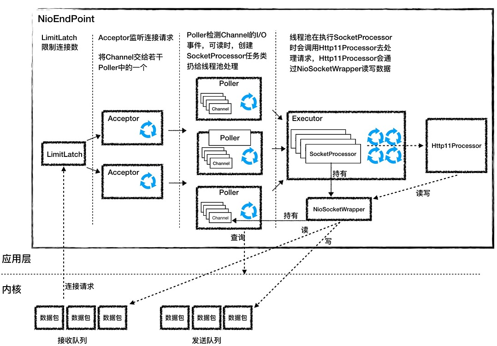

### 4.1.1.LimitLatch

连接控制器，它负责控制最大连接数，NIO 模式下默认是 10000，达到这个阈值后，连接请求被拒绝；当连接数到达最大时会阻塞线程，直到后续组件处理完一个连接后，才会将连接数减 1。但是需要注意到达最大连接数后，操作系统底层还是会接收客户端连接，但用户层已经不再接收；它是基于AQS实现，原理就跟Lock一样

### 4.1.2.Acceptor

创建Acceptor需要传入`org.apache.tomcat.util.net.AbstractEndpoint`，其实是为了持有ServerSocketChannel 对象，该对象在EndPoint的初始化代码：

```java
serverSock = ServerSocketChannel.open();
// bind 方法的第二个参数表示操作系统的等待队列长度，当应用层面的连接数到达最大值时，
// 操作系统可以继续接收连接，那么操作系统能继续接收的最大连接数就是这个队列长度，可以
// 通过 acceptCount 参数配置，默认是 100。
serverSock.socket().bind(addr,getAcceptCount());

// 设置成阻塞模式，也就是说它是以阻塞的方式接收连接的
serverSock.configureBlocking(true);
```

Acceptor跑在一个单独的线程里，它在一个死循环里调用ServerSocketChannel 的 accept() 方法来接收新连接，一旦有新的连接请求到来，accept() 方法返回获得 SocketChannel 对象，然后Acceptor会将 SocketChannel 对象封装在一个 PollerEvent 对象中，并将 PollerEvent 对象压入 Poller 的 Queue 里.这是个典型的生产者 - 消费者模式，Acceptor 与 Poller 线程之间通过 Queue 通信

### 4.1.3.Poller

独立运行在一个线程里，底层就是一个 Selector，每个 Poller 线程可能同时被多个 Acceptor 线程调用来注册 PollerEvent。Poller 不断的通过内部的 Selector 对象向内核查询 Channel 的状态，一旦可读就生成任务类 SocketProcessor 交给 Executor 去处理

```java
// 一个Poller拥有一个Selector
private Selector selector;

// 保证同一时刻只有一个 Acceptor 线程对 Queue 进行读写
private final SynchronizedQueue<PollerEvent> events = new SynchronizedQueue<>();
```

Poller 的另一个重要任务是循环遍历检查自己所管理的 SocketChannel 是否已经超时，如果有超时就关闭这个 SocketChannel

### 4.1.4.Executor

Tomcat自定义实现的线程池，负责运行 SocketProcessor 任务类，SocketProcessor 的 run 方法会调用 Http11Processor 来读取和解析请求数据。Http11Processor 是应用层协议的封装，它会调用容器获得响应，再把响应通过 Channel 写出

### 4.1.5.SocketProcessor

SocketProcessor实现了Runable接口，它的run()里面主要是调用Http11Processor 来处理请求。Tomcat会将Socket包装成一个SocketWrapper，Http11Processor 会调用SocketWrapper来读写数据

## 4.2.Nio2Endpoint

Nio2Endpoint的组件跟NioEndpoint类似，但是Nio2Endpoint 中没有 Poller 组件，也就是没有 Selector。这是因为在异步 I/O 模式下，Selector 的工作交给内核来做了

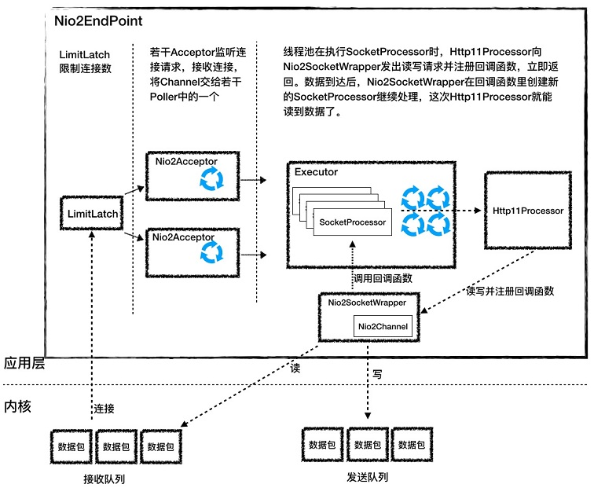

### 4.2.1.LimitLatch

跟NioEndPoint一样，连接控制器，它负责控制最大连接数

### 4.2.2.Nio2Acceptor

Nio2Acceptor 扩展了 Acceptor，并且 Nio2Acceptor 自己就是处理连接的回调类，因此 Nio2Acceptor 实现了 CompletionHandler 接口，用异步 I/O 的方式来接收连接，跑在一个单独的线程里，也是一个线程组。Nio2Acceptor 接收新的连接后，得到一个 AsynchronousSocketChannel，Nio2Acceptor 把 AsynchronousSocketChannel 封装成一个 Nio2SocketWrapper，并创建一个 SocketProcessor 任务类交给线程池处理，并且 SocketProcessor 持有 Nio2SocketWrapper 对象

```java
protected class Nio2Acceptor extends Acceptor<AsynchronousSocketChannel>
    implements CompletionHandler<AsynchronousSocketChannel, Void> {
    
@Override
public void completed(AsynchronousSocketChannel socket,
        Void attachment) {
        
    if (isRunning() && !isPaused()) {
        if (getMaxConnections() == -1) {
            // 如果没有连接限制，继续接收新的连接
            serverSock.accept(null, this);
        } else {
            // 如果有连接限制，就在线程池里跑 Run 方法，Run 方法会检查连接数
            getExecutor().execute(this);
        }
        // 处理请求
        if (!setSocketOptions(socket)) {
            closeSocket(socket);
        }
    } 
}
```

### 4.2.3.Nio2SocketWrapper

Nio2SocketWrapper封装了Channel，它是实际读取Channel内的数据，并提供接口给Http11Processor读写。但是由于异步I/O的性质，Http11Processor读取Nio2SocketWrapper时很有可能内核还没有将数据准备好，为了解决这个问题，Http11Processor采用了2次read调用：

1. 第一次 read 调用：连接刚刚建立好后，Acceptor 创建 SocketProcessor 任务类交给线程池去处理，Http11Processor 在处理请求的过程中，会调用 Nio2SocketWrapper 的 read 方法发出第一次读请求，同时注册了回调类 readCompletionHandler，因为数据没读到，Http11Processor 把当前的 Nio2SocketWrapper 标记为数据不完整。**接着 SocketProcessor 线程被回收，Http11Processor 并没有阻塞等待数据**。这里请注意，Http11Processor 维护了一个 Nio2SocketWrapper 列表，也就是维护了连接的状态
2. 第二次 read 调用：当数据到达后，内核已经把数据拷贝到 Http11Processor 指定的 Buffer 里，同时回调类 readCompletionHandler 被调用，在这个回调处理方法里会**重新创建一个新的 SocketProcessor 任务来继续处理这个连接**，而这个新的 SocketProcessor 任务类持有原来那个 Nio2SocketWrapper，这一次 Http11Processor 可以通过 Nio2SocketWrapper 读取数据了

这个回调类 readCompletionHandler 的源码如下，最关键的一点是，**Nio2SocketWrapper 是作为附件类来传递的**，这样在回调函数里能拿到所有的上下文。

## 4.3.AprEndpoint 

APR（Apache Portable Runtime Libraries）是 Apache 可移植运行时库，它会向上层应用程序提供一个跨平台的操作系统接口库。Tomcat的AprEndpoint 实现了APR功能，它是通过 JNI 调用 APR 本地库而实现非阻塞 I/O 的。

APR 提升性能的秘密还有：通过 DirectByteBuffer 避免了 JVM 堆与本地内存之间的内存拷贝；通过 sendfile 特性避免了内核与应用之间的内存拷贝以及用户态和内核态的切换。AprEndpoint 的工作流程和组件跟NioEndPoint很类似：

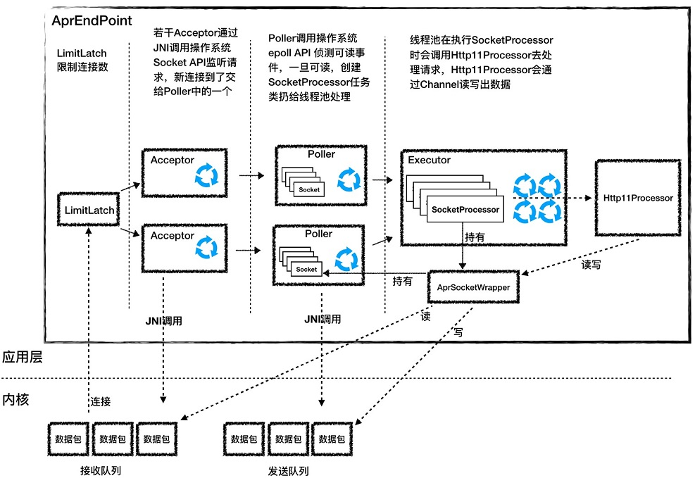

### 4.3.1.Acceptor

Tomcat定义了`org.apache.tomcat.jni.Socket`，它负责提供操作系统API。Accpetor 的功能就是监听连接，接收并建立连接。它的本质就是调用了下面的4个API：

```java
public class Socket {
    public static native long create(int family, int type, int protocol, 
                                     long cont);

    public static native int bind(long sock, long sa);
    public static native int listen(long sock, int backlog);
    public static native long accept(long sock);
    // 其它方法省略
}
```

### 4.3.2.pollor

Acceptor 接收到一个新的 Socket 连接后，它会把这个 Socket 交给 Poller 去查询 I/O 事件。 AprEndpoint 的 Poller 并不是调用 Java NIO 里的 Selector 来查询 Socket 的状态，而是通过 JNI 调用 APR 中的 poll 方法，而 APR 又是调用了操作系统的 epoll API 来实现的。

AprEndpoint使用的内存空间是本地内存，相比于NioEndpoint和Nio2Endpoint的堆内存，少了复制操作

## 4.4.线程池

### 4.4.1.ThreadPoolExecutor

Tomcat扩展了java里的线程池，提供`org.apache.tomcat.util.threads.ThreadPoolExecutor`，它改变了java原生线程池的执行逻辑，通过重写execute()方法：

```java
public void execute(Runnable command, long timeout, TimeUnit unit) {
    submittedCount.incrementAndGet();
    try {
        // 直接调用原生处理逻辑
        super.execute(command);
    } catch (RejectedExecutionException rx) {
        // 如果核心线程满了，队列也满了，非核心线程也达到最大值，那么java原生线程池就会
        // 拒绝这个任务，抛出RejectedExecutionException
        if (super.getQueue() instanceof TaskQueue) {
            final TaskQueue queue = (TaskQueue)super.getQueue();
            try {
                // 再继续尝试把任务添加到任务队列中去
                if (!queue.force(command, timeout, unit)) {
                    // 还是入队失败，则抛出RejectedExecutionException
                    submittedCount.decrementAndGet();
                    throw new RejectedExecutionException();
                }
            } catch (InterruptedException x) {
                submittedCount.decrementAndGet();
                throw new RejectedExecutionException(x);
            }
        } else {
            submittedCount.decrementAndGet();
            throw rx;
        }

    }
}
```

### 4.4.2.TaskQueue

Tomcat的线程池使用了定制化的阻塞队列，其实现为`org.apache.tomcat.util.threads.TaskQueue`，Tomcat重写了offer()方法，让这个阻塞队列在指定条件下能返回false，让线程池创建非核心线程

```java
public class TaskQueue extends LinkedBlockingQueue<Runnable> {
    @Override
    public boolean offer(Runnable o) {
        // 如果线程数已经到了最大值，不能创建新线程了，只能把任务添加到任务队列。
        if (parent.getPoolSize() == parent.getMaximumPoolSize()) 
            return super.offer(o);

        // 执行到这里，表明当前线程数大于核心线程数，并且小于最大线程数。
        // 表明是可以创建新线程的，那到底要不要创建呢？分两种情况：

        //1. 如果已提交的任务数小于当前线程数，表示还有空闲线程，无需创建新线程
        if (parent.getSubmittedCount()<=(parent.getPoolSize())) 
            return super.offer(o);

        //2. 如果已提交的任务数大于当前线程数，线程不够用了，返回 false 去创建新线程
        if (parent.getPoolSize() < parent.getMaximumPoolSize()) 
            return false;

        // 默认情况下总是把任务添加到任务队列
        return super.offer(o);
    }

}
```

这里还有一个小技巧，便于排查问题：

- 名字里带有Acceptor的线程负责接收浏览器的连接请求

- 名字里带有Poller的线程，其实内部是个Selector，负责侦测IO事件

- 名字里带有Catalina-exec的是工作线程，负责处理请求

- 名字里带有 Catalina-utility的是Tomcat中的工具线程，主要是干杂活，比如在后台定期检查Session是否过期、定期检查Web应用是否更新（热部署热加载）、检查异步Servlet的连接是否过期等等。

## 4.5.对象池

所谓的对象池技术，就是说一个 Java 对象用完之后把它保存起来，之后再拿出来重复使用，省去了对象创建、初始化和 GC 的过程。对象池技术是典型的以**空间换时间**的思路。Tomcat连接器中的SocketWrapper 和SocketProcessor，需要处理Socket请求，但由于请求时间短，并不能每次请求都创建一个新的对象去处理，然后还要花时间销毁，这种场景下Tomcat选择使用对象池！

### 4.5.1.SynchronizedStack 

Tomcat 用 SynchronizedStack 类来实现对象池，它的源码如下：

```java
public class SynchronizedStack<T> {

    // 内部维护一个对象数组, 用数组实现栈的功能
    private Object[] stack;

    // 这个方法用来归还对象，用 synchronized 进行线程同步
    public synchronized boolean push(T obj) {
        index++;
        if (index == size) {
            if (limit == -1 || size < limit) {
                expand();// 对象不够用了，扩展对象数组
            } else {
                index--;
                return false;
            }
        }
        stack[index] = obj;
        return true;
    }

    // 这个方法用来获取对象
    public synchronized T pop() {
        if (index == -1) {
            return null;
        }
        T result = (T) stack[index];
        stack[index--] = null;
        return result;
    }

    // 扩展对象数组长度，以 2 倍大小扩展
    private void expand() {
        int newSize = size * 2;
        if (limit != -1 && newSize > limit) {
            newSize = limit;
        }
        // 扩展策略是创建一个数组长度为原来两倍的新数组
        Object[] newStack = new Object[newSize];
        // 将老数组对象引用复制到新数组
        System.arraycopy(stack, 0, newStack, 0, size);
        // 将 stack 指向新数组，老数组可以被 GC 掉了
        stack = newStack;
        size = newSize;
    }
}
```

# 5.容器

## 5.1.Host

## 5.2.Context

## 5.3.异步Servlet

# 6.会话管理

# 7.集群管理

# 8.性能优化

## 8.1.启动优化

### 8.1.1.启动前优化

- 清理掉webapps目录下不需要的工程
- 清理server.xml没必要的配置
- 清理JAR文件，

### 8.1.2.禁止Tomcat TLD扫描

Tomcat 为了支持 JSP，在应用启动的时候会扫描 JAR 包里面的 TLD 文件，加载里面定义的标签库。因为目前web应用已经不再使用JSP，所以最好配置Tomcat不要去扫描这些JAR：

- 如果项目没有使用 JSP 作为 Web 页面模板，完全可以把 TLD 扫描禁止掉。方法是，找到 Tomcat 的`conf/`目录下的`context.xml`文件，在这个文件里 Context 标签下，加上**JarScanner**和**JarScanFilter**子标签，如：

  ```xml
  <Context>
  	<JarScanner>
      	<JarScanFilter defaultTldScan="false"/>
      </JarScanner>
  </Context>
  ```

- 如果项目使用了 JSP 作为 Web 页面模块，意味着 TLD 扫描无法避免，但是可以通过配置来告诉 Tomcat，只扫描那些包含 TLD 文件的 JAR 包。方法是，找到 Tomcat 的`conf/`目录下的`catalina.properties`文件，在这个文件里的 jarsToSkip 配置项中，加上需要扫描的 JAR 包

  ```properties
  tomcat.util.scan.StandardJarScanFilter.jarsToSkip=xxx.jar
  ```

### 8.1.3.关闭WebSocket支持

Tomcat 会扫描 WebSocket 注解的 API 实现，比如`@ServerEndpoint`注解的类，注解扫描一般是比较慢的，如果不需要使用 WebSockets 就可以关闭它。具体方法是，找到 Tomcat 的`conf/`目录下的`context.xml`文件，给 Context 标签加一个**containerSciFilter**的属性

```xml
<Context containerSciFilter="org.apache.tomcat.websocket.server.WsSci">
</Context>
```

如果完全不需要WebSocket功能，可以把Tomcat lib目录下的`websocket-api.jar`和`tomcat-websocket.jar`这两个jar文件删除掉

### 8.1.4.关闭JSP支持

跟关闭 WebSocket 一样，如果你不需要使用 JSP，可以通过类似方法关闭 JSP 功能，通过`|`可以关闭多个：

```xml
<Context containerSciFilter="org.apache.tomcat.websocket.server.WsSci | org.apache.jasper.servlet.JasperInitializer">
</Context>
```

### 8.1.5.禁止Servlet注解扫描

Servlet 3.0 引入了注解 Servlet，Tomcat 为了支持这个特性，会在 Web 应用启动时扫描类文件，如果没有使用 Servlet 注解这个功能，可以告诉 Tomcat 不要去扫描 Servlet 注解。具体配置方法是，在你的 Web 应用的`web.xml`文件中，设置`<web-app>`元素的属性`metadata-complete="true"`，

```xml
<!-- metadata-complete的意思是web.xml配置的Servlet是完整的，不需要再去类库查找Servlet -->
<web-app metadata-complete="true">
</web-app>
```

### 8.1.6.配置Web-Fragment扫描

Servlet 3.0 还引入了“Web 模块部署描述符片段”的`web-fragment.xml`，这是一个部署描述文件，可以完成`web.xml`的配置功能。而这个`web-fragment.xml`文件必须存放在 JAR 文件的`META-INF`目录下，而 JAR 包通常放在`WEB-INF/lib`目录下，因此 Tomcat 需要对 JAR 文件进行扫描才能支持这个功能。

可以通过配置`web.xml`里面的`<absolute-ordering>`元素直接指定了哪些 JAR 包需要扫描`web fragment`，如果`<absolute-ordering/>`元素是空的， 则表示不需要扫描，像下面这样

```xml
<web-app>
	...
    <absolute-ordering/>
    ...
</web-app>
```

### 8.1.7.并行启动多个Web应用

Tomcat 启动的时候，默认情况下 Web 应用都是一个一个启动的，等所有 Web 应用全部启动完成，Tomcat 才算启动完毕。如果在一个 Tomcat 下你有多个 Web 应用，为了优化启动速度，可以配置多个应用程序并行启动，可以通过修改`server.xml`中 Host 元素的 startStopThreads 属性来完成。startStopThreads 的值表示想用多少个线程来启动Web 应用，如果设成 0 表示要并行启动 Web 应用，像下面这样的配置。

```xml
<!--Engine 元素里也配置了这个参数，意味着若配置了多个 Host，Tomcat 会以并行的方式启动多个 Host-->
<Engine startStopThreads="0">
	<Host startStopThreads="0">
    </Host>
</Engine>
```

# 9.补充

设计复杂系统的思路：

- 分析需求，根据高内聚低耦合的原则确定子模块，然后找出子模块中的变化点和不变点，用接口和抽象基类去封装不变点，在抽象基类中定义模板方法，让子类自行实现抽象方法，也就是具体子类去实现变化点。

- 设计一个比较大的系统或者框架时，同样也需要考虑这几个问题：如何统一管理组件的创建、初始化、启动、停止和销毁？如何做到代码逻辑清晰？如何方便地添加或者删除组件？如何做到组件启动和停止不遗漏、不重复？

- 高并发就是能快速地处理大量的请求，需要合理设计线程模型让 CPU 忙起来，尽量不要让线程阻塞，因为一阻塞，CPU 就闲下来了
