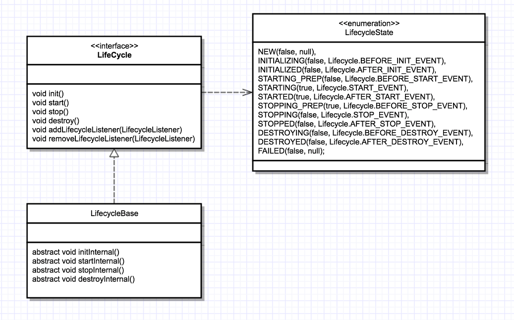

# 1.Tomcat简介

Tomcat是由Apache软件基金会属下Jakarta项目开发的Servlet容器，按照Sun Microsystems提供的技术规范，实现了对Servlet和JavaServer Page（JSP）的支持，并提供了作为Web服务器的一些特有功能，如Tomcat管理和控制平台、安全局管理和Tomcat阀等。由于Tomcat本身也内含了HTTP服务器，因此也可以视作单独的Web服务器。但是，不能将Tomcat和Apache HTTP服务器混淆，Apache HTTP服务器是用C语言实现的HTTPWeb服务器；这两个HTTP web server不是捆绑在一起的。Apache Tomcat包含了配置管理工具，也可以通过编辑XML格式的配置文件来进行配置。—— 以上来自[维基百科](https://zh.wikipedia.org/wiki/Apache_Tomcat)

简单地说：Tomcat就是HTTP服务器 + Servlet服务器，属于轻量级web容器！！！

## 1.1.Servlet规范

Java官方的Servlet规范地址：[https://jcp.org/en/jsr/detail?id=369](https://jcp.org/en/jsr/detail?id=369)，目前最新是**Servlet 4.0 Specification**，即4.0规范支持HTTP2.0！

`javax.servlet.Servlet`，是一个标准化接口，可以理解为运行在服务端的java小程序。服务器接收到请求后，确定并寻找合适的Servlet响应请求。为了让服务器与业务逻辑解耦，又定义了`Servlet Container`，即Servlet容器，由容器来创建和管理Servlet。Servlet接口和Servlet容器这一整套规范叫做Servlet规范！！！

```java
// Servlet接口源码
public interface Servlet {
  // 第一次创建Servlet, 调用init()初始化, 一般用来构建资源, 例如springmvc通过它创建spring容器.
  public void init(ServletConfig config) throws ServletException;
  
  // 获取Servlet的配置类
  public ServletConfig getServletConfig();
  
  // 执行业务逻辑的方法
  public void service(ServletRequest req, ServletResponse res) throws ServletException, IOException;
  
  // 获取Servlet信息
  public String getServletInfo();
  
  // 销毁Servlet调用, 一般用于释放资源
  public void destroy();
}
```

## 1.2.基本结构

Tomcat有两个类结构，名字是Tomcat开发者自己取的，分别是：

- Catalina(卡特琳娜?)，是Tomcat的servlet容器
- Coyote，是Tomcat的连接器组件

Catalina是Tomcat的核心模块，其他模块都是为 Catalina 提供下沉服务的，⽐如 ： Coyote 模块提供链接通信， Jasper 模块提供 JSP引擎 ， Naming 提供 JNDI服务 ， Juli 提供⽇志服务。整个 Tomcat 就是⼀个 Catalina实例 ， Tomcat 启动的时候会初始化这个实例， Catalina实例 通过加 server.xml 完成其他实例的创建，创建并管理⼀个 Server ， Server 创建并管理多个 服务(Service) ，每个 服务(Service) ⼜可以有多个 Connector 和⼀个 Container 

**tomcat日志**

- catalina.*.log：记录 Tomcat 启动过程的信息，这个文件可以看到启动的 JVM 参数以及操作系统等日志信息
- catalina.out：Tomcat 的标准输出（stdout）和标准错误（stderr），这是在 Tomcat 的启动脚本里指定的，如果没有修改的话 stdout 和 stderr 会重定向到这里，所以在这个文件里可以看到我们程序打印出来的信息
- localhost.*.log：记录 Web 应用在初始化过程中遇到的未处理异常，会被 Tomcat 捕获而输出这个日志文件
- localhost_access_log.*.txt：存放访问 Tomcat 的请求日志，包括 IP 地址以及请求的路径、时间、请求协议以及状态码等信息。
- manager.\*\*.log/host-manager.*.log： Tomcat 自带的 manager 项目的日志信息

## 1.3.工作流程

Tomcat分为两大部分：HTTP服务器 + Servlet容器，HTTP服务器负责接收网络请求，Servlet容器负责管理和调度Servlet实例。HTTP服务器监听网络请求，如果有客户端发起资源请求，它会将请求信息封装成`javax.servlet.ServletRequest`，然后调用Servlet容器的service()方法；Servlet容器根据请求的URL和Servlet映射关系，定位需要处理请求的Servlet；若该Servlet未加载，Servlet容器会创建它并调用init()方法初始化，然后调用Servlet的service()方法处理请求，最后把`javax.servlet.ServletResponse`返回给HTTP服务器；HTTP服务器再把响应返回给客户端。

**Tomcat高并发设计**的总结，下面各个部分就是针对这5点的具体分析：

1. I/O 和线程模型
2. 减少系统调用
3. 池化、零拷贝
4. 高效的并发编程，尽量避免锁，或者减小锁的粒度
5. 并发容器的使用

## 1.4.源码目录

tomcat源码目录，org.apache.*

- catalina：Catalina是Tomcat提供的Servlet容器实现,负责处理来自客户端的请求并输出响应,里面有Server、Service、Connector、Container、Engine、Host、Context、Wrapper、Executor；
- coyote：Tomcat链接器框架的名称,是Tomcat服务器提供的供客户端访问的外部接口,客户端通过Coyote 与Catalina容器进行通信. 我们比较熟悉的Request, Response 就是来自于Coyote模块；
- el：Expression Language, java表达式语言, 这个对应的就是我们jsp中取值的那些
- jasper：jsp引擎,我们可以在jsp中引入各种标签,在不重启服务器的情况下,检测jsp页面是否有更新,等等
- juli：日志相关的
- naming：命名空间,JNDI,用于java目录服务的API,JAVA应用可以通过JNDI API 按照命名查找数据和对象,常用的有: 1.将应用连接到一个外部服务,如数据库. 2. Servlet通过JNDI查找 WEB容器提供的配置信息
- tomcat：附加功能,如websocket等

# 2.Tomcat架构

Tomcat作为一款轻量级的Web容器，它需要实现的2个功能：

①处理Socket连接，负责网络字节流与Request、Response对象的转化；

②加载、管理和调度Servlet，处理Request请求；

Tomcat在架构设计时，分为了两大组件：**连接器**(即Connector)-负责处理连接；**容器**(Container)-负责内部调度。一个容器Container可以对接多个连接器Connector，这样可以支持多种协议。但是容器和连接器并不能独立运行，它们必须配合使用，tomcat会把它们组装到一起成为一个`Service`，通过在 Tomcat 中配置多个 Service，可以实现通过不同的端口号来访问同一台机器上部署的不同应用。最顶层是 Server，这里的 Server 就是一个 Tomcat 实例。一个 Server 中有一个或者多个 Service，一个 Service 中有多个连接器和一个容器。连接器与容器之间通过标准的 ServletRequest 和 ServletResponse 通信


**Tomcat支持的I/O模型：**

- NIO：非阻塞 I/O，采用 Java NIO 类库实现。
- NIO2：异步 I/O，采用 JDK 7 最新的 NIO2 类库实现。
- APR：采用 Apache 可移植运行库实现，是 C/C++ 编写的本地库

**Tomcat支持的应用层协议：**

- HTTP/1.1：这是大部分 Web 应用采用的访问协议。
- AJP：用于和 Web 服务器集成（如 Apache）。
- HTTP/2：HTTP 2.0 大幅度的提升了 Web 性能。

## 2.1.连接器

连接器的功能细化：

- 监听网络端口。
- 接受网络连接请求。
- 读取请求网络字节流。
- 根据具体应用层协议（HTTP/AJP）解析字节流，生成统一的 Tomcat Request 对象。
- 将 Tomcat Request 对象转成标准的 ServletRequest。
- 调用 Servlet 容器，得到 ServletResponse。
- 将 ServletResponse 转成 Tomcat Response 对象。
- 将 Tomcat Response 转成网络字节流。
- 将响应字节流写回给浏览器。

tomcat设计了3个组件来实现连接器的功能，分别是：EndPoint、Processor、Adapter。Endpoint负责提供字节流给Processor，Processor负责提供Tomcat Request对象给Adapter，Adapter负责转换ServletRequest对象给容器。


为了让`I/O`模型和应用层协议能够自由搭配，tomcat提供ProtocolHandler接口，来将网络通信(EndPoint)和应用层协议解析(Processor)放在一起处理。面向对象编程的精髓就是继承和多态，同样tomcat也会抽出稳定不变的基类AbstractProtocol，然后每一个应用层协议都有自己的抽象基类，例如AbstractAjpProtocol 和 AbstractHttp11Protocol，最后根据`I/O`模型实现抽象基类，继承关系如下：


### 2.1.1.ProtocolHandler

Tomcat提供了ProtocolHandler，合并了EndPoint和Processor两个基础组件，来处理网络连接和应用层协议。

- EndPoint

  网络监听的通信接口，用来实现 TCP/IP 协议，对应tomcat源码的`org.apache.tomcat.util.net.AbstractEndpoint`，是具体的Socket接口和发送处理器。AbstractEndpoint 的具体子类，比如在：NioEndpoint 和 Nio2Endpoint ，有两个重要的子组件：Acceptor 和 SocketProcessor。Acceptor 用于监听 Socket 连接请求。SocketProcessor 用于处理接收到的 Socket 请求，它实现 Runnable 接口，在 Run 方法里调用协议处理组件 Processor 进行处理。为了提高处理能力，SocketProcessor 被提交到线程池来执行。而这个线程池叫作执行器（Executor)

- Processor

  应用层协议解析接口，用来实现HTTP协议，对应tomcat源码的`org.apache.coyote.Processor`。Processor 接收来自 EndPoint 的 Socket，读取字节流解析成 Tomcat Request 和 Response 对象，并通过 Adapter 将其提交到容器处理


EndPoint的Acceptor接收到Socket连接后，生成一个SocketProcessor任务提交到线程池(Executor)处理，SocketProcessor实现了Runnable接口，它的run()方法会调用Processor组件去解析应用层协议。Processor通过解析生成Request对象，调用Adapter的service()方法。

### 2.1.2.Adapter

tomcat支持多种协议，那么每种协议的请求信息都不一样，Adapter之前的ProtocolHandler组件，仅仅是将不同协议的请求信息解析封装成Tomcat Request对象。之前讲过，连接器Connector与容器Container之间的交互对象是ServletRequest，所以Adapter就是负责将Tomcat Request转换成ServletRequest。tomcat采用适配器模式，提供CoyoteAdapter，连接器调用 CoyoteAdapter 的 Sevice 方法，传入的是 Tomcat Request 对象，CoyoteAdapter 负责将 Tomcat Request 转成 ServletRequest，再调用容器的 Service 方法。

## 2.2.容器

在tomcat里，容器Container就是来装载和调度Servlet的

### 2.2.1.Engine

**Tomcat 通过一种分层的架构，使得 Servlet 容器具有很好的灵活性**。它设计了 4 种容器： Engine、Host、Context 和 Wrapper，这 4 种容器不是平行关系，而是父子关系：


前面说过，一个Tomcat实例可以有多个Service，一个Service由一个容器 + 多个连接器组成。上图就是容器的构造：

- Wrapper，表示一个Servlet
- Context，表示一个Web应用，即部署在tomcat/webapp下的一个war就是一个Context，它可以包含多个Servlet；
- Host，表示一个虚拟主机(或者说站点)，一个虚拟主机可以部署多个Web应用，而tomcat可以配置多个虚拟主机；
- Engine，表示引擎，用来管理多个虚拟主机，但是一个容器(或者说Service)只能有一个Engine。

其实tomcat重要的配置文件`server.xml`也是根据这种层次关系设计，它的整体结构如下：

```xml
<Server> 		<!-- 顶层组件, 表示一个Tomcat实例, 它可以包含多个Service -->
  <Service> <!-- 一个Service可以包含多个Connector和一个Engine -->
    <Connector> <!--连接器组件, 表示通信接口 -->
    <Connector />
    <Engine> <!-- 容器组件, 一个Engine可以包含多个Host, 处理Service中的所有请求 -->
      <Host> <!-- 容器组件, 处理特定Host下的请求, 可以包含多个Host -->
        <Context> <!-- 容器组件, 处理特定Web应用的请求 -->
        <Context/>
      </Host>
    </Engine>
  </Service>
</Server> 
```

tomcat设计的容器具有父子关系，形成一个树形结构，它是采用组合模式来管理这些组件。所有容器组件都实现了 Container 接口，因此组合模式可以使得用户对单容器对象和组合容器对象的使用具有一致性。这里单容器对象指的是最底层的 Wrapper，组合容器对象指的是上面的 Context、Host 或者 Engine


其中Container接口的部分类定义：

```java
public interface Container extends Lifecycle {
  String ADD_CHILD_EVENT = "addChild";
  String ADD_VALVE_EVENT = "addValve";
  String REMOVE_CHILD_EVENT = "removeChild";
  String REMOVE_VALVE_EVENT = "removeValve";


  String getName();
  public void setName(String name);
  public Container getParent();
  public void setParent(Container container);
  public void addChild(Container child);
  public void removeChild(Container child);
  public Container findChild(String name);
}
```

### 2.2.2.Mapper

其实，Tomcat将容器拆分成这么多层次，也就带来一个难题，那就是怎么将客户的请求信息定位到最底层的Servlet上。Tomcat设计一个映射组件`org.apache.catalina.mapper.Mapper`，它保存了容器组件与访问路径的映射关系，例如：Host容器配置的域名、Context容器配置的Web应用根路径、Wrapper容器配置的Servlet映射路径。当一个请求到来时，Mapper根据URL的域名选定Host组件，再根据URL路径选定Context组件，最后还是根据URL路径定位具体的Wrapper(也就是Servlet)

这个有一个网上的例子，假设一个系统分为两个子系统：前台用户系统、后台管理系统。这两个系统部署在同一个Tomcat上，为了隔离不同的域名，运维同学部署了两个虚拟域名：`manage.shopping.com`和`user.shopping.com`。网站管理人员通过`manage.shopping.com`域名访问 Tomcat 去管理用户和商品，而用户管理和商品管理是两个单独的 Web 应用。客户通过`user.shopping.com`域名去搜索商品和下订单，搜索功能和订单管理也是两个独立的 Web 应用

这种情况下，Tomcat会创建一个Service组件，Service组件会包含一个HTTP连接器和一个Servlet容器。根据上面的层次架构分析，一个Servlet容器仅包含一个Engine容器组件。在Engine容器组件中会创建两个Host容器组件，每个Host容器组件又会创建两个Context子容器，表示两个Web应用。而每个Web应用下会有多个Servlet，还会在Context容器下创建多个Wrapper子容器，最终每个容器组件都有各自的访问路径，如图：


假如有用户访问一个 URL，比如图中的`http://user.shopping.com:8080/order/buy`，

**①根据协议和端口号选定Service和Engine**

Tomcat的每个连接器都会监听不同的端口号，默认HTTP连接器监听8080端口，默认AJP连接器监听8009端口。上面URL访问的是8080端口，因此这个请求会被HTTP连接器处理。连接器是属于一个Service组件的，所以Service组件就会被确定，同时，一个Service组件只包含一个Servlet容器，也就是确定了Engine容器

**②根据域名选定Host**

Service和Engine确定后，Mapper组件通过URL中的域名即`user.shopping.com`查找与之对应的Host容器组件，此时确定为Host2

**③根据URL路径确定Context**

Host组件确定后，Mapper根据URL路径来匹配Web应用的根路径，例子中的根路径为`/order`，所以确定为Context4

**④根据URL路径确定Wrapper**

Context确定后，Mapper就会通过`web.xml`中配置的Servlet映射路径来找到具体Wrapper，也就是具体的Servlet。

### 2.2.3.Pipeline-Value

实际上，在上面tomcat的查找过程中，会依次对请求做一些处理(其实就是责任链模式啦！)，连接器中的 Adapter 会调用容器的 Service 方法来执行 Servlet，最先拿到请求的是 Engine 容器，Engine 容器对请求做一些处理后，会把请求传给自己子容器 Host 继续处理，以此类推，最后这个请求会传给 Wrapper 容器，Wrapper 会调用Servlet 来处理。对客户端请求”加工“这一过程，tomcat是通过管道Pipeline-Value实现的。

Valve表示一个处理点，它的getNext()方法会将其它Valve关联起来，形成一个链表。关键方法如下：

```java
public interface Valve {
  // 获取下一个处理点
  Valve getNext();
  // 设置下一个处理点
  void setNext(Valve valve);
  // 实际处理请求的逻辑
  void invoke(Request request, Response response)
}
```

Pipeline维护了 Valve 链表，每一个容器都有一个 Pipeline 对象，只要触发这个 Pipeline 的第一个 Valve，这个容器里 Pipeline 中的 Valve 就都会被调用到（由Valve自行调用getNext()方法转发请求给下一个Valve）

```java
public interface Pipeline extends Contained {
  void addValve(Valve valve);
  Valve getBasic();
  void setBasic(Valve valve);
  Valve getFirst();
}
```

不同容器的 Pipeline 是怎么链式触发的呢，比如 Engine 中 Pipeline 需要调用下层容器 Host 中的 Pipeline，其实是通过getBasic()方法，它返回的Valve，处于 Valve 链表的末端，每个Pipeline 必定会有这一个 Valve，它负责调用下层容器的 Pipeline 里的第一个 Valve。Mapper组件在映射请求的时候，会在Request对象中存储相应的Host、Context等对象，这些存储的容器用来处理这个特定的请求，所以即使Engine容器下有多个Host容器，它也可以在Request对象拿到下一个要处理的Host容器：


上图的整个调用过程由连接器中的 Adapter 触发的，它会调用 Engine 的第一个 Valve：

```java
// Calling the container
connector.getService().getContainer().getPipeline().getFirst().invoke(request, response);
```

Wrapper 容器的最后一个 Valve 会创建一个 Filter 链，并调用 doFilter() 方法，最终会调到 Servlet 的 service 方法。其实，Valve和Filter很相似，但是它们有很大的区别：

- Valve 是 Tomcat 的私有机制，与 Tomcat 的基础架构 /API 是紧耦合的。Servlet API 是公有的标准，所有的 Web 容器包括 Jetty 都支持 Filter 机制。
- 另一个重要的区别是 Valve 工作在 Web 容器级别，拦截所有应用的请求；而 Servlet Filter 工作在应用级别，只能拦截某个 Web 应用的所有请求。如果想做整个 Web 容器的拦截器，必须通过 Valve 来实现。

# 3.组件生命周期

架构设计就是要找到系统的变化点和不变点。Tomcat的不变点就是每个组件都要经历创建、初始化、启动和销毁这4个过程，这些状态以及状态的转化是不变的。而变化点是每个组件的生命周期方法实现不一样。基于这一考虑，Tomcat开发者，定义了Lifecycle接口。接口里定义了：init()、start()、stop() 和 destroy()，每个具体的组件去实现这些方法。

## 3.1.Lifecycle

`org.apache.catalina.Lifecycle`主要定义了Tomcat组件生命周期方法，以及增删查`org.apache.catalina.LifecycleListener`的方法，源码为

```java
public interface Lifecycle {
  	/*
  	 * 当期组件的监听器
  	 */
  	void addLifecycleListener(LifecycleListener listener);
  	LifecycleListener[] findLifecycleListeners();
  	void removeLifecycleListener(LifecycleListener listener);
  
  	// 组件被创建出来, 进行初始化时调用
  	void init() throws LifecycleException;
  
  	// 组件启动时, 会调用此方法
  	void start() throws LifecycleException;
  
  	// 组件停止时, 会调用此方法
  	void stop() throws LifecycleException;
  
  	// 组件销毁时, 会调用此方法
  	void destroy() throws LifecycleException;
}
```

其中，每个组件在一个瞬时间内，都会处于一个状态，这个状态Tomcat用`org.apache.catalina.LifecycleState`来表示，源码为：

```java
public enum LifecycleState {
  	// 创建后未初始化前, 处于这个状态
    NEW(false, null),
  
  	// 依次表示：初始化中、初始化后
    INITIALIZING(false, Lifecycle.BEFORE_INIT_EVENT),
    INITIALIZED(false, Lifecycle.AFTER_INIT_EVENT),
  
  	// 依次表示：开启前、启动中、开启后
    STARTING_PREP(false, Lifecycle.BEFORE_START_EVENT),
    STARTING(true, Lifecycle.START_EVENT),
    STARTED(true, Lifecycle.AFTER_START_EVENT),
  
  	// 依次表示：关闭前、关闭时、关闭后
    STOPPING_PREP(true, Lifecycle.BEFORE_STOP_EVENT),
    STOPPING(false, Lifecycle.STOP_EVENT),
    STOPPED(false, Lifecycle.AFTER_STOP_EVENT),
  
  	// 依次表示：销毁前、销毁时、销毁后
    DESTROYING(false, Lifecycle.BEFORE_DESTROY_EVENT),
    DESTROYED(false, Lifecycle.AFTER_DESTROY_EVENT),
    FAILED(false, null);

  	// avaiable为true时, 表示当期组件可以被使用
    private final boolean available;
  	// lifecycleEvent是对 LifecycleState 的事件描述, 放在Lifecycle中
    private final String lifecycleEvent;
}
```

## 3.2.LifecycleBase

`org.apache.catalina.util.LifecycleBase`是`org.apache.catalina.Lifecycle`的基本实现，其实这是一种`模板设计模式`的实现，LifecycleBase实现了原先Lifecycle定义的4个生命周期方法，然后对它进行了状态判断 + 监听器回调(这些都是所有组件通用的逻辑，所以Tomcat将其放到了抽象父类中，然后再抽象父类中定义模板方法，把子类即具体组件的真正逻辑放到模板方法里面)。重要属性如下：

```java
public abstract class LifecycleBase implements Lifecycle {
  	// 该组件的监听器集合, 用的是CopyOnWriteArrayList, 线程安全, 适用于读多写少的场景
  	private final List<LifecycleListener> lifecycleListeners = new CopyOnWriteArrayList<>();
  
  	// 当前组件的状态, 加上了 volatile, 可以达到线程可见性. 同时, 每个组件一创建, 都是属于 NEW 即创建状态
  	private volatile LifecycleState state = LifecycleState.NEW;
}
```

此外，LifecycleBase还额外定义如下4种类型的生命周期方法：



- 组件初始化

```java
/**
 * 实现自Lifecycle的init()方法
 */
public final synchronized void init() throws LifecycleException {
  // 只有组件状态为 LifecycleState.NEW 时, 才能初始化
  if (!state.equals(LifecycleState.NEW)) {
    	invalidTransition(Lifecycle.BEFORE_INIT_EVENT);
  }
  try {
      // 生命周期监听器 org.apache.catalina.LifecycleEvent, 初始化前事件回调
      setStateInternal(LifecycleState.INITIALIZING, null, false);
      // 子类组件真正执行初始化的逻辑
      initInternal();
      // 生命周期监听器 org.apache.catalina.LifecycleEvent, 初始化后事件回调
      setStateInternal(LifecycleState.INITIALIZED, null, false);
  } catch (Throwable t) {
    	handleSubClassException(t, "lifecycleBase.initFail", toString());
  }
}

/**
 * 具体组件的真正初始化逻辑
 */
protected abstract void initInternal() throws LifecycleException;
```

- 组件启动

```java
/**
 * 实现自Lifecycle的start()方法
 */
public final synchronized void start() throws LifecycleException {
	// 处理启动前、启动中、启动后这3个状态时, 表示已经启动状态, 无须再次启动, 方法返回.
  if (LifecycleState.STARTING_PREP.equals(state) || LifecycleState.STARTING.equals(state) ||
      LifecycleState.STARTED.equals(state)) {
    	// ... 省略日志
    	return;
  }
	
  if (state.equals(LifecycleState.NEW)) {
    	// 如果处于NEW即创建状态, 则执行初始化, 调用上面的init()方法
    	init();
  } else if (state.equals(LifecycleState.FAILED)) {
    	// 如果处于失败状态, 调用stop()将组件停止
    	stop();
  } else if (!state.equals(LifecycleState.INITIALIZED) && !state.equals(LifecycleState.STOPPED)) {
    	// 只有处于 初始化 或者 已停止 这两个状态时, 才允许启动, 其它状态抛出异常LifecycleException
    	invalidTransition(Lifecycle.BEFORE_START_EVENT);
  }

  try {
    	// // 生命周期监听器 org.apache.catalina.LifecycleEvent, 启动前事件回调
      setStateInternal(LifecycleState.STARTING_PREP, null, false);
    	// 真正启动逻辑
      startInternal();
    	
      if (state.equals(LifecycleState.FAILED)) {
        	// 如果启动失败, 组件会将自己的state改为FAILED, 此时就会回调stop()方法, 停止组件
        	stop();
      } else if (!state.equals(LifecycleState.STARTING)) {
        	// 如果不处于启动中的状态, 说明子类乱设置状态, 抛出LifecycleException
        	invalidTransition(Lifecycle.AFTER_START_EVENT);
      } else {
        	// 生命周期监听器 org.apache.catalina.LifecycleEvent, 启动后事件回调
        	setStateInternal(LifecycleState.STARTED, null, false);
      }
  } catch (Throwable t) {
      // This is an 'uncontrolled' failure so put the component into the
      // FAILED state and throw an exception.
      handleSubClassException(t, "lifecycleBase.startFail", toString());
  }
}

/**
 * 具体组件的真正启动逻辑
 */
protected abstract void startInternal() throws LifecycleException;
```

- 组件关闭

```java
/**
 * 实现自Lifecycle的stop()方法
 */
public final synchronized void stop() throws LifecycleException {

  // 组件已停止, 即处于 停止前、停止中、停止后 这3个状态时, 直接返回
  if (LifecycleState.STOPPING_PREP.equals(state) || LifecycleState.STOPPING.equals(state) ||
      LifecycleState.STOPPED.equals(state)) {
    	// ...省略日志
    	return;
  }

  if (state.equals(LifecycleState.NEW)) {
    	// 组件刚创建出来, 没有初始化, 就没有创建资源, 直接修改它的状态, 然后返回
      state = LifecycleState.STOPPED;
      return;
  }

  if (!state.equals(LifecycleState.STARTED) && !state.equals(LifecycleState.FAILED)) {
    	// 只有处于 启动中 || 已失败 状态的组件, 才可以停止.
    	invalidTransition(Lifecycle.BEFORE_STOP_EVENT);
  }

  try {
      if (state.equals(LifecycleState.FAILED)) {
          // 如果组件是处于失败状态, 不需要过渡到STOPPING_PREP状态, 直接触发STOPPING_PREP事件回调就行了
          fireLifecycleEvent(BEFORE_STOP_EVENT, null);
      } else {
          // 如果是启动中状态的组件被停止了, 那就需要过渡到STOPPING_PREP状态, 同时触发监听器回调.
          setStateInternal(LifecycleState.STOPPING_PREP, null, false);
      }
      // 真正停止组件
      stopInternal();

      if (!state.equals(LifecycleState.STOPPING) && !state.equals(LifecycleState.FAILED)) {
          // 执行停止逻辑后的组件, 只允许处于STOPPING || FAILED状态, 其它状态说明出现了乱设置状态的问题, 直接抛异常
          invalidTransition(Lifecycle.AFTER_STOP_EVENT);
      }
			// 生命周期监听器 org.apache.catalina.LifecycleEvent, 停止后事件回调
      setStateInternal(LifecycleState.STOPPED, null, false);
  } catch (Throwable t) {
    	handleSubClassException(t, "lifecycleBase.stopFail", toString());
  } finally {
      if (this instanceof Lifecycle.SingleUse) {
        // Complete stop process first
        setStateInternal(LifecycleState.STOPPED, null, false);
        destroy();
      }
  }
}

/**
 * 具体组件的真正停止逻辑
 */
protected abstract void stopInternal() throws LifecycleException;
```

- 组件销毁

```java
public final synchronized void destroy() throws LifecycleException {
  if (LifecycleState.FAILED.equals(state)) {
      try {
        // 组件处于FAILED状态, 直接回调上面的stop()方法将其停止
        stop();
      } catch (LifecycleException e) {
        // Just log. Still want to destroy.
        log.error(sm.getString("lifecycleBase.destroyStopFail", toString()), e);
      }
  }

  if (LifecycleState.DESTROYING.equals(state) || LifecycleState.DESTROYED.equals(state)) {
    	// 已经处于销毁状态, 无需重复销毁, 直接返回
    	// ...这里省略掉日志
	    return;
  }

  if (!state.equals(LifecycleState.STOPPED) && !state.equals(LifecycleState.FAILED) &&
      !state.equals(LifecycleState.NEW) && !state.equals(LifecycleState.INITIALIZED)) {
    	// 只有处于这四种状态的组件, 才允许销毁：STOPPED、FAILED、NEW、INITIALIZED
    	invalidTransition(Lifecycle.BEFORE_DESTROY_EVENT);
  }

  try {
    	// 生命周期监听器 org.apache.catalina.LifecycleEvent, 销毁前事件回调
      setStateInternal(LifecycleState.DESTROYING, null, false);
    	// 执行真正销毁逻辑
      destroyInternal();
    	// 生命周期监听器 org.apache.catalina.LifecycleEvent, 销毁后事件回调
      setStateInternal(LifecycleState.DESTROYED, null, false);
  } catch (Throwable t) {
    	handleSubClassException(t, "lifecycleBase.destroyFail", toString());
  }
}

/**
 * 具体组件的真正销毁逻辑
 */
protected abstract void destroyInternal() throws LifecycleException;
```

## 3.3.补充

- Tomcat 自定义了一些监听器，这些监听器是父组件在创建子组件的过程中注册到子组件的。比如 MemoryLeakTrackingListener 监听器，用来检测 Context 容器中的内存泄漏，这个监听器是 Host 容器在创建 Context 容器时注册到 Context 中的；

- 还可以在 server.xml 中定义自己的监听器，Tomcat 在启动时会解析 server.xml，创建监听器并注册到容器组件；

- Tomcat具有`一键启停性`！其原理就是父容器调用生命周期方法时，会连带调用子容器的生命周期方法。举个例子：在Tomcat中Service包含Connector和Engine，所以它初始化的时候，会调用这两个容器的初始化

  ```java
  // 源码：org.apache.catalina.core.StandardService - 510
  protected void initInternal() throws LifecycleException {
      super.initInternal();
  
      if (engine != null) {
        // 容器初始化, 会连带初始化子容器Host
        engine.init();
      }
  
      // ...省略部分代码
  
      // 初始化连接器.
      synchronized (connectorsLock) {
        for (Connector connector : connectors) {
          connector.init();
        }
      }
  }
  ```

# 4.连接器

tomcat支持多种IO模型

## 4.1.NioEndpoint

Tomcat 的 NioEndPoint 组件基于java的nio包实现了 I/O 多路复用模型，一共包含 LimitLatch、Acceptor、Poller、SocketProcessor 和 Executor 共 5 个组件


- Executor：线程池，负责运行 SocketProcessor 任务类，SocketProcessor 的 run 方法会调用 Http11Processor 来读取和解析请求数据。我们知道，Http11Processor 是应用层协议的封装，它会调用容器获得响应，再把响应通过 Channel 写出

- `org.apache.tomcat.util.threads.LimitLatch`

连接控制器，它负责控制最大连接数，NIO 模式下默认是 10000，达到这个阈值后，连接请求被拒绝；当连接数到达最大时会阻塞线程，直到后续组件处理完一个连接后，才会将连接数减 1。但是需要注意到达最大连接数后，操作系统底层还是会接收客户端连接，但用户层已经不再接收；

- `org.apache.tomcat.util.net.Acceptor`

创建**Acceptor**需要传入`org.apache.tomcat.util.net.AbstractEndpoint`，其实是为了持有ServerSocketChannel 对象，该对象在EndPoint的初始化代码：

```java
serverSock = ServerSocketChannel.open();
// bind 方法的第二个参数表示操作系统的等待队列长度，当应用层面的连接数到达最大值时，操作系统可以继续
// 接收连接，那么操作系统能继续接收的最大连接数就是这个队列长度，可以通过 acceptCount 参数配置，
// 默认是 100。
serverSock.socket().bind(addr,getAcceptCount());

// 设置成阻塞模式，也就是说它是以阻塞的方式接收连接的
serverSock.configureBlocking(true);
```

Acceptor跑在一个单独的线程里，它在一个死循环里调用ServerSocketChannel 的 accept() 方法来接收新连接，一旦有新的连接请求到来，accept() 方法返回获得 SocketChannel 对象，然后**Acceptor**会将 SocketChannel 对象封装在一个 PollerEvent 对象中，并将 PollerEvent 对象压入 Poller 的 Queue 里

- `org.apache.tomcat.util.net.NioEndpoint.Poller`

独立运行在一个线程里，本质是一个 Selector，每个 Poller 线程可能同时被多个 Acceptor 线程调用来注册 PollerEvent。Poller 不断的通过内部的 Selector 对象向内核查询 Channel 的状态，一旦可读就生成任务类 SocketProcessor 交给 Executor 去处理

```java
private Selector selector;

// 保证同一时刻只有一个 Acceptor 线程对 Queue 进行读写
private final SynchronizedQueue<PollerEvent> events = new SynchronizedQueue<>();
```

- `org.apache.tomcat.util.net.NioEndpoint.SocketProcessor`

Poller 会创建 SocketProcessor 任务类交给线程池处理，而 SocketProcessor 实现了 Runnable 接口，用来定义 Executor 中线程所执行的任务，主要就是调用 Http11Processor 组件来处理请求

- `org.apache.catalina.Executor`

Executor 是 Tomcat 定制版的线程池，执行 SocketProcessor 的 run 方法，也就是解析请求并通过容器来处理请求，最终会调用到我们的 Servlet

## 4.2.Nio2Endpoint

Nio2Endpoint的组件跟NioEndpoint类似，但是**Nio2Endpoint 中没有 Poller 组件，也就是没有 Selector。这是因为在异步 I/O 模式下，Selector 的工作交给内核来做了**


- LimitLatch

连接控制器，它负责控制最大连接数

- Nio2Acceptor

Nio2Acceptor 扩展了 Acceptor，并且 Nio2Acceptor 自己就是处理连接的回调类，因此 Nio2Acceptor 实现了 CompletionHandler 接口。用异步 I/O 的方式来接收连接，跑在一个单独的线程里，也是一个线程组。Nio2Acceptor 接收新的连接后，得到一个 AsynchronousSocketChannel，Nio2Acceptor 把 AsynchronousSocketChannel 封装成一个 Nio2SocketWrapper，并创建一个 SocketProcessor 任务类交给线程池处理，并且 SocketProcessor 持有 Nio2SocketWrapper 对象

```java
protected class Nio2Acceptor extends Acceptor<AsynchronousSocketChannel>
    implements CompletionHandler<AsynchronousSocketChannel, Void> {
    
@Override
public void completed(AsynchronousSocketChannel socket,
        Void attachment) {
        
    if (isRunning() && !isPaused()) {
        if (getMaxConnections() == -1) {
            // 如果没有连接限制，继续接收新的连接
            serverSock.accept(null, this);
        } else {
            // 如果有连接限制，就在线程池里跑 Run 方法，Run 方法会检查连接数
            getExecutor().execute(this);
        }
        // 处理请求
        if (!setSocketOptions(socket)) {
            closeSocket(socket);
        }
    } 
}
```

- `org.apache.tomcat.util.net.Nio2Endpoint.Nio2SocketWrapper`

Nio2SocketWrapper 的主要作用是封装 Channel，并提供接口给 Http11Processor 读写数据，Http11Processor 是不能阻塞等待数据的，按照异步 I/O 的套路，Http11Processor 在调用 Nio2SocketWrapper 的 read 方法时需要注册回调类，read 调用会立即返回，问题是立即返回后 Http11Processor 还没有读到数据， 怎么办呢？

为了解决这个问题，Http11Processor 是通过 2 次 read 调用来完成数据读取操作的。

1. 第一次 read 调用：连接刚刚建立好后，Acceptor 创建 SocketProcessor 任务类交给线程池去处理，Http11Processor 在处理请求的过程中，会调用 Nio2SocketWrapper 的 read 方法发出第一次读请求，同时注册了回调类 readCompletionHandler，因为数据没读到，Http11Processor 把当前的 Nio2SocketWrapper 标记为数据不完整。**接着 SocketProcessor 线程被回收，Http11Processor 并没有阻塞等待数据**。这里请注意，Http11Processor 维护了一个 Nio2SocketWrapper 列表，也就是维护了连接的状态。

2. 第二次 read 调用：当数据到达后，内核已经把数据拷贝到 Http11Processor 指定的 Buffer 里，同时回调类 readCompletionHandler 被调用，在这个回调处理方法里会**重新创建一个新的 SocketProcessor 任务来继续处理这个连接**，而这个新的 SocketProcessor 任务类持有原来那个 Nio2SocketWrapper，这一次 Http11Processor 可以通过 Nio2SocketWrapper 读取数据了，因为数据已经到了应用层的 Buffer。

这个回调类 readCompletionHandler 的源码如下，最关键的一点是，**Nio2SocketWrapper 是作为附件类来传递的**，这样在回调函数里能拿到所有的上下文。

```java
this.readCompletionHandler = new CompletionHandler<Integer, SocketWrapperBase<Nio2Channel>>() {
    public void completed(Integer nBytes, SocketWrapperBase<Nio2Channel> attachment) {
        ...
            // 通过附件类 SocketWrapper 拿到所有的上下文
            Nio2SocketWrapper.this.getEndpoint().processSocket(attachment, SocketEvent.OPEN_READ, false);
    }

    public void failed(Throwable exc, SocketWrapperBase<Nio2Channel> attachment) {
        ...
    }
}
```

## 4.3.AprEndpoint 

AprEndpoint工作流程：


- Acceptor

Accpetor 的功能就是监听连接，接收并建立连接。它的本质就是调用了四个操作系统 API：socket、bind、listen 和 accept

- pollor

Acceptor 接收到一个新的 Socket 连接后，按照 NioEndpoint 的实现，它会把这个 Socket 交给 Poller 去查询 I/O 事件。AprEndpoint 也是这样做的，不过 AprEndpoint 的 Poller 并不是调用 Java NIO 里的 Selector 来查询 Socket 的状态，而是通过 JNI 调用 APR 中的 poll 方法，而 APR 又是调用了操作系统的 epoll API 来实现的。

AprEndpoint使用的内存空间是本地内存，相比于NioEndpoint和Nio2Endpoint的堆内存，少了复制操作

# 5.线程池

tomcat扩展Java的线程池

```java
// 定制版的任务队列
taskqueue = new TaskQueue(maxQueueSize);
 
// 定制版的线程工厂
TaskThreadFactory tf = new TaskThreadFactory(namePrefix,daemon,getThreadPriority());
 
// 定制版的线程池
executor = new ThreadPoolExecutor(getMinSpareThreads(), getMaxThreads(), maxIdleTime, TimeUnit.MILLISECONDS,taskqueue, tf);

```

- Tomcat 有自己的定制版任务队列和线程工厂，并且可以限制任务队列的长度，它的最大长度是 maxQueueSize。
- Tomcat 对线程数也有限制，设置了核心线程数（minSpareThreads）和最大线程池数（maxThreads）。

Tomcat 线程池扩展了原生的 ThreadPoolExecutor，通过重写 execute 方法实现了自己的任务处理逻辑：

1. 前 corePoolSize 个任务时，来一个任务就创建一个新线程。
2. 再来任务的话，就把任务添加到任务队列里让所有的线程去抢，如果队列满了就创建临时线程。
3. 如果总线程数达到 maximumPoolSize，**则继续尝试把任务添加到任务队列中去。**
4. **如果缓冲队列也满了，插入失败，执行拒绝策略。**

Tomcat 线程池和 Java 原生线程池的区别，其实就是在第 3 步，Tomcat 在线程总数达到最大数时，不是立即执行拒绝策略，而是再尝试向任务队列添加任务，添加失败后再执行拒绝策略


名字里带有Acceptor的线程负责接收浏览器的连接请求。

名字里带有Poller的线程，其实内部是个Selector，负责侦测IO事件。

名字里带有Catalina-exec的是工作线程，负责处理请求。

名字里带有 Catalina-utility的是Tomcat中的工具线程，主要是干杂活，比如在后台定期检查Session是否过期、定期检查Web应用是否更新（热部署热加载）、检查异步Servlet的连接是否过期等等。


# 6.对象池

所谓的对象池技术，就是说一个 Java 对象用完之后把它保存起来，之后再拿出来重复使用，省去了对象创建、初始化和 GC 的过程。对象池技术是典型的以**空间换时间**的思路。

比如 Tomcat 和 Jetty 处理 HTTP 请求的场景就符合这个特征，请求的数量很多，为了处理单个请求需要创建不少的复杂对象（比如 Tomcat 连接器中 SocketWrapper 和 SocketProcessor），而且一般来说请求处理的时间比较短，一旦请求处理完毕，这些对象就需要被销毁，因此这个场景适合对象池技术。

Tomcat 用 SynchronizedStack 类来实现对象池


# *.心得

设计复杂系统的思路：

- 分析需求，根据高内聚低耦合的原则确定子模块，然后找出子模块中的变化点和不变点，用接口和抽象基类去封装不变点，在抽象基类中定义模板方法，让子类自行实现抽象方法，也就是具体子类去实现变化点。

- 设计一个比较大的系统或者框架时，同样也需要考虑这几个问题：如何统一管理组件的创建、初始化、启动、停止和销毁？如何做到代码逻辑清晰？如何方便地添加或者删除组件？如何做到组件启动和停止不遗漏、不重复？

- 高并发就是能快速地处理大量的请求，需要合理设计线程模型让 CPU 忙起来，尽量不要让线程阻塞，因为一阻塞，CPU 就闲下来了