# 1.zookeeper简介

Zookeeper是一个开源的为分布式应用提供协调服务的Apache项目，它是一个典型的分布式数据一致性的解决方案。从设计模式的角度看，zookeeper采取的是“观察者模式”：它负责存储和管理数据，然后接受观察者的注册，一旦这些数据的状态发生变化，zookeeper负责通知已经在zookeeper上注册的观察者们

## 1.1.特点

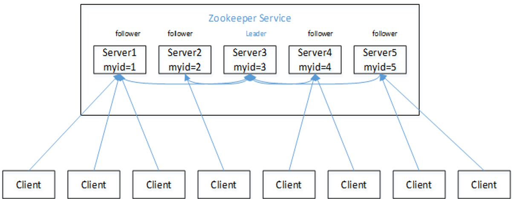

1. 一个领导者(Leader)，多个跟随者(Follower)组成的集群；

2. 集群中只要有半数以上节点存活，集群就能正常服务；

3. 全局数据一致，每个server节点保存相同的数据副本，client无论连接到哪个server上，数据都是一样的；

4. 更新请求顺序执行，来自同一个Client的更新请求按其发送顺序依次珍惜；

5. 数据更新原子性，一次数据更新要么成功，要么失败

6. 实时性：在一定时间范围内，client能获取到最新数据

## 1.2.基本概念

### 1.2.1.集群角色

Leader：为客户端提供读和写服务

Follower：提供读服务，参与选举和“过半写成功”策略

Observer：提供读服务，不参与选择和“过半写成功”策略

### 1.2.2.会话(Session)

客户端和服务端之间的TCP长连接，在zookeeper客户端启动时候，就会与zk集群建议一个TCP连接，并与其通过心跳检测保持有效会话

### 1.2.3.数据节点(Znode)

zookeeper中，节点分为两类：第一类是构成集群的机器，称为机器节点；第二类则是数据模型中的数据单元，称为数据节点-Znode。zookeeper的数据模型跟标准的Unix文件系统非常类似，它没有目录和文件等概念，而是引用了一种叫做Znode的数据节点，每个数据都有一个唯一的路径，它自身可以保存数据，也可以挂载子节点。一个zookeeper的视图如下：

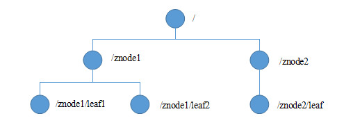

Znode类型可以分为3大类：持久节点(PERSISTENT)、临时节点(EPHEMERAL)、顺序节点(SEQUENTIAL)，具体可以组装成4种节点：

<table>
  <tr>
    <th>节点</th>
    <th>功能</th>
  </tr>
  <tr>
  	<td width='20%'>持久节点</td>
    <td>一旦该数据节点创建后，除非显式删除，否则会一直存在于zookeeper上</td>
  </tr>
  <tr>
  	<td>持久顺序节点</td>
    <td>在持久节点基础上增加顺序性，每个父节点会记录它的第一级子节点创建的先后顺序。zookeeper会自动为给定节点加一个数字后缀，其值上限为整型最大值</td>
  </tr>
  <tr>
  	<td>临时节点</td>
    <td>临时节点的生命周期与客户端会话绑定一起，一旦客户端会话失效(并不是TCP一断开)，临时节点就会被删除，zookeeper规定临时节点只能做叶子结点</td>
  </tr>
  <tr>
  	<td>临时顺序节点</td>
    <td>在临时节点的基础会记录每个一级子节点的创建顺序，为它们编号</td>
  </tr>
</table>

### 1.2.4.状态(Stat)

每个Znode除了保存用户的数据外，还会保存当前数据节点的所有状态信息，包括事务ID、版本信息和子节点个数等等，这个状态信息称为Stat。它具有如下的属性：

| **状态属性**   | **说明**                                                     |
| -------------- | ------------------------------------------------------------ |
| czxid          | 即Created ZXID，表示该数据节点被创建时的事务ID               |
| mzxid          | 即Modified ZXID，表示该数据节点最后一次被更新时的事务ID      |
| ctime          | 即Craeted Time，表示节点被创建的时间                         |
| mtime          | 即Modified Time，表示该节点最后一次被更新的时间              |
| version        | 数据节点的版本号                                             |
| cversion       | 子节点的版本号                                               |
| aversion       | 节点的ACL版本号                                              |
| ephemeralowner | 创建该临时节点的客户端会话的sessionID，如果该节点是持久节点，那么属性值为0 |
| dataLength     | 数据内容的长度                                               |
| numChildren    | 当前节点的子节点个数                                         |
| pzxid          | 表示该节点的子节点列表最后一次被修改时的事务ID。只有子节点列表变更了才会变更pzxid，子节点内容变更不会影响pzxid |

### 1.2.5.版本(Version)

当一个Znode被创建出来，它的version值为0，表示未被修改过；后续如果有客户端来修改，它的version就会累加1(即使这次修改操作没有改变Znode的数据内容，它的version也会累加1，强调的是修改次数)

### 1.2.6.事务(ZXID)

在zookeeper中，事务是指能够改变zookeeper服务器状态的操作，一般指：数据节点创建于删除、数据节点内容更新、客户端会话创建与失效等，对于每一个事务请求，zookeeper都会为其分配一个全局唯一的事务ID，称为ZXID

### 1.2.7.监听器(Watcher)

事件监听器，客户端可以在Znode上注册一些watcher，当相应的事件发生时，zookeeper服务端就会将事件通知给客户端

### 1.2.8.权限(ACL)

Access Control Lists，zookeeper采用ACL策略进行权限控制，并定义了以下5个权限：

1. Create：创建子节点的权限；

2. read：获取节点数据和子节点列表的权限

3. write：更新节点数据的权限

4. delete：删除子节点的权限

5. admin：设置ACL的权限

## 1.3.分布式特性

- **顺序一致性**：同一个客户端发起的事务请求，最终将会严格地按照其发起顺序被应用到zk；

- **原子性**：所有事务请求的处理结果在整个集群中所有机器上的应用情况是一致的，也就是说，要么整个集群所有机器都成功应用了某一个事务，要么都没有应用，一定不会出现集群中部分机器应用了事务，而另外一部分没有应用的情况；

- **单一视图**：无论客户端连接的是哪个zk服务器，其看到的服务端数据模型是一致的；
- **可靠性**：一旦服务端成功地应用了一个事务，并完成对客户端的响应，那么该事务所引起的服务端状态变更会一直保留下来，除非有另一个事务对齐进行了变更；
- **实时性**：zk的实时性具有一定的延迟性，仅仅保证在一定的时间段内，客户端最终一定能够从服务端上读取到最新的数据状态；

## 1.4.应用场景

zookeeper的应用场景丰富多彩，诸如：数据发布/订阅、分布式协调/通知、Master选举、负载均衡、分布式锁、分布式队列、统一命名服务、统一配置管理、统一集群管理和软负载均衡等。下面是具体运用场景的例子

### 1.4.1.统一命名服务

这种场景就是微服务下将服务注册到zookeeper上，对服务统一命名，便于识别。client通过节点路径定位服务，再定位它具体IP：

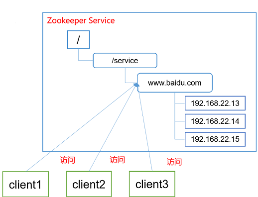

### 1.4.2.统一配置管理

统一配置管理，即“数据发布与订阅”，一般有两种设计模式：push(推)模式、pull(拉)模式。在一定规模的分布式系统中，集群内各个子系统的配置是十分繁多的，相互之间可能还有共享配置。如果使用磁盘保或本地内存保存配置，更改麻烦且不易扩展，此时可以将配置信息写入zookeeper的一个Znode上，客户端监听这个Znode，一旦数据被修改，zookeeper将通知各个客户端，保证修改后的配置文件信息可以快速同步到分布式集群的各个节点上。

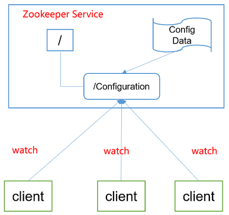

### 1.4.3.统一集群管理

所谓集群管理，包括集群监控和集群控制，前者侧重对集群各节点运行状态的手机，后者侧重对集群节点进行操作和控制。分布式环境中，实时掌握每个节点的状态是必要的，因为要根据节点实时状态做出一些调整。可以将节点信息写入zookeeper的一个Znode上，然后监听这个Znode获取它的实时状态变化

### 1.4.4.分布式协调|通知

每个微服务通过创建临时节点的方式注册到zookeeper上，zookeeper就会维持与它的心跳检测，一旦服务宕机，zookeeper就能感知到并通知监听的客户端

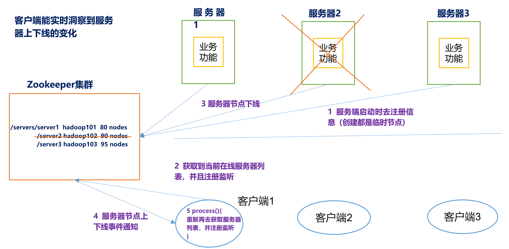

### 1.4.5.软负载均衡

在zookeeper中记录每台服务器的访问数，让访问数最少的服务器去处理最新的客户端请求：

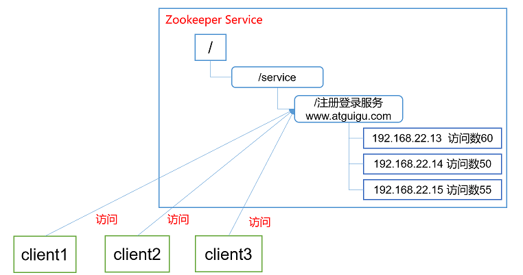

# 2.分布式一致性协议

分布式一致性，distributed Consensus，为了解决分布式环境中节点之间的数据一致性，在探索当中衍生多个优秀的协议，诸如2PC、3PC、Paxos协议、Raft协议以及zookeeper专用的ZAB协议

## 2.1.Paxos

Paxos算法是一种基于**消息传递**(分布式系统中的节点通信存在两种模型：共享内存（Shared memory）和消息传递（Messages passing）)且具有高度容错特性的一致性算法，是目前公认的解决分布式一致性问题最有效的算法之一，但是它推导过程和证明过程太过复杂，这里就记录它的核心思想。在paxos算法中，定义了3个角色：Proposer、Acceptor和Learner，其中

1. Proposer：相当于议员，由它发起法案给Acceptor投票，它自己不参与投票;

2. Acceptor：相当于议会，接收Proposer的法案，进行投票；

3. Learner：既不发起法案也不参与投票，相当于会议的记录员。

### 2.1.1.第一阶段

1. Proposer选择一个提案编号N，然后向半数以上的Acceptor发送编号为N的Prepare请求:

2. 如果一个Acceptor收到一个编号为N的Prepare请求，且N大于该Acceptor已经响应过的所有Prepare请求的编号，那么它就会将它已经接受过的编号最大的提案（如果有的话）作为响应反馈给Proposer，同时该Acceptor承诺不再接受任何编号小于N的提案。

### 2.1.2.第二阶段

1. 如果Proposer收到半数以上Acceptor对其发出的编号为N的Prepare请求的响应，那么它就会发送一个针对[N,V]提案的Accept请求给半数以上的Acceptor。注意：V就是收到的响应中编号最大的提案的value，如果响应中不包含任何提案，那么V就由Proposer自己决定；

2. 如果Acceptor收到一个针对编号为N的提案的Accept请求，只要该Acceptor没有对编号大于N的Prepare请求做出过响应，它就接受该提案

## 2.2.Raft

Raft是从paxos衍生出来的，它减少了paxos难以理解且难以实现的算法思想，raft算法中集群的节点有3种状态：

| **状态**  | **作用**                                                     |
| --------- | ------------------------------------------------------------ |
| Follower  | 接受并持久化Leader同步的日志，在Leader告之日志可以提交之后，提交日志 |
| Candidate | Leader选举过程中的临时角色                                   |
| Leader    | 接受客户端请求，并向Follower同步请求日志，当日志同步到大多数节点上后告诉Follower提交日志 |

### 2.2.1.选举阶段

在一个Raft协议的集群中，所有的节点一开始都是处于follower状态，当它们在一段时间后没有收到leader节点发来的心跳包，就会转变为Candidate状态，这个时间段叫做election timeout(选举超时时间)，每个节点的选举超时时间被随机分配在150毫秒至300毫秒之间，选举超时时间越小的节点，就越快转变为一个Candidate节点，然后就会向集群中的其它节点发起投票请求，支持它成为新的leader，如下图所示：

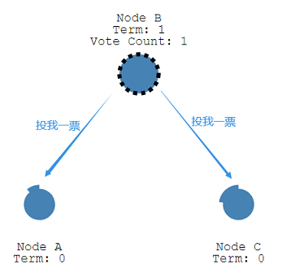

收到投票请求的其它节点，在一个周期内没有投票过，它就会把响应这次投票请求；发起投票请求的candidate节点收到集群内大部分的投票，它就从candidate状态升级为leader状态，成为leader节点

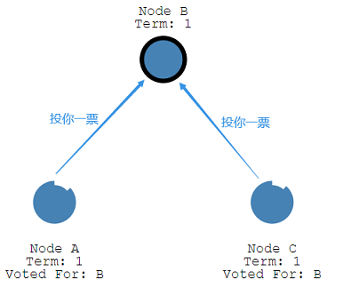

成为leader节点就会定时发送心跳包给其它follower节点，这个时间间隔称为：heartbeat timeout(心跳超时时间)，follower节点收到心跳包后就会响应leader节点，并重置自己的election timeout(选举超时时间)。此次选举就结束了，在周期Term1内，leader任期将持续到follower接收心跳超时并重新转换为candidate节点为止。

**可能出现的问题**：如果要是集群中两个及两个以上节点同时称为candidate节点，它们就会同时发出投票请求，恰好此时不同的follower投出了不同的支持票，导致每个candidate收到的票数不足以达到半数以上，则他们会重新进行随机的election timeout判断，谁先结束选举超时，谁就再发起投票请求

### 2.2.2.日志复制阶段

一旦一个节点成为了leader，那么该集群中所有更新请求都会经过它来处理，即使非leader节点收到了更新请求，它也会转发给leader去处理。leader收到客户端的更新请求，会将更新操作保存到自己的日志系统中，由于日志未提交，所以此次修改没有改变节点中的值

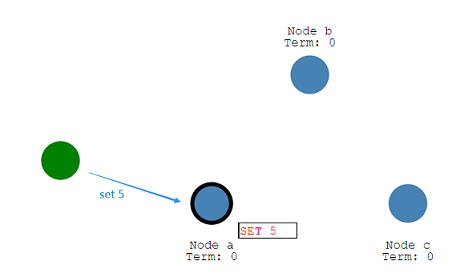

接着，leader就会将日志同步到集群中的其它follower节点上，此时，集群中的所有节点都是将值保存到日志中，暂未提交，如下图所示：

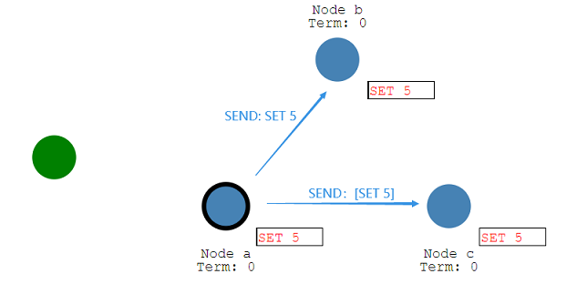

follower节点将leader发过来的同步请求保存到日志系统后，它就会响应回去，leader收到集群中半数以上的节点的正确响应，它就提交自己的日志，将值修改到节点内。此时[SET 5]这个操作在leader中就已经提交成功了，但是在follower中还处于日志记录阶段

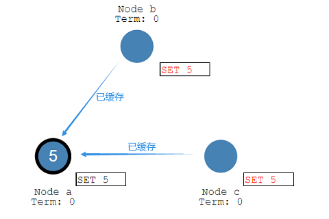

leader提交好数据后，它就会在发起一个请求，通知各个follower将他们的日志提交掉，这时候[SET 5]更新操作就已经同步成功，整个集群又处于数据一致状态

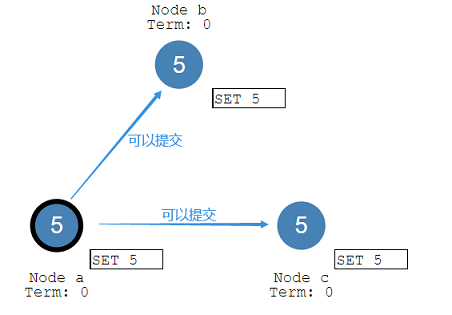

## 2.3.ZAB

zookeeper并没有采用paxos协议，而是使用了一种叫做Zookeeper Atomic Broadcast（zookeeper原子消息广播协议）的强一致性算法，它的原理其实和[Raft协议](#2.2.Raft)很相似，只不过一些概念不同罢了，它是专门为Zookeeper设计的支持崩溃恢复的原子消息广播算法。ZAB协议分为两个模式：崩溃恢复和消息广播，整个zookeeper集群就是在这两个模式下相互切换，协议的大致内容如下：

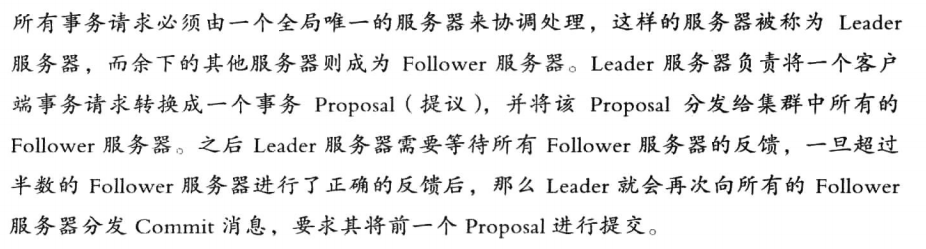

### 2.3.1.消息广播

zookeeper集群启动中，当一个节点收到半数以上节点的支持，它就会成为leader节点，而其它节点作为follower跟随它的命令，整个zookeeper集群就会进入消息广播阶段，等待客户端的请求。

1. zookeeper客户端向集群发起一个数据增删改操作，这个请求只会交由leader处理，若是请求由follower收到，它也会转发到leader节点；

2. leader会为这个请求生成对应的事务Proposal，并且为其分配一个全局单调递增的唯一ID，称为事务ID，即ZXID；

3. leader会将每一个事务Proposal按照其对应的ZXID的先后顺序进行排序后处理，具体做法就是为它管理的每个follower各自分配一个单独的队列，将事务Proposal依次入队，根据FIFO策略进行发送；

4. follower收到leader发来的事务请求Proposal，就会以事务日志写入到本地磁盘中，然后反馈leader一个Ack响应；

5. leader收到半数以上follower的Ack响应后，先自身提交事务，然后广播Commit消息给follower通知其提交事务，至此整个集群处于一致性

### 2.3.2.崩溃恢复

如果leader宕机，或因为网络延迟导致leader和follower失去联系，整个zookeeper集群就会进入崩溃恢复模式重新选举leader，这期间会有两个数据不一致情况的发生：

1. 事务在原leader提交了（意味着收到了半数以上follower的Ack响应），但它在将commit消息广播给follower之前就宕机了，这种情况，就要确保这个事务最终能在集群所有节点中都提交；

2. 原leader发出一个事务请求后，就宕机了，导致其他follower未收到此次事务请求，当原leader恢复过来并加入到集群时，就需要丢弃这个事务。

ZAB协议为了保证上面说的两种数据不一致情况，它会选举拥有最大ZXID的事务Proposal所在的那台机器，作为新的leader。这样可以保证新选举的leader一定具有所有已经提交的提案

### 2.3.3.数据同步

在前面崩溃恢复选举出新的leader后，此时的zookeeper集群并不能立刻开始工作（接收客户端的请求）它需要进行数据同步，针对崩溃恢复的两种数据不一致情况，分为不同的数据同步过程：

1. 新leader具有最大ZXID的事务Porposal，所以它需要将这个事务同步到各个follower中；新leader还会会为每个follower准备一个queue，将那些没有被follower同步的事务以Proposal消息的形式逐个发送，并在每个Proposal消息后紧接着发送Commit消息，让事务直接提交。当follower完成所有新leader发送的事务Proposal请求后，新leader就会将它加入到可用的follower列表，意味着该follower就与新leader保持一致

2. 新leader要让folloew丢弃旧leader周期内尚未提交的事务Proposal。这就需要ZXID来判断，ZAB协议中的ZXID是一个64位的数字，其低32位是一个单调递增的计数器，每当客户端发起更新数据请求，leader产生新的事务Proposal时，就会将这个计数器加1；而ZXID的高32位表示当前leader周期epoch的编号，每当选举出新leader，就会从新leader取出最大编号的ZXID，解析出epoch值，对其加1作为新leader的epoch编号，将重置ZXID的低32位，这样就可以有效地区分出不同leader的不同事务请求。

3. 基于ZXID的设计策略，当一个包含了旧leader周期中尚未提交过的事务Proposal的服务器启动时，由于当前集群一定包含了更高epoch的事务Proposal，所以这台服务器的ZXID肯定不是最高，自然无法成为新leader。它只能作为follower会新leader的最大事务Proposal进行比对，其结果就是新leader要求它进行回退操作，回退到已被当前集群过半机器提交的最新的事务Proposal中

# 3.zookeeper原理分析

## 3.1.watcher机制

zookeeper提供了分布式数据的发布/订阅功能，能够让多个订阅者同时监听同一主题对象，当该对象自身状态发生变化了，通知所有订阅者。实现这一功能的底层就是zookeeper的watcher机制，它的大体流程为：

1. zookeeper客户端向服务端注册一个watcher，并将它保存到本地watchManager；

2. zookeeper服务端对应事件发生了，向客户端发起网络请求，通知它；

3. zookeeper客户端收到服务端通知后，从本地watcherManager取出对应的watcher执行回调

### 3.1.1.核心接口

org.apache.zookeeper.Watcher是整个watcher机制的核心接口：它包含2个枚举类KeeperState和EventType，分别表示通知状态和事件类型，还有一个abstract public void process(WatchedEvent event)方法执行回调

```java
public interface Watcher {
    /**
     * This interface defines the possible states an Event may represent
     */
    public interface Event {
        public enum KeeperState {
            @Deprecated
            Unknown (-1),
            Disconnected (0),
            @Deprecated
            NoSyncConnected (1),
            SyncConnected (3),
            AuthFailed (4),
            ConnectedReadOnly (5),
            SaslAuthenticated(6),
            Expired (-112);
        }
        /**
         * Enumeration of types of events that may occur on the ZooKeeper
         */
        public enum EventType {
            None (-1),
            NodeCreated (1),
            NodeDeleted (2),
            NodeDataChanged (3),
            NodeChildrenChanged (4);
        }
    }
```

KeeperState与EventType的含义和关联关系如下所示：

<table>
    <tr>
        <th>KeeperState</th>
        <th>EventType</th>
        <th>触发条件</th>
        <th>说明</th> 
    </tr>
    <tr>
    	<td rowspan="5">SyncConnected  (3) </td>
        <td>Node(-1)</td>
        <td>客户端与zk服务器成功建立会话</td>
        <td rowspan="5">此时客户端和zk服务器处于连接状态</td>
    </tr>
    <tr>
        <td>NodeCreate(1)</td>
        <td>Watcher监听的相应的数据节点被创建</td>
    </tr>
     <tr>
        <td>NodeDeleted(2)</td>
        <td>Watcher监听的相应的数据节点被删除</td>
    </tr>
    <tr>
        <td>NodeDataChanged(3)</td>
        <td>Watcher监听的相应的数据节点的数据内容发送变更</td>
    </tr>
    <tr>
        <td>NodeChildrenChanged(4)</td>
        <td>Watcher监听的相应的数据节点的子节点列表发送变更</td>
    </tr>
    <tr>
    	<td>Disconnected(0)</td>
        <td>None(-1)</td>
        <td>客户端与zk服务器断开连接</td>
        <td>此时客户端与服务器处于断开连接状态</td>
    </tr>
    <tr>
    	<td>Expired(-112)</td>
        <td>Node(-1)</td>
        <td>会话超时</td>
        <td>此时客户端会话失效，同时会收到SessionExpireException异常</td>
    </tr>
    <tr>
    	<td>AuthFailed(4)</td>
        <td>Node(-1)</td>
        <td>两种情况：1.错误的scheme进行权限检查；2.SASL权限检查失败</td>
        <td>收到AuthFailedException异常</td>
    </tr>
</table>

注意：

1. NodeDataChanged事件：不管数据节点的数据内容是否改变(可能修改的内容跟原先一样)，zk服务器都会发起通知，并且修改该节点的version值；

2. NodeChildrenChanged事件：只有监听的数据节点的子节点列表发送变化，诸如增加、删除子节点才会发起通知，如果修改子节点的内容是没有通知的；

3. AuthFailed状态：当创建数据节点使用了ACL权限，若使用错误权限的客户端访问就会出现这个通知，不过要区分情况，例如：

```java
// 使用scheme为“user”,权限为“add”的zookeeper客户端创建的具有ACL权限的数据节点
zooKeeper.addAuthInfo("user", "add".getBytes());

// 如果使用相同的scheme，即也是“user”，但是用了不同的权限“del”，会收到异常
// NoAuthException，但zk服务器不会发起通知
zooKeeper.addAuthInfo("user", "del".getBytes());

// 如果scheme不一样了，使用这个zookeeper客户端操作具有ACL权限的数据节点，会收到异常
// AuthFailedException，同时收到zk服务器发起的回调通知(AuthFailed,Node)事件
zooKeeper.addAuthInfo("user222", "add".getBytes());

```

### 3.1.2.客户端

在zookeeper的Watcher机制中，客户端需要实现两个功能，一个是将用户设置的监听器注册到zk服务器上；另一个就是接收zk服务器的通知，执行watcher的回调。

#### 3.1.2.1.注册watcher

clientPath 就是我们要查找的数据节点的路径

#### 3.1.2.2.请求头

```java
public class RequestHeader implements Record {
    // xid用来记录客户端请求发起的先后序号，用于确保单个客户端请求的响应顺序  
    private int xid;

    // 代表请求的操作类型，值类型为：org.apache.zookeeper.ZooDefs.OpCode
    private int type;
}
```

### 3.1.3.服务端


## 3.2.启动流程

### 3.2.1.单机启动

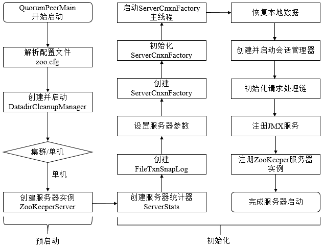

### 3.2.2.集群启动

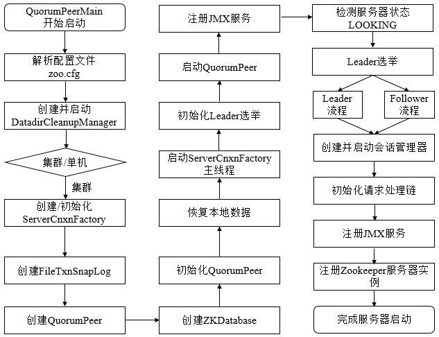

## 3.3.选举机制

在zookeeper集群中，有两种情况需要执行选举流程，选出leader服务器：

1. zookeeper集群刚刚启动的时候；
2. zookeeper集群运行中leader服务器宕机了，需要重新选出leader服务器；

zookeeper集群服务器的运行状态由org.apache.zookeeper.server.quorum.QuorumPeer.ServerState决定：

```java
public enum ServerState {
    // 当开始leader选举时，集群中的每个服务器节点都会处于 LOOKING 状态
    LOOKING,
    
    // Follower服务器的运行状态
    FOLLOWING,
    
    // Leader服务器的运行状态
    LEADING,
    
    // Observer服务器的运行状态
    OBSERVING
}
```

zookeeper的选举过程是通过多次投票实现的，投票信息由org.apache.zookeeper.server.quorum.Vote定义：

```java
public class Vote {
    private final int version;
	
    // 被推举的Leader的SID值，即指定当前这个票Vote要投给的服务器的ID
    private final long id;
	
    // 被推举的Leader的事务ID
    private final long zxid;

    // 逻辑时钟，用来判断多个投票是否在同一轮选举周期中。此值在zookeeper服务端
    // 是一个自增序列，每次进入新一轮的投票后，此值都会加1
    private final long electionEpoch;

    // 被推举的Leader的epoch
    private final long peerEpoch;
    
    // 发出此投票信息的服务器的状态
    private final ServerState state;
}
```

zookeeper集群的选举过程其实就是各个服务器比比较ZXID和SID的过程，SID是单个zookeeper服务器的唯一标识，它的值与配置文件的myid一致，ZXID是当前服务器处理完成的最大事务ID；因此可以简单地将投票信息表示为(1,0)，1表示服务器SID为1,0表示服务器的ZXID为0。

### 3.3.1.启动时选举

假设有3台zookeeper服务器节点组成集群，它们的编号为①②③，对应的SID依次为1、2、3，它们在启动时的选举过程如下：

1. 集群服务器启动，所有zookeeper节点都处于LOOKING运行状态，并向其它节点发送消息，这个消息就是投票信息Vote，它会给出两个最基本的信息：被选举的Leader的SID和ZXID；
2. 集群刚启动，每个zookeeper节点不知道其它节点的状态信息，所以都会投票给自己；而且由于是刚启动，未处理过任何[事务](#1.2.6.事务(ZXID))，所以它们的ZXID都为0，投票信息如下：
   - ①给出的Vote信息：（1,0）
   - ②给出的Vote信息：（2,0）
   - ③给出的Vote信息：（3,0）
3. 发出投票消息的同时，也会收到其它zookeeper节点发出的Vote信息，就会通过SID和ZXID比较来决定是否要变更自己的投票；比较的规则是：优先比较ZXID，值最大的推举为Leader；ZXID相同的情况下，比较SID，其值最大的推举为Leader。各个服务器的投票变更情况如下：
   - ①收到两个投票信息(2,0)和(3,0)，由于(3,0)这个投票信息的SID大于自己，变更投票为(3,0)并重新发出；
   - ②收到两个投票信息(1,0)和(3,0)，由于(3,0)这个投票信息的SID大于自己，变更投票为(3,0)并重新发出；
   - ③收到两个投票信息(1,0)和(2,0)，发现它们的SID没有自己的大，因此不需要做任何变更。

4. 经过第二次的投票后，集群中的每个zookeeper节点会收到其它节点的投票，然后开始统计投票。若一台机器收到了超过半数的投票，那么这个投票对应的SID机器就成为了Leader，很明显，节点③会成为此次选举过程的Leader，它会更改状态LEADING，其它节点如果是follower就变更状态为FOLLOWING。

### 3.3.2.宕机时选举

宕机时选举跟[启动时选举](#3.3.1.启动时选举)其实大同小异，最大的区别就是运行时的zookeeper集群各个节点的事务ID可能不一样。假设有zookeeper集群服务器5台①②③④⑤，它们的SID依次为1,2,3,4,5，其中⑤节点为Leader。某一时刻，②和⑤服务器宕机，①③④服务器会由于没有Leader的心跳包，会变更状态为LOOKING，即开始新的选举：

1. 集群的zookeeper节点不知道其它节点的状态，仍然会投票给自己，Vote信息如下：
   - ①的ZXID假设为4，它发出的投票信息为(1,4)，1是它自己的SID；
   - ③的ZXID假设为3，他发出的投票信息为(3,3)，3是它自己的SID；
   - ④的ZXID假设为3，它发出的投票信息为(4,3)，4是它自己的SID；

2. zookeeper节点发出投票后也会收到其它节点的Vote信息：
   - ①收到(3,3)和(4,3)，发现它们的ZXID都为3，而自己的ZXID为4，所以不会变更当前投票内容；
   - ③收到(1,4)和(4,3)，发现(1,4)这个票数的ZXID比其它票数和自己的ZXID大，变更投票为(1,4)；
   - ④收到(1,4)和(3,3)，发现(1,4)这个票数的ZXID比其它票数和自己的ZXID大，变更投票为(1,4)；

3. 经过第二次的投票后，集群中的每个zookeeper节点会收到其它节点的投票，然后开始统计投票。若一台机器收到了超过半数的投票，那么这个投票对应的SID机器就成为了Leader，很明显，节点①会成为此次选举过程的Leader，就会成为新一轮的节点；
4. 如果此时节点②和⑤重启成功，由于有新的Leader被选举出来，所以它们会作为Follower与①同步数据。

# *.zookeeper配置

Zookeeper中的配置文件zoo.cfg中参数含义解读如下：

- tickTime=2000

通信心跳数，Zookeeper服务器与客户端心跳时间，单位毫秒；也就是每个tickTime时间就会发送一个心跳，时间单位为毫秒。它用于心跳机制，并且设置最小的session超时时间为两倍心跳时间。(session的最小超时时间是2*tickTime)

- initLimit =10：

LF初始通信时限。集群中的Follower跟随者服务器与Leader领导者服务器之间初始连接时能容忍的最多心跳数（tickTime的数量），用它来限定集群中的Zookeeper服务器连接到Leader的时限

- syncLimit =5

③syncLimit =5

LF同步通信时限。集群中Leader与Follower之间的最大响应时间单位，假如响应超过syncLimit * tickTime，Leader认为Follwer死掉，从服务器列表中删除Follwer

- dataDir：数据文件目录+数据持久化路径，主要用于保存zk中的数据

④dataDir：数据文件目录+数据持久化路径，主要用于保存zk中的数据

- clientPort =2181：客户端连接端口，监听客户端连接的端口。