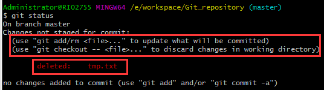

# 1.Git简介

Git是一个开源的分布式版本控制系统，用于敏捷高效地处理任何或小或大的项目。Git 是 Linus Torvalds 为了帮助管理 Linux 内核开发而开发的一个开放源码的版本控制软件。Git 与常用的版本控制工具 CVS，Subversion 等不同，它采用了分布式版本库的方式，不必服务器端软件支持。

## 1.1.基本概念：

### 1.1.1.工作区

新建一个文件夹，并执行`git init`命令，则此文件夹就成为git的工作区。每次对工作区的文件进行修改后保存，在没有执行`git add`命令之前，对git来说，只是算工作区的内容改变了

### 1.1.2.暂存区

Git和其他版本控制系统如SVN的不同之处在git有"暂存区"的概念。在工作区中有一个隐藏目录`.git`，它是Git的版本库。版本库里存了很多东西，其中最重要的就是称为`stage`（或者叫index）的暂存区，还有Git为我们自动创建的第一个分支master，以及指向master的一个指针叫HEAD


当把文件往Git版本库里添加的时候，是分两步执行的：

1. `git add`添加文件，实际上就是把文件修改添加到暂存区(图上的stage区)

2. `git commit`提交更改，即把暂存区的所有内容提交到当前分支(图上master区)因为我们创建Git版本库时，Git自动为我们创建了唯一一个master分支，所以，现在，git commit就是往master分支上提交更改

### 1.1.3.总结

- 工作区、暂存区、当前master

- 工作区文件，修改后ctrl+s保存，就是工作区的文件内容改变了，

- 执行`git add`命令后，把工作区的文件保存到暂存区，暂存区内容变了

- 执行`git commit`命令后，暂存区的内容保存到master，master内容变了

## 1.2.安装

git安装可以查百度，本次笔记是安装在windows上，安装完以后需要配置：

```ba
git config --global user.name ""
git config --global user.email ""
```

为Git是分布式版本控制系统，所以，每个机器都必须自报家门：名字和Email。注意`git config`命令的`--global`参数，用了这个参数，表示这台机器上所有的Git仓库都会使用这个配置，也可以对某个仓库指定不同的用户名和Email

# 2.基本用法

所有的版本控制系统，只能跟踪文本文件的改动，比如TXT文件，网页，所有的程序代码等等，Git也不例外，而图片、视频这些二进制文件，虽然也能由版本控制系统管理，但没法跟踪文件的变化，只知道图片从100KB改成了120KB，但到底改了啥，版本控制系统不知道，也没法知道 (Microsoft的word文档就是二进制格式，Git无法跟踪word文件改动)

## 2.1.创建版本库

版本库又名仓库，英文名repository，可以简单理解成一个目录，这个目录里面的所有文件都可以被Git管理起来，每个文件的修改、删除，Git都能跟踪，以便任何时刻都可以追踪历史，或者在将来某个时刻可以“还原”

1. 新建一个文件夹，通过`git init`命令把这个目录变成Git可以管理的仓库。进入该目录，右击选择Git Bash Here， 输入“git init”就可以将该文件夹设置为仓库。创建完是一个空的仓库（empty Git repository），可以发现当前目录下多了一个`.git`的目录，这个目录是Git来跟踪管理版本库的（千万别去改动），若没有看到`.git`目录，是因为该目录默认隐藏，linux下用`ls -ah`命令即可看见。

## 2.2.增、删、改

向git版本库中添加新文件、修改文件时，会使用到`git  add`和`git  commit`命令！如果删除文件，可能还会额外使用到`git  rm`命令！

### 2.2.1.添加文件

1. 向版本库的目录中添加若干个新文件。此时文件只是保存在工作区，需要通过`git  add`命令将这些新文件添加到暂存区，如：
   - 添加单个文件，命令：`git  add  <文件名>`
   - 添加多个文件，命令：`git  add  .`

2. 将新增的文件提交到git的暂存区后，接着使用`git commit`命令把新增文件提交到版本库，此命令需要携带参数“-m”表示此次提交的简要内容：

### 2.2.2.修改文件

1. 修改文件后，可以先使用`git  status`命令查看git工作区和暂存区的不同，了解仓库当前的状态：git给出的信息是test.txt被修改过，但还没有被提交

   

2. 知道哪个文件被修改后，如果想知道具体被修改哪几个地方，可以使用`git  diff`命令，它会将文件在工作区和暂存区的区别显示出来：

   

   git提示： 少了一句：`hello i`am be undefied at 2017/12/31`

   ​        		 多了一句：`+hello i`am be undefied at 2017/12/31 unbelieveable`

   ​       		（实际上，这两句话就是多了一个unbelieveable单词）

3. 确定文件修改有效，就要把修改后的文件提交，同样先使用`git add`命令保存到暂存区，命令：`git add -u`

4. 最后使用`git commit`将修改后的文件保存到git版本库内。提交后，再次使用`git status`查看仓库的状态，git提示：没有要提交的文件且工作树是干净的

### 2.2.3.删除文件

1. 删除文件后，先使用`git status`命令查看哪些文件被删除

   

2. 文件此时在工作区中被删除，但是暂存区仍然存在，所以需要使用`git rm` (单个删除)或者使用`git add -A`(批量删除)，先提交到暂存区中

   

   

3. 最后使用`git commit`命令将修改后的文件保存到git版本库内即可

## 2.3.撤销操作

### 2.3.1.撤销修改

如果文件修改后想撤销，可以使用`git checkout -- <file>`和`git reset HEAD <file>`命令，分为以下四种情况：

①工作区文件修改，未提交到暂存区；

②工作区文件修改，已提交到暂存区；

③已提交到暂存区后，工作区文件又修改

④文件修改后，不仅add到暂存区，且commit到版本库

**解决步骤：**

1. 第①和③种情况，可以用`git checkout -- <file>`命令撤销：若文件修改后未被add到暂存区，撤销修改到与版本库一样，若add到暂存区后又被修改，撤销到跟暂存区一样

2. 第②种情况，`git reset HEAD <file>`可以把暂存区的修改撤销掉，重新返回到工作区

3. 第④种情况，可以用版本回退命令`git reset --hard <版本号>`切换版本

**注意：**

1. `git checkout -- file`命令中的`--`很重要，没有`--`，就变成了“切换到另一个分支”的命令，后面的[分支管理](#_分支管理)中会再次遇到`git checkout`命令
2. `git reset`命令既可以回退版本，也可以把暂存区的修改回退到工作区。当用HEAD时，表示最新的版本

### 2.3.2.撤销删除

误删了，可以使用`git  checkout`命令从版本库中找回，其实是用版本库里的版本替换工作区的版本，无论工作区是修改还是删除，都可以一键还原

## 2.4.查看日志

`git log`命令显示从最近到最远的提交日志，如果输出信息太多，看得眼花缭乱的，可以试试加上`--pretty=oneline`参数


每一行巨大的数字是`commit id`（版本号），和SVN不一样，Git的`commit id`不是1，2，3...递增的数字，而是一个SHA1计算出来的一个非常大的数字，用十六进制表示，为什么需要用这么一大串数字表示呢？因为Git是分布式的版本控制系统，后面还要研究多人在同一个版本库里工作，如果大家都用1，2，3……作为版本号，那肯定就冲突了！

## 2.5.切换以前版本

在Git中，HEAD有特殊的含义：

①用HEAD表示当前版本，也就是**最新的提交**

②用HEAD^表示上一个版本，

③用HEAD^^表示上上一个版本，

**注意：**如果退回的版本过久，比如退到前100个版本，可以这样写HEAD~100

1. `git reset`命令用来将代码或文件重置到前面的版本，语法为：`git reset --hard [版本代号]`

2. 如果后悔了，最新版本的还想重新找回来，可以继续使用`git reset`命令但是需要git的版本号(就是用git log查看日志时那一大串数字)，语法为：`git reset --hard [commit ID]`版本号没必要写全，前几位就可以了，Git会自动去找。当然也不能只写前一两位，因为Git可能会找到多个版本号，就无法确定是哪一个了；
3. `git reflog`命令用来记录每一次命令，通过命令日志也可以获取版本号，然后又可以重新定位到想去的版本。

Git的版本回退速度非常快，因为Git在内部有个指向当前版本的HEAD指针，当你回退版本的时候，Git仅仅是把HEAD从指向append GPL改为指向 add distributed，如下图所示：


## 2.6.总结

- 初始化一个Git仓库，使用`git init`命令

- 随时掌握工作区的状态，使用`git status`命令

- 使用`git diff`可以查看修改内容

- HEAD指向的版本就是当前版本，因此，Git允许我们在版本的历史之间穿梭，使用命令`git reset --hard [commit_id]`

- 穿梭前，用`git log`可以查看提交历史，以便确定要回退到哪个版本

- 要重返未来，用git reflog查看命令历史，以确定要回到未来的哪个版本

- 修改工作区某个文件的内容，想直接丢弃工作区的修改时，用命令`git checkout -- file`；不仅修改了工作区某个文件的内容，还添加到了暂存区，想丢弃修改，分两步，第一步用命令git reset HEAD file将暂存区的修改回退到工作区，第二步，再用命令`git checkout -- file`丢弃工 作区修改

- `git add`命令的3个不同参数，3种不同用法：

  - `git add –u`等价于 `git add -update`，提交所有被删除和修改的文件到数据暂存区

  - `git add . `，提交所有修改的和新建的数据暂存区

  - `git add –A 等价于 git add -all`，提交所有被删除、被替换、被修改和新增的文件到数据暂存区

# 3.远程仓库

GitHub，这个网站就是提供Git仓库托管服务的，所以，只要注册一个GitHub账号，就可以免费获得Git远程仓库。由于本地Git仓库和GitHub仓库之间的传输是通过SSH加密的，所以需要设置：

## 3.1.连接github

1. 创建SSH Key。在用户主目录下，看看有没有.ssh目录，如果有，再看看这个目录下有没有`id_rsa`和`id_rsa.pub`这两个文件，如果已经有了，可直接跳到第②步。如果没有，打开Git Bash，创建SSH Key

   ```bash
   ssh-keygen -t rsa -C "自己邮箱"
   ```

   执行上面的命令，把邮件地址换成自己的邮件地址，一路回车，使用默认值即可，成功的话可以看到git给出的完整信息：

   

   如果一切顺利的话，可以在用户主目录里找到.ssh目录，里面有`id_rsa`和`id_rsa.pub`两个文件，这两个就是SSH Key的秘钥对，id_rsa是私钥，不能泄露出去，id_rsa.pub是公钥，可以放心地告诉任何人

2. 登陆GitHub，打开settings页面，选择带有“SSH”字样的标签页。然后，点"Add SSH Key"，填上任意Title，在Key文本框里粘贴id_rsa.pub文件的内容：

   

   为什么GitHub需要SSH Key呢？因为GitHub需要识别出你推送的提交确实是你推送的，而不是别人冒充的，而Git支持SSH协议，所以，GitHub只要知道了你的公钥，就可以确认只有你自己才能推送。当然，GitHub允许你添加多个Key。假定你有若干电脑，你一会儿在公司提交，一会儿在家里提交，只要把每台电脑的Key都添加到GitHub，就可以在每台电脑上往GitHub推送了

   如果你不想让别人看到Git库，有两个办法，让GitHub把公开的仓库变成私有的，这样别人就看不见了（不可读更不可写）。另一个办法是自己动手，搭一个Git服务器，因为是你自己的Git服务器，所以别人也是看不见的。这个方法我们后面会讲到的，相当简单，公司内部开发必备。

## 3.2.添加到远程库

本地创建了一个Git仓库后，又想在GitHub创建一个Git仓库，并且让这两个仓库进行远程同步，这样GitHub上的仓库既可以作为备份，又可给别人使用

1. 先到github，创建新仓库，仓库名和本地仓库的名称一样，其他选项保持默认

2. 根据GitHub的提示，在本地仓库下运行命令。添加后，远程库的名字就是`origin`，这是Git默认的叫法，也可以改成别的，建议是就叫origin。执行命令：`git remote add origin git@github.com:<用户名>/<仓库名>`

3. 把本地库的所有内容推送到远程库上，执行命令：`git push -u origin master`
4. 用`git push origin master`命令就可以同步本地库的文件到github上

把本地库的内容推送到远程，用`git push`命令，实际上是把当前分支master推送到远程。由于远程库是空的，我们第一次推送master分支时，加上了`-u`参数，Git不但会把本地的master分支内容推送的远程新的master分支，还会把本地的master分支和远程的master分支关联起来，在以后的推送或者拉取时就可以简化命令

## 3.3.从远程库克隆

如何从github克隆一个仓库到本地？使用`git clone`命令从远程库克隆到本地仓库，语法：`git clone git@github.com:<用户名>/<仓库名>`。 Git支持多种协议，默认的git://使用ssh，也可以使用https等其他协议使用https除了速度慢以外，还有个最大的麻烦是每次推送都必须输入口令

## 3.4.总结

- 要关联一个远程库，使用命令`git remote add origin git@server-name:path/repo-name.git`

- 关联后，使用命令`git push -u origin master`第一次推送master分支的所有内容
- 此后，每次本地提交后，就可以使用命令`git push origin master`推送最新修改

- 要克隆一个仓库，首先必须知道仓库的地址，然后使用`git clone`命令克隆，Git支持多种协议，包括https，但通过ssh支持的原生git协议速度最快

# 4.分支管理

## 4.1.何为分支

每次commit提交，Git都把文件快照串成一条时间线，这条时间线就是一个分支。在Git里，这个分支叫主分支，即master分支。HEAD严格来说不是指向提交，而是指向当前分支，master才是指向提交的，一开始的时候，master分支是一条线，Git用master指向最新的提交，再用HEAD指向master，就能确定当前分支，以及当前分支的提交点


每次提交，master分支都会向前移动一步，这样随着不断提交，master分支的线也越来越长；当创建新的分支，例如dev时，Git新建了一个指针叫dev，指向master相同的提交，再把HEAD指向dev，就表示当前分支在dev上


Git创建一个分支很快，因为除了增加一个dev指针，改改HEAD的指向，工作区的文件都没有任何变化！而其他版本控制系统，则完全拷贝了一份工作区，耗时多少取决于工作区内文件的大小。不过，从现在开始，对工作区的修改和提交就是针对dev分支，比如新提交一次后，dev指针往前移动一步，而master指针不变：


如果我们在dev上的工作完成了，就可以把dev合并到master上。Git怎么合并呢？最简单的方法，就是直接把master指向dev的当前提交，就完成了


所以Git合并分支也很快！就改改指针，工作区内容也不变！合并完分支后，甚至可以删除dev分支。删除dev分支就是把dev指针给删掉，删掉后，我们就剩下了一条master分支：


## 4.2.创建与合并分支

1. 创建并切换分支， `git checkout -b <分支名>`命令创建并切换分支，其相当于下面2条命令：

   ```bash
   git branch dev ##创建分支
   git checkout dev ##切换分支
   ```

   然后，可以用`git branch`命令查看当前分支，现在所有的文件修改，都会在dev分支上保存，而master分支保持原样

   

2. 合并分支，当dev分支上的任务完成以后，就可以将master和dev合并`git merge`命令用于合并指定分支到当前分支。首先，使用`git checkout master`命 令切换到master分支,然后就可以合并了

   

   注意到上面的Fast-forward信息，Git告诉我们，这次合并是“快进模式”，也就是直接把master指向dev的当前提交，所以合并速度非常快。当然，也不是每次合并都能Fast-forward，后面会讲其他方式的合并。合并完成后，就可以放心地删除dev分支了：

   - 使用`git branch -d <分支名>`可以删除分支(分支已合并)

   - 使用`git branch -D <分支名>`可以删除分支(分支未合并，强制删除)

   - 使用`git branch`可以查看分支列表

## 4.3.冲突解决

当在原来的master分支上，创建一条新分支后，2条分支都对同一个文件进行修改且commit，这种情况下，Git无法执行“快速合并”，只能试图把各自的修改合并起来，但这种合并就可能会有冲突：


git告诉我们，自动合并失败，需要先解决冲突在提交。这时候可以直接打开tmp.txt文件，git有提示信息在里面：


Git用`<<<<<<<`，`=======`，`>>>>>>>`标记出不同分支的内容，这时候我们需要手动修改tmp.txt文件，看是要保留master分支上的数据还是保留other分支上的数据，修改后重新提交即可。现在，master分支和other分支变成了下图所示:


用带参数的`git log`也可以看到分支的合并情况：


然后再把other分支删掉就行，还记得命令吧？git branch -d other

## 4.4.分支管理策略

合并分支时，Git默认使用Fast forward模式，这种模式在删除分支后，会丢掉分支信息。如果要禁用Fast forward模式，Git就会在merge时生成一个新的commit，这样，从分支历史上就可以看出分支信息。

在实际开发中，应该按照几个基本原则进行分支管理：首先,master分支应该是非常稳定的，仅用来发布新版本，平时不能在上面干活；然后,干活都在dev分支上，相当于，dev分支是不稳定的，到某个时候，比如1.0版本发布时，再把dev分支合并到master上，在master分支发布1.0版本；

团队每个人都在dev分支上干活，每个人都有自己的分支，时不时地往dev分支上合并就可以了。所以，团队合作的分支看起来就像这样：


## 4.5.储藏分支

在Git中，由于分支是如此的强大，所以每个bug都可以通过一个新的临时分支来修复，有这样一种场景：当接到一个修复代号为101的bug的任务时，很自然地，你想创建一个分支issue-101来修复它，但是，当前正在dev上进行的工作还没有提交，此时工作只进行到一半，还没法提交，又不得不先修复bug，很荣幸，git考虑到这种情况并提供了一个`stash`功能，可以把当前工作现场“储藏”起来，等以后恢复现场后继续工作。例如：

1. 现在有任务做到一半，还不能提交

   

2. 但是要转去做其他任务，所以就要使用git stash命令来保存当前工作状态

   

3. 等其他任务做完了，切回来继续完成之前未完成的工作，有2种方式：

   - 用`git stash apply`恢复，但是恢复后，stash内容并不删除，需要用`git stash drop`来删除

   - 用`git stash pop`，恢复的同时把stash内容也删了

   

## 4.6.团队开发

当从远程仓库克隆时，实际上Git自动把本地的master分支和远程的master分支对应起来了，并且，远程仓库的默认名称是origin，要查看远程库的信息，用`git remote`，显示更详细信息，用`git remote -v`

### 4.6.1.推送分支

推送分支，就是把该分支上的所有本地提交推送到远程库。推送时，要指定本地分支，这样，Git就会把该分支推送到远程库对应的远程分支上：`git push origin master`，如果要推送其他分支，比如dev，就改成：`git push origin dev`

### 4.6.2.抓取分支

多人协作时，大家都会往master和dev分支上推送各自的修改，当我们从远程库clone时，默认情况下，只能看到本地的master分支。如果要在dev分支上开发，就必须创建远程origin的dev分支到本地。用这个命令创建本地dev分支：

```bash
git checkout -b dev origin/dev
```

开发时就可以把dev分支推送到远程库上：

```bash
git push origin dev
```

### 4.6.3.推送冲突

当其他开发人员的最新提交和你试图推送的提交有冲突，会导致推送失败


解决办法Git已经提示我们，先用git pull把最新的提交从origin/dev抓下来，然后本地合并，解决冲突，再推送。有时git pull也会失败，原因是没有指定本地dev分支与远程origin/dev分支的链接，根据提示，设置dev和origin/dev的链接：

```bash
 git branch --set-upstream dev origin/dev 
```

解决完以后就可以pull了，但是合并有冲突，需要手动解决，解决的方法和分支管理中的"冲突解决"完全一样。解决后，提交，再push

## 4.7.总结

- Git鼓励大量使用分支：

  -  查看分支：git branch

  - 创建分支：git branch <新分支名>

  - 切换分支：git checkout <分支名>

  - 创建+切换分支：git checkout -b <新分支名>

  - 合并某分支到当前分支：git merge <分支名>

  -  删除分支：git branch -d <分支名>

- 当Git无法自动合并分支时，就必须首先解决冲突。解决冲突后，再提交，才能完成合并。用git log --graph命令可以看到分支合并图
- 合并分支时，加上--no-ff参数就可以用普通模式合并，合并后的历史有分支，能看出来曾经做过合并，而fast forward模式无法看出曾经做过合并
- 当前工作未完成，先把工作现场git stash一下，然后去完成其他紧急的事，完成后，再git stash pop，回到工作现场
- 丢弃未被合并过的分支，可以通过`git branch -D <分支名>`强行删除
- 查看远程库信息，使用`git remote -v`

多人协作工作的模式通常是：

1. 用`git push origin <分支名>`推送自己的修改

2. 推送失败，需要先用`git pull`试图合并

3. 合并完用`git push origin <分支名>`推送，若合并有冲突，转④

4. 合并有冲突，解决冲突，本地提交后用`git push origin <分支名>`推送

5. 如果git pull提示“no tracking information”，说明本地分支和远程分支的链接关系没有创建，用命令： ` git branch --set-upstream <分支名> origin/<分支名>`

# 5.标签管理

发布一个版本时，通常先在版本库中打一个标签（tag），这样，就唯一确定了打标签时刻的版本。将来无论什么时候，取某个标签的版本，就是把那个打标签的时刻的历史版本取出来。所以，标签也是版本库的一个快照。Git的标签虽然是版本库的快照，但其实它就是指向某个commit的指针（跟分支很像对不对？但是分支可以移动，标签不能移动），所以，创建和删除标签都是瞬间完成的

Git有commit，为什么还要引入tag？

“请把上周一的那个版本打包发布，commit号是6a5819e...”

“一串乱七八糟的数字不好找！”

如果换一个办法：

“请把上周一的那个版本打包发布，版本号是v1.2”

“好的，按照tag v1.2查找commit就行！”

所以，tag就是一个让人容易记住的有意义的名字，它跟某个commit绑在一起

## 5.1.创建标签

1. 切换到需要打标签的分支上，然后用`git tag <name>`就可打一个新标签，还可以创建带有说明的标签，用-a指定标签名，-m指定说明文字：

   

   标签默认都是打在最新commit上，如果需要对历史commit打标签，先找到历史提交的commit ID，用`git tag <name> <id>`命令即可

   

2. 使用`git tag`命令可以查看所有标签：(注意标签显示是按字母排序)

3. 如果要查看某个标签的具体信息，可以用`git show <标签名>`命令

## 5.2.操作标签

1. 送标签，标签默认都是创建在本地，但也可以推送到远程库上

   ```bash
   git push origin <标签名>   #推送一个标签
   git push origin --tags     #推送所有未推送的标签
   ```

2. 本地删除标签，如果标签没有推送到远程，在本地删除标签很安全

   ```bash
   git tag -d <标签名>
   ```

3. 远程删除标签，如果标签上传到远程库，要先在本地删除标签，再去远程库删除

   ```bash
   git tag -d <标签名>
   git push origin :refs/tags/<标签名>
   ```

## 5.3.总结

- `git tag <name>`用于新建标签，默认为HEAD，也可指定一个commit id

- `git tag -a <tagname> -m "blablabla..."`可以指定标签信息

- `git tag -s <tagname> -m "blablabla..."`可以用PGP签名标签

- `git tag`可以查看所有标签

- `git push origin <标签名>`可以推送一个本地标签

- `git push origin --tags`可以推送全部未推送过的本地标签

- `git tag -d <标签名>`可以删除一个本地标签

- `git push origin :refs/tags/<标签名> `可以删除一个远程标签

# 6.搭建Gitlab

## 6.1.修改gitlab管理员密码

1. 连接搭建gitlab的服务器，输入以下命令：`gitlab-rails console`。登录GitLab的Rails控制台(GitLab使用RoR语言开发)

2. 使用命令`user = User.where(id: 1).first`定位到根管理员即root用户

3. 使用命令`user.password='<你的密码>'`更改root用户密码

4. 存修改，执行命令：`user.save!`

# 7.补充

## 7.1.删除缓存

语法：`git rm -r --cached <文件目录>`

例如：`git rm -r --cached .idea` ，删除.idea文件

## 7.2.代理配置

①配置全局代理：

```bash
git config --global http.proxy http://127.0.0.1:1080
git config --global http.proxy https://127.0.0.1:1080
```

②删除全局代理：

```bash
git config --global --unset http.proxy
git config --global --unset https.proxy
```